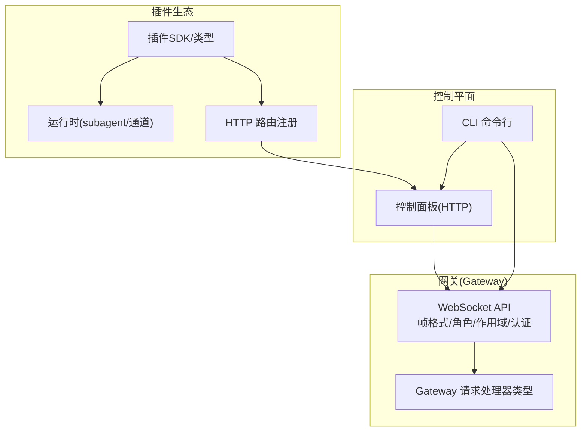
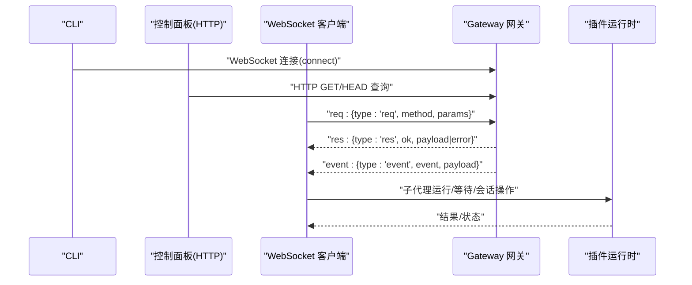
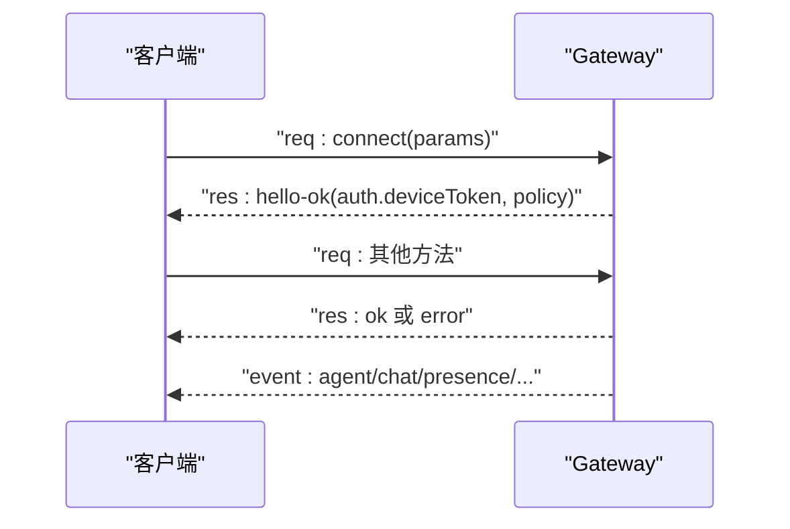
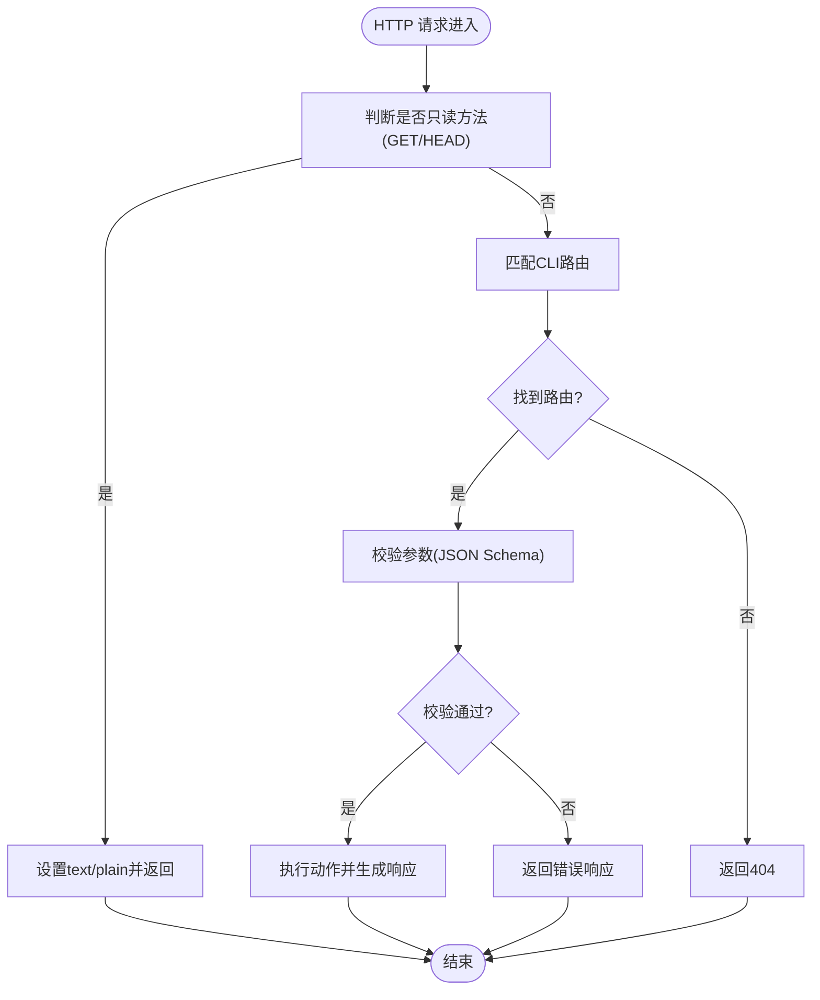
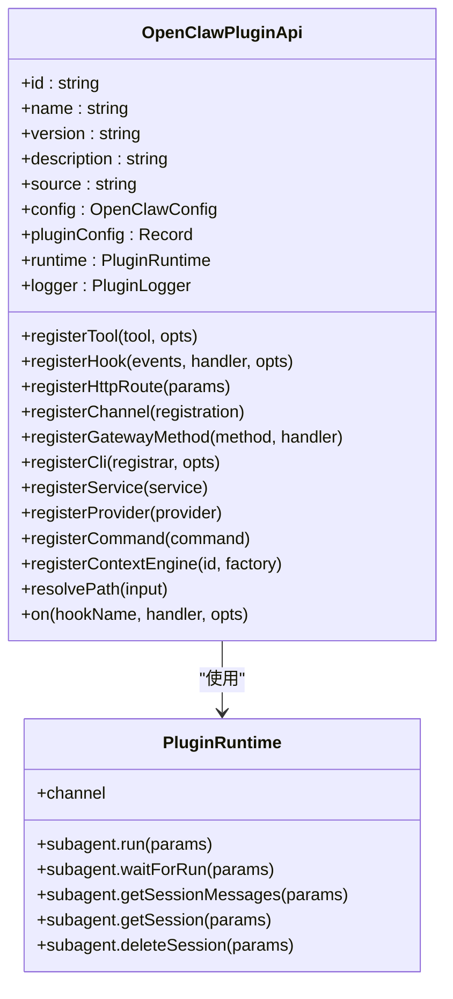
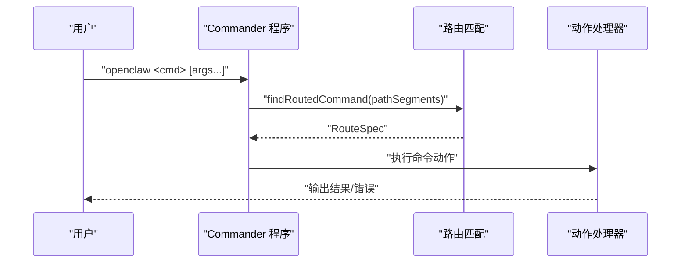
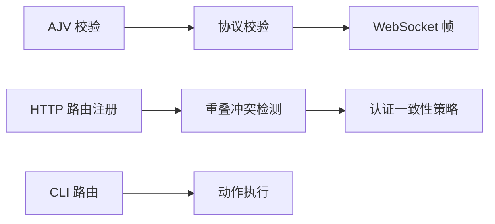

# API参考

<cite>
**本文引用的文件**
- [docs/zh-CN/gateway/protocol.md](file://docs/zh-CN/gateway/protocol.md)
- [docs/gateway/protocol.md](file://docs/gateway/protocol.md)
- [docs/zh-CN/concepts/architecture.md](file://docs/zh-CN/concepts/architecture.md)
- [docs/zh-CN/web/webchat.md](file://docs/zh-CN/web/webchat.md)
- [src/gateway/protocol/index.ts](file://src/gateway/protocol/index.ts)
- [src/gateway/server-methods/types.ts](file://src/gateway/server-methods/types.ts)
- [src/plugins/types.ts](file://src/plugins/types.ts)
- [src/plugins/runtime/types.ts](file://src/plugins/runtime/types.ts)
- [src/plugins/http-registry.ts](file://src/plugins/http-registry.ts)
- [src/gateway/control-ui-http-utils.ts](file://src/gateway/control-ui-http-utils.ts)
- [apps/macos/Tests/OpenClawIPCTests/GatewayWebSocketTestSupport.swift](file://apps/macos/Tests/OpenClawIPCTests/GatewayWebSocketTestSupport.swift)
- [apps/shared/OpenClawKit/Tests/OpenClawKitTests/GatewayNodeSessionTests.swift](file://apps/shared/OpenClawKit/Tests/OpenClawKitTests/GatewayNodeSessionTests.swift)
- [scripts/protocol-gen-swift.ts](file://scripts/protocol-gen-swift.ts)
- [docs/tools/plugin.md](file://docs/tools/plugin.md)
- [src/cli/program/routes.ts](file://src/cli/program/routes.ts)
- [src/cli/program/preaction.test.ts](file://src/cli/program/preaction.test.ts)
- [src/cli/program/command-registry.test.ts](file://src/cli/program/command-registry.test.ts)
- [src/test-utils/command-runner.ts](file://src/test-utils/command-runner.ts)
</cite>

## 目录
1. [简介](#简介)
2. [项目结构](#项目结构)
3. [核心组件](#核心组件)
4. [架构总览](#架构总览)
5. [详细组件分析](#详细组件分析)
6. [依赖关系分析](#依赖关系分析)
7. [性能考量](#性能考量)
8. [故障排查指南](#故障排查指南)
9. [结论](#结论)
10. [附录](#附录)

## 简介
本参考文档面向OpenClaw API系统，覆盖以下公共接口与能力：
- WebSocket API：Gateway网关的WebSocket协议、帧格式、角色与作用域、认证与错误处理。
- HTTP API：控制面板与CLI路由、HTTP方法与路径约定、响应与错误。
- 插件API：插件注册与生命周期、HTTP路由注册、运行时子代理能力、钩子扩展点。
- CLI API：命令注册、路由匹配与执行流程。

文档基于仓库内的协议规范、类型定义与测试样例，提供参数、返回值、错误码与交互流程的权威说明，并辅以可视化图示帮助理解。

## 项目结构
OpenClaw围绕“Gateway网关 + 插件生态 + CLI/控制面板”构建。WebSocket用于控制平面与节点通信，HTTP用于控制面板与CLI路由，插件通过SDK向运行时注册能力并扩展HTTP/Webhook。

图表来源
- [docs/zh-CN/concepts/architecture.md:19-40](file://docs/zh-CN/concepts/architecture.md#L19-L40)
- [src/gateway/protocol/index.ts:1-673](file://src/gateway/protocol/index.ts#L1-L673)
- [src/gateway/server-methods/types.ts:1-113](file://src/gateway/server-methods/types.ts#L1-L113)
- [src/plugins/types.ts:248-306](file://src/plugins/types.ts#L248-L306)
- [src/plugins/runtime/types.ts:51-64](file://src/plugins/runtime/types.ts#L51-L64)
- [src/plugins/http-registry.ts:12-92](file://src/plugins/http-registry.ts#L12-L92)

章节来源
- [docs/zh-CN/concepts/architecture.md:19-40](file://docs/zh-CN/concepts/architecture.md#L19-L40)

## 核心组件
- WebSocket协议与帧格式
  - 帧类型：请求(req)、响应(res)、事件(event)。
  - 角色：operator（控制平面）、node（节点）。
  - 作用域：operator.read、operator.write、operator.admin、operator.approvals、operator.pairing等。
  - 认证：连接令牌、设备令牌、作用域轮换与撤销。
- HTTP API与控制面板
  - 控制面板HTTP工具：只读方法判断、文本响应、404处理。
  - CLI路由：健康、状态、会话、模型、配置等路由匹配。
- 插件API
  - 注册入口：工具、钩子、HTTP路由、通道、网关方法、CLI、服务、提供者、命令、上下文引擎。
  - 运行时：子代理运行/等待/会话消息获取/删除，通道能力。
  - HTTP路由注册：路径规范化、重叠冲突检测、替换策略、认证级别约束。

章节来源
- [docs/zh-CN/gateway/protocol.md:73-154](file://docs/zh-CN/gateway/protocol.md#L73-L154)
- [docs/gateway/protocol.md:200-214](file://docs/gateway/protocol.md#L200-L214)
- [src/gateway/protocol/index.ts:1-673](file://src/gateway/protocol/index.ts#L1-L673)
- [src/gateway/server-methods/types.ts:17-113](file://src/gateway/server-methods/types.ts#L17-L113)
- [src/gateway/control-ui-http-utils.ts:1-15](file://src/gateway/control-ui-http-utils.ts#L1-L15)
- [src/cli/program/routes.ts:251-270](file://src/cli/program/routes.ts#L251-L270)
- [src/plugins/types.ts:248-306](file://src/plugins/types.ts#L248-L306)
- [src/plugins/runtime/types.ts:51-64](file://src/plugins/runtime/types.ts#L51-L64)
- [src/plugins/http-registry.ts:12-92](file://src/plugins/http-registry.ts#L12-L92)

## 架构总览
下图展示控制平面（CLI/控制面板）与Gateway网关之间的交互，以及插件如何通过SDK扩展HTTP/Webhook与运行时能力。

图表来源
- [docs/zh-CN/concepts/architecture.md:27-40](file://docs/zh-CN/concepts/architecture.md#L27-L40)
- [docs/zh-CN/gateway/protocol.md:131-154](file://docs/zh-CN/gateway/protocol.md#L131-L154)
- [src/gateway/protocol/index.ts:1-673](file://src/gateway/protocol/index.ts#L1-L673)
- [src/plugins/runtime/types.ts:51-64](file://src/plugins/runtime/types.ts#L51-L64)

## 详细组件分析

### WebSocket API
- 帧格式
  - 请求：{type:"req", id, method, params}
  - 响应：{type:"res", id, ok, payload|error}
  - 事件：{type:"event", event, payload, seq?, stateVersion?}
- 角色与作用域
  - operator：控制平面客户端（CLI/UI/自动化），具备读写/管理/审批/配对等作用域。
  - node：能力宿主（camera/screen/canvas/system.run）。
- 认证与设备令牌
  - 连接时校验令牌；配对后颁发设备令牌，包含角色与作用域；支持轮换/撤销。
  - 认证失败包含错误码与恢复建议，客户端需遵循重试与人工介入指引。
- 错误处理
  - 响应帧的error字段承载错误细节；测试用例提供鉴权失败帧构造示例。

图表来源
- [docs/zh-CN/gateway/protocol.md:73-154](file://docs/zh-CN/gateway/protocol.md#L73-L154)
- [docs/gateway/protocol.md:200-214](file://docs/gateway/protocol.md#L200-L214)
- [apps/macos/Tests/OpenClawIPCTests/GatewayWebSocketTestSupport.swift:55-87](file://apps/macos/Tests/OpenClawIPCTests/GatewayWebSocketTestSupport.swift#L55-L87)

章节来源
- [docs/zh-CN/gateway/protocol.md:73-154](file://docs/zh-CN/gateway/protocol.md#L73-L154)
- [docs/gateway/protocol.md:200-214](file://docs/gateway/protocol.md#L200-L214)
- [apps/macos/Tests/OpenClawIPCTests/GatewayWebSocketTestSupport.swift:55-87](file://apps/macos/Tests/OpenClawIPCTests/GatewayWebSocketTestSupport.swift#L55-L87)
- [apps/shared/OpenClawKit/Tests/OpenClawKitTests/GatewayNodeSessionTests.swift:104-138](file://apps/shared/OpenClawKit/Tests/OpenClawKitTests/GatewayNodeSessionTests.swift#L104-L138)
- [scripts/protocol-gen-swift.ts:203-247](file://scripts/protocol-gen-swift.ts#L203-L247)

### HTTP API（控制面板与CLI）
- 控制面板HTTP工具
  - 只读方法判定（GET/HEAD）。
  - 文本响应与404处理。
- CLI路由
  - 路由匹配：健康、状态、会话、代理、内存、配置、模型、技能、定时任务等。
  - 命令解析与动作执行：通过Commander注册命令，支持嵌套子命令与选项。
- 参数与返回
  - 路由参数通过JSON Schema校验，错误信息格式化输出。
  - 响应体遵循统一的错误形状与状态码约定。

图表来源
- [src/gateway/control-ui-http-utils.ts:1-15](file://src/gateway/control-ui-http-utils.ts#L1-L15)
- [src/cli/program/routes.ts:251-270](file://src/cli/program/routes.ts#L251-L270)
- [src/gateway/protocol/index.ts:424-458](file://src/gateway/protocol/index.ts#L424-L458)

章节来源
- [src/gateway/control-ui-http-utils.ts:1-15](file://src/gateway/control-ui-http-utils.ts#L1-L15)
- [src/cli/program/routes.ts:251-270](file://src/cli/program/routes.ts#L251-L270)
- [src/gateway/protocol/index.ts:424-458](file://src/gateway/protocol/index.ts#L424-L458)
- [src/cli/program/preaction.test.ts:80-129](file://src/cli/program/preaction.test.ts#L80-L129)
- [src/cli/program/command-registry.test.ts:85-117](file://src/cli/program/command-registry.test.ts#L85-L117)
- [src/test-utils/command-runner.ts:1-10](file://src/test-utils/command-runner.ts#L1-L10)

### 插件API
- 注册入口
  - 工具：registerTool（工厂/直接工具）。
  - 钩子：registerHook（事件名、处理器、选项）。
  - HTTP路由：registerHttpRoute（路径、认证、匹配、替换）。
  - 通道：registerChannel（ChannelPlugin/ChannelDock）。
  - 网关方法：registerGatewayMethod（method, handler）。
  - CLI：registerCli（注册器、命令白名单）。
  - 服务：registerService（start/stop）。
  - 提供者：registerProvider（OAuth/API Key等）。
  - 自定义命令：registerCommand（绕过LLM的简单命令）。
  - 上下文引擎：registerContextEngine（独占槽位）。
- 运行时能力
  - 子代理：run/waitForRun/getSessionMessages/getSession/deleteSession。
  - 通道：通道能力封装。
- HTTP路由注册规则
  - 路径规范化、重叠冲突检测（同路径同匹配模式冲突）、跨插件替换限制、认证级别一致性要求。

图表来源
- [src/plugins/types.ts:263-306](file://src/plugins/types.ts#L263-L306)
- [src/plugins/runtime/types.ts:51-64](file://src/plugins/runtime/types.ts#L51-L64)

章节来源
- [src/plugins/types.ts:248-306](file://src/plugins/types.ts#L248-L306)
- [src/plugins/runtime/types.ts:51-64](file://src/plugins/runtime/types.ts#L51-L64)
- [src/plugins/http-registry.ts:12-92](file://src/plugins/http-registry.ts#L12-L92)
- [docs/tools/plugin.md:139-144](file://docs/tools/plugin.md#L139-L144)

### CLI API
- 命令注册与路由
  - 使用Commander注册命令树，支持多级子命令与选项。
  - 路由匹配：根据路径segments查找RouteSpec。
- 执行流程
  - 解析argv，定位具体动作命令，异步执行。
  - 测试用例验证命令解析、帮助信息不窄化、占位命令存在性等。

图表来源
- [src/cli/program/routes.ts:251-270](file://src/cli/program/routes.ts#L251-L270)
- [src/cli/program/preaction.test.ts:80-129](file://src/cli/program/preaction.test.ts#L80-L129)
- [src/cli/program/command-registry.test.ts:85-117](file://src/cli/program/command-registry.test.ts#L85-L117)
- [src/test-utils/command-runner.ts:1-10](file://src/test-utils/command-runner.ts#L1-L10)

章节来源
- [src/cli/program/routes.ts:251-270](file://src/cli/program/routes.ts#L251-L270)
- [src/cli/program/preaction.test.ts:80-129](file://src/cli/program/preaction.test.ts#L80-L129)
- [src/cli/program/command-registry.test.ts:85-117](file://src/cli/program/command-registry.test.ts#L85-L117)
- [src/test-utils/command-runner.ts:1-10](file://src/test-utils/command-runner.ts#L1-L10)

## 依赖关系分析
- WebSocket协议依赖AJV进行JSON Schema校验，统一错误格式化输出。
- 插件HTTP路由注册依赖重叠检测与认证一致性策略，避免冲突与越权。
- CLI路由与命令注册相互配合，形成清晰的命令树与动作执行链路。

图表来源
- [src/gateway/protocol/index.ts:253-458](file://src/gateway/protocol/index.ts#L253-L458)
- [src/plugins/http-registry.ts:36-74](file://src/plugins/http-registry.ts#L36-L74)
- [src/cli/program/routes.ts:251-270](file://src/cli/program/routes.ts#L251-L270)

章节来源
- [src/gateway/protocol/index.ts:253-458](file://src/gateway/protocol/index.ts#L253-L458)
- [src/plugins/http-registry.ts:36-74](file://src/plugins/http-registry.ts#L36-L74)
- [src/cli/program/routes.ts:251-270](file://src/cli/program/routes.ts#L251-L270)

## 性能考量
- WebSocket帧校验与错误格式化采用一次性遍历与去重，避免重复日志与冗余开销。
- 插件HTTP路由注册在冲突时快速拒绝，减少无效尝试与资源浪费。
- CLI命令解析与动作执行采用异步流程，便于长耗时任务与并发场景。

## 故障排查指南
- WebSocket认证失败
  - 检查连接令牌与设备令牌配置，遵循错误详情中的canRetryWithDeviceToken与recommendedNextStep提示。
  - 参考测试用例中的鉴权失败帧构造，验证客户端重试与提示逻辑。
- HTTP 404与路由不匹配
  - 确认只读方法与路径匹配规则，检查CLI路由表与命令注册情况。
- 插件HTTP路由冲突
  - 同路径同匹配模式冲突需显式replaceExisting且同插件所有者；不同认证级别的重叠将被拒绝。
  - 查看注册日志定位冲突来源与所有者。

章节来源
- [docs/gateway/protocol.md:200-214](file://docs/gateway/protocol.md#L200-L214)
- [apps/macos/Tests/OpenClawIPCTests/GatewayWebSocketTestSupport.swift:55-87](file://apps/macos/Tests/OpenClawIPCTests/GatewayWebSocketTestSupport.swift#L55-L87)
- [src/gateway/control-ui-http-utils.ts:1-15](file://src/gateway/control-ui-http-utils.ts#L1-L15)
- [src/cli/program/routes.ts:251-270](file://src/cli/program/routes.ts#L251-L270)
- [src/plugins/http-registry.ts:41-74](file://src/plugins/http-registry.ts#L41-L74)
- [docs/tools/plugin.md:139-144](file://docs/tools/plugin.md#L139-L144)

## 结论
本文档系统梳理了OpenClaw的WebSocket、HTTP、插件与CLI API，明确了帧格式、角色作用域、认证策略、HTTP方法与路径、插件注册与运行时能力、CLI命令树与路由匹配。结合仓库内的协议规范、类型定义与测试样例，开发者可据此进行集成与扩展。

## 附录
- 关键术语
  - 帧：WebSocket消息的统一载体，包含req/res/event三类。
  - 角色：operator/node两类客户端。
  - 作用域：operator.read/write/admin/approvals/pairing等。
  - 设备令牌：配对后颁发的短期凭据，限定角色与作用域。
- 相关配置项（节选）
  - gateway.port、gateway.bind：WebSocket主机/端口。
  - gateway.auth.mode、gateway.auth.token、gateway.auth.password：WebSocket认证。
  - gateway.remote.url、gateway.remote.token、gateway.remote.password：远程Gateway目标。
  - session.*：会话存储与主键默认值。

章节来源
- [docs/zh-CN/web/webchat.md:51-57](file://docs/zh-CN/web/webchat.md#L51-L57)