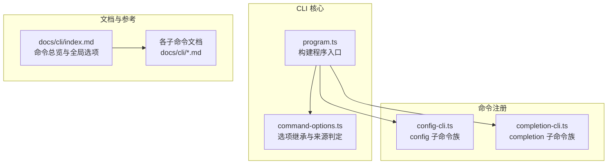
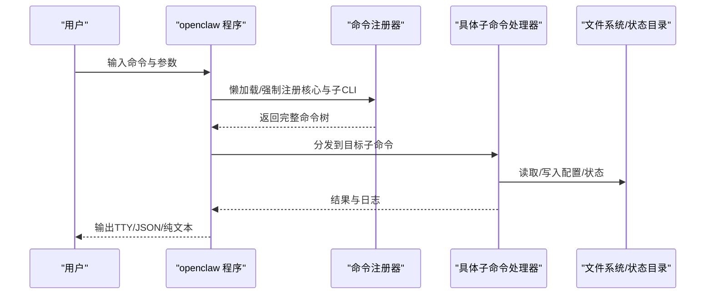
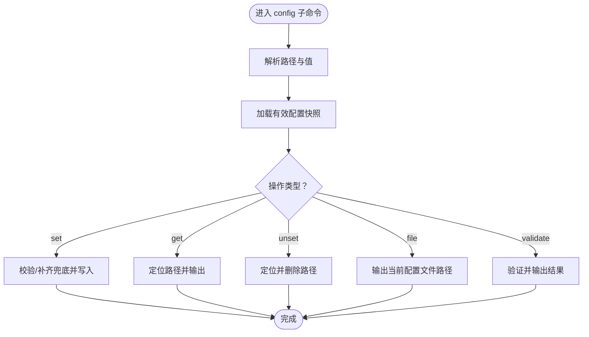
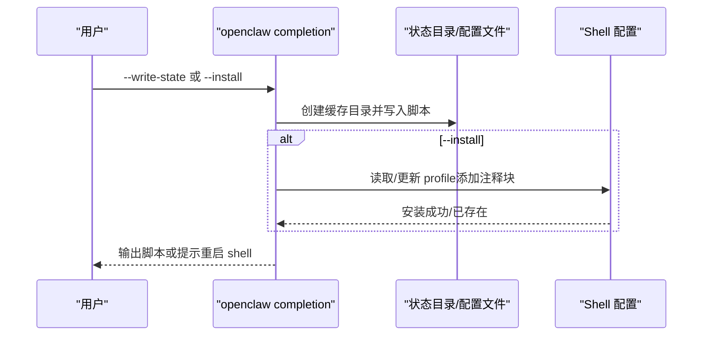
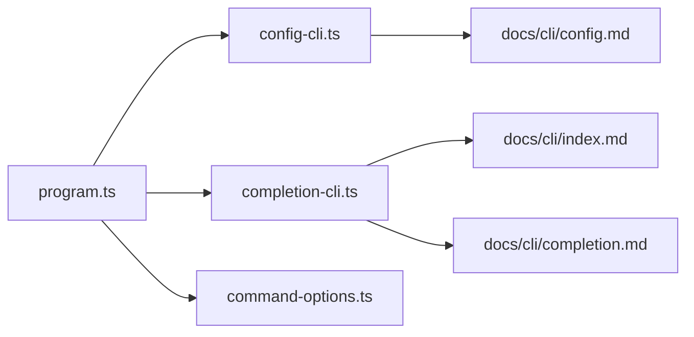

# CLI API

<cite>
**本文引用的文件**
- [docs/cli/index.md](file://docs/cli/index.md)
- [docs/cli/config.md](file://docs/cli/config.md)
- [docs/cli/setup.md](file://docs/cli/setup.md)
- [docs/cli/onboard.md](file://docs/cli/onboard.md)
- [docs/cli/doctor.md](file://docs/cli/doctor.md)
- [docs/cli/gateway.md](file://docs/cli/gateway.md)
- [docs/cli/backup.md](file://docs/cli/backup.md)
- [docs/cli/reset.md](file://docs/cli/reset.md)
- [docs/cli/uninstall.md](file://docs/cli/uninstall.md)
- [docs/cli/update.md](file://docs/cli/update.md)
- [src/cli/config-cli.ts](file://src/cli/config-cli.ts)
- [src/cli/completion-cli.ts](file://src/cli/completion-cli.ts)
- [src/cli/program.ts](file://src/cli/program.ts)
- [src/cli/command-options.ts](file://src/cli/command-options.ts)
</cite>

## 目录
1. [简介](#简介)
2. [项目结构](#项目结构)
3. [核心组件](#核心组件)
4. [架构总览](#架构总览)
5. [详细组件分析](#详细组件分析)
6. [依赖关系分析](#依赖关系分析)
7. [性能考量](#性能考量)
8. [故障排除指南](#故障排除指南)
9. [结论](#结论)
10. [附录](#附录)

## 简介
本文件为 OpenClaw CLI 的全面命令行接口参考与实践指南，覆盖命令树、子命令、全局选项、输出样式、配置管理、自动补全、安全与权限、审计日志、CI/CD 集成与系统管理最佳实践。内容基于仓库中的 CLI 文档与实现文件整理而成，帮助用户高效、安全地使用 openclaw 命令及其扩展生态。

## 项目结构
OpenClaw CLI 的命令注册与运行由 Commander 驱动，采用“核心命令 + 子 CLI 动态注册”的模式，支持延迟加载以提升启动性能；同时提供自动补全生成与安装能力，并内置大量子命令（如 gateway、config、channels、models、memory、cron、nodes、devices、hooks、webhooks、pairing、qr、plugins、security、secrets、skills 等）。

图表来源
- [src/cli/program.ts:1-3](file://src/cli/program.ts#L1-L3)
- [src/cli/command-options.ts:1-45](file://src/cli/command-options.ts#L1-L45)
- [src/cli/config-cli.ts:395-477](file://src/cli/config-cli.ts#L395-L477)
- [src/cli/completion-cli.ts:231-301](file://src/cli/completion-cli.ts#L231-L301)
- [docs/cli/index.md:93-267](file://docs/cli/index.md#L93-L267)

章节来源
- [docs/cli/index.md:93-267](file://docs/cli/index.md#L93-L267)
- [src/cli/program.ts:1-3](file://src/cli/program.ts#L1-L3)
- [src/cli/command-options.ts:1-45](file://src/cli/command-options.ts#L1-L45)

## 核心组件
- 命令树与全局选项：命令总览、全局标志（开发隔离、颜色控制、版本）、输出样式与调色板。
- 配置管理：非交互式 config get/set/unset/file/validate，路径解析与严格 JSON5 解析。
- 自动补全：多 Shell 支持（zsh/bash/powershell/fish），缓存写入与安装脚本注入。
- 运行时选项继承：父级/祖级命令选项的显式来源判定与安全继承。
- 子命令生态：gateway、channels、models、memory、cron、nodes、devices、hooks、webhooks、pairing、qr、plugins、security、secrets、skills 等。

章节来源
- [docs/cli/index.md:62-92](file://docs/cli/index.md#L62-L92)
- [docs/cli/config.md:8-69](file://docs/cli/config.md#L8-L69)
- [src/cli/config-cli.ts:395-477](file://src/cli/config-cli.ts#L395-L477)
- [src/cli/completion-cli.ts:231-301](file://src/cli/completion-cli.ts#L231-L301)
- [src/cli/command-options.ts:20-44](file://src/cli/command-options.ts#L20-L44)

## 架构总览
下图展示 CLI 的高层交互：程序入口构建命令树，动态注册核心与子 CLI，执行器根据子命令分发到对应处理器；自动补全在首次安装或写入缓存后，通过 Shell 配置文件注入。

图表来源
- [src/cli/completion-cli.ts:251-300](file://src/cli/completion-cli.ts#L251-L300)
- [src/cli/config-cli.ts:412-476](file://src/cli/config-cli.ts#L412-L476)

章节来源
- [src/cli/completion-cli.ts:231-301](file://src/cli/completion-cli.ts#L231-L301)
- [src/cli/config-cli.ts:395-477](file://src/cli/config-cli.ts#L395-L477)

## 详细组件分析

### 命令总览与全局选项
- 全局选项
  - 开发隔离：--dev 将状态隔离至 ~/.openclaw-dev，端口偏移。
  - 配置文件隔离：--profile <name> 将状态隔离至 ~/.openclaw-<name>。
  - 输出控制：--no-color、--json、--plain、NO_COLOR=1。
  - 版本：-V/--version/-v。
  - 更新快捷：--update（仅源码安装生效）。
- 输出样式
  - TTY 渲染 ANSI 与进度指示；OSC-8 超链接；--json/--plain 关闭样式；长任务显示进度条。
- 调色板
  - 使用“lobster”主题色系，文档中给出色值与来源。

章节来源
- [docs/cli/index.md:62-92](file://docs/cli/index.md#L62-L92)
- [docs/cli/index.md:93-267](file://docs/cli/index.md#L93-L267)

### 配置命令族（config）
- 子命令
  - get <path>：按点/方括号路径读取值，支持 --json。
  - set <path> <value>：设置值，支持 --strict-json（或 --json 旧别名）。
  - unset <path>：删除键，保留 $include 与 ${ENV} 解析后的快照再写入。
  - file：打印当前生效配置文件路径。
  - validate [--json]：不启动网关验证当前配置是否符合模式。
- 路径与值
  - 路径支持点号与方括号（数组索引），如 agents.list[0].tools.exec.node。
  - 值优先 JSON5 解析，否则作为字符串；--strict-json 强制 JSON5。
- 安全与一致性
  - 写入前对 resolved 快照进行结构化克隆，避免默认值回灌。
  - 对 Ollama 提供商 apiKey 设置进行兜底补齐 baseUrl 等字段。

图表来源
- [src/cli/config-cli.ts:279-393](file://src/cli/config-cli.ts#L279-L393)

章节来源
- [docs/cli/config.md:8-69](file://docs/cli/config.md#L8-L69)
- [src/cli/config-cli.ts:395-477](file://src/cli/config-cli.ts#L395-L477)

### 自动补全（completion）
- 支持 Shell：zsh、bash、powershell、fish。
- 行为
  - --shell 指定生成目标 Shell。
  - --install 安装到用户 Shell 配置文件（自动检测 profile 路径）。
  - --write-state 将补全脚本写入 $OPENCLAW_STATE_DIR/completions 缓存目录。
  - --yes 非交互确认。
- 安装逻辑
  - 若未生成缓存，提示先执行 --write-state。
  - 在 profile 中追加“# OpenClaw Completion”块，避免重复与冲突。
  - 支持检测慢速动态加载模式（source <(...)）并提示改用缓存文件。
- 生成策略
  - zsh：递归生成函数与子命令分支。
  - bash：简化版基于词表的补全。
  - powershell：基于 Register-ArgumentCompleter 的路径匹配。
  - fish：基于 __fish_* 上下文函数的条件补全。

图表来源
- [src/cli/completion-cli.ts:231-301](file://src/cli/completion-cli.ts#L231-L301)
- [src/cli/completion-cli.ts:303-377](file://src/cli/completion-cli.ts#L303-L377)

章节来源
- [src/cli/completion-cli.ts:231-301](file://src/cli/completion-cli.ts#L231-L301)

### 运行时选项继承（inheritOptionFromParent）
- 场景
  - 子命令需要从父/祖父命令继承未显式设置的选项，但限制最大继承深度，避免无界遍历。
- 机制
  - 通过 getOptionValueSource 判断选项来源（默认/CLI/环境等）。
  - 仅当子命令未显式设置时才允许继承，且最多向上两层。

章节来源
- [src/cli/command-options.ts:20-44](file://src/cli/command-options.ts#L20-L44)

### 子命令参考要点（节选）
- setup：初始化配置与工作区，支持 --workspace 与 --wizard。
- onboard：交互式向导（本地/远程网关），支持多种认证提供商与非交互模式。
- doctor：健康检查与快速修复，支持 --deep、--repair/--fix、--json。
- gateway：运行/查询/发现网关，服务生命周期管理，RPC 调用与探测。
- backup/reset/uninstall：备份、重置与卸载，支持 --dry-run 与作用域选择。
- update：通道切换与更新，支持 --channel、--tag、--dry-run、--no-restart、--json。
- 其他常用：config、channels、models、memory、cron、nodes、devices、hooks、webhooks、pairing、qr、plugins、security、secrets、skills 等。

章节来源
- [docs/cli/setup.md:9-30](file://docs/cli/setup.md#L9-L30)
- [docs/cli/onboard.md:8-139](file://docs/cli/onboard.md#L8-L139)
- [docs/cli/doctor.md:9-46](file://docs/cli/doctor.md#L9-L46)
- [docs/cli/gateway.md:10-215](file://docs/cli/gateway.md#L10-L215)
- [docs/cli/backup.md:9-77](file://docs/cli/backup.md#L9-L77)
- [docs/cli/reset.md:9-21](file://docs/cli/reset.md#L9-L21)
- [docs/cli/uninstall.md:9-21](file://docs/cli/uninstall.md#L9-L21)
- [docs/cli/update.md:9-103](file://docs/cli/update.md#L9-L103)
- [docs/cli/index.md:13-61](file://docs/cli/index.md#L13-L61)

## 依赖关系分析
- 组件耦合
  - program.ts 作为入口，统一暴露 buildProgram 与端口工具。
  - config-cli.ts 依赖配置快照读写、问题格式化与路径解析。
  - completion-cli.ts 依赖程序上下文、子 CLI 注册表与状态目录解析。
  - command-options.ts 为通用选项继承工具，被多处命令复用。
- 外部依赖
  - Commander（命令解析与分发）。
  - Node 文件系统与进程环境（用于缓存写入、profile 检测与写入）。
- 潜在循环
  - completion 命令自身不会被再次注册，避免循环注册。

图表来源
- [src/cli/program.ts:1-3](file://src/cli/program.ts#L1-L3)
- [src/cli/config-cli.ts:1-14](file://src/cli/config-cli.ts#L1-L14)
- [src/cli/completion-cli.ts:1-16](file://src/cli/completion-cli.ts#L1-L16)
- [src/cli/command-options.ts:1-15](file://src/cli/command-options.ts#L1-L15)

章节来源
- [src/cli/program.ts:1-3](file://src/cli/program.ts#L1-L3)
- [src/cli/config-cli.ts:1-14](file://src/cli/config-cli.ts#L1-L14)
- [src/cli/completion-cli.ts:1-16](file://src/cli/completion-cli.ts#L1-L16)
- [src/cli/command-options.ts:1-15](file://src/cli/command-options.ts#L1-L15)

## 性能考量
- 启动性能
  - CLI 默认懒加载子命令，仅在需要时注册完整命令树，减少冷启动时间。
  - completion 命令在生成脚本时会强制注册核心与全部子 CLI，确保补全树完整。
- I/O 与缓存
  - 自动补全脚本写入 $OPENCLAW_STATE_DIR/completions 并由 Shell 直接 source，避免动态生成开销。
  - config set/unset 采用结构化克隆与 resolved 快照写入，避免默认值污染。
- 输出样式
  - TTY 下启用 ANSI 与进度指示，非 TTY 降级为纯文本；--json/--plain 降低渲染成本。

章节来源
- [src/cli/completion-cli.ts:251-300](file://src/cli/completion-cli.ts#L251-L300)
- [src/cli/config-cli.ts:313-331](file://src/cli/config-cli.ts#L313-L331)
- [docs/cli/index.md:70-77](file://docs/cli/index.md#L70-L77)

## 故障排除指南
- doctor 常见场景
  - 交互提示仅在 TTY 且未设置 --non-interactive 时出现；headless（定时任务/无终端）跳过提示。
  - --repair/--fix 会备份 openclaw.json 并移除未知键；可结合 --json 观察变更。
  - macOS launchctl 环境变量可能覆盖配置导致“未授权”错误，可通过 getenv/unsetenv 排查。
- config 验证
  - validate 可在不启动网关的情况下验证配置；--json 输出机器可读结果。
  - 路径无效或值解析失败会给出明确错误与建议。
- completion 安装
  - 未生成缓存时需先执行 --write-state；安装后需重启 shell 或 source profile。
  - 若 profile 中仍使用 source <(...) 动态加载，建议改为缓存文件以提升速度。

章节来源
- [docs/cli/doctor.md:26-46](file://docs/cli/doctor.md#L26-L46)
- [docs/cli/config.md:60-69](file://docs/cli/config.md#L60-L69)
- [src/cli/completion-cli.ts:303-377](file://src/cli/completion-cli.ts#L303-L377)

## 结论
OpenClaw CLI 以清晰的命令树、稳健的配置管理、完善的自动补全与丰富的子命令生态，为开发者与运维人员提供了强大的本地与远程管理能力。通过合理使用全局选项、配置命令族与 doctor 等诊断工具，可在保证安全与可审计的前提下，高效完成日常维护、自动化与 CI/CD 集成。

## 附录

### 命令参考速查（按类别）
- 初始化与向导
  - setup：初始化配置与工作区。
  - onboard：交互式向导（本地/远程网关）。
- 配置与诊断
  - config：非交互式配置读写与验证。
  - doctor：健康检查与快速修复。
- 网关与服务
  - gateway：运行/查询/发现网关，服务生命周期管理。
- 备份与清理
  - backup：创建本地备份归档。
  - reset：重置本地配置/状态（保留 CLI）。
  - uninstall：卸载网关服务与本地数据（保留 CLI）。
- 更新与版本
  - update：通道切换与更新，支持 --dry-run 与 --no-restart。
- 子命令生态（部分）
  - channels、models、memory、cron、nodes、devices、hooks、webhooks、pairing、qr、plugins、security、secrets、skills 等。

章节来源
- [docs/cli/index.md:13-61](file://docs/cli/index.md#L13-L61)
- [docs/cli/setup.md:9-30](file://docs/cli/setup.md#L9-L30)
- [docs/cli/onboard.md:8-139](file://docs/cli/onboard.md#L8-L139)
- [docs/cli/config.md:8-69](file://docs/cli/config.md#L8-L69)
- [docs/cli/doctor.md:9-46](file://docs/cli/doctor.md#L9-L46)
- [docs/cli/gateway.md:10-215](file://docs/cli/gateway.md#L10-L215)
- [docs/cli/backup.md:9-77](file://docs/cli/backup.md#L9-L77)
- [docs/cli/reset.md:9-21](file://docs/cli/reset.md#L9-L21)
- [docs/cli/uninstall.md:9-21](file://docs/cli/uninstall.md#L9-L21)
- [docs/cli/update.md:9-103](file://docs/cli/update.md#L9-L103)