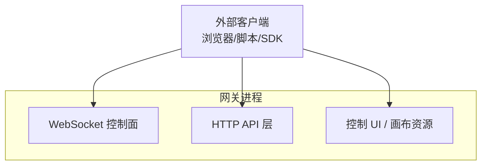
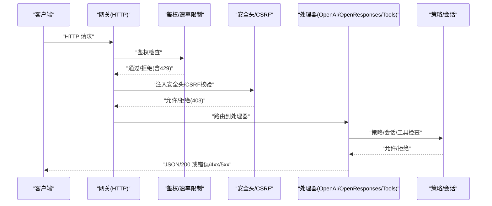
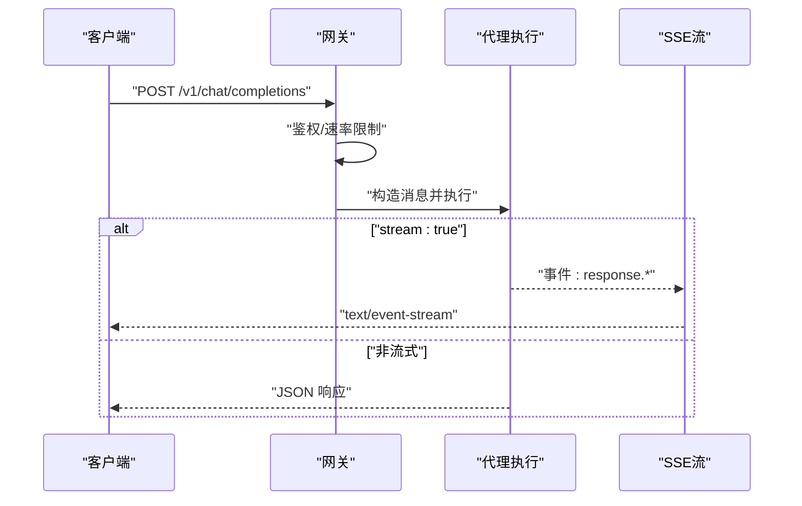
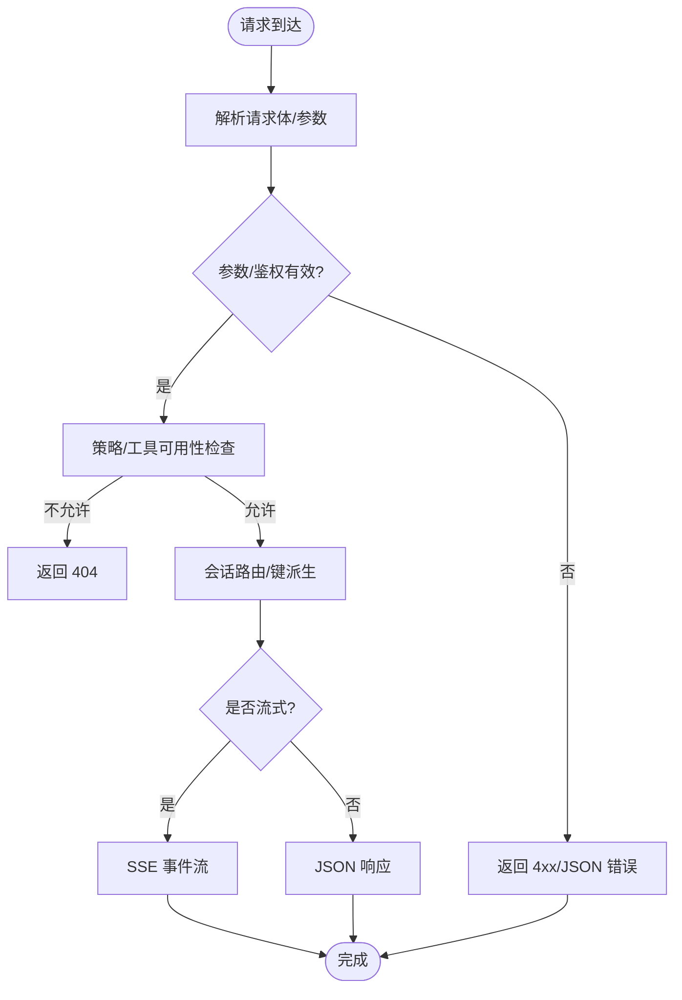
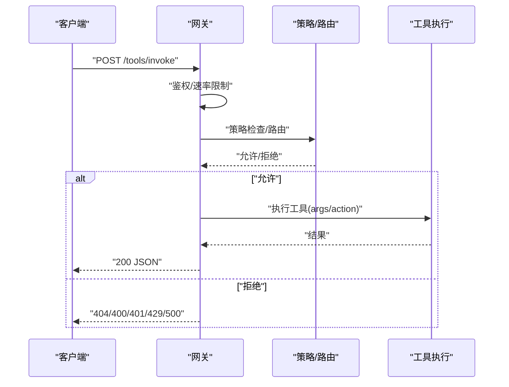
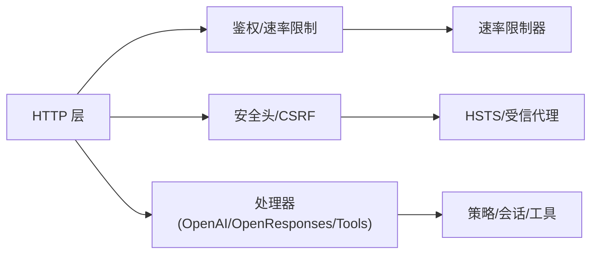

# HTTP API

<cite>
**本文引用的文件**
- [openai-http-api.md](file://docs/gateway/openai-http-api.md)
- [openresponses-http-api.md](file://docs/gateway/openresponses-http-api.md)
- [tools-invoke-http-api.md](file://docs/gateway/tools-invoke-http-api.md)
- [authentication.md](file://docs/gateway/authentication.md)
- [configuration.md](file://docs/gateway/configuration.md)
- [configuration-reference.md](file://docs/gateway/configuration-reference.md)
- [security/index.md](file://docs/gateway/security/index.md)
- [remote.md](file://docs/gateway/remote.md)
- [index.md](file://docs/gateway/index.md)
- [http-common.ts](file://src/gateway/http-common.ts)
- [auth-rate-limit.ts](file://src/gateway/auth-rate-limit.ts)
- [csrf.ts](file://src/browser/csrf.ts)
</cite>

## 目录
1. [简介](#简介)
2. [项目结构](#项目结构)
3. [核心组件](#核心组件)
4. [架构总览](#架构总览)
5. [详细组件分析](#详细组件分析)
6. [依赖关系分析](#依赖关系分析)
7. [性能与容量规划](#性能与容量规划)
8. [故障排查指南](#故障排查指南)
9. [结论](#结论)
10. [附录](#附录)

## 简介
本文件为 OpenClaw 的 HTTP API 参考文档，覆盖以下接口与能力：
- OpenAI 兼容聊天补全（/v1/chat/completions）
- OpenResponses 兼容响应接口（/v1/responses）
- 工具直接调用接口（/tools/invoke）
- 网关运行时与安全边界、认证与授权、速率限制、CORS 与 CSRF 防护等通用主题
- 配置项与最佳实践（含端口、绑定、鉴权、反向代理、HSTS 等）

本参考面向希望将 OpenClaw 作为网关接入各类客户端与自动化系统的工程师与运维人员。

## 项目结构
OpenClaw 的 HTTP 能力由“网关进程”统一承载：同一端口同时提供 WebSocket 控制面、HTTP API、控制 UI 与画布资源。HTTP API 通过内置的安全头、鉴权与速率限制机制保障访问安全。

[无图表来源：该图为概念性结构示意，不直接映射具体源码文件]

**章节来源**
- [index.md:68-93](file://docs/gateway/index.md#L68-L93)

## 核心组件
- OpenAI 兼容聊天补全接口：支持非流式与 Server-Sent Events 流式输出，基于会话键进行状态化或无状态会话控制。
- OpenResponses 兼容响应接口：支持 item 化输入、客户端函数工具、图片/文件输入、SSE 事件流。
- 工具直接调用接口：在策略与鉴权约束下，对单个工具进行直接调用，适合自动化与低延迟场景。
- 安全与鉴权：统一的网关鉴权（Bearer Token 或密码），可配置速率限制；结合安全头、CSRF 保护与反向代理信任设置，形成纵深防御。
- 配置与部署：端口与绑定、反向代理与 HSTS、受信代理、控制 UI 原点白名单等。

**章节来源**
- [openai-http-api.md:14-133](file://docs/gateway/openai-http-api.md#L14-L133)
- [openresponses-http-api.md:15-355](file://docs/gateway/openresponses-http-api.md#L15-L355)
- [tools-invoke-http-api.md:13-111](file://docs/gateway/tools-invoke-http-api.md#L13-L111)
- [security/index.md:318-358](file://docs/gateway/security/index.md#L318-L358)

## 架构总览
HTTP API 在网关内部分层如下：
- 协议与路由：HTTP 请求进入后，按路径匹配到对应处理器（OpenAI、OpenResponses、工具调用）。
- 鉴权与速率限制：统一的网关鉴权检查与认证失败速率限制。
- 安全头与防护：默认安全头、CSRF 保护中间件、受信代理与 HSTS 设置。
- 处理器：根据请求体解析、参数校验、策略过滤、会话路由、工具执行与结果返回。
- 错误与响应：标准化错误结构与状态码，SSE 流式输出支持。

**图表来源**
- [http-common.ts:11-22](file://src/gateway/http-common.ts#L11-L22)
- [csrf.ts:57-87](file://src/browser/csrf.ts#L57-L87)
- [auth-rate-limit.ts:95-167](file://src/gateway/auth-rate-limit.ts#L95-L167)

**章节来源**
- [http-common.ts:11-109](file://src/gateway/http-common.ts#L11-L109)
- [csrf.ts:57-87](file://src/browser/csrf.ts#L57-L87)
- [auth-rate-limit.ts:95-167](file://src/gateway/auth-rate-limit.ts#L95-L167)

## 详细组件分析

### OpenAI 兼容聊天补全（/v1/chat/completions）
- 端点与端口：POST /v1/chat/completions，与网关端口一致（默认 18789）。
- 认证：Bearer Token，遵循网关鉴权配置；支持速率限制与 429 返回。
- 选择代理：model 字段或自定义头 x-openclaw-agent-id；支持 x-openclaw-session-key 精细会话路由。
- 会话行为：默认每次请求生成新会话键；若请求包含 user 字段则派生稳定会话键以复用会话。
- 流式输出：开启 stream: true 后返回 text/event-stream，事件行以 data: <json> 形式，结束以 data: [DONE]。
- 示例：提供非流式与流式的 curl 示例。

**图表来源**
- [openai-http-api.md:14](file://docs/gateway/openai-http-api.md#L14)
- [openai-http-api.md:97-104](file://docs/gateway/openai-http-api.md#L97-L104)

**章节来源**
- [openai-http-api.md:14-133](file://docs/gateway/openai-http-api.md#L14-L133)

### OpenResponses 兼容响应（/v1/responses）
- 端点与端口：POST /v1/responses，与网关端口一致。
- 认证：Bearer Token，支持速率限制与 429 返回。
- 选择代理：model 字段或 x-openclaw-agent-id；支持 x-openclaw-session-key。
- 请求形态：支持 input（字符串或 item 数组）、instructions（合并入系统提示）、tools、tool_choice、stream、max_output_tokens、user 等；部分字段当前被忽略。
- 输入项：message、function_call_output（用于回传工具结果）、reasoning 与 item_reference（忽略）。
- 图像与文件：支持 base64 与 URL 源，限定 MIME 类型与大小；PDF 解析与图像化策略；URL 限制与白名单。
- 流式事件：多种事件类型（response.created、response.output_item.added、response.output_text.delta 等）。
- 使用统计：usage 在底层提供方报告时填充。
- 错误：统一 JSON 错误对象，常见 401/400/405。
- 示例：提供非流式与流式的 curl 示例。

**图表来源**
- [openresponses-http-api.md:100-120](file://docs/gateway/openresponses-http-api.md#L100-L120)
- [openresponses-http-api.md:288-308](file://docs/gateway/openresponses-http-api.md#L288-L308)

**章节来源**
- [openresponses-http-api.md:15-355](file://docs/gateway/openresponses-http-api.md#L15-L355)

### 工具直接调用（/tools/invoke）
- 端点与端口：POST /tools/invoke，与网关端口一致。
- 认证：Bearer Token，支持速率限制与 429 返回。
- 请求体字段：tool（必填）、action（可选）、args（可选）、sessionKey（可选，默认 main）、dryRun（保留位）。
- 策略与路由：遵循与代理相同的策略链（tools.profile、byProvider、agent 级别、群组策略、子会话策略）；默认对若干高危工具进行硬性拒绝。
- 响应：200 返回 { ok: true, result }；400/401/429/404/405/500 对应不同错误场景。
- 示例：提供 curl 示例。

**图表来源**
- [tools-invoke-http-api.md:30-88](file://docs/gateway/tools-invoke-http-api.md#L30-L88)

**章节来源**
- [tools-invoke-http-api.md:13-111](file://docs/gateway/tools-invoke-http-api.md#L13-L111)

## 依赖关系分析
- 鉴权与速率限制：统一由网关鉴权模块与速率限制器提供，所有 HTTP 接口共享。
- 安全头与 CSRF：HTTP 通用安全头由 http-common 注入；浏览器变更类请求的 CSRF 保护由浏览器侧中间件负责。
- 反向代理与 HSTS：受信代理配置影响客户端 IP 判定；HSTS 由网关安全头配置决定。
- 会话与策略：OpenAI 与 OpenResponses 接口均支持会话键派生与稳定会话；工具调用接口遵循相同策略链。

**图表来源**
- [http-common.ts:11-22](file://src/gateway/http-common.ts#L11-L22)
- [csrf.ts:57-87](file://src/browser/csrf.ts#L57-L87)
- [auth-rate-limit.ts:95-167](file://src/gateway/auth-rate-limit.ts#L95-L167)
- [security/index.md:318-358](file://docs/gateway/security/index.md#L318-L358)

**章节来源**
- [http-common.ts:11-109](file://src/gateway/http-common.ts#L11-L109)
- [csrf.ts:57-87](file://src/browser/csrf.ts#L57-L87)
- [auth-rate-limit.ts:95-167](file://src/gateway/auth-rate-limit.ts#L95-L167)
- [security/index.md:318-358](file://docs/gateway/security/index.md#L318-L358)

## 性能与容量规划
- 连接与端口：默认端口 18789，支持 loopback 绑定；生产建议通过 Tailscale Serve 或受控隧道暴露，避免公网直连。
- 反向代理：正确配置受信代理与 X-Forwarded-For，确保客户端 IP 准确识别与速率限制生效。
- HSTS：在终止 TLS 的反代上设置 HSTS；或在网关上启用严格传输安全头。
- 速率限制：合理设置认证失败阈值与窗口，避免滥用；注意速率限制触发时返回 429 并携带 Retry-After。
- 流式输出：SSE 流式接口需关注客户端连接稳定性与超时重试策略。

[本节为通用指导，不直接分析具体文件]

## 故障排查指南
- 401 未授权：确认 Authorization: Bearer 令牌正确；检查网关鉴权模式与环境变量。
- 403 禁止：浏览器变更类请求可能触发 CSRF 保护；确认 Origin/Referer/Sec-Fetch-Site 合法。
- 405 方法不允许：确认使用正确的 HTTP 方法（如 POST）。
- 413 请求实体过大：调整请求体大小限制或拆分请求。
- 429 速率限制：降低请求频率或提升速率限制配置；等待 Retry-After 秒后重试。
- 404 工具不可用：检查工具策略与会话键；确认工具未被默认拒绝列表拦截。
- HSTS/反向代理：确保受信代理配置正确，避免 Host 头回放与 DNS 重绑定风险。

**章节来源**
- [http-common.ts:41-71](file://src/gateway/http-common.ts#L41-L71)
- [http-common.ts:47-57](file://src/gateway/http-common.ts#L47-L57)
- [csrf.ts:57-87](file://src/browser/csrf.ts#L57-L87)
- [security/index.md:318-358](file://docs/gateway/security/index.md#L318-L358)

## 结论
OpenClaw 的 HTTP API 将网关的代理能力、工具执行与安全策略统一在单一端口之上，既满足 OpenAI 兼容与 OpenResponses 兼容的外部集成需求，也提供了面向自动化与低延迟场景的工具直调能力。通过严格的鉴权、速率限制、安全头与 CSRF 保护，以及可配置的反向代理与 HSTS，可在保证易用性的同时兼顾安全性与可运维性。

[本节为总结性内容，不直接分析具体文件]

## 附录

### API 一览与认证方式
- OpenAI 兼容聊天补全
  - 方法：POST
  - 路径：/v1/chat/completions
  - 认证：Bearer Token（或密码）
  - 会话：支持 user 派生稳定会话键
  - 流式：支持 text/event-stream
- OpenResponses 兼容响应
  - 方法：POST
  - 路径：/v1/responses
  - 认证：Bearer Token（或密码）
  - 输入：item 化输入、客户端工具、图片/文件
  - 流式：支持多种事件类型
- 工具直接调用
  - 方法：POST
  - 路径：/tools/invoke
  - 认证：Bearer Token（或密码）
  - 策略：遵循与代理相同的策略链
  - 默认拒绝：若干高危工具

**章节来源**
- [openai-http-api.md:14-133](file://docs/gateway/openai-http-api.md#L14-L133)
- [openresponses-http-api.md:15-355](file://docs/gateway/openresponses-http-api.md#L15-L355)
- [tools-invoke-http-api.md:13-111](file://docs/gateway/tools-invoke-http-api.md#L13-L111)

### 认证与密钥管理
- 支持 Bearer Token 与密码两种鉴权模式；可通过环境变量或配置注入。
- 支持 SecretRef（env/file/exec）存储敏感凭据，启动时解析并以只读快照形式运行。
- 模型凭据轮换：在特定错误条件下自动尝试备用密钥。

**章节来源**
- [authentication.md:21-180](file://docs/gateway/authentication.md#L21-L180)
- [secrets.md:16-455](file://docs/gateway/secrets.md#L16-L455)

### 配置要点（端口、绑定、反向代理、HSTS）
- 端口与绑定：默认 18789，推荐 loopback 绑定；通过 Tailscale Serve 或 SSH 隧道暴露。
- 受信代理：配置 trustedProxies 以正确识别客户端 IP；默认不信任代理头时拒绝本地信任绕过。
- HSTS：在终止 TLS 的反代设置 HSTS；或在网关启用严格传输安全头。
- 控制 UI 原点白名单：非 loopback 场景需配置 allowedOrigins。

**章节来源**
- [index.md:78-93](file://docs/gateway/index.md#L78-L93)
- [security/index.md:318-358](file://docs/gateway/security/index.md#L318-L358)

### SDK 集成与最佳实践
- SDK 适配：优先使用 OpenAI 兼容 SDK（如 OpenAI 官方库），将 base_url 指向网关端点。
- 会话复用：利用 user 字段或 x-openclaw-session-key 实现稳定会话。
- 工具直调：对不需要完整代理回合的场景，使用 /tools/invoke 直接调用工具，减少开销。
- 安全加固：仅在 loopback 或受控隧道暴露；启用速率限制与最小权限策略；定期审计凭据与策略。

[本节为通用指导，不直接分析具体文件]