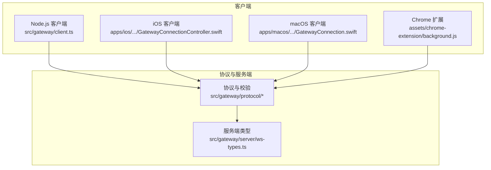
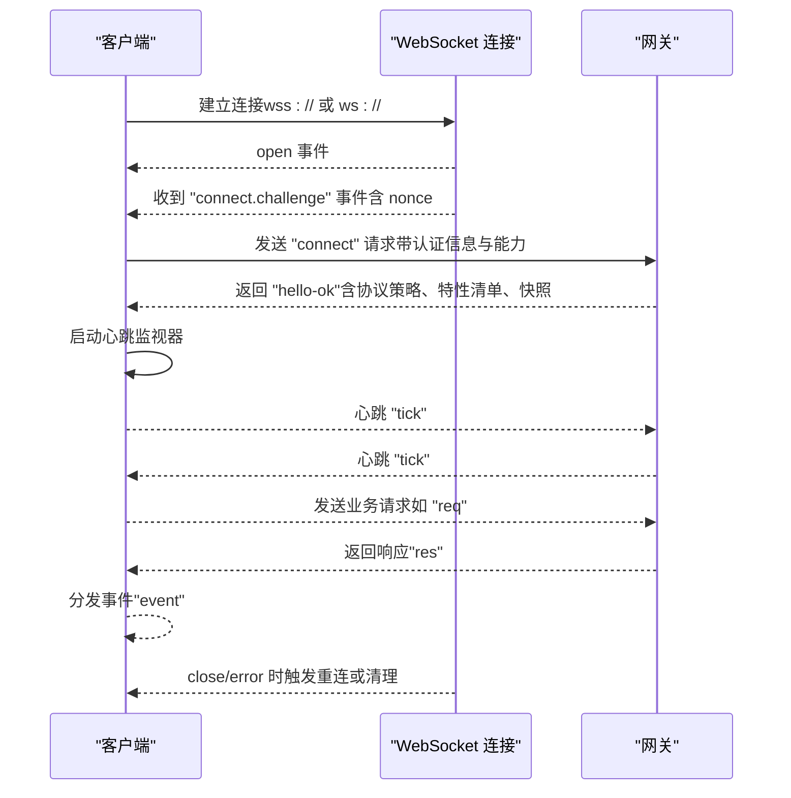
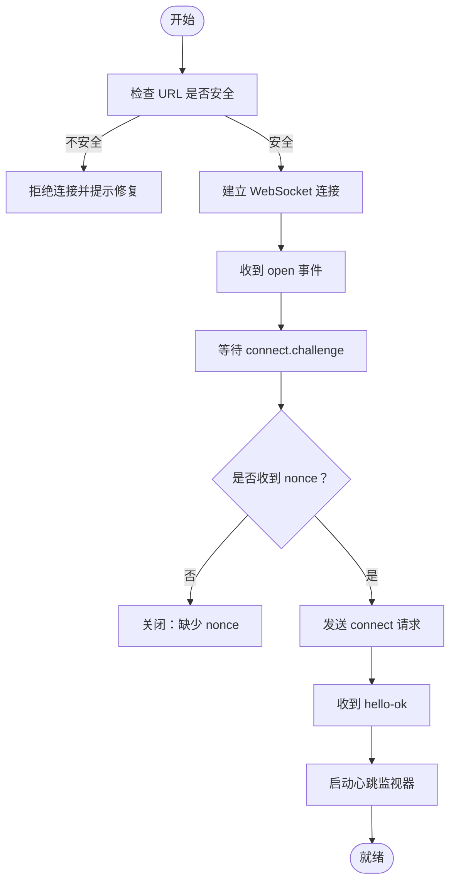
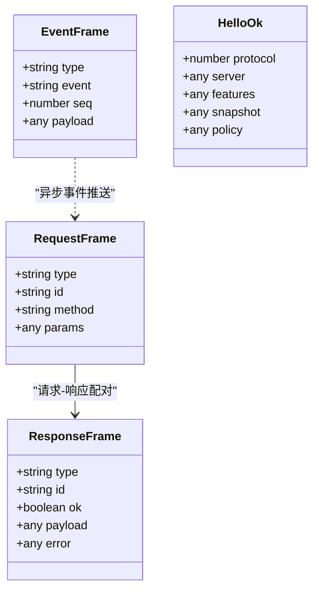
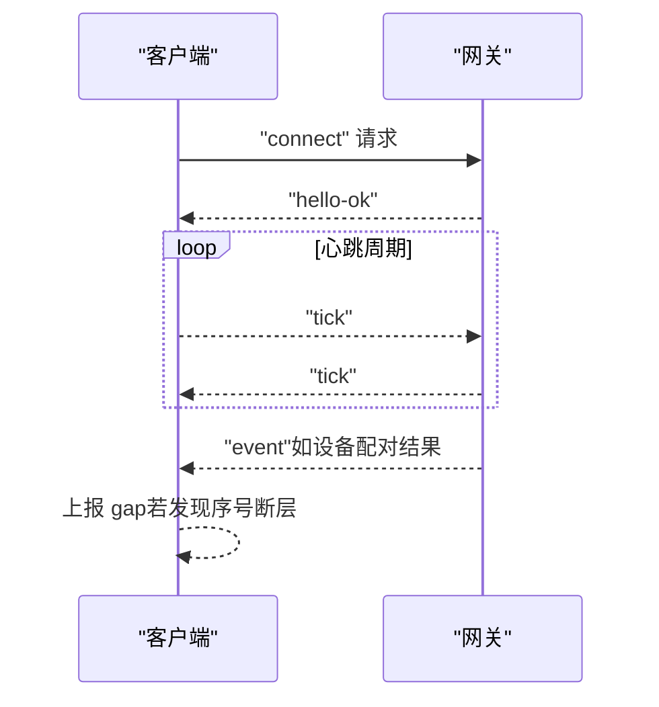
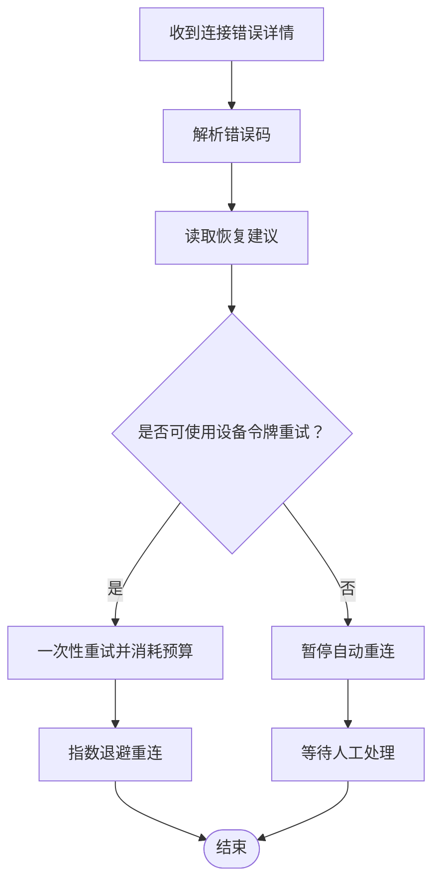
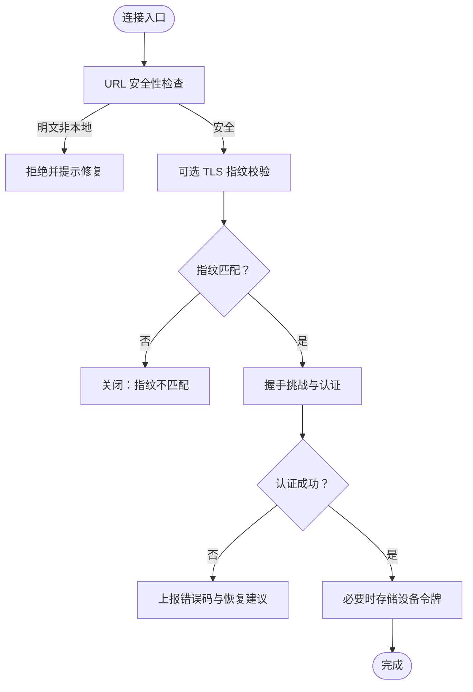
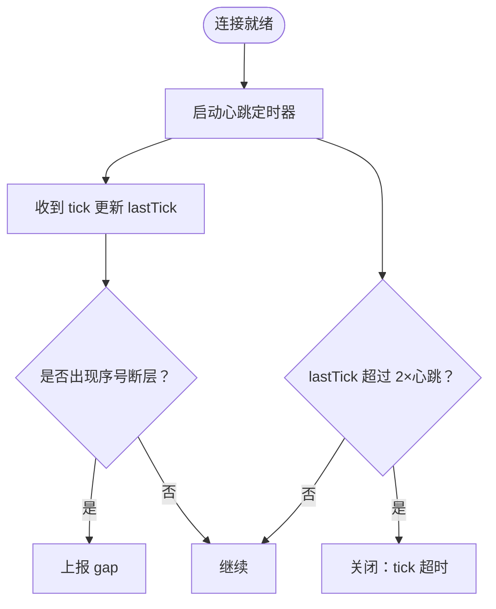
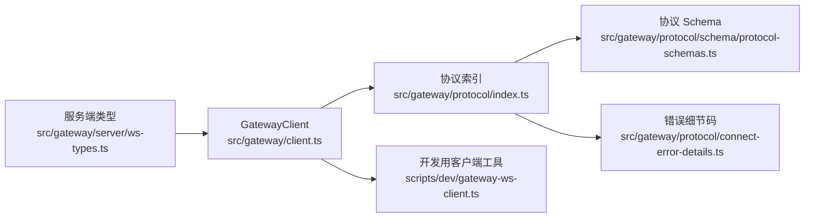

# WebSocket API

<cite>
**本文引用的文件**
- [src/gateway/client.ts](file://src/gateway/client.ts)
- [src/gateway/server/ws-types.ts](file://src/gateway/server/ws-types.ts)
- [src/gateway/protocol/index.ts](file://src/gateway/protocol/index.ts)
- [src/gateway/protocol/connect-error-details.ts](file://src/gateway/protocol/connect-error-details.ts)
- [src/gateway/protocol/schema/protocol-schemas.ts](file://src/gateway/protocol/schema/protocol-schemas.ts)
- [scripts/dev/gateway-ws-client.ts](file://scripts/dev/gateway-ws-client.ts)
- [apps/ios/Sources/Gateway/GatewayConnectionController.swift](file://apps/ios/Sources/Gateway/GatewayConnectionController.swift)
- [apps/macos/Sources/OpenClaw/GatewayConnection.swift](file://apps/macos/Sources/OpenClaw/GatewayConnection.swift)
- [assets/chrome-extension/background.js](file://assets/chrome-extension/background.js)
</cite>

## 目录
1. [简介](#简介)
2. [项目结构](#项目结构)
3. [核心组件](#核心组件)
4. [架构总览](#架构总览)
5. [详细组件分析](#详细组件分析)
6. [依赖关系分析](#依赖关系分析)
7. [性能考量](#性能考量)
8. [故障排查指南](#故障排查指南)
9. [结论](#结论)
10. [附录：消息协议与方法参考](#附录消息协议与方法参考)

## 简介
本文件为 OpenClaw 的 WebSocket API 参考文档，聚焦于网关（Gateway）与客户端之间的 WebSocket 控制平面协议。内容涵盖连接建立流程、帧格式、事件类型、请求/响应模型、错误码与恢复建议、安全与认证策略、连接管理与重连机制，以及跨平台客户端集成要点。读者可据此实现稳定、安全且高性能的实时交互。

## 项目结构
OpenClaw 的 WebSocket API 由“服务端网关”和“多端客户端”共同组成，协议在服务端与客户端之间共享一套强类型校验与版本化规范。核心位置如下：
- 客户端库：负责握手、鉴权、心跳、请求/响应、事件分发与自动重连
- 协议层：统一定义帧结构、参数与返回值的 JSON Schema 校验器
- 服务端类型：描述已连接客户端上下文（如连接 ID、能力等）
- 多端集成：iOS、macOS、Chrome 扩展等客户端示例

图表来源
- [src/gateway/client.ts:109-674](file://src/gateway/client.ts#L109-L674)
- [src/gateway/protocol/index.ts:1-673](file://src/gateway/protocol/index.ts#L1-L673)
- [src/gateway/protocol/schema/protocol-schemas.ts:1-302](file://src/gateway/protocol/schema/protocol-schemas.ts#L1-L302)
- [src/gateway/server/ws-types.ts:1-14](file://src/gateway/server/ws-types.ts#L1-L14)
- [apps/ios/Sources/Gateway/GatewayConnectionController.swift:1-200](file://apps/ios/Sources/Gateway/GatewayConnectionController.swift#L1-L200)
- [apps/macos/Sources/OpenClaw/GatewayConnection.swift:46-101](file://apps/macos/Sources/OpenClaw/GatewayConnection.swift#L46-L101)
- [assets/chrome-extension/background.js:17-204](file://assets/chrome-extension/background.js#L17-L204)

章节来源
- [src/gateway/client.ts:109-674](file://src/gateway/client.ts#L109-L674)
- [src/gateway/protocol/index.ts:1-673](file://src/gateway/protocol/index.ts#L1-L673)
- [src/gateway/protocol/schema/protocol-schemas.ts:1-302](file://src/gateway/protocol/schema/protocol-schemas.ts#L1-L302)
- [src/gateway/server/ws-types.ts:1-14](file://src/gateway/server/ws-types.ts#L1-L14)
- [apps/ios/Sources/Gateway/GatewayConnectionController.swift:1-200](file://apps/ios/Sources/Gateway/GatewayConnectionController.swift#L1-L200)
- [apps/macos/Sources/OpenClaw/GatewayConnection.swift:46-101](file://apps/macos/Sources/OpenClaw/GatewayConnection.swift#L46-L101)
- [assets/chrome-extension/background.js:17-204](file://assets/chrome-extension/background.js#L17-L204)

## 核心组件
- 网关客户端（Node.js）：负责连接、鉴权挑战、发送请求、接收事件、心跳检测、错误处理与指数退避重连
- 协议与校验：基于 Ajv 的 JSON Schema 校验器，统一验证帧结构与参数合法性
- 服务端类型：描述已连接客户端上下文（如连接 ID、来源 IP、画布能力等）
- 多端客户端：iOS/macOS 使用系统 WebSocket 实现；Chrome 扩展使用浏览器 WebSocket

章节来源
- [src/gateway/client.ts:109-674](file://src/gateway/client.ts#L109-L674)
- [src/gateway/protocol/index.ts:253-458](file://src/gateway/protocol/index.ts#L253-L458)
- [src/gateway/server/ws-types.ts:4-13](file://src/gateway/server/ws-types.ts#L4-L13)
- [apps/ios/Sources/Gateway/GatewayConnectionController.swift:1-200](file://apps/ios/Sources/Gateway/GatewayConnectionController.swift#L1-L200)
- [apps/macos/Sources/OpenClaw/GatewayConnection.swift:46-101](file://apps/macos/Sources/OpenClaw/GatewayConnection.swift#L46-L101)
- [assets/chrome-extension/background.js:17-204](file://assets/chrome-extension/background.js#L17-L204)

## 架构总览
下图展示从客户端发起连接到完成握手、进入会话阶段的整体流程，以及心跳与错误处理的关键节点。

图表来源
- [src/gateway/client.ts:199-251](file://src/gateway/client.ts#L199-L251)
- [src/gateway/client.ts:497-554](file://src/gateway/client.ts#L497-L554)
- [src/gateway/client.ts:647-672](file://src/gateway/client.ts#L647-L672)
- [src/gateway/protocol/index.ts:126-132](file://src/gateway/protocol/index.ts#L126-L132)

章节来源
- [src/gateway/client.ts:199-251](file://src/gateway/client.ts#L199-L251)
- [src/gateway/client.ts:497-554](file://src/gateway/client.ts#L497-L554)
- [src/gateway/client.ts:647-672](file://src/gateway/client.ts#L647-L672)
- [src/gateway/protocol/index.ts:126-132](file://src/gateway/protocol/index.ts#L126-L132)

## 详细组件分析

### 连接建立与握手
- 安全要求：仅允许 wss:// 或本地回环的 ws://；其他明文连接将被拒绝并提示修复建议
- 握手挑战：服务端通过 "connect.challenge" 事件下发随机 nonce；客户端需在时限内提交 "connect" 请求
- 认证方式：支持共享令牌、密码、设备令牌与设备签名等多种组合
- 成功后：服务端返回 "hello-ok"，包含协议策略（如心跳间隔）、特性清单与快照信息

图表来源
- [src/gateway/client.ts:134-168](file://src/gateway/client.ts#L134-L168)
- [src/gateway/client.ts:199-251](file://src/gateway/client.ts#L199-L251)
- [src/gateway/client.ts:497-513](file://src/gateway/client.ts#L497-L513)
- [src/gateway/client.ts:369-414](file://src/gateway/client.ts#L369-L414)

章节来源
- [src/gateway/client.ts:134-168](file://src/gateway/client.ts#L134-L168)
- [src/gateway/client.ts:199-251](file://src/gateway/client.ts#L199-L251)
- [src/gateway/client.ts:497-513](file://src/gateway/client.ts#L497-L513)
- [src/gateway/client.ts:369-414](file://src/gateway/client.ts#L369-L414)

### 帧格式与消息协议
- 帧类型
  - req：请求帧，包含 id、method、params
  - res：响应帧，包含 id、ok、payload 或 error
  - event：事件帧，包含 event、seq、payload
- 校验：所有帧均通过 Ajv Schema 校验，确保字段与类型正确
- 版本：协议版本号在 schema 中定义，客户端与服务端需兼容该版本范围

图表来源
- [src/gateway/protocol/index.ts:126-132](file://src/gateway/protocol/index.ts#L126-L132)
- [src/gateway/protocol/schema/protocol-schemas.ts:95-104](file://src/gateway/protocol/schema/protocol-schemas.ts#L95-L104)
- [src/gateway/protocol/schema/protocol-schemas.ts:162-169](file://src/gateway/protocol/schema/protocol-schemas.ts#L162-L169)

章节来源
- [src/gateway/protocol/index.ts:126-132](file://src/gateway/protocol/index.ts#L126-L132)
- [src/gateway/protocol/schema/protocol-schemas.ts:95-104](file://src/gateway/protocol/schema/protocol-schemas.ts#L95-L104)
- [src/gateway/protocol/schema/protocol-schemas.ts:162-169](file://src/gateway/protocol/schema/protocol-schemas.ts#L162-L169)

### 事件类型与实时交互
- 内置事件
  - connect.challenge：握手挑战，携带 nonce
  - tick：心跳事件，用于检测连接健康
  - 其他事件：由服务端按需推送（如设备配对、节点状态变更等）
- 客户端行为
  - 收到 "connect.challenge" 后立即发送 "connect"
  - 收到 "tick" 更新最近心跳时间
  - 维护序列号 seq，检测丢包并上报 gap

图表来源
- [src/gateway/client.ts:497-525](file://src/gateway/client.ts#L497-L525)
- [src/gateway/client.ts:596-618](file://src/gateway/client.ts#L596-L618)

章节来源
- [src/gateway/client.ts:497-525](file://src/gateway/client.ts#L497-L525)
- [src/gateway/client.ts:596-618](file://src/gateway/client.ts#L596-L618)

### 错误处理与恢复策略
- 连接错误细节码：覆盖认证缺失、密码不匹配、速率限制、设备令牌不一致、设备签名过期/无效等
- 恢复建议：可推荐下一步操作（如使用设备令牌重试、更新配置或凭据、等待后重试）
- 重连策略：失败后指数退避，最大延迟上限；针对特定错误暂停自动重连，等待人工干预

图表来源
- [src/gateway/protocol/connect-error-details.ts:107-136](file://src/gateway/protocol/connect-error-details.ts#L107-L136)
- [src/gateway/client.ts:417-444](file://src/gateway/client.ts#L417-L444)
- [src/gateway/client.ts:576-587](file://src/gateway/client.ts#L576-L587)

章节来源
- [src/gateway/protocol/connect-error-details.ts:1-137](file://src/gateway/protocol/connect-error-details.ts#L1-L137)
- [src/gateway/client.ts:417-444](file://src/gateway/client.ts#L417-L444)
- [src/gateway/client.ts:576-587](file://src/gateway/client.ts#L576-L587)

### 安全与认证
- 传输安全：默认要求 wss://；仅在受控私有网络中允许 ws://（通过环境变量开启）
- TLS 校验：支持指纹校验，防止中间人攻击；客户端可存储可信指纹以避免每次手动确认
- 设备认证：支持设备签名与一次性 nonce，增强端到端信任
- 凭据管理：优先使用显式共享令牌/密码；若无则尝试持久化的设备令牌；失败时清理过期设备令牌

图表来源
- [src/gateway/client.ts:134-168](file://src/gateway/client.ts#L134-L168)
- [src/gateway/client.ts:170-196](file://src/gateway/client.ts#L170-L196)
- [src/gateway/client.ts:200-207](file://src/gateway/client.ts#L200-L207)
- [src/gateway/client.ts:283-315](file://src/gateway/client.ts#L283-L315)
- [src/gateway/client.ts:375-382](file://src/gateway/client.ts#L375-L382)

章节来源
- [src/gateway/client.ts:134-168](file://src/gateway/client.ts#L134-L168)
- [src/gateway/client.ts:170-196](file://src/gateway/client.ts#L170-L196)
- [src/gateway/client.ts:200-207](file://src/gateway/client.ts#L200-L207)
- [src/gateway/client.ts:283-315](file://src/gateway/client.ts#L283-L315)
- [src/gateway/client.ts:375-382](file://src/gateway/client.ts#L375-L382)

### 连接管理与心跳
- 心跳间隔：以 "hello-ok" 中的策略为准，默认约 30 秒；客户端最小间隔可配置
- 心跳超时：若超过两倍心跳间隔未收到 "tick"，主动关闭连接
- 序列号：事件帧包含 seq，客户端检测断层并上报 gap
- 关闭码：提供常见关闭码的语义提示，便于诊断

图表来源
- [src/gateway/client.ts:384-389](file://src/gateway/client.ts#L384-L389)
- [src/gateway/client.ts:606-617](file://src/gateway/client.ts#L606-L617)
- [src/gateway/client.ts:514-524](file://src/gateway/client.ts#L514-L524)

章节来源
- [src/gateway/client.ts:384-389](file://src/gateway/client.ts#L384-L389)
- [src/gateway/client.ts:606-617](file://src/gateway/client.ts#L606-L617)
- [src/gateway/client.ts:514-524](file://src/gateway/client.ts#L514-L524)

### 多端客户端集成要点
- iOS/macOS：使用系统 URLSessionWebSocketTask 或原生 WebSocket，遵循相同的握手与心跳逻辑；支持 TLS 指纹存储与信任提示
- Chrome 扩展：在后台脚本中维护单个全局 WebSocket，处理连接、超时与重连，保持徽章状态同步

章节来源
- [apps/ios/Sources/Gateway/GatewayConnectionController.swift:1-200](file://apps/ios/Sources/Gateway/GatewayConnectionController.swift#L1-L200)
- [apps/macos/Sources/OpenClaw/GatewayConnection.swift:46-101](file://apps/macos/Sources/OpenClaw/GatewayConnection.swift#L46-L101)
- [assets/chrome-extension/background.js:17-204](file://assets/chrome-extension/background.js#L17-L204)

## 依赖关系分析
- 客户端依赖协议校验器与错误细节码，确保请求合法与错误可诊断
- 服务端类型 GatewayWsClient 描述连接上下文，便于日志与监控
- 多端客户端共享同一协议规范，降低耦合度

图表来源
- [src/gateway/client.ts:1-674](file://src/gateway/client.ts#L1-L674)
- [src/gateway/protocol/index.ts:1-673](file://src/gateway/protocol/index.ts#L1-L673)
- [src/gateway/protocol/schema/protocol-schemas.ts:1-302](file://src/gateway/protocol/schema/protocol-schemas.ts#L1-L302)
- [src/gateway/protocol/connect-error-details.ts:1-137](file://src/gateway/protocol/connect-error-details.ts#L1-L137)
- [src/gateway/server/ws-types.ts:1-14](file://src/gateway/server/ws-types.ts#L1-L14)
- [scripts/dev/gateway-ws-client.ts:1-133](file://scripts/dev/gateway-ws-client.ts#L1-L133)

章节来源
- [src/gateway/client.ts:1-674](file://src/gateway/client.ts#L1-L674)
- [src/gateway/protocol/index.ts:1-673](file://src/gateway/protocol/index.ts#L1-L673)
- [src/gateway/protocol/schema/protocol-schemas.ts:1-302](file://src/gateway/protocol/schema/protocol-schemas.ts#L1-L302)
- [src/gateway/protocol/connect-error-details.ts:1-137](file://src/gateway/protocol/connect-error-details.ts#L1-L137)
- [src/gateway/server/ws-types.ts:1-14](file://src/gateway/server/ws-types.ts#L1-L14)
- [scripts/dev/gateway-ws-client.ts:1-133](file://scripts/dev/gateway-ws-client.ts#L1-L133)

## 性能考量
- 最大载荷：客户端默认允许较大载荷（如屏幕截图等），以满足高吞吐场景
- 心跳策略：根据服务端策略动态调整最小心跳间隔，避免频繁轮询
- 重连退避：指数退避上限控制重连频率，降低风暴效应
- 序列号与 gap：及时发现丢包并上报，辅助上层做补偿

章节来源
- [src/gateway/client.ts:169-172](file://src/gateway/client.ts#L169-L172)
- [src/gateway/client.ts:600-605](file://src/gateway/client.ts#L600-L605)
- [src/gateway/client.ts:576-587](file://src/gateway/client.ts#L576-L587)
- [src/gateway/client.ts:514-520](file://src/gateway/client.ts#L514-L520)

## 故障排查指南
- 连接被拒绝
  - 症状：URL 不安全或指纹不匹配
  - 排查：确认使用 wss://；若为本地回环，检查环境变量；核对存储的 TLS 指纹
- 握手超时
  - 症状：未在时限内收到 "connect.challenge"
  - 排查：检查网络连通性、服务端负载与防火墙策略
- 认证失败
  - 症状：返回错误码与恢复建议
  - 排查：核对令牌/密码/设备令牌；关注速率限制与配对需求
- 心跳中断
  - 症状：连续多次未收到 "tick"
  - 排查：检查网络质量、代理/防火墙、服务端健康状况
- 事件乱序/丢包
  - 症状：gap 回调被触发
  - 排查：上层按 seq 重排或请求重放

章节来源
- [src/gateway/client.ts:134-168](file://src/gateway/client.ts#L134-L168)
- [src/gateway/client.ts:170-196](file://src/gateway/client.ts#L170-L196)
- [src/gateway/client.ts:567-573](file://src/gateway/client.ts#L567-L573)
- [src/gateway/protocol/connect-error-details.ts:107-136](file://src/gateway/protocol/connect-error-details.ts#L107-L136)
- [src/gateway/client.ts:614-616](file://src/gateway/client.ts#L614-L616)
- [src/gateway/client.ts:516-518](file://src/gateway/client.ts#L516-L518)

## 结论
OpenClaw 的 WebSocket API 以强类型协议与严格的校验体系为基础，结合完善的错误码与恢复建议、安全的传输与认证策略、以及稳健的心跳与重连机制，为跨平台实时交互提供了可靠支撑。遵循本文档的协议规范与最佳实践，可实现稳定、安全且高性能的客户端集成。

## 附录：消息协议与方法参考

### 帧类型与字段
- 请求帧（req）
  - 字段：type、id、method、params
  - 用途：向服务端发起调用
- 响应帧（res）
  - 字段：type、id、ok、payload、error
  - 用途：返回请求结果或错误
- 事件帧（event）
  - 字段：type、event、seq、payload
  - 用途：服务端推送异步事件

章节来源
- [src/gateway/protocol/schema/protocol-schemas.ts:95-104](file://src/gateway/protocol/schema/protocol-schemas.ts#L95-L104)
- [src/gateway/protocol/index.ts:126-132](file://src/gateway/protocol/index.ts#L126-L132)

### 协议版本与校验
- 协议版本：在 schema 中定义
- 校验器：基于 Ajv 的 Schema 编译器，统一校验请求/响应/事件帧与各方法参数

章节来源
- [src/gateway/protocol/schema/protocol-schemas.ts:301-302](file://src/gateway/protocol/schema/protocol-schemas.ts#L301-L302)
- [src/gateway/protocol/index.ts:253-262](file://src/gateway/protocol/index.ts#L253-L262)

### 连接与握手
- 握手挑战：服务端推送 "connect.challenge"（含 nonce）
- 连接请求："connect"（含认证、客户端信息、能力等）
- 成功响应："hello-ok"（含协议策略、特性清单、快照）

章节来源
- [src/gateway/client.ts:497-513](file://src/gateway/client.ts#L497-L513)
- [src/gateway/client.ts:369-414](file://src/gateway/client.ts#L369-L414)
- [src/gateway/protocol/index.ts:126-132](file://src/gateway/protocol/index.ts#L126-L132)

### 事件类型
- connect.challenge：握手挑战
- tick：心跳事件
- 其他事件：由服务端按需推送（如设备配对、节点状态变更等）

章节来源
- [src/gateway/client.ts:500-524](file://src/gateway/client.ts#L500-L524)
- [src/gateway/protocol/schema/protocol-schemas.ts:297-298](file://src/gateway/protocol/schema/protocol-schemas.ts#L297-L298)

### 错误码与恢复建议
- 错误码集合：覆盖认证、设备认证、配对、速率限制等
- 恢复建议：推荐下一步操作（如使用设备令牌重试、更新配置或凭据、等待后重试）

章节来源
- [src/gateway/protocol/connect-error-details.ts:1-137](file://src/gateway/protocol/connect-error-details.ts#L1-L137)

### 客户端集成要点
- Node.js：使用 GatewayClient，处理握手、心跳、事件与重连
- iOS/macOS：使用系统 WebSocket，遵循相同协议与安全策略
- Chrome 扩展：在后台脚本中维护 WebSocket，处理连接与重连

章节来源
- [src/gateway/client.ts:109-674](file://src/gateway/client.ts#L109-L674)
- [apps/ios/Sources/Gateway/GatewayConnectionController.swift:1-200](file://apps/ios/Sources/Gateway/GatewayConnectionController.swift#L1-L200)
- [apps/macos/Sources/OpenClaw/GatewayConnection.swift:46-101](file://apps/macos/Sources/OpenClaw/GatewayConnection.swift#L46-L101)
- [assets/chrome-extension/background.js:17-204](file://assets/chrome-extension/background.js#L17-L204)