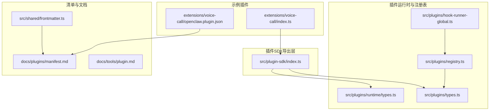
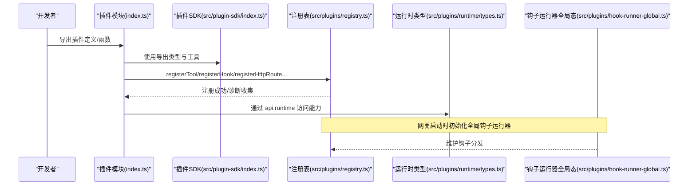
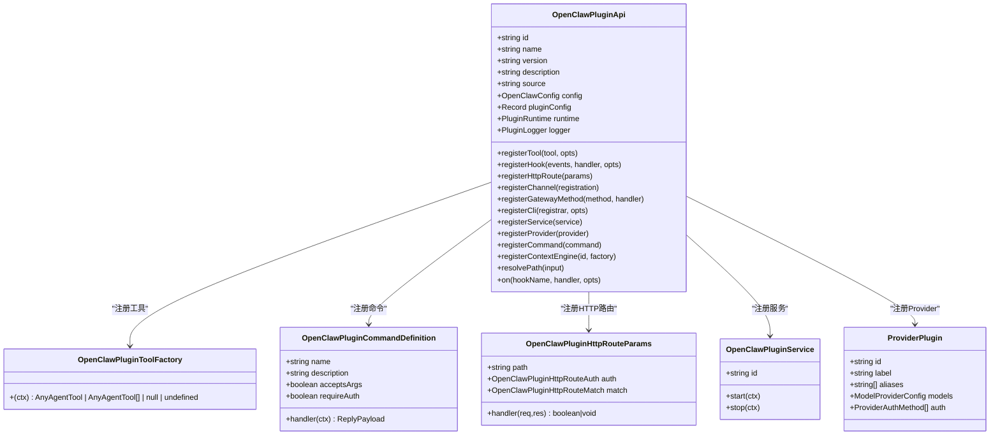
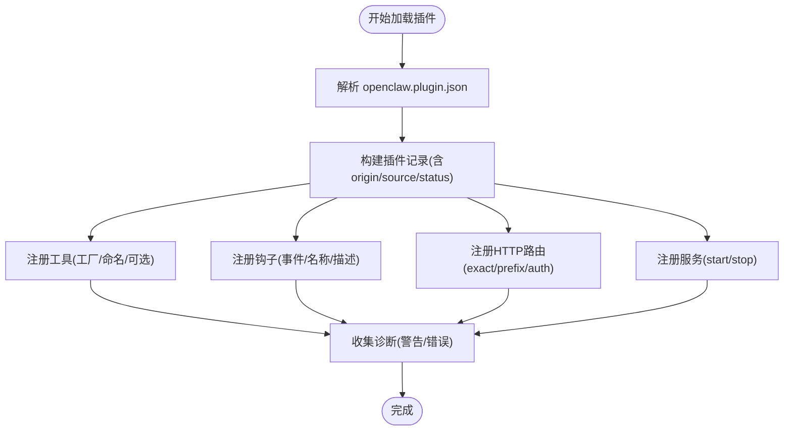
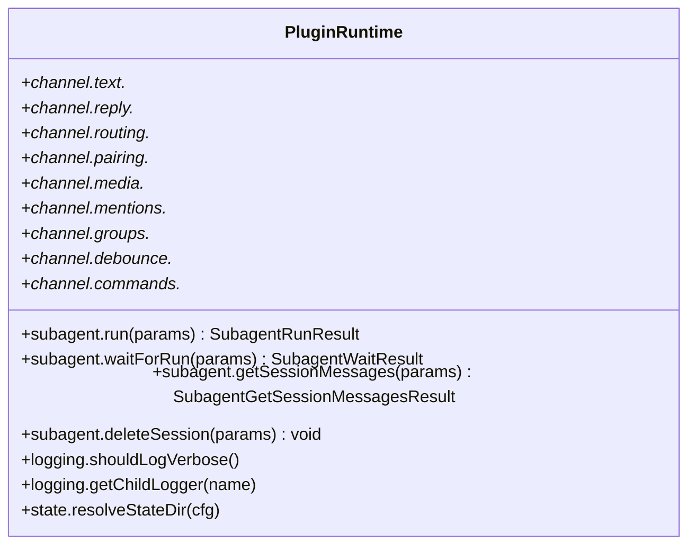
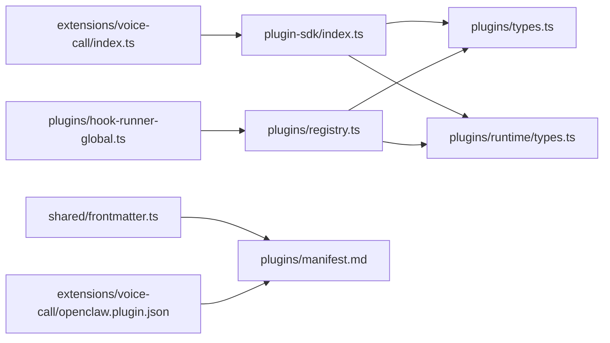

# 插件API

<cite>
**本文引用的文件**
- [src/plugin-sdk/index.ts](file://src/plugin-sdk/index.ts)
- [src/plugins/types.ts](file://src/plugins/types.ts)
- [src/plugins/registry.ts](file://src/plugins/registry.ts)
- [src/plugins/runtime/types.ts](file://src/plugins/runtime/types.ts)
- [src/plugins/hook-runner-global.ts](file://src/plugins/hook-runner-global.ts)
- [src/shared/frontmatter.ts](file://src/shared/frontmatter.ts)
- [docs/plugins/manifest.md](file://docs/plugins/manifest.md)
- [docs/tools/plugin.md](file://docs/tools/plugin.md)
- [extensions/voice-call/openclaw.plugin.json](file://extensions/voice-call/openclaw.plugin.json)
- [extensions/voice-call/index.ts](file://extensions/voice-call/index.ts)
- [SECURITY.md](file://SECURITY.md)
- [src/gateway/server.impl.ts](file://src/gateway/server.impl.ts)
- [src/plugins/config-state.ts](file://src/plugins/config-state.ts)
- [scripts/test-perf-budget.mjs](file://scripts/test-perf-budget.mjs)
</cite>

## 目录
1. [简介](#简介)
2. [项目结构](#项目结构)
3. [核心组件](#核心组件)
4. [架构总览](#架构总览)
5. [详细组件分析](#详细组件分析)
6. [依赖关系分析](#依赖关系分析)
7. [性能考量](#性能考量)
8. [故障排查指南](#故障排查指南)
9. [结论](#结论)
10. [附录](#附录)

## 简介
本文件为 OpenClaw 插件 API 的开发参考文档，面向希望扩展 OpenClaw 功能的开发者。内容覆盖插件系统架构、扩展点与集成机制，详细说明插件接口规范、生命周期管理、事件系统与工具注册；并提供从 manifest.json 配置、类型定义、依赖管理到打包发布的完整开发指南，以及调试、测试策略与性能优化方法。同时解释插件权限模型、安全边界与沙箱机制，并给出可复用的插件开发示例与最佳实践。

## 项目结构
OpenClaw 插件系统由“插件SDK导出层”“插件运行时与注册表”“钩子运行器全局态”“清单解析与验证”“官方文档与示例插件”等模块组成。下图展示与插件API相关的核心文件与职责映射：

图表来源
- [src/plugin-sdk/index.ts:1-826](file://src/plugin-sdk/index.ts#L1-L826)
- [src/plugins/types.ts:1-893](file://src/plugins/types.ts#L1-L893)
- [src/plugins/registry.ts:1-625](file://src/plugins/registry.ts#L1-L625)
- [src/plugins/runtime/types.ts:1-64](file://src/plugins/runtime/types.ts#L1-L64)
- [src/plugins/hook-runner-global.ts:1-46](file://src/plugins/hook-runner-global.ts#L1-L46)
- [src/shared/frontmatter.ts:43-154](file://src/shared/frontmatter.ts#L43-L154)
- [docs/plugins/manifest.md:1-76](file://docs/plugins/manifest.md#L1-L76)
- [docs/tools/plugin.md:1-963](file://docs/tools/plugin.md#L1-L963)
- [extensions/voice-call/openclaw.plugin.json:1-612](file://extensions/voice-call/openclaw.plugin.json#L1-L612)
- [extensions/voice-call/index.ts:1-543](file://extensions/voice-call/index.ts#L1-L543)

章节来源
- [src/plugin-sdk/index.ts:1-826](file://src/plugin-sdk/index.ts#L1-L826)
- [src/plugins/types.ts:1-893](file://src/plugins/types.ts#L1-L893)
- [src/plugins/registry.ts:1-625](file://src/plugins/registry.ts#L1-L625)
- [src/plugins/runtime/types.ts:1-64](file://src/plugins/runtime/types.ts#L1-L64)
- [src/plugins/hook-runner-global.ts:1-46](file://src/plugins/hook-runner-global.ts#L1-L46)
- [src/shared/frontmatter.ts:43-154](file://src/shared/frontmatter.ts#L43-L154)
- [docs/plugins/manifest.md:1-76](file://docs/plugins/manifest.md#L1-L76)
- [docs/tools/plugin.md:1-963](file://docs/tools/plugin.md#L1-L963)
- [extensions/voice-call/openclaw.plugin.json:1-612](file://extensions/voice-call/openclaw.plugin.json#L1-L612)
- [extensions/voice-call/index.ts:1-543](file://extensions/voice-call/index.ts#L1-L543)

## 核心组件
- 插件SDK导出层：统一导出插件开发所需的类型、工具函数与适配器，便于按需引入，避免全量导入导致的耦合。
- 插件类型与接口：定义插件API、工具工厂、命令、HTTP路由、CLI注册器、服务、上下文引擎等类型，以及插件钩子名称与事件载荷。
- 插件注册表：维护插件记录、工具注册、钩子注册、通道注册、提供者注册、网关方法、HTTP路由、CLI注册器、服务与命令等集合，并提供诊断收集。
- 运行时类型：定义插件运行时能力（如子代理运行、通道能力、日志与状态目录解析等），供插件在运行期调用。
- 钩子运行器全局态：在网关启动时初始化全局钩子运行器，使插件可在任意位置触发与监听钩子。
- 清单解析与验证：解析 openclaw.plugin.json，提取 id、kind、channels、providers、skills、uiHints、configSchema 等字段，并进行严格校验。
- 官方文档与示例：提供插件安装、发现顺序、配置规则、钩子使用、通道插件注册、Provider 插件注册、HTTP 路由与 CLI 命令注册等权威说明；示例插件 voice-call 展示了工具、网关方法、服务与 CLI 的完整实现。

章节来源
- [src/plugin-sdk/index.ts:1-826](file://src/plugin-sdk/index.ts#L1-L826)
- [src/plugins/types.ts:263-306](file://src/plugins/types.ts#L263-L306)
- [src/plugins/registry.ts:129-142](file://src/plugins/registry.ts#L129-L142)
- [src/plugins/runtime/types.ts:51-63](file://src/plugins/runtime/types.ts#L51-L63)
- [src/plugins/hook-runner-global.ts:36-46](file://src/plugins/hook-runner-global.ts#L36-L46)
- [src/shared/frontmatter.ts:62-154](file://src/shared/frontmatter.ts#L62-L154)
- [docs/tools/plugin.md:484-521](file://docs/tools/plugin.md#L484-L521)
- [docs/plugins/manifest.md:18-76](file://docs/plugins/manifest.md#L18-L76)
- [extensions/voice-call/index.ts:146-543](file://extensions/voice-call/index.ts#L146-L543)

## 架构总览
OpenClaw 插件系统采用“声明式注册 + 运行时注入”的架构。插件通过导出对象或函数形式注册扩展点，OpenClaw 在加载阶段读取清单与类型，构建注册表并初始化钩子运行器。运行期插件通过 api.runtime 访问核心能力，按需注册工具、命令、HTTP 路由、网关方法、服务、上下文引擎与通道插件。

图表来源
- [src/plugins/registry.ts:185-608](file://src/plugins/registry.ts#L185-L608)
- [src/plugins/runtime/types.ts:51-63](file://src/plugins/runtime/types.ts#L51-L63)
- [src/plugins/hook-runner-global.ts:36-46](file://src/plugins/hook-runner-global.ts#L36-L46)
- [src/plugin-sdk/index.ts:1-826](file://src/plugin-sdk/index.ts#L1-L826)

章节来源
- [src/plugins/registry.ts:185-608](file://src/plugins/registry.ts#L185-L608)
- [src/plugins/runtime/types.ts:51-63](file://src/plugins/runtime/types.ts#L51-L63)
- [src/plugins/hook-runner-global.ts:36-46](file://src/plugins/hook-runner-global.ts#L36-L46)
- [src/plugin-sdk/index.ts:1-826](file://src/plugin-sdk/index.ts#L1-L826)

## 详细组件分析

### 插件API与类型体系
- OpenClawPluginApi：插件对外暴露的唯一入口，包含 id/name/version/description/source/config/pluginConfig/runtime/logger 以及 registerTool/registerHook/registerHttpRoute/registerChannel/registerGatewayMethod/registerCli/registerService/registerProvider/registerCommand/registerContextEngine/resolvePath/on 等方法。
- OpenClawPluginToolFactory：根据上下文返回一个或多个工具，支持可选工具与多命名。
- OpenClawPluginCommandDefinition：插件自定义命令定义，支持描述、是否需要授权、参数与处理器。
- OpenClawPluginHttpRouteParams：HTTP 路由注册参数，支持 exact/prefix 匹配与认证级别。
- OpenClawPluginService：后台服务生命周期（start/stop）。
- OpenClawPluginChannelRegistration：通道插件注册，支持 Dock。
- ProviderPlugin：模型提供者插件，支持多种认证方式与默认模型设置。
- 插件钩子：涵盖模型解析、提示词构建、消息收发、工具调用、会话生命周期、子代理生命周期、网关启停等事件，支持 typed 与 legacy 两类钩子。

图表来源
- [src/plugins/types.ts:263-306](file://src/plugins/types.ts#L263-L306)
- [src/plugins/types.ts:75-77](file://src/plugins/types.ts#L75-L77)
- [src/plugins/types.ts:186-203](file://src/plugins/types.ts#L186-L203)
- [src/plugins/types.ts:213-219](file://src/plugins/types.ts#L213-L219)
- [src/plugins/types.ts:237-241](file://src/plugins/types.ts#L237-L241)
- [src/plugins/types.ts:122-132](file://src/plugins/types.ts#L122-L132)

章节来源
- [src/plugins/types.ts:263-306](file://src/plugins/types.ts#L263-L306)
- [src/plugins/types.ts:75-77](file://src/plugins/types.ts#L75-L77)
- [src/plugins/types.ts:186-203](file://src/plugins/types.ts#L186-L203)
- [src/plugins/types.ts:213-219](file://src/plugins/types.ts#L213-L219)
- [src/plugins/types.ts:237-241](file://src/plugins/types.ts#L237-L241)
- [src/plugins/types.ts:122-132](file://src/plugins/types.ts#L122-L132)

### 插件注册表与生命周期
- 注册表结构：包含 plugins、tools、hooks、typedHooks、channels、providers、gatewayHandlers、httpRoutes、cliRegistrars、services、commands、diagnostics 等集合。
- 工具注册：支持单个工具或工厂、多命名、可选标记。
- 钩子注册：支持事件列表、名称、描述、注册策略与内部钩子注册。
- HTTP 路由注册：支持 exact/prefix 匹配、认证级别、替换现有路由。
- 服务注册：后台服务的生命周期回调。
- 诊断收集：对缺失名称、未知事件、非法配置等发出警告或错误。

图表来源
- [src/plugins/registry.ts:189-288](file://src/plugins/registry.ts#L189-L288)
- [src/plugins/registry.ts:575-608](file://src/plugins/registry.ts#L575-L608)
- [src/shared/frontmatter.ts:62-154](file://src/shared/frontmatter.ts#L62-L154)

章节来源
- [src/plugins/registry.ts:129-142](file://src/plugins/registry.ts#L129-L142)
- [src/plugins/registry.ts:189-288](file://src/plugins/registry.ts#L189-L288)
- [src/plugins/registry.ts:575-608](file://src/plugins/registry.ts#L575-L608)
- [src/shared/frontmatter.ts:62-154](file://src/shared/frontmatter.ts#L62-L154)

### 运行时能力与子代理
- 子代理运行：支持 run/waitForRun/getSessionMessages/getSession/deleteSession 等操作，用于派生子会话与等待结果。
- 通道能力：文本分块、提及匹配、路由解析、配对、媒体拉取与保存、去抖动、命令授权等。
- 日志与状态：日志器、子日志器、状态目录解析。
- 全局钩子运行器：在网关启动时初始化，监听 gateway_start 等事件。

图表来源
- [src/plugins/runtime/types.ts:51-63](file://src/plugins/runtime/types.ts#L51-L63)
- [docs/zh-CN/refactor/plugin-sdk.md:54-152](file://docs/zh-CN/refactor/plugin-sdk.md#L54-L152)

章节来源
- [src/plugins/runtime/types.ts:51-63](file://src/plugins/runtime/types.ts#L51-L63)
- [docs/zh-CN/refactor/plugin-sdk.md:54-152](file://docs/zh-CN/refactor/plugin-sdk.md#L54-L152)
- [src/plugins/hook-runner-global.ts:36-46](file://src/plugins/hook-runner-global.ts#L36-L46)
- [src/gateway/server.impl.ts:939-947](file://src/gateway/server.impl.ts#L939-L947)

### 清单与配置验证
- 必填字段：id、configSchema；可选字段：kind、channels、providers、skills、name、description、uiHints、version。
- JSON Schema 要求：每个插件必须提供 JSON Schema，即使为空。
- 验证行为：未知 channels 键、plugins.entries.<id>、plugins.allow/deny、plugins.slots.* 必须引用“可发现”的插件 id；manifest 缺失或 schema 错误会导致验证失败；禁用插件保留配置并在 Doctor 中告警。
- UI 提示：uiHints 支持标签、帮助、敏感字段、占位符等，用于控制 UI 表单渲染。

章节来源
- [docs/plugins/manifest.md:18-76](file://docs/plugins/manifest.md#L18-L76)
- [src/shared/frontmatter.ts:62-154](file://src/shared/frontmatter.ts#L62-L154)

### 示例：Voice Call 插件
- 清单：openclaw.plugin.json 提供 uiHints 与 configSchema，覆盖电话号码、提供商、隧道、流式语音、TTS/STT 等配置项。
- 注册：在 register 回调中解析配置、校验提供商、创建运行时、注册 Gateway 方法（initiate/continue/speak/end/status/start）、注册工具、CLI 与服务。
- 关键点：提供者选择与弃用提示、错误处理与响应格式、服务生命周期管理。

章节来源
- [extensions/voice-call/openclaw.plugin.json:1-612](file://extensions/voice-call/openclaw.plugin.json#L1-L612)
- [extensions/voice-call/index.ts:146-543](file://extensions/voice-call/index.ts#L146-L543)

## 依赖关系分析
- 插件SDK导出层聚合了大量工具与类型，插件仅按需引入，降低耦合度。
- 注册表依赖类型系统与钩子系统，负责集中管理插件扩展点。
- 运行时类型与钩子运行器全局态共同支撑插件在运行期的行为。
- 清单解析与文档共同保障插件发现与配置的正确性。

图表来源
- [src/plugin-sdk/index.ts:1-826](file://src/plugin-sdk/index.ts#L1-L826)
- [src/plugins/types.ts:1-893](file://src/plugins/types.ts#L1-L893)
- [src/plugins/registry.ts:1-625](file://src/plugins/registry.ts#L1-L625)
- [src/plugins/runtime/types.ts:1-64](file://src/plugins/runtime/types.ts#L1-L64)
- [src/plugins/hook-runner-global.ts:1-46](file://src/plugins/hook-runner-global.ts#L1-L46)
- [src/shared/frontmatter.ts:43-154](file://src/shared/frontmatter.ts#L43-L154)
- [docs/plugins/manifest.md:1-76](file://docs/plugins/manifest.md#L1-L76)
- [extensions/voice-call/index.ts:1-543](file://extensions/voice-call/index.ts#L1-L543)
- [extensions/voice-call/openclaw.plugin.json:1-612](file://extensions/voice-call/openclaw.plugin.json#L1-L612)

章节来源
- [src/plugin-sdk/index.ts:1-826](file://src/plugin-sdk/index.ts#L1-L826)
- [src/plugins/registry.ts:1-625](file://src/plugins/registry.ts#L1-L625)
- [src/plugins/hook-runner-global.ts:1-46](file://src/plugins/hook-runner-global.ts#L1-L46)
- [src/shared/frontmatter.ts:43-154](file://src/shared/frontmatter.ts#L43-L154)
- [docs/plugins/manifest.md:1-76](file://docs/plugins/manifest.md#L1-L76)
- [extensions/voice-call/index.ts:1-543](file://extensions/voice-call/index.ts#L1-L543)
- [extensions/voice-call/openclaw.plugin.json:1-612](file://extensions/voice-call/openclaw.plugin.json#L1-L612)

## 性能考量
- 钩子执行顺序与优先级：高优先级先执行，合并上下文字段时按执行顺序拼接；建议将静态提示前缀迁移到 prependSystemContext/appendSystemContext，以利用提供方缓存。
- 插件发现与清单缓存：可通过环境变量禁用或调整缓存窗口，减少启动/重载时的突发工作量。
- 测试性能预算：提供脚本用于限制测试用例的墙钟时间与回归幅度，便于持续集成中的性能回归检测。

章节来源
- [docs/tools/plugin.md:575-603](file://docs/tools/plugin.md#L575-L603)
- [docs/tools/plugin.md:219-227](file://docs/tools/plugin.md#L219-L227)
- [scripts/test-perf-budget.mjs:98-127](file://scripts/test-perf-budget.mjs#L98-L127)

## 故障排查指南
- 插件未加载或被禁用：检查 plugins.entries.<id>.enabled 与 plugins.allow/deny；确认插件 id 是否在 manifest 中声明且可发现。
- 清单与配置错误：核对 openclaw.plugin.json 的必需字段与 JSON Schema；Unknown id 或 channels 键将导致验证失败；禁用插件保留配置并在 Doctor 中告警。
- 钩子问题：确认事件名与钩子类型一致；若禁用 prompt 注入，legacy before_agent_start 的 prompt 变更字段会被忽略。
- 服务与生命周期：确保服务 start/stop 正确实现；异常应记录日志而非抛出致命错误。
- 网关钩子：gateway_start 在网关启动时触发，失败会被记录为警告。

章节来源
- [docs/plugins/manifest.md:53-63](file://docs/plugins/manifest.md#L53-L63)
- [docs/tools/plugin.md:384-392](file://docs/tools/plugin.md#L384-L392)
- [docs/tools/plugin.md:575-579](file://docs/tools/plugin.md#L575-L579)
- [src/gateway/server.impl.ts:939-947](file://src/gateway/server.impl.ts#L939-L947)

## 结论
OpenClaw 插件API通过清晰的类型体系、严格的清单与配置验证、灵活的注册表与钩子运行器，提供了强大的扩展能力。开发者可按需注册工具、命令、HTTP 路由、网关方法、服务、上下文引擎与通道插件，并借助运行时能力与钩子系统实现复杂业务逻辑。遵循本文档的开发与最佳实践，可确保插件在功能完整性、安全性与性能方面达到预期。

## 附录

### 开发参考清单
- 插件清单与配置
  - 必备字段：id、configSchema
  - 可选字段：kind、channels、providers、skills、name、description、uiHints、version
  - JSON Schema 要求：严格校验，空 schema 可接受
- 类型定义与工具
  - 使用 SDK 子路径按需引入，避免全量导入
  - 工具工厂支持多命名与可选工具
  - 命令定义支持描述、是否需要授权、参数与处理器
- 生命周期与钩子
  - typed 钩子优先于 legacy 钩子
  - prompt 注入可按插件粒度禁用
  - gateway_start 在网关启动时触发
- 运行时能力
  - 子代理运行、会话消息查询与删除
  - 通道文本分块、提及匹配、路由解析、配对、媒体处理、去抖动、命令授权
  - 日志与状态目录解析
- 安全与权限
  - 插件被视为受信任代码，安装/启用即授予与本地代码相同的信任级别
  - 安全报告需证明越界（例如未认证加载、白名单/策略绕过、沙箱/路径越界），而不仅是插件内恶意行为
- 打包与发布
  - 使用 npm 规范（包名+可选精确版本或 dist-tag），Git/URL/范围被拒绝
  - 依赖安装时禁用生命周期脚本，保持纯 JS/TS 依赖树
  - package.json 中的 openclaw.extensions 列表可将多个文件作为插件导出

章节来源
- [docs/plugins/manifest.md:18-76](file://docs/plugins/manifest.md#L18-L76)
- [src/plugin-sdk/index.ts:1-826](file://src/plugin-sdk/index.ts#L1-L826)
- [src/plugins/types.ts:75-77](file://src/plugins/types.ts#L75-L77)
- [src/plugins/types.ts:186-203](file://src/plugins/types.ts#L186-L203)
- [docs/tools/plugin.md:522-598](file://docs/tools/plugin.md#L522-L598)
- [src/plugins/runtime/types.ts:51-63](file://src/plugins/runtime/types.ts#L51-L63)
- [SECURITY.md:104-110](file://SECURITY.md#L104-L110)
- [docs/tools/plugin.md:278-304](file://docs/tools/plugin.md#L278-L304)