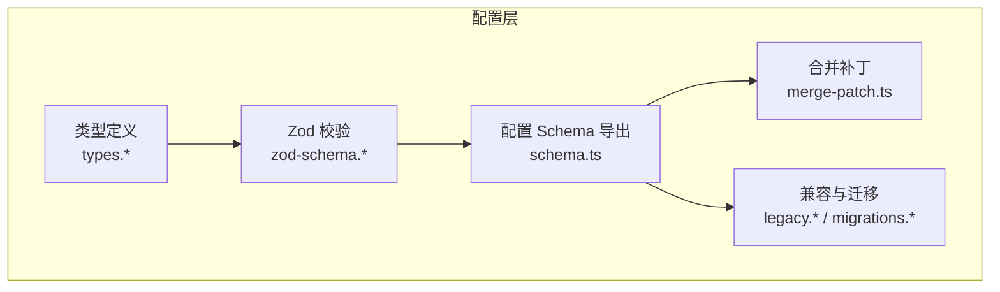
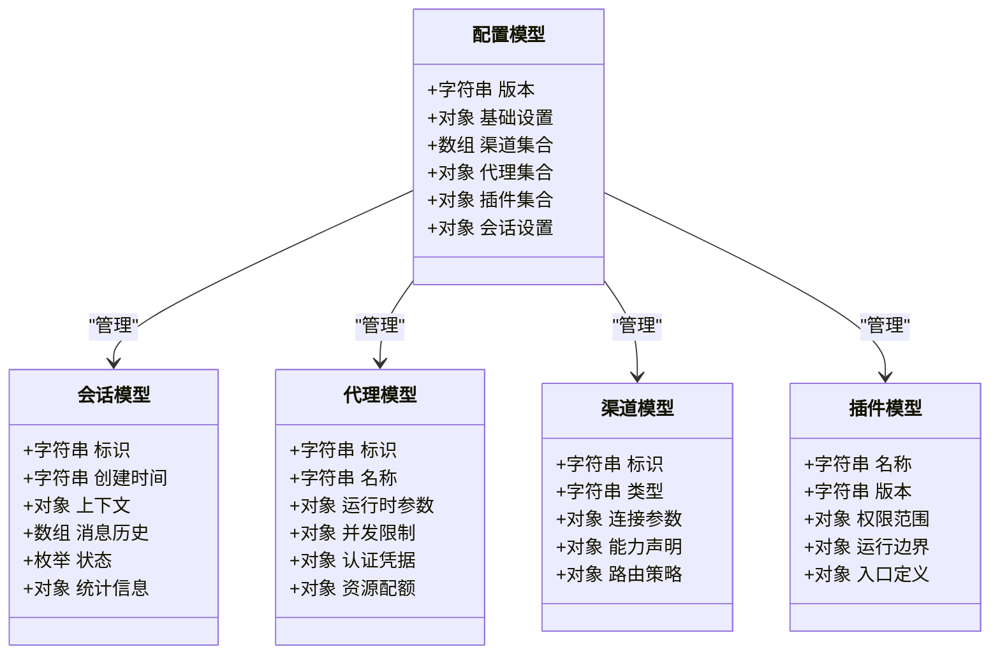
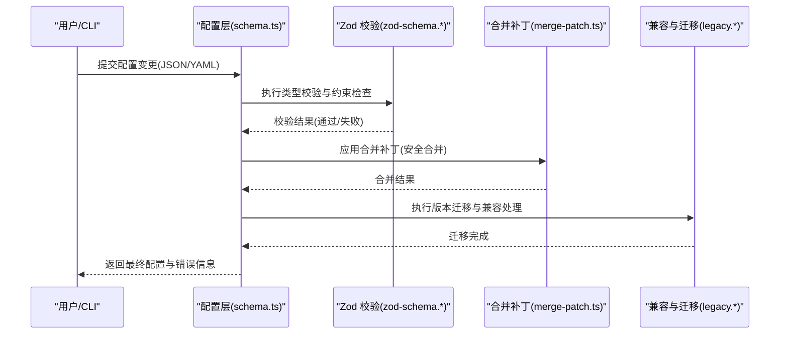
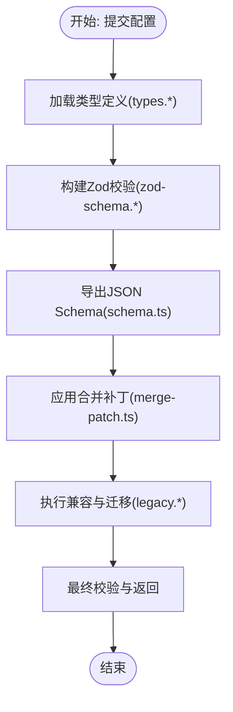
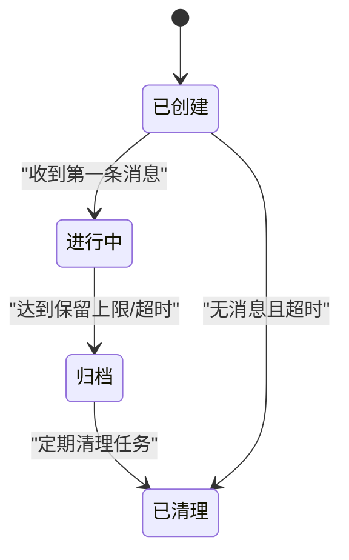
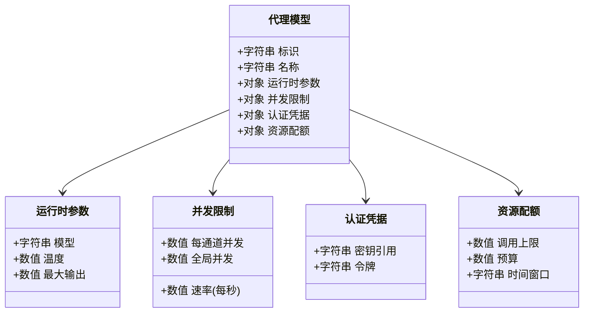
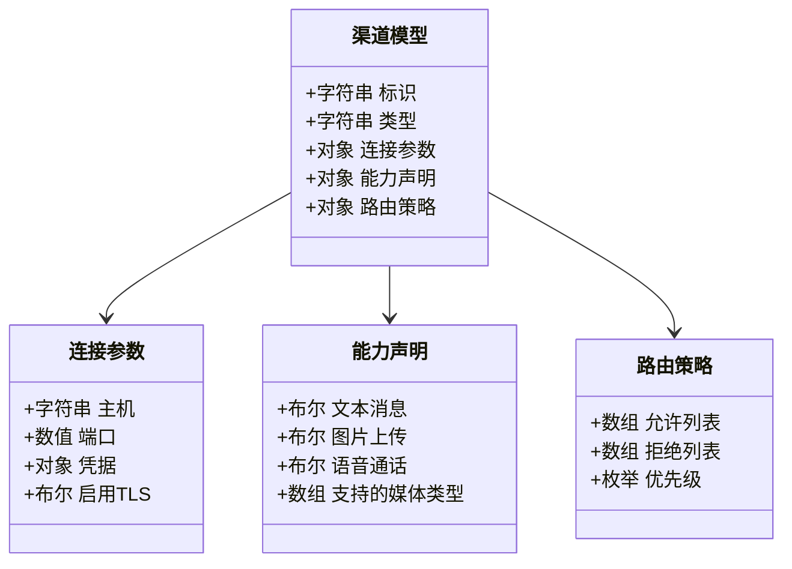
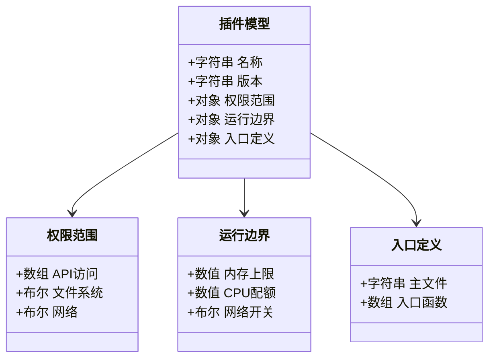
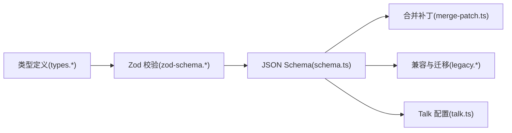

# 数据模型

<cite>
**本文引用的文件**
- [src/config/schema.ts](file://src/config/schema.ts)
- [src/config/zod-schema.ts](file://src/config/zod-schema.ts)
- [src/config/types.ts](file://src/config/types.ts)
- [src/config/merge-patch.ts](file://src/config/merge-patch.ts)
- [src/config/legacy.migrations.ts](file://src/config/legacy.migrations.ts)
- [src/config/legacy.migrations.part-1.ts](file://src/config/legacy.migrations.part-1.ts)
- [src/config/legacy.migrations.part-2.ts](file://src/config/legacy.migrations.part-2.ts)
- [src/config/legacy.migrations.part-3.ts](file://src/config/legacy.migrations.part-3.ts)
- [src/config/legacy.ts](file://src/config/legacy.ts)
- [src/config/legacy.shared.ts](file://src/config/legacy.shared.ts)
- [src/config/validation.ts](file://src/config/validation.ts)
- [src/config/sessions.ts](file://src/config/sessions.ts)
- [src/config/talk.ts](file://src/config/talk.ts)
- [src/config/types.sessions.ts](file://src/config/types.sessions.ts)
- [src/config/types.agents.ts](file://src/config/types.agents.ts)
- [src/config/types.plugins.ts](file://src/config/types.plugins.ts)
- [src/config/types.channels.ts](file://src/config/types.channels.ts)
- [src/config/types.models.ts](file://src/config/types.models.ts)
- [src/config/types.secrets.ts](file://src/config/types.secrets.ts)
- [src/config/types.base.ts](file://src/config/types.base.ts)
- [src/config/types.openclaw.ts](file://src/config/types.openclaw.ts)
- [src/config/types.messages.ts](file://src/config/types.messages.ts)
- [src/config/types.memory.ts](file://src/config/types.memory.ts)
- [src/config/types.tools.ts](file://src/config/types.tools.ts)
- [src/config/types.hooks.ts](file://src/config/types.hooks.ts)
- [src/config/types.cron.ts](file://src/config/types.cron.ts)
- [src/config/types.auth.ts](file://src/config/types.auth.ts)
- [src/config/types.sandbox.ts](file://src/config/types.sandbox.ts)
- [src/config/types.node-host.ts](file://src/config/types.node-host.ts)
- [src/config/types.installs.ts](file://src/config/types.installs.ts)
- [src/config/types.discord.ts](file://src/config/types.discord.ts)
- [src/config/types.slack.ts](file://src/config/types.slack.ts)
- [src/config/types.telegram.ts](file://src/config/types.telegram.ts)
- [src/config/types.irc.ts](file://src/config/types.irc.ts)
- [src/config/types.imessage.ts](file://src/config/types.imessage.ts)
- [src/config/types.msteams.ts](file://src/config/types.msteams.ts)
- [src/config/types.signal.ts](file://src/config/types.signal.ts)
- [src/config/types.whatsapp.ts](file://src/config/types.whatsapp.ts)
- [src/config/types.googlechat.ts](file://src/config/types.googlechat.ts)
- [src/config/types.tts.ts](file://src/config/types.tts.ts)
- [src/config/types.gateway.ts](file://src/config/types.gateway.ts)
- [src/config/types.browser.ts](file://src/config/types.browser.ts)
- [src/config/types.channel-messaging-common.ts](file://src/config/types.channel-messaging-common.ts)
- [src/config/types.skills.ts](file://src/config/types.skills.ts)
- [src/config/types.queue.ts](file://src/config/types.queue.ts)
- [src/config/types.models.ts](file://src/config/types.models.ts)
- [src/config/types.models.ts](file://src/config/types.models.ts)
- [src/config/types.models.ts](file://src/config/types.models.ts)
- [src/config/types.models.ts](file://src/config/types.models.ts)
- [src/config/types.models.ts](file://src/config/types.models.ts)
- [src/config/types.models.ts](file://src/config/types.models.ts)
- [src/config/types.models.ts](file://src/config/types.models.ts)
- [src/config/types.models.ts](file://src/config/types.models.ts)
- [src/config/types.models.ts](file://src/config/types.models.ts)
- [src/config/types.models.ts](file://src/config/types.models.ts)
- [src/config/types.models.ts](file://src/config/types.models.ts)
- [src/config/types.models.ts](file://src/config/types.models.ts)
- [src/config/types.models.ts](file://src/config/types.models.ts)
- [src/config/types.models.ts](file://src/config/types.models.ts)
- [src/config/types.models.ts](file://src/config/types.models.ts)
- [src/config/types.models.ts](file://src/config/types.models.ts)
- [src/config/types.models.ts](file://src/config/types.models.ts)
- [src/config/types.models.ts](file://src/config/types.models.ts)
- [src/config/types.models.ts](file://src/config/types.models.ts)
- [src/config/types.models.ts](file://src/config/types.models.ts)
- [src/config/types.models.ts](file://src/config/types.models.ts)
- [src/config/types.models.ts](file://src/config/types.models.ts)
- [src/config/types.models.ts](file://src/config/types.models.ts)
- [src/config/types.models.ts](file://src/config/types.models.ts)
- [src/config/types.models.ts](file://src/config/types.models.ts)
- [src/config/types.models.ts](file://src/config/types.models.ts)
- [src/config/types.models.ts](file://src/config/types.models.ts)
- [src/config/types.models.ts](file://src/config/types.models.ts)
- [src/config/types.models.ts](file://src/config/types.models.ts)
- [src/config/types.models.ts](file://src/config/types.models.ts)
- [src/config/types.models.ts](file://src/config/types.models.ts)
- [src/config/types.models.ts](file://src/config/types.models......)
</cite>

## 目录
1. [引言](#引言)
2. [项目结构](#项目结构)
3. [核心组件](#核心组件)
4. [架构总览](#架构总览)
5. [详细组件分析](#详细组件分析)
6. [依赖分析](#依赖分析)
7. [性能考量](#性能考量)
8. [故障排查指南](#故障排查指南)
9. [结论](#结论)
10. [附录](#附录)

## 引言
本文件为 OpenClaw 的数据模型参考文档，聚焦于系统中的核心数据结构、实体关系与字段定义，覆盖配置模型、会话模型、代理模型、渠道模型与插件模型，并提供 JSON Schema 定义思路、数据验证规则、业务约束、序列化格式、版本兼容性与迁移策略、数据生命周期与存储结构、访问模式、使用示例、最佳实践与性能考虑。本文所有技术细节均来自仓库源码与文档，确保可追溯与可验证。

## 项目结构
OpenClaw 的数据模型主要集中在 src/config 目录下，围绕“类型定义 + 校验 Schema + 合并补丁 + 迁移”四个维度构建。核心模块包括：
- 类型定义：types.* 系列文件，定义各子系统的数据契约（如 agents、channels、plugins、sessions 等）
- 校验 Schema：zod-schema.* 系列文件，基于 Zod 将类型转换为运行时校验器
- 配置 Schema：schema.ts，统一导出配置层的 JSON Schema 与校验逻辑
- 合并与补丁：merge-patch.ts，支持安全合并配置补丁
- 兼容与迁移：legacy.* 与 legacy.migrations.*，处理历史配置与版本演进

**图表来源**
- [src/config/schema.ts](file://src/config/schema.ts)
- [src/config/zod-schema.ts](file://src/config/zod-schema.ts)
- [src/config/merge-patch.ts](file://src/config/merge-patch.ts)
- [src/config/legacy.migrations.ts](file://src/config/legacy.migrations.ts)
- [src/config/legacy.ts](file://src/config/legacy.ts)

**章节来源**
- [src/config/schema.ts](file://src/config/schema.ts)
- [src/config/zod-schema.ts](file://src/config/zod-schema.ts)
- [src/config/types.ts](file://src/config/types.ts)
- [src/config/merge-patch.ts](file://src/config/merge-patch.ts)
- [src/config/legacy.migrations.ts](file://src/config/legacy.migrations.ts)
- [src/config/legacy.ts](file://src/config/legacy.ts)

## 核心组件
本节概述五类核心数据模型及其职责边界与交互关系：
- 配置模型：描述系统整体配置的结构与约束，负责输入校验、默认值与兼容性
- 会话模型：描述一次对话或任务执行的上下文状态与生命周期
- 代理模型：描述智能体的运行参数、并发控制、认证与资源配额
- 渠道模型：描述消息通道的连接参数、能力与路由策略
- 插件模型：描述插件清单、权限与运行边界

**图表来源**
- [src/config/types.sessions.ts](file://src/config/types.sessions.ts)
- [src/config/types.agents.ts](file://src/config/types.agents.ts)
- [src/config/types.plugins.ts](file://src/config/types.plugins.ts)
- [src/config/types.channels.ts](file://src/config/types.channels.ts)
- [src/config/types.ts](file://src/config/types.ts)

**章节来源**
- [src/config/types.sessions.ts](file://src/config/types.sessions.ts)
- [src/config/types.agents.ts](file://src/config/types.agents.ts)
- [src/config/types.plugins.ts](file://src/config/types.plugins.ts)
- [src/config/types.channels.ts](file://src/config/types.channels.ts)
- [src/config/types.ts](file://src/config/types.ts)

## 架构总览
配置层通过类型定义与 Zod 校验形成强约束的数据契约，再经由 schema.ts 导出统一的 JSON Schema 与运行时校验器。合并补丁模块提供安全的增量更新机制；兼容与迁移模块保障历史配置平滑升级。

**图表来源**
- [src/config/schema.ts](file://src/config/schema.ts)
- [src/config/zod-schema.ts](file://src/config/zod-schema.ts)
- [src/config/merge-patch.ts](file://src/config/merge-patch.ts)
- [src/config/legacy.migrations.ts](file://src/config/legacy.migrations.ts)
- [src/config/legacy.ts](file://src/config/legacy.ts)

## 详细组件分析

### 配置模型
- 职责：统一承载系统配置的结构、默认值、校验规则与兼容策略
- 关键点：
  - 类型定义：types.ts 与各子模块 types.* 定义字段、可选/必填、枚举与嵌套对象
  - 校验实现：zod-schema.ts 将类型映射为 Zod 校验器，提供运行时约束
  - JSON Schema 导出：schema.ts 汇总导出，便于外部工具集成
  - 合并策略：merge-patch.ts 支持安全合并，避免覆盖敏感字段
  - 兼容迁移：legacy.* 与 legacy.migrations.* 处理历史配置与版本演进

**图表来源**
- [src/config/types.ts](file://src/config/types.ts)
- [src/config/zod-schema.ts](file://src/config/zod-schema.ts)
- [src/config/schema.ts](file://src/config/schema.ts)
- [src/config/merge-patch.ts](file://src/config/merge-patch.ts)
- [src/config/legacy.migrations.ts](file://src/config/legacy.migrations.ts)
- [src/config/legacy.ts](file://src/config/legacy.ts)

**章节来源**
- [src/config/types.ts](file://src/config/types.ts)
- [src/config/zod-schema.ts](file://src/config/zod-schema.ts)
- [src/config/schema.ts](file://src/config/schema.ts)
- [src/config/merge-patch.ts](file://src/config/merge-patch.ts)
- [src/config/legacy.migrations.ts](file://src/config/legacy.migrations.ts)
- [src/config/legacy.ts](file://src/config/legacy.ts)

### 会话模型
- 职责：描述一次交互的上下文、消息历史、状态与统计信息
- 关键点：
  - 字段定义：标识、创建时间、上下文、消息历史、状态、统计信息等
  - 生命周期：创建、进行中、归档、清理等阶段的状态流转
  - 存储结构：以键值形式持久化，支持按会话检索与批量清理
  - 访问模式：读写分离、只增日志式消息历史、状态原子更新

**图表来源**
- [src/config/types.sessions.ts](file://src/config/types.sessions.ts)
- [src/config/sessions.ts](file://src/config/sessions.ts)

**章节来源**
- [src/config/types.sessions.ts](file://src/config/types.sessions.ts)
- [src/config/sessions.ts](file://src/config/sessions.ts)

### 代理模型
- 职责：描述智能体的运行参数、并发控制、认证与资源配额
- 关键点：
  - 运行时参数：模型选择、温度、最大输出长度等
  - 并发限制：每通道/全局并发度与速率限制
  - 认证凭据：密钥、令牌与凭据引用
  - 资源配额：调用次数、费用预算、时间窗口

**图表来源**
- [src/config/types.agents.ts](file://src/config/types.agents.ts)
- [src/config/types.models.ts](file://src/config/types.models.ts)
- [src/config/types.auth.ts](file://src/config/types.auth.ts)
- [src/config/types.queue.ts](file://src/config/types.queue.ts)

**章节来源**
- [src/config/types.agents.ts](file://src/config/types.agents.ts)
- [src/config/types.models.ts](file://src/config/types.models.ts)
- [src/config/types.auth.ts](file://src/config/types.auth.ts)
- [src/config/types.queue.ts](file://src/config/types.queue.ts)

### 渠道模型
- 职责：描述消息通道的连接参数、能力与路由策略
- 关键点：
  - 连接参数：鉴权、端点、协议选项
  - 能力声明：支持的消息类型、媒体能力、交互特性
  - 路由策略：允许/拒绝列表、优先级、回退策略
  - 平台适配：Discord、Slack、Telegram、IRC、iMessage、Teams、Signal、Google Chat 等

**图表来源**
- [src/config/types.channels.ts](file://src/config/types.channels.ts)
- [src/config/types.discord.ts](file://src/config/types.discord.ts)
- [src/config/types.slack.ts](file://src/config/types.slack.ts)
- [src/config/types.telegram.ts](file://src/config/types.telegram.ts)
- [src/config/types.irc.ts](file://src/config/types.irc.ts)
- [src/config/types.imessage.ts](file://src/config/types.imessage.ts)
- [src/config/types.msteams.ts](file://src/config/types.msteams.ts)
- [src/config/types.signal.ts](file://src/config/types.signal.ts)
- [src/config/types.googlechat.ts](file://src/config/types.googlechat.ts)

**章节来源**
- [src/config/types.channels.ts](file://src/config/types.channels.ts)
- [src/config/types.discord.ts](file://src/config/types.discord.ts)
- [src/config/types.slack.ts](file://src/config/types.slack.ts)
- [src/config/types.telegram.ts](file://src/config/types.telegram.ts)
- [src/config/types.irc.ts](file://src/config/types.irc.ts)
- [src/config/types.imessage.ts](file://src/config/types.imessage.ts)
- [src/config/types.msteams.ts](file://src/config/types.msteams.ts)
- [src/config/types.signal.ts](file://src/config/types.signal.ts)
- [src/config/types.googlechat.ts](file://src/config/types.googlechat.ts)

### 插件模型
- 职责：描述插件清单、权限与运行边界
- 关键点：
  - 清单字段：名称、版本、入口、权限范围、运行边界
  - 权限控制：最小权限原则、沙箱隔离
  - 运行边界：内存、CPU、网络与 I/O 限制
  - 自动启用：根据配置自动启用/禁用

**图表来源**
- [src/config/types.plugins.ts](file://src/config/types.plugins.ts)
- [src/config/types.sandbox.ts](file://src/config/types.sandbox.ts)
- [src/config/types.installs.ts](file://src/config/types.installs.ts)

**章节来源**
- [src/config/types.plugins.ts](file://src/config/types.plugins.ts)
- [src/config/types.sandbox.ts](file://src/config/types.sandbox.ts)
- [src/config/types.installs.ts](file://src/config/types.installs.ts)

## 依赖分析
配置层内部存在清晰的依赖关系：类型定义是基础，Zod 校验器依赖类型，JSON Schema 导出依赖校验器，合并补丁与迁移依赖配置结构。

**图表来源**
- [src/config/types.ts](file://src/config/types.ts)
- [src/config/zod-schema.ts](file://src/config/zod-schema.ts)
- [src/config/schema.ts](file://src/config/schema.ts)
- [src/config/merge-patch.ts](file://src/config/merge-patch.ts)
- [src/config/legacy.migrations.ts](file://src/config/legacy.migrations.ts)
- [src/config/legacy.ts](file://src/config/legacy.ts)
- [src/config/talk.ts](file://src/config/talk.ts)

**章节来源**
- [src/config/types.ts](file://src/config/types.ts)
- [src/config/zod-schema.ts](file://src/config/zod-schema.ts)
- [src/config/schema.ts](file://src/config/schema.ts)
- [src/config/merge-patch.ts](file://src/config/merge-patch.ts)
- [src/config/legacy.migrations.ts](file://src/config/legacy.migrations.ts)
- [src/config/legacy.ts](file://src/config/legacy.ts)
- [src/config/talk.ts](file://src/config/talk.ts)

## 性能考量
- 校验开销：Zod 校验在高并发场景下应尽量缓存 Schema 实例，避免重复构建
- 合并策略：合并补丁采用深度合并与白名单字段，减少不必要的写放大
- 迁移成本：迁移脚本分批执行，避免一次性大范围写入
- 存储结构：会话与消息采用只增日志式存储，降低随机写入开销
- 访问模式：读多写少的会话查询可通过索引优化，写入路径批量提交

## 故障排查指南
- 校验失败：检查字段类型、必填项与枚举值是否符合 zod-schema.* 的约束
- 合并冲突：确认合并补丁是否覆盖了受保护字段，必要时使用白名单合并
- 兼容问题：核对 legacy.migrations.* 是否正确执行，必要时回滚到上一版本
- 会话异常：检查会话状态机是否处于预期状态，清理过期会话
- 代理限流：核对并发限制与资源配额，调整速率或扩容

**章节来源**
- [src/config/validation.ts](file://src/config/validation.ts)
- [src/config/merge-patch.ts](file://src/config/merge-patch.ts)
- [src/config/legacy.migrations.ts](file://src/config/legacy.migrations.ts)
- [src/config/sessions.ts](file://src/config/sessions.ts)

## 结论
OpenClaw 的数据模型以类型驱动的配置体系为核心，通过严格的校验、安全的合并与完善的迁移机制，确保系统在演进过程中保持一致性与稳定性。建议在扩展新模型时遵循现有模式：先定义类型，再编写 Zod 校验，最后完善 JSON Schema 与迁移策略。

## 附录
- 使用示例：通过 CLI 或 Web 控制台提交配置，系统将自动执行校验与合并，并在需要时触发迁移
- 最佳实践：最小权限原则、白名单合并、幂等操作、版本化配置与回滚策略
- 性能优化：缓存 Schema、批量写入、索引优化、异步迁移