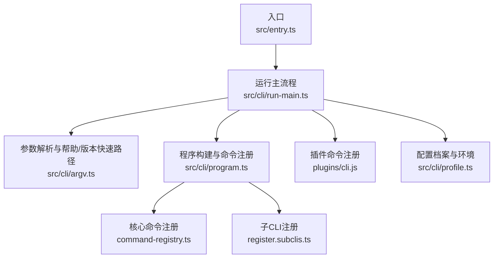
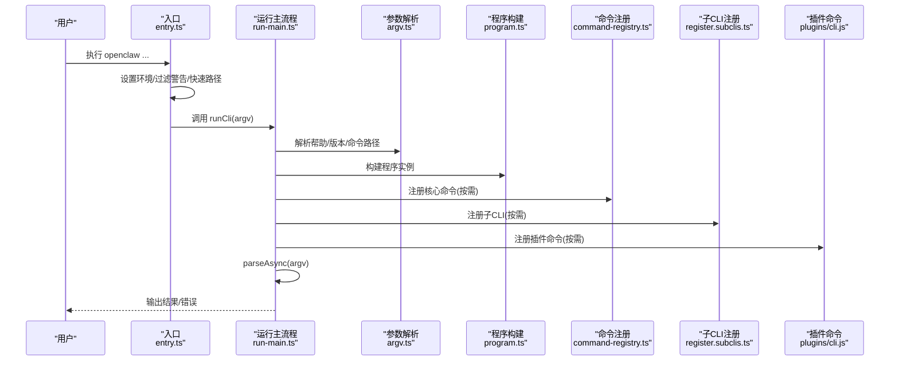
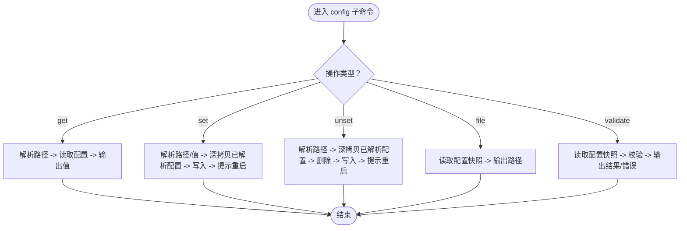
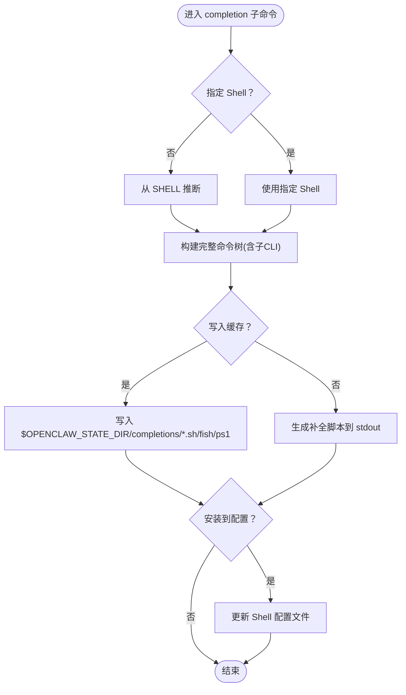
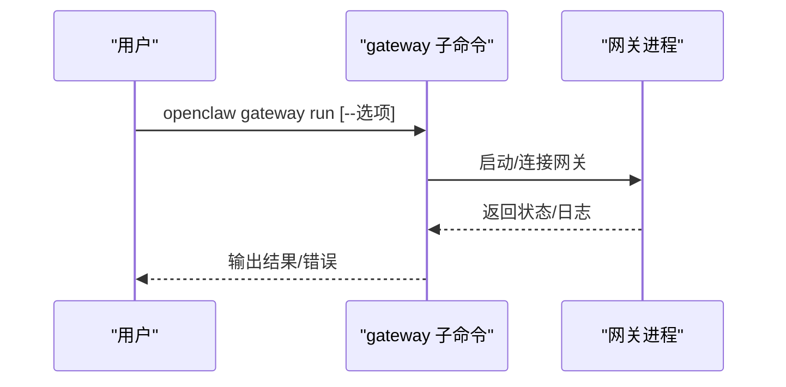
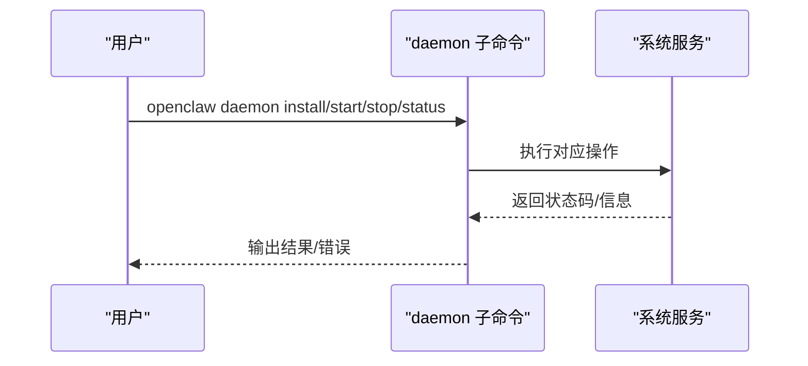
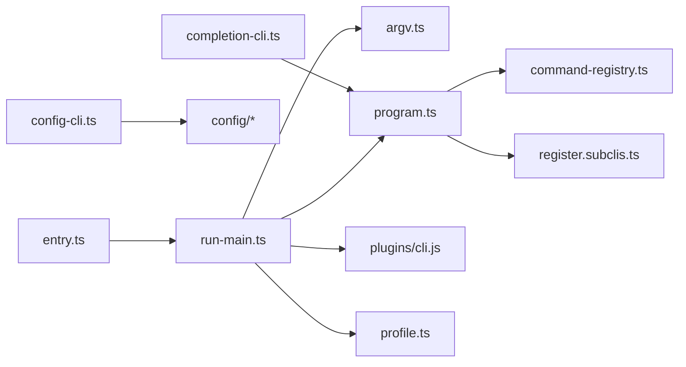

# CLI工具

<cite>
**本文引用的文件**
- [src/entry.ts](file://src/entry.ts)
- [src/cli/run-main.ts](file://src/cli/run-main.ts)
- [src/cli/argv.ts](file://src/cli/argv.ts)
- [src/cli/profile.ts](file://src/cli/profile.ts)
- [src/cli/program.ts](file://src/cli/program.ts)
- [src/cli/config-cli.ts](file://src/cli/config-cli.ts)
- [src/cli/completion-cli.ts](file://src/cli/completion-cli.ts)
- [src/cli/gateway-cli.ts](file://src/cli/gateway-cli.ts)
- [src/cli/daemon-cli.ts](file://src/cli/daemon-cli.ts)
</cite>

## 目录
1. [简介](#简介)
2. [项目结构](#项目结构)
3. [核心组件](#核心组件)
4. [架构总览](#架构总览)
5. [详细组件分析](#详细组件分析)
6. [依赖关系分析](#依赖关系分析)
7. [性能考量](#性能考量)
8. [故障排查指南](#故障排查指南)
9. [结论](#结论)
10. [附录](#附录)

## 简介
本文件为 OpenClaw CLI 工具的使用与开发文档，面向使用者与开发者，系统性说明 CLI 的架构设计、命令组织、功能覆盖范围与扩展方式。内容涵盖：
- 架构与启动流程：从入口到命令路由、插件注册与执行
- 命令体系：网关管理、代理控制、配置管理、调试工具、自动补全等
- 安装配置、常用命令示例与高级用法
- 配置系统、别名机制与自动补全
- 扩展开发、自定义命令与集成方法
- 最佳实践与常见问题排查

## 项目结构
OpenClaw CLI 采用模块化与延迟注册策略，入口负责环境准备与快速路径处理，随后按需构建命令树并解析参数。关键目录与职责概览：
- 入口与运行时：src/entry.ts、src/cli/run-main.ts
- 参数解析与路由：src/cli/argv.ts、src/cli/route.ts（间接通过 run-main 调用）
- 配置与档案：src/cli/profile.ts、src/config/*
- 命令注册与程序上下文：src/cli/program.ts、src/cli/program/command-registry.ts、src/cli/program/register.subclis.ts
- 核心命令实现：如 config、completion、gateway、daemon 等

**图示来源**
- [src/entry.ts:1-195](file://src/entry.ts#L1-L195)
- [src/cli/run-main.ts:1-156](file://src/cli/run-main.ts#L1-L156)
- [src/cli/argv.ts:1-329](file://src/cli/argv.ts#L1-L329)
- [src/cli/program.ts:1-3](file://src/cli/program.ts#L1-L3)
- [src/cli/profile.ts:1-128](file://src/cli/profile.ts#L1-L128)

**章节来源**
- [src/entry.ts:1-195](file://src/entry.ts#L1-L195)
- [src/cli/run-main.ts:1-156](file://src/cli/run-main.ts#L1-L156)
- [src/cli/argv.ts:1-329](file://src/cli/argv.ts#L1-L329)
- [src/cli/program.ts:1-3](file://src/cli/program.ts#L1-L3)
- [src/cli/profile.ts:1-128](file://src/cli/profile.ts#L1-L128)

## 核心组件
- 入口与启动器
  - src/entry.ts：设置进程标题、过滤警告、标准化环境变量、处理实验性警告抑制与快速路径（版本/帮助）、调用 run-main
  - src/cli/run-main.ts：加载 .env、确保 CLI 在 PATH 中、断言运行时支持、注册核心/子CLI与插件命令、捕获控制台输出、解析并执行命令
- 参数与路由
  - src/cli/argv.ts：解析帮助/版本标志、提取命令路径、解析布尔/值型参数、判断是否需要状态迁移
- 配置与档案
  - src/cli/profile.ts：解析 --dev/--profile，应用档案环境变量（状态目录、配置路径、端口等），避免覆盖显式设置
- 程序构建与注册
  - src/cli/program.ts：导出 buildProgram 与端口强制函数；实际实现位于 program/build-program.ts
  - 延迟注册：仅在需要时注册核心命令与子CLI，减少启动开销

**章节来源**
- [src/entry.ts:1-195](file://src/entry.ts#L1-L195)
- [src/cli/run-main.ts:1-156](file://src/cli/run-main.ts#L1-L156)
- [src/cli/argv.ts:1-329](file://src/cli/argv.ts#L1-L329)
- [src/cli/profile.ts:1-128](file://src/cli/profile.ts#L1-L128)
- [src/cli/program.ts:1-3](file://src/cli/program.ts#L1-L3)

## 架构总览
下图展示 CLI 启动到命令执行的关键交互：

**图示来源**
- [src/entry.ts:166-194](file://src/entry.ts#L166-L194)
- [src/cli/run-main.ts:74-151](file://src/cli/run-main.ts#L74-L151)
- [src/cli/argv.ts:12-106](file://src/cli/argv.ts#L12-L106)
- [src/cli/program.ts:1-3](file://src/cli/program.ts#L1-L3)

## 详细组件分析

### 配置命令（config）
- 功能概述
  - 提供非交互式配置辅助：获取、设置、删除、打印配置文件路径、验证配置
  - 支持路径表达式（点号与方括号）与 JSON5 值解析
  - 对特定键（如 Ollama）进行联动校验与默认值注入
- 关键能力
  - get：按路径读取值，支持 JSON 输出
  - set：按路径写入值，严格 JSON5 或回退字符串
  - unset：按路径删除键或数组索引
  - file：打印当前生效配置文件路径
  - validate：离线校验配置有效性
- 使用场景
  - 快速定位配置项、批量修改、CI 校验配置
- 注意事项
  - 写入后通常需要重启网关以生效
  - 删除路径不存在会报错并退出

**图示来源**
- [src/cli/config-cli.ts:279-476](file://src/cli/config-cli.ts#L279-L476)

**章节来源**
- [src/cli/config-cli.ts:1-477](file://src/cli/config-cli.ts#L1-L477)

### 自动补全命令（completion）
- 功能概述
  - 生成多 Shell（zsh、bash、fish、PowerShell）补全脚本
  - 支持写入缓存目录与安装到 Shell 配置文件
  - 检测慢速动态加载模式并提示优化
- 关键能力
  - 生成/安装补全脚本
  - 缓存补全脚本至 $OPENCLAW_STATE_DIR/completions
  - 检测现有配置块并去重更新
- 使用场景
  - 新环境快速启用补全、CI 缓存补全脚本、统一团队补全策略

**图示来源**
- [src/cli/completion-cli.ts:231-301](file://src/cli/completion-cli.ts#L231-L301)
- [src/cli/completion-cli.ts:303-377](file://src/cli/completion-cli.ts#L303-L377)

**章节来源**
- [src/cli/completion-cli.ts:1-666](file://src/cli/completion-cli.ts#L1-L666)

### 网关命令（gateway）
- 功能概述
  - 网关生命周期管理：运行、发现、开发模式等
  - 与网关 RPC/守护进程交互
- 常见子命令
  - run：启动网关（可带选项）
  - discover：发现可用网关
  - dev：开发模式相关
- 使用场景
  - 本地开发联调、远程网关接入、网关健康检查

**图示来源**
- [src/cli/gateway-cli.ts:1-2](file://src/cli/gateway-cli.ts#L1-L2)

**章节来源**
- [src/cli/gateway-cli.ts:1-2](file://src/cli/gateway-cli.ts#L1-L2)

### 守护进程命令（daemon）
- 功能概述
  - 安装/卸载/启动/停止/重启网关服务
  - 查询状态与健康度
- 常见子命令
  - install：安装系统服务
  - start/stop/restart：服务启停控制
  - status：查询服务状态
  - uninstall：卸载服务
- 使用场景
  - 生产环境长期运行、开机自启、服务化运维

**图示来源**
- [src/cli/daemon-cli.ts:1-16](file://src/cli/daemon-cli.ts#L1-L16)

**章节来源**
- [src/cli/daemon-cli.ts:1-16](file://src/cli/daemon-cli.ts#L1-L16)

### 其他常用命令与工具
- doctor：诊断配置与运行环境问题
- logs：查看日志
- memory：内存状态与诊断
- models：模型列表与状态
- secrets：密钥审计与管理
- hooks/webhooks：钩子与 Webhook 管理
- sandbox：沙箱工具
- system：系统信息
- tui：文本界面工具
- update：更新 CLI（内部重写 --update 为 update 子命令）

上述命令均通过延迟注册与插件机制集成，具体实现可在相应文件中查阅。

**章节来源**
- [src/cli/run-main.ts:114-147](file://src/cli/run-main.ts#L114-L147)

## 依赖关系分析
- 入口依赖运行主流程与参数解析
- 运行主流程依赖程序构建、命令注册、插件注册与配置档案
- 命令注册依赖程序上下文与子CLI映射
- 配置命令依赖配置读写与校验工具
- 补全命令依赖程序上下文与 Shell 配置文件

**图示来源**
- [src/entry.ts:166-194](file://src/entry.ts#L166-L194)
- [src/cli/run-main.ts:74-151](file://src/cli/run-main.ts#L74-L151)
- [src/cli/argv.ts:12-106](file://src/cli/argv.ts#L12-L106)
- [src/cli/program.ts:1-3](file://src/cli/program.ts#L1-L3)
- [src/cli/profile.ts:1-128](file://src/cli/profile.ts#L1-L128)
- [src/cli/config-cli.ts:1-477](file://src/cli/config-cli.ts#L1-L477)
- [src/cli/completion-cli.ts:1-666](file://src/cli/completion-cli.ts#L1-L666)

**章节来源**
- [src/entry.ts:1-195](file://src/entry.ts#L1-L195)
- [src/cli/run-main.ts:1-156](file://src/cli/run-main.ts#L1-L156)
- [src/cli/argv.ts:1-329](file://src/cli/argv.ts#L1-L329)
- [src/cli/program.ts:1-3](file://src/cli/program.ts#L1-L3)
- [src/cli/profile.ts:1-128](file://src/cli/profile.ts#L1-L128)
- [src/cli/config-cli.ts:1-477](file://src/cli/config-cli.ts#L1-L477)
- [src/cli/completion-cli.ts:1-666](file://src/cli/completion-cli.ts#L1-L666)

## 性能考量
- 延迟注册：仅在需要时注册核心命令与子CLI，避免启动时构建完整命令树
- 快速路径：帮助/版本在入口层直接处理，减少不必要的初始化
- 控制台捕获：将输出结构化记录，便于后续分析但不影响 stdout/stderr 行为
- 实验性警告抑制：通过子进程方式抑制警告，避免阻塞启动

**章节来源**
- [src/cli/run-main.ts:114-147](file://src/cli/run-main.ts#L114-L147)
- [src/entry.ts:166-194](file://src/entry.ts#L166-L194)

## 故障排查指南
- 版本/帮助异常
  - 检查入口快速路径逻辑与 NODE_OPTIONS/实验性警告抑制设置
- 命令未找到或解析失败
  - 使用 --dev 或 --profile 指定档案，确认 OPENCLAW_STATE_DIR/OPENCLAW_CONFIG_PATH 是否正确
  - 使用 doctor 命令诊断配置与运行环境
- 补全失效
  - 使用 completion --write-state 生成缓存脚本
  - 使用 completion --install 安装到 Shell 配置
  - 检查是否使用了慢速动态加载模式（source <(...)）
- 权限与 PATH
  - 运行主流程会在必要时确保 CLI 在 PATH 中，若仍不可用，请手动添加

**章节来源**
- [src/entry.ts:166-194](file://src/entry.ts#L166-L194)
- [src/cli/run-main.ts:74-92](file://src/cli/run-main.ts#L74-L92)
- [src/cli/completion-cli.ts:285-301](file://src/cli/completion-cli.ts#L285-L301)
- [src/cli/completion-cli.ts:303-377](file://src/cli/completion-cli.ts#L303-L377)

## 结论
OpenClaw CLI 通过清晰的入口与运行主流程、灵活的延迟注册与插件机制、完善的配置与档案系统，提供了稳定高效的命令行体验。使用者可通过配置、补全与诊断工具提升效率，开发者可基于命令注册与子CLI扩展机制进行二次开发与集成。

## 附录

### 安装与配置指南
- 安装
  - 使用包管理器或发行渠道安装 CLI
- 首次配置
  - 使用 config 命令进行非交互式配置，或运行无子命令的 config 进入向导
  - 通过 --dev 或 --profile 切换档案，避免覆盖显式环境变量
- 环境变量
  - OPENCLAW_STATE_DIR：状态目录（默认 ~/.openclaw[-profile]）
  - OPENCLAW_CONFIG_PATH：配置文件路径
  - OPENCLAW_GATEWAY_PORT：网关端口（dev 档案默认 19001）

**章节来源**
- [src/cli/profile.ts:91-127](file://src/cli/profile.ts#L91-L127)
- [src/cli/config-cli.ts:395-476](file://src/cli/config-cli.ts#L395-L476)

### 常用命令示例与高级用法
- 获取配置项
  - openclaw config get <path> [--json]
- 设置配置项
  - openclaw config set <path> <value> [--strict-json]
- 删除配置项
  - openclaw config unset <path>
- 打印配置文件路径
  - openclaw config file
- 验证配置
  - openclaw config validate [--json]
- 生成并安装补全
  - openclaw completion --write-state
  - openclaw completion --install
- 网关管理
  - openclaw gateway run [--选项]
  - openclaw gateway discover
- 守护进程
  - openclaw daemon install/start/stop/restart/status/uninstall

**章节来源**
- [src/cli/config-cli.ts:417-476](file://src/cli/config-cli.ts#L417-L476)
- [src/cli/completion-cli.ts:231-301](file://src/cli/completion-cli.ts#L231-L301)
- [src/cli/gateway-cli.ts:1-2](file://src/cli/gateway-cli.ts#L1-L2)
- [src/cli/daemon-cli.ts:1-16](file://src/cli/daemon-cli.ts#L1-L16)

### 扩展开发与集成
- 自定义命令
  - 通过子CLI机制注册新命令，遵循延迟注册原则以提升性能
  - 参考命令注册与程序上下文实现
- 插件集成
  - 插件命令在运行主流程中按需注册，确保与核心命令一致的解析行为
- 最佳实践
  - 使用 --dev/--profile 管理不同环境
  - 将补全脚本写入缓存目录并安装到 Shell 配置
  - 使用 doctor 与 validate 保障配置质量

**章节来源**
- [src/cli/run-main.ts:114-147](file://src/cli/run-main.ts#L114-L147)
- [src/cli/program.ts:1-3](file://src/cli/program.ts#L1-L3)