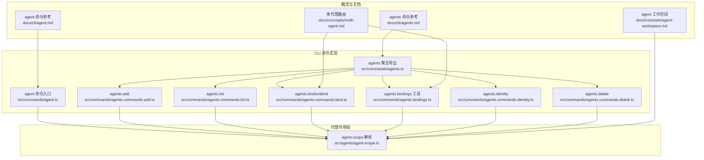
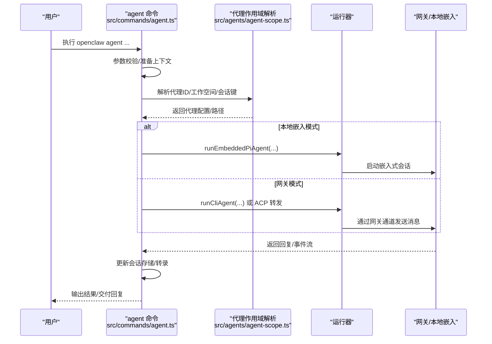
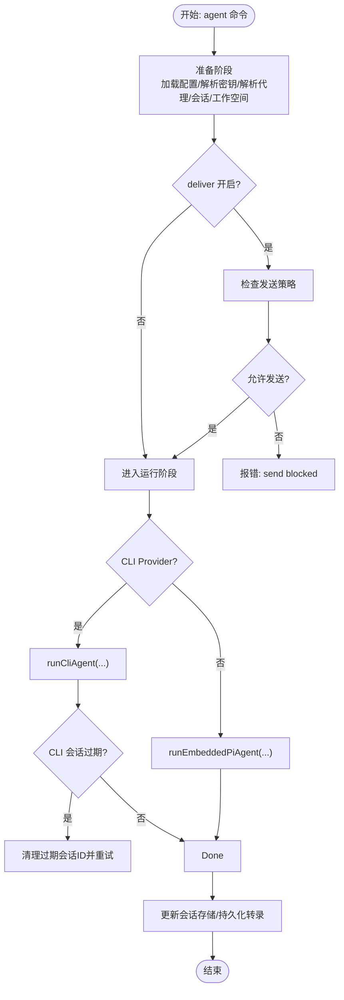
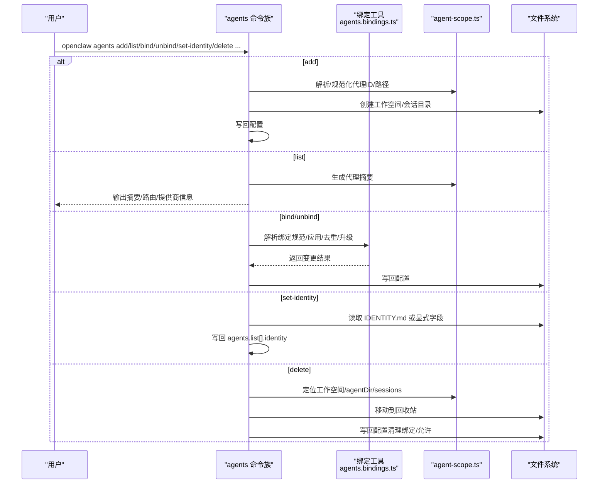
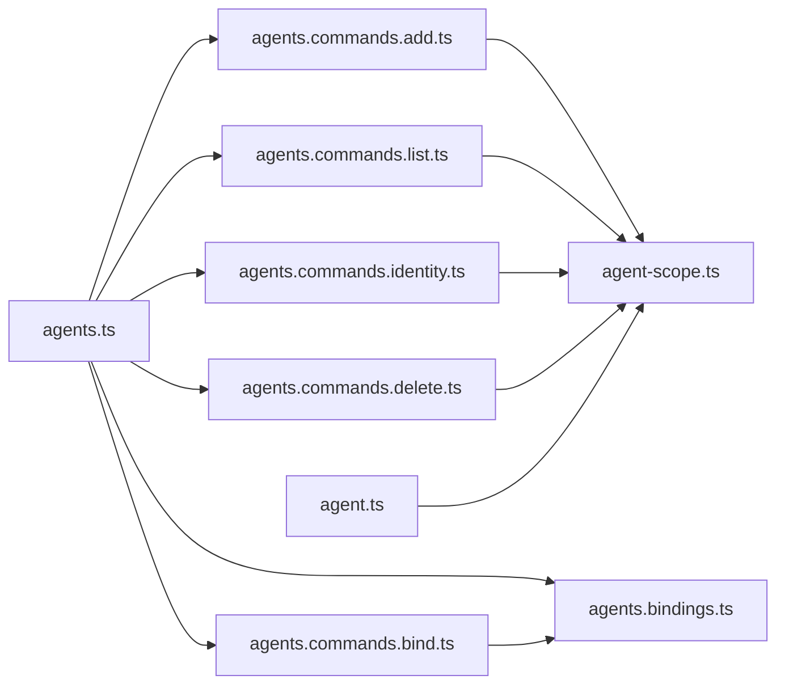

# 代理管理

<cite>
**本文引用的文件**
- [docs/cli/agent.md](file://docs/cli/agent.md)
- [docs/cli/agents.md](file://docs/cli/agents.md)
- [docs/concepts/agent-workspace.md](file://docs/concepts/agent-workspace.md)
- [docs/concepts/multi-agent.md](file://docs/concepts/multi-agent.md)
- [src/commands/agent.ts](file://src/commands/agent.ts)
- [src/commands/agents.ts](file://src/commands/agents.ts)
- [src/commands/agents.commands.add.ts](file://src/commands/agents.commands.add.ts)
- [src/commands/agents.commands.list.ts](file://src/commands/agents.commands.list.ts)
- [src/commands/agents.commands.bind.ts](file://src/commands/agents.commands.bind.ts)
- [src/commands/agents.bindings.ts](file://src/commands/agents.bindings.ts)
- [src/commands/agents.commands.identity.ts](file://src/commands/agents.commands.identity.ts)
- [src/commands/agents.commands.delete.ts](file://src/commands/agents.commands.delete.ts)
- [src/agents/agent-scope.ts](file://src/agents/agent-scope.ts)
</cite>

## 目录
1. [简介](#简介)
2. [项目结构](#项目结构)
3. [核心组件](#核心组件)
4. [架构总览](#架构总览)
5. [详细组件分析](#详细组件分析)
6. [依赖关系分析](#依赖关系分析)
7. [性能考量](#性能考量)
8. [故障排除指南](#故障排除指南)
9. [结论](#结论)
10. [附录](#附录)

## 简介
本文件面向 OpenClaw 代理管理系统用户与维护者，系统性说明两类 CLI 命令的使用与内部机制：
- 单次代理调用：通过 agent 命令触发一次代理回合（可选交付回复），支持网关通道与本地嵌入模式。
- 代理生命周期管理：通过 agents 命令对多代理进行创建、列出、绑定路由、解绑、设置身份、删除等全生命周期操作。

文档同时覆盖代理工作空间隔离、认证配置、路由绑定高级规则、模板与配置管理、批量操作技巧、性能监控与故障诊断等主题，帮助您在生产环境中安全、稳定地运行多代理系统。

## 项目结构
OpenClaw 的代理管理由“概念文档 + CLI 命令实现 + 代理作用域解析”三层组成：
- 概念层：工作空间、多代理路由、沙箱与工具策略等基础概念。
- 文档层：CLI 参考与概念说明，指导用户正确使用命令与理解行为。
- 实现层：命令入口与执行逻辑，负责参数解析、会话管理、模型选择、本地嵌入与网关交互、路由绑定应用等。

图表来源
- [docs/cli/agent.md:1-29](file://docs/cli/agent.md#L1-L29)
- [docs/cli/agents.md:1-124](file://docs/cli/agents.md#L1-L124)
- [docs/concepts/agent-workspace.md:1-237](file://docs/concepts/agent-workspace.md#L1-L237)
- [docs/concepts/multi-agent.md:1-553](file://docs/concepts/multi-agent.md#L1-L553)
- [src/commands/agent.ts:1-800](file://src/commands/agent.ts#L1-L800)
- [src/commands/agents.ts:1-8](file://src/commands/agents.ts#L1-L8)
- [src/commands/agents.commands.add.ts:1-369](file://src/commands/agents.commands.add.ts#L1-L369)
- [src/commands/agents.commands.list.ts:1-136](file://src/commands/agents.commands.list.ts#L1-L136)
- [src/commands/agents.commands.bind.ts:1-387](file://src/commands/agents.commands.bind.ts#L1-L387)
- [src/commands/agents.bindings.ts:1-327](file://src/commands/agents.bindings.ts#L1-L327)
- [src/commands/agents.commands.identity.ts:1-234](file://src/commands/agents.commands.identity.ts#L1-L234)
- [src/commands/agents.commands.delete.ts:1-102](file://src/commands/agents.commands.delete.ts#L1-L102)
- [src/agents/agent-scope.ts:1-339](file://src/agents/agent-scope.ts#L1-L339)

章节来源
- [docs/cli/agent.md:1-29](file://docs/cli/agent.md#L1-L29)
- [docs/cli/agents.md:1-124](file://docs/cli/agents.md#L1-L124)
- [docs/concepts/agent-workspace.md:1-237](file://docs/concepts/agent-workspace.md#L1-L237)
- [docs/concepts/multi-agent.md:1-553](file://docs/concepts/multi-agent.md#L1-L553)
- [src/commands/agent.ts:1-800](file://src/commands/agent.ts#L1-L800)
- [src/commands/agents.ts:1-8](file://src/commands/agents.ts#L1-L8)
- [src/commands/agents.commands.add.ts:1-369](file://src/commands/agents.commands.add.ts#L1-L369)
- [src/commands/agents.commands.list.ts:1-136](file://src/commands/agents.commands.list.ts#L1-L136)
- [src/commands/agents.commands.bind.ts:1-387](file://src/commands/agents.commands.bind.ts#L1-L387)
- [src/commands/agents.bindings.ts:1-327](file://src/commands/agents.bindings.ts#L1-L327)
- [src/commands/agents.commands.identity.ts:1-234](file://src/commands/agents.commands.identity.ts#L1-L234)
- [src/commands/agents.commands.delete.ts:1-102](file://src/commands/agents.commands.delete.ts#L1-L102)
- [src/agents/agent-scope.ts:1-339](file://src/agents/agent-scope.ts#L1-L339)

## 核心组件
- 单次代理调用（agent）
  - 支持通过网关通道或本地嵌入模式运行一次代理回合；可选交付回复、指定思考层级、超时控制、图片输入、流式参数等。
  - 内部处理会话解析、模型选择、认证配置、事件上报、会话存储更新与转录持久化。
- 多代理生命周期（agents）
  - 提供添加、列出、绑定/解绑路由、设置身份、删除等子命令，配合工作空间与状态目录实现完全隔离。
  - 绑定解析支持通道默认账号、插件解析、强制账号绑定等高级场景。
- 代理作用域与路径解析
  - 统一解析代理 ID、默认代理、工作空间与 agentDir、模型回退策略等，确保不同命令间的一致性。

章节来源
- [docs/cli/agent.md:8-29](file://docs/cli/agent.md#L8-L29)
- [docs/cli/agents.md:8-124](file://docs/cli/agents.md#L8-L124)
- [src/commands/agent.ts:504-707](file://src/commands/agent.ts#L504-L707)
- [src/commands/agents.commands.add.ts:51-177](file://src/commands/agents.commands.add.ts#L51-L177)
- [src/commands/agents.commands.list.ts:75-135](file://src/commands/agents.commands.list.ts#L75-L135)
- [src/commands/agents.commands.bind.ts:208-386](file://src/commands/agents.commands.bind.ts#L208-L386)
- [src/commands/agents.bindings.ts:75-159](file://src/commands/agents.bindings.ts#L75-L159)
- [src/commands/agents.commands.identity.ts:68-233](file://src/commands/agents.commands.identity.ts#L68-L233)
- [src/commands/agents.commands.delete.ts:19-101](file://src/commands/agents.commands.delete.ts#L19-L101)
- [src/agents/agent-scope.ts:46-145](file://src/agents/agent-scope.ts#L46-L145)

## 架构总览
下图展示从 CLI 到代理运行与会话管理的关键流程，包括本地嵌入与网关两种后端路径。

图表来源
- [src/commands/agent.ts:504-707](file://src/commands/agent.ts#L504-L707)
- [src/commands/agent.ts:320-502](file://src/commands/agent.ts#L320-L502)
- [src/agents/agent-scope.ts:256-339](file://src/agents/agent-scope.ts#L256-L339)

章节来源
- [src/commands/agent.ts:504-707](file://src/commands/agent.ts#L504-L707)
- [src/commands/agent.ts:320-502](file://src/commands/agent.ts#L320-L502)
- [src/agents/agent-scope.ts:256-339](file://src/agents/agent-scope.ts#L256-L339)

## 详细组件分析

### 单次代理调用（agent 命令）
- 功能要点
  - 必须提供消息内容与目标（E.164、会话ID/键或代理ID）之一。
  - 支持思考层级与一次性思考层级校验，超时秒数解析与毫秒转换。
  - 会话解析支持从 to/sessionId/sessionKey 推断代理ID，必要时校验会话键与代理ID一致性。
  - 发送策略与交付开关：当 deliver 开启时，检查会话发送策略是否允许。
  - 本地嵌入与网关模式切换：根据 provider 是否为 CLI Provider 决定 runEmbeddedPiAgent 或 runCliAgent。
  - 会话存储更新与转录持久化：写入用户消息与助手回复，触发转录文件更新事件。
- 关键流程
  - 准备阶段：加载配置、解析密钥引用、规范化 spawn 元数据、解析代理与会话、解析工作空间与 agentDir、构建运行上下文。
  - 运行阶段：根据 provider 决策本地嵌入或 CLI 网关；处理 CLI 会话过期重试与新会话ID回写；收集事件并上报。
  - 结束阶段：更新会话存储、持久化 ACP 转录、输出结果。

图表来源
- [src/commands/agent.ts:504-707](file://src/commands/agent.ts#L504-L707)
- [src/commands/agent.ts:320-502](file://src/commands/agent.ts#L320-L502)
- [src/commands/agent.ts:127-140](file://src/commands/agent.ts#L127-L140)

章节来源
- [docs/cli/agent.md:10-29](file://docs/cli/agent.md#L10-L29)
- [src/commands/agent.ts:504-707](file://src/commands/agent.ts#L504-L707)
- [src/commands/agent.ts:320-502](file://src/commands/agent.ts#L320-L502)

### 代理生命周期管理（agents 命令族）
- 添加代理（add）
  - 支持非交互模式（需提供工作空间与名称）与向导模式；自动规范化代理ID、避免保留名冲突、检测重复。
  - 可选复制默认代理的认证资料到新代理；可引导配置模型/认证、通道登录与路由绑定。
  - 最终确保工作空间与会话目录存在，并写回配置。
- 列表（list）
  - 输出每个代理的 ID/名称、工作空间、agentDir、模型、路由规则概要与提供商状态摘要。
  - 支持 --bindings 显示完整路由规则；支持 --json 输出结构化数据。
- 绑定/解绑（bind/unbind）
  - 绑定：解析绑定规范（通道[:账号]），支持插件解析默认账号、强制账号绑定、升级已有通道级绑定为账号级绑定。
  - 解绑：支持按绑定列表或 --all 清空某代理的所有路由绑定；冲突检测与缺失提示。
- 设置身份（set-identity）
  - 支持从 IDENTITY.md 文件或显式字段设置 name/emoji/theme/avatar；支持从工作空间根读取 IDENTITY.md。
  - 写回 agents.list[].identity 并更新配置。
- 删除（delete）
  - 非交互模式需要 --force；删除代理配置条目、工作空间、agentDir、会话目录（移入回收站），并清理相关绑定与允许项。

图表来源
- [src/commands/agents.commands.add.ts:51-177](file://src/commands/agents.commands.add.ts#L51-L177)
- [src/commands/agents.commands.list.ts:75-135](file://src/commands/agents.commands.list.ts#L75-L135)
- [src/commands/agents.commands.bind.ts:208-386](file://src/commands/agents.commands.bind.ts#L208-L386)
- [src/commands/agents.bindings.ts:75-159](file://src/commands/agents.bindings.ts#L75-L159)
- [src/commands/agents.commands.identity.ts:68-233](file://src/commands/agents.commands.identity.ts#L68-L233)
- [src/commands/agents.commands.delete.ts:19-101](file://src/commands/agents.commands.delete.ts#L19-L101)
- [src/agents/agent-scope.ts:256-339](file://src/agents/agent-scope.ts#L256-L339)

章节来源
- [docs/cli/agents.md:8-124](file://docs/cli/agents.md#L8-L124)
- [src/commands/agents.commands.add.ts:51-177](file://src/commands/agents.commands.add.ts#L51-L177)
- [src/commands/agents.commands.list.ts:75-135](file://src/commands/agents.commands.list.ts#L75-L135)
- [src/commands/agents.commands.bind.ts:208-386](file://src/commands/agents.commands.bind.ts#L208-L386)
- [src/commands/agents.bindings.ts:75-159](file://src/commands/agents.bindings.ts#L75-L159)
- [src/commands/agents.commands.identity.ts:68-233](file://src/commands/agents.commands.identity.ts#L68-L233)
- [src/commands/agents.commands.delete.ts:19-101](file://src/commands/agents.commands.delete.ts#L19-L101)
- [src/agents/agent-scope.ts:256-339](file://src/agents/agent-scope.ts#L256-L339)

### 代理工作空间隔离与认证配置
- 工作空间
  - 默认位置与按配置覆盖；支持按 profile 区分工作空间；支持跳过引导文件创建。
  - 工作空间内标准文件清单（如 AGENTS.md、SOUL.md、IDENTITY.md 等）与备份建议。
- 认证
  - 每个代理拥有独立 agentDir 存放认证资料与模型注册表；跨代理不共享凭据。
  - 支持 per-agent 沙箱与工具限制，提升安全性与资源控制。
- 路由绑定
  - 绑定解析支持通道默认账号、插件解析、强制账号绑定；支持将通道级绑定升级为账号级绑定以减少歧义。
  - 绑定冲突检测与去重，保证路由确定性与最具体优先。

章节来源
- [docs/concepts/agent-workspace.md:24-125](file://docs/concepts/agent-workspace.md#L24-L125)
- [docs/concepts/multi-agent.md:40-553](file://docs/concepts/multi-agent.md#L40-L553)
- [src/commands/agents.bindings.ts:229-262](file://src/commands/agents.bindings.ts#L229-L262)
- [src/commands/agents.bindings.ts:37-55](file://src/commands/agents.bindings.ts#L37-L55)

### 代理模板与配置管理
- 模板与引导
  - 新建工作空间时可选择跳过引导文件创建；后续可通过 setup 重建缺失文件而不覆盖既有内容。
- 配置结构
  - agents.list 中的 identity 字段用于设置名称、主题、表情与头像；支持从 IDENTITY.md 导入。
  - 每个代理可独立设置模型、技能过滤、内存检索、心跳、群聊提及模式、沙箱与工具策略等。
- 批量操作技巧
  - 使用 agents add 的非交互模式配合 --workspace 与 --bind 快速批量创建与绑定。
  - 使用 agents list --bindings 查看路由映射，结合 --json 便于自动化处理。
  - 使用 agents unbind --all 清理某代理所有路由，再按需重新绑定。

章节来源
- [docs/concepts/agent-workspace.md:138-237](file://docs/concepts/agent-workspace.md#L138-L237)
- [docs/cli/agents.md:75-124](file://docs/cli/agents.md#L75-L124)
- [src/commands/agents.commands.add.ts:66-100](file://src/commands/agents.commands.add.ts#L66-L100)
- [src/commands/agents.commands.list.ts:93-135](file://src/commands/agents.commands.list.ts#L93-L135)
- [src/commands/agents.commands.bind.ts:285-386](file://src/commands/agents.commands.bind.ts#L285-L386)

## 依赖关系分析
- 命令聚合
  - agents.ts 将各子命令导出，形成统一入口，便于 CLI 注册与测试。
- 绑定工具
  - agents.bindings.ts 提供绑定解析、应用、去重、升级与描述能力，被 bind/unbind 命令复用。
- 作用域解析
  - agent-scope.ts 提供代理 ID、工作空间、agentDir、模型回退等解析能力，贯穿多个命令。
- 会话与转录
  - agent 命令在运行后更新会话存储并持久化转录文件，确保历史可追溯。

图表来源
- [src/commands/agents.ts:1-8](file://src/commands/agents.ts#L1-L8)
- [src/commands/agents.commands.add.ts:1-369](file://src/commands/agents.commands.add.ts#L1-L369)
- [src/commands/agents.commands.list.ts:1-136](file://src/commands/agents.commands.list.ts#L1-L136)
- [src/commands/agents.commands.bind.ts:1-387](file://src/commands/agents.commands.bind.ts#L1-L387)
- [src/commands/agents.bindings.ts:1-327](file://src/commands/agents.bindings.ts#L1-L327)
- [src/commands/agents.commands.identity.ts:1-234](file://src/commands/agents.commands.identity.ts#L1-L234)
- [src/commands/agents.commands.delete.ts:1-102](file://src/commands/agents.commands.delete.ts#L1-L102)
- [src/commands/agent.ts:1-800](file://src/commands/agent.ts#L1-L800)
- [src/agents/agent-scope.ts:1-339](file://src/agents/agent-scope.ts#L1-L339)

章节来源
- [src/commands/agents.ts:1-8](file://src/commands/agents.ts#L1-L8)
- [src/commands/agents.bindings.ts:1-327](file://src/commands/agents.bindings.ts#L1-L327)
- [src/agents/agent-scope.ts:1-339](file://src/agents/agent-scope.ts#L1-L339)

## 性能考量
- 会话与转录
  - 每次运行都会写入会话存储与转录文件，建议合理设置超时与思考层级，避免长耗时回合造成磁盘压力。
- 模型回退
  - 当未显式提供模型回退时，使用全局回退策略；在高并发或多代理场景中，建议为关键代理配置专用模型主版本，减少失败重试成本。
- 沙箱与工具限制
  - 对不受信任的代理启用沙箱与工具限制，可降低资源争用与安全风险，但会引入容器启动开销；按需配置。

## 故障排除指南
- 常见问题
  - 未提供消息内容或目标：命令会直接报错，请确保传入 --message 与 --to/--session-id/--agent 至少其一。
  - 发送策略拒绝：当 deliver 开启且策略为 deny，会报错；请检查会话策略或关闭 deliver。
  - CLI 会话过期：若 CLI Provider 的会话过期，命令会清理过期会话ID并重试；若仍失败，请检查凭据与会话状态。
  - 绑定冲突：当绑定已被其他代理占用，会提示冲突并退出；请调整绑定或先解绑冲突项。
  - 代理不存在或 ID 不匹配：请使用 agents list 校验代理ID，或确保 sessionKey 与代理ID一致。
- 诊断建议
  - 使用 agents list --bindings 查看路由映射；使用 --json 导出便于自动化分析。
  - 使用 channels status --probe 检查通道健康状态。
  - 在 macOS 上使用日志脚本查询统一日志子系统，定位运行时异常。

章节来源
- [src/commands/agent.ts:508-515](file://src/commands/agent.ts#L508-L515)
- [src/commands/agent.ts:711-722](file://src/commands/agent.ts#L711-L722)
- [src/commands/agents.commands.bind.ts:276-282](file://src/commands/agents.commands.bind.ts#L276-L282)
- [src/commands/agents.commands.list.ts:129-135](file://src/commands/agents.commands.list.ts#L129-L135)

## 结论
OpenClaw 的代理管理通过清晰的 CLI 分层与严谨的作用域解析，实现了从单次调用到多代理全生命周期的可控管理。借助工作空间隔离、认证独立、路由绑定与身份配置，用户可在复杂场景中保持安全与可维护性。建议在生产环境遵循本文提供的最佳实践与排障指引，结合批量操作技巧与性能优化策略，获得稳定高效的代理服务体验。

## 附录
- 快速参考
  - 单次调用：openclaw agent --agent <id> --message "<文本>" [--deliver] [--thinking <级别>] [--timeout <秒>]
  - 多代理：openclaw agents add <name> --workspace <路径> [--bind <通道[:账号]> ...]
  - 列表与绑定：openclaw agents list [--bindings]；openclaw agents bindings [--agent <id>] [--json]
  - 绑定/解绑：openclaw agents bind/unbind --agent <id> --bind <通道[:账号]> [--all]
  - 设置身份：openclaw agents set-identity --agent <id> [--from-identity] [--name/--emoji/--theme/--avatar]
  - 删除：openclaw agents delete <id> [--force]