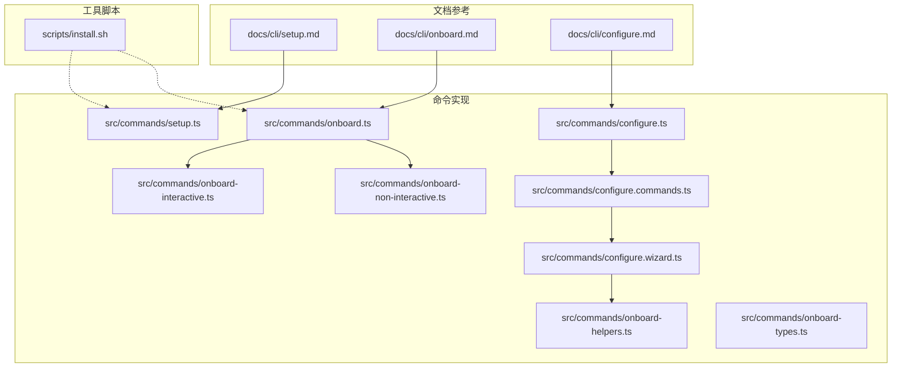
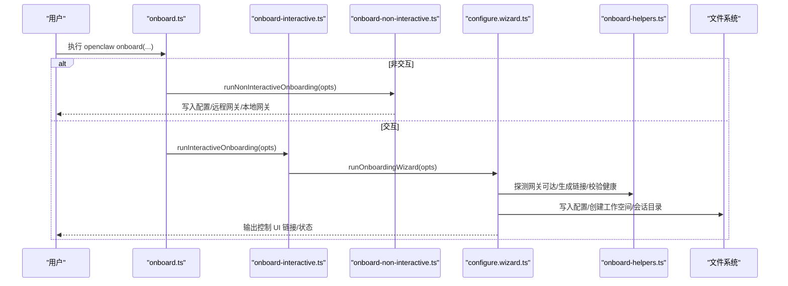
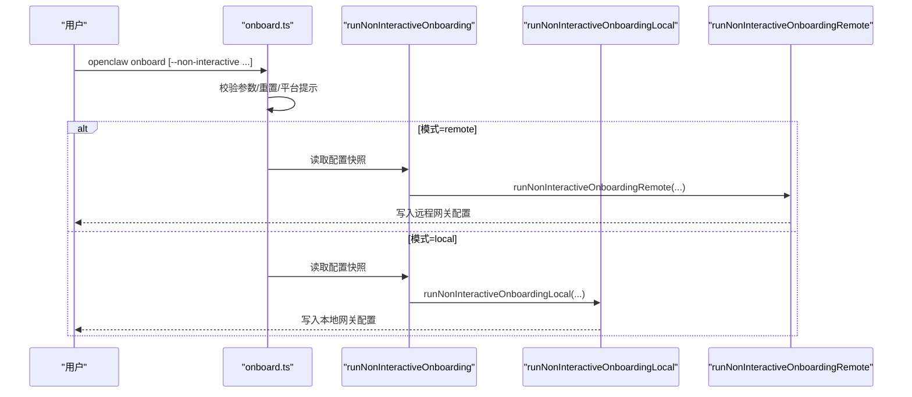
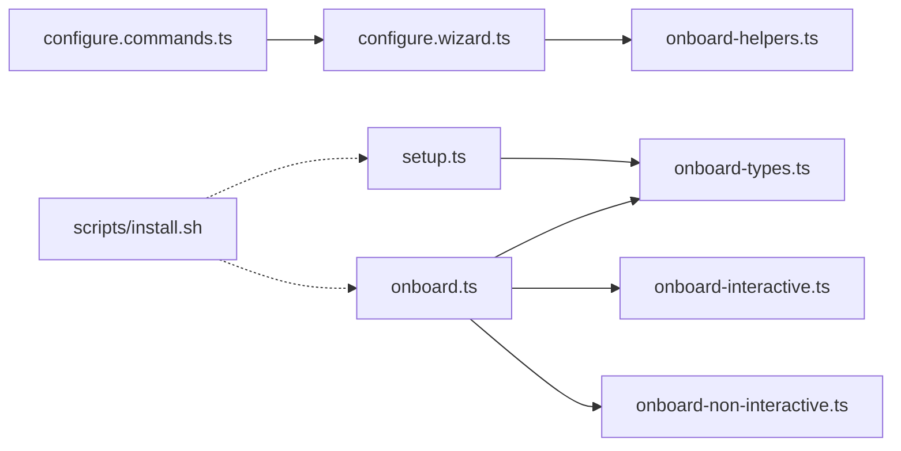

# 安装与引导

<cite>
**本文引用的文件**
- [setup.md](file://docs/cli/setup.md)
- [onboard.md](file://docs/cli/onboard.md)
- [configure.md](file://docs/cli/configure.md)
- [setup.ts](file://src/commands/setup.ts)
- [onboard.ts](file://src/commands/onboard.ts)
- [onboard-interactive.ts](file://src/commands/onboard-interactive.ts)
- [onboard-non-interactive.ts](file://src/commands/onboard-non-interactive.ts)
- [configure.ts](file://src/commands/configure.ts)
- [configure.commands.ts](file://src/commands/configure.commands.ts)
- [configure.wizard.ts](file://src/commands/configure.wizard.ts)
- [onboard-helpers.ts](file://src/commands/onboard-helpers.ts)
- [onboard-types.ts](file://src/commands/onboard-types.ts)
- [install.sh](file://scripts/install.sh)
</cite>

## 目录
1. [简介](#简介)
2. [项目结构](#项目结构)
3. [核心组件](#核心组件)
4. [架构总览](#架构总览)
5. [详细组件分析](#详细组件分析)
6. [依赖关系分析](#依赖关系分析)
7. [性能考量](#性能考量)
8. [故障排除指南](#故障排除指南)
9. [结论](#结论)
10. [附录](#附录)

## 简介
本文件面向首次安装与引导 OpenClaw 的用户，系统性讲解以下三类 CLI 命令：
- setup：初始化配置文件与工作空间（适合非向导的快速起步）
- onboard：交互式向导（本地/远程网关、工作空间、技能安装、渠道连接等）
- configure：配置向导（模型、渠道、网关、守护进程、健康检查等）

同时覆盖非交互式安装、远程网关配置、批量部署等高级用法，并提供常见问题排查与最佳实践。

## 项目结构
OpenClaw 的安装与引导能力由“文档参考 + 命令实现 + 辅助工具”三层组成：
- 文档层：位于 docs/cli/*.md，提供命令用法、示例与注意事项
- 命令层：位于 src/commands/*，封装 setup/onboard/configure 的业务逻辑
- 工具层：位于 scripts/*，提供系统前置条件检测与安装脚本

**图表来源**
- [setup.md:1-30](file://docs/cli/setup.md#L1-L30)
- [onboard.md:1-139](file://docs/cli/onboard.md#L1-L139)
- [configure.md:1-37](file://docs/cli/configure.md#L1-L37)
- [setup.ts:1-92](file://src/commands/setup.ts#L1-L92)
- [onboard.ts:1-97](file://src/commands/onboard.ts#L1-L97)
- [onboard-interactive.ts:1-32](file://src/commands/onboard-interactive.ts#L1-L32)
- [onboard-non-interactive.ts:1-38](file://src/commands/onboard-non-interactive.ts#L1-L38)
- [configure.ts:1-13](file://src/commands/configure.ts#L1-L13)
- [configure.commands.ts:1-38](file://src/commands/configure.commands.ts#L1-L38)
- [configure.wizard.ts:1-706](file://src/commands/configure.wizard.ts#L1-L706)
- [onboard-helpers.ts:1-489](file://src/commands/onboard-helpers.ts#L1-L489)
- [onboard-types.ts:1-174](file://src/commands/onboard-types.ts#L1-L174)
- [install.sh:1468-1532](file://scripts/install.sh#L1468-L1532)

**章节来源**
- [setup.md:1-30](file://docs/cli/setup.md#L1-L30)
- [onboard.md:1-139](file://docs/cli/onboard.md#L1-L139)
- [configure.md:1-37](file://docs/cli/configure.md#L1-L37)

## 核心组件
- setup 命令：创建或更新配置文件，设置默认工作空间，确保工作空间与会话目录存在
- onboard 命令：根据是否非交互，分别进入交互式或非交互式向导；支持重置、风险确认、模式选择（本地/远程）
- configure 命令：交互式配置向导，可按模块选择（模型、渠道、网关、守护进程、健康检查等）

**章节来源**
- [setup.ts:27-92](file://src/commands/setup.ts#L27-L92)
- [onboard.ts:15-97](file://src/commands/onboard.ts#L15-L97)
- [configure.commands.ts:7-37](file://src/commands/configure.commands.ts#L7-L37)

## 架构总览
下图展示从 CLI 到配置写入与工作空间准备的整体流程：

**图表来源**
- [onboard.ts:15-97](file://src/commands/onboard.ts#L15-L97)
- [onboard-interactive.ts:9-31](file://src/commands/onboard-interactive.ts#L9-L31)
- [onboard-non-interactive.ts:10-37](file://src/commands/onboard-non-interactive.ts#L10-L37)
- [configure.wizard.ts:306-706](file://src/commands/configure.wizard.ts#L306-L706)
- [onboard-helpers.ts:382-489](file://src/commands/onboard-helpers.ts#L382-L489)

## 详细组件分析

### setup 命令：初始化配置与工作空间
- 功能要点
  - 读取现有配置，合并默认工作空间与网关模式
  - 若配置不存在或有变更，则写回配置文件
  - 确保工作空间目录存在，必要时创建引导文件
  - 创建会话转录目录

- 关键行为
  - 默认工作空间来源于参数、配置默认值或内置默认路径
  - 网关模式默认为本地
  - 若配置未变更则仅提示“配置 OK”

- 典型调用路径
  - docs/cli/setup.md → src/commands/setup.ts

**图表来源**
- [setup.ts:27-92](file://src/commands/setup.ts#L27-L92)

**章节来源**
- [setup.ts:27-92](file://src/commands/setup.ts#L27-L92)
- [setup.md:1-30](file://docs/cli/setup.md#L1-L30)

### onboard 命令：交互式向导与非交互式安装
- 交互式流程
  - 创建 Clack 提示器
  - 运行 onboarding wizard，捕获取消与异常
  - 结束时恢复终端状态并退出码处理

- 非交互式流程
  - 校验配置快照有效性
  - 解析模式（本地/远程），执行对应安装
  - 要求显式风险确认（accept-risk）

- 支持特性
  - 流程模式：quickstart/advanced/manual（manual 即 advanced）
  - 认证选择：多提供商别名与自定义 API Key
  - 密钥输入模式：明文或 SecretRef 引用
  - 重置范围：仅配置/配置+凭据+会话/全量重置

**图表来源**
- [onboard.ts:15-97](file://src/commands/onboard.ts#L15-L97)
- [onboard-non-interactive.ts:10-37](file://src/commands/onboard-non-interactive.ts#L10-L37)

**章节来源**
- [onboard.ts:15-97](file://src/commands/onboard.ts#L15-L97)
- [onboard-interactive.ts:9-31](file://src/commands/onboard-interactive.ts#L9-L31)
- [onboard-non-interactive.ts:10-37](file://src/commands/onboard-non-interactive.ts#L10-L37)
- [onboard-types.ts:98-174](file://src/commands/onboard-types.ts#L98-L174)
- [onboard.md:1-139](file://docs/cli/onboard.md#L1-L139)

### configure 命令：配置向导与模块化编辑
- 功能概览
  - 交互式选择要配置的模块（工作空间、模型、Web 工具、网关、渠道、技能、守护进程、健康检查）
  - 支持按模块直接运行（--section）
  - 自动探测网关可达性与健康状态，输出控制 UI 链接

- 关键模块
  - 工作空间：设置 agents.defaults.workspace，确保目录与会话目录存在
  - 模型：配置认证（令牌/密码）与模型选择
  - Web 工具：启用/配置网络搜索与无 key 抓取
  - 网关：选择本地/远程模式，配置绑定、端口、鉴权
  - 渠道：添加/更新渠道配置或移除配置
  - 技能：安装/管理技能（通过向导）
  - 守护进程：安装/配置网关服务（可指定端口）
  - 健康检查：探测网关健康状态

**图表来源**
- [configure.wizard.ts:306-706](file://src/commands/configure.wizard.ts#L306-L706)
- [onboard-helpers.ts:382-489](file://src/commands/onboard-helpers.ts#L382-L489)

**章节来源**
- [configure.ts:1-13](file://src/commands/configure.ts#L1-L13)
- [configure.commands.ts:7-37](file://src/commands/configure.commands.ts#L7-L37)
- [configure.wizard.ts:306-706](file://src/commands/configure.wizard.ts#L306-L706)
- [configure.md:1-37](file://docs/cli/configure.md#L1-L37)

## 依赖关系分析
- 命令到实现
  - setup → setup.ts
  - onboard → onboard.ts → onboard-interactive.ts / onboard-non-interactive.ts
  - configure → configure.ts → configure.commands.ts → configure.wizard.ts
- 实现到辅助
  - configure.wizard.ts → onboard-helpers.ts（网关探测、链接生成、会话目录等）
  - onboard.ts → onboard-types.ts（参数类型与默认值）
- 系统前置
  - scripts/install.sh：检测/安装 Node.js、Git 等系统依赖

**图表来源**
- [setup.ts:1-92](file://src/commands/setup.ts#L1-L92)
- [onboard.ts:1-97](file://src/commands/onboard.ts#L1-L97)
- [onboard-interactive.ts:1-32](file://src/commands/onboard-interactive.ts#L1-L32)
- [onboard-non-interactive.ts:1-38](file://src/commands/onboard-non-interactive.ts#L1-L38)
- [configure.commands.ts:1-38](file://src/commands/configure.commands.ts#L1-L38)
- [configure.wizard.ts:1-706](file://src/commands/configure.wizard.ts#L1-L706)
- [onboard-helpers.ts:1-489](file://src/commands/onboard-helpers.ts#L1-L489)
- [onboard-types.ts:1-174](file://src/commands/onboard-types.ts#L1-L174)
- [install.sh:1468-1532](file://scripts/install.sh#L1468-L1532)

**章节来源**
- [setup.ts:1-92](file://src/commands/setup.ts#L1-L92)
- [onboard.ts:1-97](file://src/commands/onboard.ts#L1-L97)
- [configure.commands.ts:1-38](file://src/commands/configure.commands.ts#L1-L38)
- [configure.wizard.ts:1-706](file://src/commands/configure.wizard.ts#L1-L706)
- [onboard-helpers.ts:1-489](file://src/commands/onboard-helpers.ts#L1-L489)
- [onboard-types.ts:1-174](file://src/commands/onboard-types.ts#L1-L174)
- [install.sh:1468-1532](file://scripts/install.sh#L1468-L1532)

## 性能考量
- 非交互式安装优先：在 CI 或自动化场景中使用非交互模式，避免等待用户输入
- 并行探测：在配置向导中对本地/远程网关进行探测与健康检查，合理设置超时与轮询间隔
- 工作空间最小化：首次运行仅创建必要文件，后续增量更新配置，减少 IO 开销
- 守护进程安装：仅在需要时安装，避免不必要的系统服务开销

## 故障排除指南
- 配置无效或损坏
  - 使用 doctor 修复配置后重试
  - 参考配置向导中的“无效配置”提示与修复指引
- 网关不可达
  - 使用健康检查命令定位问题
  - 确认绑定地址、端口、鉴权方式与网络连通性
- 非交互模式风险确认缺失
  - 必须显式传入风险确认标志，否则直接退出
- Windows 环境
  - 建议使用 WSL2；若在原生 Windows 上运行，注意兼容性提示
- 系统依赖缺失
  - 使用安装脚本检测并安装 Node.js、Git 等依赖

**章节来源**
- [configure.wizard.ts:318-338](file://src/commands/configure.wizard.ts#L318-L338)
- [onboard.ts:56-66](file://src/commands/onboard.ts#L56-L66)
- [onboard.md:1-139](file://docs/cli/onboard.md#L1-L139)
- [install.sh:1468-1532](file://scripts/install.sh#L1468-L1532)

## 结论
OpenClaw 的安装与引导体系以“文档参考 + 命令实现 + 工具脚本”协同工作，既支持交互式向导的友好体验，也提供非交互式与远程网关的高级能力。通过模块化的配置向导与严格的前置检测，用户可以快速完成从零到一的部署与配置。

## 附录

### 常用命令速查
- 初始化配置与工作空间
  - openclaw setup
  - openclaw setup --workspace ~/.openclaw/workspace
- 交互式向导（本地/远程）
  - openclaw onboard
  - openclaw onboard --flow quickstart
  - openclaw onboard --flow manual
  - openclaw onboard --mode remote --remote-url wss://gateway-host:18789
- 非交互式安装（示例）
  - openclaw onboard --non-interactive --auth-choice openai-api-key --openai-api-key "$OPENAI_API_KEY"
  - openclaw onboard --non-interactive --auth-choice custom-api-key --custom-base-url "https://llm.example.com/v1" --custom-model-id "foo-large" --custom-api-key "$CUSTOM_API_KEY" --secret-input-mode plaintext
  - openclaw onboard --non-interactive --auth-choice openai-api-key --secret-input-mode ref --accept-risk
- 配置向导（模块化）
  - openclaw configure
  - openclaw configure --section model --section channels

**章节来源**
- [setup.md:18-30](file://docs/cli/setup.md#L18-L30)
- [onboard.md:20-139](file://docs/cli/onboard.md#L20-L139)
- [configure.md:31-37](file://docs/cli/configure.md#L31-L37)