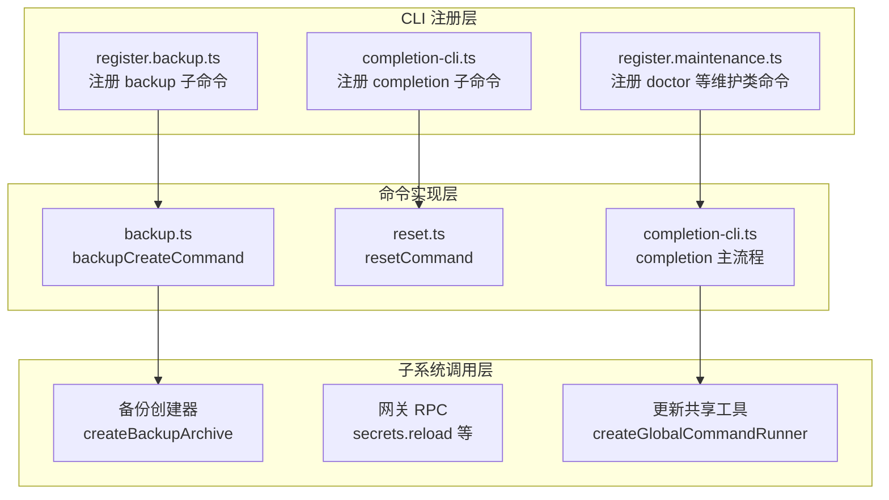
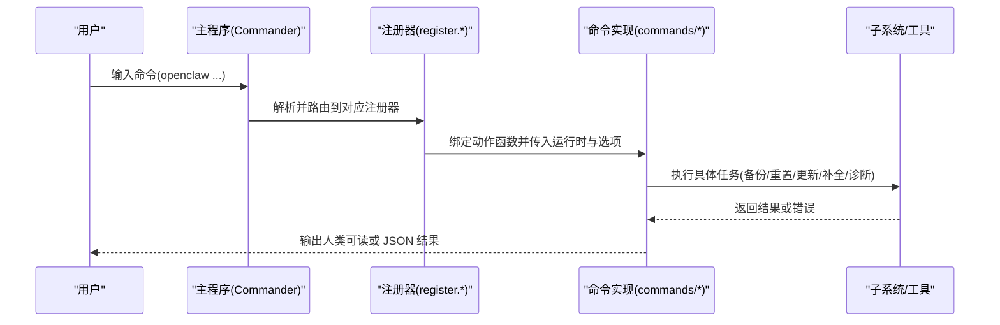
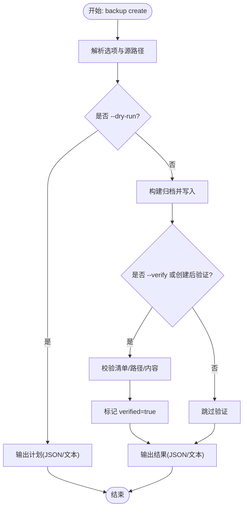
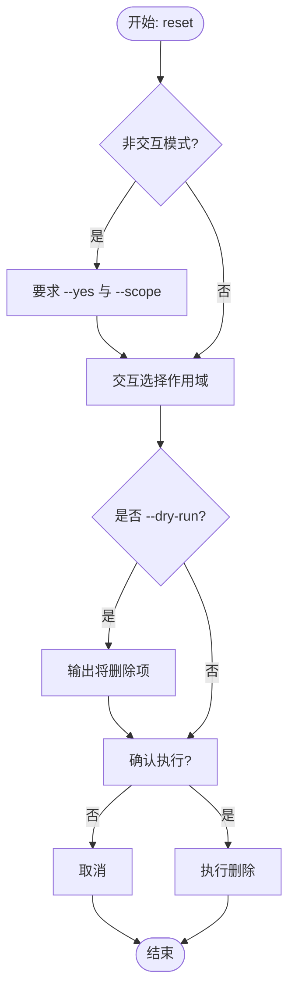
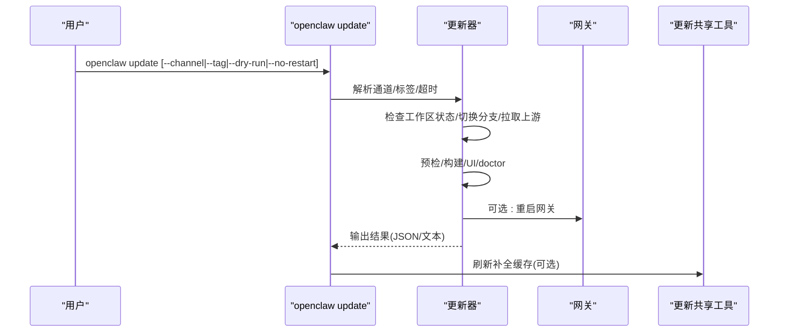
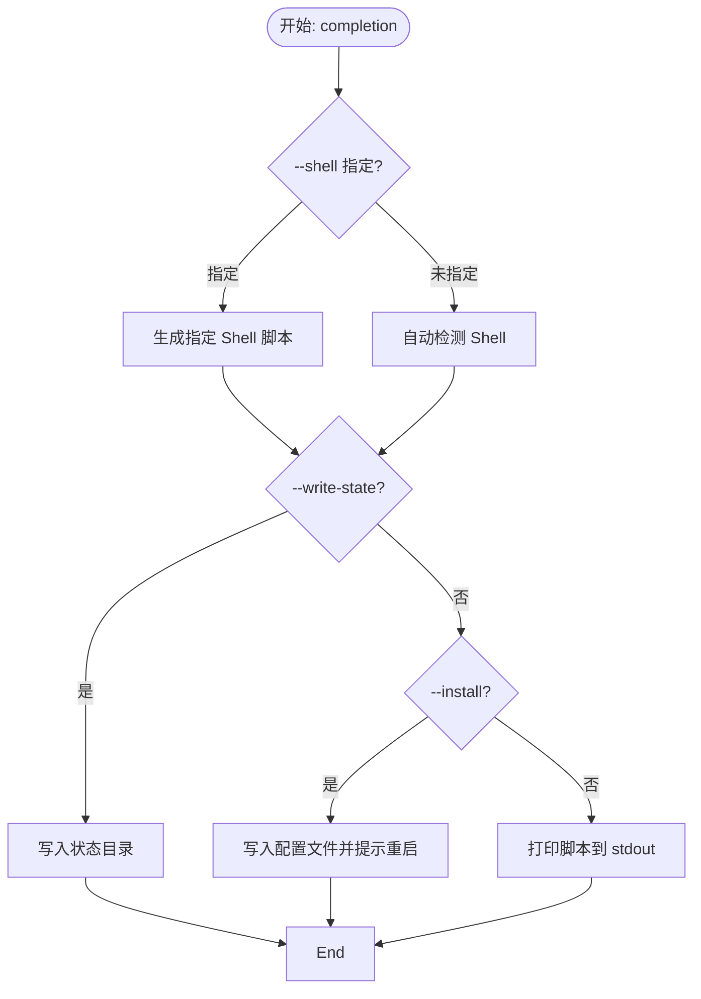
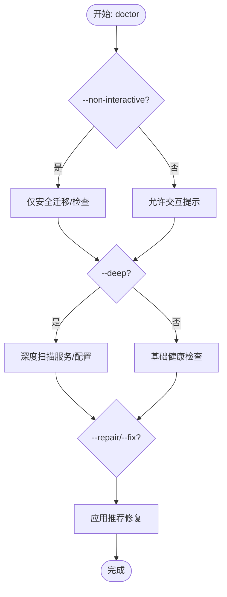
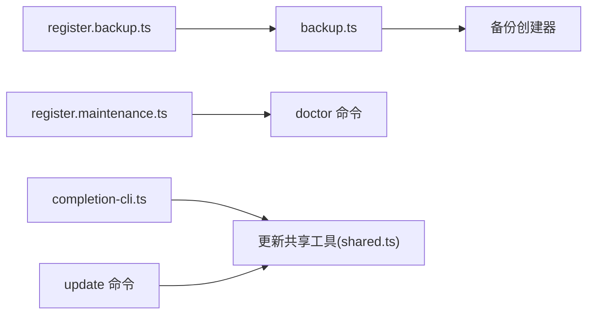

# 实用工具命令

<cite>
**本文引用的文件**
- [backup.md](file://docs/cli/backup.md)
- [reset.md](file://docs/cli/reset.md)
- [update.md](file://docs/cli/update.md)
- [completion.md](file://docs/cli/completion.md)
- [doctor.md](file://docs/cli/doctor.md)
- [security.md](file://docs/cli/security.md)
- [secrets.md](file://docs/cli/secrets.md)
- [memory.md](file://docs/cli/memory.md)
- [register.backup.ts](file://src/cli/program/register.backup.ts)
- [backup.ts](file://src/commands/backup.ts)
- [register.maintenance.ts](file://src/cli/program/register.maintenance.ts)
- [completion-cli.ts](file://src/cli/completion-cli.ts)
- [shared.ts](file://src/cli/update-cli/shared.ts)
- [reset.ts](file://src/commands/reset.ts)
</cite>

## 目录
1. [简介](#简介)
2. [项目结构](#项目结构)
3. [核心组件](#核心组件)
4. [架构总览](#架构总览)
5. [详细组件分析](#详细组件分析)
6. [依赖关系分析](#依赖关系分析)
7. [性能考量](#性能考量)
8. [故障排查指南](#故障排查指南)
9. [结论](#结论)
10. [附录](#附录)

## 简介
本文件面向 OpenClaw 的实用工具命令，围绕以下主题提供系统化、可操作的使用与运维指南：
- 备份命令：备份创建、验证与恢复策略
- 重置命令：按范围清理配置、凭证、会话与工作区
- 更新命令：通道切换、版本检查、下载与升级流程
- 自动补全命令：生成与安装不同 Shell 的补全脚本
- 诊断命令：健康检查、引导修复与常见问题定位
- 安全审计命令：配置与状态的安全性评估与修复
- 密钥管理命令：密钥引用的审计、规划与应用
- 内存命令：语义记忆的状态、索引与检索

## 项目结构
实用工具命令由“CLI 注册层 + 命令实现层 + 子系统调用层”构成：
- CLI 注册层：在主程序中注册子命令及其选项，负责帮助文本与示例输出
- 命令实现层：接收运行时环境与参数，编排具体逻辑（如备份、重置、更新）
- 子系统调用层：调用底层基础设施（如备份创建器、网关 RPC、补全生成器）

图表来源
- [register.backup.ts:1-92](file://src/cli/program/register.backup.ts#L1-L92)
- [register.maintenance.ts:11-41](file://src/cli/program/register.maintenance.ts#L11-L41)
- [completion-cli.ts:266-301](file://src/cli/completion-cli.ts#L266-L301)
- [backup.ts:1-31](file://src/commands/backup.ts#L1-L31)
- [reset.ts:47-93](file://src/commands/reset.ts#L47-L93)
- [shared.ts:272-277](file://src/cli/update-cli/shared.ts#L272-L277)

章节来源
- [register.backup.ts:1-92](file://src/cli/program/register.backup.ts#L1-L92)
- [register.maintenance.ts:11-41](file://src/cli/program/register.maintenance.ts#L11-L41)
- [completion-cli.ts:266-301](file://src/cli/completion-cli.ts#L266-L301)
- [backup.ts:1-31](file://src/commands/backup.ts#L1-L31)
- [reset.ts:47-93](file://src/commands/reset.ts#L47-L93)
- [shared.ts:272-277](file://src/cli/update-cli/shared.ts#L272-L277)

## 核心组件
- 备份命令：支持创建归档、预演计划、立即验证、仅备份配置、排除工作区等；归档包含清单文件与去重布局
- 重置命令：支持三种作用域（仅配置、配置+凭证+会话、完整重置），交互式或非交互式确认
- 更新命令：通道选择（稳定/测试/开发）、标签覆盖、干跑预览、不重启网关、超时控制
- 补全命令：生成并缓存多 Shell 脚本，可写入状态目录或安装到用户配置文件
- 诊断命令：健康检查、快速修复、深检扫描、非交互模式、生成网关令牌
- 安全审计：对共享用户场景、沙箱设置、网络暴露、插件安装一致性等进行风险提示与修复建议
- 密钥管理：重载运行时快照、只读审计、交互式配置与应用、一次性清理明文残留
- 内存命令：内存状态查询、强制索引、深度探测、按代理限定、结果过滤与 JSON 输出

章节来源
- [backup.md:1-77](file://docs/cli/backup.md#L1-L77)
- [reset.md:1-21](file://docs/cli/reset.md#L1-L21)
- [update.md:1-103](file://docs/cli/update.md#L1-L103)
- [completion.md:1-36](file://docs/cli/completion.md#L1-L36)
- [doctor.md:1-46](file://docs/cli/doctor.md#L1-L46)
- [security.md:1-72](file://docs/cli/security.md#L1-L72)
- [secrets.md:1-174](file://docs/cli/secrets.md#L1-L174)
- [memory.md:1-67](file://docs/cli/memory.md#L1-L67)

## 架构总览
下图展示实用工具命令在 CLI 层与实现层之间的交互关系。

图表来源
- [register.backup.ts:10-92](file://src/cli/program/register.backup.ts#L10-L92)
- [register.maintenance.ts:11-41](file://src/cli/program/register.maintenance.ts#L11-L41)
- [completion-cli.ts:266-301](file://src/cli/completion-cli.ts#L266-L301)
- [backup.ts:11-31](file://src/commands/backup.ts#L11-L31)
- [reset.ts:51-93](file://src/commands/reset.ts#L51-L93)

## 详细组件分析

### 备份命令 backup
- 功能要点
  - 创建本地归档：默认输出为当前目录的时间戳 .tar.gz 文件；若当前目录位于被备份源树内，则回退到家目录
  - 预览与验证：支持 --dry-run 输出计划；支持 --verify 在创建后立即校验清单与内容
  - 选择性备份：--only-config 仅打包活动 JSON 配置；--no-include-workspace 排除工作区
  - 清单与布局：归档内含 manifest.json，记录解析后的绝对路径与归档布局
  - 错误处理：当配置无效且启用工作区备份时，快速失败；可通过 --no-include-workspace 获取部分备份
- 数据备份策略
  - 默认包含：状态目录、活动配置、OAuth/凭证目录、工作区目录（可选）
  - 路径规范化：对重复路径去重，缺失路径跳过
  - 输出安全：拒绝归档内自包含路径，避免自我引用；不覆盖已存在文件
- 完整性检查
  - 校验清单：确保仅有一个根清单
  - 校验路径：拒绝穿越式路径
  - 校验内容：清单声明的每个条目必须存在于归档中
- 恢复流程建议
  - 使用 verify 校验通过后再进行恢复
  - 恢复前先停止相关服务，避免文件占用
  - 恢复后执行 doctor 进行健康检查

图表来源
- [register.backup.ts:20-64](file://src/cli/program/register.backup.ts#L20-L64)
- [backup.ts:11-31](file://src/commands/backup.ts#L11-L31)
- [backup.md:13-31](file://docs/cli/backup.md#L13-L31)

章节来源
- [register.backup.ts:1-92](file://src/cli/program/register.backup.ts#L1-L92)
- [backup.ts:1-31](file://src/commands/backup.ts#L1-L31)
- [backup.md:1-77](file://docs/cli/backup.md#L1-L77)

### 重置命令 reset
- 功能要点
  - 三种作用域：仅配置(config)、配置+凭证+会话(config+creds+sessions)、完整重置(full)
  - 交互式与非交互式：非交互模式需显式提供 --yes 与 --scope
  - 建议前置：对于可能破坏状态的操作，建议先执行 backup create
- 操作流程
  - 校验非交互参数
  - 选择作用域（交互）
  - 干跑模式输出将要删除的内容
  - 执行删除并给出最终确认

图表来源
- [reset.ts:51-93](file://src/commands/reset.ts#L51-L93)
- [reset.md:13-21](file://docs/cli/reset.md#L13-L21)

章节来源
- [reset.ts:47-93](file://src/commands/reset.ts#L47-L93)
- [reset.md:1-21](file://docs/cli/reset.md#L1-L21)

### 更新命令 update
- 功能要点
  - 通道切换：--channel stable/beta/dev；与安装方式对齐（git 或 npm）
  - 标签覆盖：--tag 覆盖本次更新使用的 dist-tag 或版本
  - 干跑预览：--dry-run 预览计划（通道/目标/重启等）
  - 不重启：--no-restart 跳过重启网关
  - 超时控制：--timeout 控制每步超时
  - 快捷入口：openclaw --update 等价于 openclaw update
- 开发通道流程
  - 稳定/测试：检出最新标签，构建并 doctor
  - 开发：检出 main，拉取上游并变基；预检 Lint/TS 构建，失败则回退最多 10 提交寻找干净构建点
  - 安装依赖、构建 UI、运行 doctor、同步插件、更新 npm 插件
- 与补全的关系
  - 更新完成后可刷新全局补全缓存

图表来源
- [update.md:62-92](file://docs/cli/update.md#L62-L92)
- [shared.ts:252-270](file://src/cli/update-cli/shared.ts#L252-L270)

章节来源
- [update.md:1-103](file://docs/cli/update.md#L1-L103)
- [shared.ts:252-270](file://src/cli/update-cli/shared.ts#L252-L270)

### 自动补全命令 completion
- 功能要点
  - 生成多 Shell 脚本：zsh/bash/fish/PowerShell
  - 缓存到状态目录：--write-state 将脚本写入 $OPENCLAW_STATE_DIR/completions
  - 安装到用户配置：--install 将 source 行写入 Shell 配置文件
  - 交互确认：--yes 跳过确认
  - 延迟注册：为保证嵌套子命令也被纳入补全，会预先加载完整的命令树
- 安装流程
  - 识别 Shell 类型
  - 生成脚本或从缓存读取
  - 写入用户配置文件并提示重启 Shell

图表来源
- [completion.md:13-36](file://docs/cli/completion.md#L13-L36)
- [completion-cli.ts:266-301](file://src/cli/completion-cli.ts#L266-L301)

章节来源
- [completion.md:1-36](file://docs/cli/completion.md#L1-L36)
- [completion-cli.ts:266-301](file://src/cli/completion-cli.ts#L266-L301)

### 诊断命令 doctor
- 功能要点
  - 健康检查与快速修复：--repair/--fix 应用推荐修复
  - 深度扫描：--deep 扫描系统服务中的额外网关实例
  - 非交互模式：--non-interactive 跳过交互提示（适合定时任务/无终端）
  - 生成网关令牌：--generate-gateway-token
  - 交互条件：仅在 TTY 且未设置 --non-interactive 时弹出交互
- 常见修复与提示
  - 会话与转录文件清理
  - 计划任务格式迁移
  - 内存搜索就绪性检查
  - 沙箱与 Docker 环境告警
  - launchctl 环境变量覆盖问题排查

图表来源
- [doctor.md:18-46](file://docs/cli/doctor.md#L18-L46)
- [register.maintenance.ts:13-41](file://src/cli/program/register.maintenance.ts#L13-L41)

章节来源
- [doctor.md:1-46](file://docs/cli/doctor.md#L1-L46)
- [register.maintenance.ts:11-41](file://src/cli/program/register.maintenance.ts#L11-L41)

### 安全审计命令 security
- 功能要点
  - 审计：--deep 深度检查；--json 输出机器可读报告
  - 修复：--fix 应用安全修复（收紧权限、调整策略等）
  - 报告字段：summary、findings、fix 行为等
- 关键风险提示
  - 共享用户场景下的信任模型与隔离建议
  - 小模型配合浏览器工具的风险
  - Webhook 会话键策略与白名单
  - 沙箱 Docker 设置与网络模式
  - 插件安装一致性与完整性
  - 网关认证模式 none 的暴露风险
- 修复范围
  - 常见组策略收紧
  - 敏感日志脱敏开关
  - 状态与敏感文件权限收紧

章节来源
- [security.md:1-72](file://docs/cli/security.md#L1-L72)

### 密钥管理命令 secrets
- 四大角色
  - reload：重新解析密钥引用并原子切换运行时快照（失败则保留上一个可用快照）
  - audit：只读扫描配置/认证/生成物与历史残留，检测明文、未解析引用、优先级漂移
  - configure：交互式规划提供者与映射，预检后可应用
  - apply：应用保存的计划，清理明文残留（一次性操作）
- 推荐操作循环
  - audit --check → configure → apply(--dry-run) → apply → audit --check → reload
- 退出码约定
  - audit --check：发现异常返回 1；未解析引用返回更高优先级码
- 重要约束
  - apply 不写回滚备份（明文值不落盘）
  - 预检严格，失败时尽力内存恢复

章节来源
- [secrets.md:1-174](file://docs/cli/secrets.md#L1-L174)

### 内存命令 memory
- 功能要点
  - memory status：查看内存状态，支持 --deep、--index、--json、--agent 限定
  - memory index：强制重建索引，支持 --force、--verbose
  - memory search：查询语义记忆，支持 --query、--max-results、--min-score、--agent、--json
- 注意事项
  - 远程 API 密钥字段作为 SecretRefs 时需要网关支持 secrets.resolve
  - 版本差异：旧版网关可能不支持相关方法

章节来源
- [memory.md:1-67](file://docs/cli/memory.md#L1-L67)

## 依赖关系分析
- 备份命令依赖备份创建器与验证命令；验证阶段可复用备份创建命令的运行时包装
- 诊断命令依赖网关健康状态与配置快照；在非交互模式下避免阻塞
- 补全命令依赖完整的命令树注册，以便生成嵌套子命令的补全
- 更新命令与补全缓存更新存在耦合：更新完成后刷新补全缓存

图表来源
- [register.backup.ts:1-92](file://src/cli/program/register.backup.ts#L1-L92)
- [backup.ts:1-31](file://src/commands/backup.ts#L1-L31)
- [register.maintenance.ts:11-41](file://src/cli/program/register.maintenance.ts#L11-L41)
- [completion-cli.ts:266-301](file://src/cli/completion-cli.ts#L266-L301)
- [shared.ts:252-270](file://src/cli/update-cli/shared.ts#L252-L270)

章节来源
- [register.backup.ts:1-92](file://src/cli/program/register.backup.ts#L1-L92)
- [backup.ts:1-31](file://src/commands/backup.ts#L1-L31)
- [register.maintenance.ts:11-41](file://src/cli/program/register.maintenance.ts#L11-L41)
- [completion-cli.ts:266-301](file://src/cli/completion-cli.ts#L266-L301)
- [shared.ts:252-270](file://src/cli/update-cli/shared.ts#L252-L270)

## 性能考量
- 备份
  - 大型工作区是体积与时间的主要驱动因素；可通过 --no-include-workspace 或 --only-config 减小规模
  - 验证会二次扫描归档，建议在 CI 中谨慎使用
- 更新
  - 构建与 doctor 步骤耗时较长；可使用 --dry-run 预估时间
  - 开发通道的预检失败回退机制会增加等待时间
- 诊断
  - --deep 扫描更多资源，建议在维护窗口执行
- 补全
  - 首次生成需遍历完整命令树，建议定期刷新缓存而非每次交互都生成

## 故障排查指南
- 备份
  - 归档校验失败：检查清单与路径合法性；确认未将输出目录置于源树内
  - 配置无效：使用 --no-include-workspace 或 --only-config 获取部分备份
- 重置
  - 非交互模式报错：补充 --yes 与 --scope
  - 恢复后异常：执行 doctor 进行健康检查与修复
- 更新
  - 工作区不干净：提交或暂存变更后再试；开发通道预检失败时可回退到最近干净提交
  - 无法重启网关：使用 --no-restart，稍后手动重启
- 诊断
  - 无交互：添加 --non-interactive；必要时使用 --force 进行激进修复
  - launchctl 环境变量冲突：检查并清理 OPENCLAW_GATEWAY_TOKEN/PASSWORD
- 安全审计
  - 修复后仍告警：根据报告逐项修正；必要时拆分信任边界
- 密钥管理
  - audit --check 仍有明文：继续完善 SecretRef 映射并重新审计
  - apply 后无法回滚：确保先 dry-run 并做好外部备份
- 内存
  - 远程密钥解析失败：确认网关版本支持 secrets.resolve；检查密钥引用是否正确

章节来源
- [backup.md:49-77](file://docs/cli/backup.md#L49-L77)
- [reset.md:13-21](file://docs/cli/reset.md#L13-L21)
- [update.md:73-92](file://docs/cli/update.md#L73-L92)
- [doctor.md:26-46](file://docs/cli/doctor.md#L26-L46)
- [security.md:58-72](file://docs/cli/security.md#L58-L72)
- [secrets.md:159-174](file://docs/cli/secrets.md#L159-L174)
- [memory.md:61-67](file://docs/cli/memory.md#L61-L67)

## 结论
本文档系统梳理了 OpenClaw 实用工具命令的使用方法、内部流程与最佳实践。建议在执行可能破坏状态的操作前，先进行备份与审计；在自动化环境中采用非交互模式与 JSON 输出；定期运行 doctor 与 security 以保持系统健康与安全。

## 附录
- 常用命令速查
  - 备份：openclaw backup create [--output|--json|--dry-run|--verify|--only-config|--no-include-workspace]
  - 验证：openclaw backup verify <archive> [--json]
  - 重置：openclaw reset [--dry-run|--scope|--yes|--non-interactive]
  - 更新：openclaw update [--channel|--tag|--dry-run|--no-restart|--json|--timeout]
  - 补全：openclaw completion [--shell|--install|--write-state|-y]
  - 诊断：openclaw doctor [--repair|--fix|--force|--non-interactive|--generate-gateway-token|--deep]
  - 安全：openclaw security audit [--deep|--fix|--json]
  - 密钥：openclaw secrets reload|audit [--check|--json]|configure [--plan-out|--apply|--providers-only|--skip-provider-setup|--agent]|apply --from <plan.json> [--dry-run|--json]
  - 内存：openclaw memory status [--deep|--index|--json|--agent|--verbose] | index [--force|--verbose] | search [--query|--max-results|--min-score|--agent|--json]