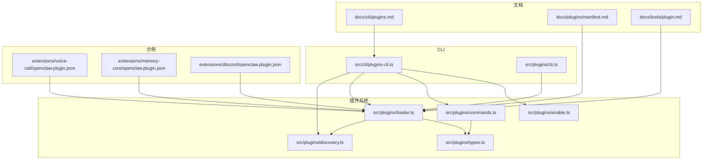
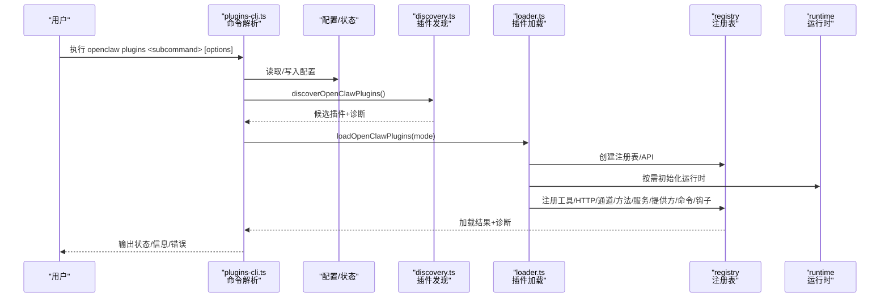
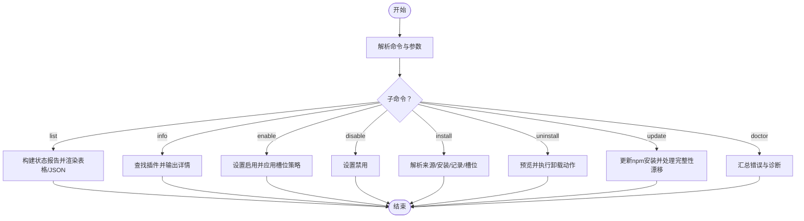
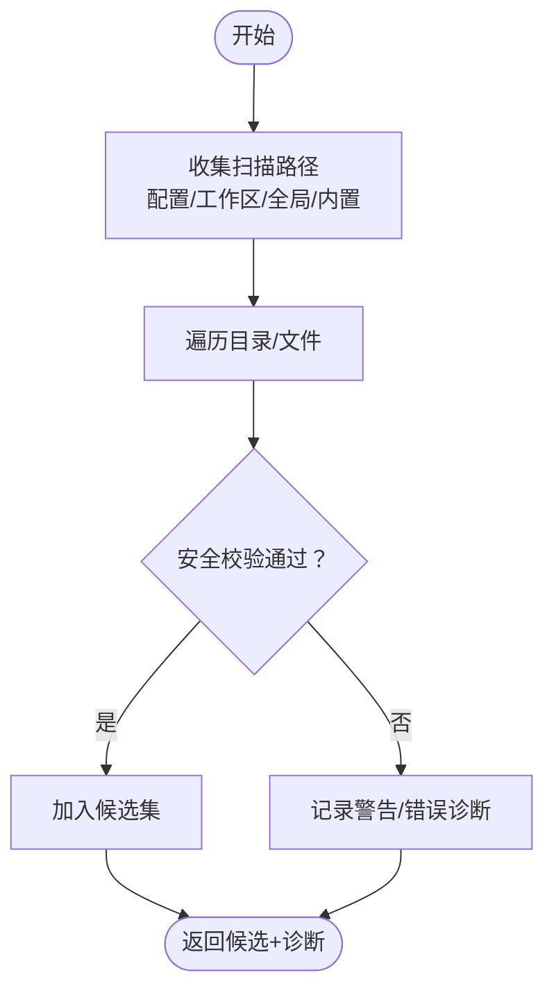
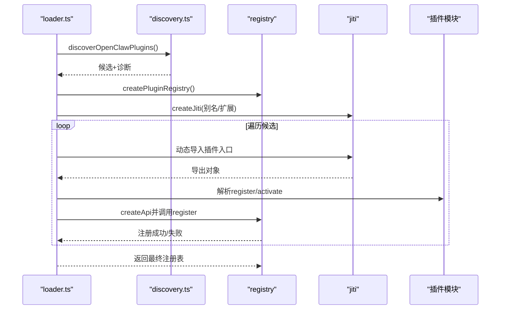
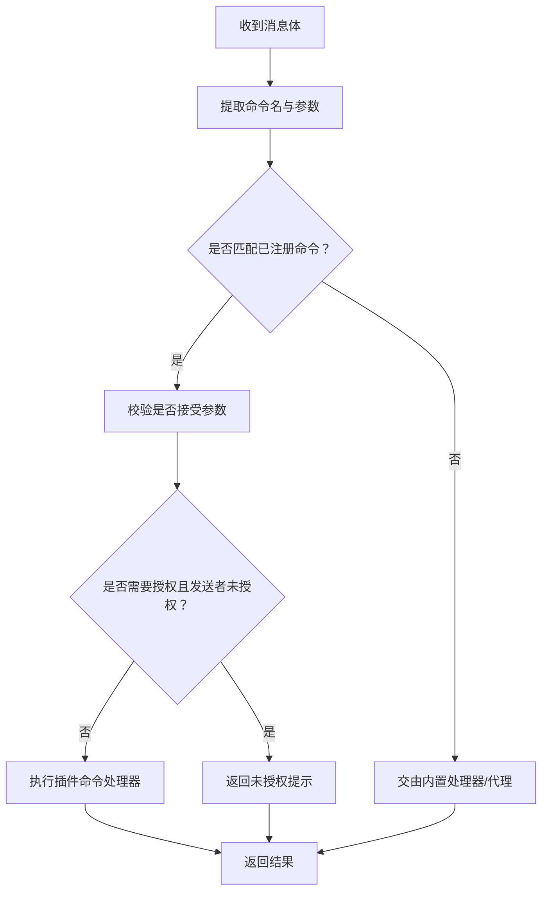
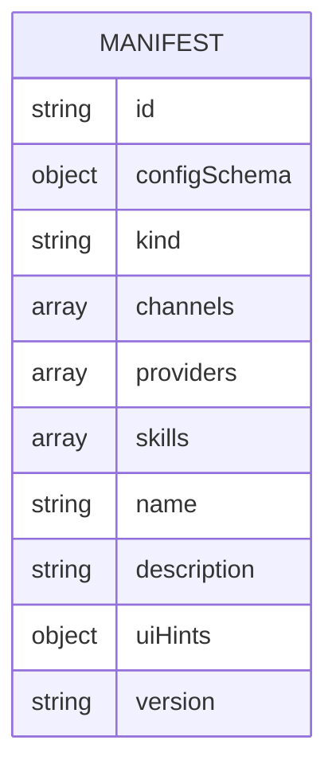
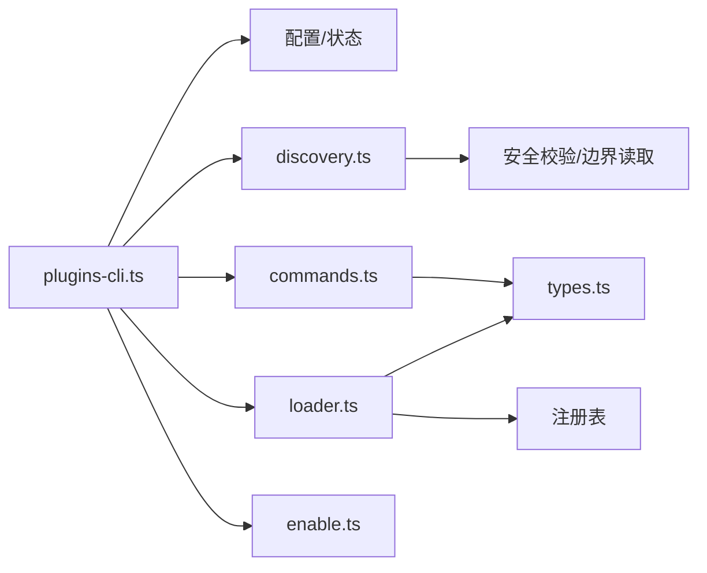

# 插件开发

<cite>
**本文引用的文件**
- [docs/cli/plugins.md](file://docs/cli/plugins.md)
- [docs/plugins/manifest.md](file://docs/plugins/manifest.md)
- [docs/tools/plugin.md](file://docs/tools/plugin.md)
- [src/cli/plugins-cli.ts](file://src/cli/plugins-cli.ts)
- [src/plugins/cli.ts](file://src/plugins/cli.ts)
- [src/plugins/commands.ts](file://src/plugins/commands.ts)
- [src/plugins/enable.ts](file://src/plugins/enable.ts)
- [src/plugins/discovery.ts](file://src/plugins/discovery.ts)
- [src/plugins/loader.ts](file://src/plugins/loader.ts)
- [src/plugins/types.ts](file://src/plugins/types.ts)
- [extensions/voice-call/openclaw.plugin.json](file://extensions/voice-call/openclaw.plugin.json)
- [extensions/memory-core/openclaw.plugin.json](file://extensions/memory-core/openclaw.plugin.json)
- [extensions/discord/openclaw.plugin.json](file://extensions/discord/openclaw.plugin.json)
</cite>

## 目录
1. [简介](#简介)
2. [项目结构](#项目结构)
3. [核心组件](#核心组件)
4. [架构总览](#架构总览)
5. [详细组件分析](#详细组件分析)
6. [依赖关系分析](#依赖关系分析)
7. [性能考量](#性能考量)
8. [故障排查指南](#故障排查指南)
9. [结论](#结论)
10. [附录](#附录)

## 简介
本文件面向OpenClaw插件开发者与维护者，系统化阐述“plugins”命令的插件生命周期管理能力（安装、启用、禁用、信息查询、卸载、更新、诊断），并给出插件开发的完整流程、最佳实践与安全规范。内容基于仓库中的CLI文档、插件系统源码与官方示例插件清单，帮助读者从零到一构建可分发、可维护、可诊断的插件。

## 项目结构
围绕插件系统的文档与代码主要分布在以下位置：
- 文档层：CLI参考、插件清单与插件系统指南
- CLI层：plugins命令入口与子命令实现
- 插件系统层：发现、加载、注册、钩子、命令等核心逻辑
- 示例层：官方扩展的openclaw.plugin.json清单

图示来源
- [docs/cli/plugins.md](file://docs/cli/plugins.md)
- [docs/plugins/manifest.md](file://docs/plugins/manifest.md)
- [docs/tools/plugin.md](file://docs/tools/plugin.md)
- [src/cli/plugins-cli.ts](file://src/cli/plugins-cli.ts)
- [src/plugins/cli.ts](file://src/plugins/cli.ts)
- [src/plugins/discovery.ts](file://src/plugins/discovery.ts)
- [src/plugins/loader.ts](file://src/plugins/loader.ts)
- [src/plugins/commands.ts](file://src/plugins/commands.ts)
- [src/plugins/types.ts](file://src/plugins/types.ts)
- [src/plugins/enable.ts](file://src/plugins/enable.ts)
- [extensions/voice-call/openclaw.plugin.json](file://extensions/voice-call/openclaw.plugin.json)
- [extensions/memory-core/openclaw.plugin.json](file://extensions/memory-core/openclaw.plugin.json)
- [extensions/discord/openclaw.plugin.json](file://extensions/discord/openclaw.plugin.json)

章节来源
- [docs/cli/plugins.md](file://docs/cli/plugins.md)
- [docs/plugins/manifest.md](file://docs/plugins/manifest.md)
- [docs/tools/plugin.md](file://docs/tools/plugin.md)

## 核心组件
- CLI命令“plugins”
  - list/info/enable/disable/install/uninstall/update/doctor
  - 支持本地路径、归档包、npm安装；支持--link开发链接；支持--pin固定版本
- 插件发现与加载
  - 多源扫描：配置路径、工作区、全局、内置扩展
  - 安全校验：路径逃逸、世界可写、可疑属主、硬链接拒绝
  - 清单缓存：发现与清单读取的短期缓存以降低启动抖动
- 插件注册与运行时
  - 注册API：工具、HTTP路由、通道、网关方法、CLI、服务、提供方、命令、上下文引擎
  - 钩子系统：生命周期事件与提示词注入策略
  - 命令系统：插件自定义命令（绕过LLM代理）
- 配置与状态
  - 允许列表/拒绝列表、独占槽位选择、条目开关与配置验证
  - 升级仅对npm安装生效，支持完整性漂移检测与交互确认

章节来源
- [src/cli/plugins-cli.ts](file://src/cli/plugins-cli.ts)
- [src/plugins/discovery.ts](file://src/plugins/discovery.ts)
- [src/plugins/loader.ts](file://src/plugins/loader.ts)
- [src/plugins/commands.ts](file://src/plugins/commands.ts)
- [src/plugins/types.ts](file://src/plugins/types.ts)
- [src/plugins/enable.ts](file://src/plugins/enable.ts)

## 架构总览
下图展示plugins命令在CLI层与插件系统层的调用关系，以及关键数据流（发现、加载、注册、命令处理）。

图示来源
- [src/cli/plugins-cli.ts](file://src/cli/plugins-cli.ts)
- [src/plugins/discovery.ts](file://src/plugins/discovery.ts)
- [src/plugins/loader.ts](file://src/plugins/loader.ts)

## 详细组件分析

### CLI命令“plugins”生命周期管理
- list：列出已发现插件，支持JSON输出、仅显示启用项、详细模式
- info：按ID或名称查询插件详情，含来源、来源、版本、工具/钩子/网关方法/提供方/CLI命令/服务等
- enable/disable：在配置中切换插件启用状态，并应用独占槽位策略
- install：支持本地路径/归档包/npm spec；--link不复制而是添加到加载路径；--pin记录精确版本
- uninstall：删除配置条目、安装记录、允许列表、加载路径、内存槽位、插件目录（可保留文件）
- update：仅对npm安装生效，支持--all与完整性漂移确认
- doctor：汇总插件错误与诊断

图示来源
- [src/cli/plugins-cli.ts](file://src/cli/plugins-cli.ts)

章节来源
- [src/cli/plugins-cli.ts](file://src/cli/plugins-cli.ts)
- [docs/cli/plugins.md](file://docs/cli/plugins.md)

### 插件发现与安全校验
- 发现顺序：配置路径 → 工作区扩展 → 全局扩展 → 内置扩展
- 安全检查：禁止路径逃逸、世界可写目录、可疑属主；npm/全局安装的目录在必要时自动收紧权限
- 缓存：发现与清单读取支持短期缓存，可通过环境变量调整窗口
- 包装器：支持package.json中的openclaw.extensions将多入口打包为多个插件

图示来源
- [src/plugins/discovery.ts](file://src/plugins/discovery.ts)

章节来源
- [src/plugins/discovery.ts](file://src/plugins/discovery.ts)
- [docs/tools/plugin.md](file://docs/tools/plugin.md)

### 插件加载与注册
- 通过jiti按需加载插件模块，支持openclaw/plugin-sdk别名映射
- 读取清单（openclaw.plugin.json）并进行配置Schema验证
- 调用插件导出的register/activate函数，注入API完成注册
- 对独占槽位（如memory）进行早期决策，避免加载不必要的模块
- 记录诊断：加载失败、注册异常、ID/Kind不一致、未跟踪加载等

图示来源
- [src/plugins/loader.ts](file://src/plugins/loader.ts)
- [src/plugins/discovery.ts](file://src/plugins/discovery.ts)
- [src/plugins/types.ts](file://src/plugins/types.ts)

章节来源
- [src/plugins/loader.ts](file://src/plugins/loader.ts)
- [src/plugins/types.ts](file://src/plugins/types.ts)

### 插件命令系统（绕过代理的快捷命令）
- 命令命名规则：字母开头，仅允许字母数字与连字符/下划线，且不得与内置命令重名
- 参数安全：长度限制、控制字符过滤；支持是否接受参数的声明
- 授权：默认要求授权发送者，防止未授权调用
- 注册与匹配：先注册后执行；支持原生平台别名覆盖

图示来源
- [src/plugins/commands.ts](file://src/plugins/commands.ts)

章节来源
- [src/plugins/commands.ts](file://src/plugins/commands.ts)
- [src/plugins/types.ts](file://src/plugins/types.ts)

### 插件清单与配置Schema
- 必填字段：id、configSchema（内联JSON Schema）
- 可选字段：kind、channels/providers/skills/name/description/uiHints/version等
- 验证行为：未知channels键/未知插件ID/禁用但存在配置等均触发错误或警告
- 运行时仅用清单做配置验证，不执行插件代码

图示来源
- [docs/plugins/manifest.md](file://docs/plugins/manifest.md)
- [extensions/voice-call/openclaw.plugin.json](file://extensions/voice-call/openclaw.plugin.json)
- [extensions/memory-core/openclaw.plugin.json](file://extensions/memory-core/openclaw.plugin.json)
- [extensions/discord/openclaw.plugin.json](file://extensions/discord/openclaw.plugin.json)

章节来源
- [docs/plugins/manifest.md](file://docs/plugins/manifest.md)
- [extensions/voice-call/openclaw.plugin.json](file://extensions/voice-call/openclaw.plugin.json)
- [extensions/memory-core/openclaw.plugin.json](file://extensions/memory-core/openclaw.plugin.json)
- [extensions/discord/openclaw.plugin.json](file://extensions/discord/openclaw.plugin.json)

### 插件API与能力边界
- 注册能力：工具、HTTP路由、通道、网关方法、CLI、服务、提供方、命令、上下文引擎
- 生命周期钩子：模型解析前、提示词构建前、代理开始前、消息收发、工具调用、会话/子代理、网关启停等
- 提示词注入策略：支持系统提示改写、前置/追加系统上下文、前置用户上下文
- 运行时辅助：TTS/STT等核心能力可通过api.runtime访问

章节来源
- [src/plugins/types.ts](file://src/plugins/types.ts)
- [docs/tools/plugin.md](file://docs/tools/plugin.md)

## 依赖关系分析
- CLI命令依赖配置读写、状态报告、安装/卸载/更新逻辑、发现与加载模块
- 发现模块依赖安全校验与边界文件读取
- 加载模块依赖JITI动态导入、清单注册表、运行时代理
- 命令系统依赖类型定义与注册表

图示来源
- [src/cli/plugins-cli.ts](file://src/cli/plugins-cli.ts)
- [src/plugins/discovery.ts](file://src/plugins/discovery.ts)
- [src/plugins/loader.ts](file://src/plugins/loader.ts)
- [src/plugins/commands.ts](file://src/plugins/commands.ts)
- [src/plugins/types.ts](file://src/plugins/types.ts)
- [src/plugins/enable.ts](file://src/plugins/enable.ts)

章节来源
- [src/cli/plugins-cli.ts](file://src/cli/plugins-cli.ts)
- [src/plugins/discovery.ts](file://src/plugins/discovery.ts)
- [src/plugins/loader.ts](file://src/plugins/loader.ts)
- [src/plugins/commands.ts](file://src/plugins/commands.ts)
- [src/plugins/types.ts](file://src/plugins/types.ts)
- [src/plugins/enable.ts](file://src/plugins/enable.ts)

## 性能考量
- 发现与清单缓存：通过环境变量控制缓存窗口，减少启动阶段的重复扫描
- 延迟运行时初始化：仅在需要时创建运行时，避免无谓的依赖加载
- 独占槽位早决策：对内置内存插件在加载前根据槽位策略快速跳过，减少IO与解析成本
- 命令处理短路：插件命令优先于内置命令，避免不必要的代理调用

章节来源
- [src/plugins/discovery.ts](file://src/plugins/discovery.ts)
- [src/plugins/loader.ts](file://src/plugins/loader.ts)
- [src/plugins/commands.ts](file://src/plugins/commands.ts)

## 故障排查指南
- doctor命令：无问题时输出“未检测到插件问题”，否则列出错误与诊断
- 常见错误来源：
  - 清单缺失/非法：导致配置验证失败
  - 路径安全问题：路径逃逸、世界可写、可疑属主
  - 注册异常：缺少register/activate导出、API使用不当
  - 未跟踪加载：非内置插件未在安装记录或加载路径中，建议通过allowlist或安装记录明确信任
- 建议排查步骤：
  - 使用doctor查看诊断
  - 使用info查看插件来源、版本、安装记录
  - 检查plugins.allow与plugins.entries配置
  - 重新安装/更新（仅npm安装支持更新）

章节来源
- [src/cli/plugins-cli.ts](file://src/cli/plugins-cli.ts)
- [src/plugins/discovery.ts](file://src/plugins/discovery.ts)
- [src/plugins/loader.ts](file://src/plugins/loader.ts)

## 结论
OpenClaw的插件体系以“清单驱动的严格配置验证+安全的发现与加载”为核心，辅以灵活的注册API与生命周期钩子，既满足扩展需求又保障运行安全。通过plugins命令，开发者可以高效地完成插件的安装、启用、禁用、查询、卸载与诊断。遵循本文的开发流程、清单规范与安全实践，可显著提升插件质量与可维护性。

## 附录

### 插件开发标准流程
- 插件结构
  - 在插件根目录提供openclaw.plugin.json（必含id与configSchema）
  - 可选声明kind/channels/providers/skills等元信息
- 配置Schema
  - 使用内联JSON Schema描述config结构，确保严格验证
  - 通过uiHints增强UI表单体验
- API接口
  - 在register中使用API注册工具、HTTP路由、通道、网关方法、CLI、服务、提供方、命令、上下文引擎
  - 合理使用生命周期钩子，避免过度侵入
- 测试方法
  - 使用validate模式加载插件，仅验证配置与清单
  - 在本地启用--link进行开发迭代
  - 使用doctor定期巡检

章节来源
- [docs/plugins/manifest.md](file://docs/plugins/manifest.md)
- [docs/tools/plugin.md](file://docs/tools/plugin.md)
- [src/plugins/loader.ts](file://src/plugins/loader.ts)
- [src/plugins/types.ts](file://src/plugins/types.ts)

### 打包、分发与版本管理最佳实践
- 打包
  - 支持本地目录/归档包安装；npm安装时使用--ignore-scripts保证安全
  - 使用--pin记录精确版本，便于回溯与审计
- 分发
  - npm包作为首选分发渠道；确保依赖纯TS/JS，避免postinstall构建
  - 通过package.json的openclaw.extensions将多入口打包为多个插件
- 版本管理
  - 仅对npm安装支持update；遇到完整性漂移需人工确认
  - 通过plugins.installs记录安装来源与版本，便于追踪

章节来源
- [docs/cli/plugins.md](file://docs/cli/plugins.md)
- [docs/tools/plugin.md](file://docs/tools/plugin.md)

### 工具链、调试与性能优化
- 工具链
  - 使用openclaw plugin SDK子路径导入，避免加载整包
  - 通过OPENCLAW_PLUGIN_DISCOVERY_CACHE_MS与OPENCLAW_PLUGIN_MANIFEST_CACHE_MS调节缓存窗口
- 调试
  - 利用doctor与info定位问题；关注来源、版本、安装记录
  - 在开发期使用--link避免频繁复制
- 性能
  - 启用缓存、延迟运行时初始化、独占槽位早决策

章节来源
- [docs/tools/plugin.md](file://docs/tools/plugin.md)
- [src/plugins/discovery.ts](file://src/plugins/discovery.ts)
- [src/plugins/loader.ts](file://src/plugins/loader.ts)

### 安全规范、权限控制与兼容性测试
- 安全规范
  - 严格的安全校验：禁止路径逃逸、世界可写、可疑属主；npm/全局安装目录在必要时收紧权限
  - treat plugin installs like running代码；优先使用--pin与allowlist
- 权限控制
  - 插件命令默认requireAuth；未授权发送者会被拦截
  - 提示词注入可通过配置关闭，避免被滥用
- 兼容性测试
  - 使用validate模式加载验证清单与配置
  - 在不同环境变量组合下测试缓存行为
  - 验证钩子与命令在不同渠道/账户下的表现

章节来源
- [src/plugins/discovery.ts](file://src/plugins/discovery.ts)
- [src/plugins/commands.ts](file://src/plugins/commands.ts)
- [src/plugins/loader.ts](file://src/plugins/loader.ts)
- [docs/tools/plugin.md](file://docs/tools/plugin.md)