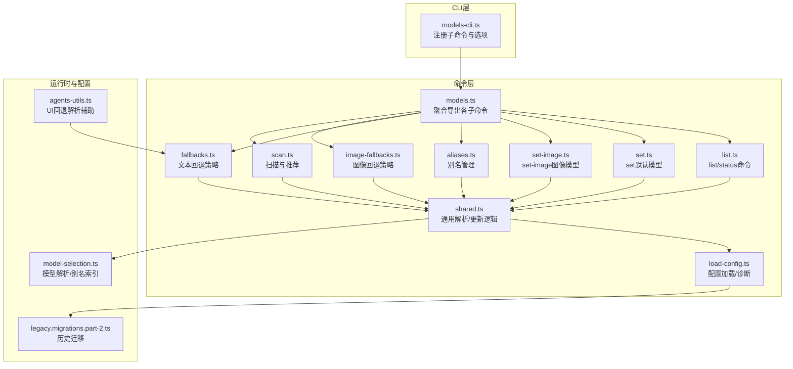
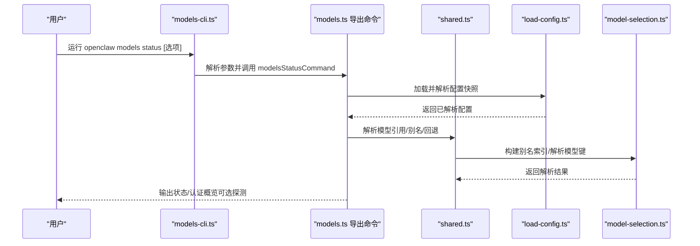
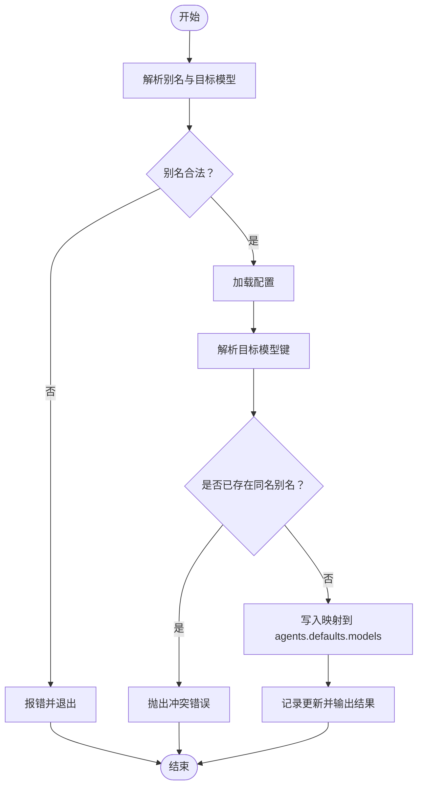
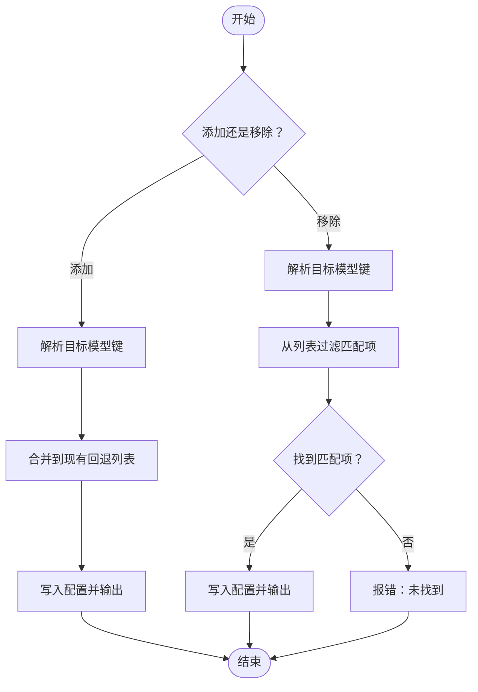
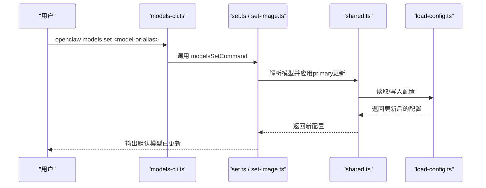
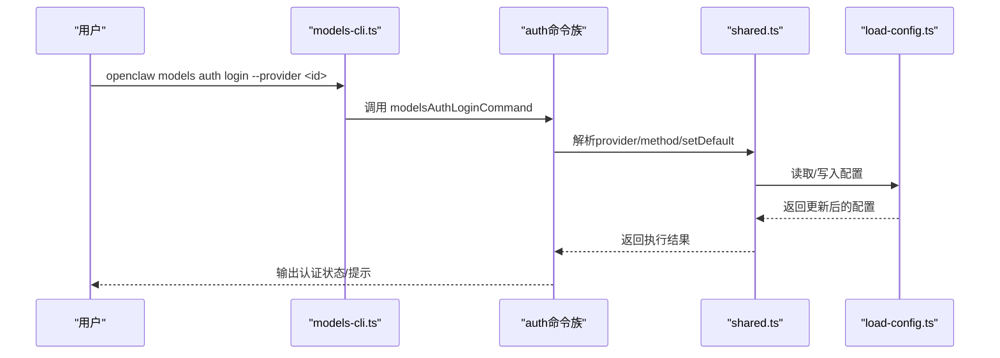
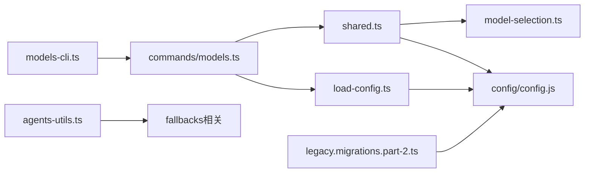

# 模型管理

<cite>
**本文引用的文件**
- [models.md](file://docs/cli/models.md)
- [models-cli.ts](file://src/cli/models-cli.ts)
- [models.ts](file://src/commands/models.ts)
- [aliases.ts](file://src/commands/models/aliases.ts)
- [fallbacks.ts](file://src/commands/models/fallbacks.ts)
- [fallbacks-shared.ts](file://src/commands/models/fallbacks-shared.ts)
- [image-fallbacks.ts](file://src/commands/models/image-fallbacks.ts)
- [set.ts](file://src/commands/models/set.ts)
- [set-image.ts](file://src/commands/models/set-image.ts)
- [scan.ts](file://src/commands/models/scan.ts)
- [shared.ts](file://src/commands/models/shared.ts)
- [load-config.ts](file://src/commands/models/load-config.ts)
- [model-selection.ts](file://src/agents/model-selection.ts)
- [directive-handling.auth.ts](file://src/auto-reply/reply/directive-handling.auth.ts)
- [legacy.migrations.part-2.ts](file://src/config/legacy.migrations.part-2.ts)
- [agents-utils.ts](file://ui/src/ui/views/agents-utils.ts)
</cite>

## 目录
1. [简介](#简介)
2. [项目结构](#项目结构)
3. [核心组件](#核心组件)
4. [架构总览](#架构总览)
5. [详细组件分析](#详细组件分析)
6. [依赖关系分析](#依赖关系分析)
7. [性能与成本控制](#性能与成本控制)
8. [故障排查指南](#故障排查指南)
9. [结论](#结论)
10. [附录](#附录)

## 简介
本文件面向OpenClaw模型管理系统，聚焦“models”命令族的完整能力：模型列表、状态查询、默认模型与图像模型设置、别名与回退策略管理、认证配置与凭据轮换、扫描与自动推荐、以及与代理（agent）相关的权限顺序覆盖等。文档同时给出可操作的使用建议、安全实践与性能优化思路，并对不同模型提供商的特点与适用场景进行概述。

## 项目结构
“models”命令通过CLI入口注册子命令，调用具体业务命令模块完成模型发现、状态展示、配置变更与认证管理。核心路径如下：
- CLI注册与参数解析：src/cli/models-cli.ts
- 命令聚合导出：src/commands/models.ts
- 子命令实现：src/commands/models/*.ts
- 配置加载与写入：src/commands/models/load-config.ts、src/commands/models/shared.ts
- 模型选择与别名解析：src/agents/model-selection.ts
- UI辅助工具（回退策略解析）：ui/src/ui/views/agents-utils.ts

图表来源
- [models-cli.ts:37-289](file://src/cli/models-cli.ts#L37-L289)
- [models.ts:1-34](file://src/commands/models.ts#L1-L34)
- [shared.ts:74-81](file://src/commands/models/shared.ts#L74-L81)
- [load-config.ts:29-58](file://src/commands/models/load-config.ts#L29-L58)
- [model-selection.ts:219-243](file://src/agents/model-selection.ts#L219-L243)
- [legacy.migrations.part-2.ts:116-154](file://src/config/legacy.migrations.part-2.ts#L116-L154)
- [agents-utils.ts:229-263](file://ui/src/ui/views/agents-utils.ts#L229-L263)

章节来源
- [models-cli.ts:37-289](file://src/cli/models-cli.ts#L37-L289)
- [models.ts:1-34](file://src/commands/models.ts#L1-L34)

## 核心组件
- 列表与状态
  - list：列出已配置模型或全量目录（支持过滤与输出格式）
  - status：展示默认模型、回退策略与认证概览；支持--check、--probe、--agent等
- 设置
  - set：设置默认文本模型
  - set-image：设置默认图像模型
- 别名与回退
  - aliases：添加/移除/列出别名
  - fallbacks：添加/移除/清空/列出文本回退模型
  - image-fallbacks：添加/移除/清空/列出图像回退模型
- 扫描与认证
  - scan：扫描免费/工具友好模型并可直接设置默认模型或图像模型
  - auth：认证配置与轮换（add/login/setup-token/paste-token、per-agent order覆盖）

章节来源
- [models.md:18-82](file://docs/cli/models.md#L18-L82)
- [models-cli.ts:53-276](file://src/cli/models-cli.ts#L53-L276)
- [models.ts:1-34](file://src/commands/models.ts#L1-L34)

## 架构总览
下图展示“models status”的典型调用链：CLI解析参数后，调用命令实现，命令实现通过共享逻辑解析配置、构建别名索引、解析模型引用，并在需要时执行实时认证探测。

图表来源
- [models-cli.ts:67-115](file://src/cli/models-cli.ts#L67-L115)
- [models.ts:30-31](file://src/commands/models.ts#L30-L31)
- [shared.ts:83-120](file://src/commands/models/shared.ts#L83-L120)
- [load-config.ts:29-58](file://src/commands/models/load-config.ts#L29-L58)
- [model-selection.ts:219-243](file://src/agents/model-selection.ts#L219-L243)

## 详细组件分析

### 别名管理（aliases）
- 功能要点
  - 添加/更新别名：将别名映射到具体“provider/model”键
  - 列出别名：支持JSON/plain两种输出
  - 移除别名：按别名删除映射
- 关键行为
  - 输入校验：别名必须非空且符合字符集
  - 冲突处理：同一别名仅能指向一个模型键
  - 写入配置：更新agents.defaults.models并在日志中确认
- 使用建议
  - 将常用模型抽象为稳定别名，便于跨环境迁移
  - 避免在同一键上重复设置别名，保持唯一性

图表来源
- [aliases.ts:50-83](file://src/commands/models/aliases.ts#L50-L83)
- [shared.ts:135-144](file://src/commands/models/shared.ts#L135-L144)
- [shared.ts:83-100](file://src/commands/models/shared.ts#L83-L100)

章节来源
- [aliases.ts:11-48](file://src/commands/models/aliases.ts#L11-L48)
- [aliases.ts:50-83](file://src/commands/models/aliases.ts#L50-L83)
- [aliases.ts:85-119](file://src/commands/models/aliases.ts#L85-L119)
- [shared.ts:135-144](file://src/commands/models/shared.ts#L135-L144)
- [shared.ts:83-100](file://src/commands/models/shared.ts#L83-L100)

### 回退策略（fallbacks 与 image-fallbacks）
- 功能要点
  - 文本回退：在主模型不可用时按序尝试备选模型
  - 图像回退：针对图像生成/理解类模型的备选序列
  - 支持添加、移除、清空、列出
- 关键行为
  - 解析与去重：基于别名索引解析输入，生成统一“provider/model”键
  - 更新策略：原子性地修改agents.defaults.models中的fallbacks字段
  - 可观测性：变更后打印当前回退列表
- 使用建议
  - 将高可靠/低延迟模型置于前排
  - 对于图像任务，单独维护image-fallbacks以隔离文本与视觉工作负载

图表来源
- [fallbacks.ts:16-35](file://src/commands/models/fallbacks.ts#L16-L35)
- [fallbacks-shared.ts:93-139](file://src/commands/models/fallbacks-shared.ts#L93-L139)
- [shared.ts:102-120](file://src/commands/models/shared.ts#L102-L120)

章节来源
- [fallbacks.ts:9-42](file://src/commands/models/fallbacks.ts#L9-L42)
- [fallbacks-shared.ts:93-139](file://src/commands/models/fallbacks-shared.ts#L93-L139)
- [shared.ts:102-120](file://src/commands/models/shared.ts#L102-L120)

### 默认模型与图像模型设置（set / set-image）
- 功能要点
  - set：设置agents.defaults.model的primary字段
  - set-image：设置agents.defaults.imageModel的primary字段
- 关键行为
  - 解析输入：支持“provider/model”或别名
  - 写入配置：确保目标模型键存在于agents.defaults.models中
  - 结果反馈：打印最终生效的默认模型标识

图表来源
- [models-cli.ts:117-135](file://src/cli/models-cli.ts#L117-L135)
- [set.ts:6-15](file://src/commands/models/set.ts#L6-L15)
- [shared.ts:181-210](file://src/commands/models/shared.ts#L181-L210)
- [load-config.ts:29-58](file://src/commands/models/load-config.ts#L29-L58)

章节来源
- [models-cli.ts:117-135](file://src/cli/models-cli.ts#L117-L135)
- [set.ts:6-15](file://src/commands/models/set.ts#L6-L15)
- [shared.ts:181-210](file://src/commands/models/shared.ts#L181-L210)

### 认证配置与凭据轮换（auth）
- 子命令
  - add：交互式添加认证（支持setup-token或paste-token）
  - login：运行插件提供的OAuth/API Key流程
  - setup-token：生成/同步令牌（需TTY）
  - paste-token：粘贴令牌并写入配置
  - login-github-copilot：GitHub Copilot设备流登录
  - order：按代理覆盖认证轮换顺序（get/set/clear）
- 安全与合规
  - 支持secretref引用与占位符标记，避免泄露真实密钥
  - 提供--check用于检查过期/即将过期状态
  - 支持--probe对已配置认证进行实时探测（可能产生用量与限流）

图表来源
- [models-cli.ts:291-379](file://src/cli/models-cli.ts#L291-L379)
- [models-cli.ts:381-442](file://src/cli/models-cli.ts#L381-L442)
- [shared.ts:74-81](file://src/commands/models/shared.ts#L74-L81)
- [load-config.ts:29-58](file://src/commands/models/load-config.ts#L29-L58)

章节来源
- [models.md:65-82](file://docs/cli/models.md#L65-L82)
- [models-cli.ts:291-379](file://src/cli/models-cli.ts#L291-L379)
- [models-cli.ts:381-442](file://src/cli/models-cli.ts#L381-L442)

### 模型扫描与推荐（scan）
- 功能要点
  - 扫描OpenRouter免费模型，筛选工具与图像能力
  - 支持最小参数规模、最大年龄、并发探测、超时等参数
  - 可直接设置默认模型或图像模型
- 使用建议
  - 先--no-probe列出候选，再根据需要开启探测
  - 使用--max-candidates限制候选数量，便于快速决策

章节来源
- [models.md:18-25](file://docs/cli/models.md#L18-L25)
- [models-cli.ts:257-276](file://src/cli/models-cli.ts#L257-L276)
- [scan.ts](file://src/commands/models/scan.ts)

### 状态查询与认证健康（status）
- 功能要点
  - 展示默认模型、回退策略与认证概览
  - 支持--json/--plain输出
  - 支持--check检查过期/即将过期
  - 支持--probe对认证进行实时探测（可限定provider/profile、并发、超时、最大token数）
  - 支持--agent指定代理上下文
- 认证健康展示
  - 在UI侧会显示剩余配额/时间等信息，便于快速判断可用性

章节来源
- [models.md:27-56](file://docs/cli/models.md#L27-L56)
- [models-cli.ts:67-115](file://src/cli/models-cli.ts#L67-L115)
- [directive-handling.auth.ts:1-34](file://src/auto-reply/reply/directive-handling.auth.ts#L1-L34)

## 依赖关系分析
- 组件内聚与耦合
  - models.ts作为聚合器，集中导出各子命令，降低CLI与实现的耦合
  - shared.ts提供解析、键生成、配置读写等通用能力，被多命令复用
  - load-config.ts负责配置快照加载与秘密引用解析，保证命令执行前的配置一致性
- 外部依赖与集成点
  - 插件生态：auth login依赖已安装的provider插件
  - UI：agents-utils.ts用于解析回退策略，服务于前端展示
  - 历史迁移：legacy.migrations.part-2.ts将旧版配置迁移到新结构

图表来源
- [models-cli.ts:37-289](file://src/cli/models-cli.ts#L37-L289)
- [models.ts:1-34](file://src/commands/models.ts#L1-L34)
- [shared.ts:74-81](file://src/commands/models/shared.ts#L74-L81)
- [load-config.ts:29-58](file://src/commands/models/load-config.ts#L29-L58)
- [model-selection.ts:219-243](file://src/agents/model-selection.ts#L219-L243)
- [agents-utils.ts:229-263](file://ui/src/ui/views/agents-utils.ts#L229-L263)
- [legacy.migrations.part-2.ts:116-154](file://src/config/legacy.migrations.part-2.ts#L116-L154)

章节来源
- [models.ts:1-34](file://src/commands/models.ts#L1-L34)
- [shared.ts:74-81](file://src/commands/models/shared.ts#L74-L81)
- [load-config.ts:29-58](file://src/commands/models/load-config.ts#L29-L58)
- [agents-utils.ts:229-263](file://ui/src/ui/views/agents-utils.ts#L229-L263)
- [legacy.migrations.part-2.ts:116-154](file://src/config/legacy.migrations.part-2.ts#L116-L154)

## 性能与成本控制
- 回退策略优化
  - 将高吞吐/低成本模型前置，减少失败重试与额外开销
  - 图像任务独立维护image-fallbacks，避免与文本模型竞争资源
- 探测与限流
  - 使用--probe-concurrency与--probe-timeout控制并发与超时，避免触发限流
  - 优先使用--no-probe列出候选，再按需探测
- 配额与健康
  - 结合--check与UI展示的剩余配额，动态调整模型选择与回退顺序
- 历史迁移与兼容
  - 通过legacy.migrations.part-2.ts确保旧配置平滑过渡，避免因结构差异导致的性能回退

[本节为通用指导，不直接分析具体文件]

## 故障排查指南
- 常见问题定位
  - 别名冲突：同一别名指向多个模型键会导致更新失败，需先移除旧映射
  - 无效模型引用：输入格式不符合“provider/model”或别名规则时会报错
  - 未知代理ID：--agent指定的ID不在已配置代理列表中会报错
  - 配置无效：配置文件语法错误时，命令会输出具体问题行
- 实用技巧
  - 使用--check快速判断认证是否过期/即将过期
  - 使用--probe对特定provider/profile进行探测，缩小问题范围
  - 使用--agent查看指定代理的模型与认证状态
- 相关实现参考
  - 错误抛出与提示：aliases/fallbacks/set等命令在解析或更新失败时抛出明确错误
  - 配置校验：load-valid-config-or-throw在配置无效时返回详细问题列表

章节来源
- [aliases.ts:64-66](file://src/commands/models/aliases.ts#L64-L66)
- [aliases.ts:98-99](file://src/commands/models/aliases.ts#L98-L99)
- [shared.ts:146-162](file://src/commands/models/shared.ts#L146-L162)
- [shared.ts:65-72](file://src/commands/models/shared.ts#L65-L72)

## 结论
“models”命令族提供了从模型发现、状态洞察到配置管理与认证治理的完整闭环。通过别名与回退策略，可在不同提供商与模型间灵活切换；借助扫描与认证命令，可快速评估与落地可用方案；结合--probe与--check，可实现对模型可用性与成本的持续监控。建议在团队内统一别名规范与回退顺序，定期扫描与轮换认证，以获得更稳健与可控的模型使用体验。

[本节为总结性内容，不直接分析具体文件]

## 附录

### 模型提供商特点与最佳实践（概述）
- OpenRouter
  - 特点：聚合多家模型，支持工具调用与图像能力
  - 最佳实践：使用scan筛选免费/工具友好模型，结合回退策略提升稳定性
- Ollama本地
  - 特点：本地部署，低延迟
  - 最佳实践：将本地模型作为高优回退，配合--local过滤
- 各大云厂商（如Anthropic、OpenAI、Claude等）
  - 特点：API成熟、文档完善
  - 最佳实践：使用auth login建立OAuth/API Key；结合--probe与--check监控配额与健康

[本节为概念性概述，不直接分析具体文件]