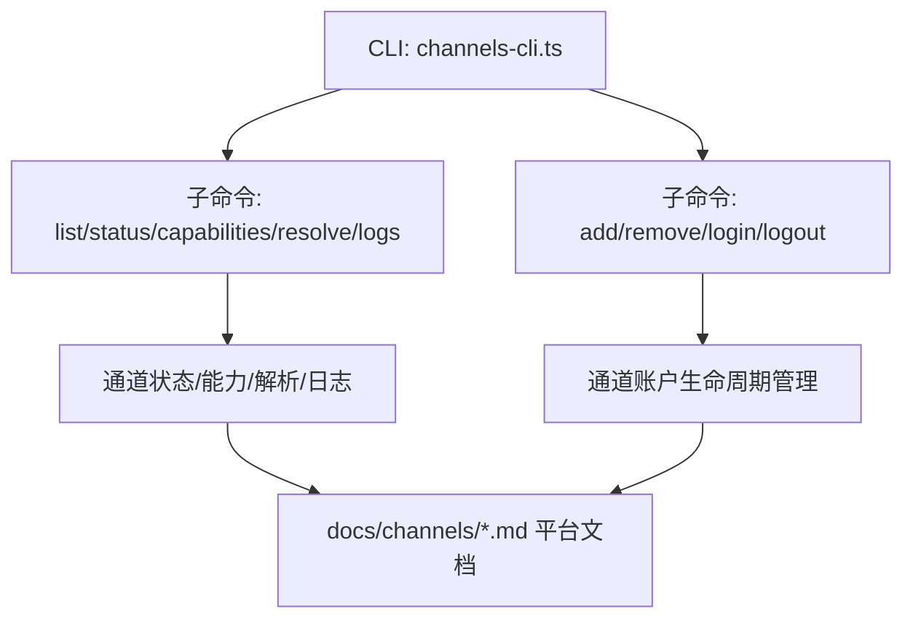
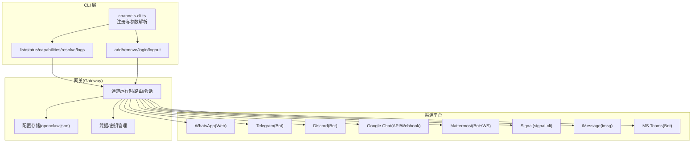
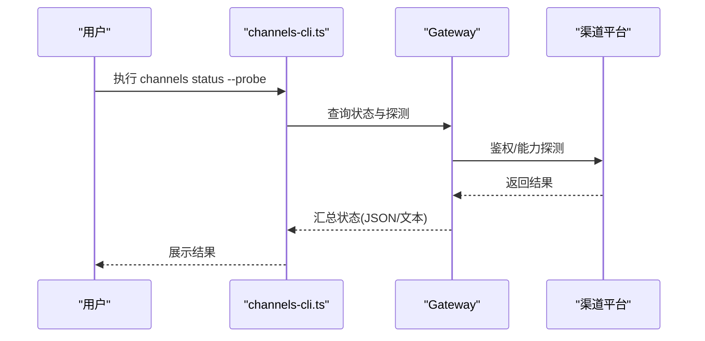
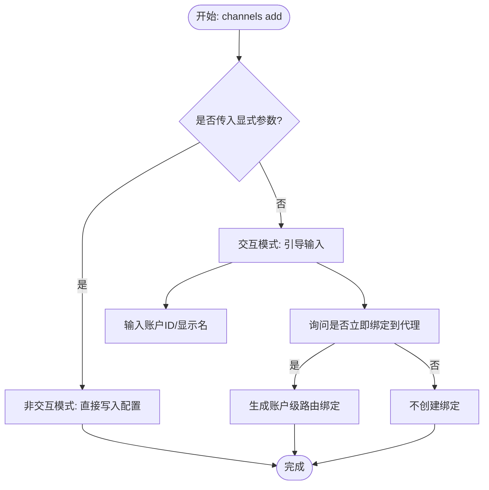
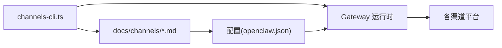

# 渠道管理

<cite>
**本文引用的文件**
- [docs/cli/channels.md](file://docs/cli/channels.md)
- [src/cli/channels-cli.ts](file://src/cli/channels-cli.ts)
- [docs/channels/index.md](file://docs/channels/index.md)
- [docs/channels/whatsapp.md](file://docs/channels/whatsapp.md)
- [docs/channels/telegram.md](file://docs/channels/telegram.md)
- [docs/channels/discord.md](file://docs/channels/discord.md)
- [docs/channels/googlechat.md](file://docs/channels/googlechat.md)
- [docs/channels/mattermost.md](file://docs/channels/mattermost.md)
- [docs/channels/signal.md](file://docs/channels/signal.md)
- [docs/channels/imessage.md](file://docs/channels/imessage.md)
- [docs/channels/msteams.md](file://docs/channels/msteams.md)
</cite>

## 目录
1. [简介](#简介)
2. [项目结构](#项目结构)
3. [核心组件](#核心组件)
4. [架构总览](#架构总览)
5. [详细组件分析](#详细组件分析)
6. [依赖关系分析](#依赖关系分析)
7. [性能考量](#性能考量)
8. [故障排除指南](#故障排除指南)
9. [结论](#结论)
10. [附录](#附录)

## 简介
本文件面向使用 OpenClaw 的用户与运维人员，系统化讲解“渠道管理”能力，围绕 CLI 命令 openclaw channels 的完整功能集展开，覆盖渠道账户的添加、移除、登录与登出；详解主流渠道平台（WhatsApp、Telegram、Discord、Google Chat、Slack、Mattermost、Signal、iMessage、MS Teams）的配置要点与差异；提供多账户管理、权限配置与路由绑定的实操指引；并给出渠道健康检查、日志查看与故障排除的实用方法。

## 项目结构
- CLI 子命令注册与参数定义集中在 channels-cli.ts，负责 list/status/capabilities/resolve/logs/add/remove/login/logout 等子命令的解析与执行。
- 文档层在 docs/cli/channels.md 提供命令用法与示例；各渠道平台在 docs/channels 下有独立的平台级文档，涵盖接入方式、权限模型、配置项与故障排除。

图表来源
- [src/cli/channels-cli.ts:70-257](file://src/cli/channels-cli.ts#L70-L257)
- [docs/cli/channels.md:9-102](file://docs/cli/channels.md#L9-L102)

章节来源
- [src/cli/channels-cli.ts:70-257](file://src/cli/channels-cli.ts#L70-L257)
- [docs/cli/channels.md:9-102](file://docs/cli/channels.md#L9-L102)

## 核心组件
- 命令入口与帮助：channels-cli.ts 注册 channels 主命令及其子命令，并提供示例与文档链接。
- 子命令职责：
  - list/status：列出配置与鉴权概要、运行时状态与可选探测。
  - capabilities：查询提供商能力与支持特性（如 Discord 权限、Slack scopes、Signal 守护进程版本等）。
  - resolve：基于提供商目录解析名称到 ID（支持强制类型与账号选择）。
  - logs：从网关日志文件中按通道筛选最近日志。
  - add/remove：非交互/交互式添加或禁用/删除通道账户；支持多账户与默认账户行为迁移。
  - login/logout：对支持的通道进行会话链接与登出（如 WhatsApp）。

章节来源
- [src/cli/channels-cli.ts:92-257](file://src/cli/channels-cli.ts#L92-L257)
- [docs/cli/channels.md:18-102](file://docs/cli/channels.md#L18-L102)

## 架构总览
下图展示 CLI 与各渠道平台之间的交互关系，以及关键配置与安全边界：

图表来源
- [src/cli/channels-cli.ts:70-257](file://src/cli/channels-cli.ts#L70-L257)
- [docs/channels/index.md:14-37](file://docs/channels/index.md#L14-L37)

## 详细组件分析

### 通用命令与工作流
- 列表与状态
  - openclaw channels list：输出已配置通道与鉴权概要，可选 JSON 输出。
  - openclaw channels status [--probe]：输出通道状态，支持探测鉴权与能力；当网关不可达时回退为配置态摘要。
- 能力探测
  - openclaw channels capabilities [--channel] [--account] [--target] [--timeout] [--json]：查询提供商能力提示与静态特性支持；Discord 支持目标频道权限审计。
- 名称解析
  - openclaw channels resolve --channel <name> [--account] [--kind auto|user|group] <entries...>：基于提供商目录解析名称到 ID，解析为只读且具备降级处理。
- 日志查看
  - openclaw channels logs --channel all|<name> --lines N [--json]：从网关日志文件中筛选最近 N 行。

图表来源
- [src/cli/channels-cli.ts:103-127](file://src/cli/channels-cli.ts#L103-L127)
- [docs/cli/channels.md:72-86](file://docs/cli/channels.md#L72-L86)

章节来源
- [src/cli/channels-cli.ts:92-163](file://src/cli/channels-cli.ts#L92-L163)
- [docs/cli/channels.md:18-102](file://docs/cli/channels.md#L18-L102)

### 添加/移除账户与多账户管理
- 添加账户
  - openclaw channels add --channel <name> [--account] [--name] [平台特定选项]：非交互模式需显式传入必要参数；交互模式可引导输入账户 ID、显示名与是否立即绑定到代理。
  - 多账户迁移：当首次为仍使用单账户顶层设置的通道新增非默认账户时，系统会将顶层单账户值迁移到 channels.<channel>.accounts.default，以保持原有行为并过渡到多账户形态。
  - 路由一致性：已有仅通道级绑定（无 accountId）将继续匹配默认账户；非交互模式不会自动创建/重写绑定；交互模式可选择添加账户级绑定。
  - 若配置处于混合状态（命名账户存在但缺少 default，且仍保留顶层单账户值），可通过 openclaw doctor --fix 将账户级值迁移至 accounts.default。
- 移除账户
  - openclaw channels remove --channel <name> [--account] [--delete]：禁用或删除指定账户配置（带 --delete 可跳过确认）。

图表来源
- [src/cli/channels-cli.ts:164-219](file://src/cli/channels-cli.ts#L164-L219)
- [docs/cli/channels.md:29-57](file://docs/cli/channels.md#L29-L57)

章节来源
- [src/cli/channels-cli.ts:164-219](file://src/cli/channels-cli.ts#L164-L219)
- [docs/cli/channels.md:29-57](file://docs/cli/channels.md#L29-L57)

### 登录/登出（交互）
- 登录
  - openclaw channels login --channel <name> [--account] [--verbose]：对支持的通道进行会话链接（如 WhatsApp Web）。
- 登出
  - openclaw channels logout --channel <name> [--account]：对支持的通道进行会话登出（如 WhatsApp Web）。

章节来源
- [src/cli/channels-cli.ts:221-255](file://src/cli/channels-cli.ts#L221-L255)
- [docs/cli/channels.md:58-69](file://docs/cli/channels.md#L58-L69)

### 各渠道平台配置与最佳实践

#### WhatsApp
- 快速设置：配置 DM 策略与允许列表，使用 openclaw channels login 进行 QR 链接，启动网关后批准首次配对请求。
- 访问控制与激活：
  - DM 策略：pairing/allowlist/open/disabled；支持 allowFrom 数组（E.164）。
  - 组策略：groupPolicy + groupAllowFrom；支持 groups 允许列表与 mention 触发。
  - 自聊天保护：若自聊天号在 allowFrom 中，系统跳过自读回执、避免自我触发。
- 消息归一与上下文：回复上下文、媒体占位符、位置/联系人提取、群组历史注入等。
- 多账户与凭据：账户选择与默认规则、凭据路径兼容性、logout 清理策略。
- 故障排除：未链接、断连重连、无活动监听器、组消息被忽略、Bun 兼容性提示。

章节来源
- [docs/channels/whatsapp.md:24-446](file://docs/channels/whatsapp.md#L24-L446)
- [docs/cli/channels.md:58-69](file://docs/cli/channels.md#L58-L69)

#### Telegram
- 快速设置：BotFather 创建机器人，配置 token 与 DM 策略，启动网关后批准首次 DM。
- 侧边设置：隐私模式与群可见性、管理员权限、BotFather 开关。
- 访问控制与激活：
  - DM 策略：pairing/allowlist/open/disabled；allowFrom 支持 tg:/telegram: 前缀与用户名解析。
  - 组策略：groups 允许列表 + groupPolicy + groupAllowFrom；mention 默认要求。
- 运行时行为：长轮询/Webhook、消息流预览、格式化与链接预览、原生命令菜单、内联按钮、回复线程标签、论坛主题与线程行为、反应通知、ACK 反应、配置写入、长轮询 vs Webhook、限制与 CLI 目标。
- 故障排除：隐私模式切换、命令注册失败、Webhook 可达性、线程与按钮问题。

章节来源
- [docs/channels/telegram.md:24-975](file://docs/channels/telegram.md#L24-L975)
- [docs/cli/channels.md:36-47](file://docs/cli/channels.md#L36-L47)

#### Discord
- 快速设置：开发者门户创建应用与 Bot，启用特权意图，复制 Bot Token，生成邀请 URL 添加到服务器，开启开发者模式收集 ID，配置 OpenClaw 并配对。
- 推荐：将服务器设为工作区，每频道独立会话，按需关闭 mention。
- 运行时模型：网关拥有连接，DM 与公会频道隔离会话，论坛频道支持自动创建线程。
- 访问控制与路由：
  - DM 策略：pairing/allowlist/open/disabled；支持 allowFrom 与用户/角色白名单。
  - 公会策略：groupPolicy + guilds 允许列表 + 用户/角色 + 频道白名单。
  - mention 与群组 DM：默认需要 @mention；可配置忽略其他提及。
  - 基于角色的代理路由：通过 bindings.match.roles 实现。
- 功能细节：回复标签、消息流预览、历史与上下文、线程绑定会话、持久化 ACP 绑定、反应通知、ACK 反应、配置写入。
- 故障排除：权限不足、命令未注册、Webhook 地址可达性、线程样式与回复风格。

章节来源
- [docs/channels/discord.md:24-1224](file://docs/channels/discord.md#L24-L1224)
- [docs/cli/channels.md:36-47](file://docs/cli/channels.md#L36-L47)

#### Google Chat
- 快速设置：创建 Google Cloud 项目与服务账号，启用 Chat API，创建 Chat 应用，配置 Webhook URL 与受众（app-url 或 project-number），启动网关。
- 公网暴露：推荐 Tailscale Funnel 暴露 /googlechat 路径，Dashboard 保持私有。
- 工作原理：Bearer Token 鉴权 + audience 校验，按空间路由（DM/Space），默认 DM pairing，群组默认需要 @mention。
- 配置要点：serviceAccountFile/inline JSON、audienceType/audience、webhookPath、botUser、DM/组策略与允许列表、动作与打字指示、媒体大小限制。
- 故障排除：405 Method Not Allowed、插件未启用、网关未重启、mention gating 与 botUser 设置。

章节来源
- [docs/channels/googlechat.md:12-262](file://docs/channels/googlechat.md#L12-L262)
- [docs/cli/channels.md:36-47](file://docs/cli/channels.md#L36-L47)

#### Mattermost
- 插件安装：openclaw plugins install @openclaw/mattermost（或本地路径）。
- 快速设置：安装插件，创建 Bot 账户，复制 Bot Token 与 Base URL，配置 DM 策略，启动网关。
- 原生斜杠命令：可选启用，回调路径与公网可达性要求。
- 访问控制：DM pairing；组策略 allowlist/mention-gated；@username 匹配为可变，建议启用 dangerouslyAllowNameMatching 作为应急。
- 交互按钮：启用 capabilities.inlineButtons，按钮回调基于 HMAC-SHA256 校验，注意 ID 仅允许字母数字。
- 多账户：channels.mattermost.accounts 下配置多个 Bot。

章节来源
- [docs/channels/mattermost.md:15-370](file://docs/channels/mattermost.md#L15-L370)
- [docs/cli/channels.md:36-47](file://docs/cli/channels.md#L36-L47)

#### Signal
- 快速设置：使用 separate bot number，安装 signal-cli，QR Link 或 SMS 注册，配置 account/cliPath/dmPolicy/allowFrom，启动网关后批准首次配对。
- 外部守护模式：通过 httpUrl 指向外部 signal-cli 守护进程，禁用自动启动。
- 访问控制：DM pairing；组策略 open/allowlist/disabled；UUID/号码允许列表。
- 行为与限制：DM 与组会话隔离；媒体下载与大小限制；typing/read receipts；反应工具；交付目标格式。
- 故障排除：daemon 可达性、配对状态、组消息被忽略、配置校验错误。

章节来源
- [docs/channels/signal.md:20-326](file://docs/channels/signal.md#L20-L326)
- [docs/cli/channels.md:36-47](file://docs/cli/channels.md#L36-L47)

#### iMessage（遗留）
- 快速设置：本地 Mac 使用 imsg，或通过 SSH 远程调用；配置 cliPath/dbPath；启动网关后批准首次配对。
- 访问控制：DM pairing/allowlist/open/disabled；组策略 allowlist/open/disabled；mention 通过正则模式检测。
- 部署模式：专用 macOS 用户、远程 Mac over Tailscale；多账户 per-account 配置。
- 媒体与交付：附件与媒体大小限制；文本分片；地址格式（chat_id/chat_guid/chat_identifier/handle）。
- 故障排除：imsg RPC 支持、DM/组被忽略、远程附件失败、macOS 权限提示遗漏。

章节来源
- [docs/channels/imessage.md:31-368](file://docs/channels/imessage.md#L31-L368)
- [docs/cli/channels.md:36-47](file://docs/cli/channels.md#L36-L47)

#### MS Teams
- 插件安装：openclaw plugins install @openclaw/msteams。
- 快速设置：安装插件，Azure Bot（App ID/密码/租户）、Teams 应用包（含 RSC 权限）、公网/隧道暴露 /api/messages，启动网关。
- 访问控制：DM pairing/allowlist/open/disabled；组策略 allowlist/open/disabled；团队/频道允许列表；@mention 默认开启。
- 功能限制与增强：RSC 仅支持实时消息；Graph API 可读取历史与下载附件；文件上传需 SharePoint Site ID 与相应权限；投票以 Adaptive Cards 发送；回复风格（Threads/Posts）需按频道配置。
- 目标格式：user:<aad-object-id>、conversation:<conversation-id>；CLI/工具示例。
- 故障排除：图标为空、webApplicationInfo.Id 冲突、权限未生效、私有频道支持有限。

章节来源
- [docs/channels/msteams.md:41-777](file://docs/channels/msteams.md#L41-L777)
- [docs/cli/channels.md:36-47](file://docs/cli/channels.md#L36-L47)

## 依赖关系分析
- CLI 与平台文档耦合：channels-cli.ts 的子命令与参数与 docs/channels/*.md 的平台配置项强关联。
- 网关与平台：所有通道最终由网关统一运行、路由与会话管理，CLI 仅负责配置与状态查询。
- 多账户与迁移：channels add 在混合配置状态下会触发迁移逻辑，确保默认账户与命名账户的行为一致。

图表来源
- [src/cli/channels-cli.ts:70-257](file://src/cli/channels-cli.ts#L70-L257)
- [docs/channels/index.md:14-37](file://docs/channels/index.md#L14-L37)

章节来源
- [src/cli/channels-cli.ts:70-257](file://src/cli/channels-cli.ts#L70-L257)
- [docs/channels/index.md:14-37](file://docs/channels/index.md#L14-L37)

## 性能考量
- 通道并发与吞吐：不同通道的长轮询/WS/Webhook 模式对延迟与资源占用有差异，建议根据部署环境选择合适模式（如 Telegram 长轮询 vs Webhook，Discord WS，Google Chat Webhook）。
- 历史上下文与分片：合理设置 historyLimit/textChunkLimit/chunkMode，避免过长上下文导致响应延迟。
- 媒体与附件：限制 mediaMaxMb，避免大文件传输造成内存与网络压力。
- 交互按钮与卡片：Mattermost/Teams 的按钮/Adaptive Cards 需要回调可达性与签名校验，确保回调端点稳定与安全。

## 故障排除指南
- 基础诊断
  - openclaw status：全局状态概览。
  - openclaw doctor：引导修复常见配置问题。
  - openclaw channels status --probe：对通道进行鉴权与能力探测。
- 常见问题定位
  - Claude 使用快照报错 user:profile 缺失：使用 --no-usage 或提供 Claude 会话密钥/重新登录 Claude Code CLI。
  - 网关不可达：status 回退为配置态摘要；确认网关进程与端口。
  - Google Chat 405：检查 channels.googlechat 是否存在、插件是否启用、网关是否重启。
  - Mattermost 按钮点击无效：检查 AllowedUntrustedInternalConnections、回调 URL 可达性、按钮 ID 仅允许字母数字。
  - Teams 图像/文件缺失：确认 Graph 权限与 SharePoint Site ID；私有频道支持有限。
- 日志与追踪
  - openclaw channels logs --channel all --lines 200：筛选最近日志。
  - openclaw logs --follow：实时跟踪网关日志。

章节来源
- [docs/cli/channels.md:65-102](file://docs/cli/channels.md#L65-L102)
- [docs/channels/googlechat.md:209-262](file://docs/channels/googlechat.md#L209-L262)
- [docs/channels/mattermost.md:358-370](file://docs/channels/mattermost.md#L358-L370)
- [docs/channels/msteams.md:745-777](file://docs/channels/msteams.md#L745-L777)

## 结论
通过 openclaw channels 命令，用户可以高效地完成渠道账户的全生命周期管理，并结合各平台文档实现细粒度的访问控制、路由绑定与运行优化。建议在生产环境中优先采用多账户与明确的访问策略，配合 doctor/status/logs 等工具进行持续健康检查与故障定位。

## 附录
- 平台总览与入口：docs/channels/index.md 提供了所有受支持渠道的快速索引与注意事项。
- 平台特定配置参考：每个平台文档均提供最小配置示例、关键字段说明与故障排除清单。

章节来源
- [docs/channels/index.md:9-48](file://docs/channels/index.md#L9-L48)