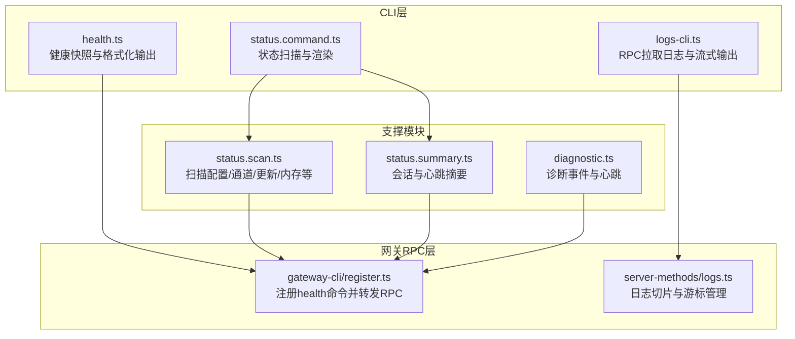
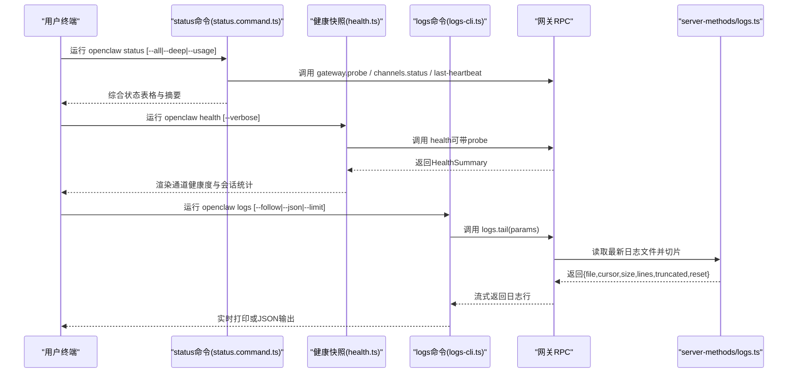
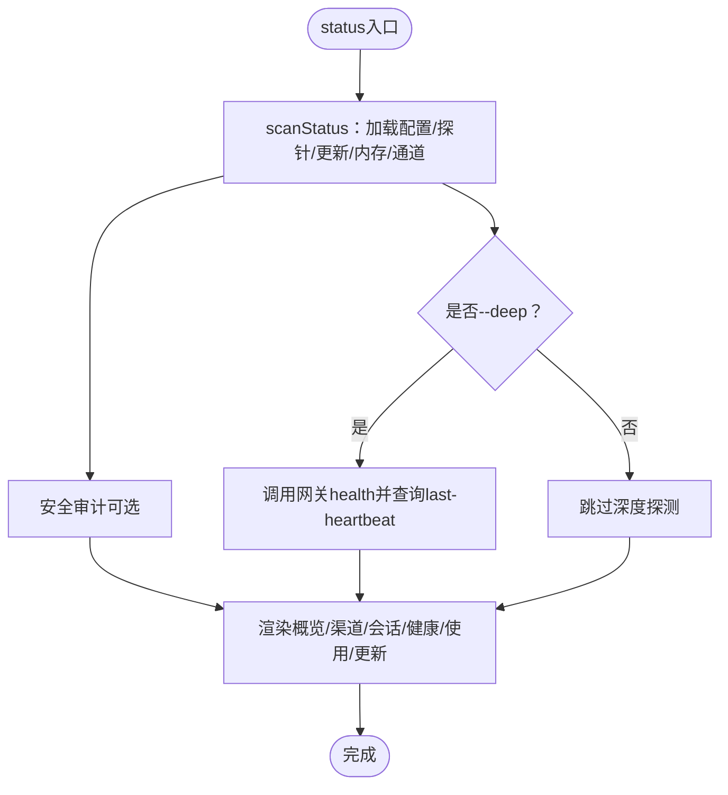
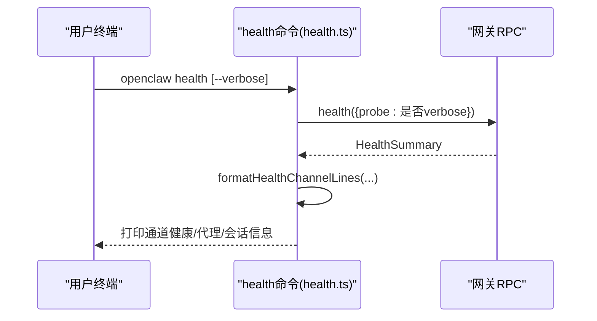
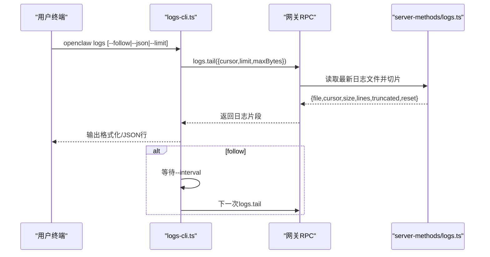
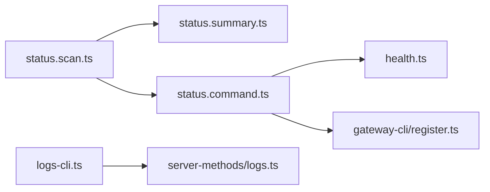

# 系统监控

<cite>
**本文引用的文件**
- [status.md](file://docs/cli/status.md)
- [health.md](file://docs/cli/health.md)
- [logs.md](file://docs/cli/logs.md)
- [status.command.ts](file://src/commands/status.command.ts)
- [health.ts](file://src/commands/health.ts)
- [logs-cli.ts](file://src/cli/logs-cli.ts)
- [status.scan.ts](file://src/commands/status.scan.ts)
- [status.summary.ts](file://src/commands/status.summary.ts)
- [register.ts](file://src/cli/gateway-cli/register.ts)
- [logs.ts](file://src/gateway/server-methods/logs.ts)
- [diagnostic.ts](file://src/logging/diagnostic.ts)
- [probe.test.ts](file://src/signal/probe.test.ts)
- [clawlog.sh](file://scripts/clawlog.sh)
</cite>

## 目录
1. [简介](#简介)
2. [项目结构](#项目结构)
3. [核心组件](#核心组件)
4. [架构总览](#架构总览)
5. [详细组件分析](#详细组件分析)
6. [依赖关系分析](#依赖关系分析)
7. [性能考量](#性能考量)
8. [故障排查指南](#故障排查指南)
9. [结论](#结论)
10. [附录](#附录)

## 简介
本文件面向OpenClaw系统的运维与开发者，提供“系统监控”能力的权威使用文档。重点覆盖以下CLI命令与能力：
- status：系统状态检查，包含网关状态、节点状态、会话状态与渠道健康度的综合诊断。
- health：健康检查，包含网关服务状态、多账号通道探测、模型可用性与系统资源使用概览。
- logs：日志监控，支持远程RPC拉取网关日志、实时追踪、过滤与分析。

同时，文档给出系统性能指标解读、错误报告与告警配置的使用方法，并总结故障诊断、性能优化与监控最佳实践。

## 项目结构
OpenClaw的监控相关能力由三部分组成：
- 文档层：位于docs/cli，提供status、health、logs的官方用法说明。
- 命令实现层：位于src/commands与src/cli，封装CLI命令、RPC调用与状态聚合逻辑。
- 网关侧实现层：位于src/gateway/server-methods，提供health与logs等RPC接口。

图表来源
- [status.command.ts:67-686](file://src/commands/status.command.ts#L67-L686)
- [health.ts:525-751](file://src/commands/health.ts#L525-L751)
- [logs-cli.ts:198-330](file://src/cli/logs-cli.ts#L198-L330)
- [register.ts:163-190](file://src/cli/gateway-cli/register.ts#L163-L190)
- [logs.ts:38-79](file://src/gateway/server-methods/logs.ts#L38-L79)
- [status.scan.ts:270-403](file://src/commands/status.scan.ts#L270-L403)
- [status.summary.ts:79-240](file://src/commands/status.summary.ts#L79-L240)
- [diagnostic.ts:1-421](file://src/logging/diagnostic.ts#L1-L421)

章节来源
- [status.md:1-29](file://docs/cli/status.md#L1-L29)
- [health.md:1-22](file://docs/cli/health.md#L1-L22)
- [logs.md:1-29](file://docs/cli/logs.md#L1-L29)

## 核心组件
- status命令：综合扫描系统状态，输出网关连接、服务安装状态、代理/节点状态、会话与内存、渠道健康度、安全审计、更新信息与最近系统事件等。
- health命令：通过RPC查询运行中网关的健康快照，支持可选的深度探测（对多账号通道进行逐个探测），并以人类可读或JSON格式输出。
- logs命令：通过RPC从网关侧拉取日志文件片段，支持--follow持续跟踪、--json输出结构化行、--local-time本地时区显示、--limit/--max-bytes控制大小与行数。

章节来源
- [status.command.ts:67-686](file://src/commands/status.command.ts#L67-L686)
- [health.ts:525-751](file://src/commands/health.ts#L525-L751)
- [logs-cli.ts:198-330](file://src/cli/logs-cli.ts#L198-L330)

## 架构总览
下图展示status/health/logs在CLI与网关之间的交互流程，以及关键数据结构的来源。

图表来源
- [status.command.ts:144-168](file://src/commands/status.command.ts#L144-L168)
- [health.ts:525-544](file://src/commands/health.ts#L525-L544)
- [logs-cli.ts:45-62](file://src/cli/logs-cli.ts#L45-L62)
- [logs.ts:53-79](file://src/gateway/server-methods/logs.ts#L53-L79)
- [register.ts:163-190](file://src/cli/gateway-cli/register.ts#L163-L190)

## 详细组件分析

### status命令：系统状态检查
- 功能要点
  - 支持--all、--deep、--usage、--json、--verbose、--timeout等参数。
  - 深度模式(--deep)触发对网关健康探测与最近心跳查询。
  - 输出包括：概览（系统/网关/服务/代理/内存/事件/心跳/会话）、安全审计、渠道健康、使用快照、更新提示与下一步建议。
  - 对SecretRef进行只读解析，若令牌不可用则降级输出而不崩溃，并在JSON中包含secretDiagnostics。
- 关键流程
  - 配置扫描与探针：构建网关连接详情、探测可达性、收集渠道问题、汇总会话与心跳、查询更新与内存状态。
  - 健康探测：可选地调用网关health接口并格式化输出。
  - 安全审计：在非JSON模式下执行进度提示，在JSON模式下直接异步执行。
  - 最终渲染：按表格与分组输出，提供下一步操作建议。

图表来源
- [status.command.ts:67-216](file://src/commands/status.command.ts#L67-L216)
- [status.scan.ts:270-403](file://src/commands/status.scan.ts#L270-L403)
- [status.summary.ts:79-240](file://src/commands/status.summary.ts#L79-L240)

章节来源
- [status.md:1-29](file://docs/cli/status.md#L1-L29)
- [status.command.ts:67-686](file://src/commands/status.command.ts#L67-L686)
- [status.scan.ts:270-403](file://src/commands/status.scan.ts#L270-L403)
- [status.summary.ts:79-240](file://src/commands/status.summary.ts#L79-L240)

### health命令：健康检查
- 功能要点
  - 通过RPC查询运行中网关的健康快照，支持--verbose开启深度探测（对每个通道的多个账号分别探测）。
  - 输出通道健康行（已链接/未链接/已配置/未知/失败等），并标注耗时与机器人用户名。
  - 可选显示代理心跳间隔、会话存储路径与最近会话列表。
- 关键流程
  - 读取配置并调用网关health；根据--verbose决定是否启用probe。
  - 格式化通道健康行，必要时补充绑定映射与首选账号。
  - 输出通道行、代理与会话信息。

图表来源
- [health.ts:525-751](file://src/commands/health.ts#L525-L751)
- [register.ts:163-190](file://src/cli/gateway-cli/register.ts#L163-L190)

章节来源
- [health.md:1-22](file://docs/cli/health.md#L1-L22)
- [health.ts:525-751](file://src/commands/health.ts#L525-L751)

### logs命令：日志监控
- 功能要点
  - 通过RPC从网关侧拉取日志文件片段，支持--follow持续跟踪、--json输出结构化行、--limit/--max-bytes限制大小与行数、--local-time本地时区显示。
  - 解析单行日志，按时间、级别、子系统/模块、消息格式化输出；在JSON模式下输出结构化对象。
  - 断开管道时优雅处理，避免二次错误。
- 关键流程
  - 解析参数与选项，首次请求显示进度条，后续轮询仅显示内容。
  - 调用logs.tail RPC，解析返回的lines并逐行输出；当truncated/reset出现时提示。
  - follow模式下按--interval轮询，直到用户中断。

图表来源
- [logs-cli.ts:45-62](file://src/cli/logs-cli.ts#L45-L62)
- [logs-cli.ts:218-328](file://src/cli/logs-cli.ts#L218-L328)
- [logs.ts:53-79](file://src/gateway/server-methods/logs.ts#L53-L79)

章节来源
- [logs.md:1-29](file://docs/cli/logs.md#L1-L29)
- [logs-cli.ts:198-330](file://src/cli/logs-cli.ts#L198-L330)
- [logs.ts:38-79](file://src/gateway/server-methods/logs.ts#L38-L79)

## 依赖关系分析
- status命令依赖：
  - 配置与探针：status.scan.ts负责加载配置、探测网关、收集渠道状态、汇总会话与心跳、查询更新与内存。
  - 健康与审计：status.command.ts在深探模式下调用网关health与last-heartbeat，并执行安全审计。
  - 输出渲染：status.summary.ts生成会话与心跳摘要，status.command.ts将其拼装到表格与段落中。
- health命令依赖：
  - 通过RPC调用网关health，格式化通道健康行，必要时补充绑定映射与首选账号。
- logs命令依赖：
  - 通过RPC调用网关logs.tail，server-methods/logs.ts负责定位最新日志文件、按游标切片与限流。

图表来源
- [status.scan.ts:270-403](file://src/commands/status.scan.ts#L270-L403)
- [status.summary.ts:79-240](file://src/commands/status.summary.ts#L79-L240)
- [status.command.ts:67-216](file://src/commands/status.command.ts#L67-L216)
- [health.ts:525-544](file://src/commands/health.ts#L525-L544)
- [register.ts:163-190](file://src/cli/gateway-cli/register.ts#L163-L190)
- [logs-cli.ts:45-62](file://src/cli/logs-cli.ts#L45-L62)
- [logs.ts:38-79](file://src/gateway/server-methods/logs.ts#L38-L79)

章节来源
- [status.command.ts:67-216](file://src/commands/status.command.ts#L67-L216)
- [health.ts:525-544](file://src/commands/health.ts#L525-L544)
- [logs-cli.ts:198-330](file://src/cli/logs-cli.ts#L198-L330)

## 性能考量
- status命令
  - --deep模式会触发对多个通道的实时探测，可能增加RPC调用次数与总耗时；建议在需要时使用，或配合--timeoutMs控制超时。
  - --usage模式会查询提供商用量快照，注意网络与第三方API响应时间。
- health命令
  - --verbose会为每个通道的多个账号发起探测，建议在排障时使用，日常监控可不加。
  - 通道探测受各渠道API速率限制影响，建议合理设置超时与重试策略。
- logs命令
  - --max-bytes与--limit过大可能导致单次RPC负载较高；建议结合--interval调整轮询频率。
  - --json模式便于外部工具处理，但会产生大量结构化输出，注意I/O吞吐。

[本节为通用指导，无需特定文件来源]

## 故障排查指南
- status命令
  - 若出现“配置的令牌在当前命令路径不可用”，说明SecretRef解析受限，系统会降级输出并在JSON中包含secretDiagnostics，建议在具备完整权限的环境中运行或使用--all。
  - 网关不可达时，会提示修复方式；可通过gateway probe先行验证。
- health命令
  - --verbose输出包含每个账号的探测耗时与机器人用户名，便于定位慢点与认证问题。
  - 若通道显示“未链接/失败”，优先检查对应账号的配置与认证状态。
- logs命令
  - 当输出被截断(truncated)或游标重置(reset)，请增大--max-bytes或缩短轮询间隔。
  - 出现“网关不可达”提示时，先运行doctor进行自检，再重试。

章节来源
- [status.md:27-29](file://docs/cli/status.md#L27-L29)
- [status.command.ts:178-216](file://src/commands/status.command.ts#L178-L216)
- [health.ts:525-544](file://src/commands/health.ts#L525-L544)
- [logs-cli.ts:158-196](file://src/cli/logs-cli.ts#L158-L196)

## 结论
- status用于快速掌握系统整体健康与运行态势，适合日常巡检与问题初筛。
- health用于深入验证网关与通道的连通性与认证有效性，适合排障阶段使用。
- logs用于远程实时观测与分析，结合--json与--follow可接入自动化监控与告警体系。
- 建议将status/health作为例行巡检项，logs作为问题定位与根因分析的首选工具，并结合诊断事件与心跳机制完善告警与恢复闭环。

[本节为总结性内容，无需特定文件来源]

## 附录

### 使用示例与参数速查
- status
  - 基本：openclaw status
  - 全量：openclaw status --all
  - 深度：openclaw status --deep
  - 使用快照：openclaw status --usage
  - JSON：openclaw status --json
  - 超时：openclaw status --timeout 5000
- health
  - 基本：openclaw health
  - JSON：openclaw health --json
  - 详细：openclaw health --verbose
- logs
  - 基本：openclaw logs
  - 实时：openclaw logs --follow
  - JSON：openclaw logs --json
  - 限制：openclaw logs --limit 500
  - 本地时间：openclaw logs --local-time
  - 实时+本地时间：openclaw logs --follow --local-time

章节来源
- [status.md:13-18](file://docs/cli/status.md#L13-L18)
- [health.md:12-16](file://docs/cli/health.md#L12-L16)
- [logs.md:19-26](file://docs/cli/logs.md#L19-L26)

### 系统性能指标与诊断事件
- 诊断事件与心跳
  - 系统周期性发出诊断心跳，记录webhook接收/处理/错误计数、活动/等待/排队数量，并清理过期命令轮询状态。
  - 心跳间隔固定，便于观察系统活跃度与积压情况。
- 日志分类
  - 信号日志按严重级别分类（INFO/DEBUG视为日志，WARN/ERROR视为错误），便于过滤与告警。
- Shell脚本辅助
  - 提供基于macOS log命令的谓词过滤与流式输出脚本，可用于本地系统日志的快速检索与持续跟踪。

章节来源
- [diagnostic.ts:372-410](file://src/logging/diagnostic.ts#L372-L410)
- [probe.test.ts:48-69](file://src/signal/probe.test.ts#L48-L69)
- [clawlog.sh:220-260](file://scripts/clawlog.sh#L220-L260)