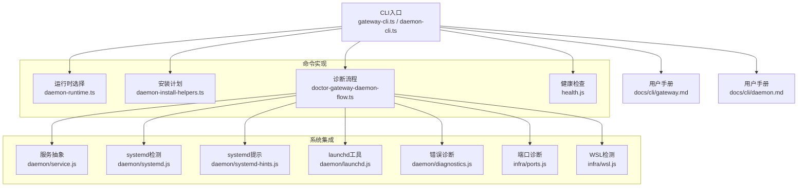
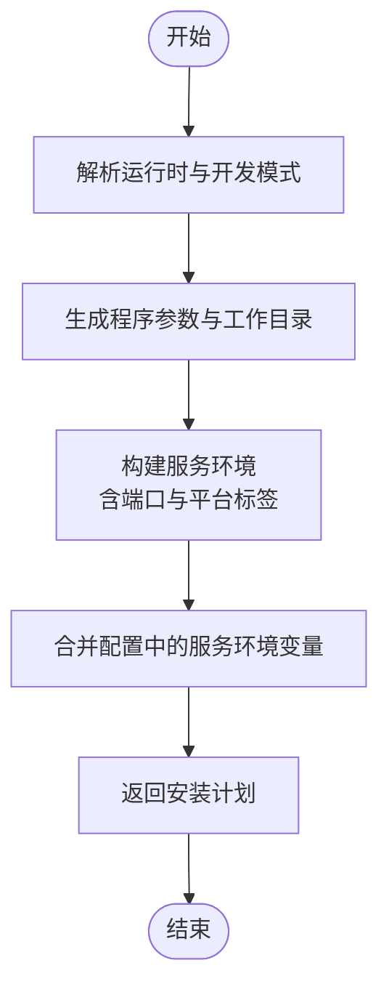
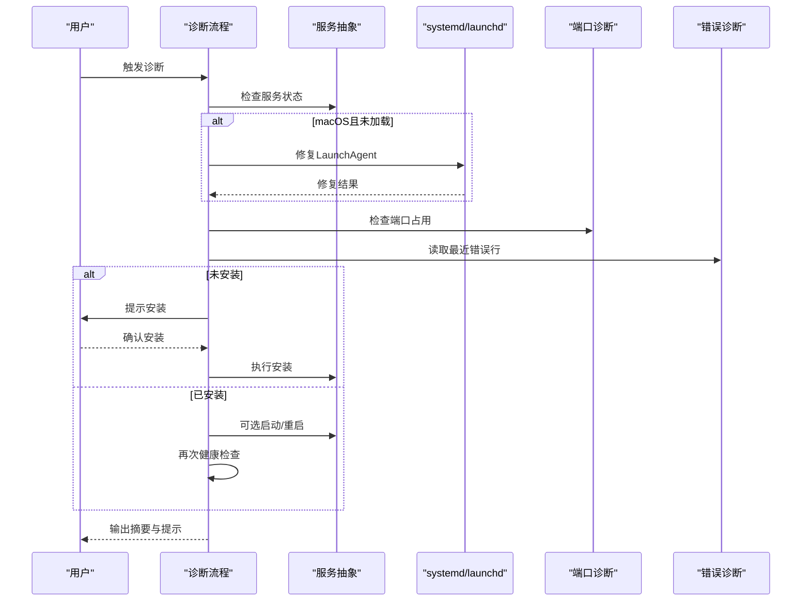
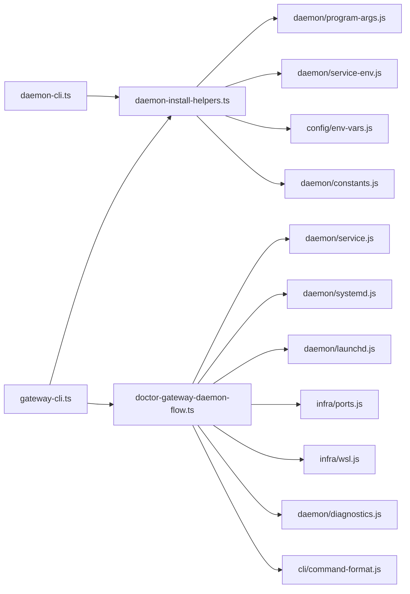

# 网关控制

<cite>
**本文引用的文件**
- [src/cli/gateway-cli.ts](file://src/cli/gateway-cli.ts)
- [src/cli/daemon-cli.ts](file://src/cli/daemon-cli.ts)
- [docs/cli/gateway.md](file://docs/cli/gateway.md)
- [docs/cli/daemon.md](file://docs/cli/daemon.md)
- [src/commands/daemon-install-helpers.ts](file://src/commands/daemon-install-helpers.ts)
- [src/commands/daemon-runtime.ts](file://src/commands/daemon-runtime.ts)
- [src/commands/doctor-gateway-daemon-flow.ts](file://src/commands/doctor-gateway-daemon-flow.ts)
- [src/commands/health.js](file://src/commands/health.js)
- [src/commands/health-format.js](file://src/commands/health-format.js)
- [src/commands/doctor-format.js](file://src/commands/doctor-format.js)
- [src/commands/gateway-install-token.js](file://src/commands/gateway-install-token.js)
- [src/daemon/service.js](file://src/daemon/service.js)
- [src/daemon/systemd.js](file://src/daemon/systemd.js)
- [src/daemon/systemd-hints.js](file://src/daemon/systemd-hints.js)
- [src/daemon/launchd.js](file://src/daemon/launchd.js)
- [src/daemon/diagnostics.js](file://src/daemon/diagnostics.js)
- [src/infra/ports.js](file://src/infra/ports.js)
- [src/infra/wsl.js](file://src/infra/wsl.js)
- [src/cli/command-format.js](file://src/cli/command-format.js)
- [src/config/env-vars.js](file://src/config/env-vars.js)
- [src/daemon/constants.js](file://src/daemon/constants.js)
- [src/daemon/program-args.js](file://src/daemon/program-args.js)
- [src/daemon/service-env.js](file://src/daemon/service-env.js)
- [src/commands/doctor-prompter.js](file://src/commands/doctor-prompter.js)
- [src/runtime.js](file://src/runtime.js)
- [src/terminal/note.js](file://src/terminal/note.js)
- [src/utils.js](file://src/utils.js)
</cite>

## 目录
1. [简介](#简介)
2. [项目结构](#项目结构)
3. [核心组件](#核心组件)
4. [架构总览](#架构总览)
5. [详细组件分析](#详细组件分析)
6. [依赖关系分析](#依赖关系分析)
7. [性能考虑](#性能考虑)
8. [故障排除指南](#故障排除指南)
9. [结论](#结论)
10. [附录](#附录)

## 简介
本文件面向OpenClaw网关控制系统，提供“gateway”和“daemon”两类CLI命令的使用与运维指南。内容覆盖：
- 网关启动、停止、重启与状态查询（gateway命令）
- 端口配置、认证设置、网络绑定选项
- 守护进程服务管理（daemon命令）：安装、卸载、启动、停止
- 健康检查、探针测试与远程管理
- 配置文件管理、日志监控与性能调优
- 故障排除、安全配置与高可用部署最佳实践

## 项目结构
围绕网关控制的核心代码位于src/cli与src/commands目录，配套文档在docs/cli中。下图展示与“网关控制”直接相关的关键模块与职责：

```mermaid
graph TB
subgraph "CLI层"
GWCLI["gateway-cli.ts<br/>导出注册器"]
DCLI["daemon-cli.ts<br/>导出注册器与运行器"]
end
subgraph "命令实现"
GWDOC["docs/cli/gateway.md<br/>用户手册"]
DDOC["docs/cli/daemon.md<br/>用户手册"]
DOCTOR["doctor-gateway-daemon-flow.ts<br/>诊断与修复流程"]
HEALTH["health.js<br/>健康检查命令"]
HEALTH_FMT["health-format.js<br/>健康检查格式化"]
DOCTOR_FMT["doctor-format.js<br/>诊断摘要格式化"]
INSTALL_PLAN["daemon-install-helpers.ts<br/>安装计划构建"]
RUNTIME["daemon-runtime.ts<br/>运行时选择"]
INSTALL_TOKEN["gateway-install-token.js<br/>安装时令牌解析"]
end
subgraph "系统集成"
SVC["daemon/service.js<br/>服务抽象"]
SYS["daemon/systemd.js<br/>systemd检测"]
SYS_HINTS["daemon/systemd-hints.js<br/>systemd提示"]
LAUNCHD["daemon/launchd.js<br/>launchd工具"]
DIAG["daemon/diagnostics.js<br/>错误行读取"]
PORTS["infra/ports.js<br/>端口占用诊断"]
WSL["infra/wsl.js<br/>WSL环境检测"]
CMD_FMT["cli/command-format.js<br/>命令格式化"]
ENV["config/env-vars.js<br/>配置环境变量收集"]
CONST["daemon/constants.js<br/>标签/常量"]
PARGS["daemon/program-args.js<br/>程序参数解析"]
SENV["daemon/service-env.js<br/>服务环境构建"]
end
GWCLI --> GWDOC
DCLI --> DDOC
DOCTOR --> INSTALL_PLAN
DOCTOR --> RUNTIME
DOCTOR --> INSTALL_TOKEN
DOCTOR --> SVC
DOCTOR --> SYS
DOCTOR --> SYS_HINTS
DOCTOR --> LAUNCHD
DOCTOR --> DIAG
DOCTOR --> PORTS
DOCTOR --> WSL
DOCTOR --> CMD_FMT
INSTALL_PLAN --> ENV
INSTALL_PLAN --> CONST
INSTALL_PLAN --> PARGS
INSTALL_PLAN --> SENV
HEALTH --> HEALTH_FMT
```

图表来源
- [src/cli/gateway-cli.ts:1-2](file://src/cli/gateway-cli.ts#L1-L2)
- [src/cli/daemon-cli.ts:1-16](file://src/cli/daemon-cli.ts#L1-L16)
- [docs/cli/gateway.md:1-215](file://docs/cli/gateway.md#L1-L215)
- [docs/cli/daemon.md:1-52](file://docs/cli/daemon.md#L1-L52)
- [src/commands/doctor-gateway-daemon-flow.ts:1-289](file://src/commands/doctor-gateway-daemon-flow.ts#L1-L289)
- [src/commands/daemon-install-helpers.ts:1-75](file://src/commands/daemon-install-helpers.ts#L1-L75)
- [src/commands/daemon-runtime.ts:1-20](file://src/commands/daemon-runtime.ts#L1-L20)
- [src/commands/health.js](file://src/commands/health.js)
- [src/commands/health-format.js](file://src/commands/health-format.js)
- [src/commands/doctor-format.js](file://src/commands/doctor-format.js)
- [src/commands/gateway-install-token.js](file://src/commands/gateway-install-token.js)
- [src/daemon/service.js](file://src/daemon/service.js)
- [src/daemon/systemd.js](file://src/daemon/systemd.js)
- [src/daemon/systemd-hints.js](file://src/daemon/systemd-hints.js)
- [src/daemon/launchd.js](file://src/daemon/launchd.js)
- [src/daemon/diagnostics.js](file://src/daemon/diagnostics.js)
- [src/infra/ports.js](file://src/infra/ports.js)
- [src/infra/wsl.js](file://src/infra/wsl.js)
- [src/cli/command-format.js](file://src/cli/command-format.js)
- [src/config/env-vars.js](file://src/config/env-vars.js)
- [src/daemon/constants.js](file://src/daemon/constants.js)
- [src/daemon/program-args.js](file://src/daemon/program-args.js)
- [src/daemon/service-env.js](file://src/daemon/service-env.js)

章节来源
- [docs/cli/gateway.md:1-215](file://docs/cli/gateway.md#L1-L215)
- [docs/cli/daemon.md:1-52](file://docs/cli/daemon.md#L1-L52)

## 核心组件
- 网关CLI入口与注册器：通过导出注册器函数，将“gateway”子命令接入CLI框架。
- 守护进程CLI入口与运行器：提供服务生命周期命令（install/start/stop/restart/status/uninstall），并映射到相同的服务控制面。
- 安装计划构建：根据运行时、端口、环境变量等生成服务启动参数、工作目录与环境。
- 运行时选择：支持Node/Bun运行时，Node为推荐默认值。
- 诊断与修复流程：综合服务状态、端口占用、错误日志、systemd/launchd状态进行自动化修复建议与执行。

章节来源
- [src/cli/gateway-cli.ts:1-2](file://src/cli/gateway-cli.ts#L1-L2)
- [src/cli/daemon-cli.ts:1-16](file://src/cli/daemon-cli.ts#L1-L16)
- [src/commands/daemon-install-helpers.ts:1-75](file://src/commands/daemon-install-helpers.ts#L1-L75)
- [src/commands/daemon-runtime.ts:1-20](file://src/commands/daemon-runtime.ts#L1-L20)
- [src/commands/doctor-gateway-daemon-flow.ts:1-289](file://src/commands/doctor-gateway-daemon-flow.ts#L1-L289)

## 架构总览
下图展示“gateway”与“daemon”命令在CLI中的角色分工与交互关系，以及它们如何调用系统服务与诊断工具：

图表来源
- [src/cli/gateway-cli.ts:1-2](file://src/cli/gateway-cli.ts#L1-L2)
- [src/cli/daemon-cli.ts:1-16](file://src/cli/daemon-cli.ts#L1-L16)
- [docs/cli/gateway.md:1-215](file://docs/cli/gateway.md#L1-L215)
- [docs/cli/daemon.md:1-52](file://docs/cli/daemon.md#L1-L52)
- [src/commands/daemon-runtime.ts:1-20](file://src/commands/daemon-runtime.ts#L1-L20)
- [src/commands/daemon-install-helpers.ts:1-75](file://src/commands/daemon-install-helpers.ts#L1-L75)
- [src/commands/doctor-gateway-daemon-flow.ts:1-289](file://src/commands/doctor-gateway-daemon-flow.ts#L1-L289)
- [src/commands/health.js](file://src/commands/health.js)
- [src/daemon/service.js](file://src/daemon/service.js)
- [src/daemon/systemd.js](file://src/daemon/systemd.js)
- [src/daemon/systemd-hints.js](file://src/daemon/systemd-hints.js)
- [src/daemon/launchd.js](file://src/daemon/launchd.js)
- [src/daemon/diagnostics.js](file://src/daemon/diagnostics.js)
- [src/infra/ports.js](file://src/infra/ports.js)
- [src/infra/wsl.js](file://src/infra/wsl.js)

## 详细组件分析

### 网关命令（gateway）
- 启动与运行
  - 支持前台运行别名与本地运行模式；默认要求配置中启用本地模式，可通过显式开关允许未配置运行。
  - 绑定策略支持loopback、LAN、tailnet、auto与custom；未启用认证时禁止对外绑定（安全保护）。
  - 信号处理：接收特定信号触发进程内重启或优雅退出。
- 查询与探测
  - 健康检查：通过WebSocket RPC进行连通性与可用性验证。
  - 状态查询：可仅查询服务状态或附加RPC探测；支持SecretRef解析用于探测认证。
  - 探针测试：扫描本地与远端网关，支持SSH隧道穿透以发现被loopback绑定的远程网关。
- 管理与发现
  - 服务管理：install/start/stop/restart/uninstall；支持端口、运行时、令牌、强制覆盖等选项。
  - 发现：基于Bonjour多播/广域广播记录，输出网关URL与能力信息。
- 认证与网络绑定
  - 认证模式：token/password；密码可从文件读取；支持SecretRef配置。
  - 网络暴露：支持Tailscale serve/funnel；支持退出时重置配置。
- 日志与调试
  - 输出模式：人类可读/JSON；支持禁用颜色；支持仅显示特定子系统日志。
  - WebSocket日志样式：自动/完整/紧凑；支持原始流事件导出至JSONL文件。

章节来源
- [docs/cli/gateway.md:22-215](file://docs/cli/gateway.md#L22-L215)

### 守护进程命令（daemon）
- 兼容性与映射
  - 作为“gateway”服务管理命令的旧版别名，行为与gateway命令一致。
- 生命周期管理
  - status/install/start/stop/restart/uninstall；支持JSON输出便于脚本化。
  - 安装阶段对SecretRef解析进行校验，避免将明文令牌持久化到服务元数据。
- 平台差异
  - macOS：通过launchd管理；Linux：systemd；Windows：任务计划；提示与修复逻辑按平台适配。

章节来源
- [docs/cli/daemon.md:1-52](file://docs/cli/daemon.md#L1-L52)
- [src/cli/daemon-cli.ts:1-16](file://src/cli/daemon-cli.ts#L1-L16)

### 安装计划构建（buildGatewayInstallPlan）
- 输入要素
  - 运行时（Node/Bun）、端口、开发模式、Node路径、配置对象、警告回调。
- 关键步骤
  - 解析运行时输入与开发模式，生成程序参数与工作目录。
  - 构建服务环境：注入端口、平台特定标签（macOS LaunchAgent）。
  - 合并配置中的服务环境变量，确保服务特定变量优先。
- 错误提示
  - 不同平台失败时提供可执行的修复建议（如以管理员权限重试）。

图表来源
- [src/commands/daemon-install-helpers.ts:22-68](file://src/commands/daemon-install-helpers.ts#L22-L68)
- [src/daemon/program-args.js](file://src/daemon/program-args.js)
- [src/daemon/service-env.js](file://src/daemon/service-env.js)
- [src/config/env-vars.js](file://src/config/env-vars.js)
- [src/daemon/constants.js](file://src/daemon/constants.js)

章节来源
- [src/commands/daemon-install-helpers.ts:1-75](file://src/commands/daemon-install-helpers.ts#L1-L75)

### 诊断与修复流程（doctor-gateway-daemon-flow）
- 流程概览
  - 若健康检查通过则跳过；否则检查服务是否已安装与加载。
  - macOS：若LaunchAgent已列出但未加载，尝试修复并验证。
  - 端口占用与最近错误行：若端口被占用或服务运行异常，给出诊断提示。
  - 未安装场景：Linux检测systemd可用性与WSL环境，提供安装建议与一键安装。
  - 已安装场景：输出运行时摘要与提示，必要时引导启动或重启，并再次健康检查。
- 交互与提示
  - 通过交互式确认执行关键动作（安装、启动、重启）。
  - 使用统一的提示与命令格式化工具增强用户体验。

图表来源
- [src/commands/doctor-gateway-daemon-flow.ts:89-289](file://src/commands/doctor-gateway-daemon-flow.ts#L89-L289)
- [src/daemon/service.js](file://src/daemon/service.js)
- [src/daemon/systemd.js](file://src/daemon/systemd.js)
- [src/daemon/systemd-hints.js](file://src/daemon/systemd-hints.js)
- [src/daemon/launchd.js](file://src/daemon/launchd.js)
- [src/infra/ports.js](file://src/infra/ports.js)
- [src/daemon/diagnostics.js](file://src/daemon/diagnostics.js)
- [src/cli/command-format.js](file://src/cli/command-format.js)

章节来源
- [src/commands/doctor-gateway-daemon-flow.ts:1-289](file://src/commands/doctor-gateway-daemon-flow.ts#L1-L289)

### 健康检查与格式化
- 健康检查命令：通过WebSocket RPC验证网关可用性，支持超时与最终响应等待。
- 格式化输出：将错误与状态转换为人类可读或机器可读格式，便于日志与自动化集成。

章节来源
- [src/commands/health.js](file://src/commands/health.js)
- [src/commands/health-format.js](file://src/commands/health-format.js)

## 依赖关系分析
- 组件耦合
  - CLI层仅负责导出注册器与运行器，降低与具体实现的耦合。
  - 安装计划构建依赖运行时、程序参数、服务环境与配置环境变量收集。
  - 诊断流程依赖服务抽象、systemd/launchd工具、端口与WSL检测、错误诊断与提示工具。
- 外部依赖与集成点
  - 平台服务：launchd（macOS）、systemd（Linux）、任务计划（Windows）。
  - 网络与系统：Bonjour发现、端口占用检测、WSL环境识别。
  - 配置与环境：SecretRef解析、配置环境变量收集、服务环境构建。

图表来源
- [src/cli/gateway-cli.ts:1-2](file://src/cli/gateway-cli.ts#L1-L2)
- [src/cli/daemon-cli.ts:1-16](file://src/cli/daemon-cli.ts#L1-L16)
- [src/commands/daemon-install-helpers.ts:1-75](file://src/commands/daemon-install-helpers.ts#L1-L75)
- [src/commands/doctor-gateway-daemon-flow.ts:1-289](file://src/commands/doctor-gateway-daemon-flow.ts#L1-L289)
- [src/daemon/program-args.js](file://src/daemon/program-args.js)
- [src/daemon/service-env.js](file://src/daemon/service-env.js)
- [src/config/env-vars.js](file://src/config/env-vars.js)
- [src/daemon/constants.js](file://src/daemon/constants.js)
- [src/daemon/service.js](file://src/daemon/service.js)
- [src/daemon/systemd.js](file://src/daemon/systemd.js)
- [src/daemon/launchd.js](file://src/daemon/launchd.js)
- [src/infra/ports.js](file://src/infra/ports.js)
- [src/infra/wsl.js](file://src/infra/wsl.js)
- [src/daemon/diagnostics.js](file://src/daemon/diagnostics.js)
- [src/cli/command-format.js](file://src/cli/command-format.js)

## 性能考虑
- 日志与输出
  - 在高负载场景下，建议使用JSON输出与紧凑日志样式，减少TTY渲染开销。
  - 原始流事件导出到文件可避免内存压力，适合长时会话与大规模并发。
- 端口与绑定
  - 将网关绑定到loopback并在需要时通过隧道或代理暴露，可降低外部攻击面与资源消耗。
- 运行时选择
  - 默认使用Node运行时；Bun在部分协议上存在兼容性风险，建议谨慎使用。
- 诊断与健康检查
  - 合理设置超时与最终响应等待，避免长时间阻塞；在自动化场景中结合JSON输出进行快速判断。

## 故障排除指南
- 服务未安装/未加载
  - macOS：检查LaunchAgent是否已列出且已加载，必要时执行修复流程。
  - Linux：检测systemd可用性与WSL环境，按提示安装或切换运行方式。
- 端口占用
  - 使用端口诊断工具定位占用进程，释放端口或调整网关端口。
- 最近错误行
  - 读取最近错误行以定位崩溃或异常原因，结合日志与健康检查进一步排查。
- 安装失败
  - 根据平台提示修正权限或配置；对于SecretRef令牌，需先解析再安装。
- 远程管理
  - 使用SSH隧道将远程网关暴露至本地回环，再进行探针与健康检查。

章节来源
- [src/commands/doctor-gateway-daemon-flow.ts:89-289](file://src/commands/doctor-gateway-daemon-flow.ts#L89-L289)
- [src/daemon/launchd.js](file://src/daemon/launchd.js)
- [src/daemon/systemd.js](file://src/daemon/systemd.js)
- [src/daemon/systemd-hints.js](file://src/daemon/systemd-hints.js)
- [src/infra/ports.js](file://src/infra/ports.js)
- [src/daemon/diagnostics.js](file://src/daemon/diagnostics.js)
- [src/infra/wsl.js](file://src/infra/wsl.js)

## 结论
通过“gateway”与“daemon”命令，OpenClaw提供了从本地开发到生产部署的一体化网关控制能力。配合安装计划构建、跨平台服务集成与诊断修复流程，用户可以高效地完成网关的启动、管理、监控与排障。建议在生产环境中遵循最小暴露原则、使用SecretRef管理敏感配置、合理选择运行时与日志级别，并结合健康检查与探针测试建立持续可观测性。

## 附录
- 快速参考
  - 启动与运行：参见用户手册中的运行与选项说明。
  - 服务管理：参见用户手册中的生命周期命令与选项。
  - 健康检查与探针：参见用户手册中的健康检查与探针命令。
  - 发现与远程：参见用户手册中的发现与远程SSH模式。
- 最佳实践
  - 安全：优先使用令牌认证与SecretRef；避免在命令行中明文传递密码。
  - 高可用：在多实例场景下使用隔离的配置文件与端口；结合探针与健康检查实现自动恢复。
  - 性能：在高并发场景下启用紧凑日志与原始流导出；合理设置超时与批处理大小。