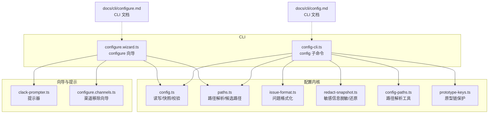
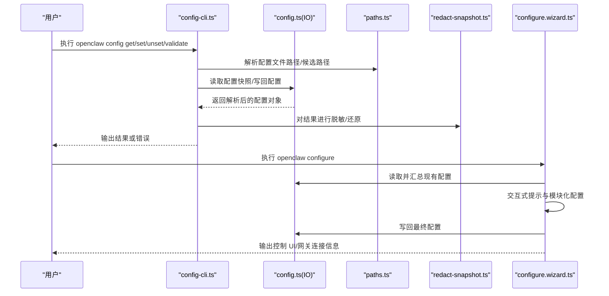
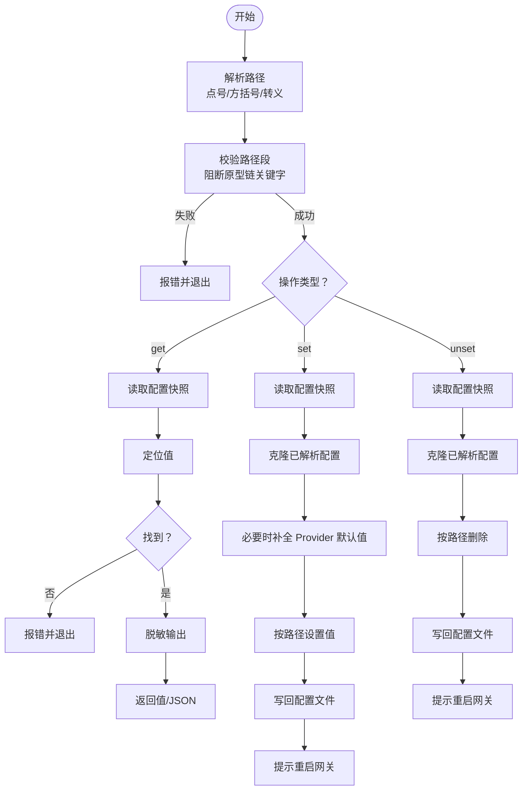
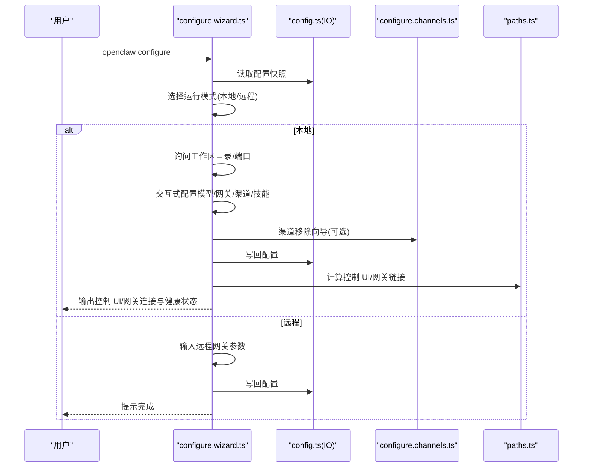
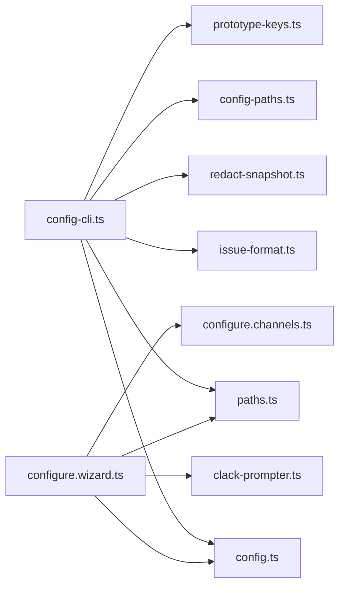

# 配置管理

<cite>
**本文引用的文件**
- [src/cli/config-cli.ts](file://src/cli/config-cli.ts)
- [src/config/config.ts](file://src/config/config.ts)
- [src/config/paths.ts](file://src/config/paths.ts)
- [src/config/issue-format.ts](file://src/config/issue-format.ts)
- [src/config/redact-snapshot.ts](file://src/config/redact-snapshot.ts)
- [src/config/config-paths.ts](file://src/config/config-paths.ts)
- [src/config/prototype-keys.ts](file://src/config/prototype-keys.ts)
- [src/commands/configure.wizard.ts](file://src/commands/configure.wizard.ts)
- [src/commands/configure.channels.ts](file://src/commands/configure.channels.ts)
- [src/wizard/clack-prompter.ts](file://src/wizard/clack-prompter.ts)
- [docs/cli/config.md](file://docs/cli/config.md)
- [docs/cli/configure.md](file://docs/cli/configure.md)
</cite>

## 目录
1. [简介](#简介)
2. [项目结构](#项目结构)
3. [核心组件](#核心组件)
4. [架构总览](#架构总览)
5. [详细组件分析](#详细组件分析)
6. [依赖关系分析](#依赖关系分析)
7. [性能考量](#性能考量)
8. [故障排查指南](#故障排查指南)
9. [结论](#结论)
10. [附录](#附录)

## 简介
本文件面向 OpenClaw 配置管理系统的使用者与维护者，系统性说明以下能力与最佳实践：
- config 命令：非交互式的配置读取、设置与删除；打印当前生效配置文件路径；对配置进行离线校验。
- configure 命令：交互式配置向导，覆盖“运行模式”“模型/网关参数”“渠道设置”“技能配置”等模块。
- 配置文件层次结构、优先级与继承机制（含环境变量覆盖）。
- 配置备份、迁移与恢复方法。
- 错误诊断、性能优化与安全配置建议。

## 项目结构
围绕配置管理的关键代码分布在如下模块：
- CLI 层：config 子命令与 configure 向导入口
- 配置 IO 与解析：配置文件路径解析、读写、校验、脱敏
- 向导与提示：基于 clack 的交互式提示器与各模块配置流程
- 文档：官方 CLI 参考文档

图表来源
- [src/cli/config-cli.ts:1-477](file://src/cli/config-cli.ts#L1-L477)
- [src/commands/configure.wizard.ts:1-706](file://src/commands/configure.wizard.ts#L1-L706)
- [src/config/config.ts:1-29](file://src/config/config.ts#L1-L29)
- [src/config/paths.ts:1-285](file://src/config/paths.ts#L1-L285)
- [src/config/issue-format.ts:1-69](file://src/config/issue-format.ts#L1-L69)
- [src/config/redact-snapshot.ts:1-689](file://src/config/redact-snapshot.ts#L1-L689)
- [src/config/config-paths.ts:1-83](file://src/config/config-paths.ts#L1-L83)
- [src/config/prototype-keys.ts:1-2](file://src/config/prototype-keys.ts#L1-L2)
- [src/wizard/clack-prompter.ts:1-43](file://src/wizard/clack-prompter.ts#L1-L43)
- [src/commands/configure.channels.ts:1-83](file://src/commands/configure.channels.ts#L1-L83)
- [docs/cli/config.md:1-69](file://docs/cli/config.md#L1-L69)
- [docs/cli/configure.md:1-37](file://docs/cli/configure.md#L1-L37)

章节来源
- [src/cli/config-cli.ts:1-477](file://src/cli/config-cli.ts#L1-L477)
- [src/commands/configure.wizard.ts:1-706](file://src/commands/configure.wizard.ts#L1-L706)
- [src/config/paths.ts:1-285](file://src/config/paths.ts#L1-L285)
- [docs/cli/config.md:1-69](file://docs/cli/config.md#L1-L69)
- [docs/cli/configure.md:1-37](file://docs/cli/configure.md#L1-L37)

## 核心组件
- 配置读取与写入
  - 通过统一的 IO 接口读取配置快照、解析 JSON5、合并运行时默认值，并支持写回配置文件。
  - 支持在写入前对“已解析但未合并默认值”的配置进行变更，避免默认值污染用户配置。
- 路径解析与安全
  - 支持点号与方括号两种路径语法；对数组索引进行数值校验；对原型链关键字进行阻断，防止原型污染。
- 值解析与类型处理
  - 默认按 JSON5 解析；若失败则作为原始字符串；可通过严格模式要求 JSON5 解析。
- 配置校验
  - 对当前配置进行离线校验，输出结构化或人类可读的问题列表。
- 脱敏与还原
  - 在读取/展示/写回过程中对敏感字段进行脱敏；在写回前将 UI 回传的哨兵值还原为原始值，确保凭据不丢失。
- 交互式向导
  - 以模块化步骤引导完成“运行模式选择”“网关参数”“渠道配置/移除”“技能安装”“守护进程安装”“健康检查”等任务。

章节来源
- [src/cli/config-cli.ts:29-96](file://src/cli/config-cli.ts#L29-L96)
- [src/cli/config-cli.ts:106-182](file://src/cli/config-cli.ts#L106-L182)
- [src/cli/config-cli.ts:344-393](file://src/cli/config-cli.ts#L344-L393)
- [src/config/redact-snapshot.ts:116-402](file://src/config/redact-snapshot.ts#L116-L402)
- [src/commands/configure.wizard.ts:306-706](file://src/commands/configure.wizard.ts#L306-L706)

## 架构总览
下图展示了 config 与 configure 的关键调用链路与数据流：

图表来源
- [src/cli/config-cli.ts:395-476](file://src/cli/config-cli.ts#L395-L476)
- [src/config/config.ts:1-29](file://src/config/config.ts#L1-L29)
- [src/config/paths.ts:118-194](file://src/config/paths.ts#L118-L194)
- [src/config/redact-snapshot.ts:349-402](file://src/config/redact-snapshot.ts#L349-L402)
- [src/commands/configure.wizard.ts:306-706](file://src/commands/configure.wizard.ts#L306-L706)

## 详细组件分析

### config 子命令：读取、设置与删除
- 路径语法
  - 支持点号与方括号两种语法；转义字符用于包含分隔符的键名；数组索引必须为数字。
- 值解析
  - 默认尝试 JSON5 解析；失败则作为原始字符串；严格模式要求 JSON5 解析成功。
- 安全性
  - 对路径段进行原型链关键字阻断，避免通过路径注入原型污染。
- 功能要点
  - get：按路径读取值，支持 JSON 输出；对敏感值进行脱敏。
  - set：在“已解析但未合并默认值”的配置副本上修改，再写回；必要时自动补全相关 Provider 默认值。
  - unset：从“已解析但未合并默认值”的配置副本上删除路径项，再写回。
  - file：打印当前生效配置文件路径。
  - validate：离线校验配置有效性，支持 JSON 输出。

图表来源
- [src/cli/config-cli.ts:29-96](file://src/cli/config-cli.ts#L29-L96)
- [src/cli/config-cli.ts:106-182](file://src/cli/config-cli.ts#L106-L182)
- [src/cli/config-cli.ts:279-331](file://src/cli/config-cli.ts#L279-L331)
- [src/config/redact-snapshot.ts:349-402](file://src/config/redact-snapshot.ts#L349-L402)

章节来源
- [src/cli/config-cli.ts:29-96](file://src/cli/config-cli.ts#L29-L96)
- [src/cli/config-cli.ts:106-182](file://src/cli/config-cli.ts#L106-L182)
- [src/cli/config-cli.ts:279-331](file://src/cli/config-cli.ts#L279-L331)
- [src/cli/config-cli.ts:344-393](file://src/cli/config-cli.ts#L344-L393)
- [docs/cli/config.md:14-69](file://docs/cli/config.md#L14-L69)

### configure 向导：交互式配置流程
- 运行模式选择
  - 本地/远程二选一，自动探测可达性并提示。
- 模型与网关参数
  - 引导输入认证参数、端口、绑定地址、控制 UI 路径等。
- 渠道设置与移除
  - 支持“配置/链接”与“移除渠道配置”两种模式；移除时仅清理 openclaw.json 中的令牌与设置，不删除磁盘上的凭据文件。
- 技能配置
  - 引导安装/启用技能，确保工作区存在且模板按需生成。
- 守护进程与健康检查
  - 可选安装守护进程；完成后进行可达性与健康检查，输出控制 UI 与网关连接信息。

图表来源
- [src/commands/configure.wizard.ts:306-706](file://src/commands/configure.wizard.ts#L306-L706)
- [src/commands/configure.channels.ts:11-83](file://src/commands/configure.channels.ts#L11-L83)
- [src/config/config.ts:1-29](file://src/config/config.ts#L1-L29)
- [src/config/paths.ts:266-284](file://src/config/paths.ts#L266-L284)

章节来源
- [src/commands/configure.wizard.ts:306-706](file://src/commands/configure.wizard.ts#L306-L706)
- [src/commands/configure.channels.ts:11-83](file://src/commands/configure.channels.ts#L11-L83)
- [docs/cli/configure.md:8-37](file://docs/cli/configure.md#L8-L37)

### 配置文件层次结构、优先级与继承
- 文件位置解析
  - 支持通过环境变量显式指定配置文件路径；否则在状态目录下查找当前与历史文件名候选；最终回退到默认路径。
  - 状态目录可由环境变量覆盖，默认位于用户主目录下的专用子目录。
- 端口解析
  - 环境变量优先于配置文件中的端口设置。
- 继承与合并
  - 配置读取后会进行解析与运行时默认值合并；写回时使用“已解析但未合并默认值”的副本，避免默认值污染用户配置。
- 兼容性
  - 支持历史状态目录与配置文件名，自动识别并兼容。

章节来源
- [src/config/paths.ts:118-194](file://src/config/paths.ts#L118-L194)
- [src/config/paths.ts:266-284](file://src/config/paths.ts#L266-L284)
- [src/config/config.ts:1-29](file://src/config/config.ts#L1-L29)

### 配置验证与问题格式化
- 校验
  - 对当前配置进行离线校验，输出有效/无效状态与问题列表。
- 问题格式化
  - 将路径标准化为根节点表示，支持结构化 JSON 输出。
- 与 doctor 的关系
  - 当配置无效时，建议使用 doctor 进行修复后再重试。

章节来源
- [src/cli/config-cli.ts:344-393](file://src/cli/config-cli.ts#L344-L393)
- [src/config/issue-format.ts:13-68](file://src/config/issue-format.ts#L13-L68)

### 敏感信息脱敏与还原
- 脱敏策略
  - 基于 UI 提示与正则模式识别敏感路径，对字符串与对象进行脱敏；支持 SecretRef 结构的 ID 字段单独处理。
- 还原策略
  - 在写回前将 UI 回传的哨兵值替换为原始值，确保凭据不丢失。
- 多源一致性
  - 对解析后对象、原始文本与已解析配置均进行脱敏，保证输出与存储安全。

章节来源
- [src/config/redact-snapshot.ts:116-402](file://src/config/redact-snapshot.ts#L116-L402)

### 渠道配置移除向导
- 交互式列出已配置渠道，逐个确认删除。
- 删除仅影响 openclaw.json，不删除磁盘上的凭据文件。
- 删除后提示后续注意事项。

章节来源
- [src/commands/configure.channels.ts:11-83](file://src/commands/configure.channels.ts#L11-L83)

## 依赖关系分析
- 组件耦合
  - config-cli.ts 依赖 config.ts(IO)、paths.ts、issue-format.ts、redact-snapshot.ts、config-paths.ts、prototype-keys.ts。
  - configure.wizard.ts 依赖 config.ts(IO)、paths.ts、clack-prompter.ts、configure.channels.ts 等。
- 关键依赖链
  - 路径解析 → 配置读写 → 脱敏/还原 → 输出/写回。
- 安全边界
  - 原型链关键字阻断与路径段校验贯穿读取、设置、删除全流程。

图表来源
- [src/cli/config-cli.ts:1-477](file://src/cli/config-cli.ts#L1-L477)
- [src/commands/configure.wizard.ts:1-706](file://src/commands/configure.wizard.ts#L1-L706)
- [src/config/config.ts:1-29](file://src/config/config.ts#L1-L29)
- [src/config/paths.ts:1-285](file://src/config/paths.ts#L1-L285)
- [src/config/issue-format.ts:1-69](file://src/config/issue-format.ts#L1-L69)
- [src/config/redact-snapshot.ts:1-689](file://src/config/redact-snapshot.ts#L1-L689)
- [src/config/config-paths.ts:1-83](file://src/config/config-paths.ts#L1-L83)
- [src/config/prototype-keys.ts:1-2](file://src/config/prototype-keys.ts#L1-L2)
- [src/wizard/clack-prompter.ts:1-43](file://src/wizard/clack-prompter.ts#L1-L43)
- [src/commands/configure.channels.ts:1-83](file://src/commands/configure.channels.ts#L1-L83)

## 性能考量
- 配置读取与写入
  - 使用“已解析但未合并默认值”的副本进行写回，减少不必要的默认值写入，降低配置体积与后续解析成本。
- 脱敏与还原
  - 脱敏采用深度遍历与集合查找，复杂度与配置规模线性相关；建议在 UI 与日志中避免直接打印完整配置。
- 健康检查
  - 向导在写回后进行可达性与健康检查，超时时间可控，避免长时间阻塞。

[本节为通用指导，无需特定文件引用]

## 故障排查指南
- 配置无效
  - 使用 validate 子命令查看具体问题；根据问题列表定位路径并修正；必要时使用 doctor 修复。
- 路径错误
  - 确认路径语法正确（点号/方括号/转义）；避免使用被阻断的原型链关键字。
- 写回未生效
  - 修改后需要重启网关以加载新配置；确认写回成功并检查配置文件内容。
- 敏感信息泄露
  - 日志与 UI 输出已脱敏；如发现异常，检查是否绕过脱敏流程或直接打印原始对象。
- 渠道配置残留
  - 使用渠道移除向导清理 openclaw.json 中的令牌与设置；磁盘上的凭据文件不会被删除。

章节来源
- [src/cli/config-cli.ts:344-393](file://src/cli/config-cli.ts#L344-L393)
- [src/config/issue-format.ts:13-68](file://src/config/issue-format.ts#L13-L68)
- [src/commands/configure.channels.ts:11-83](file://src/commands/configure.channels.ts#L11-L83)

## 结论
OpenClaw 的配置管理以“安全、可验证、可交互”为核心设计目标：通过严格的路径解析与原型链防护保障安全性；通过离线校验与脱敏机制提升可观测性与可靠性；通过交互式向导简化复杂配置流程。遵循本文档的路径语法、值类型处理、验证与安全实践，可高效完成配置的读取、设置、删除、备份与恢复，并在出现问题时快速定位与修复。

[本节为总结，无需特定文件引用]

## 附录

### 配置备份、迁移与恢复
- 备份
  - 在执行大规模变更前，复制当前配置文件至安全位置；可结合版本控制进行追踪。
- 迁移
  - 若从历史状态目录或配置文件名迁移，系统会自动识别并兼容；迁移后建议运行 validate 与 doctor 确认。
- 恢复
  - 使用历史备份覆盖当前配置文件；重启网关后验证健康状态。

[本节为通用指导，无需特定文件引用]

### 最佳实践清单
- 使用严格模式解析值，避免意外的字符串解释。
- 通过 validate 与 doctor 保持配置健康。
- 对敏感字段（如令牌、密钥）使用 SecretRef 或环境变量，避免硬编码。
- 在写回前确认路径语法与原型链关键字阻断规则。
- 使用交互式向导完成复杂配置，减少手工编辑出错概率。

[本节为通用指导，无需特定文件引用]