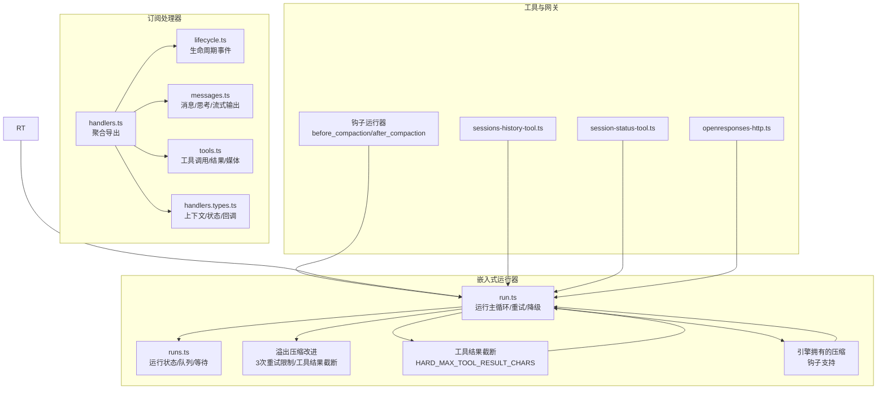
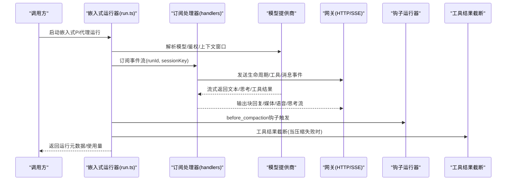
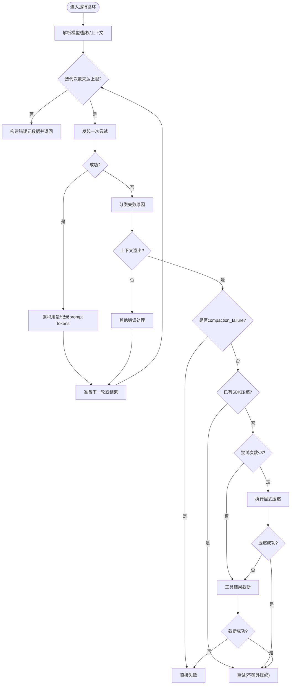
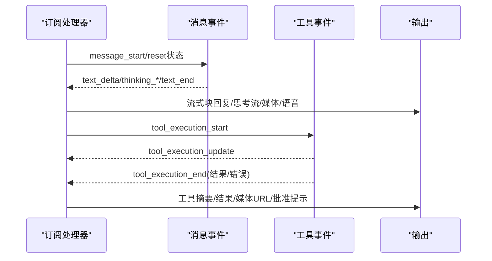
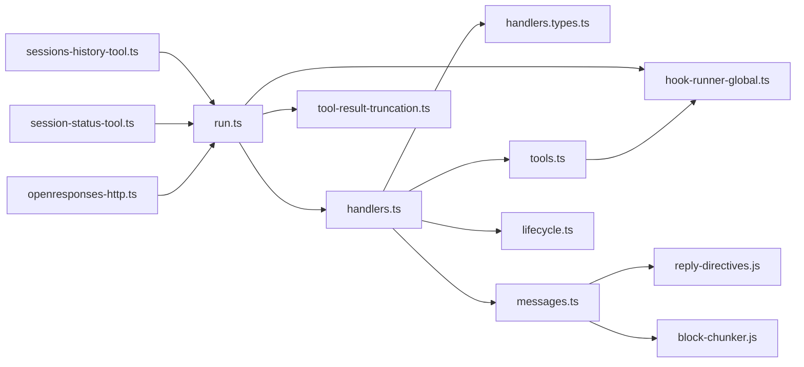

# Pi Agent运行时

<cite>
**本文引用的文件**
- [pi-embedded-runner.ts](file://src/agents/pi-embedded-runner.ts)
- [pi-embedded-runner/run.ts](file://src/agents/pi-embedded-runner/run.ts)
- [pi-embedded-runner/runs.ts](file://src/agents/pi-embedded-runner/runs.ts)
- [pi-embedded-runner/run.overflow-compaction.test.ts](file://src/agents/pi-embedded-runner/run.overflow-compaction.test.ts)
- [pi-embedded-runner/run.overflow-compaction.loop.test.ts](file://src/agents/pi-embedded-runner/run.overflow-compaction.loop.test.ts)
- [pi-embedded-runner/tool-result-truncation.ts](file://src/agents/pi-embedded-runner/tool-result-truncation.ts)
- [pi-embedded-subscribe.handlers.ts](file://src/agents/pi-embedded-subscribe.handlers.ts)
- [pi-embedded-subscribe.handlers.lifecycle.ts](file://src/agents/pi-embedded-subscribe.handlers.lifecycle.ts)
- [pi-embedded-subscribe.handlers.messages.ts](file://src/agents/pi-embedded-subscribe.handlers.messages.ts)
- [pi-embedded-subscribe.handlers.tools.ts](file://src/agents/pi-embedded-subscribe.handlers.tools.ts)
- [pi-embedded-subscribe.handlers.types.ts](file://src/agents/pi-embedded-subscribe.handlers.types.ts)
- [sessions-history-tool.ts](file://src/agents/tools/sessions-history-tool.ts)
- [session-status-tool.ts](file://src/agents/tools/session-status-tool.ts)
- [openresponses-http.ts](file://src/gateway/openresponses-http.ts)
- [heartbeat-runner.ts](file://src/infra/heartbeat-runner.ts)
- [hook-runner-global.ts](file://src/plugins/hook-runner-global.ts)
- [hooks.ts](file://src/plugins/hooks.ts)
</cite>

## 目录
1. [简介](#简介)
2. [项目结构](#项目结构)
3. [核心组件](#核心组件)
4. [架构总览](#架构总览)
5. [详细组件分析](#详细组件分析)
6. [依赖关系分析](#依赖关系分析)
7. [性能考量](#性能考量)
8. [故障排查指南](#故障排查指南)
9. [结论](#结论)
10. [附录](#附录)

## 简介
本文件面向Pi Agent运行时，系统性阐述其嵌入式运行机制、实时订阅处理、代理初始化流程、会话历史管理、工具调用处理与消息流控制，并说明与OpenAI API等模型提供商的集成方式、流式响应处理与错误恢复策略。同时给出配置参数要点、性能优化建议与调试方法，并提供扩展开发指南与最佳实践。

**更新** 本次更新重点反映了Pi嵌入式运行器的溢出压缩改进：增强了上下文溢出恢复机制，添加了压缩钩子支持，改进了引擎拥有的压缩处理，包含重试逻辑和错误处理。

## 项目结构
Pi Agent运行时位于agents子目录下，围绕"嵌入式运行器"和"订阅处理器"两大模块组织代码：
- 嵌入式运行器：负责模型选择、鉴权、上下文窗口评估、重试与降级、运行生命周期管理、并发队列与会话编排。
- 订阅处理器：负责从Pi Agent Core事件流中解析消息、思考内容、工具调用与结果，构建可发送给通道的消息块与回复指令。

**图表来源**
- [pi-embedded-runner/run.ts:987-1205](file://src/agents/pi-embedded-runner/run.ts#L987-L1205)
- [pi-embedded-runner/tool-result-truncation.ts:1-397](file://src/agents/pi-embedded-runner/tool-result-truncation.ts#L1-L397)
- [hook-runner-global.ts:1-105](file://src/plugins/hook-runner-global.ts#L1-L105)
- [hooks.ts:351-369](file://src/plugins/hooks.ts#L351-L369)

**章节来源**
- [pi-embedded-runner.ts:1-29](file://src/agents/pi-embedded-runner.ts#L1-L29)
- [pi-embedded-runner/run.ts:255-800](file://src/agents/pi-embedded-runner/run.ts#L255-L800)
- [pi-embedded-runner/runs.ts:1-252](file://src/agents/pi-embedded-runner/runs.ts#L1-L252)
- [pi-embedded-runner/run.overflow-compaction.test.ts:1-233](file://src/agents/pi-embedded-runner/run.overflow-compaction.test.ts#L1-L233)
- [pi-embedded-runner/run.overflow-compaction.loop.test.ts:1-351](file://src/agents/pi-embedded-runner/run.overflow-compaction.loop.test.ts#L1-L351)
- [pi-embedded-runner/tool-result-truncation.ts:1-397](file://src/agents/pi-embedded-runner/tool-result-truncation.ts#L1-L397)
- [pi-embedded-subscribe.handlers.ts:1-20](file://src/agents/pi-embedded-subscribe.handlers.ts#L1-L20)
- [pi-embedded-subscribe.handlers.lifecycle.ts:1-114](file://src/agents/pi-embedded-subscribe.handlers.lifecycle.ts#L1-L114)
- [pi-embedded-subscribe.handlers.messages.ts:1-441](file://src/agents/pi-embedded-subscribe.handlers.messages.ts#L1-L441)
- [pi-embedded-subscribe.handlers.tools.ts:1-577](file://src/agents/pi-embedded-subscribe.handlers.tools.ts#L1-L577)
- [pi-embedded-subscribe.handlers.types.ts:1-179](file://src/agents/pi-embedded-subscribe.handlers.types.ts#L1-L179)
- [sessions-history-tool.ts:169-207](file://src/agents/tools/sessions-history-tool.ts#L169-L207)
- [session-status-tool.ts:45-88](file://src/agents/tools/session-status-tool.ts#L45-L88)
- [openresponses-http.ts:532-573](file://src/gateway/openresponses-http.ts#L532-L573)
- [hook-runner-global.ts:1-105](file://src/plugins/hook-runner-global.ts#L1-L105)
- [hooks.ts:351-369](file://src/plugins/hooks.ts#L351-L369)

## 核心组件
- 嵌入式运行器（run.ts）
  - 负责模型解析、鉴权配置、上下文窗口评估、失败回退与重试、Copilot令牌刷新、运行元数据收集与错误归因。
  - 提供运行主循环、并发队列、运行状态跟踪与等待机制。
  - **新增**：增强的溢出压缩恢复机制，包含3次重试限制和智能决策逻辑。
- 运行状态管理（runs.ts）
  - 维护活跃运行集合、消息排队、运行终止、等待结束与诊断日志。
- 订阅处理器（handlers）
  - 生命周期：开始/结束、错误分类与观察字段构建。
  - 消息：文本增量、思考内容、块回复、媒体与语音指令解析。
  - 工具：工具执行开始/更新/结束、结果输出、批准提示、媒体URL提取。
- 类型与上下文（handlers.types）
  - 定义订阅上下文、状态机、块分片器、钩子运行器接口与最小化工具上下文。
- **新增**：工具结果截断（tool-result-truncation.ts）
  - 提供工具结果的字符限制和截断策略，防止单个工具结果占用过多上下文。
- **新增**：钩子运行器（hook-runner-global.ts & hooks.ts）
  - 支持before_compaction和after_compaction钩子，为压缩操作提供扩展点。

**章节来源**
- [pi-embedded-runner/run.ts:255-800](file://src/agents/pi-embedded-runner/run.ts#L255-L800)
- [pi-embedded-runner/runs.ts:1-252](file://src/agents/pi-embedded-runner/runs.ts#L1-L252)
- [pi-embedded-runner/tool-result-truncation.ts:1-397](file://src/agents/pi-embedded-runner/tool-result-truncation.ts#L1-L397)
- [hook-runner-global.ts:1-105](file://src/plugins/hook-runner-global.ts#L1-L105)
- [hooks.ts:351-369](file://src/plugins/hooks.ts#L351-L369)
- [pi-embedded-subscribe.handlers.lifecycle.ts:1-114](file://src/agents/pi-embedded-subscribe.handlers.lifecycle.ts#L1-L114)
- [pi-embedded-subscribe.handlers.messages.ts:1-441](file://src/agents/pi-embedded-subscribe.handlers.messages.ts#L1-L441)
- [pi-embedded-subscribe.handlers.tools.ts:1-577](file://src/agents/pi-embedded-subscribe.handlers.tools.ts#L1-L577)
- [pi-embedded-subscribe.handlers.types.ts:1-179](file://src/agents/pi-embedded-subscribe.handlers.types.ts#L1-L179)

## 架构总览
Pi Agent运行时采用"运行器+订阅处理器"的双层架构：
- 运行器负责与模型提供商交互、上下文管理、失败回退与重试、并发与会话编排。
- 订阅处理器负责将事件流转换为可渲染的块回复、思考流与工具结果，同时维护消息边界与去重。

**图表来源**
- [pi-embedded-runner/run.ts:255-800](file://src/agents/pi-embedded-runner/run.ts#L255-L800)
- [pi-embedded-runner/run.ts:1031-1113](file://src/agents/pi-embedded-runner/run.ts#L1031-L1113)
- [pi-embedded-runner/run.ts:1118-1167](file://src/agents/pi-embedded-runner/run.ts#L1118-L1167)
- [pi-embedded-subscribe.handlers.ts:1-20](file://src/agents/pi-embedded-subscribe.handlers.ts#L1-L20)
- [openresponses-http.ts:532-573](file://src/gateway/openresponses-http.ts#L532-L573)
- [hook-runner-global.ts:351-369](file://src/plugins/hook-runner-global.ts#L351-L369)

## 详细组件分析

### 嵌入式运行器（run.ts）
- 初始化与并发
  - 解析会话/全局队列、工作区、插件加载、消息通道能力判断与工具结果格式。
  - 使用队列确保同一会话串行，全局并发隔离。
- 模型与鉴权
  - 钩子优先覆盖模型/提供商；随后解析模型、上下文窗口、评估阈值。
  - 支持多鉴权配置文件轮询、冷却期探测、Copilot令牌定时刷新。
- **更新**：失败回退与重试
  - 基于错误原因分类（鉴权/配额/限流/过载/超时/上下文溢出）进行回退与指数退避。
  - **新增**：上下文溢出自动压缩尝试次数限制为3次；工具结果过大截断。
  - **新增**：智能决策逻辑区分SDK自动压缩和显式压缩尝试。
  - **新增**：引擎拥有的压缩场景下的钩子触发机制。
- 运行元数据
  - 累积输入/输出/缓存用量，最后调用的prompt token用于准确上下文大小报告。

**图表来源**
- [pi-embedded-runner/run.ts:987-1205](file://src/agents/pi-embedded-runner/run.ts#L987-L1205)
- [pi-embedded-runner/run.ts:1031-1113](file://src/agents/pi-embedded-runner/run.ts#L1031-L1113)
- [pi-embedded-runner/run.ts:1118-1167](file://src/agents/pi-embedded-runner/run.ts#L1118-L1167)

**章节来源**
- [pi-embedded-runner/run.ts:255-800](file://src/agents/pi-embedded-runner/run.ts#L255-L800)
- [pi-embedded-runner/run.ts:987-1205](file://src/agents/pi-embedded-runner/run.ts#L987-L1205)

### 工具结果截断（tool-result-truncation.ts）
- **新增**：提供工具结果的字符限制和截断策略
- 最大工具结果上下文占比为30%，即使没有其他消息也应避免超过此限制。
- 硬性字符限制为400,000字符，作为上下文窗口未知时的安全网。
- 最小保留字符为2,000，确保模型理解内容。
- 智能截断策略：当工具结果末尾包含重要信息（错误、异常、JSON结构、摘要）时，采用头+尾策略；否则仅保留开头。
- 支持会话级别的工具结果截断和内存中的消息截断。

**章节来源**
- [pi-embedded-runner/tool-result-truncation.ts:1-397](file://src/agents/pi-embedded-runner/tool-result-truncation.ts#L1-L397)

### 钩子运行器（hook-runner-global.ts & hooks.ts）
- **新增**：支持before_compaction和after_compaction钩子
- 引擎拥有的压缩场景下，当contextEngine.info.ownsCompaction为true时，需要手动触发钩子。
- 钩子运行器提供同步和异步两种执行模式，确保热路径上的性能。
- 支持钩子注册、优先级排序、错误处理和结果合并。

**章节来源**
- [hook-runner-global.ts:1-105](file://src/plugins/hook-runner-global.ts#L1-L105)
- [hooks.ts:351-369](file://src/plugins/hooks.ts#L351-L369)

### 订阅处理器（handlers）
- 生命周期事件
  - 记录开始/结束时间，错误时生成友好文案与观察字段，触发事件上报与回调。
- 消息事件
  - 文本增量、思考增量/结束、原始流记录；支持部分可见思考标签流式输出。
  - 块回复缓冲与分片、重复消息去重、静默回复回退文本。
- 工具事件
  - 开始/更新/结束三阶段事件；批准提示（审批中/不可用）与确定性提示标记。
  - 结果输出：文本、媒体URL、工具摘要；后置钩子触发。

**图表来源**
- [pi-embedded-subscribe.handlers.messages.ts:59-253](file://src/agents/pi-embedded-subscribe.handlers.messages.ts#L59-L253)
- [pi-embedded-subscribe.handlers.tools.ts:298-577](file://src/agents/pi-embedded-subscribe.handlers.tools.ts#L298-L577)
- [pi-embedded-subscribe.handlers.lifecycle.ts:17-114](file://src/agents/pi-embedded-subscribe.handlers.lifecycle.ts#L17-L114)

**章节来源**
- [pi-embedded-subscribe.handlers.messages.ts:1-441](file://src/agents/pi-embedded-subscribe.handlers.messages.ts#L1-L441)
- [pi-embedded-subscribe.handlers.tools.ts:1-577](file://src/agents/pi-embedded-subscribe.handlers.tools.ts#L1-L577)
- [pi-embedded-subscribe.handlers.lifecycle.ts:1-114](file://src/agents/pi-embedded-subscribe.handlers.lifecycle.ts#L1-L114)

### 会话历史管理
- 会话历史工具
  - 支持按会话键检索消息历史，结合沙箱上下文与请求者权限，解析可见会话引用。
- 会话状态工具
  - 解析内部/别名/主会话键，支持main别名与默认agent前缀推导，定位会话条目。

**章节来源**
- [sessions-history-tool.ts:169-207](file://src/agents/tools/sessions-history-tool.ts#L169-L207)
- [session-status-tool.ts:45-88](file://src/agents/tools/session-status-tool.ts#L45-L88)

### 与OpenAI API及网关集成
- OpenResponses HTTP
  - 非流式响应失败时返回统一资源；流式模式设置SSE头，累计文本与用量，最终收尾并关闭订阅。
- 心跳运行器
  - 会话键规范化、主会话别名解析、推理内容筛选等辅助逻辑，保障心跳与会话一致性。

**章节来源**
- [openresponses-http.ts:532-573](file://src/gateway/openresponses-http.ts#L532-L573)
- [heartbeat-runner.ts:313-346](file://src/infra/heartbeat-runner.ts#L313-L346)

## 依赖关系分析
- 运行器对订阅处理器的依赖
  - 运行器通过订阅上下文与状态机驱动消息/工具/生命周期处理。
- 订阅处理器对工具与消息的依赖
  - 工具调用与消息解析依赖回复指令解析、块分片器、钩子运行器与媒体URL过滤。
- 会话工具对运行器与配置的依赖
  - 会话历史/状态工具在运行时解析会话键、别名与主键，受配置与沙箱策略影响。
- **新增**：运行器对工具结果截断和钩子运行器的依赖
  - 溢出压缩恢复机制依赖工具结果截断模块进行工具结果截断。
  - 引擎拥有的压缩场景依赖钩子运行器触发before_compaction和after_compaction钩子。

**图表来源**
- [pi-embedded-runner/run.ts:255-800](file://src/agents/pi-embedded-runner/run.ts#L255-L800)
- [pi-embedded-runner/tool-result-truncation.ts:1-397](file://src/agents/pi-embedded-runner/tool-result-truncation.ts#L1-L397)
- [hook-runner-global.ts:1-105](file://src/plugins/hook-runner-global.ts#L1-L105)
- [pi-embedded-subscribe.handlers.ts:1-20](file://src/agents/pi-embedded-subscribe.handlers.ts#L1-L20)
- [pi-embedded-subscribe.handlers.types.ts:1-179](file://src/agents/pi-embedded-subscribe.handlers.types.ts#L1-L179)
- [pi-embedded-subscribe.handlers.tools.ts:1-577](file://src/agents/pi-embedded-subscribe.handlers.tools.ts#L1-L577)
- [pi-embedded-subscribe.handlers.messages.ts:1-441](file://src/agents/pi-embedded-subscribe.handlers.messages.ts#L1-L441)
- [pi-embedded-subscribe.handlers.lifecycle.ts:1-114](file://src/agents/pi-embedded-subscribe.handlers.lifecycle.ts#L1-L114)
- [sessions-history-tool.ts:169-207](file://src/agents/tools/sessions-history-tool.ts#L169-L207)
- [session-status-tool.ts:45-88](file://src/agents/tools/session-status-tool.ts#L45-L88)
- [openresponses-http.ts:532-573](file://src/gateway/openresponses-http.ts#L532-L573)

## 性能考量
- 并发与队列
  - 会话级串行、全局并发隔离，避免竞争与上下文污染。
- 上下文窗口与压缩
  - **更新**：动态评估上下文窗口，溢出时自动压缩尝试有限次（最多3次）；工具结果过大时截断以降低开销。
  - **新增**：智能决策逻辑避免重复压缩，提高压缩效率。
- 流式输出与块分片
  - 文本增量单调拼接，思考标签流式输出，块分片器按需drain，减少重复与抖动。
- 重试与退避
  - 对过载/限流采用指数退避，降低瞬时压力；对认证/配额/未知错误进行策略性回退。
- 媒体与语音
  - 媒体URL去重与过滤，避免重复传输；语音指令仅在需要时传播，减少带宽占用。
- **新增**：工具结果截断优化
  - 保守的上下文占比（30%）和硬性字符限制（400,000字符）确保系统稳定性。
  - 智能截断策略在保证信息完整性的同时最大化可用内容。

## 故障排查指南
- 常见错误与恢复
  - 鉴权失败：切换鉴权配置文件或等待冷却；Copilot令牌异常时触发刷新。
  - 限流/过载：指数退避后重试；必要时降级思考级别或切换模型。
  - **更新**：上下文溢出：自动压缩尝试（最多3次）；确认历史限制与turn裁剪策略。
  - **新增**：压缩失败：启用工具结果截断策略，避免超出上下文。
  - **新增**：引擎拥有的压缩：检查钩子运行器配置，确保before_compaction/after_compaction钩子正常工作。
- 日志与观察
  - 生命周期事件记录runId、模型/提供商、错误友好文案与观察字段；消息/工具事件记录增量与最终状态。
  - **新增**：溢出压缩诊断日志，包含决策分支和尝试次数。
- 等待与终止
  - 使用等待运行结束与主动终止接口，确保在重启或清理时释放会话写锁。
- **新增**：工具结果截断故障排查
  - 检查工具结果长度是否超过硬性限制（400,000字符）。
  - 验证截断策略是否正确应用（头+尾策略 vs 开头策略）。

**章节来源**
- [pi-embedded-runner/run.ts:255-800](file://src/agents/pi-embedded-runner/run.ts#L255-L800)
- [pi-embedded-runner/run.ts:987-1205](file://src/agents/pi-embedded-runner/run.ts#L987-L1205)
- [pi-embedded-runner/tool-result-truncation.ts:1-397](file://src/agents/pi-embedded-runner/tool-result-truncation.ts#L1-L397)
- [pi-embedded-subscribe.handlers.lifecycle.ts:17-114](file://src/agents/pi-embedded-subscribe.handlers.lifecycle.ts#L17-L114)
- [pi-embedded-subscribe.handlers.messages.ts:59-253](file://src/agents/pi-embedded-subscribe.handlers.messages.ts#L59-L253)
- [pi-embedded-subscribe.handlers.tools.ts:298-577](file://src/agents/pi-embedded-subscribe.handlers.tools.ts#L298-L577)
- [pi-embedded-runner/runs.ts:156-201](file://src/agents/pi-embedded-runner/runs.ts#L156-L201)

## 结论
Pi Agent运行时通过"运行器+订阅处理器"的清晰分层，实现了可靠的嵌入式代理运行、实时订阅处理与消息流控制。其在模型与鉴权管理、上下文窗口保护、失败回退与重试、流式输出与块分片等方面具备完善的工程化实现。**更新**：本次改进显著增强了溢出压缩恢复机制，通过3次重试限制、智能决策逻辑、工具结果截断和钩子支持，进一步提升了系统的稳定性和可靠性。配合会话历史与状态工具、网关HTTP集成以及心跳运行器，整体具备良好的可扩展性与可维护性。

## 附录

### 配置参数与关键行为
- 运行器参数要点
  - 会话键/会话ID、消息通道/提供商、思考级别、工作区目录、触发来源、鉴权配置文件ID、工具结果格式、是否探针会话。
- 订阅处理器参数要点
  - runId、sessionKey、sessionId、agentId、块分片策略、思考模式、是否包含/流式输出思考、是否发出部分回复、阻塞回复分片策略、回调函数（事件/块回复/工具结果/打字信号）。
- 会话工具参数要点
  - 会话键、沙箱开关、请求者内部键、是否限制仅已生成会话。
- **新增**：工具结果截断参数
  - MAX_TOOL_RESULT_CONTEXT_SHARE：最大工具结果上下文占比（默认30%）
  - HARD_MAX_TOOL_RESULT_CHARS：硬性字符限制（默认400,000字符）
  - MIN_KEEP_CHARS：最小保留字符（默认2,000字符）

**章节来源**
- [pi-embedded-runner/run.ts:255-800](file://src/agents/pi-embedded-runner/run.ts#L255-L800)
- [pi-embedded-runner/tool-result-truncation.ts:6-27](file://src/agents/pi-embedded-runner/tool-result-truncation.ts#L6-L27)
- [pi-embedded-subscribe.handlers.types.ts:83-127](file://src/agents/pi-embedded-subscribe.handlers.types.ts#L83-L127)
- [sessions-history-tool.ts:169-207](file://src/agents/tools/sessions-history-tool.ts#L169-L207)
- [session-status-tool.ts:45-88](file://src/agents/tools/session-status-tool.ts#L45-L88)

### 扩展开发指南与最佳实践
- 新增工具
  - 在工具执行开始/结束阶段正确记录状态，使用结果输出接口传递文本与媒体URL；如涉及批准流程，遵循批准提示构建规范。
- 自定义订阅处理
  - 保持消息边界安全（message_start作为新消息起点），避免晚到事件重置；在工具执行前后及时冲刷块回复缓冲。
- **更新**：错误恢复
  - 对可回退错误进行分类与策略性切换；对过载/限流使用退避；对上下文溢出启用压缩与截断。
  - **新增**：实现自定义压缩钩子，支持引擎拥有的压缩场景。
  - **新增**：合理配置工具结果截断参数，平衡信息完整性和系统稳定性。
- 性能优化
  - 合理设置思考级别与块分片策略；启用媒体URL去重与过滤；避免不必要的全文重传。
  - **新增**：监控溢出压缩尝试次数，避免过度重试导致的性能问题。
- 调试方法
  - 使用运行器与订阅处理器的日志与观察字段；利用等待结束与终止接口进行端到端验证；通过心跳运行器辅助会话一致性检查。
  - **新增**：启用溢出压缩诊断日志，分析决策分支和尝试次数。
  - **新增**：检查钩子运行器状态，确保压缩钩子正常触发。

**章节来源**
- [pi-embedded-runner/run.ts:987-1205](file://src/agents/pi-embedded-runner/run.ts#L987-L1205)
- [pi-embedded-runner/tool-result-truncation.ts:1-397](file://src/agents/pi-embedded-runner/tool-result-truncation.ts#L1-L397)
- [hook-runner-global.ts:1-105](file://src/plugins/hook-runner-global.ts#L1-L105)
- [hooks.ts:351-369](file://src/plugins/hooks.ts#L351-L369)