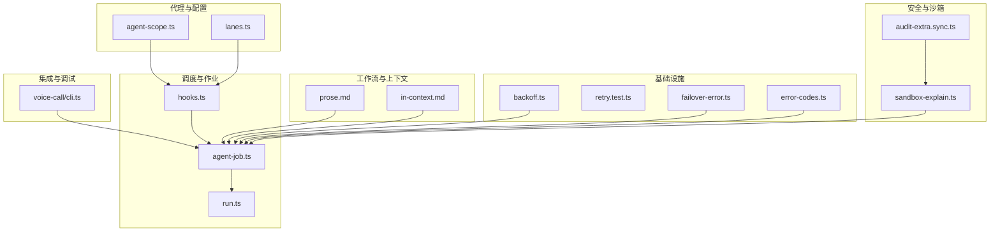
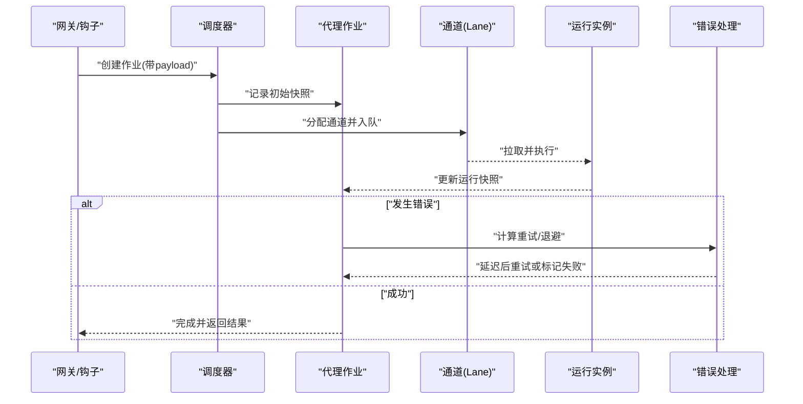
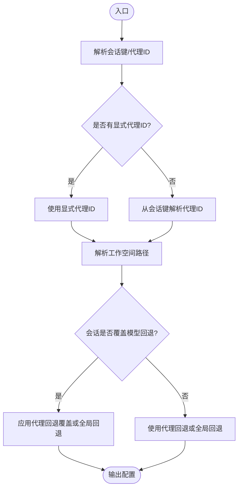
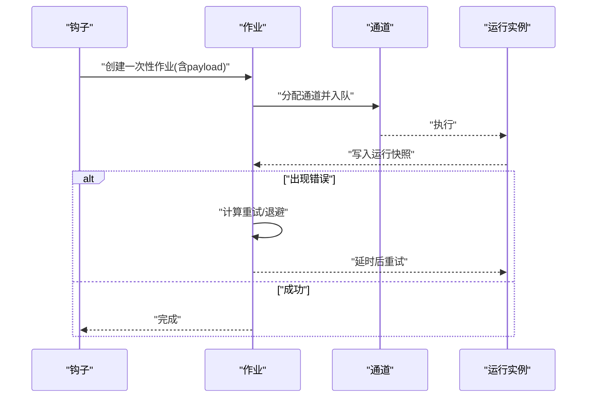
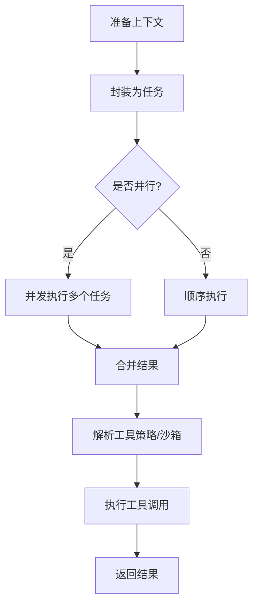
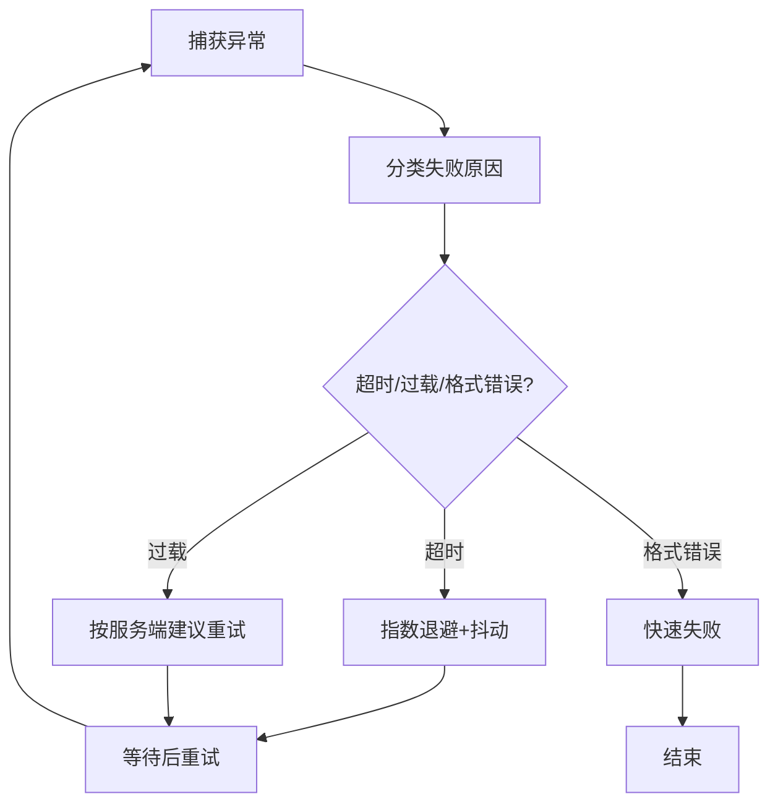
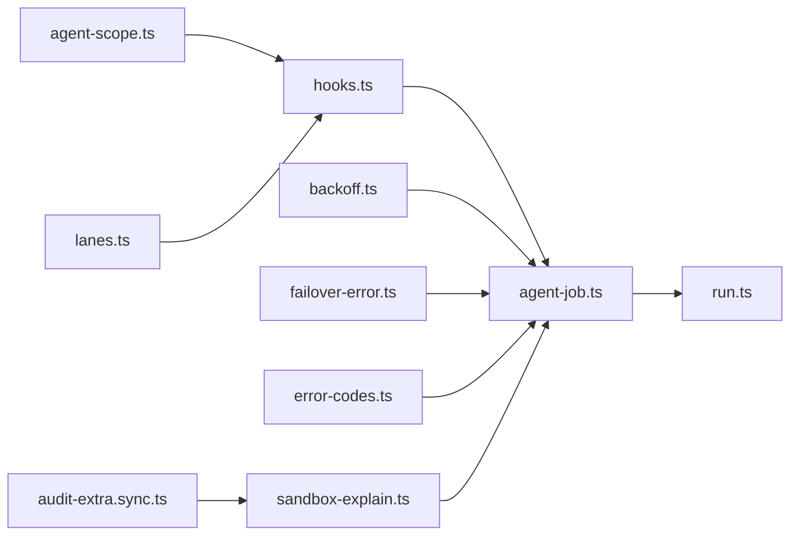

# 代理工作流

<cite>
**本文引用的文件**
- [agent-scope.ts](file://src/agents/agent-scope.ts)
- [lanes.ts](file://src/agents/lanes.ts)
- [hooks.ts](file://src/gateway/server/hooks.ts)
- [agent-job.ts](file://src/gateway/server-methods/agent-job.ts)
- [backoff.ts](file://src/infra/backoff.ts)
- [retry.test.ts](file://src/infra/retry.test.ts)
- [failover-error.ts](file://src/agents/failover-error.ts)
- [error-codes.ts](file://src/gateway/protocol/schema/error-codes.ts)
- [fetch.ts](file://src/telegram/fetch.ts)
- [prose.md](file://extensions/open-prose/skills/prose/prose.md)
- [in-context.md](file://extensions/open-prose/skills/prose/state/in-context.md)
- [run.ts](file://src/cron/isolated-agent/run.ts)
- [agent.ts](file://src/gateway/server-methods/agent.ts)
- [agent.ts](file://src/gateway/protocol/schema/agent.ts)
- [agent.ts](file://src/browser/routes/agent.ts)
- [agent.ts](file://src/commands/agent.ts)
- [openclaw-tools.agents.test.ts](file://src/agents/openclaw-tools.agents.test.ts)
- [sandbox-explain.ts](file://src/commands/sandbox-explain.ts)
- [audit-extra.sync.ts](file://src/security/audit-extra.sync.ts)
- [cli.ts](file://extensions/voice-call/src/cli.ts)
</cite>

## 目录
1. [引言](#引言)
2. [项目结构](#项目结构)
3. [核心组件](#核心组件)
4. [架构总览](#架构总览)
5. [详细组件分析](#详细组件分析)
6. [依赖关系分析](#依赖关系分析)
7. [性能考量](#性能考量)
8. [故障排查指南](#故障排查指南)
9. [结论](#结论)
10. [附录](#附录)

## 引言
本技术文档围绕“代理工作流”展开，系统性阐述代理循环的执行机制、工作流状态管理与任务调度策略；深入解析代理作用域管理、上下文传递与工具调用链路；解释代理超时处理、错误重试与异常恢复机制；并提供工作流配置选项、性能监控与调试技巧，以及自定义工作流开发指南与集成最佳实践。

## 项目结构
本仓库采用多模块与多语言混合架构，代理工作流相关的关键代码分布在以下区域：
- 代理作用域与配置：src/agents/agent-scope.ts 等
- 工作流调度与钩子：src/gateway/server/hooks.ts、src/gateway/server-methods/agent-job.ts
- 超时与重试基础设施：src/infra/backoff.ts、src/infra/retry.test.ts、src/agents/failover-error.ts
- 错误码与协议：src/gateway/protocol/schema/error-codes.ts
- 工作流执行范式与上下文：extensions/open-prose/skills/prose/prose.md、extensions/open-prose/skills/prose/state/in-context.md
- 子代理与通道：src/agents/lanes.ts、src/commands/sandbox-explain.ts、src/security/audit-extra.sync.ts
- 集成示例与调试：extensions/voice-call/src/cli.ts

图表来源
- [agent-scope.ts:1-339](file://src/agents/agent-scope.ts#L1-L339)
- [lanes.ts:1-14](file://src/agents/lanes.ts#L1-L14)
- [hooks.ts:36-66](file://src/gateway/server/hooks.ts#L36-L66)
- [agent-job.ts:187-210](file://src/gateway/server-methods/agent-job.ts#L187-L210)
- [backoff.ts:1-28](file://src/infra/backoff.ts#L1-L28)
- [retry.test.ts:1-42](file://src/infra/retry.test.ts#L1-L42)
- [failover-error.ts:151-209](file://src/agents/failover-error.ts#L151-L209)
- [error-codes.ts:1-23](file://src/gateway/protocol/schema/error-codes.ts#L1-L23)
- [prose.md:1155-1217](file://extensions/open-prose/skills/prose/prose.md#L1155-L1217)
- [in-context.md:152-207](file://extensions/open-prose/skills/prose/state/in-context.md#L152-L207)
- [run.ts](file://src/cron/isolated-agent/run.ts)
- [sandbox-explain.ts:144-182](file://src/commands/sandbox-explain.ts#L144-L182)
- [audit-extra.sync.ts:466-526](file://src/security/audit-extra.sync.ts#L466-L526)
- [cli.ts:44-86](file://extensions/voice-call/src/cli.ts#L44-L86)

章节来源
- [agent-scope.ts:1-339](file://src/agents/agent-scope.ts#L1-L339)
- [hooks.ts:36-66](file://src/gateway/server/hooks.ts#L36-L66)
- [agent-job.ts:187-210](file://src/gateway/server-methods/agent-job.ts#L187-L210)
- [backoff.ts:1-28](file://src/infra/backoff.ts#L1-L28)
- [retry.test.ts:1-42](file://src/infra/retry.test.ts#L1-L42)
- [failover-error.ts:151-209](file://src/agents/failover-error.ts#L151-L209)
- [error-codes.ts:1-23](file://src/gateway/protocol/schema/error-codes.ts#L1-L23)
- [prose.md:1155-1217](file://extensions/open-prose/skills/prose/prose.md#L1155-L1217)
- [in-context.md:152-207](file://extensions/open-prose/skills/prose/state/in-context.md#L152-L207)
- [run.ts](file://src/cron/isolated-agent/run.ts)
- [sandbox-explain.ts:144-182](file://src/commands/sandbox-explain.ts#L144-L182)
- [audit-extra.sync.ts:466-526](file://src/security/audit-extra.sync.ts#L466-L526)
- [cli.ts:44-86](file://extensions/voice-call/src/cli.ts#L44-L86)

## 核心组件
- 代理作用域与配置解析：负责代理标识、默认代理选择、工作空间与模型回退策略解析等。
- 调度与作业：通过钩子触发代理作业，使用调度器将作业放入指定通道（lane），并管理运行快照与错误重试。
- 基础设施：指数退避、重试策略与失败原因分类，用于超时与网络波动场景的弹性处理。
- 协议与错误码：统一错误码与可重试语义，便于上层感知与恢复。
- 工作流范式与上下文：以“会话任务”为中心，支持并行、分支、循环、异常处理等控制流，并强调上下文序列化与作用域绑定。
- 安全与沙箱：工具策略与沙箱模式解析，保障运行风险可控。

章节来源
- [agent-scope.ts:118-145](file://src/agents/agent-scope.ts#L118-L145)
- [agent-scope.ts:256-272](file://src/agents/agent-scope.ts#L256-L272)
- [agent-scope.ts:233-254](file://src/agents/agent-scope.ts#L233-L254)
- [hooks.ts:36-66](file://src/gateway/server/hooks.ts#L36-L66)
- [lanes.ts:6-14](file://src/agents/lanes.ts#L6-L14)
- [agent-job.ts:187-210](file://src/gateway/server-methods/agent-job.ts#L187-L210)
- [backoff.ts:10-14](file://src/infra/backoff.ts#L10-L14)
- [failover-error.ts:151-209](file://src/agents/failover-error.ts#L151-L209)
- [error-codes.ts:3-9](file://src/gateway/protocol/schema/error-codes.ts#L3-L9)
- [prose.md:1155-1217](file://extensions/open-prose/skills/prose/prose.md#L1155-L1217)
- [in-context.md:152-207](file://extensions/open-prose/skills/prose/state/in-context.md#L152-L207)
- [sandbox-explain.ts:144-182](file://src/commands/sandbox-explain.ts#L144-L182)
- [audit-extra.sync.ts:466-526](file://src/security/audit-extra.sync.ts#L466-L526)

## 架构总览
下图展示从“钩子触发”到“代理作业完成”的端到端流程，包括状态快照、错误重试与通道调度。

图表来源
- [hooks.ts:36-66](file://src/gateway/server/hooks.ts#L36-L66)
- [agent-job.ts:187-210](file://src/gateway/server-methods/agent-job.ts#L187-L210)
- [lanes.ts:6-14](file://src/agents/lanes.ts#L6-L14)
- [run.ts](file://src/cron/isolated-agent/run.ts)

章节来源
- [hooks.ts:36-66](file://src/gateway/server/hooks.ts#L36-L66)
- [agent-job.ts:187-210](file://src/gateway/server-methods/agent-job.ts#L187-L210)
- [lanes.ts:6-14](file://src/agents/lanes.ts#L6-L14)
- [run.ts](file://src/cron/isolated-agent/run.ts)

## 详细组件分析

### 代理作用域与配置解析
- 代理标识与默认代理：支持从会话键解析代理ID，若未显式指定则回退至默认代理。
- 工作空间解析：优先使用代理配置的工作空间，否则按默认规则生成；路径规范化避免非法字符。
- 模型回退策略：支持代理级覆盖与全局回退列表，结合会话是否覆盖决定最终回退集。
- 代理目录与ID映射：解析代理根目录与工作空间归属，便于权限与隔离控制。

图表来源
- [agent-scope.ts:86-111](file://src/agents/agent-scope.ts#L86-L111)
- [agent-scope.ts:256-272](file://src/agents/agent-scope.ts#L256-L272)
- [agent-scope.ts:233-254](file://src/agents/agent-scope.ts#L233-L254)

章节来源
- [agent-scope.ts:86-111](file://src/agents/agent-scope.ts#L86-L111)
- [agent-scope.ts:256-272](file://src/agents/agent-scope.ts#L256-L272)
- [agent-scope.ts:233-254](file://src/agents/agent-scope.ts#L233-L254)

### 工作流状态管理与任务调度
- 钩子触发：在收到外部事件时，构造一次性作业并立即调度，确保“即刻唤醒”。
- 通道调度：嵌套代理不应继承“定时任务”通道，避免资源抢占；允许显式指定通道。
- 运行快照与错误重试：对运行中的代理进行快照缓存，错误时安排延时重试，避免瞬时抖动导致频繁失败。
- 作业负载：payload 包含消息、模型、思考模式、超时、交付方式、通道与目标等，保证上下文完整。

图表来源
- [hooks.ts:36-66](file://src/gateway/server/hooks.ts#L36-L66)
- [lanes.ts:6-14](file://src/agents/lanes.ts#L6-L14)
- [agent-job.ts:187-210](file://src/gateway/server-methods/agent-job.ts#L187-L210)

章节来源
- [hooks.ts:36-66](file://src/gateway/server/hooks.ts#L36-L66)
- [lanes.ts:6-14](file://src/agents/lanes.ts#L6-L14)
- [agent-job.ts:187-210](file://src/gateway/server-methods/agent-job.ts#L187-L210)

### 上下文传递与工具调用链路
- 会话任务范式：工作流以“任务”为单位，支持并行、分支、循环与异常处理，确保复杂流程可组合。
- 上下文序列化：建议明确前缀、保留相关性、必要时摘要，保持语义清晰。
- 工具策略与沙箱：根据代理与全局配置解析工具策略与沙箱模式，限制高危工具（如进程/文件系统）暴露范围。
- 审计与风险识别：收集潜在高风险暴露上下文，辅助安全审计与决策。

图表来源
- [prose.md:1183-1217](file://extensions/open-prose/skills/prose/prose.md#L1183-L1217)
- [sandbox-explain.ts:144-182](file://src/commands/sandbox-explain.ts#L144-L182)
- [audit-extra.sync.ts:466-526](file://src/security/audit-extra.sync.ts#L466-L526)

章节来源
- [prose.md:1155-1217](file://extensions/open-prose/skills/prose/prose.md#L1155-L1217)
- [prose.md:1183-1217](file://extensions/open-prose/skills/prose/prose.md#L1183-L1217)
- [sandbox-explain.ts:144-182](file://src/commands/sandbox-explain.ts#L144-L182)
- [audit-extra.sync.ts:466-526](file://src/security/audit-extra.sync.ts#L466-L526)

### 代理超时处理、错误重试与异常恢复
- 失败原因分类：基于HTTP状态、错误代码与消息文本，归类为超时、过载、格式错误等。
- 指数退避与抖动：提供退避计算与可中断睡眠，避免雪崩效应。
- 重试策略验证：测试用例覆盖首次成功、中间失败重试成功等场景。
- IPv4 回退策略：针对特定网络错误条件，启用IPv4回退以提升连通性。
- 错误码与可重试语义：统一错误码，支持可重试与重试间隔提示。

图表来源
- [failover-error.ts:151-209](file://src/agents/failover-error.ts#L151-L209)
- [backoff.ts:10-14](file://src/infra/backoff.ts#L10-L14)
- [retry.test.ts:1-42](file://src/infra/retry.test.ts#L1-42)
- [fetch.ts:317-329](file://src/telegram/fetch.ts#L317-L329)
- [error-codes.ts:3-9](file://src/gateway/protocol/schema/error-codes.ts#L3-L9)

章节来源
- [failover-error.ts:151-209](file://src/agents/failover-error.ts#L151-L209)
- [backoff.ts:10-14](file://src/infra/backoff.ts#L10-L14)
- [retry.test.ts:1-42](file://src/infra/retry.test.ts#L1-42)
- [fetch.ts:317-329](file://src/telegram/fetch.ts#L317-L329)
- [error-codes.ts:3-9](file://src/gateway/protocol/schema/error-codes.ts#L3-L9)

### 子代理与通道管理
- 嵌套代理通道：嵌套代理不继承“定时任务”通道，防止资源竞争。
- 子代理白名单：允许在主代理中声明允许的子代理集合，实现受控协作。
- 会话隔离：通过会话键与通道策略，实现不同会话的隔离执行。

章节来源
- [lanes.ts:6-14](file://src/agents/lanes.ts#L6-L14)
- [openclaw-tools.agents.test.ts:64-101](file://src/agents/openclaw-tools.agents.test.ts#L64-L101)

### 工作流配置选项与最佳实践
- 代理配置要点：名称、工作空间、模型主备、技能过滤、心跳、身份、群聊、子代理、沙箱与工具策略。
- 沙箱与工具策略：全局与代理级策略叠加，结合通道与渠道控制“提权”范围。
- 性能与调试：利用统计指标（如分位数）评估耗时，结合日志与错误码定位问题。

章节来源
- [agent-scope.ts:118-145](file://src/agents/agent-scope.ts#L118-L145)
- [sandbox-explain.ts:144-182](file://src/commands/sandbox-explain.ts#L144-L182)
- [cli.ts:53-82](file://extensions/voice-call/src/cli.ts#L53-L82)

## 依赖关系分析
- 低耦合：代理作用域解析独立于调度器；调度器仅依赖通道与作业接口。
- 可观测性：作业快照与错误重试相互配合，形成闭环。
- 安全边界：工具策略与沙箱配置贯穿上下文解析与执行阶段。

图表来源
- [agent-scope.ts:118-145](file://src/agents/agent-scope.ts#L118-L145)
- [lanes.ts:6-14](file://src/agents/lanes.ts#L6-L14)
- [hooks.ts:36-66](file://src/gateway/server/hooks.ts#L36-L66)
- [agent-job.ts:187-210](file://src/gateway/server-methods/agent-job.ts#L187-L210)
- [backoff.ts:10-14](file://src/infra/backoff.ts#L10-L14)
- [failover-error.ts:151-209](file://src/agents/failover-error.ts#L151-L209)
- [error-codes.ts:3-9](file://src/gateway/protocol/schema/error-codes.ts#L3-L9)
- [sandbox-explain.ts:144-182](file://src/commands/sandbox-explain.ts#L144-L182)
- [audit-extra.sync.ts:466-526](file://src/security/audit-extra.sync.ts#L466-L526)
- [run.ts](file://src/cron/isolated-agent/run.ts)

章节来源
- [agent-scope.ts:118-145](file://src/agents/agent-scope.ts#L118-L145)
- [lanes.ts:6-14](file://src/agents/lanes.ts#L6-L14)
- [hooks.ts:36-66](file://src/gateway/server/hooks.ts#L36-L66)
- [agent-job.ts:187-210](file://src/gateway/server-methods/agent-job.ts#L187-L210)
- [backoff.ts:10-14](file://src/infra/backoff.ts#L10-L14)
- [failover-error.ts:151-209](file://src/agents/failover-error.ts#L151-L209)
- [error-codes.ts:3-9](file://src/gateway/protocol/schema/error-codes.ts#L3-L9)
- [sandbox-explain.ts:144-182](file://src/commands/sandbox-explain.ts#L144-L182)
- [audit-extra.sync.ts:466-526](file://src/security/audit-extra.sync.ts#L466-L526)
- [run.ts](file://src/cron/isolated-agent/run.ts)

## 性能考量
- 指数退避与抖动：降低并发重试引发的级联失败概率，适合网络抖动与上游限流场景。
- 并行执行：在单次响应中发起多个任务，充分利用模型与工具能力，但需注意资源配额。
- 统计指标：使用分位数（如P50/P95）评估端到端耗时，辅助容量规划与阈值设定。
- 会话隔离与通道：避免“定时任务”通道被占用，减少资源争用。

章节来源
- [backoff.ts:10-14](file://src/infra/backoff.ts#L10-L14)
- [prose.md:1196-1205](file://extensions/open-prose/skills/prose/prose.md#L1196-L1205)
- [cli.ts:53-82](file://extensions/voice-call/src/cli.ts#L53-L82)
- [lanes.ts:6-14](file://src/agents/lanes.ts#L6-L14)

## 故障排查指南
- 错误码与可重试：优先检查错误码与重试间隔提示，区分临时性与永久性错误。
- 失败原因分类：依据HTTP状态、错误代码与消息文本判断超时、过载或格式错误。
- 重试策略验证：参考测试用例确认重试行为是否符合预期。
- IPv4 回退：在网络错误满足条件时启用，提高连接成功率。
- 沙箱与工具策略：核对代理与全局策略，确保工具暴露范围符合预期。

章节来源
- [error-codes.ts:3-9](file://src/gateway/protocol/schema/error-codes.ts#L3-L9)
- [failover-error.ts:151-209](file://src/agents/failover-error.ts#L151-L209)
- [retry.test.ts:1-42](file://src/infra/retry.test.ts#L1-42)
- [fetch.ts:317-329](file://src/telegram/fetch.ts#L317-L329)
- [sandbox-explain.ts:144-182](file://src/commands/sandbox-explain.ts#L144-L182)

## 结论
本工作流以“会话任务”为核心，结合通道调度、作业快照与指数退避重试，形成稳定可靠的代理执行框架。通过代理作用域解析、工具策略与沙箱控制，兼顾灵活性与安全性。建议在生产环境中启用合理的超时与重试策略，配合统计指标与错误码监控，持续优化性能与稳定性。

## 附录
- 自定义工作流开发指南
  - 使用“任务”封装业务步骤，支持并行与分支。
  - 明确上下文前缀与摘要，保持可读性与可维护性。
  - 在代理配置中设置模型回退与工作空间，确保跨环境一致性。
- 集成最佳实践
  - 将外部事件通过钩子转换为一次性作业，立即唤醒代理。
  - 对高危工具启用沙箱与策略限制，必要时仅在受控通道执行。
  - 利用错误码与重试间隔提示，实现优雅降级与自动恢复。