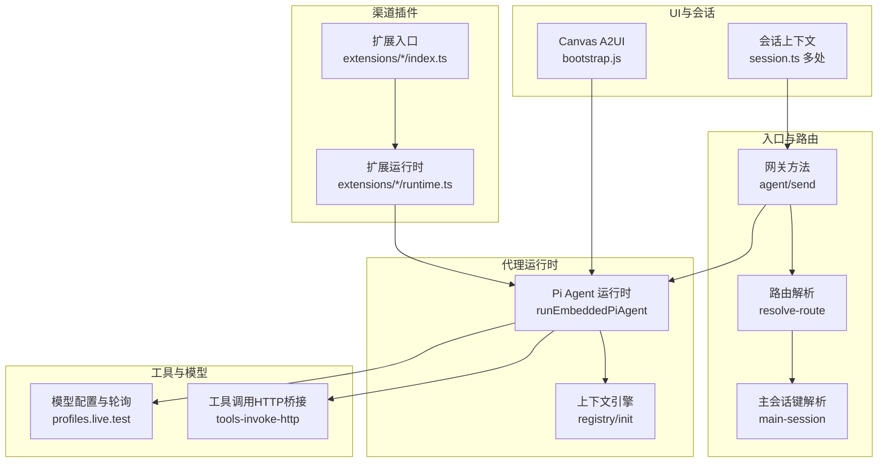
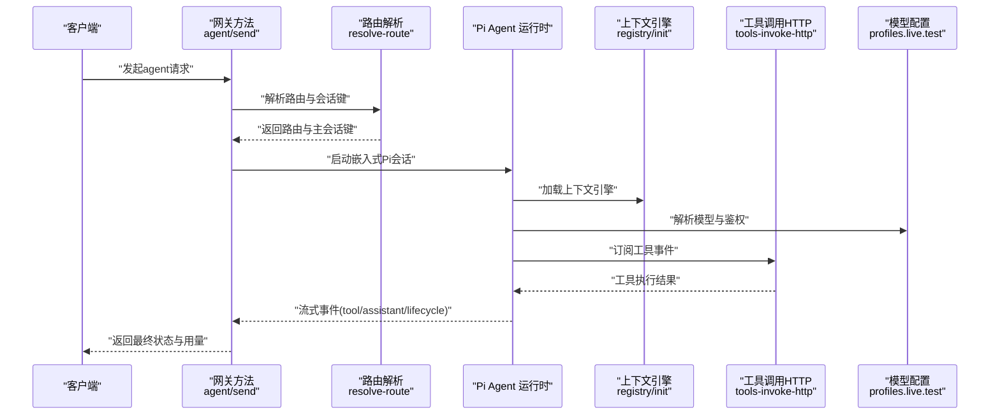
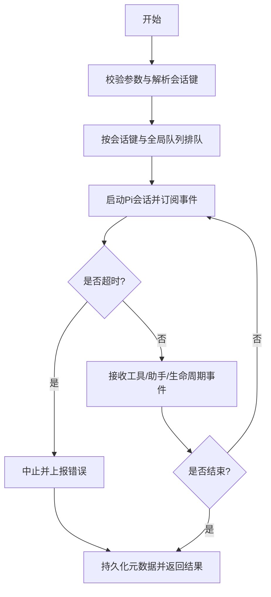
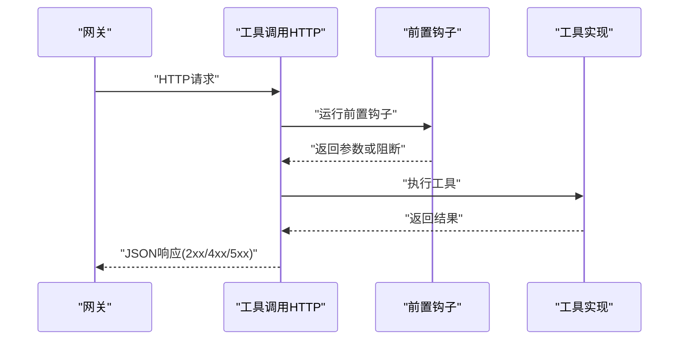
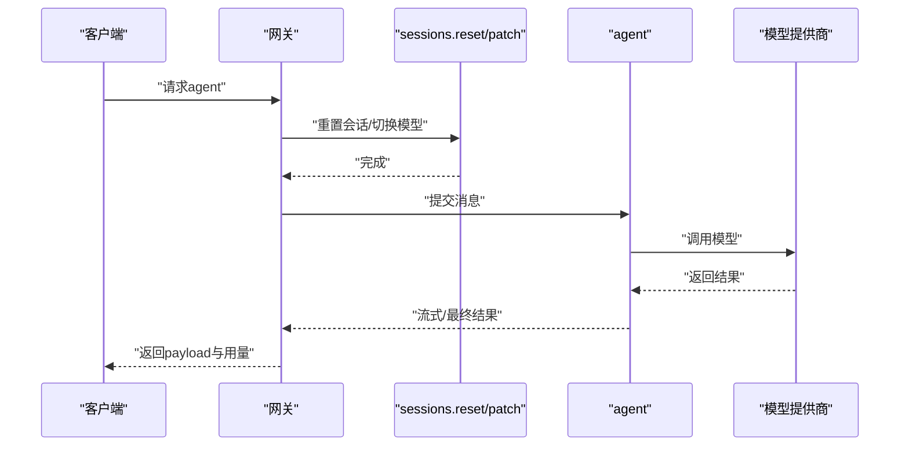
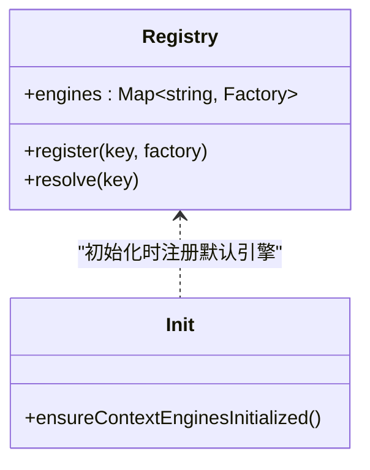
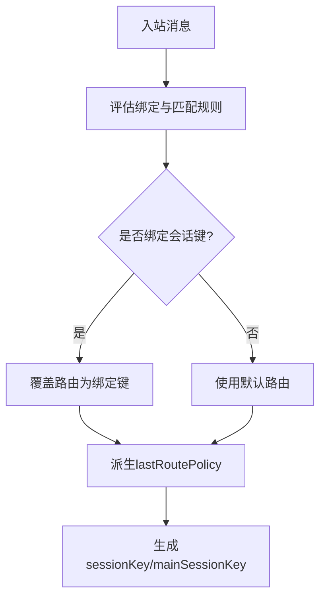
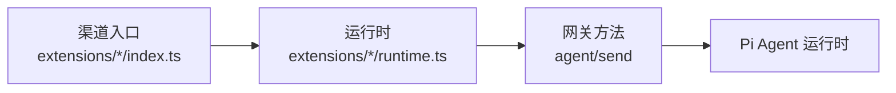
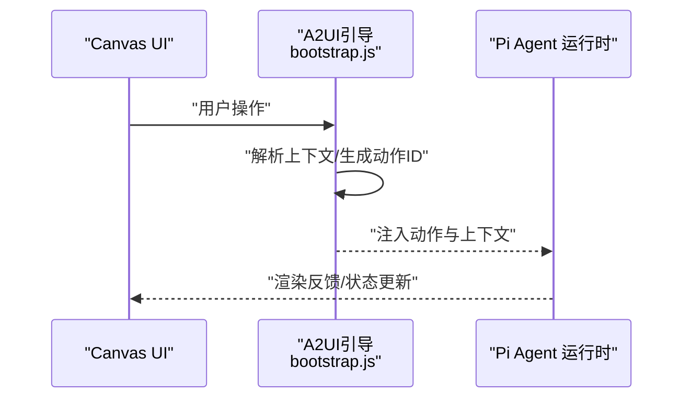
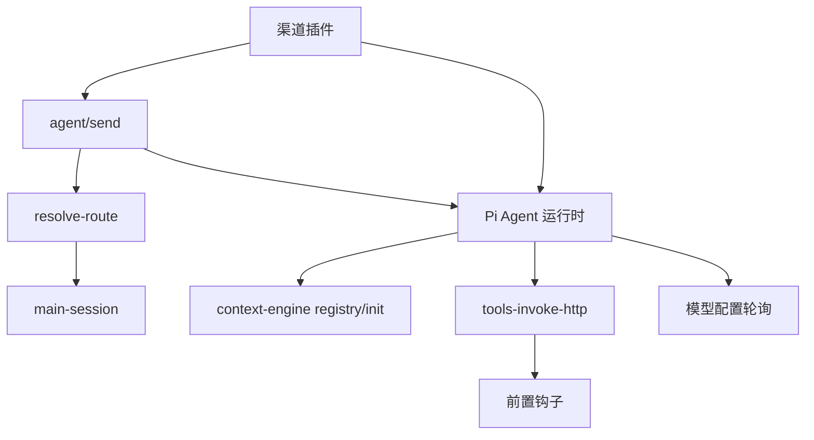

# 代理系统

<cite>
**本文引用的文件**
- [agent-loop.md](file://docs/concepts/agent-loop.md)
- [pi.md](file://docs/zh-CN/pi.md)
- [gateway-models.profiles.live.test.ts](file://src/gateway/gateway-models.profiles.live.test.ts)
- [tools-invoke-http.ts](file://src/gateway/tools-invoke-http.ts)
- [main-session.ts](file://src/config/sessions/main-session.ts)
- [resolve-route.ts](file://src/routing/resolve-route.ts)
- [resolve-route.test.ts](file://src/routing/resolve-route.test.ts)
- [route-resolution.ts](file://src/discord/monitor/route-resolution.ts)
- [send.ts](file://src/gateway/server-methods/send.ts)
- [registry.ts](file://src/context-engine/registry.ts)
- [init.ts](file://src/context-engine/init.ts)
- [runtime.ts](file://extensions/discord/src/runtime.ts)
- [index.ts](file://extensions/discord/index.ts)
- [agent.ts](file://src/gateway/server-methods/agent.ts)
- [agent.ts](file://src/commands/agent.ts)
- [agent.ts](file://src/browser/routes/agent.ts)
- [session.ts](file://src/commands/agent/session.ts)
- [session.ts](file://src/acp/session.ts)
- [session.ts](file://src/auto-reply/reply/session.ts)
- [session.ts](file://src/channels/session.ts)
- [session.ts](file://src/cron/isolated-agent/session.ts)
- [session.ts](file://src/web/session.ts)
- [session.ts](file://src/wizard/session.ts)
- [bootstrap.js](file://apps/shared/OpenClawKit/Tools/CanvasA2UI/bootstrap.js)
- [CanvasWindowSmokeTests.swift](file://apps/macos/Tests/OpenClawIPCTests/CanvasWindowSmokeTests.swift)
</cite>

## 目录
1. [简介](#简介)
2. [项目结构](#项目结构)
3. [核心组件](#核心组件)
4. [架构总览](#架构总览)
5. [详细组件分析](#详细组件分析)
6. [依赖关系分析](#依赖关系分析)
7. [性能考量](#性能考量)
8. [故障排查指南](#故障排查指南)
9. [结论](#结论)
10. [附录](#附录)

## 简介
本文件面向OpenClaw代理系统的开发者与运维人员，系统性阐述Pi Agent运行时的架构设计、代理工作流程与会话管理机制；深入解析代理循环的执行逻辑、工具调用机制、模型集成方式与上下文窗口管理；并覆盖多代理路由、会话隔离、并发处理与状态持久化的高级能力。同时提供代理配置选项、性能优化建议、调试技巧、生命周期管理、错误处理策略以及扩展开发指南，帮助读者快速定制代理行为并集成新模型。

## 项目结构
OpenClaw采用模块化分层组织，核心围绕“路由—会话—代理—工具—模型”链路展开。关键目录与职责概览：
- docs：概念与参考文档，包括代理循环、会话、多代理等主题
- src/gateway：RPC/HTTP入口、方法实现（agent、send）、工具调用桥接
- src/routing：多通道路由解析与会话键生成
- src/config/sessions：主会话键解析与默认策略
- src/context-engine：上下文引擎注册与初始化
- extensions/*：各渠道插件（如Discord）的运行时与入口
- apps/shared/OpenClawKit：跨平台UI与A2UI桥接工具
- skills、extensions、packages：技能与扩展生态

图表来源
- [agent.ts:1-200](file://src/gateway/server-methods/agent.ts#L1-L200)
- [send.ts:200-260](file://src/gateway/server-methods/send.ts#L200-L260)
- [resolve-route.ts:658-692](file://src/routing/resolve-route.ts#L658-L692)
- [main-session.ts:1-38](file://src/config/sessions/main-session.ts#L1-L38)
- [registry.ts:1-33](file://src/context-engine/registry.ts#L1-L33)
- [init.ts:1-23](file://src/context-engine/init.ts#L1-L23)
- [tools-invoke-http.ts:315-360](file://src/gateway/tools-invoke-http.ts#L315-L360)
- [gateway-models.profiles.live.test.ts:769-810](file://src/gateway/gateway-models.profiles.live.test.ts#L769-L810)
- [runtime.ts:1-200](file://extensions/discord/src/runtime.ts#L1-L200)
- [index.ts:1-200](file://extensions/discord/index.ts#L1-L200)
- [bootstrap.js:426-460](file://apps/shared/OpenClawKit/Tools/CanvasA2UI/bootstrap.js#L426-L460)
- [session.ts:1-200](file://src/commands/agent/session.ts#L1-L200)

章节来源
- [agent-loop.md:23-50](file://docs/concepts/agent-loop.md#L23-L50)
- [pi.md:531-539](file://docs/zh-CN/pi.md#L531-L539)

## 核心组件
- 代理循环与运行时：通过agent RPC触发，内部调用Pi Agent运行时，串行化会话与全局队列，订阅事件并流式输出工具/助手/生命周期事件，支持超时中止与最终结果聚合。
- 路由与会话键：按渠道、账号、DM作用域生成稳定的会话键，支持主会话键与最后路由策略，确保消息回溯与会话隔离。
- 工具调用：统一HTTP桥接，前置钩子校验、参数合并、错误分级返回，保障安全与可观测性。
- 模型集成：通过配置与测试用例验证多提供商轮询、会话重置与模型切换，避免跨提供商转录不兼容。
- 上下文引擎：注册表与初始化确保默认引擎可用，并允许插件动态注册新引擎。
- UI与A2UI：Canvas A2UI桥接用户动作到代理，支持会话上下文与动作记录。

章节来源
- [agent-loop.md:23-50](file://docs/concepts/agent-loop.md#L23-L50)
- [tools-invoke-http.ts:315-360](file://src/gateway/tools-invoke-http.ts#L315-L360)
- [gateway-models.profiles.live.test.ts:769-810](file://src/gateway/gateway-models.profiles.live.test.ts#L769-L810)
- [registry.ts:1-33](file://src/context-engine/registry.ts#L1-L33)
- [init.ts:1-23](file://src/context-engine/init.ts#L1-L23)
- [bootstrap.js:426-460](file://apps/shared/OpenClawKit/Tools/CanvasA2UI/bootstrap.js#L426-L460)

## 架构总览
下图展示从入口到运行时的关键交互：RPC/HTTP请求进入后，根据路由与会话键构建上下文，随后进入Pi Agent运行时，期间通过上下文引擎与工具桥接访问外部能力，最终以流式事件返回。

图表来源
- [agent.ts:1-200](file://src/gateway/server-methods/agent.ts#L1-L200)
- [send.ts:218-254](file://src/gateway/server-methods/send.ts#L218-L254)
- [resolve-route.ts:658-692](file://src/routing/resolve-route.ts#L658-L692)
- [main-session.ts:1-38](file://src/config/sessions/main-session.ts#L1-L38)
- [registry.ts:1-33](file://src/context-engine/registry.ts#L1-L33)
- [init.ts:1-23](file://src/context-engine/init.ts#L1-L23)
- [tools-invoke-http.ts:315-360](file://src/gateway/tools-invoke-http.ts#L315-L360)
- [gateway-models.profiles.live.test.ts:769-810](file://src/gateway/gateway-models.profiles.live.test.ts#L769-L810)

## 详细组件分析

### 代理循环与会话管理
- 循环执行逻辑：agent RPC立即返回runId与受理时间；随后在Pi运行时内串行化执行，按会话键与可选全局队列进行序列化，订阅事件并流式输出；超时则中止并上报。
- 会话隔离：路由解析支持按DM作用域、渠道与账号生成唯一会话键；主会话键用于全局或默认场景；最后路由策略决定回溯使用主会话还是当前会话。
- 并发与队列：每会话与全局队列串行化，避免工具/会话竞态，保证历史一致性；消息通道可选择收集/引导/后续模式接入该队列体系。

图表来源
- [agent-loop.md:23-50](file://docs/concepts/agent-loop.md#L23-L50)
- [resolve-route.ts:658-692](file://src/routing/resolve-route.ts#L658-L692)
- [resolve-route.test.ts:36-79](file://src/routing/resolve-route.test.ts#L36-L79)

章节来源
- [agent-loop.md:23-50](file://docs/concepts/agent-loop.md#L23-L50)
- [resolve-route.ts:658-692](file://src/routing/resolve-route.ts#L658-L692)
- [resolve-route.test.ts:36-79](file://src/routing/resolve-route.test.ts#L36-L79)

### 工具调用机制
- 统一入口：通过HTTP桥接工具调用，先执行前置钩子（如权限与输入校验），再调用工具执行函数，捕获错误并分级返回。
- 安全与可观测：阻断策略、错误码映射、日志告警，便于审计与排障。
- 扩展点：工具可实现execute方法，配合参数schema与action合并，形成一致的调用协议。

图表来源
- [tools-invoke-http.ts:315-360](file://src/gateway/tools-invoke-http.ts#L315-L360)

章节来源
- [tools-invoke-http.ts:315-360](file://src/gateway/tools-invoke-http.ts#L315-L360)

### 模型集成与提供商轮询
- 会话重置与模型切换：在不同提供商间轮询时，先重置会话并覆盖模型，避免跨提供商转录不兼容（如OpenAI函数调用需推理重放）。
- 配置驱动：通过环境变量与配置项控制API密钥轮换与超时探测，确保稳定性与可恢复性。

图表来源
- [gateway-models.profiles.live.test.ts:769-810](file://src/gateway/gateway-models.profiles.live.test.ts#L769-L810)

章节来源
- [gateway-models.profiles.live.test.ts:769-810](file://src/gateway/gateway-models.profiles.live.test.ts#L769-L810)

### 上下文引擎与上下文窗口管理
- 注册与初始化：提供进程级单例注册表，确保默认引擎可用；插件可在加载时注册新引擎。
- 引擎工厂：支持异步创建，满足数据库连接等需求；默认“legacy”槽位作为安全回退。

图表来源
- [registry.ts:1-33](file://src/context-engine/registry.ts#L1-L33)
- [init.ts:1-23](file://src/context-engine/init.ts#L1-L23)

章节来源
- [registry.ts:1-33](file://src/context-engine/registry.ts#L1-L33)
- [init.ts:1-23](file://src/context-engine/init.ts#L1-L23)

### 多代理路由与会话隔离
- 路由解析：根据渠道、账号、DM作用域与绑定会话键生成稳定路由；支持缓存与最后路由策略（main/session）。
- 出站会话：当未显式提供会话键时，基于出站目标推导路由并确保会话条目存在。
- Discord特例：支持绑定会话键覆盖默认路由，动态派生lastRoutePolicy。

图表来源
- [resolve-route.ts:658-692](file://src/routing/resolve-route.ts#L658-L692)
- [resolve-route.test.ts:36-79](file://src/routing/resolve-route.test.ts#L36-L79)
- [route-resolution.ts:80-100](file://src/discord/monitor/route-resolution.ts#L80-L100)
- [send.ts:218-254](file://src/gateway/server-methods/send.ts#L218-L254)

章节来源
- [resolve-route.ts:658-692](file://src/routing/resolve-route.ts#L658-L692)
- [resolve-route.test.ts:36-79](file://src/routing/resolve-route.test.ts#L36-L79)
- [route-resolution.ts:80-100](file://src/discord/monitor/route-resolution.ts#L80-L100)
- [send.ts:218-254](file://src/gateway/server-methods/send.ts#L218-L254)

### 渠道插件与代理运行时
- 插件入口：每个渠道在index.ts中声明入口与清单；在runtime.ts中实现具体运行时逻辑（如事件监听、消息转发）。
- 与Pi集成：插件运行时通过网关方法与Pi Agent运行时协作，实现消息编排与工具调用。

图表来源
- [index.ts:1-200](file://extensions/discord/index.ts#L1-L200)
- [runtime.ts:1-200](file://extensions/discord/src/runtime.ts#L1-L200)
- [agent.ts:1-200](file://src/gateway/server-methods/agent.ts#L1-L200)

章节来源
- [index.ts:1-200](file://extensions/discord/index.ts#L1-L200)
- [runtime.ts:1-200](file://extensions/discord/src/runtime.ts#L1-L200)
- [agent.ts:1-200](file://src/gateway/server-methods/agent.ts#L1-L200)

### UI与A2UI桥接
- Canvas A2UI：将用户动作封装为标准结构，写入全局状态并触发更新；支持上下文注入与动作阶段标记。
- 平台测试：macOS端对Canvas窗口控制器进行烟雾测试，覆盖显示、关闭与隐藏流程。

图表来源
- [bootstrap.js:426-460](file://apps/shared/OpenClawKit/Tools/CanvasA2UI/bootstrap.js#L426-L460)
- [CanvasWindowSmokeTests.swift:33-49](file://apps/macos/Tests/OpenClawIPCTests/CanvasWindowSmokeTests.swift#L33-L49)

章节来源
- [bootstrap.js:426-460](file://apps/shared/OpenClawKit/Tools/CanvasA2UI/bootstrap.js#L426-L460)
- [CanvasWindowSmokeTests.swift:33-49](file://apps/macos/Tests/OpenClawIPCTests/CanvasWindowSmokeTests.swift#L33-L49)

## 依赖关系分析
- 入口依赖：agent/send依赖路由解析与主会话键解析；路由解析依赖会话键构建与缓存策略。
- 运行时依赖：Pi Agent运行时依赖上下文引擎与工具调用HTTP桥接；工具调用依赖前置钩子与错误处理。
- 模型依赖：模型配置与轮询依赖会话重置与模型切换；提供商差异通过重置与覆盖规避不兼容。
- 插件依赖：渠道插件通过入口与运行时与网关方法耦合；运行时与Pi运行时协作。

图表来源
- [agent.ts:1-200](file://src/gateway/server-methods/agent.ts#L1-L200)
- [send.ts:218-254](file://src/gateway/server-methods/send.ts#L218-L254)
- [resolve-route.ts:658-692](file://src/routing/resolve-route.ts#L658-L692)
- [main-session.ts:1-38](file://src/config/sessions/main-session.ts#L1-L38)
- [registry.ts:1-33](file://src/context-engine/registry.ts#L1-L33)
- [init.ts:1-23](file://src/context-engine/init.ts#L1-L23)
- [tools-invoke-http.ts:315-360](file://src/gateway/tools-invoke-http.ts#L315-L360)
- [gateway-models.profiles.live.test.ts:769-810](file://src/gateway/gateway-models.profiles.live.test.ts#L769-L810)
- [index.ts:1-200](file://extensions/discord/index.ts#L1-L200)

章节来源
- [agent.ts:1-200](file://src/gateway/server-methods/agent.ts#L1-L200)
- [send.ts:218-254](file://src/gateway/server-methods/send.ts#L218-L254)
- [resolve-route.ts:658-692](file://src/routing/resolve-route.ts#L658-L692)
- [main-session.ts:1-38](file://src/config/sessions/main-session.ts#L1-L38)
- [registry.ts:1-33](file://src/context-engine/registry.ts#L1-L33)
- [init.ts:1-23](file://src/context-engine/init.ts#L1-L23)
- [tools-invoke-http.ts:315-360](file://src/gateway/tools-invoke-http.ts#L315-L360)
- [gateway-models.profiles.live.test.ts:769-810](file://src/gateway/gateway-models.profiles.live.test.ts#L769-L810)
- [index.ts:1-200](file://extensions/discord/index.ts#L1-L200)

## 性能考量
- 队列与并发：通过每会话与全局队列串行化，降低竞态与抖动；在高并发场景下，合理设置队列长度与超时阈值。
- 工具调用：前置钩子与参数校验减少无效调用；对易失败工具增加重试与降级策略。
- 模型轮询：跨提供商切换前重置会话，避免重复计算与不必要往返；合理配置超时与探测。
- 上下文引擎：延迟初始化与异步工厂减少冷启动开销；默认引擎作为回退，避免缺失导致的失败风暴。
- UI/A2UI：批量动作与节流更新，避免频繁渲染；动作ID与阶段标记便于追踪与优化。

## 故障排查指南
- 工具调用失败：检查前置钩子返回、参数映射与错误码；关注日志中的输入错误与执行异常。
- 会话不一致：确认路由解析与会话键生成逻辑；核对DM作用域与绑定会话键覆盖。
- 模型轮询异常：验证会话重置与模型覆盖步骤；检查提供商API密钥轮换与超时探测。
- 上下文引擎缺失：确认初始化调用与插件注册；检查默认引擎是否生效。
- UI动作异常：核对A2UI上下文注入与动作ID生成；查看平台测试用例覆盖范围。

章节来源
- [tools-invoke-http.ts:315-360](file://src/gateway/tools-invoke-http.ts#L315-L360)
- [resolve-route.ts:658-692](file://src/routing/resolve-route.ts#L658-L692)
- [gateway-models.profiles.live.test.ts:769-810](file://src/gateway/gateway-models.profiles.live.test.ts#L769-L810)
- [registry.ts:1-33](file://src/context-engine/registry.ts#L1-L33)
- [init.ts:1-23](file://src/context-engine/init.ts#L1-L23)
- [bootstrap.js:426-460](file://apps/shared/OpenClawKit/Tools/CanvasA2UI/bootstrap.js#L426-L460)

## 结论
OpenClaw代理系统以Pi Agent为核心，结合路由与会话管理、工具调用桥接、模型轮询与上下文引擎，形成了高可靠、可扩展、可观测的代理运行时。通过串行化队列与严格的会话隔离策略，系统在多代理与多渠道场景下保持一致性与稳定性。开发者可基于本文档的架构与流程，快速定制代理行为、集成新模型与扩展工具生态。

## 附录
- 代理生命周期管理：从RPC受理、Pi运行时启动、事件订阅到最终状态返回，全程支持超时与错误上报。
- 错误处理策略：前置钩子阻断、输入错误分级、执行异常日志与统一错误码，确保可观测性与可恢复性。
- 扩展开发指南：在渠道插件中实现入口与运行时，遵循统一的会话键生成与路由策略；在工具侧提供execute接口与参数schema；在上下文引擎侧实现工厂与注册。

章节来源
- [agent-loop.md:23-50](file://docs/concepts/agent-loop.md#L23-L50)
- [pi.md:531-539](file://docs/zh-CN/pi.md#L531-L539)
- [agent.ts:1-200](file://src/gateway/server-methods/agent.ts#L1-L200)
- [runtime.ts:1-200](file://extensions/discord/src/runtime.ts#L1-L200)
- [index.ts:1-200](file://extensions/discord/index.ts#L1-L200)
- [tools-invoke-http.ts:315-360](file://src/gateway/tools-invoke-http.ts#L315-L360)
- [registry.ts:1-33](file://src/context-engine/registry.ts#L1-L33)
- [init.ts:1-23](file://src/context-engine/init.ts#L1-L23)