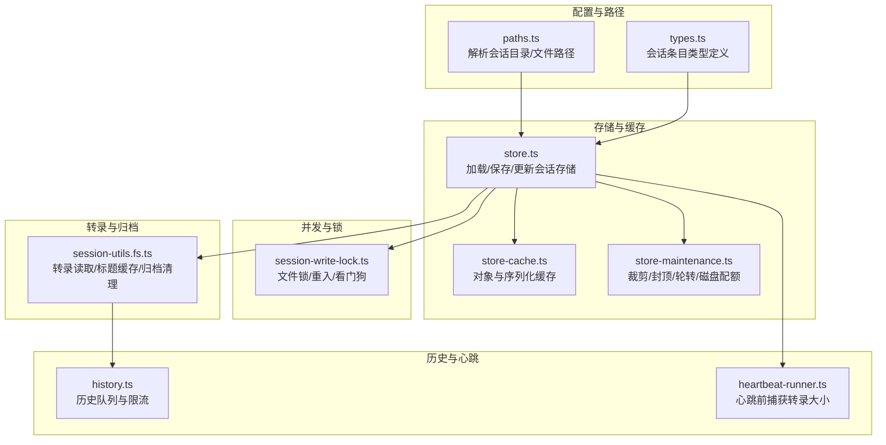
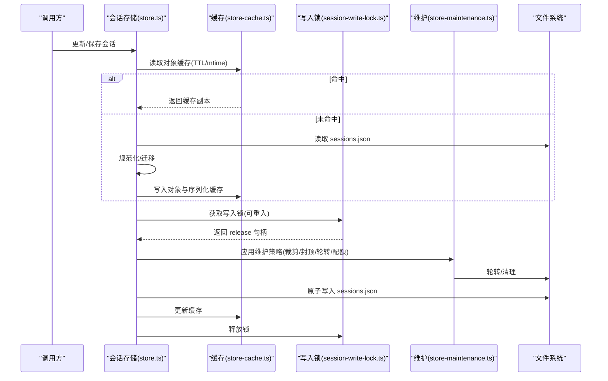
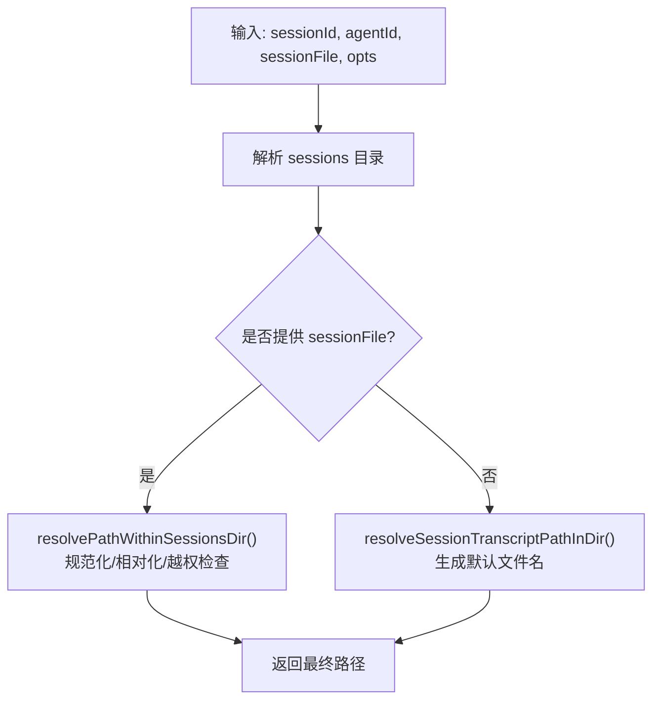
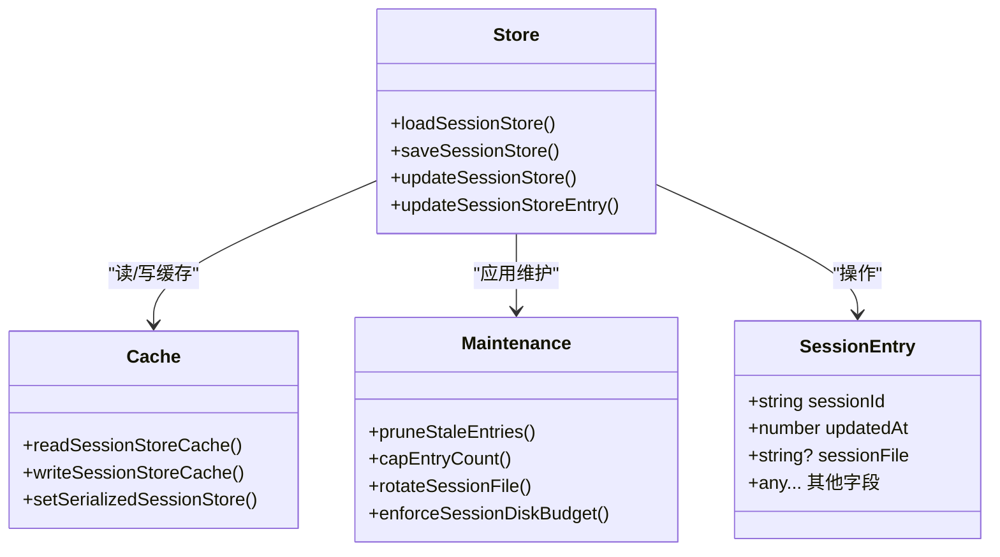
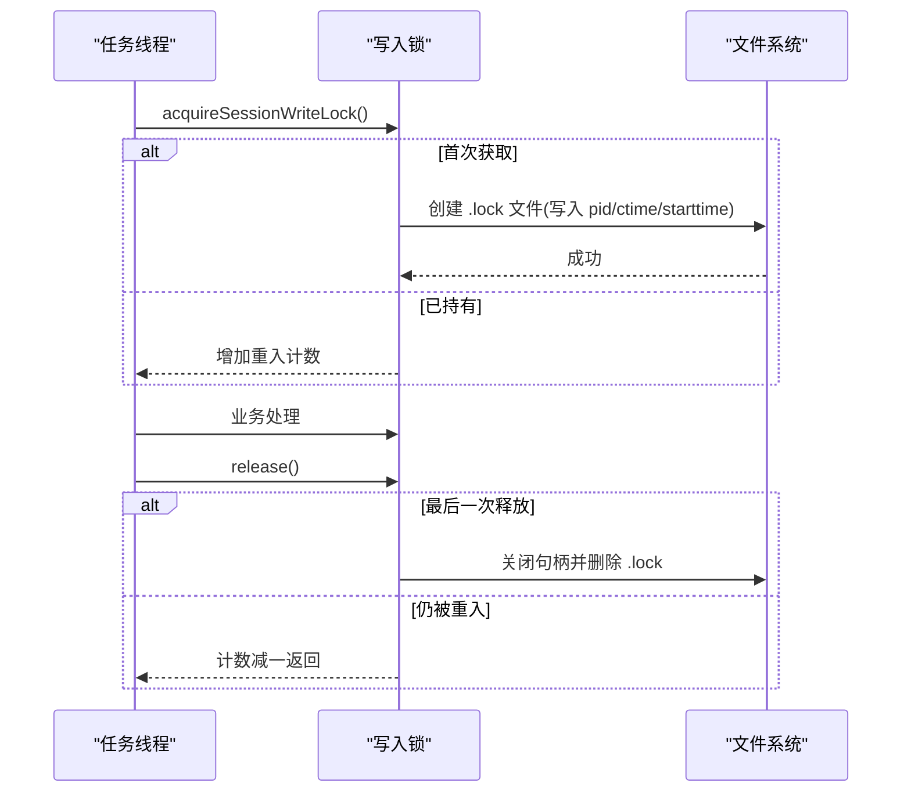
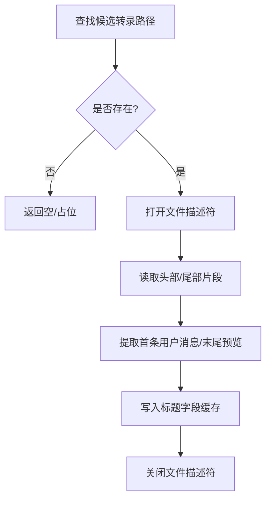
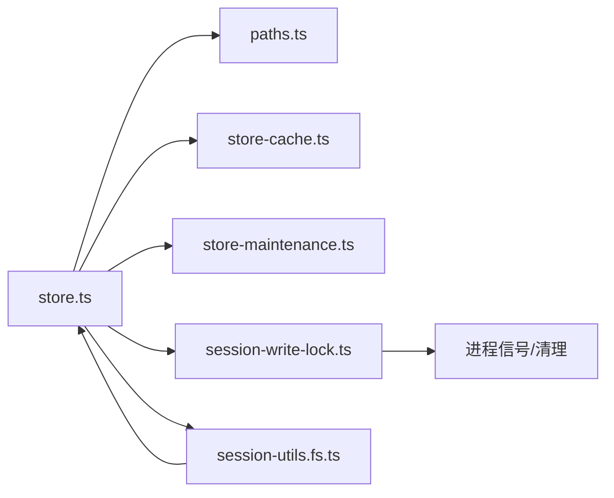

# 会话管理

<cite>
**本文引用的文件**
- [src/config/sessions/types.ts](file://src/config/sessions/types.ts)
- [src/config/sessions/paths.ts](file://src/config/sessions/paths.ts)
- [src/config/sessions/store.ts](file://src/config/sessions/store.ts)
- [src/config/sessions/store-cache.ts](file://src/config/sessions/store-cache.ts)
- [src/config/sessions/store-maintenance.ts](file://src/config/sessions/store-maintenance.ts)
- [src/agents/session-write-lock.ts](file://src/agents/session-write-lock.ts)
- [src/gateway/session-utils.fs.ts](file://src/gateway/session-utils.fs.ts)
- [src/auto-reply/reply/history.ts](file://src/auto-reply/reply/history.ts)
- [src/auto-reply/reply/session.ts](file://src/auto-reply/reply/session.ts)
- [src/infra/heartbeat-runner.ts](file://src/infra/heartbeat-runner.ts)
- [src/config/sessions/sessions.test.ts](file://src/config/sessions/sessions.test.ts)
- [src/agents/session-write-lock.test.ts](file://src/agents/session-write-lock.test.ts)
</cite>

## 目录
1. [简介](#简介)
2. [项目结构](#项目结构)
3. [核心组件](#核心组件)
4. [架构总览](#架构总览)
5. [详细组件分析](#详细组件分析)
6. [依赖关系分析](#依赖关系分析)
7. [性能考量](#性能考量)
8. [故障排查指南](#故障排查指南)
9. [结论](#结论)
10. [附录](#附录)

## 简介
本技术文档系统性阐述会话管理子系统的实现与设计，覆盖会话标识符生成与校验、会话目录组织、会话文件管理、会话转录修复与读取、写入锁机制与并发控制、会话状态持久化、历史记录与标题字段缓存、维护清理（裁剪、封顶、轮转）、磁盘配额与归档、配置项与环境变量、以及迁移与故障恢复策略。文档面向不同层次读者，既提供高层架构视图，也给出代码级细节与可视化图示。

## 项目结构
会话管理相关代码主要分布在以下模块：
- 配置与路径解析：负责会话存储路径、会话ID合法性校验、会话转录文件定位等
- 会话存储与缓存：负责 sessions.json 的读写、缓存、维护（裁剪、封顶、轮转）
- 写入锁与并发控制：基于文件锁的互斥与看门狗超时释放
- 转录文件与归档：转录文件读取、标题字段缓存、归档与清理
- 历史记录与心跳：历史队列与心跳运行器对转录大小的监控

图表来源
- [src/config/sessions/paths.ts:1-308](file://src/config/sessions/paths.ts#L1-L308)
- [src/config/sessions/types.ts:1-380](file://src/config/sessions/types.ts#L1-L380)
- [src/config/sessions/store.ts:1-884](file://src/config/sessions/store.ts#L1-L884)
- [src/config/sessions/store-cache.ts:1-82](file://src/config/sessions/store-cache.ts#L1-L82)
- [src/config/sessions/store-maintenance.ts:1-328](file://src/config/sessions/store-maintenance.ts#L1-L328)
- [src/agents/session-write-lock.ts:1-561](file://src/agents/session-write-lock.ts#L1-L561)
- [src/gateway/session-utils.fs.ts:1-737](file://src/gateway/session-utils.fs.ts#L1-L737)
- [src/auto-reply/reply/history.ts:52-104](file://src/auto-reply/reply/history.ts#L52-L104)
- [src/infra/heartbeat-runner.ts:403-447](file://src/infra/heartbeat-runner.ts#L403-L447)

章节来源
- [src/config/sessions/paths.ts:1-308](file://src/config/sessions/paths.ts#L1-L308)
- [src/config/sessions/store.ts:1-884](file://src/config/sessions/store.ts#L1-L884)

## 核心组件
- 会话标识符与路径解析
  - 会话ID正则校验与标准化
  - 会话目录与默认存储路径解析
  - 会话转录文件路径解析（含跨代理根兼容）
- 会话存储与缓存
  - sessions.json 加载、合并、规范化
  - 对象缓存与序列化缓存（带TTL与mtime/size一致性）
  - 维护策略：过期裁剪、数量封顶、文件轮转、磁盘配额
- 写入锁与并发控制
  - 文件锁 acquire/release，支持重入计数
  - 超时与最大持有时间计算，看门狗定时回收
  - 进程退出同步清理
- 转录文件与归档
  - 多候选路径解析与存在性探测
  - 标题字段缓存（首条用户消息、末尾消息预览）
  - 归档与清理（按原因与时间窗口）
- 历史记录与心跳
  - 历史队列限流与键空间驱逐
  - 心跳前捕获转录大小用于裁剪/轮转触发

章节来源
- [src/config/sessions/types.ts:68-171](file://src/config/sessions/types.ts#L68-L171)
- [src/config/sessions/paths.ts:60-90](file://src/config/sessions/paths.ts#L60-L90)
- [src/config/sessions/store.ts:195-270](file://src/config/sessions/store.ts#L195-L270)
- [src/config/sessions/store-cache.ts:41-81](file://src/config/sessions/store-cache.ts#L41-L81)
- [src/config/sessions/store-maintenance.ts:130-148](file://src/config/sessions/store-maintenance.ts#L130-L148)
- [src/agents/session-write-lock.ts:111-123](file://src/agents/session-write-lock.ts#L111-L123)
- [src/gateway/session-utils.fs.ts:30-72](file://src/gateway/session-utils.fs.ts#L30-L72)

## 架构总览
下图展示从调用方到存储、缓存、锁与维护的完整链路：

图表来源
- [src/config/sessions/store.ts:195-270](file://src/config/sessions/store.ts#L195-L270)
- [src/config/sessions/store-cache.ts:41-81](file://src/config/sessions/store-cache.ts#L41-L81)
- [src/agents/session-write-lock.ts:444-553](file://src/agents/session-write-lock.ts#L444-L553)
- [src/config/sessions/store-maintenance.ts:275-327](file://src/config/sessions/store-maintenance.ts#L275-L327)

## 详细组件分析

### 会话标识符与路径解析
- 会话ID合法性
  - 使用正则表达式限制长度与字符集，确保安全与跨平台兼容
- 路径解析
  - 默认 sessions.json 位于状态根下的 agents/<agentId>/sessions
  - 支持通过模板与环境变量扩展路径
  - 会话转录文件名规则：sessionId.jsonl 或 sessionId-topic-<id>.jsonl
  - 跨代理根兼容：当传入绝对路径不在当前根时，尝试兄弟代理根或结构化回退路径
- 安全约束
  - 所有相对化与规范化均进行 realpath 容错处理，避免越权访问

图表来源
- [src/config/sessions/paths.ts:235-277](file://src/config/sessions/paths.ts#L235-L277)

章节来源
- [src/config/sessions/paths.ts:60-90](file://src/config/sessions/paths.ts#L60-L90)
- [src/config/sessions/paths.ts:171-233](file://src/config/sessions/paths.ts#L171-L233)
- [src/config/sessions/paths.ts:235-277](file://src/config/sessions/paths.ts#L235-L277)

### 会话存储与缓存
- 读取流程
  - 先查对象缓存（TTL + mtime/size 一致性），否则从磁盘读取并迁移/规范化后写入缓存
  - Windows 平台对空文件/锁定状态做重试与短暂等待
- 写入流程
  - 在写入锁保护下执行维护（裁剪、封顶、轮转、磁盘配额）
  - 原子写入（临时文件+rename），失败重试
  - 写入后更新缓存（对象与序列化）
- 缓存策略
  - 对象缓存：结构化克隆返回，避免外部修改污染
  - 序列化缓存：用于检测内容未变，避免重复写入

图表来源
- [src/config/sessions/store.ts:195-270](file://src/config/sessions/store.ts#L195-L270)
- [src/config/sessions/store-cache.ts:41-81](file://src/config/sessions/store-cache.ts#L41-L81)
- [src/config/sessions/store-maintenance.ts:155-259](file://src/config/sessions/store-maintenance.ts#L155-L259)

章节来源
- [src/config/sessions/store.ts:195-270](file://src/config/sessions/store.ts#L195-L270)
- [src/config/sessions/store-cache.ts:41-81](file://src/config/sessions/store-cache.ts#L41-L81)
- [src/config/sessions/store.ts:340-509](file://src/config/sessions/store.ts#L340-L509)

### 写入锁机制与并发控制
- 锁文件格式
  - 包含 pid、创建时间、进程启动时刻（用于 PID 回收检测）
- 获取与重入
  - 同一进程可多次获取同一会话锁（计数器）
  - 超时与最大持有时间由超时参数、宽限期与最小值共同决定
- 清理与看门狗
  - 注册进程信号处理器与退出钩子，异常退出时同步清理
  - 定时扫描超时持有的锁并强制释放
- 僵尸锁清理
  - 支持扫描并删除过期锁文件（基于 payload 或 mtime 回退）

图表来源
- [src/agents/session-write-lock.ts:444-553](file://src/agents/session-write-lock.ts#L444-L553)
- [src/agents/session-write-lock.ts:125-169](file://src/agents/session-write-lock.ts#L125-L169)

章节来源
- [src/agents/session-write-lock.ts:111-123](file://src/agents/session-write-lock.ts#L111-L123)
- [src/agents/session-write-lock.ts:193-227](file://src/agents/session-write-lock.ts#L193-L227)
- [src/agents/session-write-lock.ts:387-442](file://src/agents/session-write-lock.ts#L387-L442)

### 会话转录修复与读取
- 转录候选路径
  - 优先使用 sessions.json 中记录的 sessionFile，否则按默认规则推导
  - 支持多候选路径去重与跨代理根兼容
- 标题字段缓存
  - 首条用户消息与末尾消息预览，结合 mtime/size 做 LRU 缓存
- 读取策略
  - 分块读取（头部/尾部）以降低内存占用
  - 对工具调用、媒体摘要等特殊消息做结构化提取
- 归档与清理
  - 按原因（reset/deleted）与时间戳归档
  - 清理过期归档文件（按目录扫描与时间阈值）

图表来源
- [src/gateway/session-utils.fs.ts:121-164](file://src/gateway/session-utils.fs.ts#L121-L164)
- [src/gateway/session-utils.fs.ts:295-365](file://src/gateway/session-utils.fs.ts#L295-L365)
- [src/gateway/session-utils.fs.ts:452-527](file://src/gateway/session-utils.fs.ts#L452-L527)

章节来源
- [src/gateway/session-utils.fs.ts:74-119](file://src/gateway/session-utils.fs.ts#L74-L119)
- [src/gateway/session-utils.fs.ts:188-228](file://src/gateway/session-utils.fs.ts#L188-L228)
- [src/gateway/session-utils.fs.ts:230-267](file://src/gateway/session-utils.fs.ts#L230-L267)

### 历史记录与心跳
- 历史队列
  - 限制每个 key 的历史长度，超过上限从头部移除
  - Map 按最近使用刷新插入顺序，防止无界增长
- 心跳运行器
  - 在心跳前捕获转录大小，用于触发裁剪/轮转
  - 提供前缀剥离逻辑，避免重复提示

章节来源
- [src/auto-reply/reply/history.ts:52-104](file://src/auto-reply/reply/history.ts#L52-L104)
- [src/infra/heartbeat-runner.ts:403-447](file://src/infra/heartbeat-runner.ts#L403-L447)

### 会话状态持久化与维护
- 维护策略
  - 过期裁剪：基于 updatedAt 与配置的保留时长
  - 数量封顶：按最近活跃排序，移除最旧条目
  - 文件轮转：超过阈值时重命名为 .bak.<timestamp>，最多保留最近3个
  - 磁盘配额：在 warn 模式下仅告警，在 enforce 模式下执行清理
- 会话重置与迁移
  - 重置触发后创建新的 sessionId，并清理过期/封顶相关的上下文指标
  - 服务端方法在迁移时对 store key 做规范化与遗留键清理

章节来源
- [src/config/sessions/store-maintenance.ts:155-259](file://src/config/sessions/store-maintenance.ts#L155-L259)
- [src/config/sessions/store-maintenance.ts:275-327](file://src/config/sessions/store-maintenance.ts#L275-L327)
- [src/auto-reply/reply/session.ts:528-564](file://src/auto-reply/reply/session.ts#L528-L564)
- [src/gateway/server-methods/sessions.ts:95-118](file://src/gateway/server-methods/sessions.ts#L95-L118)

## 依赖关系分析
- 组件耦合
  - store.ts 依赖 paths.ts（路径解析）、store-cache.ts（缓存）、store-maintenance.ts（维护）、session-write-lock.ts（并发）、gateway/session-utils.fs.ts（归档）
  - session-write-lock.ts 与进程生命周期强绑定，依赖进程存活检测与清理信号
  - session-utils.fs.ts 与 store.ts 协作完成归档与清理
- 外部依赖
  - 文件系统 API（读写/重命名/统计/遍历）
  - JSON 解析/序列化
  - 日志子系统

图表来源
- [src/config/sessions/store.ts:1-46](file://src/config/sessions/store.ts#L1-L46)
- [src/agents/session-write-lock.ts:247-272](file://src/agents/session-write-lock.ts#L247-L272)
- [src/gateway/session-utils.fs.ts:1-19](file://src/gateway/session-utils.fs.ts#L1-L19)

章节来源
- [src/config/sessions/store.ts:1-46](file://src/config/sessions/store.ts#L1-L46)
- [src/agents/session-write-lock.ts:247-272](file://src/agents/session-write-lock.ts#L247-L272)

## 性能考量
- 缓存命中率
  - 对 sessions.json 的对象缓存与序列化缓存显著减少磁盘 IO；建议合理设置 TTL 与缓存开关
- 写入批量化
  - 通过 Promise 队列串行化并发写入，避免竞争与数据丢失
- I/O 优化
  - 转录读取采用分块策略与文件描述符复用，标题字段缓存避免重复扫描
- 维护成本
  - 轮转与清理在写入路径内完成，尽量不影响读取路径；磁盘配额清理为异步兜底

## 故障排查指南
- 写入锁相关
  - 症状：长时间无法获取锁或报“超时”
  - 排查：检查 staleMs 与 timeoutMs 设置；确认是否存在僵尸锁；查看看门狗日志
  - 处理：使用清理接口移除过期锁；必要时重启进程触发同步清理
- 会话存储损坏
  - 症状：读取为空或解析失败
  - 排查：Windows 平台可能处于中间态；检查缓存一致性与 mtime/size
  - 处理：禁用缓存或清空缓存后重试；必要时手动删除 .bak.* 文件
- 维护策略误判
  - 症状：活跃会话被裁剪或封顶
  - 排查：确认 warn-only 模式下的警告；检查 pruneAfterMs 与 maxEntries
  - 处理：调整维护配置或在回调中忽略警告
- 转录读取异常
  - 症状：标题字段为空或不准确
  - 排查：检查缓存键与文件 stat；确认文件权限
  - 处理：清空标题字段缓存或扩大扫描范围

章节来源
- [src/agents/session-write-lock.ts:387-442](file://src/agents/session-write-lock.ts#L387-L442)
- [src/config/sessions/store.ts:213-249](file://src/config/sessions/store.ts#L213-L249)
- [src/config/sessions/store-maintenance.ts:180-219](file://src/config/sessions/store-maintenance.ts#L180-L219)
- [src/gateway/session-utils.fs.ts:30-72](file://src/gateway/session-utils.fs.ts#L30-L72)

## 结论
该会话管理系统通过严格的路径与ID校验、可靠的文件锁并发控制、完善的缓存与维护策略，实现了高可用的会话状态持久化与转录管理。其设计兼顾性能与可靠性，提供了丰富的配置项与可观测性，便于在生产环境中稳定运行与演进。

## 附录

### 会话配置选项与环境变量
- 会话存储路径
  - 默认：agents/<agentId>/sessions/sessions.json
  - 支持模板与家目录展开
- 维护配置（来自配置文件）
  - 模式：warn/enforce
  - 保留时长：pruneAfterMs 或 pruneDays
  - 最大条目数：maxEntries
  - 轮转阈值：rotateBytes
  - 磁盘上限与高水位：maxDiskBytes、highWaterBytes
  - 重置归档保留：resetArchiveRetention
- 缓存与锁
  - OPENCLAW_SESSION_CACHE_TTL_MS：会话存储缓存 TTL
  - OPENCLAW_SESSION_MANAGER_CACHE_TTL_MS：会话管理器缓存 TTL
  - 写入锁超时/最大持有/陈旧判定等均有默认值与可调参数

章节来源
- [src/config/sessions/paths.ts:33-35](file://src/config/sessions/paths.ts#L33-L35)
- [src/config/sessions/store-maintenance.ts:130-148](file://src/config/sessions/store-maintenance.ts#L130-L148)
- [src/config/sessions/store.ts:58-67](file://src/config/sessions/store.ts#L58-L67)
- [src/agents/session-write-lock.ts:44-48](file://src/agents/session-write-lock.ts#L44-L48)

### 存储优化与备份策略
- 优化
  - 启用对象与序列化缓存，缩短读取路径
  - 使用原子写入与增量维护，降低写放大
- 备份
  - 自动轮转为 .bak.<timestamp>，最多保留3个
  - 归档按原因与时间戳命名，定期清理过期归档

章节来源
- [src/config/sessions/store.ts:464-509](file://src/config/sessions/store.ts#L464-L509)
- [src/config/sessions/store-maintenance.ts:275-327](file://src/config/sessions/store-maintenance.ts#L275-L327)
- [src/gateway/session-utils.fs.ts:177-182](file://src/gateway/session-utils.fs.ts#L177-L182)

### 会话迁移与故障恢复
- 迁移
  - 服务端方法对 store key 做规范化与遗留键清理
  - 重置后清理过期上下文指标，保持状态一致
- 故障恢复
  - 清理僵尸锁与过期锁
  - 删除损坏转录并从 store 移除对应条目
  - 心跳前捕获转录大小，触发裁剪/轮转

章节来源
- [src/gateway/server-methods/sessions.ts:95-118](file://src/gateway/server-methods/sessions.ts#L95-L118)
- [src/auto-reply/reply/session.ts:528-564](file://src/auto-reply/reply/session.ts#L528-L564)
- [src/agents/session-write-lock.ts:387-442](file://src/agents/session-write-lock.ts#L387-L442)
- [src/infra/heartbeat-runner.ts:403-447](file://src/infra/heartbeat-runner.ts#L403-L447)