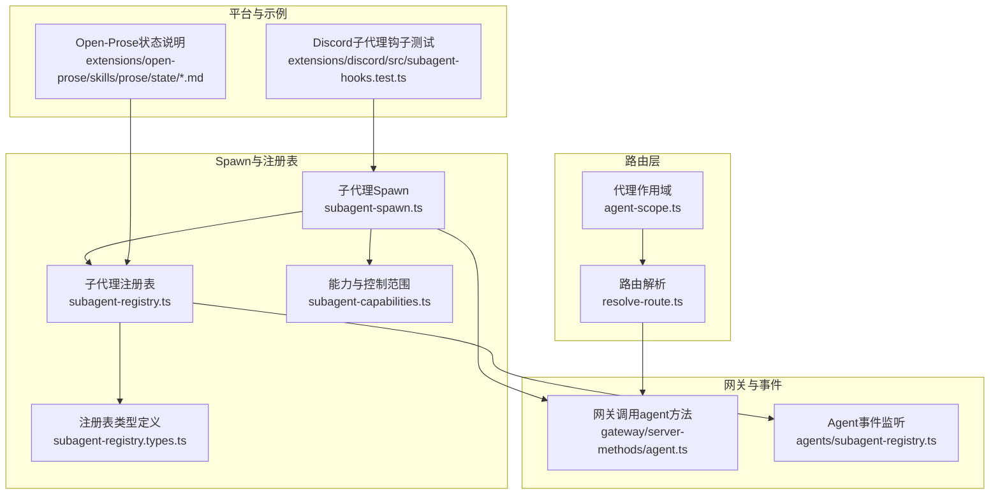
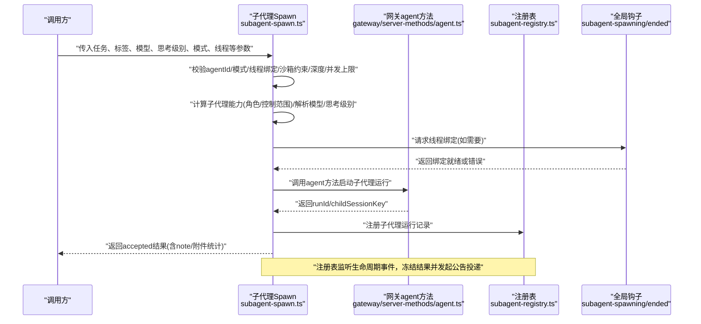
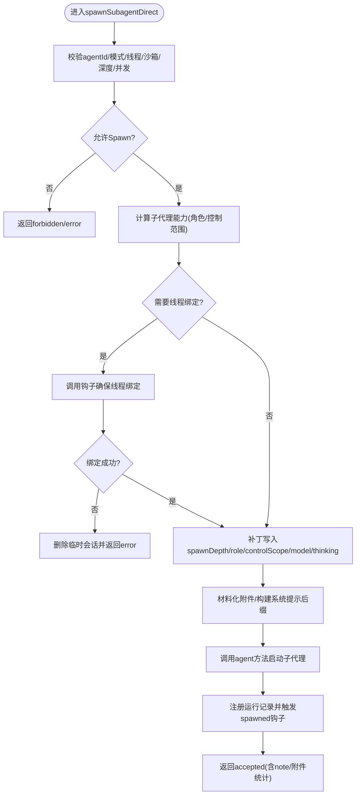
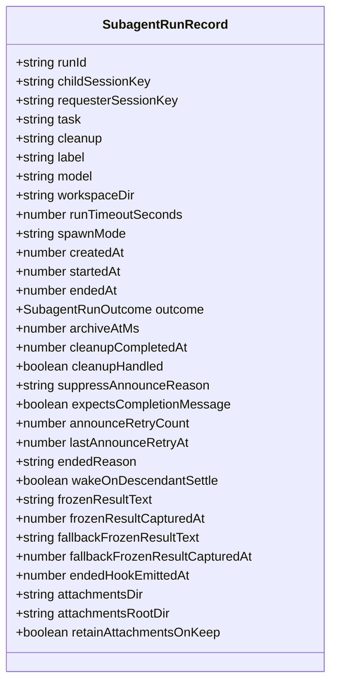
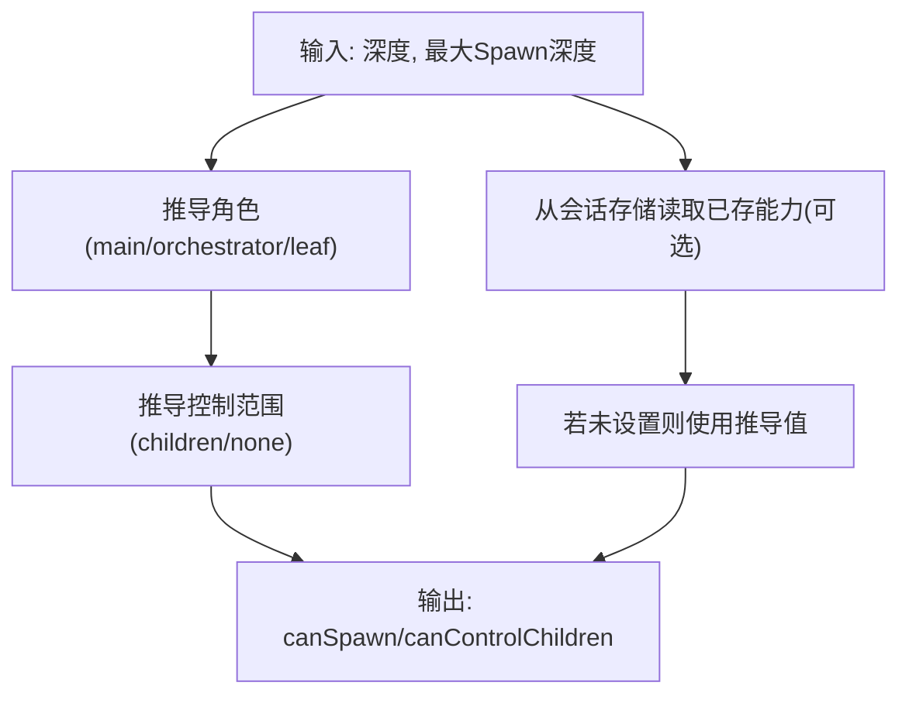
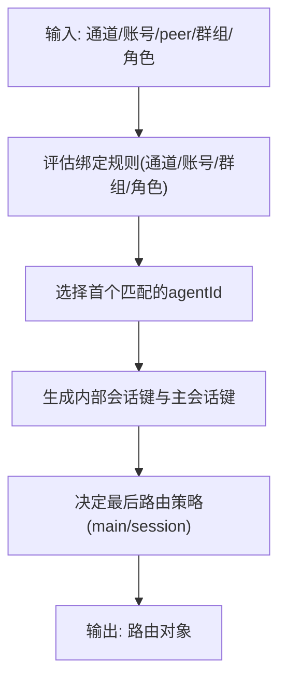
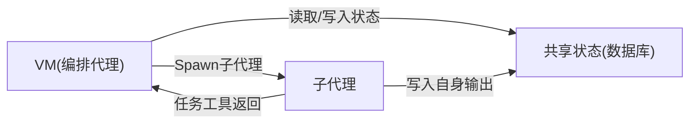
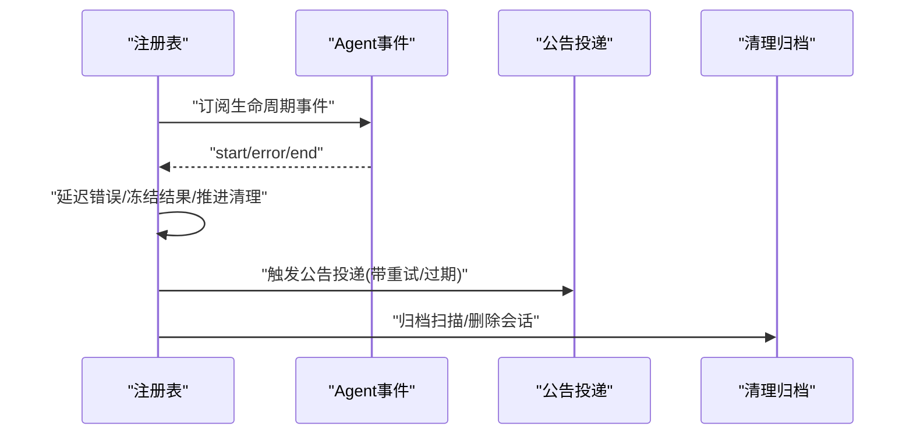
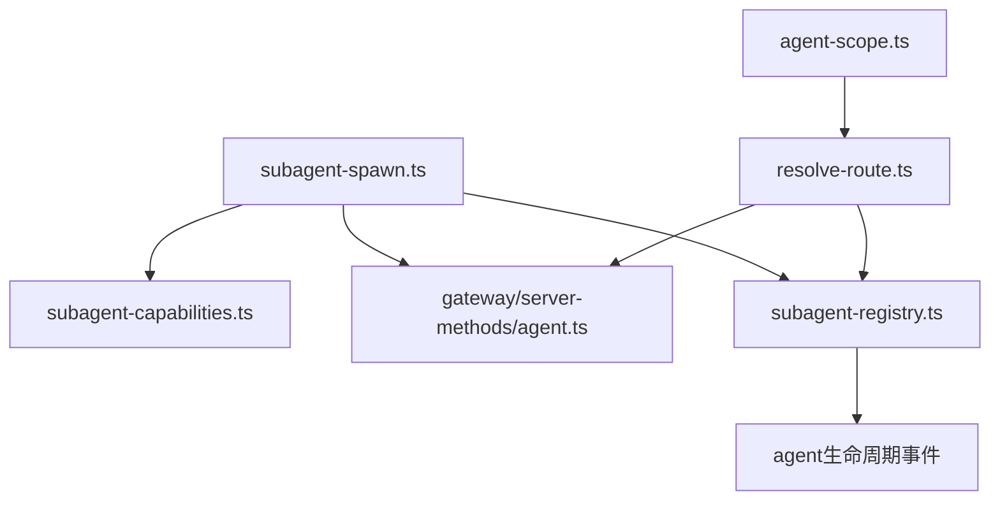

# 多代理路由

<cite>
**本文引用的文件**
- [src/agents/subagent-spawn.ts](file://src/agents/subagent-spawn.ts)
- [src/agents/subagent-registry.ts](file://src/agents/subagent-registry.ts)
- [src/agents/subagent-capabilities.ts](file://src/agents/subagent-capabilities.ts)
- [src/agents/subagent-registry.types.ts](file://src/agents/subagent-registry.types.ts)
- [src/routing/resolve-route.ts](file://src/routing/resolve-route.ts)
- [src/agents/agent-scope.ts](file://src/agents/agent-scope.ts)
- [src/gateway/server-methods/agent.ts](file://src/gateway/server-methods/agent.ts)
- [extensions/discord/src/subagent-hooks.test.ts](file://extensions/discord/src/subagent-hooks.test.ts)
- [src/agents/openclaw-tools.subagents.sessions-spawn.allowlist.test.ts](file://src/agents/openclaw-tools.subagents.sessions-spawn.allowlist.test.ts)
- [src/agents/openclaw-tools.subagents.sessions-spawn-depth-limits.test.ts](file://src/agents/openclaw-tools.subagents.sessions-spawn-depth-limits.test.ts)
- [apps/macos/Sources/OpenClaw/AgentEventStore.swift](file://apps/macos/Sources/OpenClaw/AgentEventStore.swift)
- [extensions/open-prose/skills/prose/state/postgres.md](file://extensions/open-prose/skills/prose/state/postgres.md)
- [extensions/open-prose/skills/prose/state/sqlite.md](file://extensions/open-prose/skills/prose/state/sqlite.md)
- [extensions/open-prose/skills/prose/state/in-context.md](file://extensions/open-prose/skills/prose/state/in-context.md)
- [docs/concepts/multi-agent.md](file://docs/concepts/multi-agent.md)
- [docs/channels/broadcast-groups.md](file://docs/channels/broadcast-groups.md)
</cite>

## 目录
1. [简介](#简介)
2. [项目结构](#项目结构)
3. [核心组件](#核心组件)
4. [架构总览](#架构总览)
5. [详细组件分析](#详细组件分析)
6. [依赖关系分析](#依赖关系分析)
7. [性能考量](#性能考量)
8. [故障排查指南](#故障排查指南)
9. [结论](#结论)
10. [附录](#附录)

## 简介
本技术文档围绕“多代理路由系统”展开，聚焦以下关键主题：
- 子代理注册表：运行时记录、生命周期管理、清理与归档、公告投递与重试策略。
- 代理Spawn机制：参数校验、目标选择、沙箱与运行时约束、线程绑定、附件与工作区继承、生命周期钩子。
- 路由控制策略：按通道/账号/群组/角色等维度的入站路由解析与会话键生成。
- 代理能力检测与控制范围：基于深度的角色划分（主代理/编排者/叶子）与控制范围。
- 生命周期管理与事件处理：生命周期事件监听、延迟错误处理、公告投递、结束钩子。
- 代理间通信、状态同步与资源协调：通过会话存储、数据库共享状态、任务工具返回作为完成信号。
- 配置选项、性能优化与监控：超时、并发限制、深度限制、归档策略、事件存储与可观测性。

## 项目结构
多代理路由系统由“路由解析层”“代理Spawn层”“子代理注册表层”“能力与控制范围层”“网关调用层”“事件与状态持久化层”组成。下图展示与多代理路由直接相关的模块关系：

**图表来源**
- [src/routing/resolve-route.ts:1-200](file://src/routing/resolve-route.ts#L1-L200)
- [src/agents/agent-scope.ts:44-84](file://src/agents/agent-scope.ts#L44-L84)
- [src/agents/subagent-spawn.ts:238-745](file://src/agents/subagent-spawn.ts#L238-L745)
- [src/agents/subagent-registry.ts:753-805](file://src/agents/subagent-registry.ts#L753-L805)
- [src/agents/subagent-capabilities.ts:110-157](file://src/agents/subagent-capabilities.ts#L110-L157)
- [src/agents/subagent-registry.types.ts:6-59](file://src/agents/subagent-registry.types.ts#L6-L59)
- [src/gateway/server-methods/agent.ts:259-274](file://src/gateway/server-methods/agent.ts#L259-L274)
- [extensions/discord/src/subagent-hooks.test.ts:78-140](file://extensions/discord/src/subagent-hooks.test.ts#L78-L140)
- [extensions/open-prose/skills/prose/state/postgres.md:247-289](file://extensions/open-prose/skills/prose/state/postgres.md#L247-L289)
- [extensions/open-prose/skills/prose/state/sqlite.md:108-126](file://extensions/open-prose/skills/prose/state/sqlite.md#L108-L126)

**章节来源**
- [src/routing/resolve-route.ts:1-200](file://src/routing/resolve-route.ts#L1-L200)
- [src/agents/agent-scope.ts:44-84](file://src/agents/agent-scope.ts#L44-L84)
- [src/agents/subagent-spawn.ts:238-745](file://src/agents/subagent-spawn.ts#L238-L745)
- [src/agents/subagent-registry.ts:753-805](file://src/agents/subagent-registry.ts#L753-L805)
- [src/agents/subagent-capabilities.ts:110-157](file://src/agents/subagent-capabilities.ts#L110-L157)
- [src/agents/subagent-registry.types.ts:6-59](file://src/agents/subagent-registry.types.ts#L6-L59)
- [src/gateway/server-methods/agent.ts:259-274](file://src/gateway/server-methods/agent.ts#L259-L274)
- [extensions/discord/src/subagent-hooks.test.ts:78-140](file://extensions/discord/src/subagent-hooks.test.ts#L78-L140)
- [extensions/open-prose/skills/prose/state/postgres.md:247-289](file://extensions/open-prose/skills/prose/state/postgres.md#L247-L289)
- [extensions/open-prose/skills/prose/state/sqlite.md:108-126](file://extensions/open-prose/skills/prose/state/sqlite.md#L108-L126)

## 核心组件
- 子代理Spawn机制：负责参数解析、目标代理选择、沙箱与运行时约束检查、线程绑定准备、系统提示构建、附件材料化、调用网关启动子代理运行，并注册到注册表。
- 子代理注册表：维护子代理运行记录、监听生命周期事件、冻结最终结果、驱动公告投递与清理流程、执行归档与收尾。
- 能力与控制范围：根据子代理深度与最大Spawn深度推导角色（主代理/编排者/叶子）与控制范围（children/none），并支持从会话存储中读取已存能力。
- 路由控制策略：解析入站消息的路由，生成内部会话键与主会话键，决定最后路由更新接收方，支持按通道/账号/群组/角色等维度匹配。
- 网关调用与事件：通过agent方法启动子代理运行；注册表监听生命周期事件以推进后续流程。
- 平台钩子与示例：Discord等渠道通过钩子实现线程绑定；Open-Prose示例展示VM与子代理协作、数据库状态共享与完成信号。

**章节来源**
- [src/agents/subagent-spawn.ts:238-745](file://src/agents/subagent-spawn.ts#L238-L745)
- [src/agents/subagent-registry.ts:1-200](file://src/agents/subagent-registry.ts#L1-L200)
- [src/agents/subagent-capabilities.ts:69-157](file://src/agents/subagent-capabilities.ts#L69-L157)
- [src/routing/resolve-route.ts:39-75](file://src/routing/resolve-route.ts#L39-L75)
- [src/gateway/server-methods/agent.ts:259-274](file://src/gateway/server-methods/agent.ts#L259-L274)
- [extensions/discord/src/subagent-hooks.test.ts:78-140](file://extensions/discord/src/subagent-hooks.test.ts#L78-L140)
- [extensions/open-prose/skills/prose/state/postgres.md:247-289](file://extensions/open-prose/skills/prose/state/postgres.md#L247-L289)

## 架构总览
下图展示一次子代理Spawn的端到端流程，包括参数校验、能力计算、线程绑定、网关调用、注册与公告投递：

**图表来源**
- [src/agents/subagent-spawn.ts:238-745](file://src/agents/subagent-spawn.ts#L238-L745)
- [src/gateway/server-methods/agent.ts:259-274](file://src/gateway/server-methods/agent.ts#L259-L274)
- [src/agents/subagent-registry.ts:753-805](file://src/agents/subagent-registry.ts#L753-L805)
- [extensions/discord/src/subagent-hooks.test.ts:133-140](file://extensions/discord/src/subagent-hooks.test.ts#L133-L140)

**章节来源**
- [src/agents/subagent-spawn.ts:238-745](file://src/agents/subagent-spawn.ts#L238-L745)
- [src/agents/subagent-registry.ts:753-805](file://src/agents/subagent-registry.ts#L753-L805)
- [src/gateway/server-methods/agent.ts:259-274](file://src/gateway/server-methods/agent.ts#L259-L274)
- [extensions/discord/src/subagent-hooks.test.ts:133-140](file://extensions/discord/src/subagent-hooks.test.ts#L133-L140)

## 详细组件分析

### 组件A：子代理Spawn机制
- 参数与上下文
  - 支持任务、标签、目标代理Id、模型、思考级别、超时、线程模式、清理策略、沙箱模式、期望完成消息、附件与挂载路径等。
  - 上下文包含会话键、通道、账号、to、线程Id、群组信息、请求者代理Id覆盖、工作区目录等。
- 校验与约束
  - agentId合法性校验，避免异常规范化导致的副作用。
  - 模式解析：默认随是否请求线程而定；session模式必须绑定线程。
  - 沙箱约束：若请求方在沙箱内且要求严格沙箱，则目标必须沙箱化；否则拒绝。
  - 深度限制：当前深度达到最大Spawn深度则禁止。
  - 并发限制：同一请求者会话活跃子代理数超过上限则禁止。
  - 允许列表：非同代理Spawn需满足允许列表配置。
- 能力与系统提示
  - 基于深度与最大Spawn深度推导角色与控制范围。
  - 解析模型与思考级别，构建子代理系统提示，必要时附加附件说明。
- 线程绑定
  - 若请求线程绑定，通过全局钩子尝试创建/绑定线程；失败则回滚并删除临时会话。
- 启动与注册
  - 调用网关agent方法启动子代理运行，记录runId与childSessionKey。
  - 注册运行记录，触发subagent_spawned钩子（失败不影响返回）。
  - 返回accepted结果，附带note（非cron会话提醒不要轮询）、模型应用标记、附件统计等。

**图表来源**
- [src/agents/subagent-spawn.ts:238-745](file://src/agents/subagent-spawn.ts#L238-L745)

**章节来源**
- [src/agents/subagent-spawn.ts:47-101](file://src/agents/subagent-spawn.ts#L47-L101)
- [src/agents/subagent-spawn.ts:156-165](file://src/agents/subagent-spawn.ts#L156-L165)
- [src/agents/subagent-spawn.ts:315-354](file://src/agents/subagent-spawn.ts#L315-L354)
- [src/agents/subagent-spawn.ts:364-377](file://src/agents/subagent-spawn.ts#L364-L377)
- [src/agents/subagent-spawn.ts:409-457](file://src/agents/subagent-spawn.ts#L409-L457)
- [src/agents/subagent-spawn.ts:568-589](file://src/agents/subagent-spawn.ts#L568-L589)
- [src/agents/subagent-spawn.ts:651-670](file://src/agents/subagent-spawn.ts#L651-L670)
- [src/agents/subagent-spawn.ts:696-722](file://src/agents/subagent-spawn.ts#L696-L722)

### 组件B：子代理注册表与生命周期管理
- 运行记录结构
  - 包含runId、childSessionKey、控制器/请求者会话键、任务、清理策略、标签、模型、工作区、超时、模式、创建/开始/结束时间、结果、归档时间、清理完成状态、抑制公告原因、期望完成消息、公告重试计数与时间、结束原因、冻结结果文本及其捕获时间、结束钩子发出时间、附件目录等。
- 生命周期监听与处理
  - 监听agent生命周期事件，区分start/error/end阶段，分别处理延迟错误、冻结结果、推进清理与公告。
  - 对错误事件采用延迟窗口（避免瞬时错误导致过早清理），到期后统一标记为error并推进清理。
- 公告投递与重试
  - 采用指数退避重试，限制最大重试次数与过期时间；对completion消息流设置硬性过期上限。
  - 支持等待后代稳定后再唤醒，避免无限期悬挂。
- 清理与归档
  - 归档策略：根据配置的archiveAfterMinutes计算归档时间，定时器扫描清理并删除会话。
  - 清理流程：删除附件目录、调用sessions.delete，确保生命周期钩子仅在必要时发出一次。

**图表来源**
- [src/agents/subagent-registry.types.ts:6-59](file://src/agents/subagent-registry.types.ts#L6-L59)

**章节来源**
- [src/agents/subagent-registry.types.ts:6-59](file://src/agents/subagent-registry.types.ts#L6-L59)
- [src/agents/subagent-registry.ts:753-805](file://src/agents/subagent-registry.ts#L753-L805)
- [src/agents/subagent-registry.ts:451-530](file://src/agents/subagent-registry.ts#L451-L530)
- [src/agents/subagent-registry.ts:648-678](file://src/agents/subagent-registry.ts#L648-L678)
- [src/agents/subagent-registry.ts:696-751](file://src/agents/subagent-registry.ts#L696-L751)

### 组件C：代理能力检测与控制范围
- 角色与控制范围
  - 根据深度与最大Spawn深度推导角色（main/orchestrator/leaf）与控制范围（children/none）。
  - 叶子节点无子代理控制权，主代理/编排者可Spawn与控制子代理。
- 已存能力
  - 从会话存储中读取已存的subagentRole与subagentControlScope，若未设置则回退到基于深度的推导。
- 用途
  - 在Spawn前用于判断是否允许目标代理、是否需要沙箱约束、是否允许跨代理Spawn等。

**图表来源**
- [src/agents/subagent-capabilities.ts:89-120](file://src/agents/subagent-capabilities.ts#L89-L120)
- [src/agents/subagent-capabilities.ts:122-157](file://src/agents/subagent-capabilities.ts#L122-L157)

**章节来源**
- [src/agents/subagent-capabilities.ts:89-157](file://src/agents/subagent-capabilities.ts#L89-L157)

### 组件D：路由控制策略
- 路由解析
  - 输入包含通道、账号、peer、父peer、群组/团队Id、成员角色Id等。
  - 输出包含agentId、通道、账号、内部会话键、主会话键、最后路由策略（main/session）、匹配描述。
- 会话键生成
  - 支持DM会话作用域（main/per-peer/per-channel-peer/per-account-channel-peer）与身份链接继承。
- 默认代理解析
  - 当未显式匹配时，回退到默认代理；当存在多个默认标记时给出警告并使用第一个。

**图表来源**
- [src/routing/resolve-route.ts:26-75](file://src/routing/resolve-route.ts#L26-L75)
- [src/routing/resolve-route.ts:91-112](file://src/routing/resolve-route.ts#L91-L112)
- [src/agents/agent-scope.ts:72-84](file://src/agents/agent-scope.ts#L72-L84)

**章节来源**
- [src/routing/resolve-route.ts:26-75](file://src/routing/resolve-route.ts#L26-L75)
- [src/routing/resolve-route.ts:91-112](file://src/routing/resolve-route.ts#L91-L112)
- [src/agents/agent-scope.ts:72-84](file://src/agents/agent-scope.ts#L72-L84)

### 组件E：代理间通信、状态同步与资源协调
- 通信与完成信号
  - 子代理通过任务工具返回作为完成信号，而非直接写数据库；VM仅在完成后读取数据库。
- 数据库状态
  - VM负责schema初始化、运行注册、执行跟踪、并行协调、循环管理、错误聚合、上下文保留、完成检测。
  - 子代理负责写入bindings、agents、agent_segments，使用事务保证原子性。
- 示例参考
  - Open-Prose文档展示了VM与子代理的协作流程与执行追踪示例。

**图表来源**
- [extensions/open-prose/skills/prose/state/postgres.md:247-289](file://extensions/open-prose/skills/prose/state/postgres.md#L247-L289)
- [extensions/open-prose/skills/prose/state/sqlite.md:108-126](file://extensions/open-prose/skills/prose/state/sqlite.md#L108-L126)
- [extensions/open-prose/skills/prose/state/in-context.md:260-323](file://extensions/open-prose/skills/prose/state/in-context.md#L260-L323)

**章节来源**
- [extensions/open-prose/skills/prose/state/postgres.md:247-289](file://extensions/open-prose/skills/prose/state/postgres.md#L247-L289)
- [extensions/open-prose/skills/prose/state/sqlite.md:108-126](file://extensions/open-prose/skills/prose/state/sqlite.md#L108-L126)
- [extensions/open-prose/skills/prose/state/in-context.md:260-323](file://extensions/open-prose/skills/prose/state/in-context.md#L260-L323)

### 组件F：事件处理与监控
- 事件监听
  - 注册表监听agent生命周期事件，区分start/error/end，分别进行延迟错误处理、冻结结果、推进清理与公告。
- 事件存储（桌面端）
  - macOS端提供AgentEventStore，用于收集与展示控制代理事件，支持上限裁剪与清空。

**图表来源**
- [src/agents/subagent-registry.ts:753-805](file://src/agents/subagent-registry.ts#L753-L805)
- [apps/macos/Sources/OpenClaw/AgentEventStore.swift:1-22](file://apps/macos/Sources/OpenClaw/AgentEventStore.swift#L1-L22)

**章节来源**
- [src/agents/subagent-registry.ts:753-805](file://src/agents/subagent-registry.ts#L753-L805)
- [apps/macos/Sources/OpenClaw/AgentEventStore.swift:1-22](file://apps/macos/Sources/OpenClaw/AgentEventStore.swift#L1-L22)

## 依赖关系分析
- 组件耦合
  - Spawn依赖能力计算、沙箱状态、线程钩子、网关调用与注册表。
  - 注册表依赖生命周期事件、上下文引擎、会话存储、清理与归档策略。
  - 路由解析依赖代理作用域与绑定规则，生成会话键供Spawn与注册表使用。
- 外部集成点
  - 平台钩子（如Discord）用于线程绑定；Open-Prose提供状态持久化与协作范式参考。
- 循环依赖规避
  - 通过模块职责分离与弱引用定时器（如归档扫描）避免循环依赖。

**图表来源**
- [src/agents/subagent-spawn.ts:1-50](file://src/agents/subagent-spawn.ts#L1-L50)
- [src/agents/subagent-capabilities.ts:1-10](file://src/agents/subagent-capabilities.ts#L1-L10)
- [src/gateway/server-methods/agent.ts:259-274](file://src/gateway/server-methods/agent.ts#L259-L274)
- [src/agents/subagent-registry.ts:1-20](file://src/agents/subagent-registry.ts#L1-L20)
- [src/routing/resolve-route.ts:1-20](file://src/routing/resolve-route.ts#L1-L20)
- [src/agents/agent-scope.ts:44-84](file://src/agents/agent-scope.ts#L44-L84)

**章节来源**
- [src/agents/subagent-spawn.ts:1-50](file://src/agents/subagent-spawn.ts#L1-L50)
- [src/agents/subagent-capabilities.ts:1-10](file://src/agents/subagent-capabilities.ts#L1-L10)
- [src/gateway/server-methods/agent.ts:259-274](file://src/gateway/server-methods/agent.ts#L259-L274)
- [src/agents/subagent-registry.ts:1-20](file://src/agents/subagent-registry.ts#L1-L20)
- [src/routing/resolve-route.ts:1-20](file://src/routing/resolve-route.ts#L1-L20)
- [src/agents/agent-scope.ts:44-84](file://src/agents/agent-scope.ts#L44-L84)

## 性能考量
- 超时与等待
  - 子代理运行超时可按配置或显式参数设定；注册表等待完成时采用等待超时策略。
- 并发与深度限制
  - 单会话活跃子代理数量上限与最大Spawn深度限制，防止资源耗尽与级联膨胀。
- 公告投递退避
  - 指数退避与最大重试次数、过期时间限制，避免无限重试与资源占用。
- 归档与清理
  - 定时扫描归档过期记录，删除会话与附件，释放资源。
- 沙箱与工具限制
  - 按代理粒度配置沙箱与工具权限，降低运行时开销与安全风险。

**章节来源**
- [src/agents/subagent-registry.ts:689-694](file://src/agents/subagent-registry.ts#L689-L694)
- [src/agents/subagent-spawn.ts:325-332](file://src/agents/subagent-spawn.ts#L325-L332)
- [src/agents/subagent-spawn.ts:315-323](file://src/agents/subagent-spawn.ts#L315-L323)
- [src/agents/subagent-registry.ts:117-123](file://src/agents/subagent-registry.ts#L117-L123)
- [src/agents/subagent-registry.ts:696-751](file://src/agents/subagent-registry.ts#L696-L751)
- [docs/concepts/multi-agent.md:502-551](file://docs/concepts/multi-agent.md#L502-L551)

## 故障排查指南
- 无效agentId
  - 现象：返回error，提示agentId不合法。
  - 排查：确认agentId格式与可用性，使用agents_list发现有效目标。
- 沙箱约束失败
  - 现象：返回forbidden，提示沙箱约束不满足。
  - 排查：确保目标代理沙箱化或使用inherit模式；若要求require需目标沙箱化。
- 深度限制
  - 现象：返回forbidden，提示达到最大Spawn深度。
  - 排查：调整maxSpawnDepth或重构为更浅层次的编排。
- 并发限制
  - 现象：返回forbidden，提示活跃子代理数已达上限。
  - 排查：等待部分子代理完成，或提升maxChildrenPerAgent配置。
- 线程绑定不可用
  - 现象：返回error，提示线程绑定不可用。
  - 排查：确认对应渠道插件已注册subagent_spawning钩子。
- 允许列表拒绝
  - 现象：返回forbidden，提示不允许跨代理Spawn。
  - 排查：在请求代理配置中添加允许列表或使用通配符。
- 公告投递失败
  - 现象：长时间无完成通知。
  - 排查：检查重试次数与过期时间；确认子代理未被抑制公告；查看事件日志。

**章节来源**
- [src/agents/subagent-spawn.ts:250-255](file://src/agents/subagent-spawn.ts#L250-L255)
- [src/agents/subagent-spawn.ts:364-377](file://src/agents/subagent-spawn.ts#L364-L377)
- [src/agents/subagent-spawn.ts:315-323](file://src/agents/subagent-spawn.ts#L315-L323)
- [src/agents/subagent-spawn.ts:325-332](file://src/agents/subagent-spawn.ts#L325-L332)
- [src/agents/subagent-spawn.ts:190-236](file://src/agents/subagent-spawn.ts#L190-L236)
- [src/agents/openclaw-tools.subagents.sessions-spawn.allowlist.test.ts:101-138](file://src/agents/openclaw-tools.subagents.sessions-spawn.allowlist.test.ts#L101-L138)
- [src/agents/openclaw-tools.subagents.sessions-spawn-depth-limits.test.ts:45-85](file://src/agents/openclaw-tools.subagents.sessions-spawn-depth-limits.test.ts#L45-L85)

## 结论
多代理路由系统通过“路由解析—Spawn—注册表—能力与控制范围—事件与状态”的闭环设计，实现了安全、可控、可观测的多代理协作。其关键在于：
- 明确的Spawn约束（agentId、沙箱、深度、并发、允许列表）；
- 健壮的生命周期管理（延迟错误、冻结结果、公告投递、归档清理）；
- 清晰的控制范围（角色/控制范围）与平台钩子扩展；
- 以任务工具返回为完成信号的状态同步与资源协调。

## 附录
- 多代理配置与沙箱/工具限制参考：[多代理概念文档:502-551](file://docs/concepts/multi-agent.md#L502-L551)
- 广播群组路由策略与限制参考：[广播群组文档:414-443](file://docs/channels/broadcast-groups.md#L414-L443)
- 平台钩子示例（Discord）：[子代理钩子测试:78-140](file://extensions/discord/src/subagent-hooks.test.ts#L78-L140)
- Open-Prose状态与协作示例：[PostgreSQL状态说明:247-289](file://extensions/open-prose/skills/prose/state/postgres.md#L247-L289)、[SQLite状态说明:108-126](file://extensions/open-prose/skills/prose/state/sqlite.md#L108-L126)、[执行追踪示例:260-323](file://extensions/open-prose/skills/prose/state/in-context.md#L260-L323)