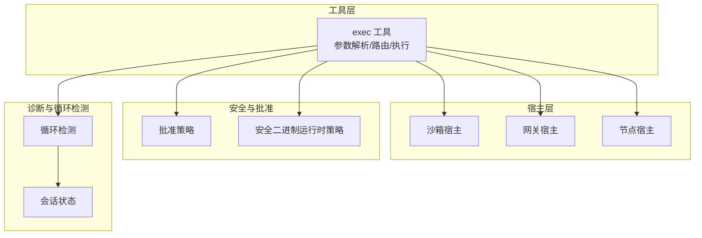
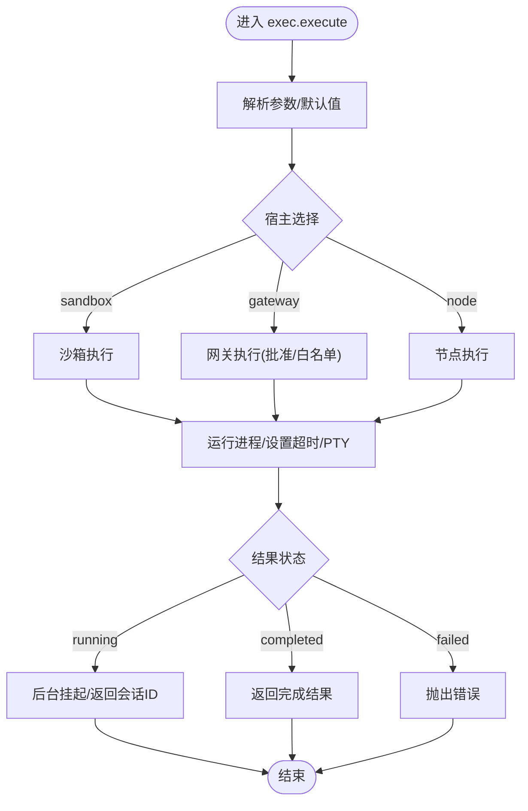
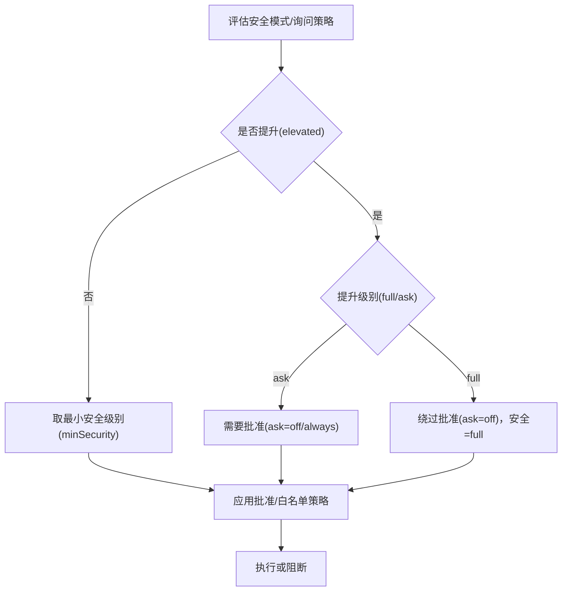
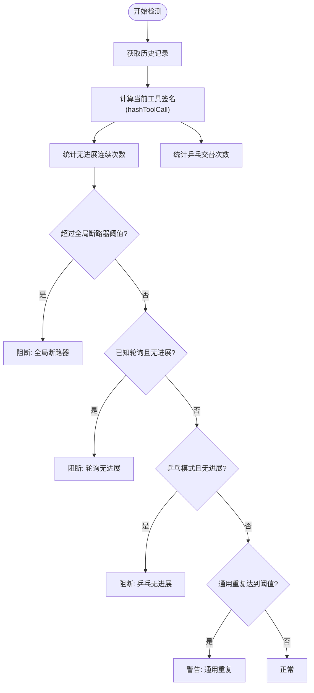
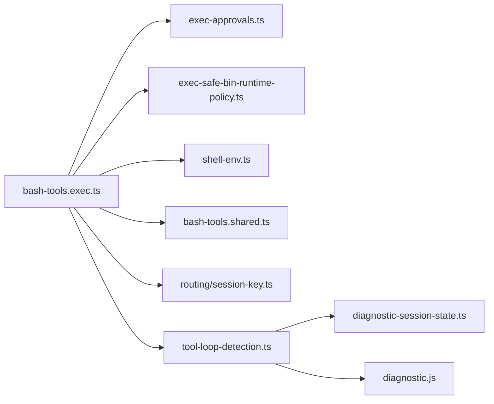

# 工具执行

<cite>
**本文引用的文件**
- [src/agents/bash-tools.exec.ts](file://src/agents/bash-tools.exec.ts)
- [src/agents/bash-tools.exec-runtime.ts](file://src/agents/bash-tools.exec-runtime.ts)
- [src/agents/bash-tools.exec-host-gateway.ts](file://src/agents/bash-tools.exec-host-gateway.ts)
- [src/agents/bash-tools.exec-host-node.ts](file://src/agents/bash-tools.exec-host-node.ts)
- [src/agents/bash-tools.exec-host-shared.ts](file://src/agents/bash-tools.exec-host-shared.ts)
- [src/agents/bash-tools.exec-types.ts](file://src/agents/bash-tools.exec-types.ts)
- [src/agents/bash-tools.shared.ts](file://src/agents/bash-tools.shared.ts)
- [src/agents/tool-loop-detection.ts](file://src/agents/tool-loop-detection.ts)
- [src/agents/pi-tools.before-tool-call.ts](file://src/agents/pi-tools.before-tool-call.ts)
- [src/agents/pi-tools.before-tool-call.runtime.ts](file://src/agents/pi-tools.before-tool-call.runtime.ts)
- [src/agents/cache-trace.ts](file://src/agents/cache-trace.ts)
- [src/agents/pi-tools.safe-bins.test.ts](file://src/agents/pi-tools.safe-bins.test.ts)
- [src/agents/pi-tools.before-tool-call.e2e.test.ts](file://src/agents/pi-tools.before-tool-call.e2e.test.ts)
- [src/config/types.tools.ts](file://src/config/types.tools.ts)
- [src/node-host/invoke-system-run.ts](file://src/node-host/invoke-system-run.ts)
- [src/infra/exec-safe-bin-runtime-policy.ts](file://src/infra/exec-safe-bin-runtime-policy.ts)
- [src/infra/exec-approvals.ts](file://src/infra/exec-approvals.ts)
- [src/infra/shell-env.ts](file://src/infra/shell-env.ts)
- [src/routing/session-key.ts](file://src/routing/session-key.ts)
- [src/logging/diagnostic-session-state.ts](file://src/logging/diagnostic-session-state.ts)
- [src/logging/diagnostic.js](file://src/logging/diagnostic.js)
- [src/agents/benchmarks/exec-performance.ts](file://src/agents/benchmarks/exec-performance.ts)
- [src/agents/benchmarks/exec-memory.ts](file://src/agents/benchmarks/exec-memory.ts)
</cite>

## 目录
1. [简介](#简介)
2. [项目结构](#项目结构)
3. [核心组件](#核心组件)
4. [架构总览](#架构总览)
5. [详细组件分析](#详细组件分析)
6. [依赖关系分析](#依赖关系分析)
7. [性能考量](#性能考量)
8. [故障排查指南](#故障排查指南)
9. [结论](#结论)
10. [附录](#附录)

## 简介
本技术文档围绕“工具执行系统”展开，聚焦以下主题：
- 工具目录管理：如何在不同宿主（沙箱、网关、节点）之间选择与切换，并对 PATH、工作目录与环境变量进行安全治理。
- 执行策略：命令执行流程、超时与后台挂起、PTY 支持、输出截断与聚合。
- 权限控制：执行安全模式（拒绝/白名单/全开）、批准请求与提升（elevated）策略、可信任安全二进制清单与运行时策略。
- 工具显示配置：工具参数校验、默认值与提示信息。
- 状态变更检测与循环调用防护：会话级工具调用历史记录、重复/无进展/乒乓模式检测与分级告警/阻断。
- 安全检查：脚本前检查（Shell 变量注入风险、误写为 JS 的 Shell 命令等）。
- 结果缓存与性能优化：缓存追踪、嵌入缓存、向量索引缓存、批量嵌入与去重。
- 配置选项、调试方法与扩展开发指南：配置类型、钩子与诊断、基准测试与内存分析。

## 项目结构
工具执行系统主要由以下模块构成：
- 工具入口与执行器：负责构建 exec 工具、解析参数、路由到不同宿主并执行。
- 宿主实现：分别针对沙箱、网关、节点三种执行环境提供具体实现。
- 安全与批准：安全模式、批准策略、可信任安全二进制运行时策略。
- 循环检测：基于会话状态的历史记录，检测重复/无进展/乒乓模式。
- 诊断与缓存：会话状态、诊断日志、缓存追踪与嵌入缓存。
- 配置类型：统一的工具配置模型，包括 exec、loopDetection、elevated、fs 等。



**图表来源**
- [src/agents/bash-tools.exec.ts:151-599](file://src/agents/bash-tools.exec.ts#L151-L599)
- [src/agents/bash-tools.exec-host-gateway.ts](file://src/agents/bash-tools.exec-host-gateway.ts)
- [src/agents/bash-tools.exec-host-node.ts](file://src/agents/bash-tools.exec-host-node.ts)
- [src/agents/bash-tools.exec-host-shared.ts](file://src/agents/bash-tools.exec-host-shared.ts)
- [src/agents/tool-loop-detection.ts:372-495](file://src/agents/tool-loop-detection.ts#L372-L495)
- [src/infra/exec-approvals.ts](file://src/infra/exec-approvals.ts)
- [src/infra/exec-safe-bin-runtime-policy.ts](file://src/infra/exec-safe-bin-runtime-policy.ts)

**章节来源**
- [src/agents/bash-tools.exec.ts:151-599](file://src/agents/bash-tools.exec.ts#L151-L599)
- [src/config/types.tools.ts:228-275](file://src/config/types.tools.ts#L228-L275)

## 核心组件
- exec 工具：统一的命令执行入口，支持后台挂起、PTY、超时、输出聚合与会话通知。
- 宿主实现：
  - 沙箱：受限环境，使用容器或隔离工作区，严格路径与环境控制。
  - 网关：通过白名单与批准策略进行安全控制，必要时回退到本地 PATH。
  - 节点：在指定节点上执行，忽略请求级 PATH 覆盖，需在节点侧配置 PATH。
- 安全与批准：最小安全级别与最大询问策略组合；提升模式（ask/full）与批准绕过。
- 循环检测：基于稳定哈希的工具签名与结果哈希，识别重复/无进展/乒乓模式。
- 诊断与缓存：会话状态记录工具调用历史；缓存追踪与嵌入缓存配置。

**章节来源**
- [src/agents/bash-tools.exec.ts:209-594](file://src/agents/bash-tools.exec.ts#L209-L594)
- [src/agents/tool-loop-detection.ts:372-588](file://src/agents/tool-loop-detection.ts#L372-L588)
- [src/agents/cache-trace.ts:1-44](file://src/agents/cache-trace.ts#L1-L44)

## 架构总览
下图展示从工具调用到执行完成的关键交互，包括参数归一化、批准与安全策略评估、宿主路由、执行与结果返回。

```mermaid
sequenceDiagram
    participant Caller as "调用方"
    participant Exec as "exec 工具"
    participant Norm as "参数归一化"
    participant Appr as "批准/安全策略"
    participant Host as "宿主执行器"
    participant Proc as "进程运行"
    participant Loop as "循环检测"
    
    Caller->>Exec: "调用 exec 工具"
    Exec->>Norm: "标准化 host/security/ask/env/path"
    Exec->>Appr: "评估安全模式/批准/提升(elevated)"
    Exec->>Host: "路由到 sandbox/gateway/node"
    Host->>Proc: "启动进程/设置超时/PTY"
    Proc-->>Host: "运行中/完成/失败"
    Host-->>Exec: "返回结果/会话ID"
    Exec->>Loop: "记录调用历史/结果哈希"
    Exec-->>Caller: "返回工具结果"
```

**图表来源**
- [src/agents/bash-tools.exec.ts:209-594](file://src/agents/bash-tools.exec.ts#L209-L594)
- [src/agents/bash-tools.exec-runtime.ts](file://src/agents/bash-tools.exec-runtime.ts)
- [src/agents/bash-tools.exec-host-gateway.ts](file://src/agents/bash-tools.exec-host-gateway.ts)
- [src/agents/bash-tools.exec-host-node.ts](file://src/agents/bash-tools.exec-host-node.ts)
- [src/agents/tool-loop-detection.ts:501-588](file://src/agents/tool-loop-detection.ts#L501-L588)

## 详细组件分析

### 组件A：exec 工具与执行策略
- 参数解析与默认值：包括命令、工作目录、环境变量、后台挂起窗口、超时、PTY、提升模式、宿主、安全模式、询问策略、节点绑定等。
- 宿主路由：
  - sandbox：需要沙箱可用，否则报错；环境变量直接透传，PATH 由沙箱策略决定。
  - gateway：通过批准与白名单策略，必要时应用 shell PATH；支持 PTY（非沙箱）。
  - node：在指定节点执行，忽略请求级 PATH 覆盖。
- 安全与批准：
  - 安全模式：deny ≤ allowlist ≤ full，取最小安全级别。
  - 询问策略：on-miss ≤ always，取最大询问级别。
  - 提升（elevated）：ask 模式需要批准，full 模式可绕过批准但安全降级为 full。
- 输出与会话：
  - 后台挂起：根据 yieldMs 或 background 自动挂起并返回会话 ID。
  - 超时：显式超时优先，否则按策略计算；后台挂起可无限等待直到手动轮询。
  - PTY：终端 UI/交互命令启用。
  - 通知：退出事件与心跳，空成功可选通知。
- 脚本前检查：
  - 检测 Shell 变量语法泄漏到 Python/JS 文件。
  - 检测以 NODE 开头的行疑似把 Shell 命令误写为 JS。



**图表来源**
- [src/agents/bash-tools.exec.ts:209-594](file://src/agents/bash-tools.exec.ts#L209-L594)

**章节来源**
- [src/agents/bash-tools.exec.ts:151-599](file://src/agents/bash-tools.exec.ts#L151-L599)
- [src/agents/bash-tools.exec-runtime.ts](file://src/agents/bash-tools.exec-runtime.ts)
- [src/agents/bash-tools.exec-host-gateway.ts](file://src/agents/bash-tools.exec-host-gateway.ts)
- [src/agents/bash-tools.exec-host-node.ts](file://src/agents/bash-tools.exec-host-node.ts)

### 组件B：权限控制与批准策略
- 安全模式与询问策略：
  - 安全模式：deny（默认沙箱）、allowlist（网关/节点）、full（提升）。
  - 询问策略：on-miss（缺失时询问）、always（总是询问）、off（不询问）。
- 提升（elevated）：
  - ask：需要批准后执行，full：无需批准但安全降级为 full。
  - gate：tools.elevated.enabled 与 allowFrom 配置。
- 可信任安全二进制（safeBins）：
  - 运行时策略：合并全局与局部配置，未配置 profile 的条目会被忽略并发出警告。
  - 解析与校验：可信目录、解释器安全策略、未配置条目的风险提示。



**图表来源**
- [src/agents/bash-tools.exec.ts:321-334](file://src/agents/bash-tools.exec.ts#L321-L334)
- [src/infra/exec-approvals.ts](file://src/infra/exec-approvals.ts)
- [src/infra/exec-safe-bin-runtime-policy.ts](file://src/infra/exec-safe-bin-runtime-policy.ts)

**章节来源**
- [src/agents/bash-tools.exec.ts:258-303](file://src/agents/bash-tools.exec.ts#L258-L303)
- [src/agents/pi-tools.safe-bins.test.ts:89-138](file://src/agents/pi-tools.safe-bins.test.ts#L89-L138)

### 组件C：工具显示配置与参数校验
- 工具参数 schema：命令必填、工作目录、环境变量、后台挂起、超时、PTY、提升、宿主、安全、询问、节点等。
- 默认值与提示：对后台挂起窗口、超时、PATH 前缀、通知行为等提供合理默认值与用户提示。
- 环境变量处理：沙箱直通，宿主侧进行严格校验后再合并。

**章节来源**
- [src/agents/bash-tools.exec.ts:208-209](file://src/agents/bash-tools.exec.ts#L208-L209)
- [src/agents/bash-tools.exec-types.ts](file://src/agents/bash-tools.exec-types.ts)

### 组件D：状态变更检测与循环调用防护
- 会话状态：每个会话维护工具调用历史，包含工具名、参数稳定哈希、结果哈希、时间戳、工具调用 ID。
- 稳定哈希：对参数与结果进行稳定序列化与 SHA256 哈希，确保跨轮次比较一致。
- 检测器：
  - 通用重复：相同工具+参数重复调用达到阈值触发警告/阻断。
  - 已知轮询无进展：对 command_status/process(poll/log) 等工具，若多次返回相同结果则判定为无进展。
  - 全局电路断路器：累计无进展达到更高阈值直接阻断。
  - 乒乓模式：交替调用两个工具且双方结果稳定，判定为无进展。
- 分级告警：warning/critical；阻断时提供检测器标识与统计信息。



**图表来源**
- [src/agents/tool-loop-detection.ts:372-495](file://src/agents/tool-loop-detection.ts#L372-L495)

**章节来源**
- [src/agents/tool-loop-detection.ts:1-624](file://src/agents/tool-loop-detection.ts#L1-L624)
- [src/agents/pi-tools.before-tool-call.ts:61-106](file://src/agents/pi-tools.before-tool-call.ts#L61-L106)
- [src/agents/pi-tools.before-tool-call.runtime.ts:1-7](file://src/agents/pi-tools.before-tool-call.runtime.ts#L1-L7)
- [src/agents/pi-tools.before-tool-call.e2e.test.ts:113-152](file://src/agents/pi-tools.before-tool-call.e2e.test.ts#L113-L152)

### 组件E：安全检查与脚本前检查
- Shell 注入风险：检测 Python/JS 脚本中出现的 $VAR 形式的 Shell 变量语法，提示改用语言内置方式。
- JS 误写：检测以 NODE 开头的行，提示可能是 Shell 命令被误写为 JS。
- 小文件限制：仅对小于一定大小的脚本进行扫描，避免大文件带来的性能问题。

**章节来源**
- [src/agents/bash-tools.exec.ts:80-149](file://src/agents/bash-tools.exec.ts#L80-L149)

### 组件F：结果缓存与性能优化
- 缓存追踪：可配置开启，将缓存阶段事件写入文件，便于诊断缓存命中与写入行为。
- 嵌入缓存：向量嵌入缓存、索引缓存、批量嵌入与等待策略、MMR 重排与时间衰减等。
- 性能基准：提供执行性能与内存占用的基准测试文件，便于回归与优化。

**章节来源**
- [src/agents/cache-trace.ts:1-44](file://src/agents/cache-trace.ts#L1-L44)
- [src/config/types.tools.ts:371-443](file://src/config/types.tools.ts#L371-L443)
- [src/agents/benchmarks/exec-performance.ts](file://src/agents/benchmarks/exec-performance.ts)
- [src/agents/benchmarks/exec-memory.ts](file://src/agents/benchmarks/exec-memory.ts)

## 依赖关系分析
- 工具入口依赖：
  - 安全与批准：exec-approvals、exec-safe-bin-runtime-policy。
  - 环境与路径：shell-env、bash-tools.shared。
  - 会话与路由：routing/session-key。
  - 诊断：logging/diagnostic-session-state、logging/diagnostic。
- 宿主实现：
  - bash-tools.exec-host-gateway.ts：网关白名单与批准逻辑。
  - bash-tools.exec-host-node.ts：节点执行命令。
  - bash-tools.exec-host-shared.ts：共享逻辑。
- 循环检测：
  - 依赖会话状态与稳定哈希函数。



**图表来源**
- [src/agents/bash-tools.exec.ts:1-50](file://src/agents/bash-tools.exec.ts#L1-L50)
- [src/agents/tool-loop-detection.ts:1-10](file://src/agents/tool-loop-detection.ts#L1-L10)
- [src/routing/session-key.ts](file://src/routing/session-key.ts)

**章节来源**
- [src/agents/bash-tools.exec.ts:1-50](file://src/agents/bash-tools.exec.ts#L1-L50)
- [src/agents/tool-loop-detection.ts:1-10](file://src/agents/tool-loop-detection.ts#L1-L10)

## 性能考量
- 后台挂起与超时：合理设置 yieldMs/background 与 timeoutSec，避免长时间阻塞；后台挂起可配合 process 工具轮询。
- 输出截断与聚合：限制单次输出大小，减少上下文膨胀与传输成本。
- 缓存策略：启用嵌入缓存与索引缓存，合理设置批量与等待策略，降低重复计算。
- 路径与环境：在网关宿主应用 PATH 前缀，避免查找失败导致的重试与延迟。
- 脚本前检查：在执行前快速发现潜在问题，避免在循环中浪费资源。

[本节为通用指导，无需特定文件引用]

## 故障排查指南
- 提升（elevated）不可用：
  - 检查 tools.elevated.enabled 与 allowFrom 配置。
  - 确认运行时（sandboxed/direct）与 gate 是否满足。
- 宿主选择错误：
  - sandbox：确认会话沙箱模式已启用。
  - node：确认节点绑定与服务可用。
- 安全模式与批准：
  - deny 模式无法执行；allowlist 未匹配；full 模式绕过批准但需谨慎。
- 循环检测触发：
  - 查看工具调用统计与最近历史，调整轮询间隔或改为一次性任务。
- 缓存异常：
  - 启用缓存追踪，定位缓存命中率与写入行为；检查嵌入缓存配置与批量策略。

**章节来源**
- [src/agents/bash-tools.exec.ts:342-348](file://src/agents/bash-tools.exec.ts#L342-L348)
- [src/agents/tool-loop-detection.ts:593-623](file://src/agents/tool-loop-detection.ts#L593-L623)
- [src/agents/cache-trace.ts:1-44](file://src/agents/cache-trace.ts#L1-L44)

## 结论
工具执行系统通过“参数归一化 + 安全与批准策略 + 多宿主路由 + 循环检测 + 缓存与性能优化”的设计，在保证安全性的同时提供了灵活、可观测、可扩展的执行能力。推荐在生产环境中启用循环检测、严格的批准策略与合理的缓存配置，并结合诊断与基准测试持续优化。

[本节为总结性内容，无需特定文件引用]

## 附录

### 配置选项速览（节选）
- exec 工具配置要点：
  - host：sandbox/gateway/node，默认 sandbox。
  - security：deny/allowlist/full，默认 sandbox=deny，gateway/node=allowlist。
  - ask：off/on-miss/always，默认 on-miss。
  - backgroundMs/timeoutSec/approvalRunningNoticeMs：后台挂起与超时策略。
  - notifyOnExit/notifyOnExitEmptySuccess：退出通知策略。
  - safeBins/safeBinProfiles/safeBinTrustedDirs：可信任安全二进制清单与配置。
- loopDetection 配置要点：
  - enabled/historySize/warningThreshold/criticalThreshold/globalCircuitBreakerThreshold。
  - detectors：genericRepeat/knownPollNoProgress/pingPong。
- elevated 配置要点：
  - enabled/allowFrom：启用与允许来源。

**章节来源**
- [src/config/types.tools.ts:228-275](file://src/config/types.tools.ts#L228-L275)
- [src/config/types.tools.ts:153-166](file://src/config/types.tools.ts#L153-L166)
- [src/config/types.tools.ts:591-597](file://src/config/types.tools.ts#L591-L597)

### 调试方法
- 启用缓存追踪：在诊断配置中开启缓存追踪并指定文件路径。
- 观察会话状态：通过工具调用统计与历史记录定位问题。
- 使用 e2e 测试：参考 before-tool-call e2e 测试用例验证循环检测行为。

**章节来源**
- [src/agents/cache-trace.ts:1-44](file://src/agents/cache-trace.ts#L1-L44)
- [src/agents/tool-loop-detection.ts:593-623](file://src/agents/tool-loop-detection.ts#L593-L623)
- [src/agents/pi-tools.before-tool-call.e2e.test.ts:113-152](file://src/agents/pi-tools.before-tool-call.e2e.test.ts#L113-L152)

### 扩展开发指南
- 新增工具：遵循 AgentTool 接口，提供参数 schema、execute 实现与必要的安全检查。
- 宿主扩展：在 exec-host-* 中添加新宿主逻辑，确保与批准与安全策略对接。
- 循环检测增强：在 tool-loop-detection 中新增检测器或调整阈值，注意稳定性与性能。
- 钩子集成：在 before-tool-call 钩子中记录调用与结果，便于诊断与审计。

**章节来源**
- [src/agents/bash-tools.exec.ts:209-594](file://src/agents/bash-tools.exec.ts#L209-L594)
- [src/agents/tool-loop-detection.ts:372-495](file://src/agents/tool-loop-detection.ts#L372-L495)
- [src/agents/pi-tools.before-tool-call.ts:91-106](file://src/agents/pi-tools.before-tool-call.ts#L91-L106)