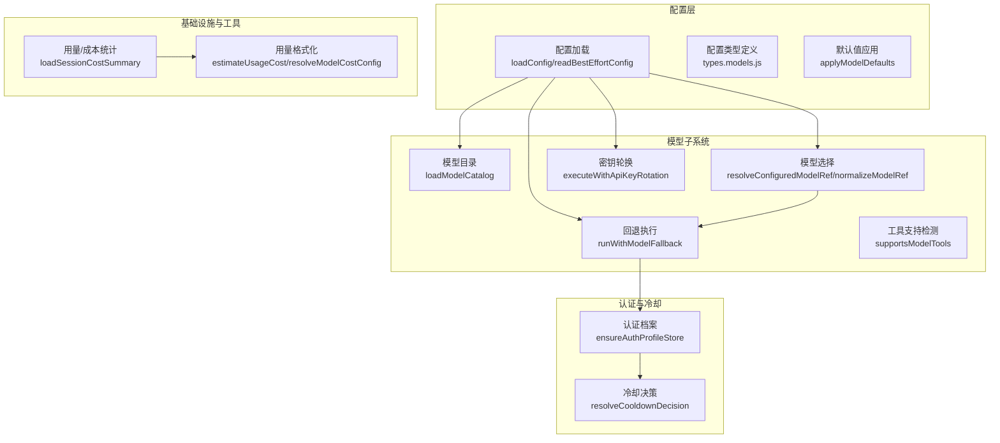
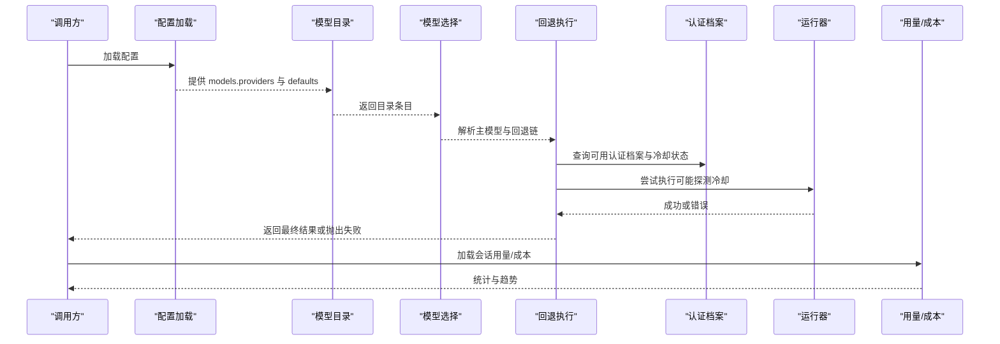
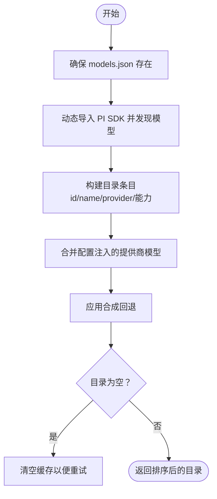
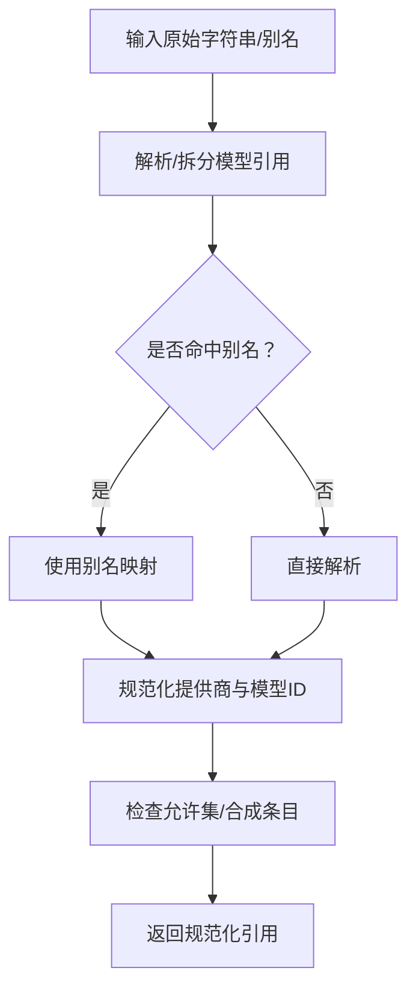
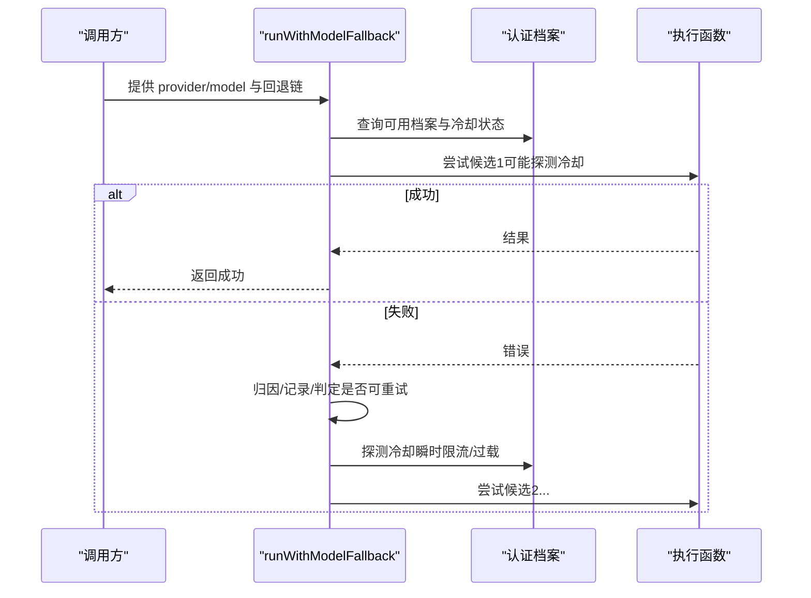
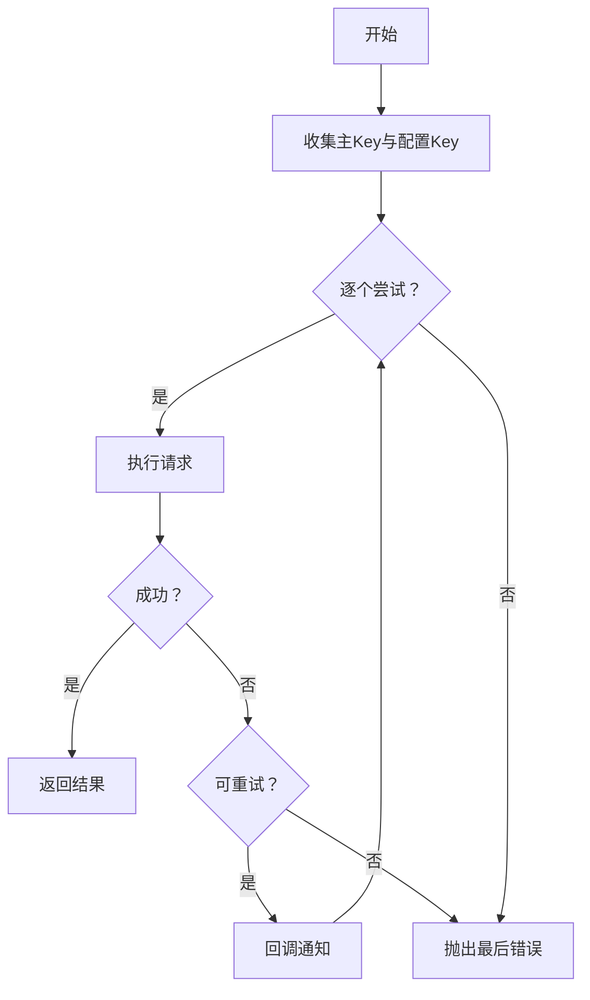
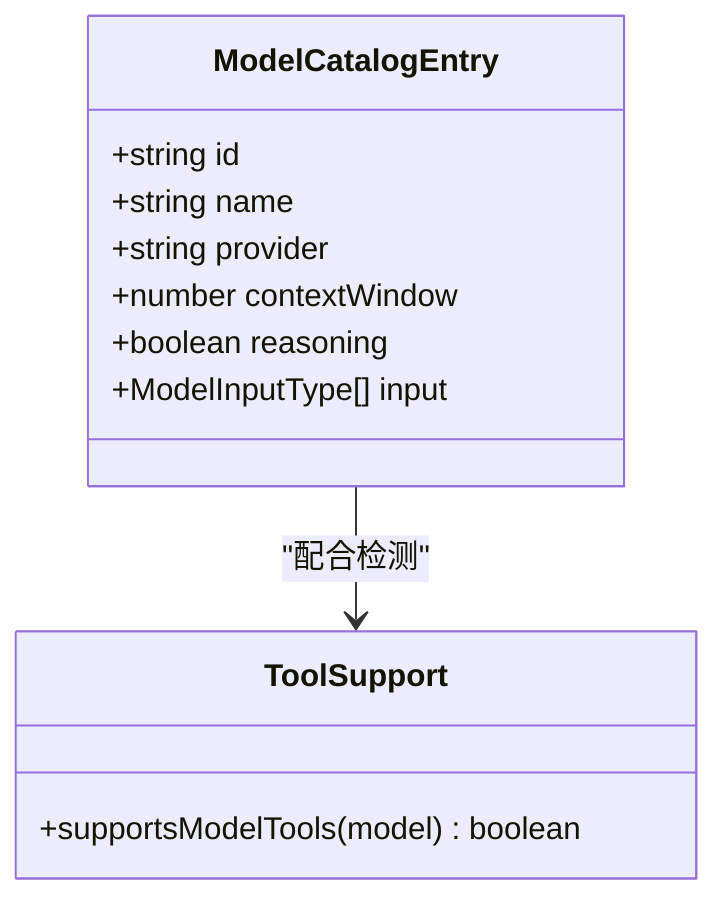
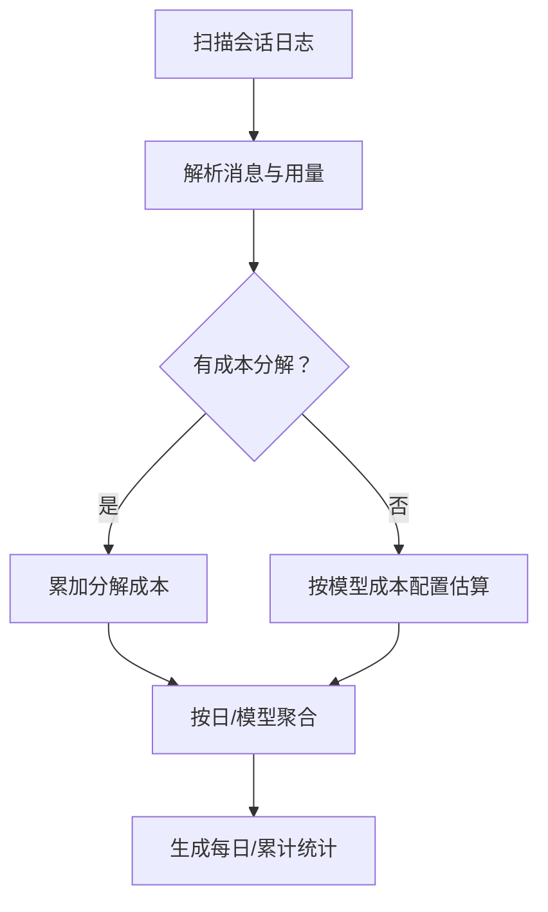
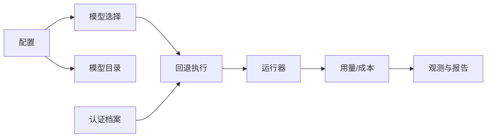

# 模型集成

<cite>
**本文引用的文件**
- [src/agents/model-catalog.ts](file://src/agents/model-catalog.ts)
- [src/agents/model-selection.ts](file://src/agents/model-selection.ts)
- [src/agents/model-fallback.ts](file://src/agents/model-fallback.ts)
- [src/agents/model-tool-support.ts](file://src/agents/model-tool-support.ts)
- [src/agents/api-key-rotation.ts](file://src/agents/api-key-rotation.ts)
- [src/agents/pi-embedded-runner/run.ts](file://src/agents/pi-embedded-runner/run.ts)
- [src/agents/agent-scope.ts](file://src/agents/agent-scope.ts)
- [src/agents/model-fallback.types.ts](file://src/agents/model-fallback.types.ts)
- [src/agents/failover-error.ts](file://src/agents/failover-error.ts)
- [src/agents/pi-embedded-helpers.ts](file://src/agents/pi-embedded-helpers.ts)
- [src/agents/model-fallback-observation.ts](file://src/agents/model-fallback-observation.ts)
- [src/agents/auth-profiles.ts](file://src/agents/auth-profiles.ts)
- [src/agents/model-ref-profile.ts](file://src/agents/model-ref-profile.ts)
- [src/agents/models-config.providers.ts](file://src/agents/models-config.providers.ts)
- [src/agents/defaults.ts](file://src/agents/defaults.ts)
- [src/agents/usage.ts](file://src/agents/usage.ts)
- [src/utils/usage-format.ts](file://src/utils/usage-format.ts)
- [src/infra/session-cost-usage.ts](file://src/infra/session-cost-usage.ts)
- [src/config/config.ts](file://src/config/config.ts)
- [src/config/io.js](file://src/config/io.js)
- [src/config/types.models.js](file://src/config/types.models.js)
- [src/config/defaults.ts](file://src/config/defaults.ts)
- [src/commands/doctor-auth.ts](file://src/commands/doctor-auth.ts)
- [src/commands/doctor-config-analysis.ts](file://src/commands/doctor-config-analysis.ts)
- [docs/concepts/model-failover.md](file://docs/concepts/model-failover.md)
- [docs/concepts/model-providers.md](file://docs/concepts/model-providers.md)
- [docs/providers/index.md](file://docs/providers/index.md)
- [extensions/open-prose/skills/prose/lib/cost-analyzer.prose](file://extensions/open-prose/skills/prose/lib/cost-analyzer.prose)
</cite>

## 目录
1. [简介](#简介)
2. [项目结构](#项目结构)
3. [核心组件](#核心组件)
4. [架构总览](#架构总览)
5. [详细组件分析](#详细组件分析)
6. [依赖关系分析](#依赖关系分析)
7. [性能考量](#性能考量)
8. [故障排查指南](#故障排查指南)
9. [结论](#结论)
10. [附录：新模型集成与最佳实践](#附录新模型集成与最佳实践)

## 简介
本技术文档面向“模型集成系统”，围绕以下主题进行系统化说明：
- 模型目录管理：模型目录发现、合成回退、能力标注与合并
- 配置加载与选择策略：默认值、别名、规范化、允许集与回退链
- 回退机制：多候选模型的执行与失败处理、冷却探测与重试
- 能力检测与兼容性：输入类型、推理能力、工具支持
- 认证与密钥轮换：认证档案、可用性判定、轮换与健康检查
- 错误处理：失败归因、超时识别、非可重试错误保护
- 性能监控与成本控制：会话级用量统计、成本估算与趋势分析
- 新模型集成指南与最佳实践

## 项目结构
模型集成相关代码主要分布在 agents 子系统与 config 子系统中，并通过基础设施层（infra）与工具层（utils）完成成本与用量统计。

图示来源
- [src/config/config.ts](file://src/config/config.ts)
- [src/config/types.models.js](file://src/config/types.models.js)
- [src/config/defaults.ts](file://src/config/defaults.ts)
- [src/agents/model-catalog.ts](file://src/agents/model-catalog.ts)
- [src/agents/model-selection.ts](file://src/agents/model-selection.ts)
- [src/agents/model-fallback.ts](file://src/agents/model-fallback.ts)
- [src/agents/model-tool-support.ts](file://src/agents/model-tool-support.ts)
- [src/agents/api-key-rotation.ts](file://src/agents/api-key-rotation.ts)
- [src/agents/auth-profiles.ts](file://src/agents/auth-profiles.ts)
- [src/infra/session-cost-usage.ts](file://src/infra/session-cost-usage.ts)
- [src/utils/usage-format.ts](file://src/utils/usage-format.ts)

章节来源
- [src/config/config.ts](file://src/config/config.ts)
- [src/agents/model-catalog.ts](file://src/agents/model-catalog.ts)
- [src/agents/model-selection.ts](file://src/agents/model-selection.ts)
- [src/agents/model-fallback.ts](file://src/agents/model-fallback.ts)
- [src/agents/api-key-rotation.ts](file://src/agents/api-key-rotation.ts)
- [src/infra/session-cost-usage.ts](file://src/infra/session-cost-usage.ts)

## 核心组件
- 模型目录管理：负责从本地与外部源加载模型目录，合并配置注入的提供商模型，应用合成回退，保证目录完整性与可用性。
- 模型选择与规范化：解析用户输入、别名与允许集，标准化模型引用，提供默认模型解析与代理模型映射。
- 回退执行：按候选顺序尝试调用，结合认证冷却状态与错误类型进行智能探测与跳过，记录回退决策并输出诊断日志。
- 工具支持与能力检测：基于目录条目与模型兼容标记判断是否支持工具调用。
- 认证与密钥轮换：维护认证档案可用性，按冷却状态决定探测时机；对请求失败进行密钥轮换与重试。
- 成本与用量统计：扫描会话日志，聚合 token 与成本，生成每日/累计统计与趋势分析。

章节来源
- [src/agents/model-catalog.ts](file://src/agents/model-catalog.ts)
- [src/agents/model-selection.ts](file://src/agents/model-selection.ts)
- [src/agents/model-fallback.ts](file://src/agents/model-fallback.ts)
- [src/agents/model-tool-support.ts](file://src/agents/model-tool-support.ts)
- [src/agents/api-key-rotation.ts](file://src/agents/api-key-rotation.ts)
- [src/infra/session-cost-usage.ts](file://src/infra/session-cost-usage.ts)

## 架构总览
下图展示从配置到模型目录、选择、回退与用量统计的关键交互路径。

图示来源
- [src/config/config.ts](file://src/config/config.ts)
- [src/agents/model-catalog.ts](file://src/agents/model-catalog.ts)
- [src/agents/model-selection.ts](file://src/agents/model-selection.ts)
- [src/agents/model-fallback.ts](file://src/agents/model-fallback.ts)
- [src/agents/auth-profiles.ts](file://src/agents/auth-profiles.ts)
- [src/infra/session-cost-usage.ts](file://src/infra/session-cost-usage.ts)

## 详细组件分析

### 模型目录管理（loadModelCatalog）
- 动态加载与缓存：延迟初始化模型目录，捕获动态导入异常以避免缓存污染；在无结果时不清空缓存，以便后续重试。
- 合并配置注入：读取配置中的提供商模型列表并去重合并，确保用户显式配置优先。
- 合成回退：当目录中缺少某些模板模型时，基于已存在模板生成合成条目，提升兼容性。
- 能力标注：支持上下文窗口、推理能力、输入类型等元数据，便于后续选择与能力检测。

图示来源
- [src/agents/model-catalog.ts](file://src/agents/model-catalog.ts)

章节来源
- [src/agents/model-catalog.ts](file://src/agents/model-catalog.ts)

### 模型选择与规范化（resolveConfiguredModelRef / normalizeModelRef）
- 别名索引：支持将别名映射到具体模型引用，便于在配置中使用简短名称。
- 规范化：统一提供商 ID、模型 ID（含特殊提供商映射），保证跨后端一致性。
- 允许集：根据 agents.defaults.models 构建允许键集合，未在目录中的键可作为“合成条目”加入。
- 默认回退：当默认提供商不可用时，自动选择首个可用提供商的第一个模型，避免陈旧默认值误导。

图示来源
- [src/agents/model-selection.ts](file://src/agents/model-selection.ts)

章节来源
- [src/agents/model-selection.ts](file://src/agents/model-selection.ts)

### 回退执行（runWithModelFallback）
- 候选生成：优先主模型，再按配置回退链追加；同提供商场景使用完整回退链，跨提供商仅保留已配置链中的元素。
- 冷却探测：当所有认证档案处于冷却时，依据原因与阈值决定是否探测（如接近到期或瞬时限流/过载），并限制每运行一次的探测次数。
- 失败归因：将未知错误转换为可归因的回退错误，区分超时、上下文溢出等不可重试情形；上下文溢出错误直接上抛，避免更差的回退。
- 决策记录：记录每次候选的尝试、原因与状态，便于诊断与观测。

图示来源
- [src/agents/model-fallback.ts](file://src/agents/model-fallback.ts)
- [src/agents/auth-profiles.ts](file://src/agents/auth-profiles.ts)
- [src/agents/failover-error.ts](file://src/agents/failover-error.ts)
- [src/agents/pi-embedded-helpers.ts](file://src/agents/pi-embedded-helpers.ts)
- [src/agents/model-fallback-observation.ts](file://src/agents/model-fallback-observation.ts)

章节来源
- [src/agents/model-fallback.ts](file://src/agents/model-fallback.ts)
- [src/agents/auth-profiles.ts](file://src/agents/auth-profiles.ts)
- [src/agents/failover-error.ts](file://src/agents/failover-error.ts)
- [src/agents/pi-embedded-helpers.ts](file://src/agents/pi-embedded-helpers.ts)
- [src/agents/model-fallback-observation.ts](file://src/agents/model-fallback-observation.ts)

### 认证与密钥轮换
- 认证档案：集中管理各提供商的认证档案，支持冷却状态、可用性与探测逻辑。
- 密钥轮换：收集同一提供商的多个 API Key，按速率限制等条件逐个重试，实现自动切换与容错。

图示来源
- [src/agents/api-key-rotation.ts](file://src/agents/api-key-rotation.ts)
- [src/agents/pi-embedded-runner/run.ts](file://src/agents/pi-embedded-runner/run.ts)
- [src/commands/doctor-auth.ts](file://src/commands/doctor-auth.ts)

章节来源
- [src/agents/api-key-rotation.ts](file://src/agents/api-key-rotation.ts)
- [src/agents/pi-embedded-runner/run.ts](file://src/agents/pi-embedded-runner/run.ts)
- [src/commands/doctor-auth.ts](file://src/commands/doctor-auth.ts)

### 能力检测与兼容性
- 输入类型：基于目录条目判断模型是否支持图像/文档输入，用于媒体理解与工具链适配。
- 推理能力：根据目录与模型参数设置默认推理级别，兼顾性能与质量。
- 工具支持：通过 compat 标记判断模型是否支持工具调用，默认开启。

图示来源
- [src/agents/model-catalog.ts](file://src/agents/model-catalog.ts)
- [src/agents/model-tool-support.ts](file://src/agents/model-tool-support.ts)

章节来源
- [src/agents/model-catalog.ts](file://src/agents/model-catalog.ts)
- [src/agents/model-tool-support.ts](file://src/agents/model-tool-support.ts)

### 性能监控与成本控制
- 用量统计：扫描会话日志，解析消息、用量与成本，支持成本分解与估算。
- 成本汇总：按日/模型/工具维度聚合 token 与成本，计算延迟统计与趋势。
- 成本分析：提供技能脚本用于分析运行成本、热点与优化建议。

图示来源
- [src/infra/session-cost-usage.ts](file://src/infra/session-cost-usage.ts)
- [src/utils/usage-format.ts](file://src/utils/usage-format.ts)

章节来源
- [src/infra/session-cost-usage.ts](file://src/infra/session-cost-usage.ts)
- [src/utils/usage-format.ts](file://src/utils/usage-format.ts)
- [extensions/open-prose/skills/prose/lib/cost-analyzer.prose](file://extensions/open-prose/skills/prose/lib/cost-analyzer.prose)

## 依赖关系分析
- 配置层：提供 models.providers、agents.defaults 与默认值应用，驱动目录与选择策略。
- 模型子系统：目录、选择、回退、工具支持与密钥轮换相互协作，形成闭环。
- 认证与冷却：回退执行依赖认证状态与冷却探测，避免无效尝试。
- 基础设施与工具：用量/成本统计依赖会话日志与成本配置，输出可观测性指标。

图示来源
- [src/config/config.ts](file://src/config/config.ts)
- [src/agents/model-selection.ts](file://src/agents/model-selection.ts)
- [src/agents/model-catalog.ts](file://src/agents/model-catalog.ts)
- [src/agents/model-fallback.ts](file://src/agents/model-fallback.ts)
- [src/agents/auth-profiles.ts](file://src/agents/auth-profiles.ts)
- [src/infra/session-cost-usage.ts](file://src/infra/session-cost-usage.ts)

章节来源
- [src/config/config.ts](file://src/config/config.ts)
- [src/agents/model-selection.ts](file://src/agents/model-selection.ts)
- [src/agents/model-catalog.ts](file://src/agents/model-catalog.ts)
- [src/agents/model-fallback.ts](file://src/agents/model-fallback.ts)
- [src/agents/auth-profiles.ts](file://src/agents/auth-profiles.ts)
- [src/infra/session-cost-usage.ts](file://src/infra/session-cost-usage.ts)

## 性能考量
- 回退链长度与顺序：合理设置回退链，减少不必要的探测与重试。
- 冷却探测节流：内置探测间隔与容量限制，避免频繁探测导致抖动。
- 上下文溢出保护：对可能的上下文溢出错误直接上抛，避免劣化回退。
- 成本估算与分解：优先使用成本分解，缺失时按模型配置估算，减少偏差。
- 日志与观测：通过回退观测模块记录决策，辅助定位瓶颈与异常。

## 故障排查指南
- 认证健康检查：使用诊断命令刷新 OAuth，输出认证问题摘要与修复建议。
- 配置分析：检查 include 路径、提供商覆盖与路由影响，必要时移除覆盖以恢复 per-model 路由与成本。
- 回退失败：查看回退失败摘要与逐项尝试记录，确认是否为超时、上下文溢出或永久性错误。
- 密钥轮换：确认是否正确收集了多个 API Key，以及是否触发了速率限制重试。

章节来源
- [src/commands/doctor-auth.ts](file://src/commands/doctor-auth.ts)
- [src/commands/doctor-config-analysis.ts](file://src/commands/doctor-config-analysis.ts)
- [src/agents/model-fallback.ts](file://src/agents/model-fallback.ts)
- [src/agents/api-key-rotation.ts](file://src/agents/api-key-rotation.ts)

## 结论
该模型集成系统通过“目录—选择—回退—认证—用量”的完整链路，实现了高可用、可观测与可扩展的模型运行框架。其关键优势包括：
- 强大的目录管理与合成回退，提升兼容性与鲁棒性
- 智能的回退策略与冷却探测，平衡成功率与资源消耗
- 完整的成本与用量统计，支撑成本控制与性能优化
- 清晰的配置与类型体系，便于新模型快速接入与治理

## 附录：新模型集成与最佳实践
- 新增提供商模型
  - 在配置中添加 models.providers.<provider>.models 列表，包含 id、name、contextWindow、reasoning、input 等字段。
  - 若模型尚未收录于目录，系统会将其作为“合成条目”加入，但仍建议同步更新目录源。
- 设置回退链
  - 在 agents.defaults.model.fallbacks 中按优先级列出回退模型，系统将按顺序尝试。
  - 对于跨提供商场景，仅保留已在链中的模型，避免无关回退。
- 认证与密钥
  - 为每个提供商配置认证档案，必要时启用密钥轮换以应对速率限制。
  - 使用诊断命令定期检查认证健康状况，及时刷新过期凭据。
- 能力与工具
  - 在目录条目中标注 input 与 reasoning，确保工具链与推理策略正确生效。
  - 如需禁用工具，请在模型 compat 中明确标记。
- 成本与监控
  - 开启成本分解，确保用量与成本准确统计。
  - 使用会话成本分析与趋势报告，持续优化模型与参数。

章节来源
- [src/config/types.models.js](file://src/config/types.models.js)
- [src/config/defaults.ts](file://src/config/defaults.ts)
- [src/agents/model-catalog.ts](file://src/agents/model-catalog.ts)
- [src/agents/model-selection.ts](file://src/agents/model-selection.ts)
- [src/agents/model-fallback.ts](file://src/agents/model-fallback.ts)
- [src/agents/api-key-rotation.ts](file://src/agents/api-key-rotation.ts)
- [src/infra/session-cost-usage.ts](file://src/infra/session-cost-usage.ts)
- [docs/concepts/model-failover.md](file://docs/concepts/model-failover.md)
- [docs/concepts/model-providers.md](file://docs/concepts/model-providers.md)
- [docs/providers/index.md](file://docs/providers/index.md)