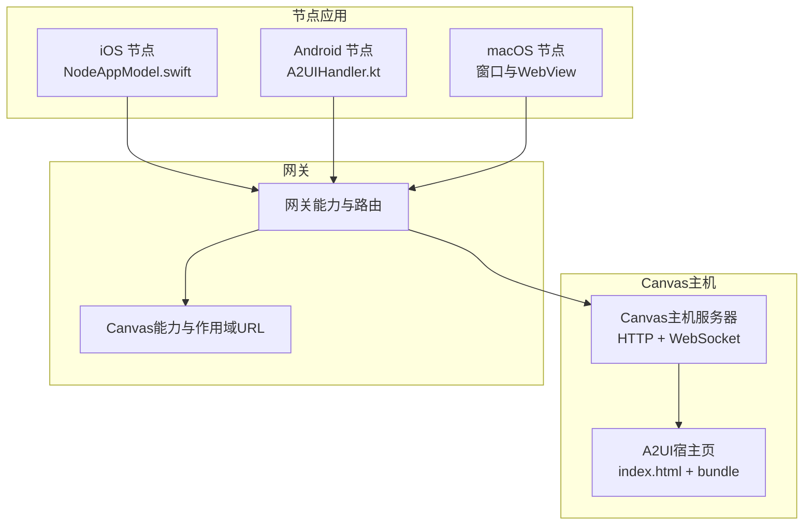
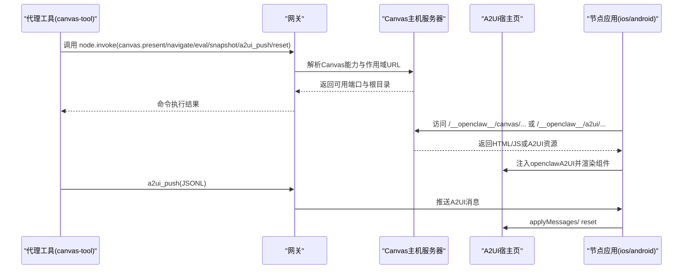
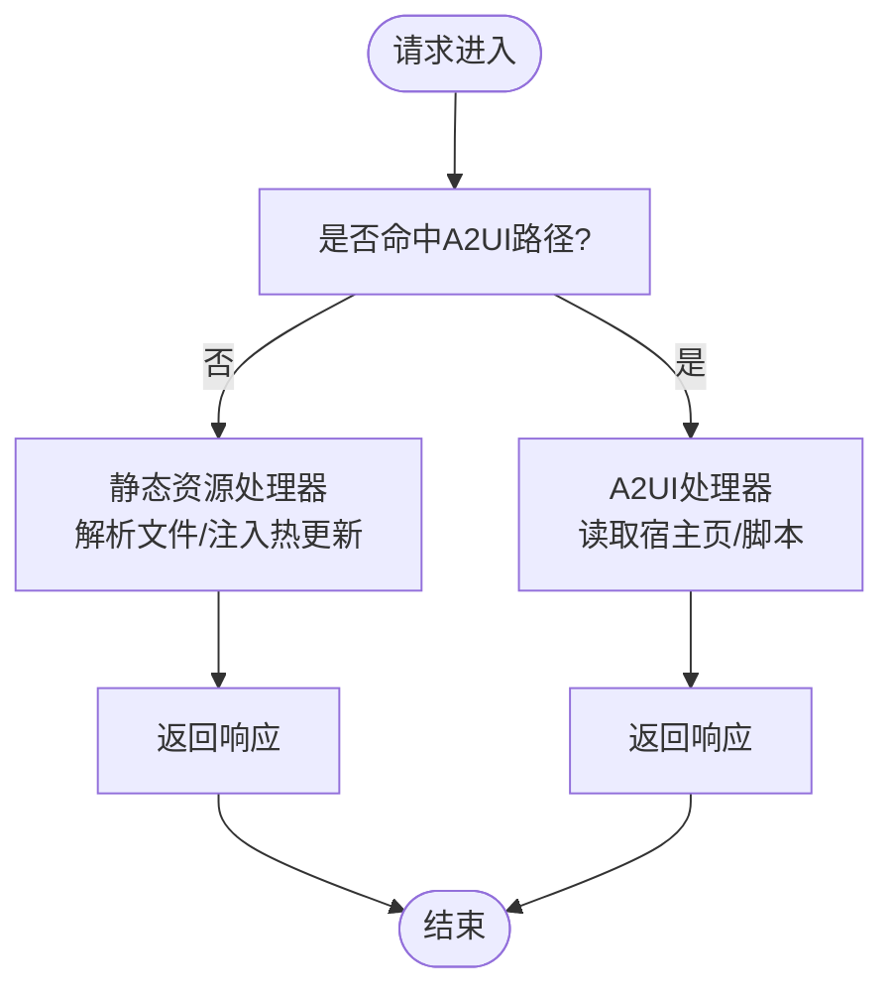
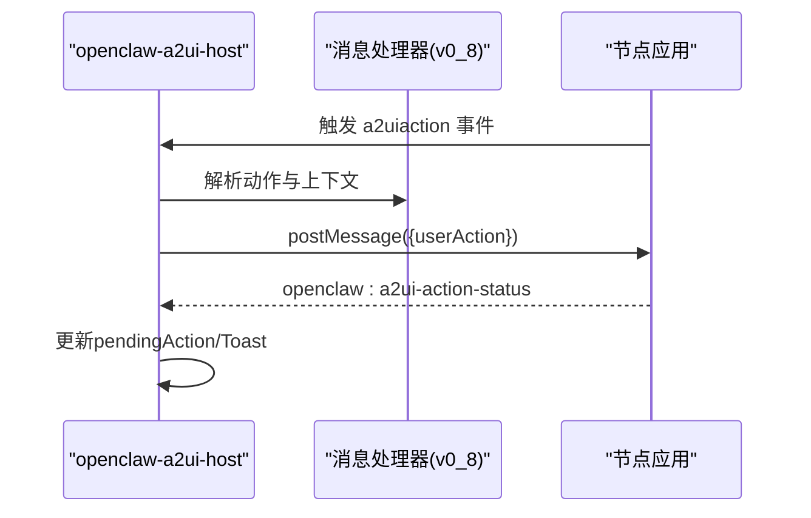
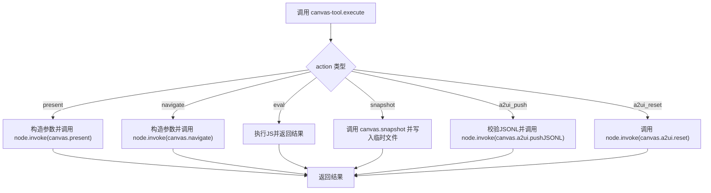
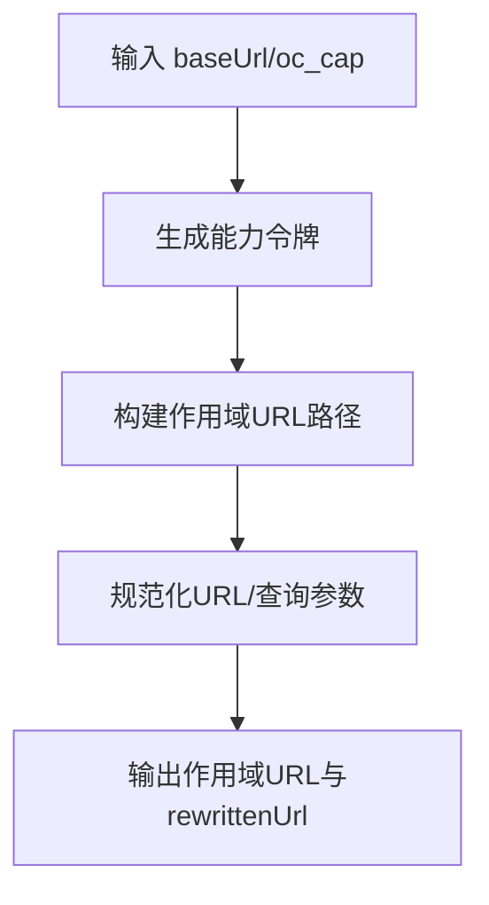
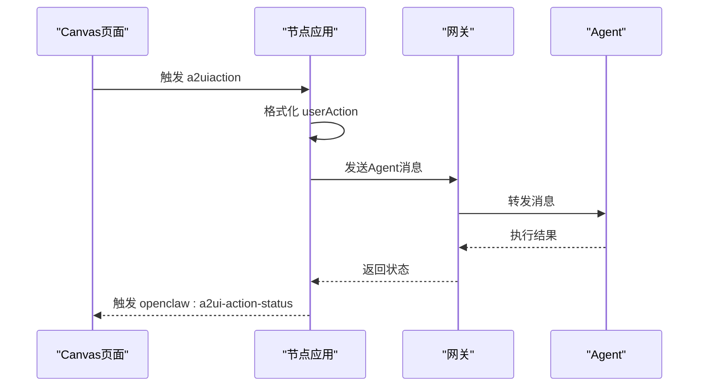
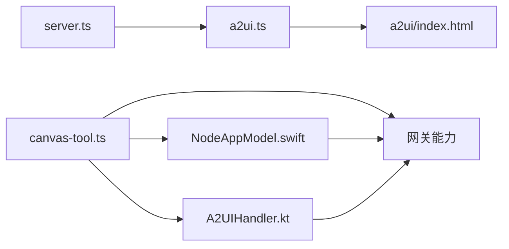

# Canvas主机

<cite>
**本文引用的文件**
- [server.ts](file://src/canvas-host/server.ts)
- [a2ui.ts](file://src/canvas-host/a2ui.ts)
- [a2ui/index.html](file://src/canvas-host/a2ui/index.html)
- [canvas-tool.ts](file://src/agents/tools/canvas-tool.ts)
- [canvas-capability.ts](file://src/gateway/canvas-capability.ts)
- [canvas-host-url.ts](file://src/infra/canvas-host-url.ts)
- [bootstrap.js](file://apps/shared/OpenClawKit/Tools/CanvasA2UI/bootstrap.js)
- [NodeAppModel.swift](file://apps/ios/Sources/Model/NodeAppModel.swift)
- [A2UIHandler.kt](file://apps/android/app/src/main/java/ai/openclaw/app/node/A2UIHandler.kt)
- [SKILL.md](file://skills/canvas/SKILL.md)
- [canvas-a2ui-copy.ts](file://scripts/canvas-a2ui-copy.ts)
- [nodes-canvas.ts](file://src/cli/nodes-canvas.ts)
</cite>

## 目录
1. [简介](#简介)
2. [项目结构](#项目结构)
3. [核心组件](#核心组件)
4. [架构总览](#架构总览)
5. [详细组件分析](#详细组件分析)
6. [依赖关系分析](#依赖关系分析)
7. [性能考量](#性能考量)
8. [故障排查指南](#故障排查指南)
9. [结论](#结论)
10. [附录：使用示例与最佳实践](#附录使用示例与最佳实践)

## 简介
本文件面向OpenClaw Canvas主机系统，提供从架构到开发的完整说明。重点覆盖以下方面：
- Canvas主机的架构设计与运行机制
- A2UI（面向组件的用户界面）在Canvas中的集成与渲染
- 可视化工作空间的呈现流程：画布加载、内容评估、快照生成、A2UI消息推送与重置
- 配置项、节点集成与跨平台（iOS/Android/macOS）交互
- 性能优化建议与常见问题排查

## 项目结构
Canvas主机由“静态资源服务”“A2UI宿主页面”“节点桥接层”三部分组成，并通过网关能力与节点应用进行交互。

图示来源
- [server.ts:399-479](file://src/canvas-host/server.ts#L399-L479)
- [a2ui.ts:142-210](file://src/canvas-host/a2ui.ts#L142-L210)
- [a2ui/index.html:1-308](file://src/canvas-host/a2ui/index.html#L1-L308)
- [canvas-capability.ts:1-88](file://src/gateway/canvas-capability.ts#L1-L88)
- [NodeAppModel.swift:898-927](file://apps/ios/Sources/Model/NodeAppModel.swift#L898-L927)
- [A2UIHandler.kt:77-116](file://apps/android/app/src/main/java/ai/openclaw/app/node/A2UIHandler.kt#L77-L116)

章节来源
- [server.ts:1-479](file://src/canvas-host/server.ts#L1-L479)
- [a2ui.ts:1-210](file://src/canvas-host/a2ui.ts#L1-L210)
- [a2ui/index.html:1-308](file://src/canvas-host/a2ui/index.html#L1-L308)
- [canvas-capability.ts:1-88](file://src/gateway/canvas-capability.ts#L1-L88)

## 核心组件
- Canvas主机服务器：提供静态资源与WebSocket热更新能力，支持A2UI路径代理与注入。
- A2UI宿主页：内置主题、状态提示与消息处理器，承载A2UI组件树。
- Canvas工具：面向代理的统一入口，封装present/hide/navigate/eval/snapshot/a2ui_push/a2ui_reset等动作。
- 能力作用域与URL：为Canvas内容提供带能力令牌的可访问路径，便于跨网络共享。
- 节点桥接：iOS/Android/macOS通过WebView或原生控件与Canvas交互，执行命令并回传状态。

章节来源
- [server.ts:205-397](file://src/canvas-host/server.ts#L205-L397)
- [a2ui.ts:14-79](file://src/canvas-host/a2ui.ts#L14-L79)
- [a2ui/index.html:211-236](file://src/canvas-host/a2ui/index.html#L211-L236)
- [canvas-tool.ts:80-216](file://src/agents/tools/canvas-tool.ts#L80-L216)
- [canvas-capability.ts:20-87](file://src/gateway/canvas-capability.ts#L20-L87)
- [NodeAppModel.swift:844-896](file://apps/ios/Sources/Model/NodeAppModel.swift#L844-L896)

## 架构总览
Canvas主机以HTTP服务器为核心，提供两类服务：
- 静态资源服务：根目录下的HTML/CSS/JS文件，支持自动注入WebSocket客户端实现热更新。
- A2UI服务：托管A2UI宿主页与打包脚本，通过特定路径对外提供。

节点侧通过网关能力发现Canvas主机地址，使用作用域URL访问Canvas内容；同时可通过节点桥接层调用Canvas命令与A2UI推送。

图示来源
- [canvas-tool.ts:88-216](file://src/agents/tools/canvas-tool.ts#L88-L216)
- [server.ts:416-458](file://src/canvas-host/server.ts#L416-L458)
- [a2ui.ts:142-210](file://src/canvas-host/a2ui.ts#L142-L210)
- [NodeAppModel.swift:898-927](file://apps/ios/Sources/Model/NodeAppModel.swift#L898-L927)
- [A2UIHandler.kt:77-116](file://apps/android/app/src/main/java/ai/openclaw/app/node/A2UIHandler.kt#L77-L116)

## 详细组件分析

### 组件A：Canvas主机服务器
- 功能要点
  - 支持基础路径前缀与静态文件解析
  - 自动注入WebSocket客户端，实现热更新
  - 提供A2UI路径处理，返回宿主页与打包脚本
  - 支持环境变量禁用与测试模式
- 关键行为
  - 请求拦截：优先匹配A2UI路径，否则进入静态资源处理
  - 升级：WebSocket连接仅对A2UI热更新路径开放
  - 文件读取：HTML注入脚本，其他类型按MIME返回
  - 关闭：清理定时器、Watcher与WebSocketServer

图示来源
- [server.ts:301-397](file://src/canvas-host/server.ts#L301-L397)
- [a2ui.ts:142-210](file://src/canvas-host/a2ui.ts#L142-L210)

章节来源
- [server.ts:205-479](file://src/canvas-host/server.ts#L205-L479)
- [a2ui.ts:14-79](file://src/canvas-host/a2ui.ts#L14-L79)

### 组件B：A2UI宿主页与消息处理器
- 宿主页
  - 内置平台检测与样式适配
  - 加载A2UI打包脚本，挂载openclaw-a2ui-host组件
- 消息处理器
  - 处理来自节点的用户动作事件
  - 将动作转换为跨平台的postMessage调用
  - 通过全局事件反馈动作状态，支持Toast提示

图示来源
- [bootstrap.js:393-482](file://apps/shared/OpenClawKit/Tools/CanvasA2UI/bootstrap.js#L393-L482)
- [NodeAppModel.swift:223-298](file://apps/ios/Sources/Model/NodeAppModel.swift#L223-L298)
- [A2UIHandler.kt:77-116](file://apps/android/app/src/main/java/ai/openclaw/app/node/A2UIHandler.kt#L77-L116)

章节来源
- [a2ui/index.html:211-236](file://src/canvas-host/a2ui/index.html#L211-L236)
- [bootstrap.js:214-549](file://apps/shared/OpenClawKit/Tools/CanvasA2UI/bootstrap.js#L214-L549)
- [NodeAppModel.swift:223-298](file://apps/ios/Sources/Model/NodeAppModel.swift#L223-L298)
- [A2UIHandler.kt:77-116](file://apps/android/app/src/main/java/ai/openclaw/app/node/A2UIHandler.kt#L77-L116)

### 组件C：Canvas工具与节点交互
- 工具能力
  - present/hide/navigate/eval/snapshot/a2ui_push/a2ui_reset
  - 参数校验与默认值处理
  - 与网关通信，透传命令到节点
- 快照处理
  - 解析payload，写入临时文件，返回图片结果

图示来源
- [canvas-tool.ts:88-216](file://src/agents/tools/canvas-tool.ts#L88-L216)
- [nodes-canvas.ts:10-25](file://src/cli/nodes-canvas.ts#L10-L25)

章节来源
- [canvas-tool.ts:18-216](file://src/agents/tools/canvas-tool.ts#L18-L216)
- [nodes-canvas.ts:1-25](file://src/cli/nodes-canvas.ts#L1-L25)

### 组件D：能力作用域与URL
- 能力令牌
  - 生成随机能力令牌，用于URL作用域保护
- 作用域URL
  - 将原始URL改写为带能力令牌的路径
  - 支持查询参数与路径两种形式
- 主机URL解析
  - 根据转发头与端口映射，生成对外可访问的Canvas主机URL

图示来源
- [canvas-capability.ts:20-87](file://src/gateway/canvas-capability.ts#L20-L87)
- [canvas-host-url.ts:57-94](file://src/infra/canvas-host-url.ts#L57-L94)

章节来源
- [canvas-capability.ts:1-88](file://src/gateway/canvas-capability.ts#L1-L88)
- [canvas-host-url.ts:1-94](file://src/infra/canvas-host-url.ts#L1-L94)

### 组件E：节点桥接（iOS/Android/macOS）
- iOS
  - 通过Webkit消息通道接收userAction
  - 格式化Agent消息并通过网关发送
  - 回传动作状态到Canvas页面
- Android
  - 校验A2UI v0.8消息格式
  - 通过postMessage接口推送userAction
- macOS
  - 通过窗口与WebView承载Canvas内容
  - 与网关协作完成命令下发与状态反馈

图示来源
- [NodeAppModel.swift:223-298](file://apps/ios/Sources/Model/NodeAppModel.swift#L223-L298)
- [A2UIHandler.kt:77-116](file://apps/android/app/src/main/java/ai/openclaw/app/node/A2UIHandler.kt#L77-L116)

章节来源
- [NodeAppModel.swift:844-927](file://apps/ios/Sources/Model/NodeAppModel.swift#L844-L927)
- [A2UIHandler.kt:77-116](file://apps/android/app/src/main/java/ai/openclaw/app/node/A2UIHandler.kt#L77-L116)

## 依赖关系分析
- Canvas主机服务器依赖A2UI资源定位与热更新注入
- A2UI宿主页依赖打包脚本与组件库
- Canvas工具依赖网关能力与节点命令路由
- 节点桥接依赖平台消息通道与网关协议

图示来源
- [server.ts:14-20](file://src/canvas-host/server.ts#L14-L20)
- [a2ui.ts:1-210](file://src/canvas-host/a2ui.ts#L1-L210)
- [a2ui/index.html:1-308](file://src/canvas-host/a2ui/index.html#L1-L308)
- [canvas-tool.ts:1-216](file://src/agents/tools/canvas-tool.ts#L1-L216)
- [NodeAppModel.swift:1-2976](file://apps/ios/Sources/Model/NodeAppModel.swift#L1-L2976)
- [A2UIHandler.kt:1-200](file://apps/android/app/src/main/java/ai/openclaw/app/node/A2UIHandler.kt#L1-L200)

章节来源
- [server.ts:1-479](file://src/canvas-host/server.ts#L1-L479)
- [a2ui.ts:1-210](file://src/canvas-host/a2ui.ts#L1-L210)
- [canvas-tool.ts:1-216](file://src/agents/tools/canvas-tool.ts#L1-L216)

## 性能考量
- 热更新策略
  - 使用chokidar监听文件变更，延迟触发广播，降低频繁刷新开销
  - 测试模式下缩短等待阈值与轮询间隔，提升迭代效率
- 资源加载
  - HTML注入WebSocket客户端，避免额外请求
  - 非HTML资源直接按MIME返回，减少处理成本
- A2UI消息
  - 严格校验v0.8消息格式，避免无效负载
  - 合理设置状态提示与Toast时长，避免频繁DOM更新
- 跨平台差异
  - Android与iOS消息通道不同，需注意序列化与编码差异
  - macOS窗口尺寸与布局应考虑缩放比与最小尺寸

## 故障排查指南
- 白屏或内容不加载
  - 检查绑定模式与URL是否一致（loopback/lan/tailnet/auto）
  - 使用curl验证URL可达性
- “node required”或“node not connected”
  - 确认节点ID与在线状态
- live reload不生效
  - 检查liveReload开关与根目录权限
  - 查看Watcher错误日志
- A2UI消息未生效
  - 确认宿主页已加载且openclawA2UI可用
  - 校验JSONL格式与版本（v0.8）

章节来源
- [SKILL.md:151-180](file://skills/canvas/SKILL.md#L151-L180)
- [server.ts:260-286](file://src/canvas-host/server.ts#L260-L286)
- [a2ui.ts:165-171](file://src/canvas-host/a2ui.ts#L165-L171)
- [A2UIHandler.kt:89-103](file://apps/android/app/src/main/java/ai/openclaw/app/node/A2UIHandler.kt#L89-L103)

## 结论
Canvas主机通过清晰的分层设计与跨平台桥接，实现了稳定的可视化工作空间与A2UI消息驱动的界面更新。配合能力作用域URL与热更新机制，开发者可以高效地构建与调试跨设备的可视化体验。

## 附录：使用示例与最佳实践
- 创建HTML内容
  - 将HTML/CSS/JS放置于Canvas根目录，确保index.html存在
  - 使用内联样式与脚本以提升兼容性
- 获取Canvas主机URL
  - 根据网关绑定模式选择对应主机名与端口
  - 通过作用域URL分享给节点
- 命令操作
  - present：显示指定URL；可选placement参数
  - navigate：跳转到新URL
  - eval：在Canvas中执行JavaScript
  - snapshot：截取当前画布为图片，支持PNG/JPG
  - a2ui_push：推送A2UI JSONL消息
  - a2ui_reset：清空A2UI状态
- 最佳实践
  - 开发阶段启用liveReload，提高迭代速度
  - 使用作用域URL限制访问范围，避免泄露
  - 在节点侧捕获并上报动作状态，便于调试
  - 对Android/iOS分别测试消息通道与样式适配

章节来源
- [SKILL.md:86-199](file://skills/canvas/SKILL.md#L86-L199)
- [canvas-tool.ts:107-216](file://src/agents/tools/canvas-tool.ts#L107-L216)
- [canvas-a2ui-copy.ts:13-28](file://scripts/canvas-a2ui-copy.ts#L13-L28)