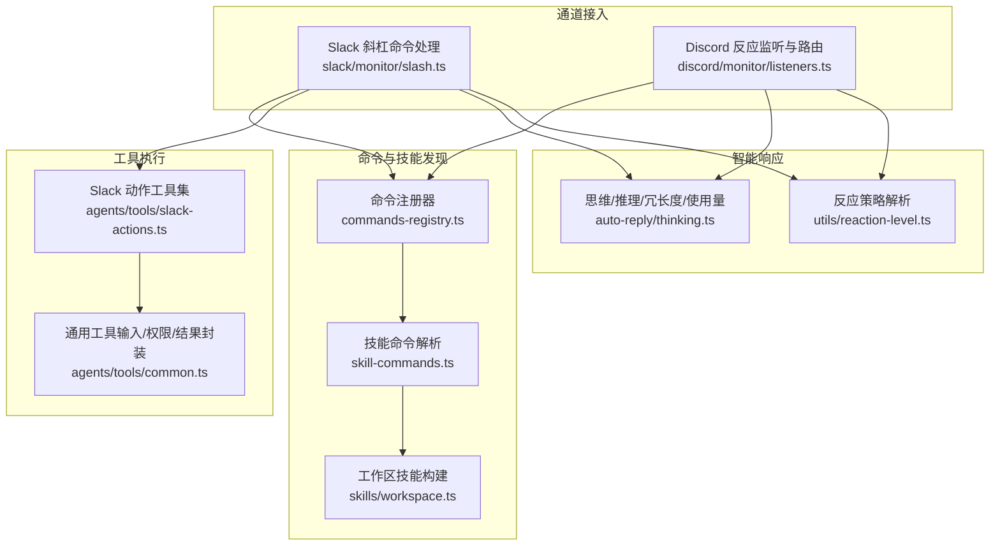
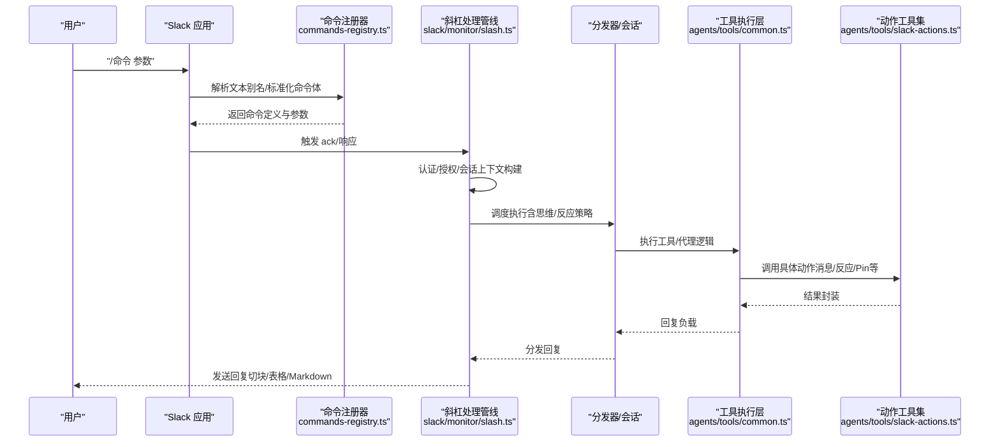
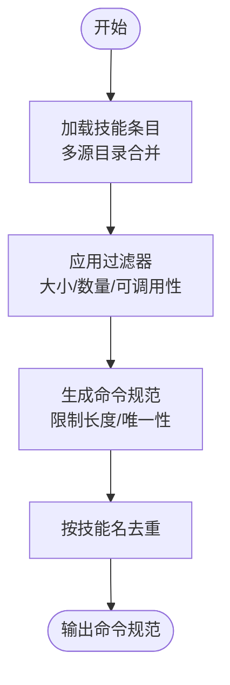
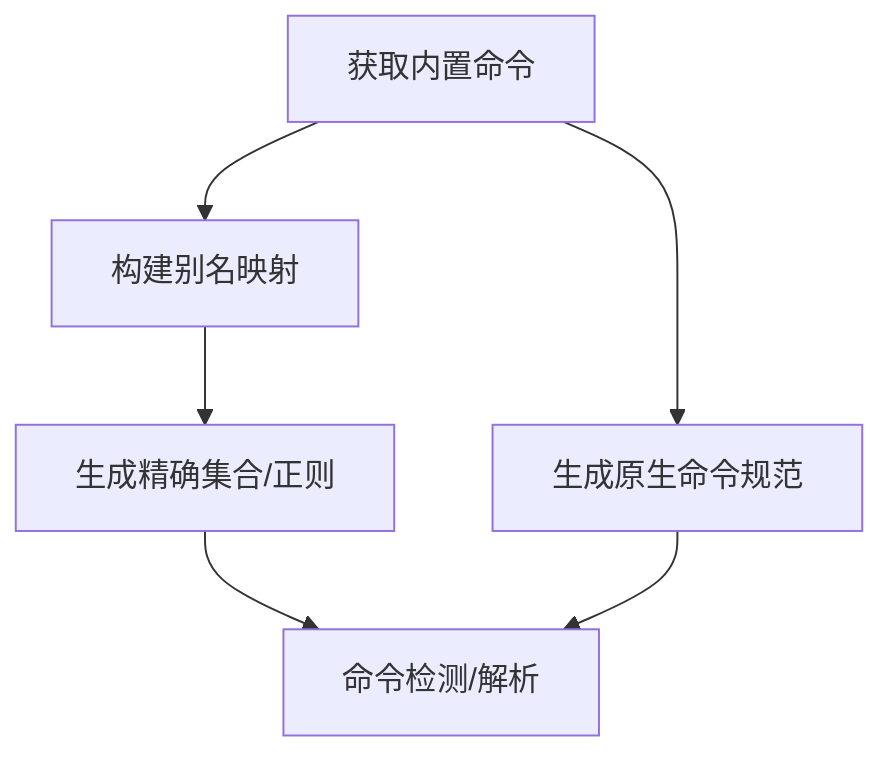
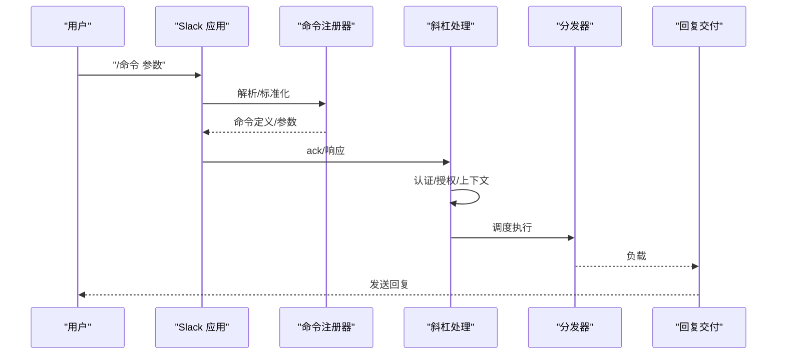
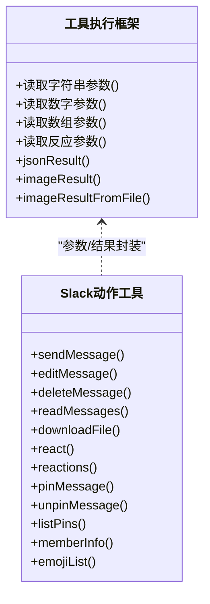
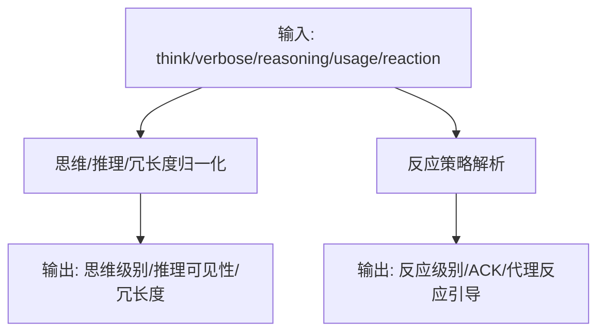
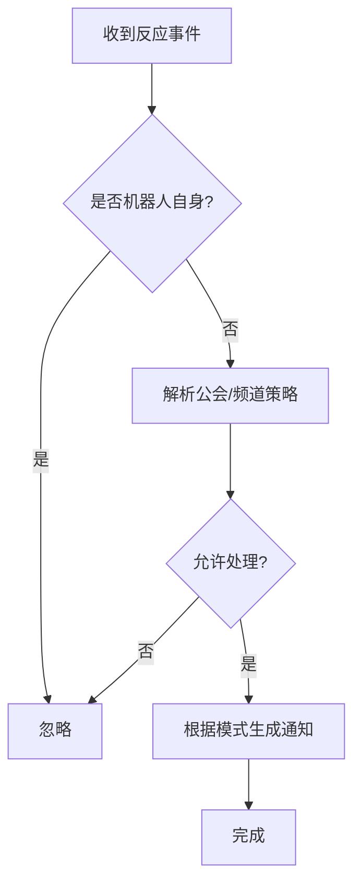
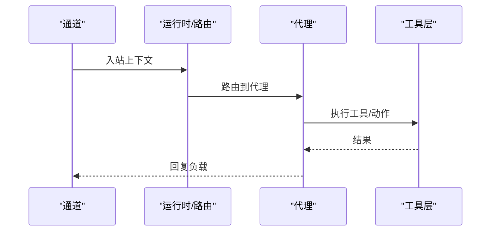
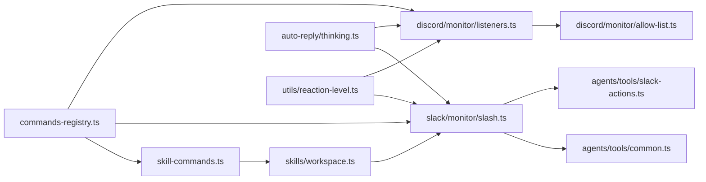

# 实用工具

<cite>
**本文引用的文件**
- [src/auto-reply/skill-commands.ts](file://src/auto-reply/skill-commands.ts)
- [src/auto-reply/commands-registry.ts](file://src/auto-reply/commands-registry.ts)
- [src/agents/skills.ts](file://src/agents/skills.ts)
- [src/agents/skills/workspace.ts](file://src/agents/skills/workspace.ts)
- [src/slack/monitor/slash.ts](file://src/slack/monitor/slash.ts)
- [src/agents/tools/slack-actions.ts](file://src/agents/tools/slack-actions.ts)
- [src/agents/tools/common.ts](file://src/agents/tools/common.ts)
- [src/auto-reply/thinking.ts](file://src/auto-reply/thinking.ts)
- [src/utils/reaction-level.ts](file://src/utils/reaction-level.ts)
- [src/discord/monitor/listeners.ts](file://src/discord/monitor/listeners.ts)
- [src/discord/monitor/allow-list.ts](file://src/discord/monitor/allow-list.ts)
- [src/agents/tools/discord-actions-messaging.ts](file://src/agents/tools/discord-actions-messaging.ts)
- [src/agents/pi-embedded-runner/compact.ts](file://src/agents/pi-embedded-runner/compact.ts)
- [apps/macos/Sources/OpenClawProtocol/GatewayModels.swift](file://apps/macos/Sources/OpenClawProtocol/GatewayModels.swift)
- [apps/shared/OpenClawKit/Sources/OpenClawProtocol/GatewayModels.swift](file://apps/shared/OpenClawKit/Sources/OpenClawProtocol/GatewayModels.swift)
</cite>

## 目录
1. [简介](#简介)
2. [项目结构](#项目结构)
3. [核心组件](#核心组件)
4. [架构总览](#架构总览)
5. [详细组件分析](#详细组件分析)
6. [依赖关系分析](#依赖关系分析)
7. [性能考量](#性能考量)
8. [故障排除指南](#故障排除指南)
9. [结论](#结论)
10. [附录](#附录)

## 简介
本文件面向OpenClaw实用工具系统，聚焦于“技能管理、命令处理与智能响应”三大能力，覆盖斜杠命令处理、思维/反应等级控制、消息与反应管理、以及与代理系统的交互与数据流。文档旨在帮助使用者与开发者快速上手并深度扩展实用工具，提升代理在多渠道（如Slack、Discord等）中的智能化水平。

## 项目结构
实用工具体系由以下层次构成：
- 命令与技能发现层：负责从工作区加载技能、生成命令规范、解析文本别名与斜杠命令。
- 通道接入层：针对不同平台（Slack、Discord等）注册原生斜杠命令、处理交互事件、路由到代理。
- 工具执行层：封装通用参数校验、权限门控、结果封装，并提供消息、反应、Pin等操作工具。
- 智能响应层：统一管理“思考级别、推理可见性、冗长度、使用量显示、反应策略”等行为开关。

图示来源
- [src/auto-reply/commands-registry.ts](file://src/auto-reply/commands-registry.ts)
- [src/auto-reply/skill-commands.ts](file://src/auto-reply/skill-commands.ts)
- [src/agents/skills/workspace.ts](file://src/agents/skills/workspace.ts)
- [src/slack/monitor/slash.ts](file://src/slack/monitor/slash.ts)
- [src/discord/monitor/listeners.ts](file://src/discord/monitor/listeners.ts)
- [src/agents/tools/slack-actions.ts](file://src/agents/tools/slack-actions.ts)
- [src/agents/tools/common.ts](file://src/agents/tools/common.ts)
- [src/auto-reply/thinking.ts](file://src/auto-reply/thinking.ts)
- [src/utils/reaction-level.ts](file://src/utils/reaction-level.ts)

章节来源
- [src/auto-reply/commands-registry.ts](file://src/auto-reply/commands-registry.ts)
- [src/auto-reply/skill-commands.ts](file://src/auto-reply/skill-commands.ts)
- [src/agents/skills/workspace.ts](file://src/agents/skills/workspace.ts)
- [src/slack/monitor/slash.ts](file://src/slack/monitor/slash.ts)
- [src/discord/monitor/listeners.ts](file://src/discord/monitor/listeners.ts)
- [src/agents/tools/slack-actions.ts](file://src/agents/tools/slack-actions.ts)
- [src/agents/tools/common.ts](file://src/agents/tools/common.ts)
- [src/auto-reply/thinking.ts](file://src/auto-reply/thinking.ts)
- [src/utils/reaction-level.ts](file://src/utils/reaction-level.ts)

## 核心组件
- 技能命令发现与去重
  - 通过工作区扫描与过滤，生成技能命令规范；对同名技能进行去重，避免重复注册。
  - 支持按代理维度合并技能过滤器，兼顾多代理共享工作区场景。
- 原生斜杠命令与文本别名
  - 统一解析命令文本别名、标准化命令体、构建正则检测集，支持“提及+冒号”的变体。
  - 提供原生命令规范导出，用于各通道注册。
- 斜杠命令处理流水线（以Slack为例）
  - 认证与授权：基于允许列表、访问组、频道白名单等策略判定是否放行。
  - 会话上下文：构造入站会话元数据、会话键、会话目标键，确保回复路由正确。
  - 分发与回复：调用分发器执行，按通道规则切块、表格渲染、Markdown模式等。
- 工具执行与安全门控
  - 通用参数读取、类型转换、必填校验、权限门控（owner-only）、结果封装。
  - 平台动作工具（Slack消息/反应/Pin/成员信息/表情包等），自动选择用户令牌或机器人令牌。
- 智能响应控制
  - 思维/推理/冗长度/使用量显示/反应策略等，提供标准化枚举与归一化函数。

章节来源
- [src/auto-reply/skill-commands.ts](file://src/auto-reply/skill-commands.ts)
- [src/auto-reply/commands-registry.ts](file://src/auto-reply/commands-registry.ts)
- [src/agents/skills/workspace.ts](file://src/agents/skills/workspace.ts)
- [src/slack/monitor/slash.ts](file://src/slack/monitor/slash.ts)
- [src/agents/tools/common.ts](file://src/agents/tools/common.ts)
- [src/agents/tools/slack-actions.ts](file://src/agents/tools/slack-actions.ts)
- [src/auto-reply/thinking.ts](file://src/auto-reply/thinking.ts)
- [src/utils/reaction-level.ts](file://src/utils/reaction-level.ts)

## 架构总览
下图展示了从“斜杠命令触发”到“代理执行与回复”的完整链路，以及“反应策略”和“思维级别”对执行的影响。

图示来源
- [src/auto-reply/commands-registry.ts](file://src/auto-reply/commands-registry.ts)
- [src/slack/monitor/slash.ts](file://src/slack/monitor/slash.ts)
- [src/agents/tools/common.ts](file://src/agents/tools/common.ts)
- [src/agents/tools/slack-actions.ts](file://src/agents/tools/slack-actions.ts)

章节来源
- [src/auto-reply/commands-registry.ts](file://src/auto-reply/commands-registry.ts)
- [src/slack/monitor/slash.ts](file://src/slack/monitor/slash.ts)
- [src/agents/tools/common.ts](file://src/agents/tools/common.ts)
- [src/agents/tools/slack-actions.ts](file://src/agents/tools/slack-actions.ts)

## 详细组件分析

### 技能命令发现与注册
- 工作区扫描与过滤
  - 从多源目录加载技能，按大小与数量限制裁剪，避免路径逃逸与过大扫描。
  - 合并优先级：extra < bundled < managed < agents-skills-personal < agents-skills-project < workspace。
- 命令规范生成
  - 将技能元数据映射为命令规范，限制命令名长度与唯一性，避免与保留名冲突。
  - 支持“技能命令”作为原生命令的一部分被注册。
- 去重与查找
  - 基于技能名去重，支持多种命名规范化形式的匹配。

图示来源
- [src/agents/skills/workspace.ts](file://src/agents/skills/workspace.ts)
- [src/auto-reply/skill-commands.ts](file://src/auto-reply/skill-commands.ts)

章节来源
- [src/agents/skills/workspace.ts](file://src/agents/skills/workspace.ts)
- [src/auto-reply/skill-commands.ts](file://src/auto-reply/skill-commands.ts)

### 命令注册与文本别名解析
- 文本别名与正则检测
  - 构建别名映射表，支持“提及+冒号”语法与精确匹配。
  - 生成精确集合与正则表达式，加速命令检测。
- 原生命令规范导出
  - 针对不同通道（如Slack/Discord）导出原生命令清单，包含名称、描述、参数等。

图示来源
- [src/auto-reply/commands-registry.ts](file://src/auto-reply/commands-registry.ts)

章节来源
- [src/auto-reply/commands-registry.ts](file://src/auto-reply/commands-registry.ts)

### Slack 斜杠命令处理流程
- 认证与授权
  - DM/房间/群组策略、允许列表、访问组、频道白名单综合判定。
- 会话上下文与目标路由
  - 构造会话键、目标会话键、对话标签、未信任上下文等，确保回复与上下文一致。
- 分发与回复
  - 按通道规则切块、表格渲染、Markdown模式；错误时记录日志并返回“抱歉”提示。

图示来源
- [src/slack/monitor/slash.ts](file://src/slack/monitor/slash.ts)
- [src/auto-reply/commands-registry.ts](file://src/auto-reply/commands-registry.ts)

章节来源
- [src/slack/monitor/slash.ts](file://src/slack/monitor/slash.ts)

### 工具执行与动作工具（以Slack为例）
- 通用工具框架
  - 参数读取（字符串/数字/数组/反应参数）、权限门控、结果封装、图片结果封装。
- Slack 动作工具
  - 消息：发送/编辑/删除/读取/下载文件；支持Blocks与媒体URL互斥。
  - 反应：添加/移除/清空自身反应；支持移除时必须提供emoji。
  - Pin：添加/取消/列出；支持成员信息查询与表情包列表。
  - 自动线程参与记录与“首次回复”模式一致性维护。

图示来源
- [src/agents/tools/common.ts](file://src/agents/tools/common.ts)
- [src/agents/tools/slack-actions.ts](file://src/agents/tools/slack-actions.ts)

章节来源
- [src/agents/tools/common.ts](file://src/agents/tools/common.ts)
- [src/agents/tools/slack-actions.ts](file://src/agents/tools/slack-actions.ts)

### 智能响应机制（思维/推理/冗长度/使用量/反应）
- 思维/推理/冗长度/使用量显示
  - 归一化用户输入，列举支持的级别，格式化提示信息。
- 反应策略
  - off/ack/minimal/extensive 四档，支持默认值与非法回退策略，区分ACK与代理反应。
- 通道适配
  - Telegram/Signal等通道可分别解析其反应等级与引导策略，统一注入到运行时能力中。

图示来源
- [src/auto-reply/thinking.ts](file://src/auto-reply/thinking.ts)
- [src/utils/reaction-level.ts](file://src/utils/reaction-level.ts)
- [src/agents/pi-embedded-runner/compact.ts](file://src/agents/pi-embedded-runner/compact.ts)

章节来源
- [src/auto-reply/thinking.ts](file://src/auto-reply/thinking.ts)
- [src/utils/reaction-level.ts](file://src/utils/reaction-level.ts)
- [src/agents/pi-embedded-runner/compact.ts](file://src/agents/pi-embedded-runner/compact.ts)

### Discord 反应监听与路由
- 反应事件处理
  - 识别添加/移除事件，跳过机器人自身反应，按公会/频道策略决定是否处理。
- 通知策略
  - 支持关闭、仅自身消息、全部、白名单四种模式，结合访问控制状态判断是否发出通知。

图示来源
- [src/discord/monitor/listeners.ts](file://src/discord/monitor/listeners.ts)
- [src/discord/monitor/allow-list.ts](file://src/discord/monitor/allow-list.ts)

章节来源
- [src/discord/monitor/listeners.ts](file://src/discord/monitor/listeners.ts)
- [src/discord/monitor/allow-list.ts](file://src/discord/monitor/allow-list.ts)

### 与代理系统的交互与数据流
- 通道到代理的路由
  - 通过“通道+账户+peer”确定代理与会话键，保证跨通道一致性。
- 上下文与会话
  - 入站上下文包含发送者、会话键、会话目标键、未信任上下文、Markdown表格模式、切块模式等。
- 行为开关
  - 思维/推理/冗长度/使用量/反应策略在上下文中生效，影响代理输出与交互体验。

图示来源
- [src/slack/monitor/slash.ts](file://src/slack/monitor/slash.ts)
- [src/auto-reply/thinking.ts](file://src/auto-reply/thinking.ts)
- [src/utils/reaction-level.ts](file://src/utils/reaction-level.ts)

章节来源
- [src/slack/monitor/slash.ts](file://src/slack/monitor/slash.ts)
- [src/auto-reply/thinking.ts](file://src/auto-reply/thinking.ts)
- [src/utils/reaction-level.ts](file://src/utils/reaction-level.ts)

## 依赖关系分析
- 命令与技能
  - commands-registry.ts 依赖内置命令与文本别名数据，输出命令定义与原生规范。
  - skill-commands.ts 依赖工作区技能构建与保留名集合，输出技能命令规范。
- 通道接入
  - slack/monitor/slash.ts 依赖命令注册器、通道配置、会话目标、动作工具等。
  - discord/monitor/listeners.ts 依赖反应路由与访问控制。
- 工具执行
  - agents/tools/common.ts 提供通用参数/权限/结果封装。
  - agents/tools/slack-actions.ts 依赖Slack动作实现与令牌选择策略。
- 智能响应
  - auto-reply/thinking.ts 与 utils/reaction-level.ts 提供统一的策略解析与归一化。

图示来源
- [src/auto-reply/commands-registry.ts](file://src/auto-reply/commands-registry.ts)
- [src/auto-reply/skill-commands.ts](file://src/auto-reply/skill-commands.ts)
- [src/agents/skills/workspace.ts](file://src/agents/skills/workspace.ts)
- [src/slack/monitor/slash.ts](file://src/slack/monitor/slash.ts)
- [src/agents/tools/common.ts](file://src/agents/tools/common.ts)
- [src/agents/tools/slack-actions.ts](file://src/agents/tools/slack-actions.ts)
- [src/discord/monitor/listeners.ts](file://src/discord/monitor/listeners.ts)
- [src/discord/monitor/allow-list.ts](file://src/discord/monitor/allow-list.ts)
- [src/auto-reply/thinking.ts](file://src/auto-reply/thinking.ts)
- [src/utils/reaction-level.ts](file://src/utils/reaction-level.ts)

章节来源
- [src/auto-reply/commands-registry.ts](file://src/auto-reply/commands-registry.ts)
- [src/auto-reply/skill-commands.ts](file://src/auto-reply/skill-commands.ts)
- [src/agents/skills/workspace.ts](file://src/agents/skills/workspace.ts)
- [src/slack/monitor/slash.ts](file://src/slack/monitor/slash.ts)
- [src/agents/tools/common.ts](file://src/agents/tools/common.ts)
- [src/agents/tools/slack-actions.ts](file://src/agents/tools/slack-actions.ts)
- [src/discord/monitor/listeners.ts](file://src/discord/monitor/listeners.ts)
- [src/discord/monitor/allow-list.ts](file://src/discord/monitor/allow-list.ts)
- [src/auto-reply/thinking.ts](file://src/auto-reply/thinking.ts)
- [src/utils/reaction-level.ts](file://src/utils/reaction-level.ts)

## 性能考量
- 技能扫描与提示限制
  - 限制候选数、加载数、提示字符数与单文件大小，避免超大工作区导致的内存与CPU压力。
- 命令检测缓存
  - 别名映射与正则检测结果缓存，减少重复计算。
- 回复交付优化
  - 按通道切块、表格渲染与Markdown模式，降低单次回复体积与渲染开销。
- 反应策略与ACK
  - 合理设置反应级别，避免过度反应造成网络与渲染负担。

## 故障排除指南
- 斜杠命令无响应
  - 检查通道策略（DM/房间/群组）、允许列表、访问组与频道白名单。
  - 确认命令已启用且未被保留名占用。
- 反应失败
  - 移除反应需提供emoji；检查“反应”功能是否被禁用；确认令牌权限。
- 消息/文件操作异常
  - 下载文件大小超过阈值或不可访问；发送/编辑内容为空；Blocks与媒体URL不可同时使用。
- Discord反应通知不触发
  - 检查反应模式（off/all/own/allowlist）与访问控制状态；确认发送者是否在白名单内。

章节来源
- [src/slack/monitor/slash.ts](file://src/slack/monitor/slash.ts)
- [src/agents/tools/slack-actions.ts](file://src/agents/tools/slack-actions.ts)
- [src/discord/monitor/listeners.ts](file://src/discord/monitor/listeners.ts)
- [src/discord/monitor/allow-list.ts](file://src/discord/monitor/allow-list.ts)

## 结论
OpenClaw实用工具系统通过“命令与技能发现—通道接入—工具执行—智能响应”四层架构，实现了跨渠道的一致化智能交互。借助严格的参数与权限门控、可配置的思维/反应策略、以及完善的错误处理与性能限制，系统既能满足日常自动化需求，又能在复杂场景中保持稳定与可控。

## 附录

### 使用示例（概念性说明）
- 在Slack中使用斜杠命令
  - 输入“/技能名 参数”，系统解析别名、标准化命令体后路由到代理。
  - 若命令需要参数菜单，系统会弹出交互式选择框。
- 通过工具执行消息与反应
  - 使用sendMessage/sendBlocks发送消息；使用react添加/移除反应；使用downloadFile下载附件。
- 调整智能响应
  - 设置思维级别（如minimal/low/medium/high/xhigh/adaptive）与推理可见性（on/stream/off）。
  - 配置反应策略（off/ack/minimal/extensive），控制ACK与代理反应行为。

### 配置要点（概念性说明）
- 命令与技能
  - 启用/禁用命令、配置文本命令表面、设置技能过滤器与保留名集合。
- 通道策略
  - DM策略、房间策略、访问组、频道白名单、原生命令启用/禁用。
- 工具与动作
  - 按功能模块（消息/反应/Pin/成员信息/表情包）开启/禁用；配置令牌与只读策略。
- 智能响应
  - 思维/推理/冗长度/使用量显示/反应策略的全局与通道级配置。