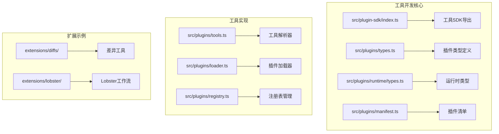
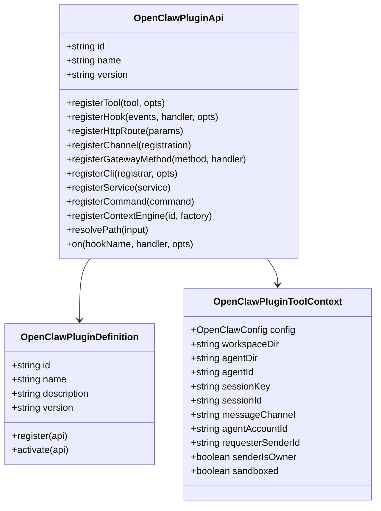
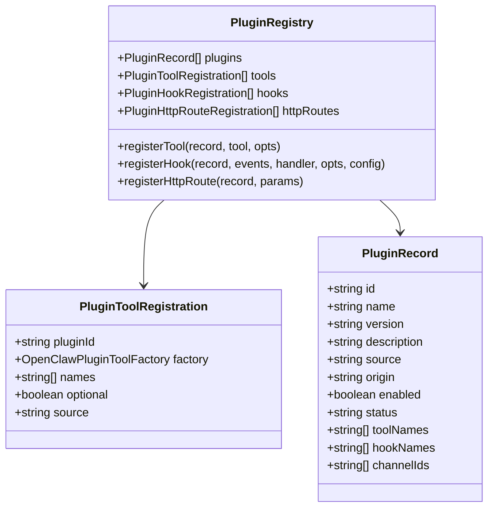
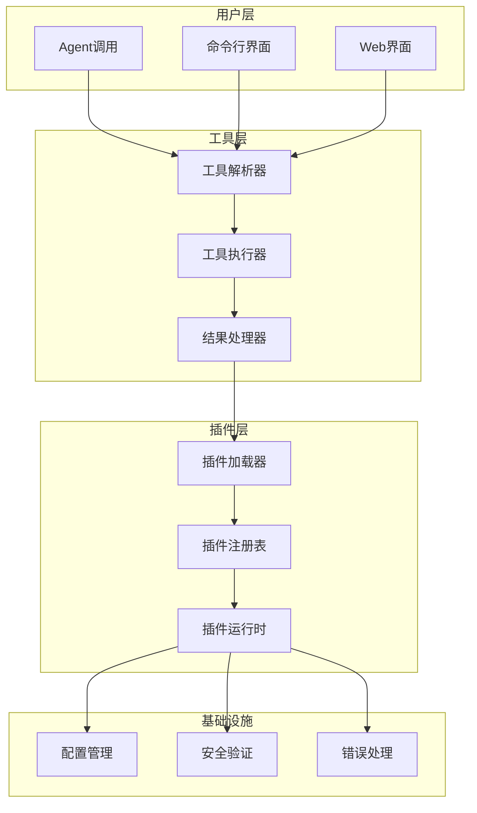
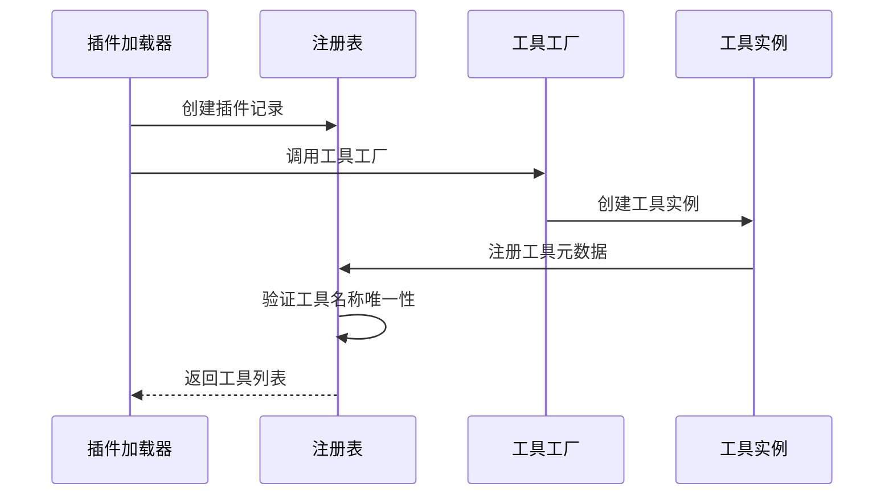
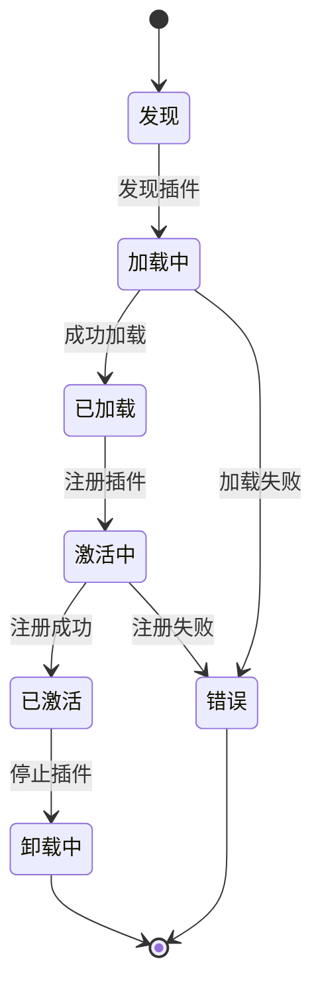
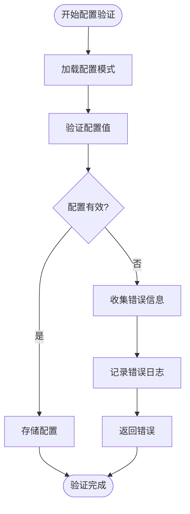
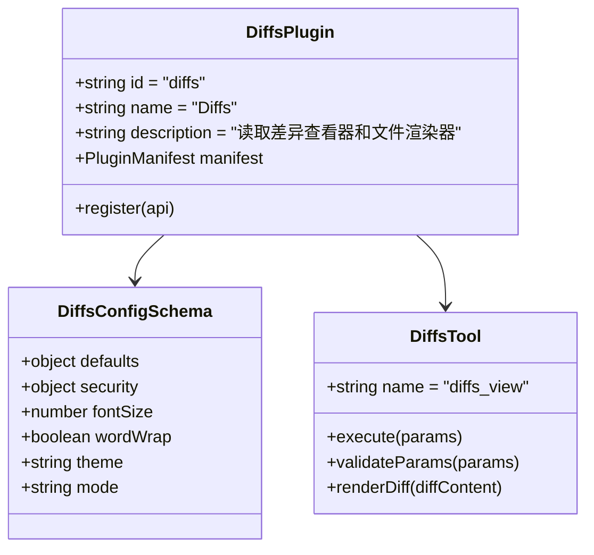
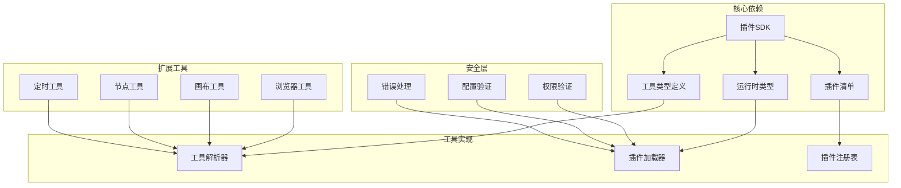
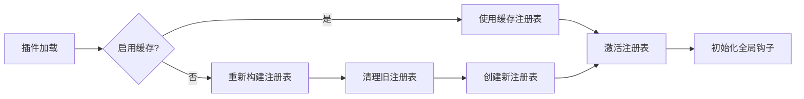

# 工具开发指南

<cite>
**本文档引用的文件**
- [README.md](file://README.md)
- [index.ts](file://src/plugin-sdk/index.ts)
- [types.ts](file://src/plugins/types.ts)
- [runtime/types.ts](file://src/plugins/runtime/types.ts)
- [manifest.ts](file://src/plugins/manifest.ts)
- [tools.ts](file://src/plugins/tools.ts)
- [loader.ts](file://src/plugins/loader.ts)
- [registry.ts](file://src/plugins/registry.ts)
- [openclaw.plugin.json](file://extensions/diffs/openclaw.plugin.json)
- [openclaw.plugin.json](file://extensions/lobster/openclaw.plugin.json)
- [index.md](file://docs/tools/index.md)
</cite>

## 目录
1. [简介](#简介)
2. [项目结构](#项目结构)
3. [核心组件](#核心组件)
4. [架构概览](#架构概览)
5. [详细组件分析](#详细组件分析)
6. [依赖关系分析](#依赖关系分析)
7. [性能考虑](#性能考虑)
8. [故障排除指南](#故障排除指南)
9. [结论](#结论)
10. [附录](#附录)

## 简介

OpenClaw是一个个人AI助手平台，提供了完整的工具开发框架。本指南专注于工具开发的核心要素，包括工具接口定义、参数验证、结果处理和错误管理。OpenClaw的工具系统基于插件架构，支持浏览器控制、画布操作、节点管理、定时任务等多种工具类型。

## 项目结构

OpenClaw工具开发主要涉及以下核心目录和文件：

**图表来源**
- [index.ts:1-826](file://src/plugin-sdk/index.ts#L1-L826)
- [types.ts:1-893](file://src/plugins/types.ts#L1-L893)
- [loader.ts:1-829](file://src/plugins/loader.ts#L1-L829)

**章节来源**
- [README.md:1-560](file://README.md#L1-L560)

## 核心组件

### 插件SDK接口

OpenClaw提供了完整的插件SDK接口，包括工具工厂、钩子系统、HTTP路由等核心功能：

**图表来源**
- [types.ts:263-306](file://src/plugins/types.ts#L263-L306)
- [types.ts:58-73](file://src/plugins/types.ts#L58-L73)

### 工具注册表

工具注册表负责管理所有已注册的工具，确保名称唯一性和冲突检测：

**图表来源**
- [registry.ts:129-142](file://src/plugins/registry.ts#L129-L142)
- [registry.ts:46-52](file://src/plugins/registry.ts#L46-L52)
- [registry.ts:102-127](file://src/plugins/registry.ts#L102-L127)

**章节来源**
- [index.ts:1-826](file://src/plugin-sdk/index.ts#L1-L826)
- [types.ts:1-893](file://src/plugins/types.ts#L1-L893)
- [registry.ts:1-625](file://src/plugins/registry.ts#L1-L625)

## 架构概览

OpenClaw工具系统采用模块化架构，通过插件机制实现高度可扩展的工具生态：

**图表来源**
- [loader.ts:447-800](file://src/plugins/loader.ts#L447-L800)
- [tools.ts:45-140](file://src/plugins/tools.ts#L45-L140)

## 详细组件分析

### 工具工厂模式

OpenClaw使用工厂模式创建工具，支持同步和异步工具注册：

**图表来源**
- [loader.ts:769-799](file://src/plugins/loader.ts#L769-L799)
- [tools.ts:90-139](file://src/plugins/tools.ts#L90-L139)

### 插件生命周期管理

插件具有完整的生命周期，从发现到激活再到卸载：

**图表来源**
- [loader.ts:569-800](file://src/plugins/loader.ts#L569-L800)
- [registry.ts:185-625](file://src/plugins/registry.ts#L185-L625)

### 工具配置验证

OpenClaw提供强大的配置验证机制，确保插件配置的安全性和正确性：

**图表来源**
- [loader.ts:175-194](file://src/plugins/loader.ts#L175-L194)
- [manifest.ts:45-119](file://src/plugins/manifest.ts#L45-L119)

**章节来源**
- [loader.ts:1-829](file://src/plugins/loader.ts#L1-L829)
- [tools.ts:1-140](file://src/plugins/tools.ts#L1-L140)
- [manifest.ts:1-199](file://src/plugins/manifest.ts#L1-L199)

### 扩展工具开发示例

以Diffs工具为例，展示如何创建自定义工具：

**图表来源**
- [openclaw.plugin.json:1-183](file://extensions/diffs/openclaw.plugin.json#L1-L183)

**章节来源**
- [openclaw.plugin.json:1-183](file://extensions/diffs/openclaw.plugin.json#L1-L183)
- [openclaw.plugin.json:1-11](file://extensions/lobster/openclaw.plugin.json#L1-L11)

## 依赖关系分析

OpenClaw工具系统具有清晰的依赖层次结构：

**图表来源**
- [index.ts:1-826](file://src/plugin-sdk/index.ts#L1-L826)
- [types.ts:1-893](file://src/plugins/types.ts#L1-L893)
- [loader.ts:1-829](file://src/plugins/loader.ts#L1-L829)

**章节来源**
- [index.ts:1-826](file://src/plugin-sdk/index.ts#L1-L826)
- [types.ts:1-893](file://src/plugins/types.ts#L1-L893)

## 性能考虑

### 工具加载优化

OpenClaw在工具加载过程中采用了多种优化策略：

1. **缓存机制**：插件注册表支持缓存，避免重复加载
2. **延迟初始化**：运行时组件采用延迟初始化，减少启动时间
3. **增量加载**：插件按需加载，避免一次性加载所有插件

### 内存管理

**图表来源**
- [loader.ts:447-465](file://src/plugins/loader.ts#L447-L465)

## 故障排除指南

### 常见问题诊断

1. **插件加载失败**
   - 检查插件清单文件格式
   - 验证插件入口文件路径
   - 确认插件依赖完整性

2. **工具冲突**
   - 检查工具名称唯一性
   - 验证工具工厂返回值
   - 确认工具注册顺序

3. **配置验证错误**
   - 检查JSON Schema定义
   - 验证配置值范围
   - 确认必需字段完整性

**章节来源**
- [loader.ts:256-284](file://src/plugins/loader.ts#L256-L284)
- [tools.ts:115-135](file://src/plugins/tools.ts#L115-L135)

## 结论

OpenClaw工具开发框架提供了完整、灵活且安全的工具开发环境。通过插件架构和工厂模式，开发者可以轻松创建自定义工具，同时保持系统的稳定性和安全性。建议开发者遵循以下最佳实践：

1. 使用标准化的插件清单格式
2. 实现完善的配置验证机制
3. 采用工厂模式创建工具实例
4. 实施适当的错误处理和日志记录
5. 遵循工具命名规范和冲突避免原则

## 附录

### 开发最佳实践

1. **安全性考虑**
   - 实施严格的输入验证
   - 使用沙箱环境运行不受信任代码
   - 实现权限最小化原则

2. **性能优化**
   - 使用异步编程模式
   - 实施缓存策略
   - 优化资源使用

3. **兼容性保证**
   - 支持多平台运行
   - 实现向后兼容性
   - 提供版本管理机制

### 测试策略

1. **单元测试**
   - 测试工具工厂函数
   - 验证配置解析逻辑
   - 检查错误处理路径

2. **集成测试**
   - 测试插件加载流程
   - 验证工具执行结果
   - 检查插件间交互

3. **端到端测试**
   - 模拟完整工具调用流程
   - 验证系统整体行为
   - 测试边界条件和异常情况