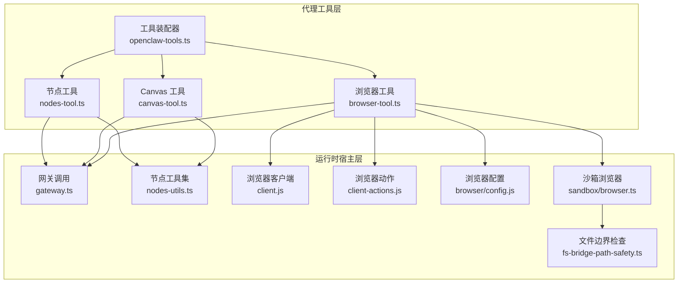
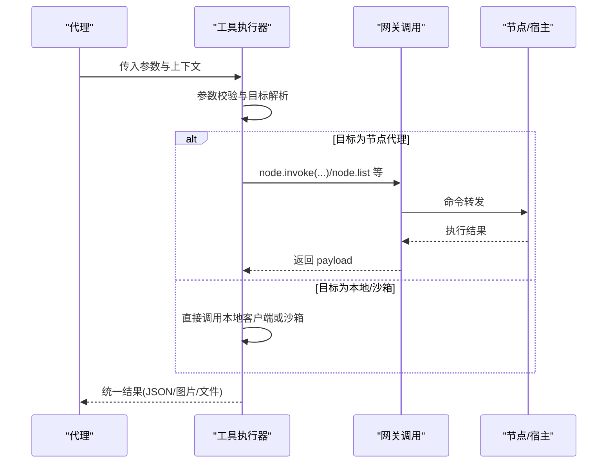
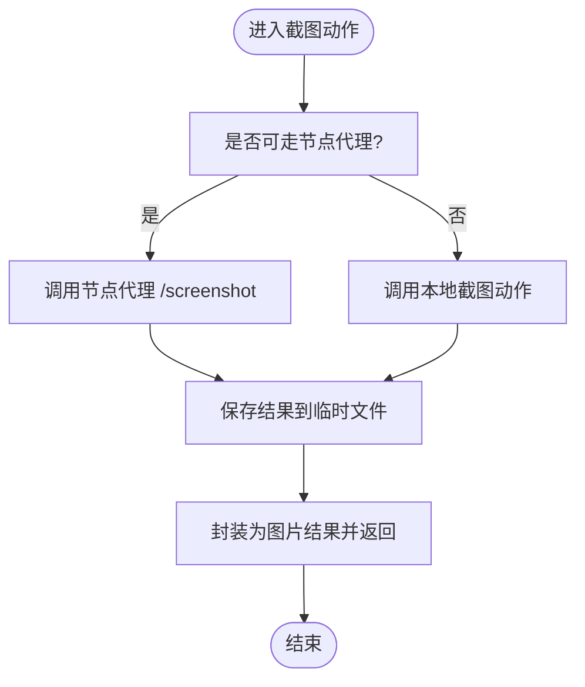
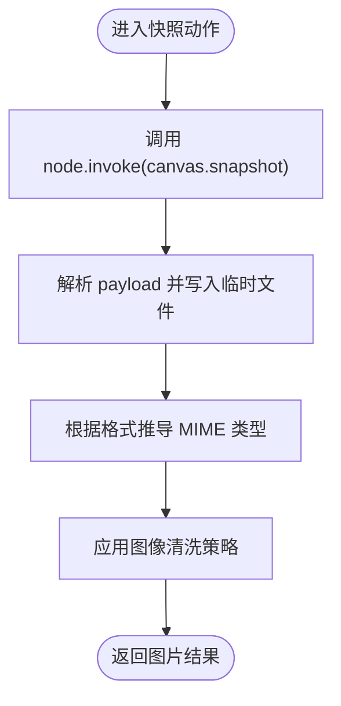
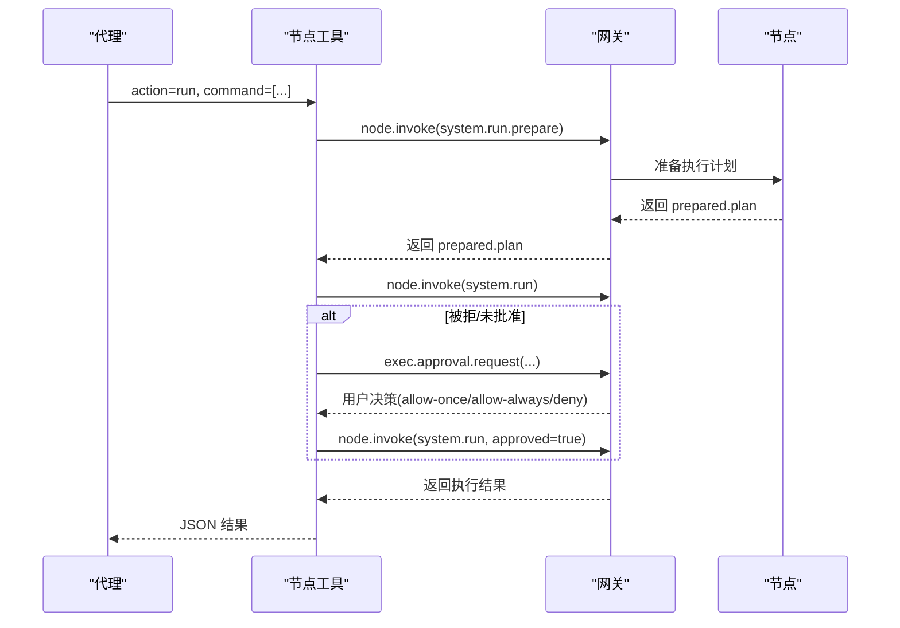
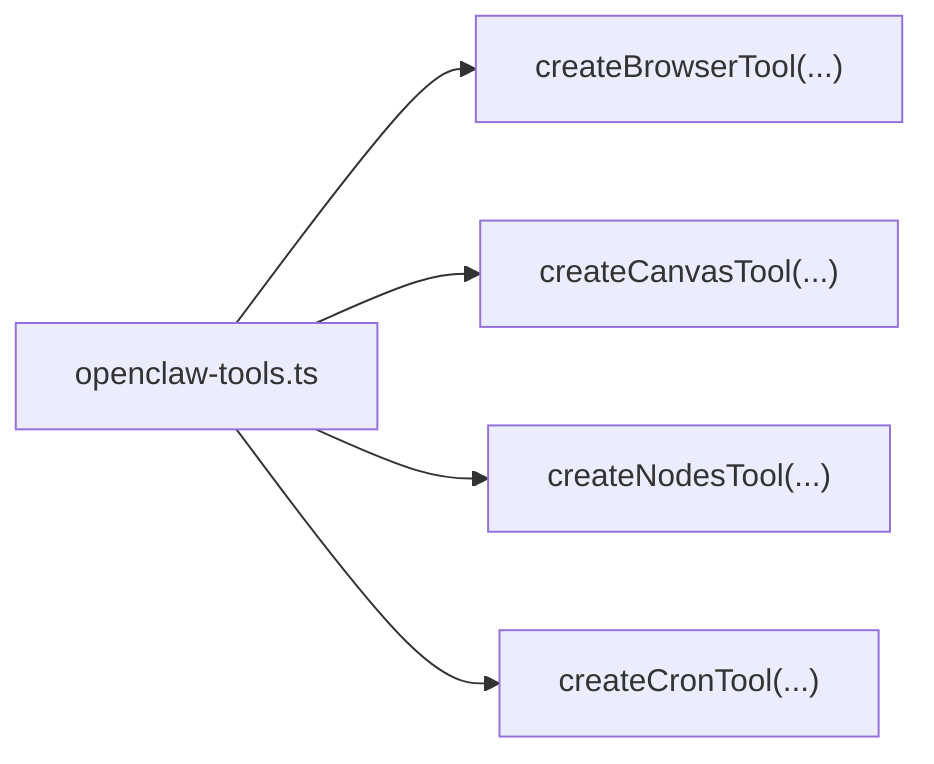
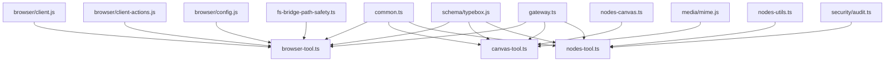

# 工具系统

<cite>
**本文引用的文件**
- [src/agents/tools/browser-tool.ts](file://src/agents/tools/browser-tool.ts)
- [src/agents/tools/canvas-tool.ts](file://src/agents/tools/canvas-tool.ts)
- [src/agents/tools/nodes-tool.ts](file://src/agents/tools/nodes-tool.ts)
- [src/agents/openclaw-tools.ts](file://src/agents/openclaw-tools.ts)
- [src/agents/tools/common.ts](file://src/agents/tools/common.ts)
- [src/agents/tools/gateway.ts](file://src/agents/tools/gateway.ts)
- [src/agents/tools/nodes-utils.ts](file://src/agents/tools/nodes-utils.ts)
- [src/agents/tools/browser-tool.schema.ts](file://src/agents/tools/browser-tool.schema.ts)
- [src/agents/tools/browser-tool.actions.ts](file://src/agents/tools/browser-tool.actions.ts)
- [src/agents/sandbox/browser.ts](file://src/agents/sandbox/browser.ts)
- [src/agents/sandbox/fs-bridge-path-safety.ts](file://src/agents/sandbox/fs-bridge-path-safety.ts)
- [src/agents/sandbox/validate-sandbox-security.ts](file://src/agents/sandbox/validate-sandbox-security.ts)
- [src/agents/sandbox/docker.ts](file://src/agents/sandbox/docker.ts)
- [src/browser/config.js](file://src/browser/config.js)
- [src/browser/client.js](file://src/browser/client.js)
- [src/browser/client-actions.js](file://src/browser/client-actions.js)
- [src/browser/paths.js](file://src/browser/paths.js)
- [src/browser/proxy-files.js](file://src/browser/proxy-files.js)
- [src/browser/session-tab-registry.js](file://src/browser/session-tab-registry.js)
- [src/cli/nodes-canvas.ts](file://src/cli/nodes-canvas.ts)
- [src/cli/nodes-camera.js](file://src/cli/nodes-camera.js)
- [src/cli/nodes-screen.js](file://src/cli/nodes-screen.js)
- [src/media/inbound-path-policy.js](file://src/media/inbound-path-policy.js)
- [src/media/local-roots.js](file://src/media/local-roots.js)
- [src/media/mime.js](file://src/media/mime.js)
- [src/gateway/canvas-capability.ts](file://src/gateway/canvas-capability.ts)
- [src/infra/canvas-host-url.ts](file://src/infra/canvas-host-url.ts)
- [src/infra/path-alias-guards.js](file://src/infra/path-alias-guards.js)
- [src/infra/boundary-file-read.js](file://src/infra/boundary-file-read.js)
- [src/infra/safe-open-sync.js](file://src/infra/safe-open-sync.js)
- [src/infra/system-run-approval-context.js](file://src/infra/system-run-approval-context.js)
- [src/infra/system-run-approval-context.js](file://src/infra/system-run-approval-context.js)
- [src/agents/image-sanitization.js](file://src/agents/image-sanitization.js)
- [src/agents/tool-images.js](file://src/agents/tool-images.js)
- [src/agents/schema/typebox.js](file://src/agents/schema/typebox.js)
- [src/config/config.js](file://src/config/config.js)
- [assets/chrome-extension/manifest.json](file://assets/chrome-extension/manifest.json)
- [assets/chrome-extension/background.js](file://assets/chrome-extension/background.js)
- [assets/chrome-extension/options.html](file://assets/chrome-extension/options.html)
- [assets/chrome-extension/options.js](file://assets/chrome-extension/options.js)
- [assets/chrome-extension/options-validation.js](file://assets/chrome-extension/options-validation.js)
- [assets/chrome-extension/background-utils.js](file://assets/chrome-extension/background-utils.js)
- [scripts/sandbox-browser-entrypoint.sh](file://scripts/sandbox-browser-entrypoint.sh)
- [scripts/sandbox-browser-setup.sh](file://scripts/sandbox-browser-setup.sh)
- [scripts/sandbox-common-setup.sh](file://scripts/sandbox-common-setup.sh)
- [scripts/sandbox-setup.sh](file://scripts/sandbox-setup.sh)
- [src/security/audit.ts](file://src/security/audit.ts)
</cite>

## 目录
1. [简介](#简介)
2. [项目结构](#项目结构)
3. [核心组件](#核心组件)
4. [架构总览](#架构总览)
5. [组件详解](#组件详解)
6. [依赖关系分析](#依赖关系分析)
7. [性能考量](#性能考量)
8. [故障排查指南](#故障排查指南)
9. [结论](#结论)
10. [附录](#附录)

## 简介
本文件面向使用者与开发者，系统化阐述 OpenClaw 工具系统的架构设计、工具分类体系与执行机制。重点覆盖以下核心工具：浏览器控制、Canvas 主机、节点工具（设备与系统调用）、以及扩展生态中的自定义工具。文档同时提供工具开发指南、安全模型与权限控制、沙箱机制、配置项、性能优化与调试技巧，并给出创建新工具与扩展现有工具的实践建议。

## 项目结构
OpenClaw 的工具系统由“代理工具层”和“运行时宿主层”组成：
- 代理工具层：封装具体能力（浏览器、Canvas、节点），统一参数校验、结果处理与错误管理。
- 运行时宿主层：负责网关通信、节点发现与选择、浏览器代理、沙箱隔离与安全策略。

图表来源
- [src/agents/tools/browser-tool.ts:281-660](file://src/agents/tools/browser-tool.ts#L281-L660)
- [src/agents/tools/canvas-tool.ts:80-216](file://src/agents/tools/canvas-tool.ts#L80-L216)
- [src/agents/tools/nodes-tool.ts:164-814](file://src/agents/tools/nodes-tool.ts#L164-L814)
- [src/agents/openclaw-tools.ts:138-157](file://src/agents/openclaw-tools.ts#L138-L157)
- [src/agents/sandbox/browser.ts](file://src/agents/sandbox/browser.ts)
- [src/agents/sandbox/fs-bridge-path-safety.ts:42-135](file://src/agents/sandbox/fs-bridge-path-safety.ts#L42-L135)

章节来源
- [src/agents/openclaw-tools.ts:138-157](file://src/agents/openclaw-tools.ts#L138-L157)
- [src/agents/tools/browser-tool.ts:281-660](file://src/agents/tools/browser-tool.ts#L281-L660)
- [src/agents/tools/canvas-tool.ts:80-216](file://src/agents/tools/canvas-tool.ts#L80-L216)
- [src/agents/tools/nodes-tool.ts:164-814](file://src/agents/tools/nodes-tool.ts#L164-L814)

## 核心组件
- 浏览器工具：提供状态查询、启动/停止、标签页管理、截图、PDF 导出、上传/对话框钩子、动作编排等能力；支持本地主机或节点代理两种目标。
- Canvas 工具：在节点上呈现/隐藏 UI、导航、JS 求值、快照并返回图片；支持 A2UI 推送与重置。
- 节点工具：节点发现与描述、配对请求审批、通知发送、相机拍照/录像、屏幕录制、位置获取、系统命令执行与媒体命令专用通道。
- 工具装配器：按会话配置创建上述工具实例，注入沙箱桥接 URL、主机控制策略、会话键等上下文。

章节来源
- [src/agents/tools/browser-tool.ts:281-660](file://src/agents/tools/browser-tool.ts#L281-L660)
- [src/agents/tools/canvas-tool.ts:80-216](file://src/agents/tools/canvas-tool.ts#L80-L216)
- [src/agents/tools/nodes-tool.ts:164-814](file://src/agents/tools/nodes-tool.ts#L164-L814)
- [src/agents/openclaw-tools.ts:138-157](file://src/agents/openclaw-tools.ts#L138-L157)

## 架构总览
工具执行链路从代理到网关再到节点或本地宿主，关键路径如下：
- 参数解析与校验：统一通过工具参数 Schema 与通用读取函数完成。
- 网关调用：通过 gateway.ts 封装 node.invoke 与节点列表/配对等 RPC。
- 目标路由：优先走节点代理（当可用且策略允许），否则回退到本地主机或沙箱浏览器。
- 结果处理：统一返回 JSON 或图片/文件内容，必要时进行图像清洗与 MIME 类型转换。

图表来源
- [src/agents/tools/browser-tool.ts:305-657](file://src/agents/tools/browser-tool.ts#L305-L657)
- [src/agents/tools/canvas-tool.ts:99-105](file://src/agents/tools/canvas-tool.ts#L99-L105)
- [src/agents/tools/nodes-tool.ts:80-89](file://src/agents/tools/nodes-tool.ts#L80-L89)
- [src/agents/tools/gateway.ts](file://src/agents/tools/gateway.ts)

## 组件详解

### 浏览器工具（Browser Tool）
- 功能特性
  - 支持本地主机浏览器与节点代理两种模式，自动选择最佳目标。
  - 提供状态、启动/停止、标签页打开/聚焦/关闭、快照、截图、导航、控制台、PDF 导出、文件上传与对话框钩子、动作编排等。
  - 针对 Chrome 扩展中继场景，自动选择合适的 profile 并确保会话跟踪。
- 使用要点
  - 目标选择：target 可为 sandbox/host/node；profile 可选 chrome/openclaw；node 可固定节点。
  - 快照与动作：推荐 snapshot 后复用 ref；避免过度等待，尽量基于稳定 UI 状态。
  - 文件上传：仅允许受信任目录内的路径，超出范围将被拒绝。
- 关键流程（截图）

图表来源
- [src/agents/tools/browser-tool.ts:490-522](file://src/agents/tools/browser-tool.ts#L490-L522)

章节来源
- [src/agents/tools/browser-tool.ts:281-660](file://src/agents/tools/browser-tool.ts#L281-L660)
- [src/browser/client.js](file://src/browser/client.js)
- [src/browser/client-actions.js](file://src/browser/client-actions.js)
- [src/browser/config.js](file://src/browser/config.js)
- [src/browser/paths.js](file://src/browser/paths.js)
- [src/browser/proxy-files.js](file://src/browser/proxy-files.js)
- [src/browser/session-tab-registry.js](file://src/browser/session-tab-registry.js)

### Canvas 工具（Canvas Tool）
- 功能特性
  - 在节点 Canvas 上呈现/隐藏 UI、导航至 URL、执行 JS、抓取快照并返回图片。
  - 支持 A2UI 推送 JSONL 与重置。
  - 对输入路径进行白名单校验，防止越权访问。
- 使用要点
  - present 支持 target/url 二选一；可设置窗口位置与尺寸。
  - snapshot 支持 png/jpg 输出与质量/尺寸限制；返回图片前会进行图像清洗。
  - a2ui_push 支持直接传入 JSONL 字符串或 jsonlPath。
- 关键流程（快照）

图表来源
- [src/agents/tools/canvas-tool.ts:162-193](file://src/agents/tools/canvas-tool.ts#L162-L193)
- [src/cli/nodes-canvas.ts](file://src/cli/nodes-canvas.ts)
- [src/media/mime.js](file://src/media/mime.js)
- [src/agents/image-sanitization.js](file://src/agents/image-sanitization.js)

章节来源
- [src/agents/tools/canvas-tool.ts:80-216](file://src/agents/tools/canvas-tool.ts#L80-L216)
- [src/media/inbound-path-policy.js](file://src/media/inbound-path-policy.js)
- [src/media/local-roots.js](file://src/media/local-roots.js)
- [src/gateway/canvas-capability.ts](file://src/gateway/canvas-capability.ts)
- [src/infra/canvas-host-url.ts](file://src/infra/canvas-host-url.ts)

### 节点工具（Nodes Tool）
- 功能特性
  - 节点发现、描述、配对请求审批、通知发送。
  - 相机拍照/多方向、最近照片批量拉取、屏幕录制、位置获取。
  - 系统命令执行（system.run）支持准备阶段、批准流与重试。
  - 通用 invoke 通道，支持媒体类命令的专用入口以避免大体积 base64 上下文。
- 使用要点
  - run 动作会先尝试无批准直连，失败后触发网关批准流；超时或拒绝会抛出明确错误。
  - invoke 动作若返回“需要配对”，会提取 requestId 并提示用户在 UI 中批准。
  - 多媒体结果统一通过 FILE/MEDIA 占位符返回，便于模型消费与安全控制。
- 关键流程（系统运行）

图表来源
- [src/agents/tools/nodes-tool.ts:607-746](file://src/agents/tools/nodes-tool.ts#L607-L746)
- [src/infra/system-run-approval-context.js](file://src/infra/system-run-approval-context.js)

章节来源
- [src/agents/tools/nodes-tool.ts:164-814](file://src/agents/tools/nodes-tool.ts#L164-L814)
- [src/agents/tools/nodes-utils.ts](file://src/agents/tools/nodes-utils.ts)
- [src/cli/nodes-camera.js](file://src/cli/nodes-camera.js)
- [src/cli/nodes-screen.js](file://src/cli/nodes-screen.js)

### 工具装配器（OpenClaw Tools）
- 职责
  - 按会话配置创建浏览器、Canvas、节点、定时任务等工具实例。
  - 注入沙箱桥接 URL、主机控制策略、会话键、通道信息等上下文。
- 典型装配

图表来源
- [src/agents/openclaw-tools.ts:138-157](file://src/agents/openclaw-tools.ts#L138-L157)

章节来源
- [src/agents/openclaw-tools.ts:138-157](file://src/agents/openclaw-tools.ts#L138-L157)

## 依赖关系分析
- 参数与结果
  - 通用参数读取与 Schema 定义：common.ts、schema/typebox.js。
  - 结果封装：jsonResult、imageResult、imageResultFromFile 等。
- 网关与节点
  - 网关调用封装：gateway.ts；节点解析与选择：nodes-utils.ts。
- 浏览器与 Canvas
  - 浏览器客户端与动作：client.js、client-actions.js；配置与代理：browser/config.js、browser/proxy-files.js。
  - Canvas 与媒体：nodes-canvas.ts、nodes-camera.js、nodes-screen.js、mime.js。
- 沙箱与安全
  - 沙箱浏览器与文件边界：sandbox/browser.ts、fs-bridge-path-safety.ts。
  - 安全校验与网络模式：validate-sandbox-security.ts、docker.ts。
- 权限与审计
  - 执行与提升策略审计：security/audit.ts。

图表来源
- [src/agents/tools/common.ts](file://src/agents/tools/common.ts)
- [src/agents/schema/typebox.js](file://src/agents/schema/typebox.js)
- [src/agents/tools/gateway.ts](file://src/agents/tools/gateway.ts)
- [src/agents/tools/nodes-utils.ts](file://src/agents/tools/nodes-utils.ts)
- [src/browser/client.js](file://src/browser/client.js)
- [src/browser/client-actions.js](file://src/browser/client-actions.js)
- [src/browser/config.js](file://src/browser/config.js)
- [src/cli/nodes-canvas.ts](file://src/cli/nodes-canvas.ts)
- [src/media/mime.js](file://src/media/mime.js)
- [src/agents/sandbox/fs-bridge-path-safety.ts:42-135](file://src/agents/sandbox/fs-bridge-path-safety.ts#L42-L135)
- [src/security/audit.ts:821-854](file://src/security/audit.ts#L821-L854)

章节来源
- [src/agents/tools/common.ts](file://src/agents/tools/common.ts)
- [src/agents/tools/gateway.ts](file://src/agents/tools/gateway.ts)
- [src/agents/tools/nodes-utils.ts](file://src/agents/tools/nodes-utils.ts)
- [src/browser/client.js](file://src/browser/client.js)
- [src/browser/client-actions.js](file://src/browser/client-actions.js)
- [src/browser/config.js](file://src/browser/config.js)
- [src/cli/nodes-canvas.ts](file://src/cli/nodes-canvas.ts)
- [src/media/mime.js](file://src/media/mime.js)
- [src/agents/sandbox/fs-bridge-path-safety.ts:42-135](file://src/agents/sandbox/fs-bridge-path-safety.ts#L42-L135)
- [src/security/audit.ts:821-854](file://src/security/audit.ts#L821-L854)

## 性能考量
- 图像与媒体
  - Canvas 快照与相机输出支持质量与尺寸限制，减少带宽与上下文大小。
  - 工具结果中的图片会进行清洗与 MIME 推断，避免无效或过大负载。
- 网络与超时
  - 浏览器代理请求包含网关侧超时余量，避免因网络抖动导致失败。
  - 节点系统运行支持命令与调用双层超时配置，配合批准流避免长时间阻塞。
- 路由与缓存
  - 会话级标签跟踪与节点代理优先策略，降低重复初始化成本。
- 沙箱隔离
  - 文件边界检查与只读挂载策略，避免不必要的磁盘扫描与 IO。

章节来源
- [src/agents/tools/canvas-tool.ts:162-193](file://src/agents/tools/canvas-tool.ts#L162-L193)
- [src/agents/tools/browser-tool.ts:201-241](file://src/agents/tools/browser-tool.ts#L201-L241)
- [src/agents/tools/nodes-tool.ts:607-746](file://src/agents/tools/nodes-tool.ts#L607-L746)
- [src/agents/sandbox/fs-bridge-path-safety.ts:57-116](file://src/agents/sandbox/fs-bridge-path-safety.ts#L57-L116)

## 故障排查指南
- 浏览器工具
  - 目标不可达：确认 target 与沙箱桥接 URL；检查主机控制策略；验证节点代理可用性。
  - Chrome 扩展中继：需存在已连接标签，否则无法接管。
  - 文件上传失败：检查上传路径是否位于受信目录。
- Canvas 工具
  - jsonlPath 越权：仅允许在默认媒体根目录内；请使用 jsonl 或 jsonlPath 二选一。
  - 快照为空：确认节点 Canvas 已渲染，或调整输出格式与质量。
- 节点工具
  - system.run 被拒：检查批准流是否超时或被拒绝；必要时重新发起。
  - invoke 需要配对：根据返回的 requestId 在 UI 中完成配对后再试。
  - 相机/屏幕录制失败：确认节点支持对应命令与权限。
- 沙箱与安全
  - 网络模式受限：禁止 host 与容器命名空间加入；请使用 bridge 或 none。
  - 文件越界：沙箱边界检查会阻止越权路径；请将数据置于允许挂载根目录。

章节来源
- [src/agents/tools/browser-tool.ts:131-199](file://src/agents/tools/browser-tool.ts#L131-L199)
- [src/browser/paths.js](file://src/browser/paths.js)
- [src/agents/tools/canvas-tool.ts:30-51](file://src/agents/tools/canvas-tool.ts#L30-L51)
- [src/agents/tools/nodes-tool.ts:785-800](file://src/agents/tools/nodes-tool.ts#L785-L800)
- [src/agents/sandbox/validate-sandbox-security.ts:283-306](file://src/agents/sandbox/validate-sandbox-security.ts#L283-L306)
- [src/agents/sandbox/fs-bridge-path-safety.ts:77-116](file://src/agents/sandbox/fs-bridge-path-safety.ts#L77-L116)

## 结论
OpenClaw 工具系统通过统一的参数校验、结果封装与网关抽象，实现了浏览器、Canvas 与节点能力的一致化接入。结合沙箱与安全策略，系统在开放性与安全性之间取得平衡。开发者可基于现有工具模板快速扩展新能力，同时遵循参数 Schema、结果处理与错误管理规范，确保工具的稳定性与可维护性。

## 附录

### 工具开发指南
- 工具接口规范
  - 使用 TypeBox 定义参数 Schema，确保类型安全与文档化。
  - 统一实现 execute 方法，接收工具调用 ID 与参数对象。
  - 使用 jsonResult/imageResult 等封装函数返回标准结果。
- 参数传递与校验
  - 通过 readStringParam 等通用函数读取参数，结合 Schema 进行必填与类型校验。
  - 对于复杂参数，采用分组校验与错误聚合，提升可诊断性。
- 结果处理与图像清洗
  - 对返回图片进行格式与尺寸限制，必要时进行 MIME 推断与清洗。
  - 对媒体文件采用占位符（如 FILE:/MEDIA:）以便模型消费与安全控制。
- 错误管理
  - 明确区分“未知动作”“参数缺失/非法”“目标不可达”“权限/批准拒绝”等错误类别。
  - 在节点工具中，针对批准流与超时场景提供清晰提示。
- 安全与沙箱
  - 文件路径必须通过边界检查；禁止 host 网络模式与容器命名空间加入。
  - 对媒体输入路径进行白名单校验，避免越权访问。
- 配置与调试
  - 通过配置文件启用/禁用能力与目标路由；在开发阶段开启详细日志。
  - 利用浏览器代理与节点代理的差异定位问题；优先使用节点代理以复现真实环境。

章节来源
- [src/agents/tools/common.ts](file://src/agents/tools/common.ts)
- [src/agents/schema/typebox.js](file://src/agents/schema/typebox.js)
- [src/agents/tools/browser-tool.ts:305-657](file://src/agents/tools/browser-tool.ts#L305-L657)
- [src/agents/tools/canvas-tool.ts:88-213](file://src/agents/tools/canvas-tool.ts#L88-L213)
- [src/agents/tools/nodes-tool.ts:181-784](file://src/agents/tools/nodes-tool.ts#L181-L784)
- [src/agents/sandbox/fs-bridge-path-safety.ts:57-116](file://src/agents/sandbox/fs-bridge-path-safety.ts#L57-L116)
- [src/agents/sandbox/validate-sandbox-security.ts:283-306](file://src/agents/sandbox/validate-sandbox-security.ts#L283-L306)

### 安全模型与权限控制
- 沙箱机制
  - 文件系统：边界文件读取与只读挂载，禁止路径穿越与越界访问。
  - 网络：禁止 host 与容器命名空间加入，强制使用 bridge/none。
  - 进程与资源：通过 ulimit 与运行时参数限制资源消耗。
- 权限控制
  - 节点系统运行需经批准；invoke 命令可能触发配对流程。
  - Elevated 执行策略与 allowFrom 白名单审计，避免滥用。
- 浏览器中继
  - Chrome 扩展中继需用户显式附加标签，避免静默接管。

章节来源
- [src/agents/sandbox/fs-bridge-path-safety.ts:57-116](file://src/agents/sandbox/fs-bridge-path-safety.ts#L57-L116)
- [src/agents/sandbox/validate-sandbox-security.ts:283-306](file://src/agents/sandbox/validate-sandbox-security.ts#L283-L306)
- [src/agents/sandbox/docker.ts:317-344](file://src/agents/sandbox/docker.ts#L317-L344)
- [src/security/audit.ts:821-854](file://src/security/audit.ts#L821-L854)
- [assets/chrome-extension/manifest.json](file://assets/chrome-extension/manifest.json)
- [assets/chrome-extension/background.js](file://assets/chrome-extension/background.js)

### 配置选项与示例路径
- 浏览器启用与目标策略
  - 配置项参考：browser.enabled、gateway.nodes.browser.mode、gateway.nodes.browser.node。
  - 示例路径：[src/browser/config.js](file://src/browser/config.js)
- 沙箱浏览器桥接
  - 通过 agents.defaults.sandbox.browser.enabled 或 target="host" 控制。
  - 示例脚本：[scripts/sandbox-browser-entrypoint.sh](file://scripts/sandbox-browser-entrypoint.sh)
- Canvas 与媒体根目录
  - 默认媒体根目录与路径白名单策略。
  - 示例路径：[src/media/local-roots.js](file://src/media/local-roots.js)

章节来源
- [src/browser/config.js](file://src/browser/config.js)
- [scripts/sandbox-browser-entrypoint.sh](file://scripts/sandbox-browser-entrypoint.sh)
- [src/media/local-roots.js](file://src/media/local-roots.js)

### 调试技巧
- 开启详细日志：在工具执行前后记录关键参数与目标路由。
- 使用节点代理：优先在节点上复现问题，便于捕获真实上下文。
- 分步验证：先验证节点发现与配对，再逐步推进到媒体与系统命令。
- 检查沙箱边界：确认路径是否在允许挂载根目录内，网络模式是否合规。

章节来源
- [src/agents/tools/browser-tool.ts:321-358](file://src/agents/tools/browser-tool.ts#L321-L358)
- [src/agents/tools/nodes-tool.ts:195-196](file://src/agents/tools/nodes-tool.ts#L195-L196)
- [src/agents/sandbox/fs-bridge-path-safety.ts:77-116](file://src/agents/sandbox/fs-bridge-path-safety.ts#L77-L116)