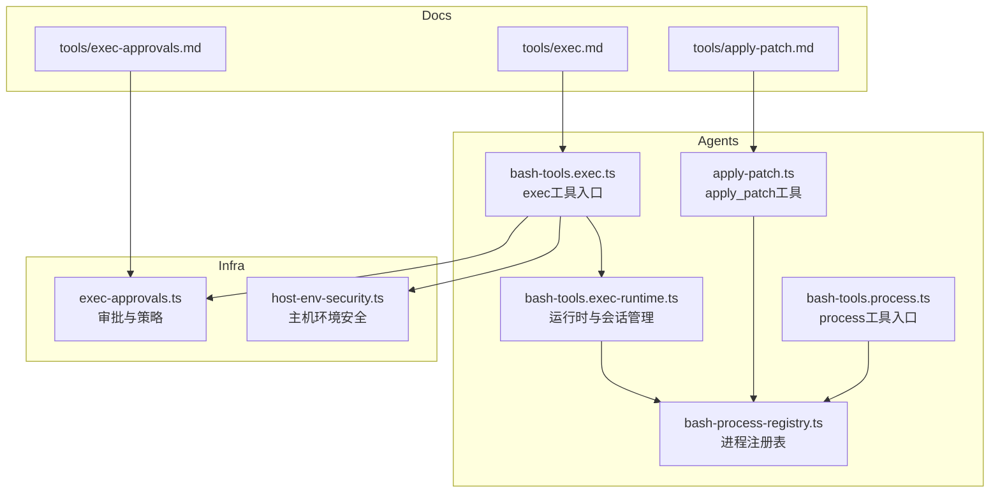
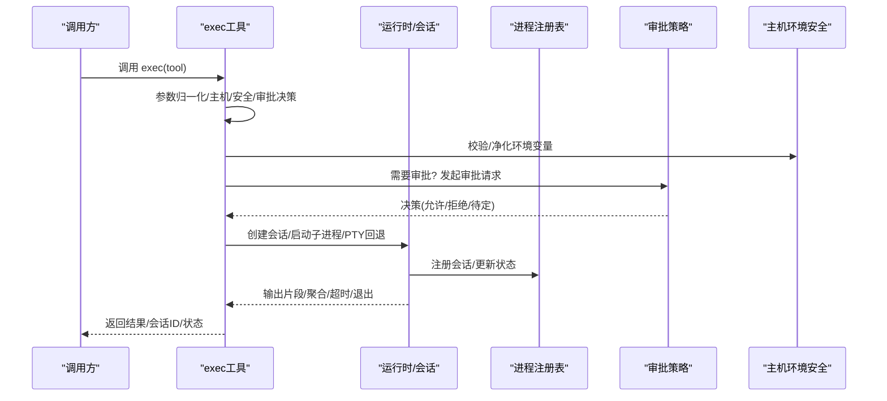
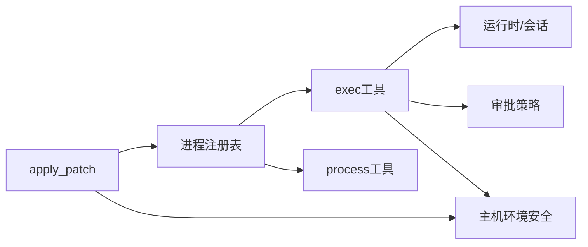

# 执行工具

<cite>
**本文引用的文件**
- [src/agents/bash-tools.exec.ts](file://src/agents/bash-tools.exec.ts)
- [src/agents/bash-tools.exec-runtime.ts](file://src/agents/bash-tools.exec-runtime.ts)
- [src/agents/bash-tools.exec-types.ts](file://src/agents/bash-tools.exec-types.ts)
- [src/agents/bash-tools.process.ts](file://src/agents/bash-tools.process.ts)
- [src/agents/apply-patch.ts](file://src/agents/apply-patch.ts)
- [src/agents/bash-process-registry.ts](file://src/agents/bash-process-registry.ts)
- [src/infra/exec-approvals.ts](file://src/infra/exec-approvals.ts)
- [src/infra/host-env-security.ts](file://src/infra/host-env-security.ts)
- [docs/tools/exec.md](file://docs/tools/exec.md)
- [docs/tools/apply-patch.md](file://docs/tools/apply-patch.md)
- [docs/tools/exec-approvals.md](file://docs/tools/exec-approvals.md)
- [src/agents/pi-tools.sandbox-mounted-paths.workspace-only.test.ts](file://src/agents/pi-tools.sandbox-mounted-paths.workspace-only.test.ts)
- [src/agents/pi-tools-agent-config.test.ts](file://src/agents/pi-tools-agent-config.test.ts)
- [src/agents/bash-tools.exec.pty.test.ts](file://src/agents/bash-tools.exec.pty.test.ts)
- [src/agents/bash-tools.exec.path.test.ts](file://src/agents/bash-tools.exec.path.test.ts)
- [src/agents/bash-tools.exec.background-abort.test.ts](file://src/agents/bash-tools.exec.background-abort.test.ts)
- [src/agents/bash-tools.exec.script-preflight.test.ts](file://src/agents/bash-tools.exec.script-preflight.test.ts)
- [src/agents/bash-tools.process.poll-timeout.test.ts](file://src/agents/bash-tools.process.poll-timeout.test.ts)
- [src/agents/bash-tools.process.send-keys.test.ts](file://src/agents/bash-tools.process.send-keys.test.ts)
- [src/agents/bash-tools.process.supervisor.test.ts](file://src/agents/bash-tools.process.supervisor.test.ts)
</cite>

## 目录
1. [简介](#简介)
2. [项目结构](#项目结构)
3. [核心组件](#核心组件)
4. [架构总览](#架构总览)
5. [详细组件分析](#详细组件分析)
6. [依赖关系分析](#依赖关系分析)
7. [性能考量](#性能考量)
8. [故障排除指南](#故障排除指南)
9. [结论](#结论)
10. [附录](#附录)

## 简介
本文件面向OpenClaw执行工具系统，围绕本地命令执行与进程管理展开，重点覆盖以下能力：
- exec工具：支持前台与后台执行、TTY支持、主机选择（沙箱/网关/节点）、安全策略与审批流程、超时与输出截断、脚本预检等。
- process工具：用于列出、轮询、查看日志、向后台会话写入输入、发送键序列、粘贴文本、终止或移除会话。
- apply_patch工具：以结构化补丁格式对多文件进行增删改操作，支持工作区限制与沙箱路径校验。

同时，文档系统性阐述权限控制（工具策略、审批、提升模式）、安全策略（环境变量过滤、PATH限制、安全二进制白名单）、资源管理（输出截断、会话生命周期）、性能监控与可观测性、以及常见问题排查方法，并提供可直接落地的使用示例。

## 项目结构
执行工具相关代码主要分布在以下模块：
- agents层：exec、process、apply_patch工具实现及其运行时封装
- infra层：执行审批、主机环境安全、路径与策略解析
- docs：官方工具说明与策略文档

图表来源
- [src/agents/bash-tools.exec.ts:1-599](file://src/agents/bash-tools.exec.ts#L1-L599)
- [src/agents/bash-tools.exec-runtime.ts:1-599](file://src/agents/bash-tools.exec-runtime.ts#L1-L599)
- [src/agents/bash-tools.process.ts:1-656](file://src/agents/bash-tools.process.ts#L1-L656)
- [src/agents/apply-patch.ts:1-583](file://src/agents/apply-patch.ts#L1-L583)
- [src/agents/bash-process-registry.ts:1-310](file://src/agents/bash-process-registry.ts#L1-L310)
- [src/infra/exec-approvals.ts:1-590](file://src/infra/exec-approvals.ts#L1-L590)
- [src/infra/host-env-security.ts:1-158](file://src/infra/host-env-security.ts#L1-L158)
- [docs/tools/exec.md:1-205](file://docs/tools/exec.md#L1-L205)
- [docs/tools/apply-patch.md:1-52](file://docs/tools/apply-patch.md#L1-L52)
- [docs/tools/exec-approvals.md:1-398](file://docs/tools/exec-approvals.md#L1-L398)

章节来源
- [src/agents/bash-tools.exec.ts:1-599](file://src/agents/bash-tools.exec.ts#L1-L599)
- [src/agents/bash-tools.exec-runtime.ts:1-599](file://src/agents/bash-tools.exec-runtime.ts#L1-L599)
- [src/agents/bash-tools.process.ts:1-656](file://src/agents/bash-tools.process.ts#L1-L656)
- [src/agents/apply-patch.ts:1-583](file://src/agents/apply-patch.ts#L1-L583)
- [src/agents/bash-process-registry.ts:1-310](file://src/agents/bash-process-registry.ts#L1-L310)
- [src/infra/exec-approvals.ts:1-590](file://src/infra/exec-approvals.ts#L1-L590)
- [src/infra/host-env-security.ts:1-158](file://src/infra/host-env-security.ts#L1-L158)
- [docs/tools/exec.md:1-205](file://docs/tools/exec.md#L1-L205)
- [docs/tools/apply-patch.md:1-52](file://docs/tools/apply-patch.md#L1-L52)
- [docs/tools/exec-approvals.md:1-398](file://docs/tools/exec-approvals.md#L1-L398)

## 核心组件
- exec工具：统一的命令执行入口，负责参数归一化、主机选择、安全策略评估、审批请求、会话创建与输出聚合、超时与退出通知。
- process工具：对exec产生的后台会话进行生命周期管理，包括轮询、日志切片、写入输入、发送键序列、粘贴文本、终止与清理。
- apply_patch工具：解析结构化补丁，按hunk对文件进行增删改，支持工作区限制与沙箱路径校验，记录变更摘要并返回结果。
- 运行时与注册表：封装子进程启动、PTY回退、输出截断、会话状态迁移、心跳通知、超时处理等。
- 审批与安全：定义执行主机、安全级别、审批模式；严格过滤主机环境变量与PATH；提供安全二进制白名单与允许列表策略。

章节来源
- [src/agents/bash-tools.exec.ts:151-599](file://src/agents/bash-tools.exec.ts#L151-L599)
- [src/agents/bash-tools.process.ts:119-656](file://src/agents/bash-tools.process.ts#L119-L656)
- [src/agents/apply-patch.ts:85-350](file://src/agents/apply-patch.ts#L85-L350)
- [src/agents/bash-tools.exec-runtime.ts:289-599](file://src/agents/bash-tools.exec-runtime.ts#L289-L599)
- [src/agents/bash-process-registry.ts:86-310](file://src/agents/bash-process-registry.ts#L86-L310)
- [src/infra/exec-approvals.ts:10-590](file://src/infra/exec-approvals.ts#L10-L590)
- [src/infra/host-env-security.ts:59-158](file://src/infra/host-env-security.ts#L59-L158)

## 架构总览
下图展示了exec工具从调用到会话管理的整体流程，以及与审批、安全策略、进程注册表的关系。

图表来源
- [src/agents/bash-tools.exec.ts:209-594](file://src/agents/bash-tools.exec.ts#L209-L594)
- [src/agents/bash-tools.exec-runtime.ts:289-599](file://src/agents/bash-tools.exec-runtime.ts#L289-L599)
- [src/agents/bash-process-registry.ts:86-213](file://src/agents/bash-process-registry.ts#L86-L213)
- [src/infra/exec-approvals.ts:484-590](file://src/infra/exec-approvals.ts#L484-L590)
- [src/infra/host-env-security.ts:59-129](file://src/infra/host-env-security.ts#L59-L129)

## 详细组件分析

### exec 工具
- 功能要点
  - 支持前台与后台执行：通过yieldMs/background控制自动挂起；若禁用后台则同步执行。
  - 主机选择：sandbox（默认）、gateway、node；host参数仅在非提升模式下允许覆盖。
  - 安全策略：deny/allowlist/full三档；当elevated解析为full时强制security=full。
  - 审批流程：ask=off/always/on-miss；审批通过后在网关侧发出“运行中/完成/拒绝”系统事件。
  - 环境变量：主机执行时严格过滤危险变量与PATH修改；沙箱内保留原始环境。
  - PATH处理：gateway合并登录shell PATH；sandbox通过容器登录shell与内部变量追加；node忽略请求级PATH覆盖。
  - 脚本预检：检测Python/Node脚本中的Shell变量泄漏与首行疑似Shell语法，避免模型生成错误脚本。
  - 输出与超时：默认最大输出字符数与挂起输出上限；支持总体/无输出超时；退出通知可配置。
  - PTY支持：优先PTY执行，失败时回退至普通子进程；支持光标查询响应处理。
- 关键参数与行为
  - command（必填）、workdir、env、yieldMs、background、timeout、pty、host、security、ask、node、elevated。
  - elevated：开启后强制走gateway且跳过审批；默认level由配置决定（on/off/ask/full）。
  - notifyOnExit/notifyOnExitEmptySuccess：后台退出通知策略。
- 使用示例
  - 前台执行：直接传入command，等待完成返回。
  - 后台执行：设置yieldMs或background，随后用process工具轮询与交互。
  - TTY需求：对终端UI或交互式编码场景启用pty。
  - 沙箱执行：默认host=sandbox，需先启用沙箱模式；否则显式切换host或关闭沙箱。
  - 审批与安全：在gateway/node上执行需满足allowlist或获得审批；可通过tools.exec.security与ask微调策略。

章节来源
- [src/agents/bash-tools.exec.ts:151-599](file://src/agents/bash-tools.exec.ts#L151-L599)
- [src/agents/bash-tools.exec-runtime.ts:98-599](file://src/agents/bash-tools.exec-runtime.ts#L98-L599)
- [src/agents/bash-tools.exec-types.ts:5-79](file://src/agents/bash-tools.exec-types.ts#L5-L79)
- [docs/tools/exec.md:15-183](file://docs/tools/exec.md#L15-L183)

### process 工具
- 功能要点
  - 列出：显示最近运行/已完成会话，含名称、时长、状态、尾部输出。
  - 轮询：等待后台会话退出，支持timeout；根据新输出建议重试间隔。
  - 日志：按窗口切片返回最后N行，支持offset/limit分页。
  - 输入：向后台会话stdin写入数据；支持send-keys（tmux风格）、paste（可选bracketed模式）、submit（发送回车）。
  - 终止与清理：kill移除会话；remove可请求取消或强制终止；clear清理已完成会话。
  - 作用域：按scopeKey隔离不同任务的会话集合。
- 关键参数
  - action（list/poll/log/write/send-keys/submit/paste/kill/clear/remove）
  - sessionId（除list外均需）
  - keys/hex/literal/text/bracketed/eof/offset/limit/timeout
- 使用示例
  - 后台执行后轮询：exec后用process poll获取退出码与最终输出。
  - 交互式输入：send-keys模拟按键，paste粘贴文本，submit发送回车。
  - 清理：clear移除已完成会话，remove移除运行中会话（先尝试取消，失败则强制终止）。

章节来源
- [src/agents/bash-tools.process.ts:119-656](file://src/agents/bash-tools.process.ts#L119-L656)
- [src/agents/bash-process-registry.ts:86-310](file://src/agents/bash-process-registry.ts#L86-L310)

### apply_patch 工具
- 功能要点
  - 解析结构化补丁：Begin/End标记包裹，支持Add/Update/Delete三种hunk。
  - 文件操作：新增文件、删除文件、更新文件内容（支持Move to重命名）。
  - 路径限制：默认仅限工作区目录（workspaceOnly=true），可显式关闭以允许跨目录写入/删除。
  - 沙箱支持：在沙箱中通过桥接读写文件，路径校验遵循沙箱规则。
  - 变更摘要：统计新增/修改/删除文件，汇总为简洁报告。
- 关键参数
  - input（必填，包含Begin/End标记的完整补丁）
  - workspaceOnly（默认true，谨慎设为false）
- 使用示例
  - 多文件批量变更：构造包含多个Update/Add/Delete的补丁块。
  - 移动文件：在Update File块中使用Move to子句。
  - 沙箱内应用：确保补丁路径在工作区内或显式允许跨目录。

章节来源
- [src/agents/apply-patch.ts:85-350](file://src/agents/apply-patch.ts#L85-L350)
- [docs/tools/apply-patch.md:14-52](file://docs/tools/apply-patch.md#L14-L52)
- [src/agents/pi-tools.sandbox-mounted-paths.workspace-only.test.ts:87-128](file://src/agents/pi-tools.sandbox-mounted-paths.workspace-only.test.ts#L87-L128)
- [src/agents/pi-tools-agent-config.test.ts:41-86](file://src/agents/pi-tools-agent-config.test.ts#L41-L86)

### 运行时与会话管理
- 会话生命周期
  - 创建：分配session id，初始化输出缓冲、截断标记、最大输出字符数。
  - 运行：捕获stdout/stderr，分块聚合，实时tail与截断策略生效。
  - 结束：标记退出状态、退出码/信号、迁移至已完成集合；清理stdio与监听器。
  - 清理：定时清理长时间未访问的已完成会话。
- 输出与截断
  - pendingMaxOutput与maxOutput分别控制挂起输出与聚合输出上限。
  - tail固定长度尾部缓存，便于快速展示最新输出。
- PTY回退
  - 若PTY失败，自动回退至普通子进程；对光标查询请求进行响应注入。
- 退出通知
  - 后台退出时可按策略发送系统事件与心跳唤醒。

章节来源
- [src/agents/bash-tools.exec-runtime.ts:289-599](file://src/agents/bash-tools.exec-runtime.ts#L289-L599)
- [src/agents/bash-process-registry.ts:86-310](file://src/agents/bash-process-registry.ts#L86-L310)

### 权限控制与安全策略
- 工具策略
  - exec属于exec工具族，受工具策略控制；apply_patch作为exec的子工具，默认随工具策略生效。
- 审批与主机策略
  - host=gateway/node时，需满足exec-approvals.json中的security与ask策略；ask=off/always/on-miss决定是否需要人工确认。
  - elevated=true时强制走gateway且跳过审批（security=full）。
- 环境变量与PATH
  - 主机执行时严格过滤危险变量与PATH修改；PATH仅在gateway上允许合并登录shell PATH，其余场景拒绝请求级PATH覆盖。
  - 沙箱内通过容器登录shell与内部变量追加PATH。
- 安全二进制与允许列表
  - allowlist模式下，仅允许明确路径匹配的可执行文件；链式命令与重定向需每段都满足allowlist。
  - safeBins为stdin-only的轻量白名单，不适用于解释器/运行时；需自定义profiles并置于可信目录。
- 沙箱路径限制
  - apply_patch默认仅限工作区；测试覆盖了沙箱挂载场景下的路径逃逸防护。

章节来源
- [src/infra/exec-approvals.ts:10-590](file://src/infra/exec-approvals.ts#L10-L590)
- [src/infra/host-env-security.ts:59-158](file://src/infra/host-env-security.ts#L59-L158)
- [docs/tools/exec-approvals.md:142-241](file://docs/tools/exec-approvals.md#L142-L241)
- [docs/tools/exec.md:30-62](file://docs/tools/exec.md#L30-L62)
- [src/agents/pi-tools.sandbox-mounted-paths.workspace-only.test.ts:87-128](file://src/agents/pi-tools.sandbox-mounted-paths.workspace-only.test.ts#L87-L128)

## 依赖关系分析
- exec工具依赖
  - 运行时：runExecProcess、会话注册表、系统事件与心跳、PTY处理。
  - 审批：exec-approvals解析与socket通信。
  - 安全：主机环境变量过滤、PATH处理、安全二进制策略。
- process工具依赖
  - 进程注册表：读取/更新会话状态，执行kill/清理。
- apply_patch工具依赖
  - 补丁解析与hunk应用、边界文件读写、沙箱路径校验。

图表来源
- [src/agents/bash-tools.exec.ts:151-599](file://src/agents/bash-tools.exec.ts#L151-L599)
- [src/agents/bash-tools.exec-runtime.ts:289-599](file://src/agents/bash-tools.exec-runtime.ts#L289-L599)
- [src/agents/bash-tools.process.ts:119-656](file://src/agents/bash-tools.process.ts#L119-L656)
- [src/agents/apply-patch.ts:85-350](file://src/agents/apply-patch.ts#L85-L350)
- [src/agents/bash-process-registry.ts:86-310](file://src/agents/bash-process-registry.ts#L86-L310)
- [src/infra/exec-approvals.ts:412-482](file://src/infra/exec-approvals.ts#L412-L482)
- [src/infra/host-env-security.ts:59-158](file://src/infra/host-env-security.ts#L59-L158)

## 性能考量
- 输出截断与内存占用
  - pendingMaxOutput与maxOutput限制挂起与聚合输出大小，避免内存膨胀。
  - tail固定长度尾部缓存，降低大输出场景的渲染压力。
- 轮询与重试
  - process poll支持timeout与动态重试建议，减少无效轮询。
- PTY回退
  - 在不支持PTY的环境中自动回退，保证兼容性但可能影响交互体验。
- 会话清理
  - 完成会话定期清理，防止长期运行导致的内存与句柄泄漏。

章节来源
- [src/agents/bash-tools.exec-runtime.ts:77-88](file://src/agents/bash-tools.exec-runtime.ts#L77-L88)
- [src/agents/bash-process-registry.ts:286-310](file://src/agents/bash-process-registry.ts#L286-L310)
- [src/agents/bash-tools.process.ts:76-87](file://src/agents/bash-tools.process.ts#L76-L87)

## 故障排除指南
- 常见问题与定位
  - 沙箱不可用：host=sandbox时报错，需启用沙箱或切换host=gateway/node。
  - 审批未决：返回approval-pending，检查exec-approvals.json与UI/聊天渠道审批。
  - 超时：检查timeout设置与命令耗时；process poll可调整等待时间。
  - 环境变量被拒：主机执行时PATH与危险变量会被拒绝，需通过登录shell PATH或允许列表解决。
  - 脚本预检失败：Python/Node脚本中存在Shell变量语法或疑似Shell首行，修正后重试。
  - PTY失败：自动回退；如仍异常，检查终端与权限。
- 排查步骤
  - 查看process list/poll确认会话状态与退出原因。
  - 使用process log分页查看历史输出，结合tail定位问题。
  - 检查exec-approvals.json与安全策略，必要时临时放宽ask或添加allowlist条目。
  - 对apply_patch，确认补丁格式与路径是否在工作区内。

章节来源
- [src/agents/bash-tools.exec.ts:336-348](file://src/agents/bash-tools.exec.ts#L336-L348)
- [src/agents/bash-tools.exec-runtime.ts:520-599](file://src/agents/bash-tools.exec-runtime.ts#L520-L599)
- [src/agents/bash-tools.process.ts:294-386](file://src/agents/bash-tools.process.ts#L294-L386)
- [src/agents/bash-tools.exec.pty.test.ts:1-200](file://src/agents/bash-tools.exec.pty.test.ts#L1-L200)
- [src/agents/bash-tools.exec.path.test.ts:1-200](file://src/agents/bash-tools.exec.path.test.ts#L1-L200)
- [src/agents/bash-tools.exec.background-abort.test.ts:1-200](file://src/agents/bash-tools.exec.background-abort.test.ts#L1-L200)
- [src/agents/bash-tools.exec.script-preflight.test.ts:1-200](file://src/agents/bash-tools.exec.script-preflight.test.ts#L1-L200)
- [src/agents/bash-tools.process.poll-timeout.test.ts:1-200](file://src/agents/bash-tools.process.poll-timeout.test.ts#L1-L200)
- [src/agents/bash-tools.process.send-keys.test.ts:1-200](file://src/agents/bash-tools.process.send-keys.test.ts#L1-L200)
- [src/agents/bash-tools.process.supervisor.test.ts:1-200](file://src/agents/bash-tools.process.supervisor.test.ts#L1-L200)

## 结论
OpenClaw执行工具体系以exec为核心，辅以process与apply_patch，形成从命令执行、会话管理到结构化变更的完整闭环。通过严格的审批与安全策略、精细的资源管理与可观测性，既保障了安全性，又提供了灵活的使用方式。建议在生产环境中优先采用allowlist与安全二进制白名单，谨慎启用elevated与full模式，并配合审批流程与日志监控，确保可控与可追溯。

## 附录

### 使用示例索引
- exec前台执行：参见[docs/tools/exec.md:151-155](file://docs/tools/exec.md#L151-L155)
- exec后台+轮询：参见[docs/tools/exec.md:157-162](file://docs/tools/exec.md#L157-L162)
- send-keys示例：参见[docs/tools/exec.md:164-170](file://docs/tools/exec.md#L164-L170)
- submit示例：参见[docs/tools/exec.md:172-176](file://docs/tools/exec.md#L172-L176)
- paste示例：参见[docs/tools/exec.md:178-182](file://docs/tools/exec.md#L178-L182)
- apply_patch启用与配置：参见[docs/tools/exec.md:184-205](file://docs/tools/exec.md#L184-L205)
- apply_patch示例：参见[docs/tools/apply-patch.md:44-51](file://docs/tools/apply-patch.md#L44-L51)