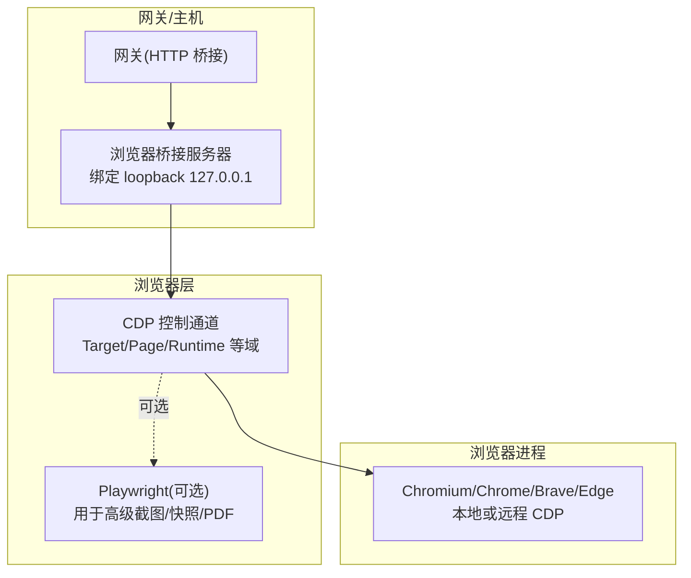
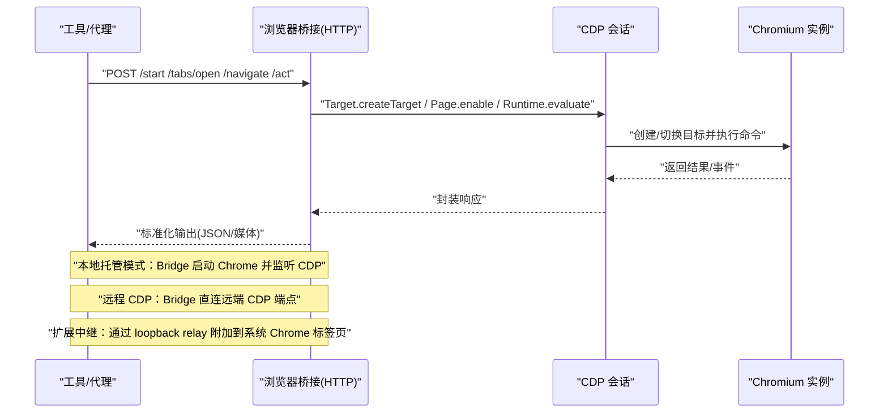
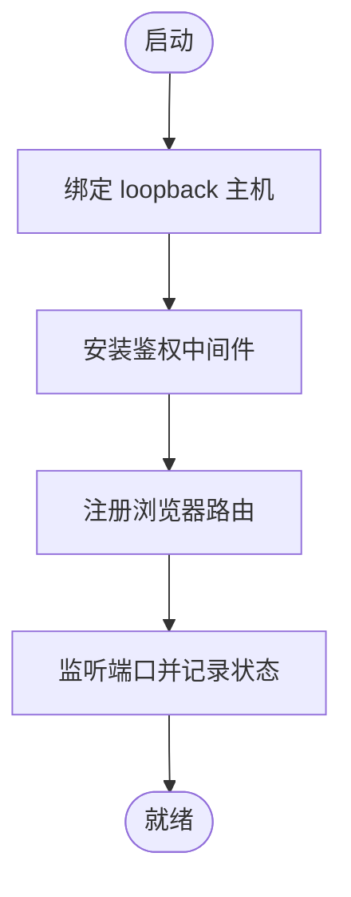
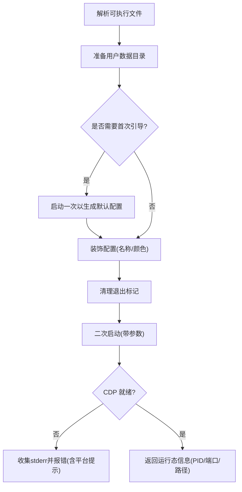
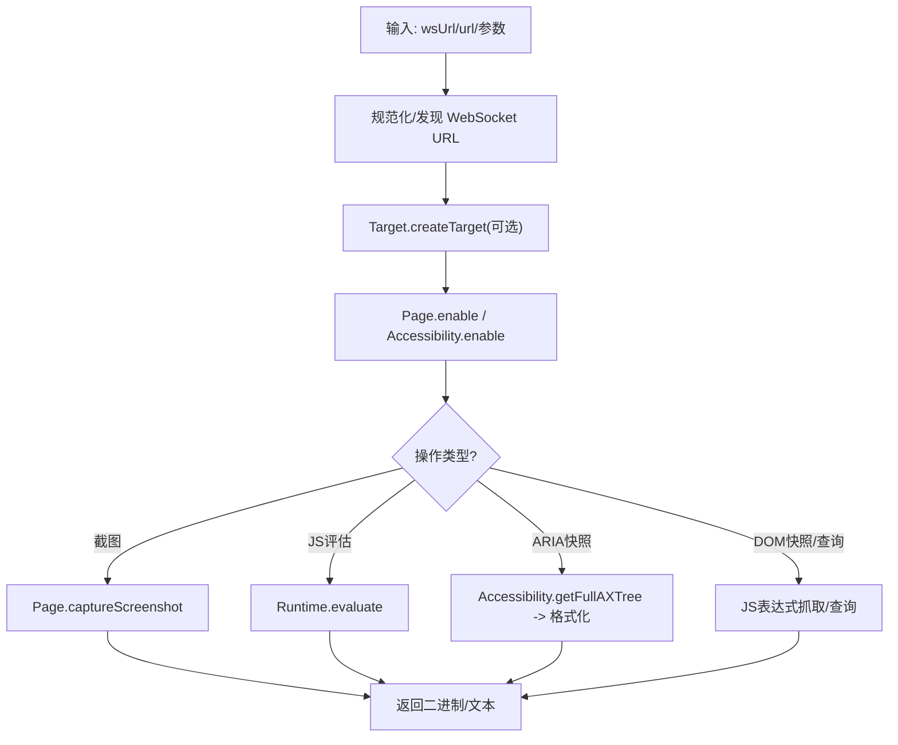

# 浏览器控制

<cite>
**本文引用的文件**
- [browser.md](file://docs/tools/browser.md)
- [browser-linux-troubleshooting.md](file://docs/tools/browser-linux-troubleshooting.md)
- [browser-login.md](file://docs/tools/browser-login.md)
- [browser-wsl2-windows-remote-cdp-troubleshooting.md](file://docs/tools/browser-wsl2-windows-remote-cdp-troubleshooting.md)
- [chrome.ts](file://src/browser/chrome.ts)
- [cdp.ts](file://src/browser/cdp.ts)
- [bridge-server.ts](file://src/browser/bridge-server.ts)
- [chrome.executables.ts](file://src/browser/chrome.executables.ts)
- [chrome.profile-decoration.ts](file://src/browser/chrome.profile-decoration.ts)
</cite>

## 目录
1. [简介](#简介)
2. [项目结构](#项目结构)
3. [核心组件](#核心组件)
4. [架构总览](#架构总览)
5. [详细组件分析](#详细组件分析)
6. [依赖关系分析](#依赖关系分析)
7. [性能与优化](#性能与优化)
8. [故障排除指南](#故障排除指南)
9. [结论](#结论)
10. [附录：使用与开发示例](#附录使用与开发示例)

## 简介
本文件面向使用与开发 OpenClaw 浏览器控制能力的工程师与高级用户，系统性说明浏览器实例管理、标签页操作、页面交互与快照功能；详解配置项、多实例/多配置文件、远程连接与安全策略；并提供自动化最佳实践、生命周期管理、性能优化与排障建议。内容基于仓库中的官方文档与核心实现源码提炼而成。

## 项目结构
OpenClaw 的浏览器控制由“网关侧桥接服务 + CDP 连接 + 可选 Playwright 能力”构成，支持本地托管浏览器、远程 CDP、扩展中继等多种模式，并通过统一的 HTTP 接口对外提供稳定、可确定性的自动化能力。

图示来源
- [bridge-server.ts:59-132](file://src/browser/bridge-server.ts#L59-L132)
- [cdp.ts:19-47](file://src/browser/cdp.ts#L19-L47)

章节来源
- [browser.md:10-103](file://docs/tools/browser.md#L10-L103)

## 核心组件
- 浏览器桥接服务（Loopback HTTP 服务）
  - 提供状态、启动/停止、标签页、导航、动作、截图、快照、Cookie/Storage 设置、网络与调试等接口。
  - 默认仅绑定 loopback，配合网关认证使用。
- Chrome 启动与生命周期管理
  - 自动选择可用浏览器二进制，准备用户数据目录，注入启动参数，等待 CDP 就绪，处理启动失败诊断。
- CDP 抽象与通用能力
  - 统一 WebSocket URL 规范化、截图、目标创建、JS 评估、无障碍树快照、DOM 快照、文本/HTML 提取、选择器查询等。
- 配置与多配置文件
  - 支持默认 profile、多 profile、远程 CDP、扩展中继、SSRF 安全策略、超时与端口派生规则等。
- 平台可执行文件解析
  - 在 macOS/Linux/Windows 上自动探测系统默认 Chromium 或指定路径，兼容 snap、用户/系统安装路径等。

章节来源
- [bridge-server.ts:19-132](file://src/browser/bridge-server.ts#L19-L132)
- [chrome.ts:69-448](file://src/browser/chrome.ts#L69-L448)
- [cdp.ts:19-486](file://src/browser/cdp.ts#L19-L486)
- [browser.md:54-103](file://docs/tools/browser.md#L54-L103)

## 架构总览
下图展示从“工具调用/代理路由”到“浏览器进程”的完整链路，以及在不同拓扑下的连接方式（本地托管、远程 CDP、扩展中继）。

图示来源
- [bridge-server.ts:59-132](file://src/browser/bridge-server.ts#L59-L132)
- [cdp.ts:103-140](file://src/browser/cdp.ts#L103-L140)
- [browser.md:139-332](file://docs/tools/browser.md#L139-L332)

## 详细组件分析

### 1) 浏览器桥接服务器（Loopback HTTP）
- 职责
  - 安装通用中间件与鉴权中间件（令牌/密码），绑定 loopback 地址，注册路由，暴露浏览器控制 API。
  - 可选提供沙箱观察器的 noVNC 入口。
- 安全
  - 强制 loopback 绑定；若未配置鉴权则直接报错拒绝启动。
- 状态
  - 记录已加载的 profile 列表，便于后续路由分发。

图示来源
- [bridge-server.ts:59-132](file://src/browser/bridge-server.ts#L59-L132)

章节来源
- [bridge-server.ts:19-132](file://src/browser/bridge-server.ts#L19-L132)
- [browser.md:369-392](file://docs/tools/browser.md#L369-L392)

### 2) Chrome 启动与生命周期
- 自动选择浏览器
  - 优先使用配置的 executablePath；否则按平台探测系统默认浏览器或内置候选列表。
- 用户数据目录与装饰
  - 首次启动引导生成 Local State/Preferences；根据配置装饰主题色与名称；确保干净退出标记。
- 启动参数与环境
  - 注入 remote-debugging-port、user-data-dir、无头/headless、禁用组件更新、沙箱开关、平台特定参数等。
- 就绪检测与错误诊断
  - 通过 CDP 可达性检查与健康命令探测；失败时收集 stderr 片段与平台提示（如 Linux 无沙箱）。

图示来源
- [chrome.ts:238-415](file://src/browser/chrome.ts#L238-L415)
- [chrome.executables.ts:599-625](file://src/browser/chrome.executables.ts#L599-L625)
- [chrome.profile-decoration.ts:129-198](file://src/browser/chrome.profile-decoration.ts#L129-L198)

章节来源
- [chrome.ts:69-448](file://src/browser/chrome.ts#L69-L448)
- [chrome.executables.ts:1-626](file://src/browser/chrome.executables.ts#L1-L626)
- [chrome.profile-decoration.ts:1-199](file://src/browser/chrome.profile-decoration.ts#L1-L199)

### 3) CDP 抽象与通用能力
- URL 规范化
  - 处理容器/反向代理场景下的 0.0.0.0/[::] 绑定、协议升级、凭据透传、查询参数合并。
- 截图
  - 支持 PNG/JPEG，可选整页截图，自动获取布局尺寸作为裁剪区域。
- 目标创建
  - 通过 Target.createTarget 创建新标签页，结合 SSRF 策略前置校验导航地址。
- JS 评估与无障碍树
  - Runtime.evaluate 执行表达式；Accessibility.getFullAXTree 获取无障碍树并格式化为带 ref 的节点序列。
- DOM 快照与文本提取
  - 通过 JS 表达式抓取 DOM 结构、文本、属性等，限制节点数与文本长度，避免过大负载。
- 选择器查询
  - 在页面上下文执行选择器查询，返回匹配元素的精简信息。

图示来源
- [cdp.ts:19-486](file://src/browser/cdp.ts#L19-L486)

章节来源
- [cdp.ts:19-486](file://src/browser/cdp.ts#L19-L486)

### 4) 配置与多配置文件
- 默认 profile 与多 profile
  - 默认 openclaw（托管）、chrome（扩展中继）、remote（远程 CDP）；也可自定义命名 profile。
- 远程 CDP
  - 支持 HTTP(S) 发现端点与直连 WebSocket 端点；可携带凭据与查询参数。
- SSRF 安全策略
  - 受信任网络模型或严格公开浏览模型；可配置允许列表与精确主机白名单。
- 超时与端口派生
  - 基于网关端口派生浏览器控制端口与 relay 端口；可覆盖单实例端口。
- 其他
  - 无头模式、沙箱开关、额外启动参数、颜色与 UI 装饰等。

章节来源
- [browser.md:54-103](file://docs/tools/browser.md#L54-L103)
- [browser.md:139-244](file://docs/tools/browser.md#L139-L244)

### 5) 扩展中继与跨主机场景
- 扩展中继
  - 通过 loopback relay 附加到系统 Chrome 标签页；可在需要时调整 relay 绑定地址以跨命名空间访问。
- WSL2 + Windows
  - 分层验证：Windows Chrome CDP 可达性、WSL2 可达性、配置正确性、UI 来源与鉴权、最终端到端控制。
- 选择建议
  - 仅需控制：优先远程 CDP；需要扩展生态：使用扩展中继。

章节来源
- [browser.md:277-343](file://docs/tools/browser.md#L277-L343)
- [browser-wsl2-windows-remote-cdp-troubleshooting.md:20-171](file://docs/tools/browser-wsl2-windows-remote-cdp-troubleshooting.md#L20-L171)

## 依赖关系分析
- 组件耦合
  - 桥接服务器依赖配置解析与路由注册；路由在运行时构建上下文并调用 CDP/Chrome 能力。
  - CDP 层对浏览器进程无直接依赖，仅通过 CDP 协议交互。
- 外部依赖
  - Chromium/Chrome/Brave/Edge 可执行文件；可选 Playwright（高级功能）。
- 安全边界
  - 本地托管模式默认 loopback；远程 CDP 需加密端点与短期凭据；扩展中继需谨慎暴露 relay。

图示来源
- [bridge-server.ts:104-115](file://src/browser/bridge-server.ts#L104-L115)
- [cdp.ts:1-17](file://src/browser/cdp.ts#L1-L17)
- [chrome.executables.ts:599-625](file://src/browser/chrome.executables.ts#L599-L625)

章节来源
- [bridge-server.ts:19-132](file://src/browser/bridge-server.ts#L19-L132)
- [cdp.ts:1-17](file://src/browser/cdp.ts#L1-L17)
- [chrome.executables.ts:599-625](file://src/browser/chrome.executables.ts#L599-L625)

## 性能与优化
- 启动与就绪
  - 使用最小必要参数启动，避免不必要的扩展与同步；在容器/受限环境中启用无沙箱并合理设置 shm。
- 截图与快照
  - 优先使用元素级截图而非整页，减少内存与传输开销；限制快照节点与文本长度。
- 远程 CDP
  - 选择就近区域端点，缩短网络往返；为长连接设置合理的握手与健康探测超时。
- 并发与隔离
  - 多配置文件/多实例应分配独立端口与用户数据目录，避免资源争用。

[本节为通用指导，不直接分析具体文件]

## 故障排除指南
- Linux（snap 包）
  - 现象：启动失败，提示无法在指定端口启动 CDP。
  - 根因：snap 包的 AppArmor 限制导致进程监控异常。
  - 方案：改用官方 deb 安装包或使用 attach-only 模式手动启动。
- WSL2 + Windows Chrome
  - 现象：CDP 不可达、UI 鉴权失败、扩展中继无连接。
  - 处理：分层验证（Windows CDP 可达性、WSL2 可达性、配置地址、UI 来源与鉴权、最终端到端）。
- 其他常见
  - 确认 loopback 绑定与鉴权配置；检查远程 CDP 凭据与加密；核对端口占用与防火墙。

章节来源
- [browser-linux-troubleshooting.md:9-140](file://docs/tools/browser-linux-troubleshooting.md#L9-L140)
- [browser-wsl2-windows-remote-cdp-troubleshooting.md:79-243](file://docs/tools/browser-wsl2-windows-remote-cdp-troubleshooting.md#L79-L243)

## 结论
OpenClaw 的浏览器控制以“桥接服务 + CDP + 可选 Playwright”为核心，提供统一、可确定的自动化接口。通过灵活的配置与多种连接模式，既能满足本地托管需求，也能适配远程与扩展中继场景。遵循安全策略与排障流程，可获得稳定可靠的自动化体验。

[本节为总结，不直接分析具体文件]

## 附录：使用与开发示例
以下示例聚焦“如何使用浏览器工具完成常见任务”，并给出参考路径以便进一步查阅实现细节。

- 启动/停止/状态
  - 使用 CLI 对指定 profile 执行 status/start/stop。
  - 参考：[browser.md:431-441](file://docs/tools/browser.md#L431-L441)
- 标签页管理
  - 列出标签、打开新标签、切换焦点、关闭标签。
  - 参考：[browser.md:441-449](file://docs/tools/browser.md#L441-L449)
- 导航与等待
  - 导航到 URL；等待 URL/glob、加载状态、JS 条件、可见元素等。
  - 参考：[browser.md:471-487](file://docs/tools/browser.md#L471-L487)
- 快照与交互
  - AI 快照（数字 ref）与角色快照（e12/ref）；点击/输入/滚动/拖拽/选择；高亮定位。
  - 参考：[browser.md:534-533](file://docs/tools/browser.md#L534-L533)
- 截图与 PDF
  - 元素截图/整页截图；PDF 输出（需 Playwright）。
  - 参考：[browser.md:452-466](file://docs/tools/browser.md#L452-L466)
- Cookie/Storage/环境设置
  - 读取/设置 Cookie、本地/会话存储；离线/请求头/凭据/地理/媒体/时区/语言/设备等。
  - 参考：[browser.md:495-511](file://docs/tools/browser.md#L495-L511)
- 远程 CDP 与扩展中继
  - 指定 remote profile 的 CDP URL；或使用 chrome profile 通过扩展中继控制现有标签页。
  - 参考：[browser.md:139-343](file://docs/tools/browser.md#L139-L343)
- 登录与安全
  - 在托管浏览器中手动登录；严格模式下限制 evaluate/JS 执行；保护远程 CDP 凭据。
  - 参考：[browser-login.md:11-68](file://docs/tools/browser-login.md#L11-L68)，[browser.md:623-632](file://docs/tools/browser.md#L623-L632)

章节来源
- [browser.md:431-674](file://docs/tools/browser.md#L431-L674)
- [browser-login.md:11-68](file://docs/tools/browser-login.md#L11-L68)