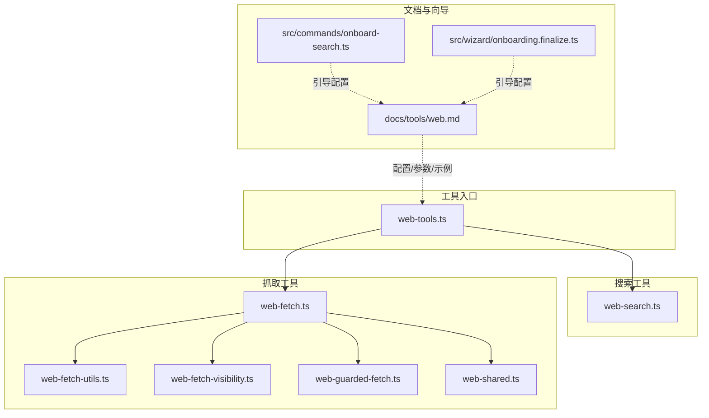
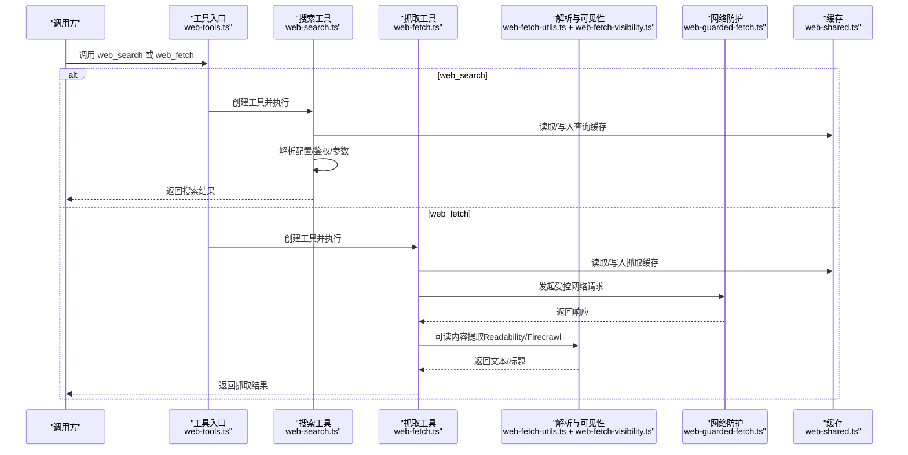
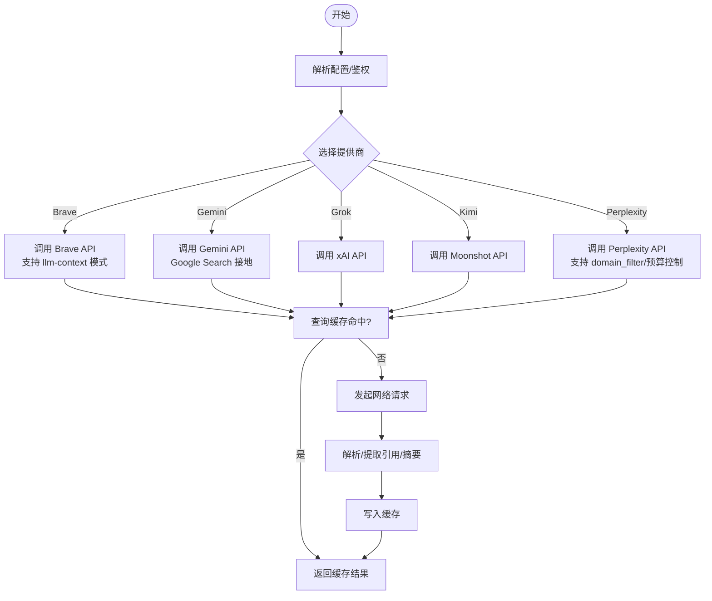
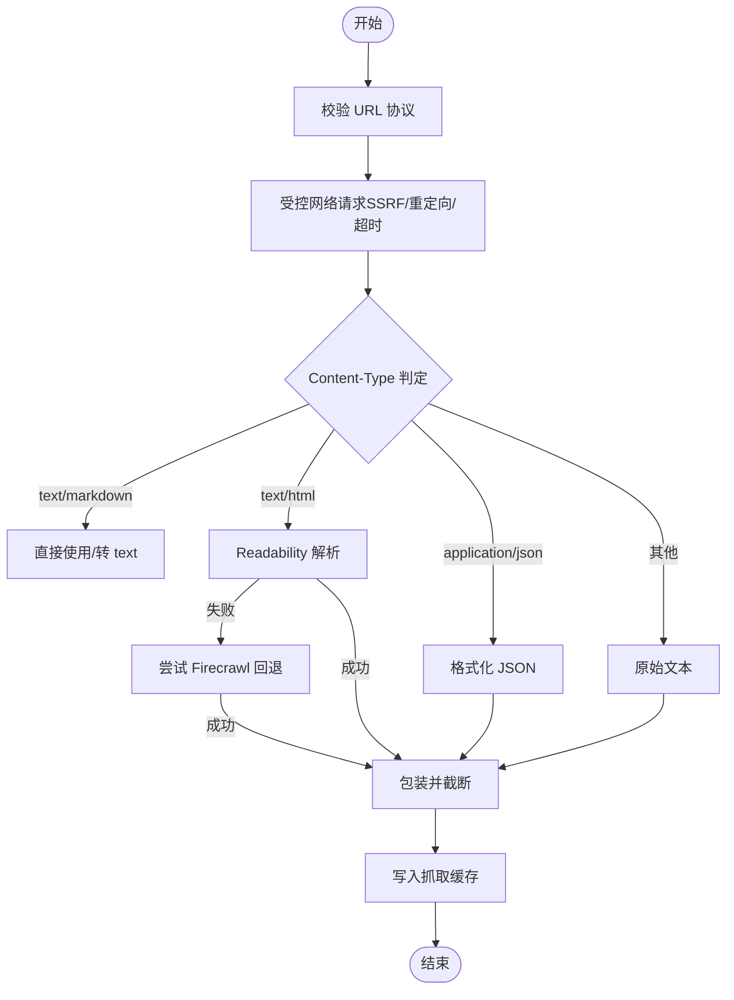
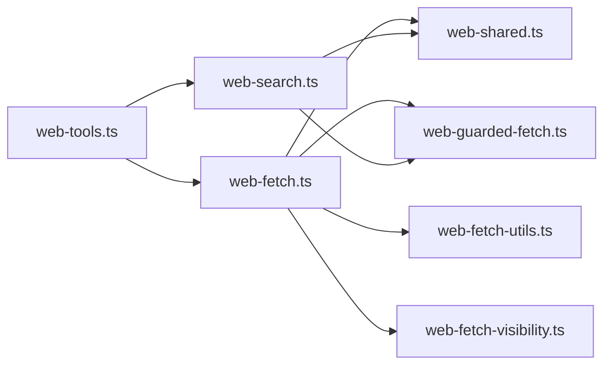

# 网页工具

<cite>
**本文引用的文件**
- [web-tools.ts](file://src/agents/tools/web-tools.ts)
- [web-search.ts](file://src/agents/tools/web-search.ts)
- [web-fetch.ts](file://src/agents/tools/web-fetch.ts)
- [web-fetch-utils.ts](file://src/agents/tools/web-fetch-utils.ts)
- [web-fetch-visibility.ts](file://src/agents/tools/web-fetch-visibility.ts)
- [web-guarded-fetch.ts](file://src/agents/tools/web-guarded-fetch.ts)
- [web-shared.ts](file://src/agents/tools/web-shared.ts)
- [web.md](file://docs/tools/web.md)
- [onboard-search.ts](file://src/commands/onboard-search.ts)
- [onboarding.finalize.ts](file://src/wizard/onboarding.finalize.ts)
</cite>

## 目录
1. [简介](#简介)
2. [项目结构](#项目结构)
3. [核心组件](#核心组件)
4. [架构总览](#架构总览)
5. [详细组件分析](#详细组件分析)
6. [依赖关系分析](#依赖关系分析)
7. [性能考量](#性能考量)
8. [故障排除指南](#故障排除指南)
9. [结论](#结论)
10. [附录](#附录)

## 简介
本文件面向使用者与开发者，系统化说明 OpenClaw 的网页工具体系：web_search（网络搜索）与 web_fetch（网页抓取与可读内容提取）。内容覆盖以下方面：
- 功能特性与工作原理：搜索引擎集成、内容解析与缓存机制
- 使用方法与参数配置：如何调用工具、参数说明与最佳实践
- 配置选项：API 密钥管理、搜索结果限制、缓存策略
- 与不同 AI 模型提供商的集成方式与认证机制
- 性能优化建议、错误处理与故障排除
- 具体使用示例：网络搜索与内容提取任务

## 项目结构
网页工具位于 agents/tools 子模块中，对外通过统一入口导出，并在文档与向导中提供配置与使用指引。

图表来源
- [web-tools.ts:1-3](file://src/agents/tools/web-tools.ts#L1-L3)
- [web-search.ts:1-20](file://src/agents/tools/web-search.ts#L1-L20)
- [web-fetch.ts:1-35](file://src/agents/tools/web-fetch.ts#L1-L35)
- [web-fetch-utils.ts:1-20](file://src/agents/tools/web-fetch-utils.ts#L1-L20)
- [web-fetch-visibility.ts:1-20](file://src/agents/tools/web-fetch-visibility.ts#L1-L20)
- [web-guarded-fetch.ts:1-20](file://src/agents/tools/web-guarded-fetch.ts#L1-L20)
- [web-shared.ts:1-20](file://src/agents/tools/web-shared.ts#L1-L20)
- [web.md:1-40](file://docs/tools/web.md#L1-L40)
- [onboard-search.ts:295-321](file://src/commands/onboard-search.ts#L295-L321)
- [onboarding.finalize.ts:510-546](file://src/wizard/onboarding.finalize.ts#L510-L546)

章节来源
- [web-tools.ts:1-3](file://src/agents/tools/web-tools.ts#L1-L3)
- [web.md:10-30](file://docs/tools/web.md#L10-L30)

## 核心组件
- web_search 工具
  - 支持的提供商：Brave、Gemini（Google Search 接地）、Grok、Kimi、Perplexity
  - 结果缓存：按查询键缓存，默认 15 分钟（可配置）
  - 参数：query、count、country、language、freshness、date_after、date_before、ui_lang（Brave）、domain_filter（Perplexity 专用）、max_tokens/max_tokens_per_page（Perplexity 专用）
- web_fetch 工具
  - 基于 HTTP GET 抓取网页并提取可读内容（HTML → markdown/text），不执行 JavaScript
  - 默认启用（除非显式禁用）
  - 可选 Firecrawl 回退：当 Readability 失败或不可用时自动尝试 Firecrawl
  - 安全与可见性：移除隐藏元素、剥离不可见 Unicode、SSRF 防护
  - 缓存：默认 15 分钟（可配置）

章节来源
- [web.md:20-27](file://docs/tools/web.md#L20-L27)
- [web-search.ts:25-30](file://src/agents/tools/web-search.ts#L25-L30)
- [web-search.ts:47-48](file://src/agents/tools/web-search.ts#L47-L48)
- [web-fetch.ts:37-48](file://src/agents/tools/web-fetch.ts#L37-L48)
- [web-fetch.ts:49-49](file://src/agents/tools/web-fetch.ts#L49-L49)

## 架构总览
下图展示了 web_search 与 web_fetch 的主要流程与依赖关系。

图表来源
- [web-tools.ts:1-3](file://src/agents/tools/web-tools.ts#L1-L3)
- [web-search.ts:1-25](file://src/agents/tools/web-search.ts#L1-L25)
- [web-fetch.ts:1-35](file://src/agents/tools/web-fetch.ts#L1-L35)
- [web-fetch-utils.ts:209-255](file://src/agents/tools/web-fetch-utils.ts#L209-L255)
- [web-guarded-fetch.ts:1-20](file://src/agents/tools/web-guarded-fetch.ts#L1-L20)
- [web-shared.ts:1-20](file://src/agents/tools/web-shared.ts#L1-L20)

## 详细组件分析

### 组件一：web_search（网络搜索）
- 提供商与认证
  - Brave：BRAVE_API_KEY 或 tools.web.search.apiKey；支持 llm-context 模式（返回页面片段而非标准 snippet）
  - Gemini：GEMINI_API_KEY 或 tools.web.search.gemini.apiKey；使用 Google Search 接地生成答案与引用
  - Grok：XAI_API_KEY 或 tools.web.search.grok.apiKey；基于 xAI 网络增强回答
  - Kimi：KIMI_API_KEY 或 MOONSHOT_API_KEY 或 tools.web.search.kimi.apiKey；使用 Moonshot 网络搜索
  - Perplexity：PERPLEXITY_API_KEY 或 OPENROUTER_API_KEY 或 tools.web.search.perplexity.apiKey；支持 domain_filter、max_tokens、max_tokens_per_page
- 参数与过滤
  - 通用：query、count（1-10）、country、language、freshness（day/week/month/year）、date_after、date_before
  - Brave 特有：search_lang、ui_lang；llm-context 模式下不支持 ui_lang、freshness、date_after、date_before
  - Perplexity 特有：domain_filter（允许/拒绝列表，不可混用）、max_tokens、max_tokens_per_page
- 缓存与超时
  - 查询级缓存，默认 TTL 15 分钟（可配置）
  - 默认超时 30 秒（可配置）
- 自动检测
  - 若未显式设置 provider，按 Brave→Gemini→Grok→Kimi→Perplexity 的顺序自动检测可用密钥

图表来源
- [web-search.ts:533-670](file://src/agents/tools/web-search.ts#L533-L670)
- [web-search.ts:25-48](file://src/agents/tools/web-search.ts#L25-L48)
- [web.md:30-57](file://docs/tools/web.md#L30-L57)

章节来源
- [web-search.ts:533-670](file://src/agents/tools/web-search.ts#L533-L670)
- [web.md:282-327](file://docs/tools/web.md#L282-L327)

### 组件二：web_fetch（网页抓取与内容提取）
- 抓取流程
  - URL 校验（仅 http/https）
  - 受控网络请求（SSRF 防护、重定向限制、超时控制）
  - 内容类型判定：text/markdown、text/html、application/json
  - 可读内容提取优先级：Readability → Firecrawl（可选回退）
  - 包装外部内容并截断至 maxChars（考虑包装开销）
  - 写入抓取缓存（默认 15 分钟）
- 可读内容提取
  - HTML 清洗：移除隐藏元素、注释、SVG/canvas 等
  - 可见性处理：剥离不可见 Unicode 字符
  - Readability 解析：估算嵌套深度防止栈/内存问题
  - 回退策略：若 Readability 失败且 Firecrawl 启用，则尝试 Firecrawl
- Firecrawl 集成
  - 可选启用：tools.web.fetch.firecrawl.enabled 或 FIRECRAWL_API_KEY
  - 参数：baseUrl、onlyMainContent、maxAgeMs、timeoutSeconds
  - 请求头：Authorization Bearer
  - 返回字段：text/markdown、title、finalUrl、status、warning
- 安全与可见性
  - SSRF 阻断（SsrFBlockedError）
  - 可见性清洗（hidden/aria-hidden/内联样式等）
  - 不可见 Unicode 清理（避免提示注入）

图表来源
- [web-fetch.ts:508-684](file://src/agents/tools/web-fetch.ts#L508-L684)
- [web-fetch-utils.ts:209-255](file://src/agents/tools/web-fetch-utils.ts#L209-L255)
- [web-fetch-visibility.ts:126-157](file://src/agents/tools/web-fetch-visibility.ts#L126-L157)
- [web-guarded-fetch.ts:1-20](file://src/agents/tools/web-guarded-fetch.ts#L1-L20)
- [web-shared.ts:1-20](file://src/agents/tools/web-shared.ts#L1-L20)

章节来源
- [web-fetch.ts:37-48](file://src/agents/tools/web-fetch.ts#L37-L48)
- [web-fetch.ts:508-684](file://src/agents/tools/web-fetch.ts#L508-L684)
- [web-fetch-utils.ts:209-255](file://src/agents/tools/web-fetch-utils.ts#L209-L255)
- [web-fetch-visibility.ts:126-157](file://src/agents/tools/web-fetch-visibility.ts#L126-L157)

### 组件三：配置与密钥管理
- web_search
  - tools.web.search.enabled（默认启用）
  - tools.web.search.apiKey（Brave）
  - tools.web.search.gemini.apiKey（Gemini）
  - tools.web.search.grok.apiKey（Grok）
  - tools.web.search.kimi.apiKey（Kimi）
  - tools.web.search.perplexity.apiKey（Perplexity）
  - tools.web.search.maxResults、timeoutSeconds、cacheTtlMinutes
- web_fetch
  - tools.web.fetch.enabled（默认启用）
  - tools.web.fetch.maxChars、maxCharsCap、maxResponseBytes、timeoutSeconds、cacheTtlMinutes、maxRedirects、userAgent、readability
  - tools.web.fetch.firecrawl.enabled、apiKey、baseUrl、onlyMainContent、maxAgeMs、timeoutSeconds
- 环境变量
  - BRAVE_API_KEY、GEMINI_API_KEY、XAI_API_KEY、KIMI_API_KEY/MOONSHOT_API_KEY、PERPLEXITY_API_KEY、OPENROUTER_API_KEY、FIRECRAWL_API_KEY
- 运行时 SecretRef 行为
  - 在启动/重载时原子解析 SecretRef
  - 自动检测模式仅解析当前选定提供商的密钥
  - 若选定提供商 SecretRef 无法解析且无环境回退，启动/重载失败

章节来源
- [web.md:52-57](file://docs/tools/web.md#L52-L57)
- [web.md:84-104](file://docs/tools/web.md#L84-L104)
- [web.md:243-259](file://docs/tools/web.md#L243-L259)
- [web.md:338-366](file://docs/tools/web.md#L338-L366)
- [web-search.ts:551-562](file://src/agents/tools/web-search.ts#L551-L562)
- [web-search.ts:698-718](file://src/agents/tools/web-search.ts#L698-L718)
- [web-fetch.ts:140-151](file://src/agents/tools/web-fetch.ts#L140-L151)
- [web-fetch.ts:311-346](file://src/agents/tools/web-fetch.ts#L311-L346)

### 组件四：与不同模型提供商的集成与认证
- Brave
  - API：web 模式与 llm-context 模式
  - 认证：BRAVE_API_KEY 或 tools.web.search.apiKey
- Gemini
  - API：Google Search 接地
  - 认证：GEMINI_API_KEY 或 tools.web.search.gemini.apiKey
  - 引用 URL 解析：通过 SSRF 严格检查后返回最终直链
- Grok
  - API：xAI Responses API
  - 认证：XAI_API_KEY 或 tools.web.search.grok.apiKey
- Kimi
  - API：Moonshot
  - 认证：KIMI_API_KEY 或 MOONSHOT_API_KEY 或 tools.web.search.kimi.apiKey
- Perplexity
  - API：Perplexity Search API 或 OpenRouter/Sonar 兼容路径
  - 认证：PERPLEXITY_API_KEY 或 OPENROUTER_API_KEY 或 tools.web.search.perplexity.apiKey
  - 兼容性：设置 baseUrl/model 会切换到 chat-completions 兼容路径，部分过滤器不再适用

章节来源
- [web.md:30-57](file://docs/tools/web.md#L30-L57)
- [web.md:185-227](file://docs/tools/web.md#L185-L227)
- [web-search.ts:29-46](file://src/agents/tools/web-search.ts#L29-L46)
- [web-search.ts:698-764](file://src/agents/tools/web-search.ts#L698-L764)

### 组件五：使用示例
- 网络搜索示例（参数与过滤）
  - 德国地区搜索、最近一周结果、日期范围搜索、Perplexity 域名过滤/排除、Perplexity 更多内容提取
- 网页抓取示例（参数与行为）
  - URL、extractMode（markdown/text）、maxChars 截断、Readability 与 Firecrawl 回退

章节来源
- [web.md:282-327](file://docs/tools/web.md#L282-L327)
- [web.md:368-389](file://docs/tools/web.md#L368-L389)

## 依赖关系分析
- 组件耦合
  - web-tools.ts 作为统一出口，聚合 web_search 与 web_fetch
  - web_fetch 依赖 web-fetch-utils（解析/清洗）、web-fetch-visibility（可见性）、web-guarded-fetch（网络防护）、web-shared（缓存/超时）
  - web_search 依赖 web-shared（缓存/超时）、web-guarded-fetch（受控请求）、安全外链解析
- 外部依赖
  - @mozilla/readability、linkedom（Readability 解析）
  - Firecrawl API（可选）
  - 各提供商 API（Brave/Gemini/Grok/Kimi/Perplexity）

图表来源
- [web-tools.ts:1-3](file://src/agents/tools/web-tools.ts#L1-L3)
- [web-search.ts:1-25](file://src/agents/tools/web-search.ts#L1-L25)
- [web-fetch.ts:1-35](file://src/agents/tools/web-fetch.ts#L1-L35)
- [web-fetch-utils.ts:1-20](file://src/agents/tools/web-fetch-utils.ts#L1-L20)
- [web-fetch-visibility.ts:1-20](file://src/agents/tools/web-fetch-visibility.ts#L1-L20)
- [web-guarded-fetch.ts:1-20](file://src/agents/tools/web-guarded-fetch.ts#L1-L20)
- [web-shared.ts:1-20](file://src/agents/tools/web-shared.ts#L1-L20)

章节来源
- [web-tools.ts:1-3](file://src/agents/tools/web-tools.ts#L1-L3)
- [web-fetch.ts:1-35](file://src/agents/tools/web-fetch.ts#L1-L35)

## 性能考量
- 缓存策略
  - 搜索：按查询键缓存，TTL 默认 15 分钟（可配置）
  - 抓取：按 URL+extractMode+maxChars 缓存，TTL 默认 15 分钟（可配置）
- 资源限制
  - 抓取最大字符数与响应字节数上限（默认值与范围）
  - 最大重定向次数、超时时间
- 内容提取
  - Readability 嵌套深度估算，避免极端 HTML 导致栈/内存问题
  - Firecrawl 回退减少失败率，支持代理与缓存
- 用户代理与 Accept-Language
  - 默认 Chrome-like UA 与 Accept-Language，提升兼容性

章节来源
- [web-search.ts:47-48](file://src/agents/tools/web-search.ts#L47-L48)
- [web-search.ts:18-23](file://src/agents/tools/web-search.ts#L18-L23)
- [web-fetch.ts:37-48](file://src/agents/tools/web-fetch.ts#L37-L48)
- [web-fetch.ts:117-127](file://src/agents/tools/web-fetch.ts#L117-L127)
- [web-fetch.ts:204-207](file://src/agents/tools/web-fetch.ts#L204-L207)
- [web-fetch-utils.ts:115-207](file://src/agents/tools/web-fetch-utils.ts#L115-L207)
- [web.md:376-384](file://docs/tools/web.md#L376-L384)

## 故障排除指南
- 缺少 API 密钥
  - web_search 返回缺失密钥错误与指向文档的链接，提示使用 openclaw configure 或设置环境变量
- SSRF 阻断
  - 当目标为私有/内部地址时抛出 SsrFBlockedError；可通过增加 maxRedirects 或检查 URL
- Readability/Firecrawl 均失败
  - 若 readability=false 或两者均不可用，返回“提取失败”错误；可启用 Firecrawl 或改用浏览器工具
- 响应过大/截断
  - 超过 maxResponseBytes 时记录截断警告；适当提高 maxResponseBytes 或降低 maxChars
- 引用 URL 解析
  - Gemini 引用 URL 会先解析重定向再严格校验，私有/内部地址会被阻断

章节来源
- [web-search.ts:564-602](file://src/agents/tools/web-search.ts#L564-L602)
- [web-guarded-fetch.ts:1-20](file://src/agents/tools/web-guarded-fetch.ts#L1-L20)
- [web-fetch.ts:555-571](file://src/agents/tools/web-fetch.ts#L555-L571)
- [web-fetch.ts:614-641](file://src/agents/tools/web-fetch.ts#L614-L641)
- [web-fetch.ts:597-604](file://src/agents/tools/web-fetch.ts#L597-L604)
- [web.md:219-227](file://docs/tools/web.md#L219-L227)

## 结论
OpenClaw 的网页工具以轻量、安全与可扩展为核心设计目标：web_search 提供多提供商统一接口与缓存能力，web_fetch 提供稳健的内容提取与可选 Firecrawl 回退。通过清晰的配置与密钥管理、严格的 SSRF 防护与可见性清洗，以及合理的性能限制与缓存策略，能够在多数场景下高效完成网络搜索与内容提取任务。对于需要执行 JavaScript 或复杂登录的站点，建议结合浏览器工具使用。

## 附录
- 配置与向导
  - 使用 openclaw configure --section web 设置密钥与提供商
  - 向导会在未配置密钥时提示获取渠道与文档链接
- 文档参考
  - Web 工具文档：提供参数、示例与提供商说明

章节来源
- [web.md:58-104](file://docs/tools/web.md#L58-L104)
- [onboard-search.ts:295-321](file://src/commands/onboard-search.ts#L295-L321)
- [onboarding.finalize.ts:510-546](file://src/wizard/onboarding.finalize.ts#L510-L546)