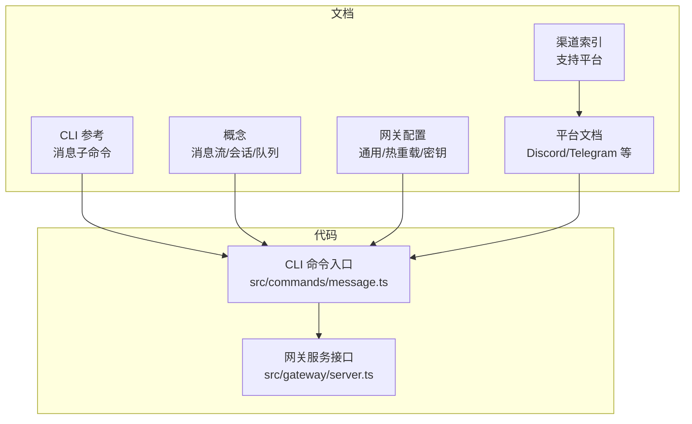
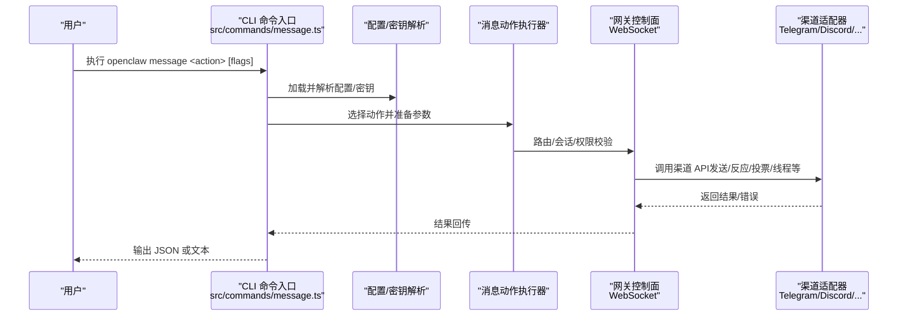
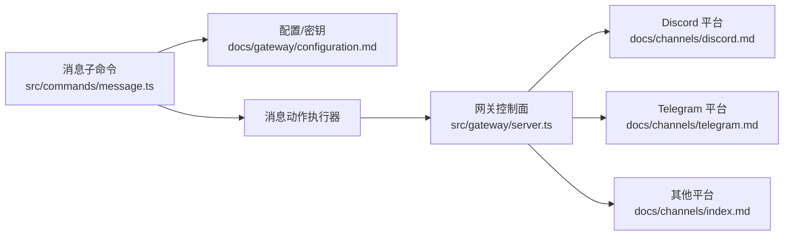

# 通信工具

<cite>
**本文引用的文件**
- [README.md](file://README.md)
- [docs/cli/message.md](file://docs/cli/message.md)
- [docs/channels/index.md](file://docs/channels/index.md)
- [docs/concepts/messages.md](file://docs/concepts/messages.md)
- [docs/gateway/configuration.md](file://docs/gateway/configuration.md)
- [docs/channels/discord.md](file://docs/channels/discord.md)
- [docs/channels/telegram.md](file://docs/channels/telegram.md)
- [src/commands/message.ts](file://src/commands/message.ts)
- [src/gateway/server.ts](file://src/gateway/server.ts)
</cite>

## 目录
1. [简介](#简介)
2. [项目结构](#项目结构)
3. [核心组件](#核心组件)
4. [架构总览](#架构总览)
5. [详细组件分析](#详细组件分析)
6. [依赖关系分析](#依赖关系分析)
7. [性能考量](#性能考量)
8. [故障排除指南](#故障排除指南)
9. [结论](#结论)
10. [附录](#附录)

## 简介
本文件面向使用者与开发者，系统化说明 OpenClaw 的通信工具体系：如何通过统一的消息子命令在多平台即时通讯渠道（如 Discord、Telegram、WhatsApp、Slack、Signal、iMessage、Google Chat、Microsoft Teams 等）上发送消息、管理反应、发起投票、管理线程、广播消息等；如何配置渠道认证、权限策略与消息路由；以及如何与不同平台的 API 集成、实施安全与速率限制、进行排障与最佳实践。

OpenClaw 的“消息”子命令是跨渠道的统一入口，支持文本消息、媒体附件、反应管理、线程操作、投票、读取历史、编辑/删除消息、钉钉/取消钉钉、权限查询、搜索、表情包、事件、Moderation、广播等能力，并针对各渠道提供差异化参数与行为。

## 项目结构
围绕“通信工具”的关键位置与职责如下：
- 文档层
  - CLI 参考：消息子命令的用法、目标格式、动作与标志位
  - 渠道索引：支持的聊天平台清单与概览
  - 概念：消息流、会话、队列、分块与流式输出
  - 网关配置：通用配置项、热重载、环境变量与密钥注入
  - 平台文档：Discord、Telegram 等渠道的详细能力与配置
- 代码层
  - CLI 命令入口：解析参数、选择动作、调用消息动作执行器
  - 网关服务：WebSocket 控制面，承载消息路由、会话、工具与事件

**图表来源**
- [docs/cli/message.md](file://docs/cli/message.md)
- [docs/channels/index.md](file://docs/channels/index.md)
- [docs/concepts/messages.md](file://docs/concepts/messages.md)
- [docs/gateway/configuration.md](file://docs/gateway/configuration.md)
- [docs/channels/discord.md](file://docs/channels/discord.md)
- [docs/channels/telegram.md](file://docs/channels/telegram.md)
- [src/commands/message.ts](file://src/commands/message.ts)
- [src/gateway/server.ts](file://src/gateway/server.ts)

**章节来源**
- [README.md](file://README.md)
- [docs/cli/message.md](file://docs/cli/message.md)
- [docs/channels/index.md](file://docs/channels/index.md)
- [docs/concepts/messages.md](file://docs/concepts/messages.md)
- [docs/gateway/configuration.md](file://docs/gateway/configuration.md)
- [docs/channels/discord.md](file://docs/channels/discord.md)
- [docs/channels/telegram.md](file://docs/channels/telegram.md)
- [src/commands/message.ts](file://src/commands/message.ts)
- [src/gateway/server.ts](file://src/gateway/server.ts)

## 核心组件
- 消息子命令（CLI）
  - 统一入口：openclaw message <action> [flags]
  - 动作覆盖：send、poll、react、reactions、read、edit、delete、pin/unpin、pins、permissions、search、thread create/list/reply、emoji、sticker、role/channel/member/voice、event、moderation、broadcast 等
  - 目标与通道：按渠道规范指定目标（群组、频道、用户、话题等），自动解析名称到 ID
  - 输出：支持 JSON 与人类可读文本两种输出
- 渠道平台
  - 支持平台：Telegram、Discord、WhatsApp、Slack、Signal、iMessage、Google Chat、Microsoft Teams、IRC、Matrix、Feishu、LINE、Mattermost、Nextcloud Talk、Nostr、Synology Chat、Tlon、Twitch、WebChat、Zalo、Zalo Personal 等
  - 各平台差异：反应、投票、线程、组件、限流、历史、权限模型、DM 策略等
- 网关控制面
  - WebSocket 控制平面，承载会话、路由、工具、事件与 UI
  - 安全与速率限制：配置级 RPC 写入限速、通道级发送限流与重试策略
- 配置与密钥
  - JSON5 配置、环境变量、SecretRef 注入、$include 分片、热重载模式
  - 渠道认证：令牌、账号、Webhook、服务账号等

**章节来源**
- [docs/cli/message.md](file://docs/cli/message.md)
- [docs/channels/index.md](file://docs/channels/index.md)
- [docs/gateway/configuration.md](file://docs/gateway/configuration.md)
- [src/commands/message.ts](file://src/commands/message.ts)
- [src/gateway/server.ts](file://src/gateway/server.ts)

## 架构总览
消息从 CLI 进入，经由配置解析与密钥注入，选择具体渠道动作，再由网关控制面路由到对应渠道连接，最终通过渠道 API 发送或管理消息。

**图表来源**
- [src/commands/message.ts](file://src/commands/message.ts)
- [docs/cli/message.md](file://docs/cli/message.md)
- [docs/gateway/configuration.md](file://docs/gateway/configuration.md)
- [src/gateway/server.ts](file://src/gateway/server.ts)

## 详细组件分析

### 消息子命令与动作族
- 入口与流程
  - 解析动作名（大小写不敏感），校验是否受支持
  - 创建出站发送依赖（凭据、通道、会话等）
  - 根据 JSON/干跑/进度条等参数决定输出与 UI 提示
- 动作族概览
  - 核心：send（文本/媒体/回复/线程）、poll（投票）、react/reactions（反应/列出）、read（读取历史）、edit/delete（编辑/删除）、pin/unpin/pins（钉钉）、permissions（权限）、search（搜索）
  - 线程：thread create/list/reply（Discord）
  - 表情包：emoji list/upload（Discord/Slack）
  - 贴图：sticker send/upload（Discord）
  - 成员与语音：role/channel/member/voice（Discord）
  - 事件：event list/create（Discord）
  - 审核：timeout/kick/ban（Discord）
  - 广播：broadcast（可选 --channel all）

- 目标与通道
  - 不同渠道的目标格式不同（例如 Discord 使用 channel:user，Telegram 使用 chat id 或 @username，WhatsApp 使用 E.164 或群组 JID 等）
  - 名称解析：对支持的提供商（Discord/Slack 等）可通过目录缓存解析，缓存缺失时可尝试实时目录查询

- 输出与交互
  - --json 输出结构化结果
  - --dry-run 仅模拟
  - send/poll 默认带进度提示

**章节来源**
- [src/commands/message.ts](file://src/commands/message.ts)
- [docs/cli/message.md](file://docs/cli/message.md)

### 多平台消息支持与渠道差异
- Telegram
  - 令牌配置、DM/群组策略、隐私模式、群组权限、内联按钮、投票（含论坛话题）、直播预览（草稿编辑）、音频/视频/贴图、反应通知、Webhook/长轮询、限流与重试、线程绑定与 ACP 绑定
- Discord
  - Bot 令牌、意图、DM/公会策略、提及门控、线程绑定、组件容器、原生命令、反应通知、ACK 反应、配置写入、流式预览、历史上下文、Moderation、事件
- 其他渠道
  - WhatsApp、Slack、Signal、iMessage、Google Chat、Microsoft Teams、IRC、Matrix、Feishu、LINE、Mattermost、Nextcloud Talk、Nostr、Synology Chat、Tlon、Twitch、WebChat、Zalo、Zalo Personal 等，均在各自平台文档中详述能力与配置

**章节来源**
- [docs/channels/telegram.md](file://docs/channels/telegram.md)
- [docs/channels/discord.md](file://docs/channels/discord.md)
- [docs/channels/index.md](file://docs/channels/index.md)

### 会话、消息流与队列
- 消息流高阶路径：入站消息 -> 路由/绑定 -> 会话键 -> 队列（若运行中）-> 代理运行（流式 + 工具）-> 出站回复（渠道限制 + 分块）
- 去重与防抖：入站去重缓存、按通道/对话的快速连续消息合并
- 会话与设备：会话由网关拥有，直接对话与群组/频道分别使用不同会话键；多设备映射到同一会话但历史不同步
- 上下文与前缀：非直达消息（群组/频道/房间）当前消息体前缀发送者标签；历史缓冲区仅包含未触发运行的消息
- 队列与后续：根据配置选择中断/转向/后续/收集/积压变体
- 流式与分块：块流式发送文本块、尊重渠道文本上限、避免破坏代码围栏；可配置 coalesce 与人类延迟

**章节来源**
- [docs/concepts/messages.md](file://docs/concepts/messages.md)

### 配置与路由
- 通用配置
  - JSON5 配置文件、编辑方式（向导/CLI/控制 UI/直接编辑）、严格校验、热重载模式与字段分类
  - 环境变量与 SecretRef 注入、$include 分片组织
- 渠道认证与权限
  - DM 策略：pairing/allowlist/open/disabled；群组策略：open/allowlist/disabled；允许来源列表
  - 各渠道令牌/账号/Webhook/服务账号等
- 模型与工具
  - 主模型与回退模型、模型别名、图像尺寸缩放、心跳、钩子、定时任务、多代理路由绑定
- 多代理路由
  - 为不同账户/渠道/成员/角色设置独立工作区与会话隔离

**章节来源**
- [docs/gateway/configuration.md](file://docs/gateway/configuration.md)

### 安全机制、速率限制与故障排除
- 安全
  - 默认：主会话工具在本地主机运行；群组/频道安全：可启用 per-session Docker 容器沙箱；工具白名单/黑名单
  - DM pairing 与允许列表；通道 DM 策略；通道组策略；命令与配置写入权限
- 速率限制
  - 配置 RPC 写入限速（每 60 秒最多 3 次）；通道级发送重试与超时；各渠道自身 API 限流与重试策略
- 故障排除
  - doctor 命令诊断配置问题；各渠道疑难解答；网络与暴露（Tailscale/SSH 隧道）；日志与健康检查

**章节来源**
- [README.md](file://README.md)
- [docs/gateway/configuration.md](file://docs/gateway/configuration.md)

## 依赖关系分析
消息子命令与平台能力之间存在强耦合：CLI 将用户意图转化为标准化动作，配置与密钥决定可用能力与访问范围，网关负责路由与会话，平台文档定义渠道 API 语义与约束。

**图表来源**
- [src/commands/message.ts](file://src/commands/message.ts)
- [docs/gateway/configuration.md](file://docs/gateway/configuration.md)
- [src/gateway/server.ts](file://src/gateway/server.ts)
- [docs/channels/discord.md](file://docs/channels/discord.md)
- [docs/channels/telegram.md](file://docs/channels/telegram.md)
- [docs/channels/index.md](file://docs/channels/index.md)

**章节来源**
- [src/commands/message.ts](file://src/commands/message.ts)
- [docs/gateway/configuration.md](file://docs/gateway/configuration.md)
- [src/gateway/server.ts](file://src/gateway/server.ts)
- [docs/channels/discord.md](file://docs/channels/discord.md)
- [docs/channels/telegram.md](file://docs/channels/telegram.md)
- [docs/channels/index.md](file://docs/channels/index.md)

## 性能考量
- 流式与分块：块流式与分块策略减少长文本等待时间，避免破坏代码块边界
- 历史上下文：合理设置历史窗口，避免过长上下文导致 token 消耗与延迟上升
- 会话隔离：群组/频道/线程独立会话降低上下文污染，提升响应质量
- 通道限流：利用各渠道的限流与重试策略，结合 dry-run 与 JSON 输出进行压测与验证
- 网关热重载：变更配置时尽量使用热重载模式，避免不必要的重启

[本节为通用指导，无需特定文件引用]

## 故障排除指南
- 使用 doctor 命令检查配置与运行状态
- 各渠道疑难解答：参考对应平台文档中的故障排除章节
- 日志与健康：关注网关日志与健康检查端点
- 网络暴露：Tailscale Serve/Funnel 或 SSH 隧道配置与鉴权
- 速率限制：调整配置 RPC 写入与通道发送策略

**章节来源**
- [README.md](file://README.md)
- [docs/gateway/configuration.md](file://docs/gateway/configuration.md)

## 结论
OpenClaw 的通信工具以统一的“消息”子命令为核心，打通多平台即时通讯渠道，提供从文本、媒体、反应到线程、投票、广播的完整能力矩阵。通过严谨的配置与密钥管理、会话与消息流设计、安全与速率限制策略，以及完善的平台文档与故障排除流程，既能满足日常跨平台消息管理需求，也能支撑复杂场景下的多代理路由与自动化。

[本节为总结性内容，无需特定文件引用]

## 附录

### 使用示例（基于 CLI 参考）
- 在 Discord 中回复消息
  - 示例：openclaw message send --channel discord --target channel:123 --message "hi" --reply-to 456
- 在 Discord 中发送带组件的消息
  - 示例：openclaw message send --channel discord --target channel:123 --message "Choose:" --components '{"text":"选择路径","blocks":[{"type":"actions","buttons":[{"label":"同意","style":"success"},{"label":"拒绝","style":"danger"}]}]}'
- 在 Discord 中创建投票
  - 示例：openclaw message poll --channel discord --target channel:123 --poll-question "点心？" --poll-option Pizza --poll-option Sushi --poll-multi --poll-duration-hours 48
- 在 Telegram 中创建投票（2 分钟后自动关闭）
  - 示例：openclaw message poll --channel telegram --target @mychat --poll-question "午餐？" --poll-option Pizza --poll-option Sushi --poll-duration-seconds 120 --silent
- 在 Teams 中发送主动消息
  - 示例：openclaw message send --channel msteams --target conversation:19:abc@thread.tacv2 --message "hi"
- 在 Teams 中创建投票
  - 示例：openclaw message poll --channel msteams --target conversation:19:abc@thread.tacv2 --poll-question "午餐？" --poll-option Pizza --poll-option Sushi
- 在 Slack 中添加反应
  - 示例：openclaw message react --channel slack --target C123 --message-id 456 --emoji "✅"
- 在 Signal 群组中添加反应
  - 示例：openclaw message react --channel signal --target signal:group:abc123 --message-id 1737630212345 --emoji "✅" --target-author-uuid 123e4567-e89b-12d3-a456-426614174000
- 在 Telegram 中发送内联按钮
  - 示例：openclaw message send --channel telegram --target @mychat --message "选择：" --buttons '[ [{"text":"是","callback_data":"cmd:yes"}], [{"text":"否","callback_data":"cmd:no"}] ]'

**章节来源**
- [docs/cli/message.md](file://docs/cli/message.md)