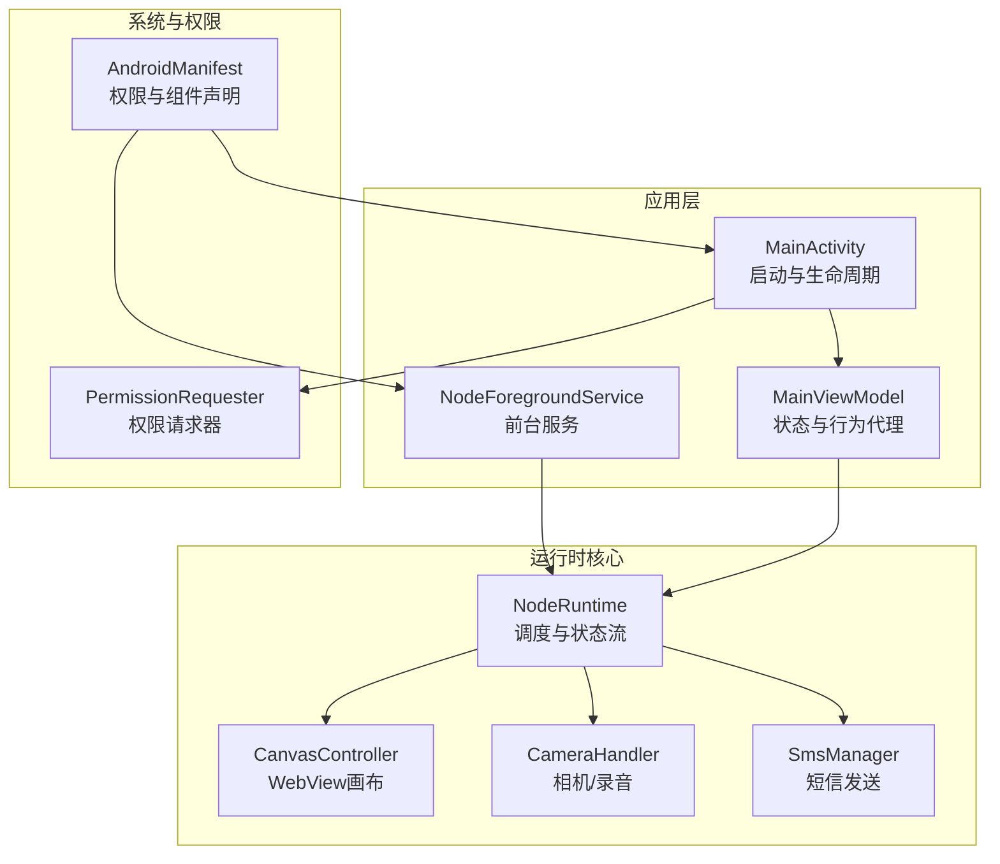
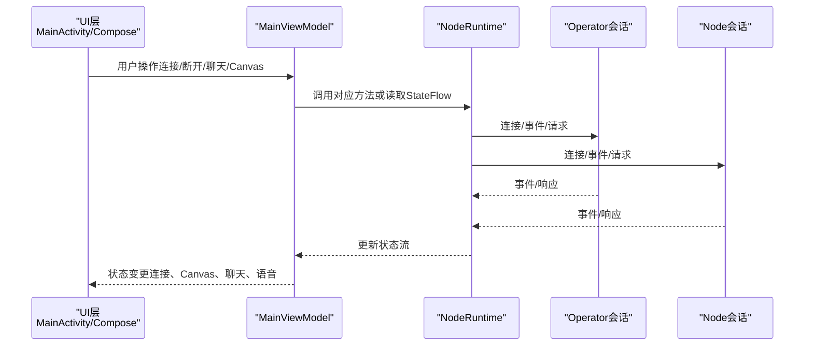
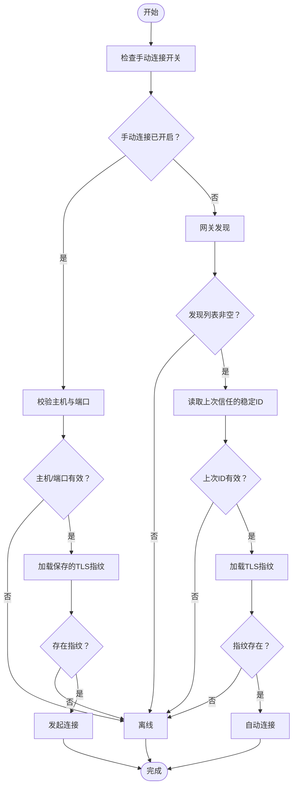
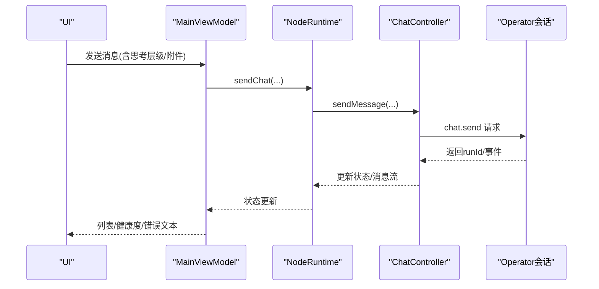
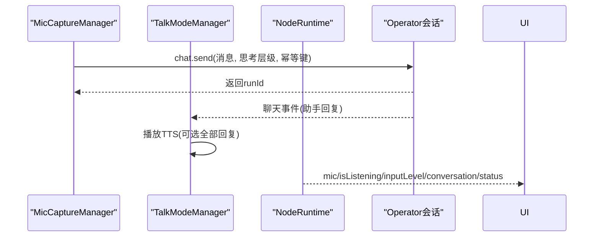
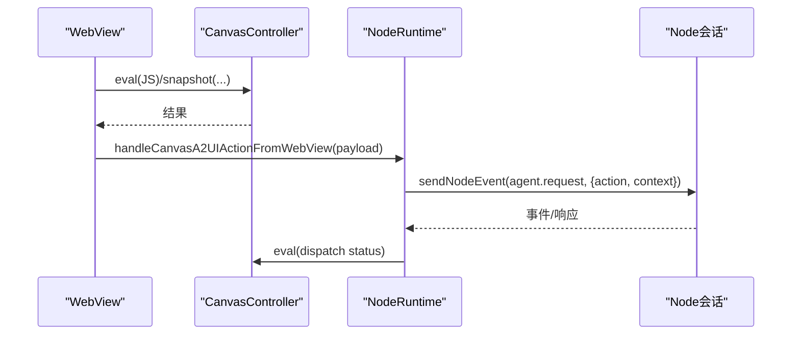
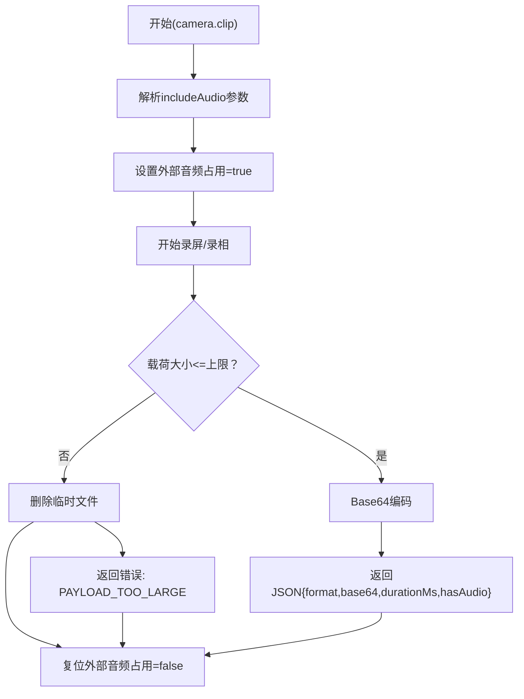
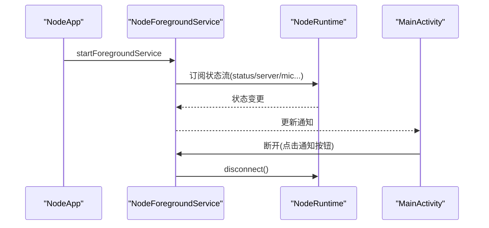
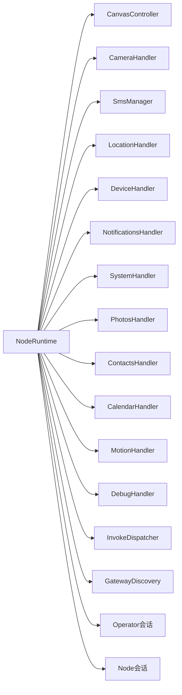

# Android节点

<cite>
**本文引用的文件**
- [apps/android/app/src/main/java/ai/openclaw/app/MainActivity.kt](file://apps/android/app/src/main/java/ai/openclaw/app/MainActivity.kt)
- [apps/android/app/src/main/java/ai/openclaw/app/NodeApp.kt](file://apps/android/app/src/main/java/ai/openclaw/app/NodeApp.kt)
- [apps/android/app/src/main/java/ai/openclaw/app/MainViewModel.kt](file://apps/android/app/src/main/java/ai/openclaw/app/MainViewModel.kt)
- [apps/android/app/src/main/java/ai/openclaw/app/NodeRuntime.kt](file://apps/android/app/src/main/java/ai/openclaw/app/NodeRuntime.kt)
- [apps/android/app/src/main/java/ai/openclaw/app/NodeForegroundService.kt](file://apps/android/app/src/main/java/ai/openclaw/app/NodeForegroundService.kt)
- [apps/android/app/src/main/AndroidManifest.xml](file://apps/android/app/src/main/AndroidManifest.xml)
- [apps/android/app/src/main/java/ai/openclaw/app/node/CameraHandler.kt](file://apps/android/app/src/main/java/ai/openclaw/app/node/CameraHandler.kt)
- [apps/android/app/src/main/java/ai/openclaw/app/node/SmsManager.kt](file://apps/android/app/src/main/java/ai/openclaw/app/node/SmsManager.kt)
- [apps/android/app/src/main/java/ai/openclaw/app/node/CanvasController.kt](file://apps/android/app/src/main/java/ai/openclaw/app/node/CanvasController.kt)
</cite>

## 目录
1. [简介](#简介)
2. [项目结构](#项目结构)
3. [核心组件](#核心组件)
4. [架构总览](#架构总览)
5. [详细组件分析](#详细组件分析)
6. [依赖关系分析](#依赖关系分析)
7. [性能考虑](#性能考虑)
8. [故障排除指南](#故障排除指南)
9. [结论](#结论)
10. [附录](#附录)

## 简介
本文件面向OpenClaw Android节点应用，提供从架构到实现细节的完整技术文档。内容覆盖连接设置与自动发现、聊天界面、语音功能（麦克风与TTS）、Canvas控制与A2UI交互、相机拍照/录像与屏幕录制能力、设备命令系统（短信、位置、通知、联系人、日历、运动等）、通知管理、权限申请流程、后台服务与电池优化适配、安全配置与数据保护、性能优化策略以及安装配置与故障排除指引。

## 项目结构
Android节点应用位于apps/android目录，采用Kotlin语言与Jetpack Compose UI，核心运行时在NodeRuntime中集中编排，前台服务维持长连接状态展示，各子系统通过Handler与Manager模块化接入。

图示来源
- [apps/android/app/src/main/java/ai/openclaw/app/MainActivity.kt:18-64](file://apps/android/app/src/main/java/ai/openclaw/app/MainActivity.kt#L18-L64)
- [apps/android/app/src/main/java/ai/openclaw/app/MainViewModel.kt:13-203](file://apps/android/app/src/main/java/ai/openclaw/app/MainViewModel.kt#L13-L203)
- [apps/android/app/src/main/java/ai/openclaw/app/NodeRuntime.kt:44-604](file://apps/android/app/src/main/java/ai/openclaw/app/NodeRuntime.kt#L44-L604)
- [apps/android/app/src/main/java/ai/openclaw/app/node/CameraHandler.kt:22-176](file://apps/android/app/src/main/java/ai/openclaw/app/node/CameraHandler.kt#L22-L176)
- [apps/android/app/src/main/java/ai/openclaw/app/node/SmsManager.kt:20-231](file://apps/android/app/src/main/java/ai/openclaw/app/node/SmsManager.kt#L20-L231)
- [apps/android/app/src/main/java/ai/openclaw/app/NodeForegroundService.kt:20-159](file://apps/android/app/src/main/java/ai/openclaw/app/NodeForegroundService.kt#L20-L159)
- [apps/android/app/src/main/AndroidManifest.xml:1-77](file://apps/android/app/src/main/AndroidManifest.xml#L1-L77)

章节来源
- [apps/android/app/src/main/java/ai/openclaw/app/MainActivity.kt:18-64](file://apps/android/app/src/main/java/ai/openclaw/app/MainActivity.kt#L18-L64)
- [apps/android/app/src/main/java/ai/openclaw/app/NodeApp.kt:6-27](file://apps/android/app/src/main/java/ai/openclaw/app/NodeApp.kt#L6-L27)
- [apps/android/app/src/main/java/ai/openclaw/app/MainViewModel.kt:13-203](file://apps/android/app/src/main/java/ai/openclaw/app/MainViewModel.kt#L13-L203)
- [apps/android/app/src/main/java/ai/openclaw/app/NodeRuntime.kt:44-604](file://apps/android/app/src/main/java/ai/openclaw/app/NodeRuntime.kt#L44-L604)
- [apps/android/app/src/main/java/ai/openclaw/app/NodeForegroundService.kt:20-159](file://apps/android/app/src/main/java/ai/openclaw/app/NodeForegroundService.kt#L20-L159)
- [apps/android/app/src/main/AndroidManifest.xml:1-77](file://apps/android/app/src/main/AndroidManifest.xml#L1-L77)

## 核心组件
- MainActivity：负责窗口系统集成、权限请求器绑定、保持唤醒、Compose入口与前台服务启动时机控制。
- MainViewModel：将NodeRuntime的状态与操作暴露给UI，统一管理聊天、Canvas、相机、短信、语音等能力。
- NodeRuntime：应用运行时中枢，管理网关发现与连接、会话、设备命令分发、Canvas A2UI交互、调试状态、语音与聊天集成。
- NodeForegroundService：前台服务，持续显示连接状态与麦克风监听状态，支持断开操作。
- CanvasController：封装WebView画布，支持导航、调试状态注入、快照与JS执行。
- CameraHandler：相机设备枚举、拍照、录视频并限制载荷大小，联动HUD提示与闪光灯脉冲。
- SmsManager：解析参数、权限校验、分片发送、构建结果载荷。

章节来源
- [apps/android/app/src/main/java/ai/openclaw/app/MainActivity.kt:18-64](file://apps/android/app/src/main/java/ai/openclaw/app/MainActivity.kt#L18-L64)
- [apps/android/app/src/main/java/ai/openclaw/app/MainViewModel.kt:13-203](file://apps/android/app/src/main/java/ai/openclaw/app/MainViewModel.kt#L13-L203)
- [apps/android/app/src/main/java/ai/openclaw/app/NodeRuntime.kt:44-604](file://apps/android/app/src/main/java/ai/openclaw/app/NodeRuntime.kt#L44-L604)
- [apps/android/app/src/main/java/ai/openclaw/app/NodeForegroundService.kt:20-159](file://apps/android/app/src/main/java/ai/openclaw/app/NodeForegroundService.kt#L20-L159)
- [apps/android/app/src/main/java/ai/openclaw/app/node/CameraHandler.kt:22-176](file://apps/android/app/src/main/java/ai/openclaw/app/node/CameraHandler.kt#L22-L176)
- [apps/android/app/src/main/java/ai/openclaw/app/node/SmsManager.kt:20-231](file://apps/android/app/src/main/java/ai/openclaw/app/node/SmsManager.kt#L20-L231)
- [apps/android/app/src/main/java/ai/openclaw/app/node/CanvasController.kt:26-273](file://apps/android/app/src/main/java/ai/openclaw/app/node/CanvasController.kt#L26-L273)

## 架构总览
Android节点以NodeRuntime为核心，通过GatewaySession与Operator/Node两端通信；NodeRuntime内部聚合各类Handler与Manager，统一调度设备命令、语音与聊天；前台服务实时反映连接状态与麦克风监听状态；UI通过MainViewModel访问NodeRuntime状态与操作。

图示来源
- [apps/android/app/src/main/java/ai/openclaw/app/MainActivity.kt:18-64](file://apps/android/app/src/main/java/ai/openclaw/app/MainActivity.kt#L18-L64)
- [apps/android/app/src/main/java/ai/openclaw/app/MainViewModel.kt:13-203](file://apps/android/app/src/main/java/ai/openclaw/app/MainViewModel.kt#L13-L203)
- [apps/android/app/src/main/java/ai/openclaw/app/NodeRuntime.kt:220-292](file://apps/android/app/src/main/java/ai/openclaw/app/NodeRuntime.kt#L220-L292)

## 详细组件分析

### 连接设置与自动发现
- 自动发现：通过GatewayDiscovery收集可用网关列表，结合上次信任的稳定ID与TLS指纹进行自动连接。
- 手动连接：当启用手动模式且主机端口有效时，使用已保存的TLS指纹进行连接。
- 首次TLS：若未保存指纹，探测远端证书指纹，弹出信任提示，用户确认后保存并连接。
- 断线重连：两个会话均具备重连逻辑，状态文本与颜色随连接状态变化。

图示来源
- [apps/android/app/src/main/java/ai/openclaw/app/NodeRuntime.kt:524-587](file://apps/android/app/src/main/java/ai/openclaw/app/NodeRuntime.kt#L524-L587)
- [apps/android/app/src/main/java/ai/openclaw/app/NodeRuntime.kt:709-732](file://apps/android/app/src/main/java/ai/openclaw/app/NodeRuntime.kt#L709-L732)
- [apps/android/app/src/main/java/ai/openclaw/app/NodeRuntime.kt:734-744](file://apps/android/app/src/main/java/ai/openclaw/app/NodeRuntime.kt#L734-L744)

章节来源
- [apps/android/app/src/main/java/ai/openclaw/app/NodeRuntime.kt:524-587](file://apps/android/app/src/main/java/ai/openclaw/app/NodeRuntime.kt#L524-L587)
- [apps/android/app/src/main/java/ai/openclaw/app/NodeRuntime.kt:709-744](file://apps/android/app/src/main/java/ai/openclaw/app/NodeRuntime.kt#L709-L744)

### 聊天界面与会话管理
- 会话键：支持主会话键（mainKey）解析与应用，确保跨组件一致性。
- 思考层级：可动态调整思考层级，影响响应生成策略。
- 健康状态：维护聊天健康度与错误文本，支持刷新与切换会话。
- 发送消息：支持带附件的消息发送，内部构造参数并调用网关请求。

图示来源
- [apps/android/app/src/main/java/ai/openclaw/app/MainViewModel.kt:199-201](file://apps/android/app/src/main/java/ai/openclaw/app/MainViewModel.kt#L199-L201)
- [apps/android/app/src/main/java/ai/openclaw/app/NodeRuntime.kt:302-308](file://apps/android/app/src/main/java/ai/openclaw/app/NodeRuntime.kt#L302-L308)
- [apps/android/app/src/main/java/ai/openclaw/app/NodeRuntime.kt:842-869](file://apps/android/app/src/main/java/ai/openclaw/app/NodeRuntime.kt#L842-L869)

章节来源
- [apps/android/app/src/main/java/ai/openclaw/app/MainViewModel.kt:199-201](file://apps/android/app/src/main/java/ai/openclaw/app/MainViewModel.kt#L199-L201)
- [apps/android/app/src/main/java/ai/openclaw/app/NodeRuntime.kt:302-308](file://apps/android/app/src/main/java/ai/openclaw/app/NodeRuntime.kt#L302-L308)
- [apps/android/app/src/main/java/ai/openclaw/app/NodeRuntime.kt:842-869](file://apps/android/app/src/main/java/ai/openclaw/app/NodeRuntime.kt#L842-L869)

### 语音功能（麦克风与TTS）
- 录音与转写：MicCaptureManager负责录音、转写与发送至Operator会话，支持幂等键与队列。
- TTS回放：TalkModeManager订阅聊天事件，按需播放助手回复；支持“全部回复TTS”模式与播放控制。
- 状态同步：Mic状态、输入电平、排队消息、对话历史、是否正在发送等通过StateFlow暴露。
- 停止逻辑：前台切后台或显式停止时，关闭TTS、停止录音并解除外部音频占用。

图示来源
- [apps/android/app/src/main/java/ai/openclaw/app/NodeRuntime.kt:255-257](file://apps/android/app/src/main/java/ai/openclaw/app/NodeRuntime.kt#L255-L257)
- [apps/android/app/src/main/java/ai/openclaw/app/NodeRuntime.kt:325-353](file://apps/android/app/src/main/java/ai/openclaw/app/NodeRuntime.kt#L325-L353)
- [apps/android/app/src/main/java/ai/openclaw/app/NodeRuntime.kt:382-390](file://apps/android/app/src/main/java/ai/openclaw/app/NodeRuntime.kt#L382-L390)

章节来源
- [apps/android/app/src/main/java/ai/openclaw/app/NodeRuntime.kt:325-353](file://apps/android/app/src/main/java/ai/openclaw/app/NodeRuntime.kt#L325-L353)
- [apps/android/app/src/main/java/ai/openclaw/app/NodeRuntime.kt:382-390](file://apps/android/app/src/main/java/ai/openclaw/app/NodeRuntime.kt#L382-L390)
- [apps/android/app/src/main/java/ai/openclaw/app/NodeRuntime.kt:653-690](file://apps/android/app/src/main/java/ai/openclaw/app/NodeRuntime.kt#L653-L690)

### Canvas控制与A2UI交互
- 导航与默认页：支持URL导航与默认Scaffold页面；调试状态可通过JS注入。
- 快照：支持PNG/JPEG格式与质量、最大宽度缩放；用于上报或A2UI渲染。
- JS执行：在主线程上下文执行JS，返回结果字符串。
- A2UI动作：从WebView接收用户动作，格式化为agent.request消息，携带会话键、表面ID、源组件ID与上下文，向Node会话发送并回传执行状态。

图示来源
- [apps/android/app/src/main/java/ai/openclaw/app/node/CanvasController.kt:145-153](file://apps/android/app/src/main/java/ai/openclaw/app/node/CanvasController.kt#L145-L153)
- [apps/android/app/src/main/java/ai/openclaw/app/node/CanvasController.kt:166-180](file://apps/android/app/src/main/java/ai/openclaw/app/node/CanvasController.kt#L166-L180)
- [apps/android/app/src/main/java/ai/openclaw/app/NodeRuntime.kt:770-840](file://apps/android/app/src/main/java/ai/openclaw/app/NodeRuntime.kt#L770-L840)

章节来源
- [apps/android/app/src/main/java/ai/openclaw/app/node/CanvasController.kt:26-273](file://apps/android/app/src/main/java/ai/openclaw/app/node/CanvasController.kt#L26-L273)
- [apps/android/app/src/main/java/ai/openclaw/app/NodeRuntime.kt:770-840](file://apps/android/app/src/main/java/ai/openclaw/app/NodeRuntime.kt#L770-L840)

### 相机拍照/录像与屏幕录制
- 设备枚举：返回设备ID、名称、朝向与类型。
- 拍照：触发HUD提示与闪光脉冲，捕获图像并返回JSON载荷。
- 录像：根据参数决定是否包含音频，限制最大载荷字节数，超过则删除临时文件并报错。
- 外部音频占用：在录音期间标记外部音频采集活跃，避免冲突。

图示来源
- [apps/android/app/src/main/java/ai/openclaw/app/node/CameraHandler.kt:96-154](file://apps/android/app/src/main/java/ai/openclaw/app/node/CameraHandler.kt#L96-L154)

章节来源
- [apps/android/app/src/main/java/ai/openclaw/app/node/CameraHandler.kt:22-176](file://apps/android/app/src/main/java/ai/openclaw/app/node/CameraHandler.kt#L22-L176)

### 系统级功能：通知、位置、短信、联系人、日历、运动
- 通知：通过NotificationListenerService桥接系统通知事件到Node会话。
- 位置：LocationHandler基于LocationCaptureManager与权限，按模式与精度策略上报。
- 短信：SmsManager解析参数、权限校验、分片发送、构建结果载荷。
- 联系人/日历/运动：ContactsHandler、CalendarHandler、MotionHandler作为设备命令处理器接入InvokeDispatcher，统一由NodeRuntime调度。

章节来源
- [apps/android/app/src/main/java/ai/openclaw/app/NodeRuntime.kt:74-117](file://apps/android/app/src/main/java/ai/openclaw/app/NodeRuntime.kt#L74-L117)
- [apps/android/app/src/main/java/ai/openclaw/app/node/SmsManager.kt:20-231](file://apps/android/app/src/main/java/ai/openclaw/app/node/SmsManager.kt#L20-L231)

### 后台服务机制与前台通知
- 前台服务：NodeForegroundService在应用启动后尽快启动，持续显示连接状态与麦克风监听状态；支持断开操作。
- 通知通道：低重要性通道，仅显示连接状态与一次性提醒。
- 生命周期：服务常驻，连接由NodeRuntime管理（自动重连与手动控制）。

图示来源
- [apps/android/app/src/main/java/ai/openclaw/app/NodeApp.kt:6-27](file://apps/android/app/src/main/java/ai/openclaw/app/NodeApp.kt#L6-L27)
- [apps/android/app/src/main/java/ai/openclaw/app/NodeForegroundService.kt:20-159](file://apps/android/app/src/main/java/ai/openclaw/app/NodeForegroundService.kt#L20-L159)
- [apps/android/app/src/main/java/ai/openclaw/app/MainActivity.kt:50-52](file://apps/android/app/src/main/java/ai/openclaw/app/MainActivity.kt#L50-L52)

章节来源
- [apps/android/app/src/main/java/ai/openclaw/app/NodeForegroundService.kt:20-159](file://apps/android/app/src/main/java/ai/openclaw/app/NodeForegroundService.kt#L20-L159)
- [apps/android/app/src/main/java/ai/openclaw/app/NodeApp.kt:6-27](file://apps/android/app/src/main/java/ai/openclaw/app/NodeApp.kt#L6-L27)

### 权限申请流程
- 权限请求器：PermissionRequester统一处理缺失权限的申请与回调。
- 绑定时机：MainActivity在onCreate中初始化并绑定到相机与短信管理器。
- 典型权限：INTERNET、网络状态、前台服务、通知、WiFi直连、定位、相机、录音、短信、媒体读取、联系人、日历、运动识别等。

章节来源
- [apps/android/app/src/main/java/ai/openclaw/app/MainActivity.kt:20-29](file://apps/android/app/src/main/java/ai/openclaw/app/MainActivity.kt#L20-L29)
- [apps/android/app/src/main/AndroidManifest.xml:1-77](file://apps/android/app/src/main/AndroidManifest.xml#L1-L77)
- [apps/android/app/src/main/java/ai/openclaw/app/node/SmsManager.kt:132-134](file://apps/android/app/src/main/java/ai/openclaw/app/node/SmsManager.kt#L132-L134)

## 依赖关系分析
- 组件耦合：NodeRuntime聚合所有子系统，MainViewModel仅做薄代理，UI与服务通过状态流解耦。
- 外部依赖：Kotlin协程、Jetpack Compose、AndroidX、WebView、Android系统服务。
- 可能风险：WebView与JS交互、相机与录音资源竞争、通知权限与前台服务类型。

图示来源
- [apps/android/app/src/main/java/ai/openclaw/app/NodeRuntime.kt:65-166](file://apps/android/app/src/main/java/ai/openclaw/app/NodeRuntime.kt#L65-L166)

章节来源
- [apps/android/app/src/main/java/ai/openclaw/app/NodeRuntime.kt:65-166](file://apps/android/app/src/main/java/ai/openclaw/app/NodeRuntime.kt#L65-L166)

## 性能考虑
- 启动路径：MainActivity在首帧后才启动前台服务，减少冷启动时间。
- 严格模式：Debug构建启用StrictMode线程与VM策略，便于早期发现违规。
- 载荷限制：相机录视频最大载荷限制，超限直接拒绝并清理临时文件，避免OOM。
- 主线程WebView操作：Canvas快照与JS执行在主线程，注意避免长时间阻塞。
- 状态流合并：前台服务合并多个状态流，降低通知更新频率。

章节来源
- [apps/android/app/src/main/java/ai/openclaw/app/MainActivity.kt:50-52](file://apps/android/app/src/main/java/ai/openclaw/app/MainActivity.kt#L50-L52)
- [apps/android/app/src/main/java/ai/openclaw/app/NodeApp.kt:11-24](file://apps/android/app/src/main/java/ai/openclaw/app/NodeApp.kt#L11-L24)
- [apps/android/app/src/main/java/ai/openclaw/app/node/CameraHandler.kt:17-20](file://apps/android/app/src/main/java/ai/openclaw/app/node/CameraHandler.kt#L17-L20)
- [apps/android/app/src/main/java/ai/openclaw/app/node/CameraHandler.kt:124-134](file://apps/android/app/src/main/java/ai/openclaw/app/node/CameraHandler.kt#L124-L134)
- [apps/android/app/src/main/java/ai/openclaw/app/NodeForegroundService.kt:32-56](file://apps/android/app/src/main/java/ai/openclaw/app/NodeForegroundService.kt#L32-L56)

## 故障排除指南
- 无法连接网关
  - 检查是否首次TLS：若无指纹，先完成指纹验证再连接。
  - 手动连接：确认主机与端口有效且TLS指纹已保存。
  - 状态文本：关注状态流中的错误提示，优先解决认证问题。
- Canvas无法恢复
  - 确认节点在线；尝试强制重新请求恢复；检查错误文本提示。
- 相机录视频失败
  - 检查载荷是否过大；确认设备权限与相机可用性；查看HUD错误提示。
- 短信发送失败
  - 确认具备电话功能与SEND_SMS权限；检查参数完整性；查看错误载荷。
- 通知不生效
  - 确认通知监听服务已正确声明与绑定；检查通知权限。

章节来源
- [apps/android/app/src/main/java/ai/openclaw/app/NodeRuntime.kt:442-491](file://apps/android/app/src/main/java/ai/openclaw/app/NodeRuntime.kt#L442-L491)
- [apps/android/app/src/main/java/ai/openclaw/app/node/CameraHandler.kt:124-134](file://apps/android/app/src/main/java/ai/openclaw/app/node/CameraHandler.kt#L124-L134)
- [apps/android/app/src/main/java/ai/openclaw/app/node/SmsManager.kt:142-202](file://apps/android/app/src/main/java/ai/openclaw/app/node/SmsManager.kt#L142-L202)

## 结论
Android节点通过清晰的运行时架构与模块化设计，实现了从连接、聊天、语音到Canvas与设备命令的全栈能力。前台服务与状态流驱动UI，权限与安全策略贯穿始终，既保证了易用性也兼顾了稳定性与安全性。建议在生产环境重点关注权限合规、载荷限制与前台服务类型适配，并持续监控状态流与日志以快速定位问题。

## 附录

### 安装配置指南（概要）
- 权限准备：确保在设备上授予相机、录音、短信、联系人、日历、位置、通知等权限。
- 首次连接：允许应用进行网关发现；首次TLS连接会提示指纹验证，确认后自动保存并连接。
- 手动连接：如需固定网关，启用手动模式并填写主机与端口，确保TLS指纹已保存。
- 前台服务：应用启动后会自动启动前台服务，可在通知栏查看连接状态与断开操作。

章节来源
- [apps/android/app/src/main/AndroidManifest.xml:1-77](file://apps/android/app/src/main/AndroidManifest.xml#L1-L77)
- [apps/android/app/src/main/java/ai/openclaw/app/NodeRuntime.kt:709-744](file://apps/android/app/src/main/java/ai/openclaw/app/NodeRuntime.kt#L709-L744)

### 功能演示要点
- 连接与自动发现：观察网关列表变化与自动连接过程。
- Canvas A2UI：在WebView中触发用户动作，查看agent.request消息与状态回传。
- 语音交互：开启麦克风，体验转写与TTS播放；切换前台/后台测试停止逻辑。
- 相机拍照/录视频：触发拍照与录视频，观察HUD反馈与载荷大小限制。
- 短信发送：准备目标号码与消息文本，检查权限与发送结果。

章节来源
- [apps/android/app/src/main/java/ai/openclaw/app/NodeRuntime.kt:770-840](file://apps/android/app/src/main/java/ai/openclaw/app/NodeRuntime.kt#L770-L840)
- [apps/android/app/src/main/java/ai/openclaw/app/node/CameraHandler.kt:58-94](file://apps/android/app/src/main/java/ai/openclaw/app/node/CameraHandler.kt#L58-L94)
- [apps/android/app/src/main/java/ai/openclaw/app/node/SmsManager.kt:142-202](file://apps/android/app/src/main/java/ai/openclaw/app/node/SmsManager.kt#L142-L202)

### 电池优化与后台适配
- 前台服务类型：前台服务声明为数据同步类型，符合现代Android对前台服务的要求。
- 通知通道：低重要性通道，避免打扰；仅显示必要状态信息。
- 生命周期：前台服务常驻，连接由NodeRuntime管理；前台切后台时主动停止语音会话以节省电量。

章节来源
- [apps/android/app/src/main/AndroidManifest.xml:43-46](file://apps/android/app/src/main/AndroidManifest.xml#L43-L46)
- [apps/android/app/src/main/java/ai/openclaw/app/NodeForegroundService.kt:131-138](file://apps/android/app/src/main/java/ai/openclaw/app/NodeForegroundService.kt#L131-L138)
- [apps/android/app/src/main/java/ai/openclaw/app/NodeRuntime.kt:606-611](file://apps/android/app/src/main/java/ai/openclaw/app/NodeRuntime.kt#L606-L611)

### 安全配置与数据保护
- TLS指纹：首次连接记录远端TLS指纹，后续仅连接已信任网关。
- 严格模式：Debug构建启用严格模式，帮助发现潜在问题。
- 权限最小化：仅在需要时申请敏感权限，避免过度授权。
- 数据最小化：相机录视频限制最大载荷，避免不必要的大文件传输。

章节来源
- [apps/android/app/src/main/java/ai/openclaw/app/NodeRuntime.kt:709-744](file://apps/android/app/src/main/java/ai/openclaw/app/NodeRuntime.kt#L709-L744)
- [apps/android/app/src/main/java/ai/openclaw/app/NodeApp.kt:11-24](file://apps/android/app/src/main/java/ai/openclaw/app/NodeApp.kt#L11-L24)
- [apps/android/app/src/main/java/ai/openclaw/app/node/CameraHandler.kt:17-20](file://apps/android/app/src/main/java/ai/openclaw/app/node/CameraHandler.kt#L17-L20)