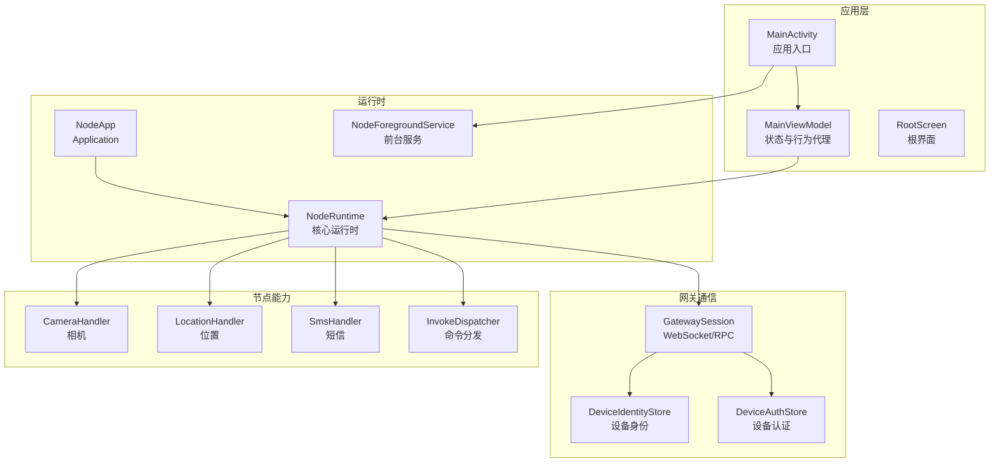
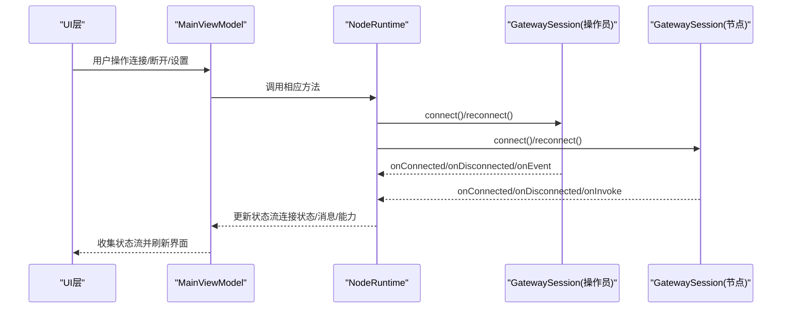
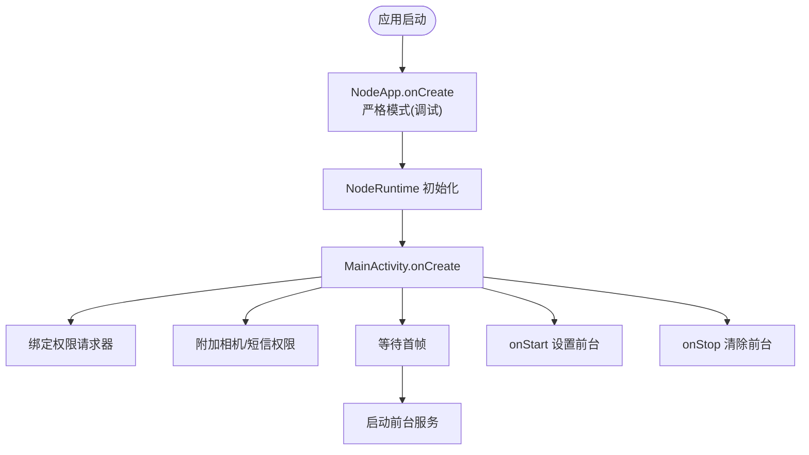
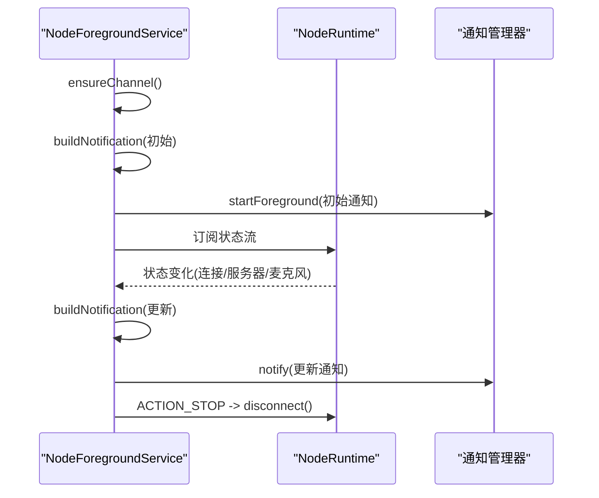
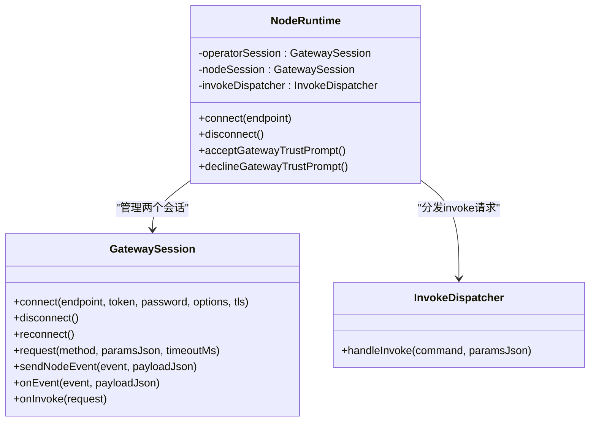
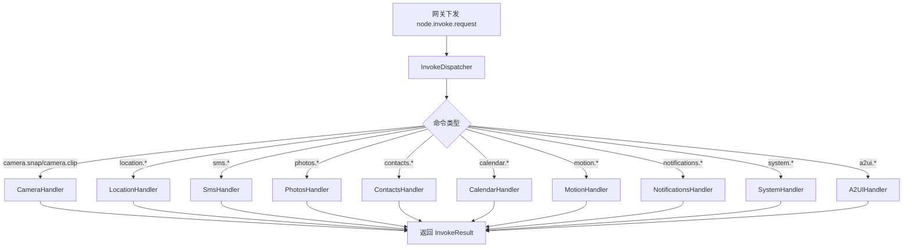
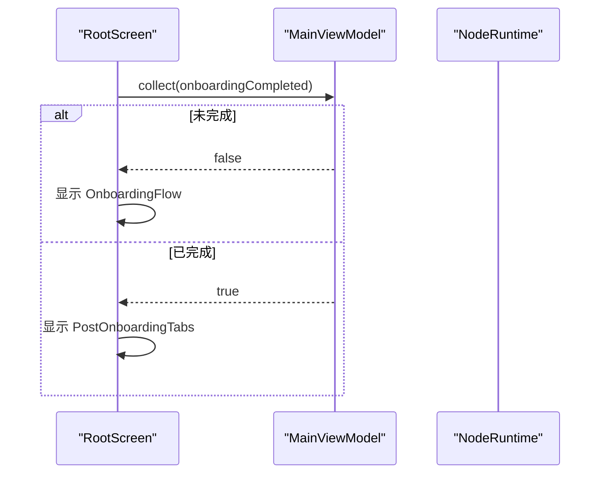
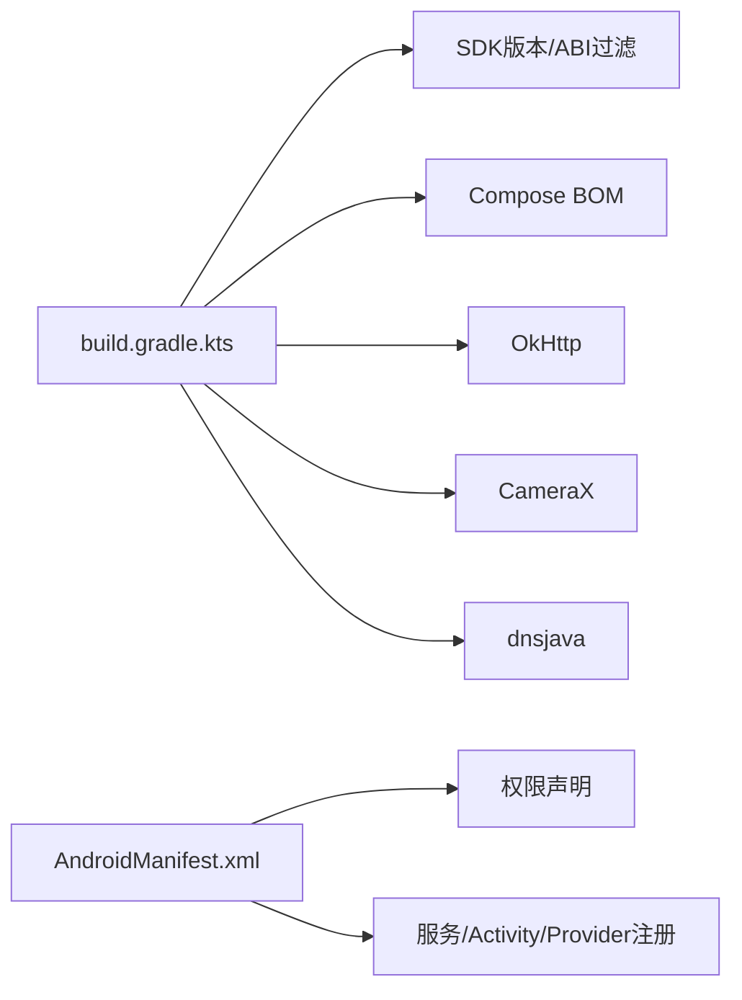

# Android节点概览

<cite>
**本文档引用的文件**
- [MainActivity.kt](file://apps/android/app/src/main/java/ai/openclaw/app/MainActivity.kt)
- [NodeApp.kt](file://apps/android/app/src/main/java/ai/openclaw/app/NodeApp.kt)
- [NodeRuntime.kt](file://apps/android/app/src/main/java/ai/openclaw/app/NodeRuntime.kt)
- [NodeForegroundService.kt](file://apps/android/app/src/main/java/ai/openclaw/app/NodeForegroundService.kt)
- [MainViewModel.kt](file://apps/android/app/src/main/java/ai/openclaw/app/MainViewModel.kt)
- [AndroidManifest.xml](file://apps/android/app/src/main/AndroidManifest.xml)
- [GatewaySession.kt](file://apps/android/app/src/main/java/ai/openclaw/app/gateway/GatewaySession.kt)
- [CameraHandler.kt](file://apps/android/app/src/main/java/ai/openclaw/app/node/CameraHandler.kt)
- [RootScreen.kt](file://apps/android/app/src/main/java/ai/openclaw/app/ui/RootScreen.kt)
- [README.md](file://apps/android/README.md)
- [build.gradle.kts](file://apps/android/app/build.gradle.kts)
</cite>

## 目录
1. [简介](#简介)
2. [项目结构](#项目结构)
3. [核心组件](#核心组件)
4. [架构总览](#架构总览)
5. [详细组件分析](#详细组件分析)
6. [依赖关系分析](#依赖关系分析)
7. [性能考虑](#性能考虑)
8. [故障排除指南](#故障排除指南)
9. [结论](#结论)
10. [附录](#附录)

## 简介
本概览面向OpenClaw Android节点应用，系统阐述其整体架构、核心功能模块与设计理念。重点说明Android节点如何通过网关会话与OpenClaw网关通信，实现设备控制与消息处理；解释应用的启动流程、生命周期管理与前台服务机制；并涵盖主要组件结构、权限配置与系统集成方式。最后提供安装要求、兼容性说明与基本使用指南。

## 项目结构
Android节点应用位于apps/android目录，采用Kotlin + Jetpack Compose开发，核心模块包括：
- 应用入口与生命周期：NodeApp、MainActivity、MainViewModel
- 前台服务：NodeForegroundService（连接状态通知）
- 网关通信：GatewaySession（WebSocket连接、RPC调用、事件分发）
- 节点能力：CameraHandler、LocationHandler、SmsHandler等（通过InvokeDispatcher统一调度）
- UI层：RootScreen、OnboardingFlow、PostOnboardingTabs等
- 构建与权限：AndroidManifest.xml、build.gradle.kts

**图表来源**
- [NodeApp.kt:1-27](file://apps/android/app/src/main/java/ai/openclaw/app/NodeApp.kt#L1-L27)
- [MainActivity.kt:1-64](file://apps/android/app/src/main/java/ai/openclaw/app/MainActivity.kt#L1-L64)
- [MainViewModel.kt:1-203](file://apps/android/app/src/main/java/ai/openclaw/app/MainViewModel.kt#L1-L203)
- [NodeForegroundService.kt:1-159](file://apps/android/app/src/main/java/ai/openclaw/app/NodeForegroundService.kt#L1-L159)
- [GatewaySession.kt:1-761](file://apps/android/app/src/main/java/ai/openclaw/app/gateway/GatewaySession.kt#L1-L761)
- [CameraHandler.kt:1-176](file://apps/android/app/src/main/java/ai/openclaw/app/node/CameraHandler.kt#L1-L176)

**章节来源**
- [README.md:1-229](file://apps/android/README.md#L1-L229)
- [build.gradle.kts:1-214](file://apps/android/app/build.gradle.kts#L1-L214)

## 核心组件
- NodeApp：应用级初始化，启用严格模式（调试构建），延迟创建NodeRuntime
- MainActivity：设置窗口装饰适配、权限请求器绑定、首次帧后启动前台服务、生命周期内保持屏幕常亮控制
- MainViewModel：持有NodeRuntime引用，暴露状态流与操作方法，桥接UI与运行时
- NodeRuntime：核心运行时，负责网关发现、TLS指纹校验、连接管理、节点能力注册与分发、Canvas/A2UI交互、语音/麦克风/通话等
- NodeForegroundService：前台服务，持续显示连接状态通知，支持断开动作
- GatewaySession：封装WebSocket连接、RPC请求/响应、事件分发、自动重连、TLS参数解析与校验
- CameraHandler等节点处理器：将设备能力映射为网关可调用的命令（如camera.snap、camera.clip）

**章节来源**
- [NodeApp.kt:1-27](file://apps/android/app/src/main/java/ai/openclaw/app/NodeApp.kt#L1-L27)
- [MainActivity.kt:1-64](file://apps/android/app/src/main/java/ai/openclaw/app/MainActivity.kt#L1-L64)
- [MainViewModel.kt:1-203](file://apps/android/app/src/main/java/ai/openclaw/app/MainViewModel.kt#L1-L203)
- [NodeRuntime.kt:1-923](file://apps/android/app/src/main/java/ai/openclaw/app/NodeRuntime.kt#L1-L923)
- [NodeForegroundService.kt:1-159](file://apps/android/app/src/main/java/ai/openclaw/app/NodeForegroundService.kt#L1-L159)
- [GatewaySession.kt:1-761](file://apps/android/app/src/main/java/ai/openclaw/app/gateway/GatewaySession.kt#L1-L761)
- [CameraHandler.kt:1-176](file://apps/android/app/src/main/java/ai/openclaw/app/node/CameraHandler.kt#L1-L176)

## 架构总览
Android节点以NodeRuntime为中心，协调多个子系统：
- 网关通信：通过两个GatewaySession分别承载“操作员”和“节点”角色，独立连接与事件处理
- 设备能力：各Handler将系统能力封装为可调用命令，经InvokeDispatcher路由到对应处理器
- UI与状态：MainViewModel聚合NodeRuntime的状态流，RootScreen根据引导完成状态切换
- 前台服务：NodeForegroundService基于NodeRuntime状态流动态更新通知

**图表来源**
- [MainViewModel.kt:1-203](file://apps/android/app/src/main/java/ai/openclaw/app/MainViewModel.kt#L1-L203)
- [NodeRuntime.kt:1-923](file://apps/android/app/src/main/java/ai/openclaw/app/NodeRuntime.kt#L1-L923)
- [GatewaySession.kt:1-761](file://apps/android/app/src/main/java/ai/openclaw/app/gateway/GatewaySession.kt#L1-L761)

## 详细组件分析

### 启动流程与生命周期
- 应用启动：NodeApp在onCreate中启用严格模式（调试构建），并延迟初始化NodeRuntime
- 活动入口：MainActivity在onCreate中设置窗口装饰、绑定权限请求器、附加相机/短信权限；在首次绘制后异步启动NodeForegroundService
- 生命周期：onStart设置前台标志，onStop清除前台标志并停止活动语音会话

**图表来源**
- [NodeApp.kt:1-27](file://apps/android/app/src/main/java/ai/openclaw/app/NodeApp.kt#L1-L27)
- [MainActivity.kt:1-64](file://apps/android/app/src/main/java/ai/openclaw/app/MainActivity.kt#L1-L64)
- [NodeForegroundService.kt:1-159](file://apps/android/app/src/main/java/ai/openclaw/app/NodeForegroundService.kt#L1-L159)

**章节来源**
- [NodeApp.kt:1-27](file://apps/android/app/src/main/java/ai/openclaw/app/NodeApp.kt#L1-L27)
- [MainActivity.kt:1-64](file://apps/android/app/src/main/java/ai/openclaw/app/MainActivity.kt#L1-L64)

### 前台服务机制
- NodeForegroundService在onCreate阶段创建通知通道并显示初始通知
- 通过combine收集NodeRuntime的状态流，动态更新通知标题与内容（含服务器名、连接状态、麦克风监听状态）
- 提供“断开”动作，触发NodeRuntime.disconnect并停止自身

**图表来源**
- [NodeForegroundService.kt:1-159](file://apps/android/app/src/main/java/ai/openclaw/app/NodeForegroundService.kt#L1-L159)
- [NodeRuntime.kt:1-923](file://apps/android/app/src/main/java/ai/openclaw/app/NodeRuntime.kt#L1-L923)

**章节来源**
- [NodeForegroundService.kt:1-159](file://apps/android/app/src/main/java/ai/openclaw/app/NodeForegroundService.kt#L1-L159)

### 网关通信与消息处理
- GatewaySession封装WebSocket连接、RPC请求/响应、事件分发与自动重连
- NodeRuntime维护两个GatewaySession实例：一个用于操作员（operator），一个用于节点（node）
- InvokeDispatcher将网关下发的node.invoke.request路由到具体Handler（如CameraHandler、LocationHandler等）
- TLS指纹校验：首次连接时探测网关TLS指纹，提示用户验证并通过安全存储持久化

**图表来源**
- [GatewaySession.kt:1-761](file://apps/android/app/src/main/java/ai/openclaw/app/gateway/GatewaySession.kt#L1-L761)
- [NodeRuntime.kt:1-923](file://apps/android/app/src/main/java/ai/openclaw/app/NodeRuntime.kt#L1-L923)

**章节来源**
- [GatewaySession.kt:1-761](file://apps/android/app/src/main/java/ai/openclaw/app/gateway/GatewaySession.kt#L1-L761)
- [NodeRuntime.kt:1-923](file://apps/android/app/src/main/java/ai/openclaw/app/NodeRuntime.kt#L1-L923)

### 设备控制与节点能力
- NodeRuntime通过InvokeDispatcher注册多类Handler，覆盖相机、位置、通知、系统、照片、联系人、日历、运动、短信、A2UI等
- CameraHandler示例：处理camera.snap/camera.clip，包含HUD反馈、闪光灯触发、音频录制控制、超大负载保护
- 通过GatewaySession的node.invoke机制，将设备能力暴露给网关侧调用

**图表来源**
- [NodeRuntime.kt:1-923](file://apps/android/app/src/main/java/ai/openclaw/app/NodeRuntime.kt#L1-L923)
- [CameraHandler.kt:1-176](file://apps/android/app/src/main/java/ai/openclaw/app/node/CameraHandler.kt#L1-L176)

**章节来源**
- [NodeRuntime.kt:1-923](file://apps/android/app/src/main/java/ai/openclaw/app/NodeRuntime.kt#L1-L923)
- [CameraHandler.kt:1-176](file://apps/android/app/src/main/java/ai/openclaw/app/node/CameraHandler.kt#L1-L176)

### UI与状态管理
- RootScreen根据onboardingCompleted状态决定展示OnboardingFlow或PostOnboardingTabs
- MainViewModel聚合NodeRuntime的状态流（连接状态、服务器名、远程地址、麦克风状态、Canvas状态等），供UI订阅

**图表来源**
- [RootScreen.kt:1-21](file://apps/android/app/src/main/java/ai/openclaw/app/ui/RootScreen.kt#L1-L21)
- [MainViewModel.kt:1-203](file://apps/android/app/src/main/java/ai/openclaw/app/MainViewModel.kt#L1-L203)

**章节来源**
- [RootScreen.kt:1-21](file://apps/android/app/src/main/java/ai/openclaw/app/ui/RootScreen.kt#L1-L21)
- [MainViewModel.kt:1-203](file://apps/android/app/src/main/java/ai/openclaw/app/MainViewModel.kt#L1-L203)

## 依赖关系分析
- 构建配置：compileSdk/targetSdk/minSdk、Kotlin编译选项、Compose BOM、OkHttp、CameraX、dnsjava等
- 权限声明：INTERNET、NETWORK_STATE、FOREGROUND_SERVICE、POST_NOTIFICATIONS、NEARBY_WIFI_DEVICES、LOCATION、CAMERA、RECORD_AUDIO、SEND_SMS、MEDIA_*、CONTACTS、CALENDAR、ACTIVITY_RECOGNITION等
- 组件注册：NodeForegroundService、DeviceNotificationListenerService、FileProvider、MainActivity

**图表来源**
- [build.gradle.kts:1-214](file://apps/android/app/build.gradle.kts#L1-L214)
- [AndroidManifest.xml:1-77](file://apps/android/app/src/main/AndroidManifest.xml#L1-L77)

**章节来源**
- [build.gradle.kts:1-214](file://apps/android/app/build.gradle.kts#L1-L214)
- [AndroidManifest.xml:1-77](file://apps/android/app/src/main/AndroidManifest.xml#L1-L77)

## 性能考虑
- 启动路径优化：MainActivity在首帧后才启动前台服务，减少冷启动开销
- 连接重试策略：GatewaySession指数回退重连，避免频繁抖动
- 状态流合并：NodeForegroundService使用combine合并多源状态，减少冗余通知更新
- 资源打包：排除非必要META-INF资源，减小包体；发布构建启用混淆与资源收缩

**章节来源**
- [MainActivity.kt:1-64](file://apps/android/app/src/main/java/ai/openclaw/app/MainActivity.kt#L1-L64)
- [GatewaySession.kt:1-761](file://apps/android/app/src/main/java/ai/openclaw/app/gateway/GatewaySession.kt#L1-L761)
- [NodeForegroundService.kt:1-159](file://apps/android/app/src/main/java/ai/openclaw/app/NodeForegroundService.kt#L1-L159)
- [build.gradle.kts:1-214](file://apps/android/app/build.gradle.kts#L1-L214)

## 故障排除指南
- 首次连接TLS指纹校验失败：NodeRuntime会在缺少已保存指纹时探测并弹出信任提示，接受后缓存指纹并重连
- 网关不可达/断开：GatewaySession自动重连，状态流反映“连接中/重连中/错误”
- Canvas/A2UI不可用：NodeRuntime提供手动重载Canvas的能力，并在超时后给出错误提示
- 语音/麦克风异常：MainViewModel提供Mic/TTS开关与状态流，确保前台状态变更时正确停止语音会话
- 权限问题：相机/录音/位置/通知监听等权限需在设置或引导流程中授予，否则相关能力不可用

**章节来源**
- [NodeRuntime.kt:1-923](file://apps/android/app/src/main/java/ai/openclaw/app/NodeRuntime.kt#L1-L923)
- [GatewaySession.kt:1-761](file://apps/android/app/src/main/java/ai/openclaw/app/gateway/GatewaySession.kt#L1-L761)
- [MainViewModel.kt:1-203](file://apps/android/app/src/main/java/ai/openclaw/app/MainViewModel.kt#L1-L203)

## 结论
OpenClaw Android节点应用以NodeRuntime为核心，结合GatewaySession实现可靠的网关通信与命令分发，配合前台服务与UI状态流提供稳定的用户体验。通过严格的权限管理、TLS指纹校验与自动重连机制，保障了安全性与可用性。建议在实际部署中关注最小SDK版本、权限授予与网络环境，确保节点能力与网关侧指令的顺畅交互。

## 附录

### 安装要求与兼容性
- 最低系统版本：Android 12（API 31）
- 开发工具：Android Studio，Gradle，JDK 17
- 构建产物：发布构建需配置签名属性（storeFile、storePassword、keyAlias、keyPassword）

**章节来源**
- [build.gradle.kts:1-214](file://apps/android/app/build.gradle.kts#L1-L214)
- [README.md:1-229](file://apps/android/README.md#L1-L229)

### 权限配置与系统集成
- 必需权限：INTERNET、ACCESS_NETWORK_STATE、FOREGROUND_SERVICE、FOREGROUND_SERVICE_DATA_SYNC、POST_NOTIFICATIONS
- 发现与定位：NEARBY_WIFI_DEVICES（Android 13+）、ACCESS_FINE_LOCATION（Android 12及以下）
- 设备能力：CAMERA、RECORD_AUDIO、SEND_SMS、READ_MEDIA_IMAGES、READ_MEDIA_VISUAL_USER_SELECTED、READ_CONTACTS、WRITE_CONTACTS、READ_CALENDAR、WRITE_CALENDAR、ACTIVITY_RECOGNITION
- 系统服务：NodeForegroundService、DeviceNotificationListenerService、FileProvider

**章节来源**
- [AndroidManifest.xml:1-77](file://apps/android/app/src/main/AndroidManifest.xml#L1-L77)
- [README.md:165-174](file://apps/android/README.md#L165-L174)

### 基本使用指南
- 连接网关：在Connect标签页使用“Setup Code”或“Manual”模式连接
- 授权配对：在网关侧批准设备配对请求
- 功能体验：进入Screen标签页进行Canvas/A2UI操作，Voice标签页进行语音交互，Settings调整各项能力开关

**章节来源**
- [README.md:143-163](file://apps/android/README.md#L143-L163)