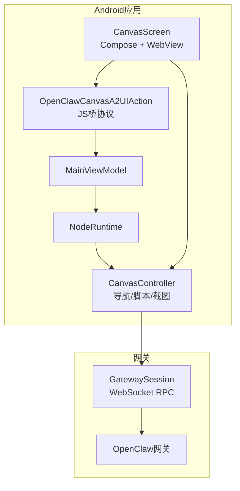
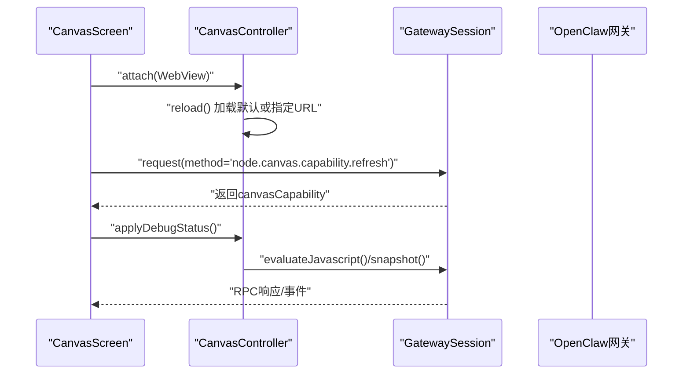
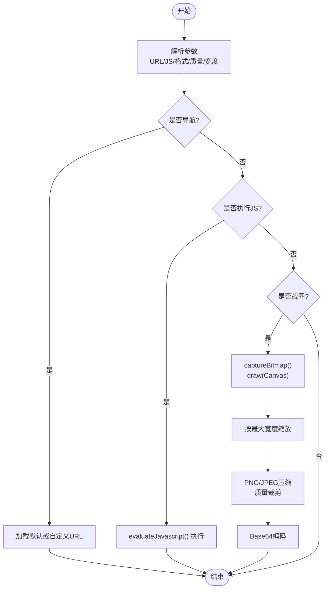
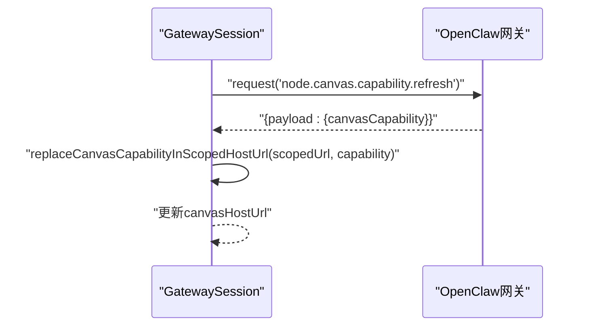
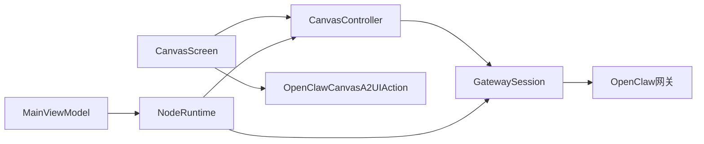

# Canvas控制

<cite>
**本文引用的文件**
- [apps/android/app/src/main/java/ai/openclaw/app/node/CanvasController.kt](file://apps/android/app/src/main/java/ai/openclaw/app/node/CanvasController.kt)
- [apps/android/app/src/main/java/ai/openclaw/app/ui/CanvasScreen.kt](file://apps/android/app/src/main/java/ai/openclaw/app/ui/CanvasScreen.kt)
- [apps/android/app/src/main/java/ai/openclaw/app/protocol/OpenClawCanvasA2UIAction.kt](file://apps/android/app/src/main/java/ai/openclaw/app/protocol/OpenClawCanvasA2UIAction.kt)
- [apps/android/app/src/main/java/ai/openclaw/app/gateway/GatewaySession.kt](file://apps/android/app/src/main/java/ai/openclaw/app/gateway/GatewaySession.kt)
- [apps/android/app/src/main/java/ai/openclaw/app/MainViewModel.kt](file://apps/android/app/src/main/java/ai/openclaw/app/MainViewModel.kt)
- [apps/android/app/src/main/java/ai/openclaw/app/NodeRuntime.kt](file://apps/android/app/src/main/java/ai/openclaw/app/NodeRuntime.kt)
- [src/agents/tools/canvas-tool.ts](file://src/agents/tools/canvas-tool.ts)
- [src/gateway/canvas-capability.ts](file://src/gateway/canvas-capability.ts)
- [src/infra/canvas-host-url.ts](file://src/infra/canvas-host-url.ts)
- [apps/android/app/src/test/java/ai/openclaw/app/node/CanvasControllerSnapshotParamsTest.kt](file://apps/android/app/src/test/java/ai/openclaw/app/node/CanvasControllerSnapshotParamsTest.kt)
- [apps/android/app/src/test/java/ai/openclaw/app/protocol/OpenClawCanvasA2UIActionTest.kt](file://apps/android/app/src/test/java/ai/openclaw/app/protocol/OpenClawCanvasA2UIActionTest.kt)
</cite>

## 目录
1. [简介](#简介)
2. [项目结构](#项目结构)
3. [核心组件](#核心组件)
4. [架构总览](#架构总览)
5. [详细组件分析](#详细组件分析)
6. [依赖关系分析](#依赖关系分析)
7. [性能考虑](#性能考虑)
8. [故障排查指南](#故障排查指南)
9. [结论](#结论)
10. [附录](#附录)

## 简介
本文件面向OpenClaw Android节点的Canvas控制能力，系统性阐述以下内容：
- Canvas界面的交互机制、手势识别与绘图功能（通过WebView承载的Canvas页面）
- Canvas与OpenClaw网关的通信协议、数据传输与状态同步
- Canvas控制的配置项、画笔设置与绘图参数调整
- Canvas界面的响应式设计、多点触控与手势组合操作
- Canvas功能的性能优化、内存管理与渲染效率提升方法

## 项目结构
Android侧Canvas相关代码主要分布在以下模块：
- 应用层UI：CanvasScreen（Compose + WebView）负责承载Canvas页面并桥接A2UI动作
- 控制器：CanvasController（WebView生命周期、导航、脚本执行、截图）负责具体Canvas操作
- 协议桥：OpenClawCanvasA2UIAction（JS桥接消息格式化与校验）负责从WebView向应用传递用户动作
- 网关会话：GatewaySession（WebSocket RPC）负责与网关通信、刷新Canvas能力与URL
- 运行时：NodeRuntime（状态流、重载请求、A2UI集成）负责Canvas状态与事件编排
- 工具链：canvas-tool.ts（CLI/Agent侧Canvas工具）定义命令与参数规范
- 能力与URL：canvas-capability.ts、canvas-host-url.ts（能力令牌、作用域URL、端口/协议归一化）

图表来源
- [apps/android/app/src/main/java/ai/openclaw/app/ui/CanvasScreen.kt:26-131](file://apps/android/app/src/main/java/ai/openclaw/app/ui/CanvasScreen.kt#L26-L131)
- [apps/android/app/src/main/java/ai/openclaw/app/node/CanvasController.kt:26-273](file://apps/android/app/src/main/java/ai/openclaw/app/node/CanvasController.kt#L26-L273)
- [apps/android/app/src/main/java/ai/openclaw/app/protocol/OpenClawCanvasA2UIAction.kt:1-67](file://apps/android/app/src/main/java/ai/openclaw/app/protocol/OpenClawCanvasA2UIAction.kt#L1-L67)
- [apps/android/app/src/main/java/ai/openclaw/app/gateway/GatewaySession.kt:162-215](file://apps/android/app/src/main/java/ai/openclaw/app/gateway/GatewaySession.kt#L162-L215)
- [apps/android/app/src/main/java/ai/openclaw/app/MainViewModel.kt:13-75](file://apps/android/app/src/main/java/ai/openclaw/app/MainViewModel.kt#L13-L75)
- [apps/android/app/src/main/java/ai/openclaw/app/NodeRuntime.kt:442-491](file://apps/android/app/src/main/java/ai/openclaw/app/NodeRuntime.kt#L442-L491)

章节来源
- [apps/android/app/src/main/java/ai/openclaw/app/ui/CanvasScreen.kt:26-131](file://apps/android/app/src/main/java/ai/openclaw/app/ui/CanvasScreen.kt#L26-L131)
- [apps/android/app/src/main/java/ai/openclaw/app/node/CanvasController.kt:26-273](file://apps/android/app/src/main/java/ai/openclaw/app/node/CanvasController.kt#L26-L273)
- [apps/android/app/src/main/java/ai/openclaw/app/protocol/OpenClawCanvasA2UIAction.kt:1-67](file://apps/android/app/src/main/java/ai/openclaw/app/protocol/OpenClawCanvasA2UIAction.kt#L1-L67)
- [apps/android/app/src/main/java/ai/openclaw/app/gateway/GatewaySession.kt:162-215](file://apps/android/app/src/main/java/ai/openclaw/app/gateway/GatewaySession.kt#L162-L215)
- [apps/android/app/src/main/java/ai/openclaw/app/MainViewModel.kt:13-75](file://apps/android/app/src/main/java/ai/openclaw/app/MainViewModel.kt#L13-L75)
- [apps/android/app/src/main/java/ai/openclaw/app/NodeRuntime.kt:442-491](file://apps/android/app/src/main/java/ai/openclaw/app/NodeRuntime.kt#L442-L491)

## 核心组件
- CanvasScreen（Compose + WebView）
  - 配置WebView参数（启用JS、DOM存储、滚动、禁用强制深色等），设置WebViewClient/WebChromeClient捕获错误与日志
  - 注入JS桥接口openclawCanvasA2UIAction，用于从Canvas页面向应用上报用户动作
  - 生命周期内attach/detach CanvasController，释放资源时销毁WebView
- CanvasController
  - 导航：支持默认Canvas（无URL）与自定义URL；记录当前URL状态流
  - 脚本执行：evaluateJavascript在主线程异步执行并返回结果
  - 截图：支持PNG/JPEG格式、质量与最大宽度裁剪；基于draw(Canvas)生成位图
  - 调试状态：通过JS注入设置调试开关与标题/副标题
  - 参数解析：从JSON解析导航URL、脚本、截图格式/质量/尺寸
- OpenClawCanvasA2UIAction
  - 提取动作名称（优先name字段，其次action）
  - 标准化标签值（字母数字与特定字符保留）
  - 组装Agent消息格式（包含action/session/surface/component/host/instance/上下文）
  - 生成JS事件分发语句，通知Canvas页面动作处理结果
- GatewaySession
  - 通过WebSocket RPC与网关通信，支持请求/响应与事件
  - 刷新Canvas能力：调用“node.canvas.capability.refresh”，更新scoped URL中的能力令牌
  - 归一化Canvas Host URL：根据TLS连接、端口、协议进行修正
- NodeRuntime
  - 编排Canvas状态：连接/断开时切换到本地Canvas或A2UI
  - 请求Canvas重载：向网关发送agent.request事件，触发A2UI重建或渲染
  - 状态流：暴露canvasCurrentUrl、canvasA2uiHydrated、canvasRehydratePending等
- Agent工具（canvas-tool.ts）
  - 定义Canvas动作：present/hide/navigate/eval/snapshot/a2ui_push/a2ui_reset
  - 参数校验与类型约束，调用网关node.invoke执行命令
  - 支持A2UI JSONL推送与快照输出

章节来源
- [apps/android/app/src/main/java/ai/openclaw/app/ui/CanvasScreen.kt:26-131](file://apps/android/app/src/main/java/ai/openclaw/app/ui/CanvasScreen.kt#L26-L131)
- [apps/android/app/src/main/java/ai/openclaw/app/node/CanvasController.kt:26-273](file://apps/android/app/src/main/java/ai/openclaw/app/node/CanvasController.kt#L26-L273)
- [apps/android/app/src/main/java/ai/openclaw/app/protocol/OpenClawCanvasA2UIAction.kt:1-67](file://apps/android/app/src/main/java/ai/openclaw/app/protocol/OpenClawCanvasA2UIAction.kt#L1-L67)
- [apps/android/app/src/main/java/ai/openclaw/app/gateway/GatewaySession.kt:162-215](file://apps/android/app/src/main/java/ai/openclaw/app/gateway/GatewaySession.kt#L162-L215)
- [apps/android/app/src/main/java/ai/openclaw/app/NodeRuntime.kt:425-491](file://apps/android/app/src/main/java/ai/openclaw/app/NodeRuntime.kt#L425-L491)
- [src/agents/tools/canvas-tool.ts:18-216](file://src/agents/tools/canvas-tool.ts#L18-L216)

## 架构总览
下图展示Android Canvas控制在端到端场景下的交互路径：应用层通过GatewaySession与网关通信，CanvasController承载WebView并执行导航/脚本/截图；Agent侧通过canvas-tool.ts调用网关命令。

图表来源
- [apps/android/app/src/main/java/ai/openclaw/app/ui/CanvasScreen.kt:68-127](file://apps/android/app/src/main/java/ai/openclaw/app/ui/CanvasScreen.kt#L68-L127)
- [apps/android/app/src/main/java/ai/openclaw/app/node/CanvasController.kt:102-143](file://apps/android/app/src/main/java/ai/openclaw/app/node/CanvasController.kt#L102-L143)
- [apps/android/app/src/main/java/ai/openclaw/app/gateway/GatewaySession.kt:176-215](file://apps/android/app/src/main/java/ai/openclaw/app/gateway/GatewaySession.kt#L176-L215)

## 详细组件分析

### CanvasScreen（Compose + WebView）
- 关键职责
  - 初始化WebView并设置安全与性能相关参数
  - 注入JS桥接口openclawCanvasA2UIAction，接收来自Canvas页面的动作消息
  - 生命周期管理：attach/detach控制器、释放资源、销毁WebView
- 错误与日志
  - 捕获WebResourceError/HTTP错误与渲染进程异常
  - 调试模式下输出控制台日志
- 响应式设计
  - 开启滚动容器与滚动条，关闭内置缩放与算法深色，避免主题冲突

章节来源
- [apps/android/app/src/main/java/ai/openclaw/app/ui/CanvasScreen.kt:26-131](file://apps/android/app/src/main/java/ai/openclaw/app/ui/CanvasScreen.kt#L26-L131)

### CanvasController（WebView控制）
- 导航与URL管理
  - 默认Canvas：URL为空；自定义URL：trim后加载
  - 记录currentUrl状态流，供UI订阅
- 调试状态
  - 通过JS注入设置调试开关与标题/副标题
- JavaScript执行
  - evaluateJavascript在主线程执行，返回字符串结果
- 截图与压缩
  - PNG/JPEG格式选择与质量限制（0.1~1.0）
  - 最大宽度缩放，避免超大图片导致内存压力
- 参数解析
  - 解析导航URL、脚本、截图格式/质量/最大宽度
  - 质量值边界裁剪，宽度过滤非正数

图表来源
- [apps/android/app/src/main/java/ai/openclaw/app/node/CanvasController.kt:145-192](file://apps/android/app/src/main/java/ai/openclaw/app/node/CanvasController.kt#L145-L192)
- [apps/android/app/src/main/java/ai/openclaw/app/node/CanvasController.kt:166-180](file://apps/android/app/src/main/java/ai/openclaw/app/node/CanvasController.kt#L166-L180)
- [apps/android/app/src/main/java/ai/openclaw/app/node/CanvasController.kt:215-240](file://apps/android/app/src/main/java/ai/openclaw/app/node/CanvasController.kt#L215-L240)

章节来源
- [apps/android/app/src/main/java/ai/openclaw/app/node/CanvasController.kt:26-273](file://apps/android/app/src/main/java/ai/openclaw/app/node/CanvasController.kt#L26-L273)

### OpenClawCanvasA2UIAction（JS桥协议）
- 动作提取
  - 优先使用name字段，否则回退到action字段
- 标签标准化
  - 去除空格，仅保留字母数字与特定符号，其余替换为下划线
- 消息格式
  - 组装CANVAS_A2UI消息，包含action/session/surface/component/host/instance/上下文
- JS事件
  - 生成window.dispatchEvent语句，向Canvas页面反馈动作处理状态

章节来源
- [apps/android/app/src/main/java/ai/openclaw/app/protocol/OpenClawCanvasA2UIAction.kt:1-67](file://apps/android/app/src/main/java/ai/openclaw/app/protocol/OpenClawCanvasA2UIAction.kt#L1-L67)

### GatewaySession（网关通信）
- 请求/响应
  - request(method,params,timeoutMs)封装RPC调用
  - 支持超时与错误对象解析
- Canvas能力刷新
  - 调用“node.canvas.capability.refresh”获取新能力令牌
  - 将能力令牌写入scoped URL路径段，更新canvasHostUrl
- URL归一化
  - 根据TLS连接、端口、协议修正Canvas Host URL
  - 处理代理HTTPS场景下的端口映射

图表来源
- [apps/android/app/src/main/java/ai/openclaw/app/gateway/GatewaySession.kt:176-215](file://apps/android/app/src/main/java/ai/openclaw/app/gateway/GatewaySession.kt#L176-L215)
- [apps/android/app/src/main/java/ai/openclaw/app/gateway/GatewaySession.kt:741-755](file://apps/android/app/src/main/java/ai/openclaw/app/gateway/GatewaySession.kt#L741-L755)

章节来源
- [apps/android/app/src/main/java/ai/openclaw/app/gateway/GatewaySession.kt:162-215](file://apps/android/app/src/main/java/ai/openclaw/app/gateway/GatewaySession.kt#L162-L215)
- [apps/android/app/src/main/java/ai/openclaw/app/gateway/GatewaySession.kt:637-691](file://apps/android/app/src/main/java/ai/openclaw/app/gateway/GatewaySession.kt#L637-L691)
- [apps/android/app/src/main/java/ai/openclaw/app/gateway/GatewaySession.kt:741-755](file://apps/android/app/src/main/java/ai/openclaw/app/gateway/GatewaySession.kt#L741-L755)

### NodeRuntime（运行时编排）
- 自动导航A2UI
  - 连接成功后若未访问过A2UI，则自动导航至移动端友好仪表盘
- 断开回退
  - 断开网关时回到本地Canvas
- Canvas重载请求
  - 发送agent.request事件，要求网关重建或渲染A2UI
  - 超时未响应则提示重试

章节来源
- [apps/android/app/src/main/java/ai/openclaw/app/NodeRuntime.kt:425-491](file://apps/android/app/src/main/java/ai/openclaw/app/NodeRuntime.kt#L425-L491)

### Agent工具（canvas-tool.ts）
- 动作定义
  - present/hide/navigate/eval/snapshot/a2ui_push/a2ui_reset
- 参数校验
  - 对URL、脚本、格式、尺寸、质量等进行类型与范围检查
- 调用网关
  - 使用callGatewayTool(node.invoke,...)执行命令
- 输出处理
  - 快照写入临时文件并返回图像结果

章节来源
- [src/agents/tools/canvas-tool.ts:18-216](file://src/agents/tools/canvas-tool.ts#L18-L216)

## 依赖关系分析
- 组件耦合
  - CanvasScreen依赖CanvasController与MainViewModel
  - CanvasController依赖WebView与参数解析工具
  - GatewaySession独立于UI，通过RPC与网关交互
  - NodeRuntime协调Canvas状态与A2UI重载
- 外部依赖
  - WebView渲染与JS执行
  - OkHttp WebSocket客户端
  - JSON序列化/反序列化

图表来源
- [apps/android/app/src/main/java/ai/openclaw/app/ui/CanvasScreen.kt:26-131](file://apps/android/app/src/main/java/ai/openclaw/app/ui/CanvasScreen.kt#L26-L131)
- [apps/android/app/src/main/java/ai/openclaw/app/node/CanvasController.kt:26-273](file://apps/android/app/src/main/java/ai/openclaw/app/node/CanvasController.kt#L26-L273)
- [apps/android/app/src/main/java/ai/openclaw/app/protocol/OpenClawCanvasA2UIAction.kt:1-67](file://apps/android/app/src/main/java/ai/openclaw/app/protocol/OpenClawCanvasA2UIAction.kt#L1-L67)
- [apps/android/app/src/main/java/ai/openclaw/app/gateway/GatewaySession.kt:162-215](file://apps/android/app/src/main/java/ai/openclaw/app/gateway/GatewaySession.kt#L162-L215)
- [apps/android/app/src/main/java/ai/openclaw/app/MainViewModel.kt:13-75](file://apps/android/app/src/main/java/ai/openclaw/app/MainViewModel.kt#L13-L75)
- [apps/android/app/src/main/java/ai/openclaw/app/NodeRuntime.kt:425-491](file://apps/android/app/src/main/java/ai/openclaw/app/NodeRuntime.kt#L425-L491)

## 性能考虑
- 渲染与截图
  - 截图采用draw(Canvas)生成位图，避免PixelCopy在部分版本不支持的限制
  - 在主线程执行evaluateJavascript，避免跨线程WebView调用开销
- 内存管理
  - 截图前按最大宽度缩放，降低内存峰值
  - 质量值裁剪至0.1~1.0，JPEG质量百分比映射到1~100
- WebView配置
  - 关闭算法深色与内置缩放，减少不必要的渲染与布局抖动
  - 启用DOM存储与兼容模式，兼顾Canvas页面的现代特性
- 网络与超时
  - RPC请求设置合理超时，避免阻塞UI线程
  - 能力刷新失败时记录警告，避免无限重试

章节来源
- [apps/android/app/src/main/java/ai/openclaw/app/node/CanvasController.kt:182-192](file://apps/android/app/src/main/java/ai/openclaw/app/node/CanvasController.kt#L182-L192)
- [apps/android/app/src/main/java/ai/openclaw/app/node/CanvasController.kt:42-53](file://apps/android/app/src/main/java/ai/openclaw/app/node/CanvasController.kt#L42-L53)
- [apps/android/app/src/main/java/ai/openclaw/app/ui/CanvasScreen.kt:56-60](file://apps/android/app/src/main/java/ai/openclaw/app/ui/CanvasScreen.kt#L56-L60)
- [apps/android/app/src/main/java/ai/openclaw/app/gateway/GatewaySession.kt:162-174](file://apps/android/app/src/main/java/ai/openclaw/app/gateway/GatewaySession.kt#L162-L174)

## 故障排查指南
- WebView错误
  - 检查onReceivedError/onReceivedHttpError日志，定位网络/证书/资源问题
  - 渲染进程异常时关注onRenderProcessGone日志
- 截图异常
  - 确认WebView已加载完成再截图
  - 检查最大宽度与质量参数是否有效
- A2UI动作未生效
  - 确认JS桥接口openclawCanvasA2UIAction已注入
  - 校验动作名称与标签标准化规则
- 网关能力刷新失败
  - 检查canvasCapability返回值与scoped URL格式
  - 确认TLS连接与端口映射正确

章节来源
- [apps/android/app/src/main/java/ai/openclaw/app/ui/CanvasScreen.kt:70-110](file://apps/android/app/src/main/java/ai/openclaw/app/ui/CanvasScreen.kt#L70-L110)
- [apps/android/app/src/main/java/ai/openclaw/app/node/CanvasController.kt:155-180](file://apps/android/app/src/main/java/ai/openclaw/app/node/CanvasController.kt#L155-L180)
- [apps/android/app/src/main/java/ai/openclaw/app/protocol/OpenClawCanvasA2UIAction.kt:38-65](file://apps/android/app/src/main/java/ai/openclaw/app/protocol/OpenClawCanvasA2UIAction.kt#L38-L65)
- [apps/android/app/src/main/java/ai/openclaw/app/gateway/GatewaySession.kt:176-215](file://apps/android/app/src/main/java/ai/openclaw/app/gateway/GatewaySession.kt#L176-L215)

## 结论
OpenClaw Android的Canvas控制通过WebView承载Canvas页面，结合CanvasController实现导航、脚本执行与截图；通过GatewaySession与网关进行能力刷新与URL归一化；NodeRuntime负责A2UI重载与状态编排。整体设计在保证安全性的同时，提供了灵活的参数配置与良好的性能表现。

## 附录

### Canvas控制配置与参数
- 导航
  - URL：字符串，支持相对路径与完整URL
  - 默认Canvas：URL为空
- 脚本执行
  - javaScript：字符串，必填
- 截图
  - format：png/jpeg/jpg，默认jpeg
  - quality：数值，范围0.1~1.0
  - maxWidth：整数，大于0
- A2UI
  - jsonl/jsonlPath：二选一，用于推送动作描述
  - a2ui_reset：重置A2UI状态

章节来源
- [src/agents/tools/canvas-tool.ts:54-78](file://src/agents/tools/canvas-tool.ts#L54-L78)
- [apps/android/app/src/main/java/ai/openclaw/app/node/CanvasController.kt:215-240](file://apps/android/app/src/main/java/ai/openclaw/app/node/CanvasController.kt#L215-L240)

### 测试要点
- 截图参数解析
  - 默认格式为jpeg，质量边界裁剪，宽度非正数过滤
- A2UI动作提取
  - 优先name，其次action；标签标准化规则一致

章节来源
- [apps/android/app/src/test/java/ai/openclaw/app/node/CanvasControllerSnapshotParamsTest.kt:9-42](file://apps/android/app/src/test/java/ai/openclaw/app/node/CanvasControllerSnapshotParamsTest.kt#L9-L42)
- [apps/android/app/src/test/java/ai/openclaw/app/protocol/OpenClawCanvasA2UIActionTest.kt:10-48](file://apps/android/app/src/test/java/ai/openclaw/app/protocol/OpenClawCanvasA2UIActionTest.kt#L10-L48)