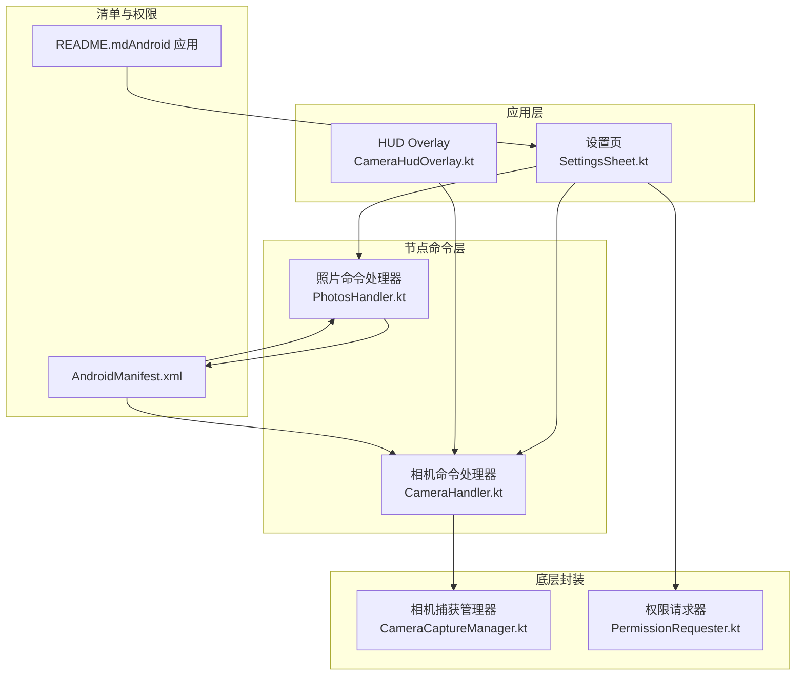
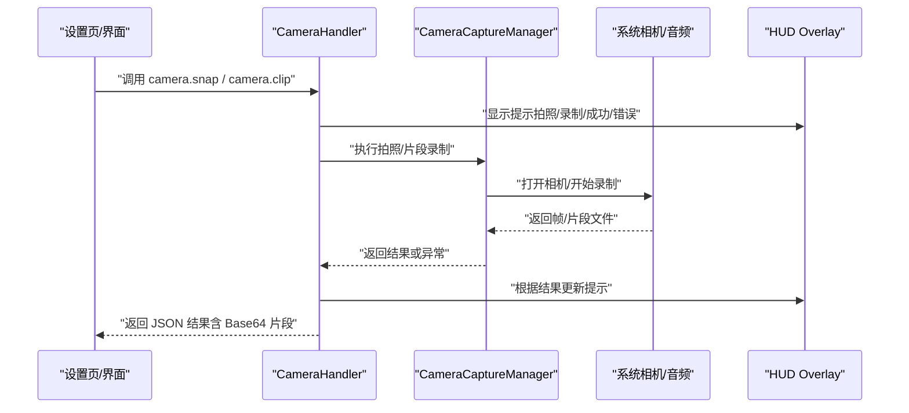
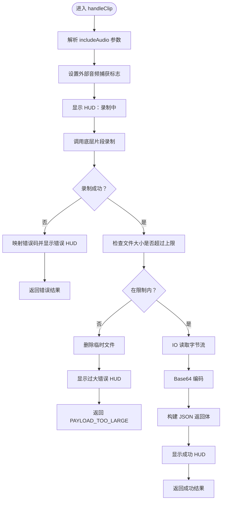
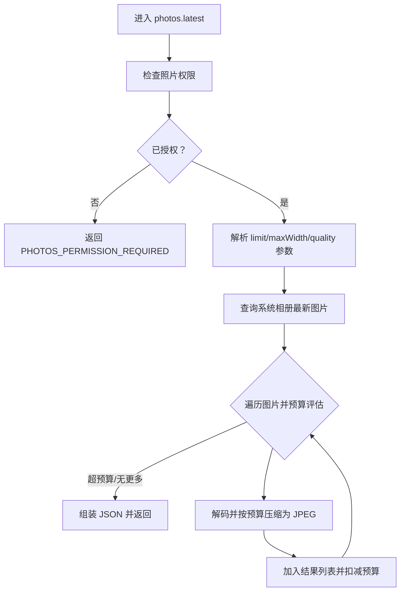
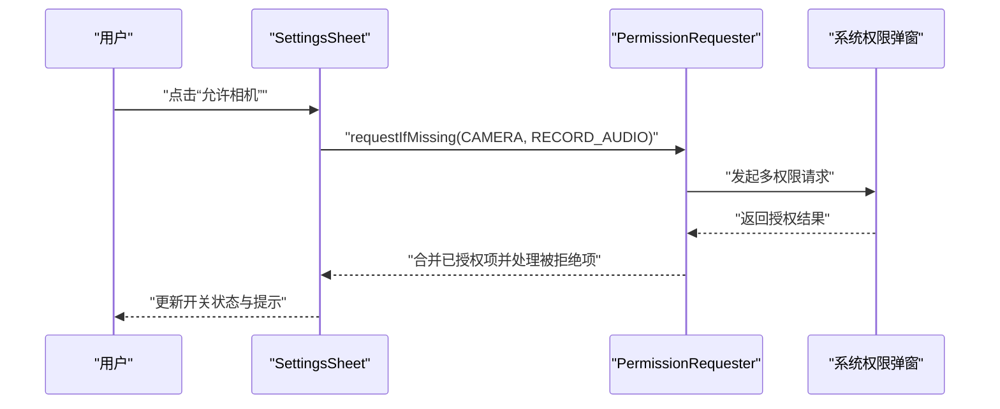
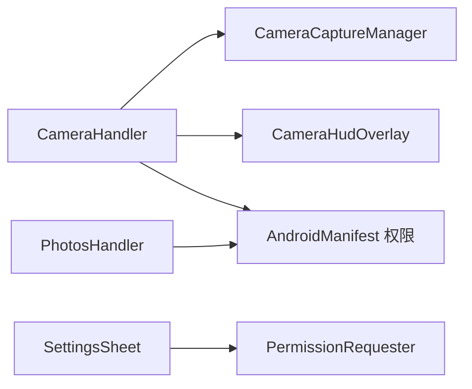

# 相机与屏幕录制

<cite>
**本文引用的文件**
- [CameraHandler.kt](file://apps/android/app/src/main/java/ai/openclaw/app/node/CameraHandler.kt)
- [CameraCaptureManager.kt](file://apps/android/app/src/main/java/ai/openclaw/app/node/CameraCaptureManager.kt)
- [CameraHudState.kt](file://apps/android/app/src/main/java/ai/openclaw/app/CameraHudState.kt)
- [CameraHudOverlay.kt](file://apps/android/app/src/main/java/ai/openclaw/app/ui/CameraHudOverlay.kt)
- [PhotosHandler.kt](file://apps/android/app/src/main/java/ai/openclaw/app/node/PhotosHandler.kt)
- [SettingsSheet.kt](file://apps/android/app/src/main/java/ai/openclaw/app/ui/SettingsSheet.kt)
- [PermissionRequester.kt](file://apps/android/app/src/main/java/ai/openclaw/app/PermissionRequester.kt)
- [AndroidManifest.xml](file://apps/android/app/src/main/AndroidManifest.xml)
- [README.md（Android 应用）](file://apps/android/README.md)
</cite>

## 目录
1. [简介](#简介)
2. [项目结构](#项目结构)
3. [核心组件](#核心组件)
4. [架构总览](#架构总览)
5. [详细组件分析](#详细组件分析)
6. [依赖关系分析](#依赖关系分析)
7. [性能考量](#性能考量)
8. [故障排查指南](#故障排查指南)
9. [结论](#结论)
10. [附录](#附录)

## 简介
本文件面向 OpenClaw Android 节点的“相机与屏幕录制”能力，系统性说明以下内容：
- 相机控制：设备枚举、拍照、短时视频片段录制、HUD 反馈与错误处理
- 屏幕录制：调用约定、录制质量与存储、交互式授权要求
- 权限体系：相机、麦克风、通知、媒体访问等权限的申请、状态与设置跳转
- 参数与配置：拍照/片段参数解析、片段大小限制、照片批量获取与压缩策略
- 数据安全与隐私：权限最小化、本地日志与调试开关、传输前编码与裁剪

## 项目结构
Android 相关代码集中在 apps/android/app/src/main 下，关键模块包括：
- 节点命令处理器：CameraHandler、PhotosHandler
- 摄像头底层封装：CameraCaptureManager
- UI 与 HUD：CameraHudState、CameraHudOverlay
- 设置页与权限：SettingsSheet、PermissionRequester
- 清单与权限声明：AndroidManifest.xml
- 平台说明与集成测试指引：README.md（Android 应用）

图表来源
- [CameraHandler.kt:1-176](file://apps/android/app/src/main/java/ai/openclaw/app/node/CameraHandler.kt#L1-L176)
- [PhotosHandler.kt:1-289](file://apps/android/app/src/main/java/ai/openclaw/app/node/PhotosHandler.kt#L1-L289)
- [CameraCaptureManager.kt](file://apps/android/app/src/main/java/ai/openclaw/app/node/CameraCaptureManager.kt)
- [SettingsSheet.kt:1-903](file://apps/android/app/src/main/java/ai/openclaw/app/ui/SettingsSheet.kt#L1-L903)
- [PermissionRequester.kt:1-134](file://apps/android/app/src/main/java/ai/openclaw/app/PermissionRequester.kt#L1-L134)
- [AndroidManifest.xml:1-77](file://apps/android/app/src/main/AndroidManifest.xml#L1-L77)
- [README.md（Android 应用）:1-229](file://apps/android/README.md#L1-L229)

章节来源
- [AndroidManifest.xml:1-77](file://apps/android/app/src/main/AndroidManifest.xml#L1-L77)
- [README.md（Android 应用）:165-174](file://apps/android/README.md#L165-L174)

## 核心组件
- 相机命令处理器（CameraHandler）
  - 提供 camera.list、camera.snap、camera.clip 三类命令
  - 统一的 HUD 反馈与错误映射，片段大小限制与 Base64 编码
- 相机捕获管理器（CameraCaptureManager）
  - 封装底层相机与音频采集，负责设备选择、快门触发、片段写入
- 照片命令处理器（PhotosHandler）
  - 读取系统相册最新图片，按预算进行缩放与 JPEG 压缩，返回 Base64
- 设置页与权限（SettingsSheet、PermissionRequester）
  - 集中管理相机、麦克风、通知、媒体访问等权限的申请与状态展示
- HUD 状态模型（CameraHudState）
  - 定义拍照、录制、成功、错误四类 HUD 显示语义

章节来源
- [CameraHandler.kt:1-176](file://apps/android/app/src/main/java/ai/openclaw/app/node/CameraHandler.kt#L1-L176)
- [CameraCaptureManager.kt](file://apps/android/app/src/main/java/ai/openclaw/app/node/CameraCaptureManager.kt)
- [PhotosHandler.kt:1-289](file://apps/android/app/src/main/java/ai/openclaw/app/node/PhotosHandler.kt#L1-L289)
- [SettingsSheet.kt:1-903](file://apps/android/app/src/main/java/ai/openclaw/app/ui/SettingsSheet.kt#L1-L903)
- [PermissionRequester.kt:1-134](file://apps/android/app/src/main/java/ai/openclaw/app/PermissionRequester.kt#L1-L134)
- [CameraHudState.kt:1-15](file://apps/android/app/src/main/java/ai/openclaw/app/CameraHudState.kt#L1-L15)

## 架构总览
下图展示了从 UI 到节点命令、再到底层捕获与权限的整体调用链。

图表来源
- [CameraHandler.kt:58-154](file://apps/android/app/src/main/java/ai/openclaw/app/node/CameraHandler.kt#L58-L154)
- [CameraCaptureManager.kt](file://apps/android/app/src/main/java/ai/openclaw/app/node/CameraCaptureManager.kt)
- [CameraHudOverlay.kt](file://apps/android/app/src/main/java/ai/openclaw/app/ui/CameraHudOverlay.kt)

## 详细组件分析

### 相机命令处理器（CameraHandler）
- 设备枚举：列出可用相机设备并序列化为 JSON
- 拍照（snap）：触发 HUD、闪光灯、调用底层拍照并返回 JSON；失败时映射错误码
- 片段录制（clip）：支持 includeAudio 控制是否启用外部音频；对输出文件大小做上限校验，超限时删除临时文件并返回错误；否则读取二进制并 Base64 编码返回
- 参数解析：解析 includeAudio 字段，支持 true/false 或省略

图表来源
- [CameraHandler.kt:96-154](file://apps/android/app/src/main/java/ai/openclaw/app/node/CameraHandler.kt#L96-L154)

章节来源
- [CameraHandler.kt:1-176](file://apps/android/app/src/main/java/ai/openclaw/app/node/CameraHandler.kt#L1-L176)

### 相机捕获管理器（CameraCaptureManager）
- 职责：封装相机与音频采集细节，提供 listDevices、snap、clip 等接口
- 交互：与 CameraHandler 协作，通过回调触发闪光灯、更新 HUD
- 注意：具体实现文件未在本次检索中完整呈现，但其作为 CameraHandler 的依赖存在

章节来源
- [CameraHandler.kt:22-29](file://apps/android/app/src/main/java/ai/openclaw/app/node/CameraHandler.kt#L22-L29)
- [CameraCaptureManager.kt](file://apps/android/app/src/main/java/ai/openclaw/app/node/CameraCaptureManager.kt)

### HUD 状态与界面反馈（CameraHudState、CameraHudOverlay）
- 状态模型：定义 Photo、Recording、Success、Error 四类 HUD
- 界面：在相机操作期间向用户反馈当前状态，如“拍照中”、“正在录制”、“拍摄成功/失败”

章节来源
- [CameraHudState.kt:1-15](file://apps/android/app/src/main/java/ai/openclaw/app/CameraHudState.kt#L1-L15)
- [CameraHudOverlay.kt](file://apps/android/app/src/main/java/ai/openclaw/app/ui/CameraHudOverlay.kt)

### 照片批量获取（PhotosHandler）
- 权限要求：根据系统版本选择 READ_MEDIA_IMAGES 或旧版 READ_EXTERNAL_STORAGE
- 查询策略：按拍摄时间与添加时间排序，限制数量
- 图像处理：按最大宽度计算缩放采样，JPEG 压缩，确保单张与总量 Base64 长度预算
- 返回格式：包含 format、base64、width、height、createdAt 等字段

图表来源
- [PhotosHandler.kt:214-255](file://apps/android/app/src/main/java/ai/openclaw/app/node/PhotosHandler.kt#L214-L255)
- [PhotosHandler.kt:64-205](file://apps/android/app/src/main/java/ai/openclaw/app/node/PhotosHandler.kt#L64-L205)

章节来源
- [PhotosHandler.kt:1-289](file://apps/android/app/src/main/java/ai/openclaw/app/node/PhotosHandler.kt#L1-L289)

### 设置页与权限（SettingsSheet、PermissionRequester）
- 设置页集中展示并管理相机、麦克风、通知、媒体访问、联系人、日历、运动、短信等权限
- 权限请求器：统一处理权限弹窗、理由说明、设置页跳转与超时合并结果
- 生命周期：在 ON_RESUME 时刷新各权限状态，便于 UI 实时反映

图表来源
- [SettingsSheet.kt:282-296](file://apps/android/app/src/main/java/ai/openclaw/app/ui/SettingsSheet.kt#L282-L296)
- [PermissionRequester.kt:33-85](file://apps/android/app/src/main/java/ai/openclaw/app/PermissionRequester.kt#L33-L85)

章节来源
- [SettingsSheet.kt:1-903](file://apps/android/app/src/main/java/ai/openclaw/app/ui/SettingsSheet.kt#L1-L903)
- [PermissionRequester.kt:1-134](file://apps/android/app/src/main/java/ai/openclaw/app/PermissionRequester.kt#L1-L134)

### 屏幕录制（平台差异与调用约定）
- Android 端：集成能力测试套件明确指出“屏幕录制需交互式同意”，因此在 Android 上无法通过常规命令直接触发录制
- iOS/macOS：提供了屏幕录制服务与参数解析逻辑（格式、时长、帧率、音频），可作为跨平台参考
- 建议：在 Android 上通过系统级“投屏/录屏”授权流程完成录制，并将结果以安全方式回传

章节来源
- [README.md（Android 应用）:213-214](file://apps/android/README.md#L213-L214)
- [ScreenRecordService.swift（iOS）:1-86](file://apps/ios/Sources/Screen/ScreenRecordService.swift#L1-L86)
- [ScreenRecordService.swift（macOS）:42-114](file://apps/macos/Sources/OpenClaw/ScreenRecordService.swift#L42-L114)

## 依赖关系分析
- 模块耦合
  - CameraHandler 依赖 CameraCaptureManager 进行底层捕获
  - SettingsSheet 依赖 PermissionRequester 进行权限申请与状态刷新
  - PhotosHandler 依赖系统媒体存储权限
- 外部依赖
  - AndroidManifest 声明相机、录音、通知、媒体读取、联系人、日历、运动识别等权限
- 潜在风险
  - 片段大小限制与 Base64 编码可能带来内存压力，需结合设备性能与网络条件合理配置

图表来源
- [CameraHandler.kt:1-176](file://apps/android/app/src/main/java/ai/openclaw/app/node/CameraHandler.kt#L1-L176)
- [SettingsSheet.kt:1-903](file://apps/android/app/src/main/java/ai/openclaw/app/ui/SettingsSheet.kt#L1-L903)
- [PermissionRequester.kt:1-134](file://apps/android/app/src/main/java/ai/openclaw/app/PermissionRequester.kt#L1-L134)
- [PhotosHandler.kt:1-289](file://apps/android/app/src/main/java/ai/openclaw/app/node/PhotosHandler.kt#L1-L289)
- [AndroidManifest.xml:1-77](file://apps/android/app/src/main/AndroidManifest.xml#L1-L77)

章节来源
- [AndroidManifest.xml:12-24](file://apps/android/app/src/main/AndroidManifest.xml#L12-L24)

## 性能考量
- 相机片段
  - 采用 IO 线程读取文件并 Base64 编码，避免阻塞主线程
  - 对输出文件大小进行上限校验，防止超大负载导致内存溢出
- 照片批量
  - 使用 inSampleSize 降采样与 JPEG 压缩，严格控制单张与总量的 Base64 长度预算
  - 优先返回最近图片，减少扫描范围
- HUD 与 UI
  - 仅在必要时机刷新权限状态，降低生命周期事件开销

章节来源
- [CameraHandler.kt:136-140](file://apps/android/app/src/main/java/ai/openclaw/app/node/CameraHandler.kt#L136-L140)
- [PhotosHandler.kt:165-205](file://apps/android/app/src/main/java/ai/openclaw/app/node/PhotosHandler.kt#L165-L205)

## 故障排查指南
- 相机/片段失败
  - 检查相机权限与麦克风权限（录制含音频时）
  - 关注 HUD 错误提示与日志（调试模式下生成 camera_debug.log）
  - 若片段过大，降低 durationMs 或提高 includeAudio=false
- 照片批量失败
  - 确认照片权限（READ_MEDIA_IMAGES 或 READ_EXTERNAL_STORAGE）
  - 检查参数范围（limit/maxWidth/quality）
- 权限被拒
  - 通过设置页“管理”按钮跳转系统设置开启
  - 使用 PermissionRequester 的理由说明与设置引导流程
- 录制不可自动化（Android）
  - 屏幕录制需交互式授权，无法通过命令自动触发

章节来源
- [CameraHandler.kt:66-94](file://apps/android/app/src/main/java/ai/openclaw/app/node/CameraHandler.kt#L66-L94)
- [PhotosHandler.kt:214-220](file://apps/android/app/src/main/java/ai/openclaw/app/node/PhotosHandler.kt#L214-L220)
- [SettingsSheet.kt:247-280](file://apps/android/app/src/main/java/ai/openclaw/app/ui/SettingsSheet.kt#L247-L280)
- [README.md（Android 应用）:213-214](file://apps/android/README.md#L213-L214)

## 结论
OpenClaw Android 节点围绕相机与照片能力提供了清晰的命令接口与完善的权限管理流程。通过 CameraHandler 与 CameraCaptureManager 的协作，实现了拍照与短片段录制；通过 PhotosHandler 支持了系统相册的批量访问与压缩输出。设置页与权限请求器统一管理各类敏感权限，保障用户体验与合规性。屏幕录制在 Android 上受系统交互授权限制，建议结合系统录屏流程与安全回传机制使用。

## 附录

### 权限与能力对照表
- 相机拍照/片段：CAMERA + RECORD_AUDIO（片段含音频时）
- 系统照片访问：READ_MEDIA_IMAGES（Android 13+）或 READ_EXTERNAL_STORAGE（<= Android 12）
- 通知与前台服务：POST_NOTIFICATIONS、FOREGROUND_SERVICE
- 其他：SEND_SMS、READ_CONTACTS/WRITE_CONTACTS、READ_CALENDAR/WRITE_CALENDAR、ACTIVITY_RECOGNITION

章节来源
- [AndroidManifest.xml:12-24](file://apps/android/app/src/main/AndroidManifest.xml#L12-L24)
- [README.md（Android 应用）:165-174](file://apps/android/README.md#L165-L174)