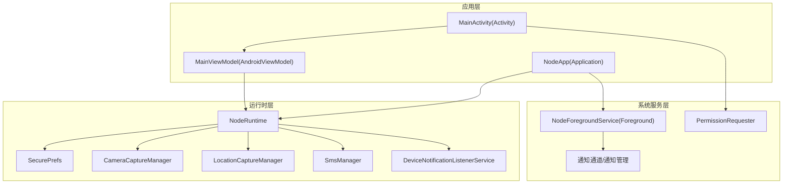
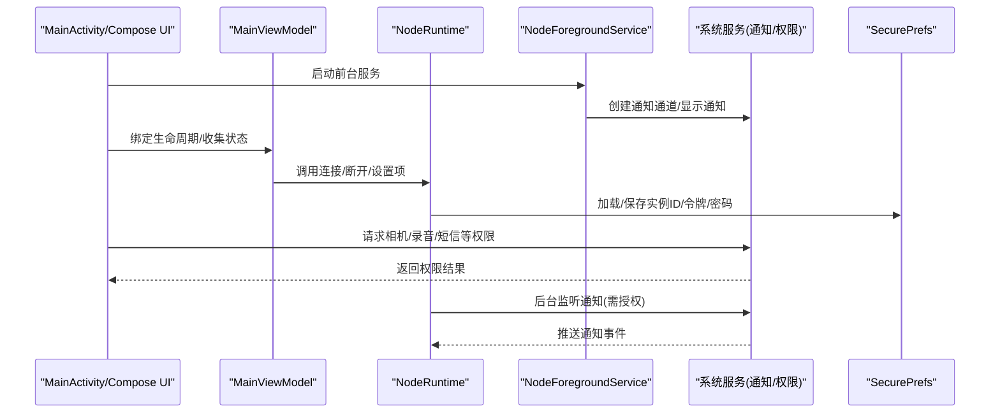
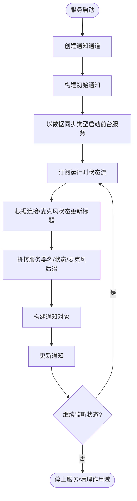
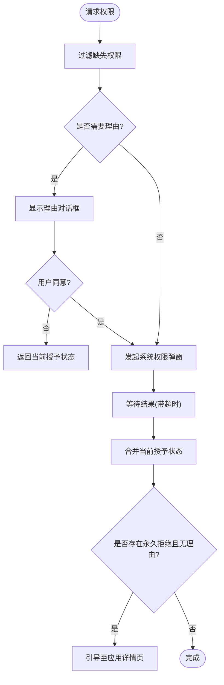
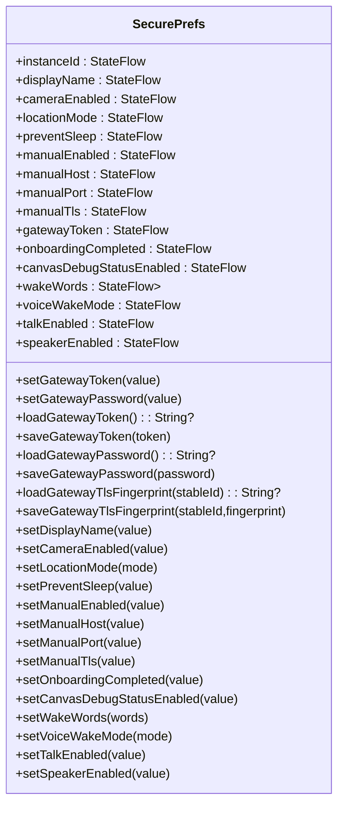
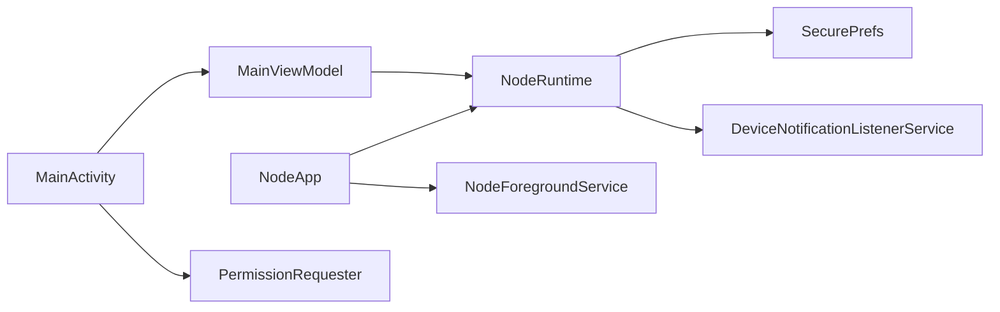

# 系统集成

<cite>
**本文引用的文件**
- [NodeForegroundService.kt](file://apps/android/app/src/main/java/ai/openclaw/app/NodeForegroundService.kt)
- [PermissionRequester.kt](file://apps/android/app/src/main/java/ai/openclaw/app/PermissionRequester.kt)
- [SecurePrefs.kt](file://apps/android/app/src/main/java/ai/openclaw/app/SecurePrefs.kt)
- [NodeApp.kt](file://apps/android/app/src/main/java/ai/openclaw/app/NodeApp.kt)
- [NodeRuntime.kt](file://apps/android/app/src/main/java/ai/openclaw/app/NodeRuntime.kt)
- [AndroidManifest.xml](file://apps/android/app/src/main/AndroidManifest.xml)
- [MainActivity.kt](file://apps/android/app/src/main/java/ai/openclaw/app/MainActivity.kt)
- [MainViewModel.kt](file://apps/android/app/src/main/java/ai/openclaw/app/MainViewModel.kt)
- [DeviceNotificationListenerService.kt](file://apps/android/app/src/main/java/ai/openclaw/app/node/DeviceNotificationListenerService.kt)
- [build.gradle.kts](file://apps/android/app/build.gradle.kts)
</cite>

## 目录
1. [简介](#简介)
2. [项目结构](#项目结构)
3. [核心组件](#核心组件)
4. [架构总览](#架构总览)
5. [详细组件分析](#详细组件分析)
6. [依赖关系分析](#依赖关系分析)
7. [性能考量](#性能考量)
8. [故障排查指南](#故障排查指南)
9. [结论](#结论)
10. [附录](#附录)

## 简介
本文件面向OpenClaw Android节点的系统集成功能，系统性阐述Android节点如何与系统服务深度集成，覆盖以下主题：
- 前台服务管理：通知通道、通知更新、前台服务类型与生命周期
- 权限请求处理：多权限批量请求、拒绝后的引导与设置跳转
- 安全存储机制：加密SharedPreferences与明文SharedPreferences的职责分离
- 系统权限申请流程、用户授权处理与权限变更监听
- 配置选项、服务生命周期管理与后台运行策略
- 系统兼容性处理、版本适配与厂商定制系统的支持
- 性能优化、资源管理与用户体验提升方法

## 项目结构
Android应用采用“应用层 + 运行时层 + 系统服务层”的分层设计：
- 应用层：Application、Activity、ViewModel负责UI与生命周期
- 运行时层：NodeRuntime聚合设备能力（相机、位置、短信、通知等）并协调连接会话
- 系统服务层：前台服务、通知监听服务、权限请求器、安全偏好存储

图表来源
- [NodeApp.kt:1-27](file://apps/android/app/src/main/java/ai/openclaw/app/NodeApp.kt#L1-L27)
- [MainActivity.kt:1-64](file://apps/android/app/src/main/java/ai/openclaw/app/MainActivity.kt#L1-L64)
- [MainViewModel.kt:1-203](file://apps/android/app/src/main/java/ai/openclaw/app/MainViewModel.kt#L1-L203)
- [NodeRuntime.kt:1-923](file://apps/android/app/src/main/java/ai/openclaw/app/NodeRuntime.kt#L1-L923)
- [SecurePrefs.kt:1-322](file://apps/android/app/src/main/java/ai/openclaw/app/SecurePrefs.kt#L1-L322)
- [DeviceNotificationListenerService.kt:1-378](file://apps/android/app/src/main/java/ai/openclaw/app/node/DeviceNotificationListenerService.kt#L1-L378)
- [NodeForegroundService.kt:1-159](file://apps/android/app/src/main/java/ai/openclaw/app/NodeForegroundService.kt#L1-L159)
- [PermissionRequester.kt:1-134](file://apps/android/app/src/main/java/ai/openclaw/app/PermissionRequester.kt#L1-L134)

章节来源
- [NodeApp.kt:1-27](file://apps/android/app/src/main/java/ai/openclaw/app/NodeApp.kt#L1-L27)
- [MainActivity.kt:1-64](file://apps/android/app/src/main/java/ai/openclaw/app/MainActivity.kt#L1-L64)
- [MainViewModel.kt:1-203](file://apps/android/app/src/main/java/ai/openclaw/app/MainViewModel.kt#L1-L203)
- [NodeRuntime.kt:1-923](file://apps/android/app/src/main/java/ai/openclaw/app/NodeRuntime.kt#L1-L923)
- [SecurePrefs.kt:1-322](file://apps/android/app/src/main/java/ai/openclaw/app/SecurePrefs.kt#L1-L322)
- [DeviceNotificationListenerService.kt:1-378](file://apps/android/app/src/main/java/ai/openclaw/app/node/DeviceNotificationListenerService.kt#L1-L378)
- [NodeForegroundService.kt:1-159](file://apps/android/app/src/main/java/ai/openclaw/app/NodeForegroundService.kt#L1-L159)
- [PermissionRequester.kt:1-134](file://apps/android/app/src/main/java/ai/openclaw/app/PermissionRequester.kt#L1-L134)

## 核心组件
- 前台服务与通知：NodeForegroundService负责启动前台服务、创建通知通道、动态更新通知内容，并以数据同步类型运行，确保在后台稳定运行
- 权限请求器：PermissionRequester封装多权限批量请求、理由说明对话框、超时控制与设置页跳转，统一处理权限状态与用户交互
- 安全偏好存储：SecurePrefs将敏感信息（如网关令牌/密码）存入加密SharedPreferences，非敏感配置放入明文SharedPreferences，二者通过不同键空间隔离
- 运行时协调器：NodeRuntime聚合设备能力与系统服务，管理网关发现与连接、Canvas A2UI交互、语音/相机/位置/短信等能力开关
- 通知监听服务：DeviceNotificationListenerService监听系统通知变化，转换为节点事件并上报到NodeRuntime
- 应用与界面：NodeApp初始化运行时；MainActivity在首帧后启动前台服务；MainViewModel桥接UI与NodeRuntime

章节来源
- [NodeForegroundService.kt:1-159](file://apps/android/app/src/main/java/ai/openclaw/app/NodeForegroundService.kt#L1-L159)
- [PermissionRequester.kt:1-134](file://apps/android/app/src/main/java/ai/openclaw/app/PermissionRequester.kt#L1-L134)
- [SecurePrefs.kt:1-322](file://apps/android/app/src/main/java/ai/openclaw/app/SecurePrefs.kt#L1-L322)
- [NodeRuntime.kt:1-923](file://apps/android/app/src/main/java/ai/openclaw/app/NodeRuntime.kt#L1-L923)
- [DeviceNotificationListenerService.kt:1-378](file://apps/android/app/src/main/java/ai/openclaw/app/node/DeviceNotificationListenerService.kt#L1-L378)
- [NodeApp.kt:1-27](file://apps/android/app/src/main/java/ai/openclaw/app/NodeApp.kt#L1-L27)
- [MainActivity.kt:1-64](file://apps/android/app/src/main/java/ai/openclaw/app/MainActivity.kt#L1-L64)
- [MainViewModel.kt:1-203](file://apps/android/app/src/main/java/ai/openclaw/app/MainViewModel.kt#L1-L203)

## 架构总览
下图展示Android节点与系统服务的交互路径：前台服务驱动通知显示与后台运行；权限请求器在UI侧触发系统权限弹窗；安全存储在应用启动时加载实例ID与默认名称；通知监听服务在获得系统授权后向NodeRuntime推送通知事件。

图表来源
- [MainActivity.kt:1-64](file://apps/android/app/src/main/java/ai/openclaw/app/MainActivity.kt#L1-L64)
- [MainViewModel.kt:1-203](file://apps/android/app/src/main/java/ai/openclaw/app/MainViewModel.kt#L1-L203)
- [NodeRuntime.kt:1-923](file://apps/android/app/src/main/java/ai/openclaw/app/NodeRuntime.kt#L1-L923)
- [NodeForegroundService.kt:1-159](file://apps/android/app/src/main/java/ai/openclaw/app/NodeForegroundService.kt#L1-L159)
- [SecurePrefs.kt:1-322](file://apps/android/app/src/main/java/ai/openclaw/app/SecurePrefs.kt#L1-L322)
- [DeviceNotificationListenerService.kt:1-378](file://apps/android/app/src/main/java/ai/openclaw/app/node/DeviceNotificationListenerService.kt#L1-L378)

## 详细组件分析

### 前台服务与通知管理
- 通知通道：首次启动时创建低重要性通道，避免打扰
- 通知内容：标题随连接状态与麦克风监听状态动态变化；文本包含服务器名与状态
- 前台服务类型：使用数据同步类型，满足后台稳定运行需求
- 生命周期：在onCreate中初始化并启动，onDestroy中取消协程作用域；stop动作由服务内部处理

图表来源
- [NodeForegroundService.kt:1-159](file://apps/android/app/src/main/java/ai/openclaw/app/NodeForegroundService.kt#L1-L159)

章节来源
- [NodeForegroundService.kt:1-159](file://apps/android/app/src/main/java/ai/openclaw/app/NodeForegroundService.kt#L1-L159)

### 权限请求处理与用户授权
- 批量请求：对缺失权限进行过滤与去重，统一发起系统弹窗
- 用户理由：若出现“需要理由”场景，先弹出解释对话框再发起请求
- 超时与合并：请求在超时时间内完成，最终结果与当前已授予状态合并
- 设置引导：对永久拒绝且无理由的权限，引导用户前往系统设置开启

图表来源
- [PermissionRequester.kt:1-134](file://apps/android/app/src/main/java/ai/openclaw/app/PermissionRequester.kt#L1-L134)

章节来源
- [PermissionRequester.kt:1-134](file://apps/android/app/src/main/java/ai/openclaw/app/PermissionRequester.kt#L1-L134)

### 安全存储机制
- 加密SharedPreferences：用于存放令牌、密码等敏感数据，采用AES256-GCM方案
- 明文SharedPreferences：用于存放非敏感配置（如相机开关、位置模式、唤醒词等）
- 实例ID与默认名称：首次启动生成UUID作为实例ID；默认名称从设备名推导并迁移
- TLS指纹：按网关稳定ID存储TLS指纹，用于自动信任与安全连接

图表来源
- [SecurePrefs.kt:1-322](file://apps/android/app/src/main/java/ai/openclaw/app/SecurePrefs.kt#L1-L322)

章节来源
- [SecurePrefs.kt:1-322](file://apps/android/app/src/main/java/ai/openclaw/app/SecurePrefs.kt#L1-L322)

### 系统权限申请流程、用户授权处理与权限变更监听
- 清单声明：网络、通知、定位、相机、录音、短信、媒体读取、活动识别等权限
- 运行时请求：MainActivity在启动时初始化PermissionRequester，并在相机与短信模块中注入权限请求器
- 权限变更：通过状态流与系统回调联动，结合超时与合并策略保证一致性

章节来源
- [AndroidManifest.xml:1-77](file://apps/android/app/src/main/AndroidManifest.xml#L1-L77)
- [MainActivity.kt:1-64](file://apps/android/app/src/main/java/ai/openclaw/app/MainActivity.kt#L1-L64)
- [PermissionRequester.kt:1-134](file://apps/android/app/src/main/java/ai/openclaw/app/PermissionRequester.kt#L1-L134)

### 配置选项、服务生命周期管理与后台运行策略
- 配置项：实例ID、显示名、相机开关、位置模式、防止休眠、手动网关、唤醒词、语音唤醒模式、TTS开关等
- 生命周期：NodeApp在Debug模式启用StrictMode；MainActivity在STARTED阶段根据配置保持屏幕常亮；前台服务在应用启动后尽快启动
- 后台策略：前台服务+数据同步类型，配合通知持续运行；NodeRuntime在前台状态时维持活跃语音会话

章节来源
- [NodeApp.kt:1-27](file://apps/android/app/src/main/java/ai/openclaw/app/NodeApp.kt#L1-L27)
- [MainActivity.kt:1-64](file://apps/android/app/src/main/java/ai/openclaw/app/MainActivity.kt#L1-L64)
- [NodeForegroundService.kt:1-159](file://apps/android/app/src/main/java/ai/openclaw/app/NodeForegroundService.kt#L1-L159)
- [NodeRuntime.kt:1-923](file://apps/android/app/src/main/java/ai/openclaw/app/NodeRuntime.kt#L1-L923)

### 系统兼容性处理、版本适配与厂商定制系统支持
- SDK版本：minSdk 31，targetSdk 36，NDK支持主流ABI
- 依赖与打包：Compose、CameraX、OkHttp、BouncyCastle、CommonMark等；资源排除与混淆规则
- 通知监听：通过NotificationListenerService实现跨厂商兼容的通知采集与回放
- 网络安全：通过networkSecurityConfig与TLS指纹校验增强连接安全性

章节来源
- [build.gradle.kts:1-214](file://apps/android/app/build.gradle.kts#L1-L214)
- [DeviceNotificationListenerService.kt:1-378](file://apps/android/app/src/main/java/ai/openclaw/app/node/DeviceNotificationListenerService.kt#L1-L378)
- [AndroidManifest.xml:1-77](file://apps/android/app/src/main/AndroidManifest.xml#L1-L77)

### 性能优化、资源管理与用户体验提升
- 启动路径：MainActivity在首帧后才启动前台服务，降低冷启动阻塞
- 屏幕常亮：根据配置在STARTED阶段动态设置KEEP_SCREEN_ON标志
- 通知即时更新：使用 FOREGROUND_SERVICE_IMMEDIATE 行为，减少前台服务切换延迟
- 资源瘦身：Release构建启用代码压缩与资源收缩，排除无关META-INF与调试文件
- 依赖裁剪：Material Icons仅引入必要图标，R8在Release下树摇未使用的图标

章节来源
- [MainActivity.kt:1-64](file://apps/android/app/src/main/java/ai/openclaw/app/MainActivity.kt#L1-L64)
- [NodeForegroundService.kt:1-159](file://apps/android/app/src/main/java/ai/openclaw/app/NodeForegroundService.kt#L1-L159)
- [build.gradle.kts:1-214](file://apps/android/app/build.gradle.kts#L1-L214)

## 依赖关系分析
- NodeApp持有NodeRuntime单例，贯穿应用生命周期
- MainActivity与MainViewModel通过AndroidViewModel桥接UI与运行时
- NodeRuntime依赖SecurePrefs进行配置与安全存储，依赖各设备管理器（相机/位置/短信）与通知监听服务
- 前台服务与通知管理独立于业务逻辑，通过状态流驱动通知更新
- 权限请求器与系统权限弹窗解耦，便于复用与测试

图表来源
- [NodeApp.kt:1-27](file://apps/android/app/src/main/java/ai/openclaw/app/NodeApp.kt#L1-L27)
- [MainActivity.kt:1-64](file://apps/android/app/src/main/java/ai/openclaw/app/MainActivity.kt#L1-L64)
- [MainViewModel.kt:1-203](file://apps/android/app/src/main/java/ai/openclaw/app/MainViewModel.kt#L1-L203)
- [NodeRuntime.kt:1-923](file://apps/android/app/src/main/java/ai/openclaw/app/NodeRuntime.kt#L1-L923)
- [SecurePrefs.kt:1-322](file://apps/android/app/src/main/java/ai/openclaw/app/SecurePrefs.kt#L1-L322)
- [DeviceNotificationListenerService.kt:1-378](file://apps/android/app/src/main/java/ai/openclaw/app/node/DeviceNotificationListenerService.kt#L1-L378)
- [NodeForegroundService.kt:1-159](file://apps/android/app/src/main/java/ai/openclaw/app/NodeForegroundService.kt#L1-L159)
- [PermissionRequester.kt:1-134](file://apps/android/app/src/main/java/ai/openclaw/app/PermissionRequester.kt#L1-L134)

## 性能考量
- 冷启动优化：前台服务启动延后至首帧之后，避免阻塞UI渲染
- 通知更新：使用 FOREGROUND_SERVICE_IMMEDIATE 提升前台服务可见性与响应速度
- 资源与代码压缩：Release构建启用混淆与资源收缩，减小包体与DEX大小
- I/O与序列化：JSON解析与加密存储采用异步流式处理，避免主线程阻塞
- 依赖体积控制：按需引入Compose与Material Icons，利用R8在Release下树摇未使用图标

## 故障排查指南
- 无法显示通知或前台服务被系统终止
  - 检查通知通道是否创建、通知是否更新
  - 确认前台服务类型为数据同步类型
  - 参考：[NodeForegroundService.kt:1-159](file://apps/android/app/src/main/java/ai/openclaw/app/NodeForegroundService.kt#L1-L159)
- 权限未授予导致功能不可用
  - 使用PermissionRequester发起批量请求，确认用户已授权
  - 对永久拒绝场景，引导用户前往系统设置
  - 参考：[PermissionRequester.kt:1-134](file://apps/android/app/src/main/java/ai/openclaw/app/PermissionRequester.kt#L1-L134)
- 令牌/密码无法读取
  - 检查SecurePrefs是否正确加载实例ID与键空间
  - 确认加密SharedPreferences可用且主密钥存在
  - 参考：[SecurePrefs.kt:1-322](file://apps/android/app/src/main/java/ai/openclaw/app/SecurePrefs.kt#L1-L322)
- 通知监听服务不工作
  - 确认系统设置中已开启通知访问权限
  - 检查服务是否处于连接状态并可回绑
  - 参考：[DeviceNotificationListenerService.kt:1-378](file://apps/android/app/src/main/java/ai/openclaw/app/node/DeviceNotificationListenerService.kt#L1-L378)
- 启动缓慢或资源占用高
  - 检查Release构建是否启用混淆与资源收缩
  - 关注Compose与CameraX依赖的初始化成本
  - 参考：[build.gradle.kts:1-214](file://apps/android/app/build.gradle.kts#L1-L214)

章节来源
- [NodeForegroundService.kt:1-159](file://apps/android/app/src/main/java/ai/openclaw/app/NodeForegroundService.kt#L1-L159)
- [PermissionRequester.kt:1-134](file://apps/android/app/src/main/java/ai/openclaw/app/PermissionRequester.kt#L1-L134)
- [SecurePrefs.kt:1-322](file://apps/android/app/src/main/java/ai/openclaw/app/SecurePrefs.kt#L1-L322)
- [DeviceNotificationListenerService.kt:1-378](file://apps/android/app/src/main/java/ai/openclaw/app/node/DeviceNotificationListenerService.kt#L1-L378)
- [build.gradle.kts:1-214](file://apps/android/app/build.gradle.kts#L1-L214)

## 结论
OpenClaw Android节点通过清晰的分层设计与系统服务集成，实现了稳定的前台运行、完善的权限处理与安全存储。运行时层统一编排设备能力与连接会话，前台服务与通知管理保障后台可见性，权限请求器与安全存储为用户体验与安全提供基础。结合版本适配与资源优化策略，整体具备良好的兼容性与性能表现。

## 附录
- 清单权限与特性：网络、通知、定位、相机、录音、短信、媒体读取、活动识别、Wi‑Fi直连等
- 构建配置要点：minSdk 31、targetSdk 36、ABI支持、Release签名、资源与代码压缩
- 通知监听：通过NotificationListenerService实现跨厂商通知采集与回放

章节来源
- [AndroidManifest.xml:1-77](file://apps/android/app/src/main/AndroidManifest.xml#L1-L77)
- [build.gradle.kts:1-214](file://apps/android/app/build.gradle.kts#L1-L214)