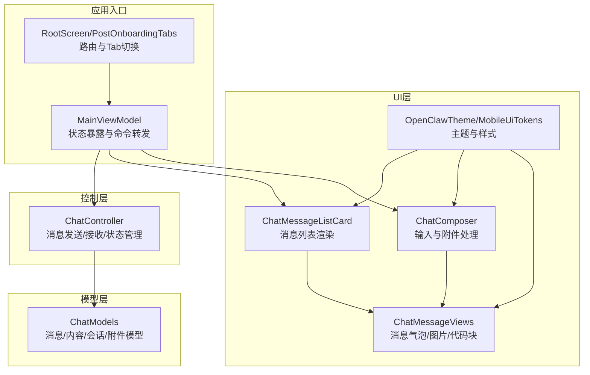
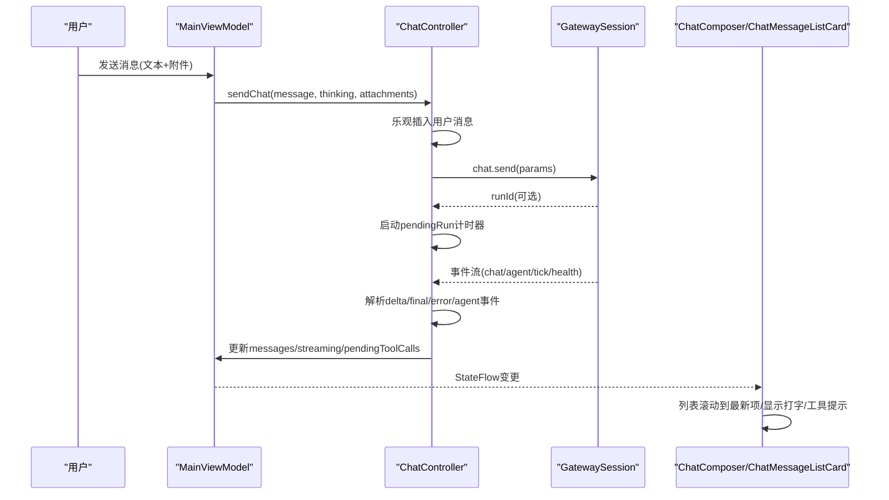
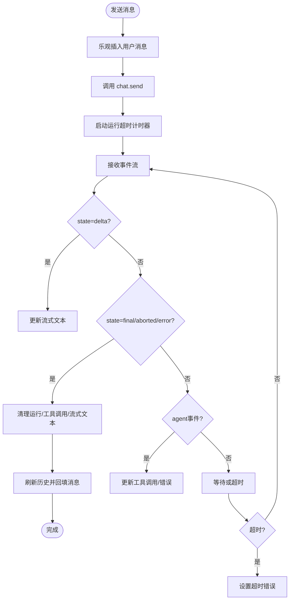
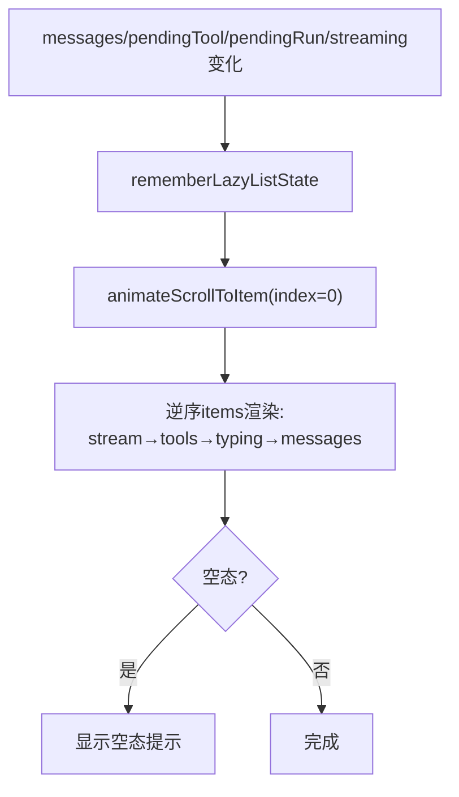
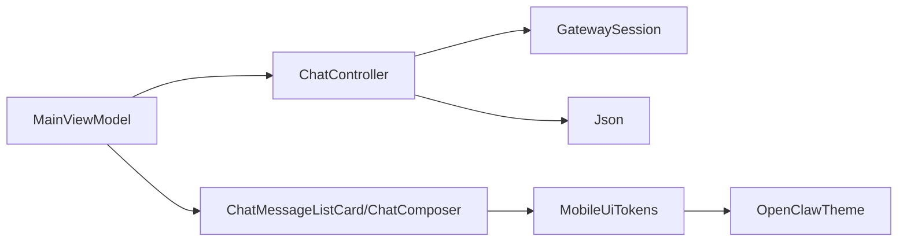

# 聊天界面

<cite>
**本文档引用的文件**
- [ChatController.kt](file://apps/android/app/src/main/java/ai/openclaw/app/chat/ChatController.kt)
- [ChatModels.kt](file://apps/android/app/src/main/java/ai/openclaw/app/chat/ChatModels.kt)
- [ChatComposer.kt](file://apps/android/app/src/main/java/ai/openclaw/app/ui/chat/ChatComposer.kt)
- [ChatMessageListCard.kt](file://apps/android/app/src/main/java/ai/openclaw/app/ui/chat/ChatMessageListCard.kt)
- [ChatMessageViews.kt](file://apps/android/app/src/main/java/ai/openclaw/app/ui/chat/ChatMessageViews.kt)
- [OpenClawTheme.kt](file://apps/android/app/src/main/java/ai/openclaw/app/ui/OpenClawTheme.kt)
- [MobileUiTokens.kt](file://apps/android/app/src/main/java/ai/openclaw/app/ui/MobileUiTokens.kt)
- [MainActivity.kt](file://apps/android/app/src/main/java/ai/openclaw/app/MainActivity.kt)
- [MainViewModel.kt](file://apps/android/app/src/main/java/ai/openclaw/app/MainViewModel.kt)
- [RootScreen.kt](file://apps/android/app/src/main/java/ai/openclaw/app/ui/RootScreen.kt)
- [PostOnboardingTabs.kt](file://apps/android/app/src/main/java/ai/openclaw/app/ui/PostOnboardingTabs.kt)
- [ChatSheet.kt](file://apps/android/app/src/main/java/ai/openclaw/app/ui/ChatSheet.kt)
</cite>

## 目录
1. [简介](#简介)
2. [项目结构](#项目结构)
3. [核心组件](#核心组件)
4. [架构总览](#架构总览)
5. [详细组件分析](#详细组件分析)
6. [依赖关系分析](#依赖关系分析)
7. [性能考虑](#性能考虑)
8. [故障排查指南](#故障排查指南)
9. [结论](#结论)
10. [附录](#附录)

## 简介
本文件面向OpenClaw Android节点的聊天界面，系统性阐述其设计架构与实现细节，覆盖消息渲染、输入与附件处理、多媒体展示、主题与布局配置、消息状态管理、离线与同步机制，以及无障碍、手势与键盘快捷键支持。目标是帮助开发者与产品人员快速理解并扩展该聊天界面。

## 项目结构
Android聊天界面由三层协作构成：
- 控制层：负责与网关通信、事件解析、状态管理（ChatController）
- 模型层：定义消息、内容、会话等数据结构（ChatModels）
- UI层：Compose组件实现消息列表、输入区、工具调用提示、主题与样式（ChatMessageListCard、ChatComposer、ChatMessageViews、OpenClawTheme、MobileUiTokens）

图表来源
- [ChatController.kt:21-520](file://apps/android/app/src/main/java/ai/openclaw/app/chat/ChatController.kt#L21-L520)
- [ChatModels.kt:3-44](file://apps/android/app/src/main/java/ai/openclaw/app/chat/ChatModels.kt#L3-L44)
- [ChatMessageListCard.kt:26-109](file://apps/android/app/src/main/java/ai/openclaw/app/ui/chat/ChatMessageListCard.kt#L26-L109)
- [ChatComposer.kt:61-211](file://apps/android/app/src/main/java/ai/openclaw/app/ui/chat/ChatComposer.kt#L61-L211)
- [ChatMessageViews.kt:55-300](file://apps/android/app/src/main/java/ai/openclaw/app/ui/chat/ChatMessageViews.kt#L55-L300)
- [OpenClawTheme.kt:11-33](file://apps/android/app/src/main/java/ai/openclaw/app/ui/OpenClawTheme.kt#L11-L33)
- [MobileUiTokens.kt:12-107](file://apps/android/app/src/main/java/ai/openclaw/app/ui/MobileUiTokens.kt#L12-L107)
- [MainViewModel.kt:13-202](file://apps/android/app/src/main/java/ai/openclaw/app/MainViewModel.kt#L13-L202)
- [RootScreen.kt:10-21](file://apps/android/app/src/main/java/ai/openclaw/app/ui/RootScreen.kt#L10-L21)
- [PostOnboardingTabs.kt:68-132](file://apps/android/app/src/main/java/ai/openclaw/app/ui/PostOnboardingTabs.kt#L68-L132)

章节来源
- [RootScreen.kt:10-21](file://apps/android/app/src/main/java/ai/openclaw/app/ui/RootScreen.kt#L10-L21)
- [PostOnboardingTabs.kt:68-132](file://apps/android/app/src/main/java/ai/openclaw/app/ui/PostOnboardingTabs.kt#L68-L132)
- [ChatSheet.kt:7-11](file://apps/android/app/src/main/java/ai/openclaw/app/ui/ChatSheet.kt#L7-L11)

## 核心组件
- ChatController：负责与网关会话交互、消息历史拉取、事件流处理、思考级别设置、运行超时与中止、工具调用挂起状态维护。
- ChatModels：定义消息、消息内容（文本/多媒体）、待执行工具调用、会话条目、历史结构与出站附件。
- ChatMessageListCard：基于LazyColumn逆序渲染，自动滚动至最新消息；支持实时流式文本、工具调用提示、打字指示器与空态提示。
- ChatComposer：输入框、思考级别下拉菜单、附件选择与移除、刷新/中止按钮、发送按钮启用逻辑与加载态。
- ChatMessageViews：消息气泡容器、文本渲染（含Markdown）、图片（Base64解码显示）、代码块、工具调用列表、打字指示点阵动画。
- 主题与样式：OpenClawTheme动态色板与overlay颜色；MobileUiTokens集中定义色彩、字体家族与排版样式。

章节来源
- [ChatController.kt:21-520](file://apps/android/app/src/main/java/ai/openclaw/app/chat/ChatController.kt#L21-L520)
- [ChatModels.kt:3-44](file://apps/android/app/src/main/java/ai/openclaw/app/chat/ChatModels.kt#L3-L44)
- [ChatMessageListCard.kt:26-109](file://apps/android/app/src/main/java/ai/openclaw/app/ui/chat/ChatMessageListCard.kt#L26-L109)
- [ChatComposer.kt:61-211](file://apps/android/app/src/main/java/ai/openclaw/app/ui/chat/ChatComposer.kt#L61-L211)
- [ChatMessageViews.kt:55-300](file://apps/android/app/src/main/java/ai/openclaw/app/ui/chat/ChatMessageViews.kt#L55-L300)
- [OpenClawTheme.kt:11-33](file://apps/android/app/src/main/java/ai/openclaw/app/ui/OpenClawTheme.kt#L11-L33)
- [MobileUiTokens.kt:12-107](file://apps/android/app/src/main/java/ai/openclaw/app/ui/MobileUiTokens.kt#L12-L107)

## 架构总览
聊天界面采用“状态驱动”的Compose架构：MainViewModel将底层NodeRuntime的状态通过StateFlow暴露给UI；ChatController在后台通过GatewaySession与后端交互，解析事件流并更新消息与状态；UI层根据状态组合渲染消息列表、输入区与工具提示。

图表来源
- [MainViewModel.kt:199-201](file://apps/android/app/src/main/java/ai/openclaw/app/MainViewModel.kt#L199-L201)
- [ChatController.kt:112-204](file://apps/android/app/src/main/java/ai/openclaw/app/chat/ChatController.kt#L112-L204)
- [ChatMessageListCard.kt:38-40](file://apps/android/app/src/main/java/ai/openclaw/app/ui/chat/ChatMessageListCard.kt#L38-L40)
- [ChatComposer.kt:77-78](file://apps/android/app/src/main/java/ai/openclaw/app/ui/chat/ChatComposer.kt#L77-L78)

## 详细组件分析

### ChatController：消息状态与事件处理
- 状态字段
  - 会话键、会话ID、消息列表、错误文本、健康状态、思考级别、待执行运行数、流式助手文本、待执行工具调用集合、会话列表。
- 关键流程
  - 加载与刷新：bootstrap拉取历史、设置思考级别、轮询健康、列出会话。
  - 发送消息：乐观插入用户消息，启动运行超时，调用chat.send，必要时以实际runId替换。
  - 事件处理：chat事件(delta/final/aborted/error)与agent事件(assistant/tool/error)分别更新消息、流式文本、工具调用与错误。
  - 健康与中断：tick轮询健康，seqGap提示刷新，断连清理状态。
  - 中止：向后端广播chat.abort。
- 超时与幂等
  - 使用UUID生成idempotencyKey，pendingRunTimeoutMs内未完成则报错并清理。

图表来源
- [ChatController.kt:112-204](file://apps/android/app/src/main/java/ai/openclaw/app/chat/ChatController.kt#L112-L204)
- [ChatController.kt:228-397](file://apps/android/app/src/main/java/ai/openclaw/app/chat/ChatController.kt#L228-L397)
- [ChatController.kt:419-451](file://apps/android/app/src/main/java/ai/openclaw/app/chat/ChatController.kt#L419-L451)

章节来源
- [ChatController.kt:21-520](file://apps/android/app/src/main/java/ai/openclaw/app/chat/ChatController.kt#L21-L520)

### ChatModels：数据结构与序列化
- ChatMessage：消息ID、角色、内容数组、时间戳。
- ChatMessageContent：内容类型（text/base64）、文本、MIME、文件名、Base64内容。
- ChatPendingToolCall：工具调用ID、名称、参数、开始时间、错误标记。
- ChatSessionEntry：会话键、更新时间、显示名。
- ChatHistory：会话键、会话ID、思考级别、消息列表。
- OutgoingAttachment：出站附件（类型、MIME、文件名、Base64）。

章节来源
- [ChatModels.kt:3-44](file://apps/android/app/src/main/java/ai/openclaw/app/chat/ChatModels.kt#L3-L44)

### ChatMessageListCard：消息列表渲染与滚动
- 逆序布局：index 0位于底部，先渲染最新消息。
- 渲染顺序：流式文本 → 工具调用 → 打字指示 → 消息列表（从新到旧）。
- 自动滚动：LaunchedEffect监听消息/工具/流式文本变化，滚动至顶部。
- 空态提示：无消息且无运行/工具/流式文本时显示提示卡片。

图表来源
- [ChatMessageListCard.kt:38-80](file://apps/android/app/src/main/java/ai/openclaw/app/ui/chat/ChatMessageListCard.kt#L38-L80)

章节来源
- [ChatMessageListCard.kt:26-109](file://apps/android/app/src/main/java/ai/openclaw/app/ui/chat/ChatMessageListCard.kt#L26-L109)

### ChatComposer：输入与附件处理
- 输入区：多行文本框，占位符、最大行数、边框与容器颜色。
- 思考级别：下拉菜单（off/low/medium/high），当前值带勾选标识。
- 附件：横向滚动附件条，每个附件显示文件名与移除按钮。
- 按钮区：刷新、中止、发送；发送按钮启用条件为无运行、有文本或附件、网关健康。
- 发送流程：清空输入、触发发送回调；发送busy时显示圆形进度指示。

章节来源
- [ChatComposer.kt:61-211](file://apps/android/app/src/main/java/ai/openclaw/app/ui/chat/ChatComposer.kt#L61-L211)

### ChatMessageViews：消息气泡与多媒体
- 气泡样式：按角色(user/system/assistant)区分对齐、容器色、边框色、角色标签色。
- 文本渲染：Markdown解析与代码块高亮。
- 图片展示：Base64解码后显示，失败时显示“不支持的附件”提示。
- 工具调用：解析工具显示注册表，最多展示前6个，超出显示“+N更多”。
- 打字指示：三点脉冲动画。

章节来源
- [ChatMessageViews.kt:55-300](file://apps/android/app/src/main/java/ai/openclaw/app/ui/chat/ChatMessageViews.kt#L55-L300)

### 主题与布局配置
- OpenClawTheme：根据系统深浅模式选择动态色板，并提供overlay颜色与图标色辅助函数。
- MobileUiTokens：集中定义背景渐变、表面色、边框色、文本色、强调色、代码块配色、字体家族与标题/正文/标注等排版样式。

章节来源
- [OpenClawTheme.kt:11-33](file://apps/android/app/src/main/java/ai/openclaw/app/ui/OpenClawTheme.kt#L11-L33)
- [MobileUiTokens.kt:12-107](file://apps/android/app/src/main/java/ai/openclaw/app/ui/MobileUiTokens.kt#L12-L107)

### 应用集成与路由
- MainActivity：设置Compose内容、开启前台服务、保持屏幕常亮控制。
- RootScreen：引导完成后进入PostOnboardingTabs。
- PostOnboardingTabs：底部导航，Chat页集成ChatSheet。
- ChatSheet：包装ChatSheetContent，作为路由占位。

章节来源
- [MainActivity.kt:18-64](file://apps/android/app/src/main/java/ai/openclaw/app/MainActivity.kt#L18-L64)
- [RootScreen.kt:10-21](file://apps/android/app/src/main/java/ai/openclaw/app/ui/RootScreen.kt#L10-L21)
- [PostOnboardingTabs.kt:68-132](file://apps/android/app/src/main/java/ai/openclaw/app/ui/PostOnboardingTabs.kt#L68-L132)
- [ChatSheet.kt:7-11](file://apps/android/app/src/main/java/ai/openclaw/app/ui/ChatSheet.kt#L7-L11)

## 依赖关系分析
- 控制层依赖：GatewaySession（请求/订阅）、Json（解析）、CoroutineScope（异步）。
- UI层依赖：MainViewModel（状态收集）、Compose（状态与渲染）、工具显示注册表（工具展示）。
- 主题依赖：Material3动态色板、自定义tokens。

图表来源
- [MainViewModel.kt:64-74](file://apps/android/app/src/main/java/ai/openclaw/app/MainViewModel.kt#L64-L74)
- [ChatController.kt:21-26](file://apps/android/app/src/main/java/ai/openclaw/app/chat/ChatController.kt#L21-L26)
- [ChatMessageListCard.kt:18-24](file://apps/android/app/src/main/java/ai/openclaw/app/ui/chat/ChatMessageListCard.kt#L18-L24)
- [ChatComposer.kt:36-60](file://apps/android/app/src/main/java/ai/openclaw/app/ui/chat/ChatComposer.kt#L36-L60)
- [OpenClawTheme.kt:11-18](file://apps/android/app/src/main/java/ai/openclaw/app/ui/OpenClawTheme.kt#L11-L18)
- [MobileUiTokens.kt:12-45](file://apps/android/app/src/main/java/ai/openclaw/app/ui/MobileUiTokens.kt#L12-L45)

## 性能考虑
- 列表渲染
  - 使用逆序LazyColumn减少重排成本；仅在关键状态变化时滚动至顶部。
- 事件处理
  - 仅对匹配当前会话键的事件进行处理，避免无关消息干扰。
- 流式文本
  - delta事件仅在发起方运行中生效，避免非本会话流式文本污染。
- 超时与中止
  - 运行超时统一清理，防止悬挂任务占用资源；中止尽力而为，避免阻塞。
- 图片加载
  - Base64解码在UI层进行，建议限制附件大小与数量，避免内存峰值。

## 故障排查指南
- 网关离线
  - 健康检查失败时禁用发送按钮并提示“网关离线”，需先在连接页建立连接。
- 事件流中断
  - 收到seqGap或agent error时提示“事件流中断，请刷新”，并清理待处理运行与工具调用。
- 发送超时
  - 超时后清除运行并提示“等待回复超时，请重试或刷新”。
- 断连处理
  - 断开时清空会话状态、运行计数、工具调用与流式文本，避免残留状态影响后续会话。

章节来源
- [ChatController.kt:64-73](file://apps/android/app/src/main/java/ai/openclaw/app/chat/ChatController.kt#L64-L73)
- [ChatController.kt:228-250](file://apps/android/app/src/main/java/ai/openclaw/app/chat/ChatController.kt#L228-L250)
- [ChatController.kt:327-348](file://apps/android/app/src/main/java/ai/openclaw/app/chat/ChatController.kt#L327-L348)
- [ChatController.kt:419-451](file://apps/android/app/src/main/java/ai/openclaw/app/chat/ChatController.kt#L419-L451)

## 结论
OpenClaw Android聊天界面以状态驱动与事件流为核心，结合Compose高效渲染与Material3动态主题，实现了流畅的消息体验。通过明确的超时与中止策略、工具调用可视化与多媒体展示，兼顾了可用性与可扩展性。后续可在附件压缩、Markdown渲染优化与无障碍增强方面进一步完善。

## 附录

### 消息状态管理与同步机制
- 状态来源
  - 历史消息：chat.history返回messages与sessionId/thinkingLevel。
  - 实时事件：chat事件（delta/final/aborted/error）与agent事件（assistant/tool/error）。
- 同步策略
  - 首次加载后定期轮询健康；事件到达时优先更新；最终以历史刷新保证一致性。
- 幂等与超时
  - 以runId与idempotencyKey确保重复事件不重复处理；超时清理并提示。

章节来源
- [ChatController.kt:252-278](file://apps/android/app/src/main/java/ai/openclaw/app/chat/ChatController.kt#L252-L278)
- [ChatController.kt:308-349](file://apps/android/app/src/main/java/ai/openclaw/app/chat/ChatController.kt#L308-L349)
- [ChatController.kt:491-502](file://apps/android/app/src/main/java/ai/openclaw/app/chat/ChatController.kt#L491-L502)

### 主题定制、字体与布局配置
- 主题
  - 使用OpenClawTheme包裹根内容，自动适配系统深浅模式。
  - overlayContainerColor/overlayIconColor用于覆盖层容器与图标色。
- 字体与排版
  - MobileUiTokens集中定义字体家族与标题/正文/标注等TextStyle。
- 布局
  - ChatMessageListCard使用逆序LazyColumn与自动滚动；ChatComposer采用网格与分组布局，支持附件横向滚动。

章节来源
- [OpenClawTheme.kt:11-33](file://apps/android/app/src/main/java/ai/openclaw/app/ui/OpenClawTheme.kt#L11-L33)
- [MobileUiTokens.kt:39-107](file://apps/android/app/src/main/java/ai/openclaw/app/ui/MobileUiTokens.kt#L39-L107)
- [ChatMessageListCard.kt:38-49](file://apps/android/app/src/main/java/ai/openclaw/app/ui/chat/ChatMessageListCard.kt#L38-L49)
- [ChatComposer.kt:80-121](file://apps/android/app/src/main/java/ai/openclaw/app/ui/chat/ChatComposer.kt#L80-L121)

### 无障碍、手势与键盘快捷键
- 无障碍
  - 图片内容描述使用MIME类型或“附件”；文本与图标均提供contentDescription。
- 手势
  - 附件条水平滚动；气泡容器点击展开工具详情；下拉菜单选择思考级别。
- 键盘快捷键
  - 输入框支持多行编辑与自动换行；发送按钮在可用时高亮强调。

章节来源
- [ChatMessageViews.kt:245-254](file://apps/android/app/src/main/java/ai/openclaw/app/ui/chat/ChatMessageViews.kt#L245-L254)
- [ChatComposer.kt:135-145](file://apps/android/app/src/main/java/ai/openclaw/app/ui/chat/ChatComposer.kt#L135-L145)
- [ChatComposer.kt:178-210](file://apps/android/app/src/main/java/ai/openclaw/app/ui/chat/ChatComposer.kt#L178-L210)