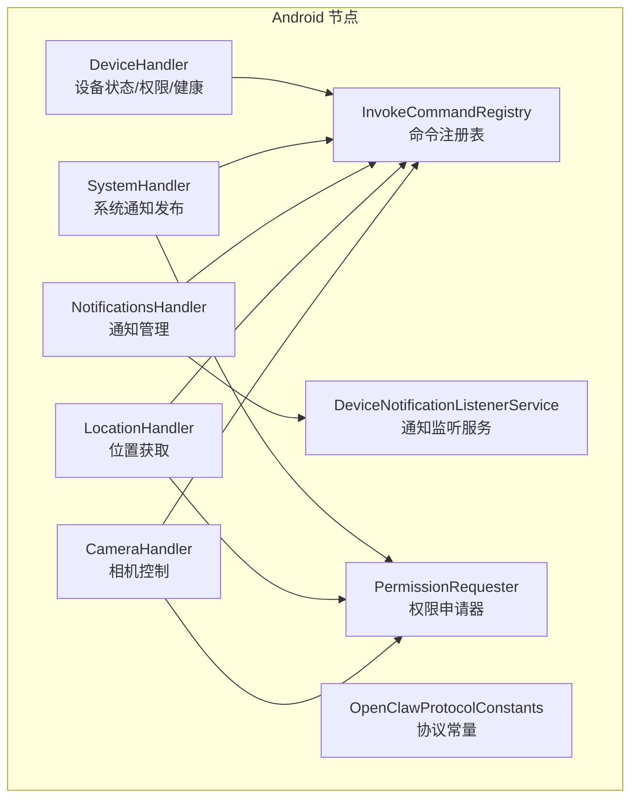
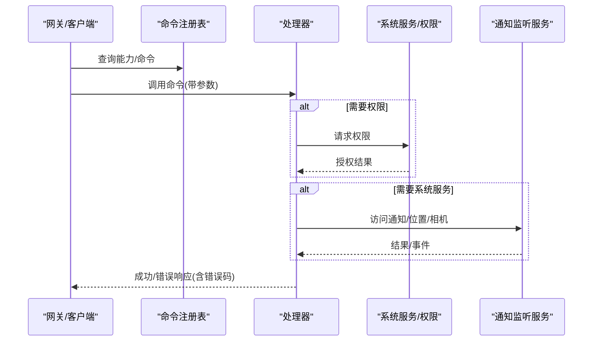
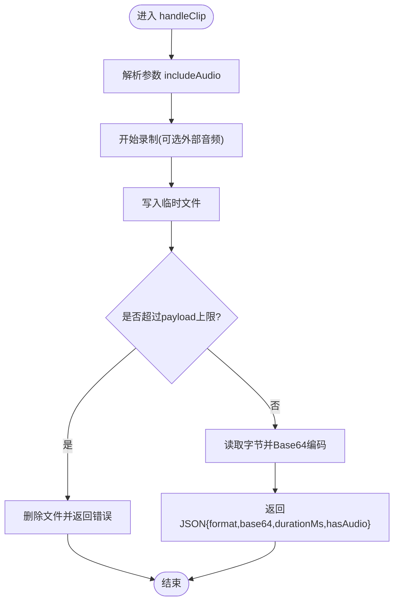
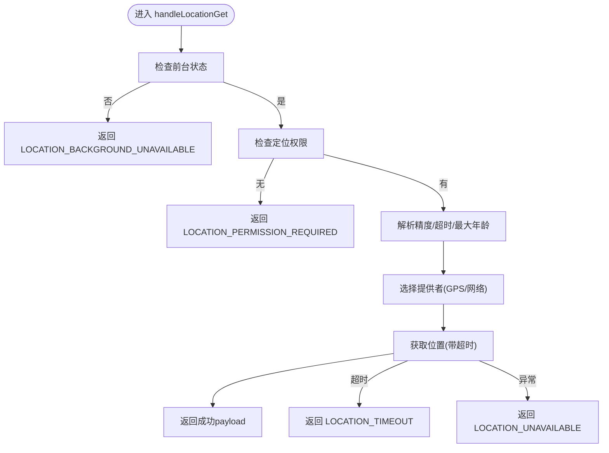
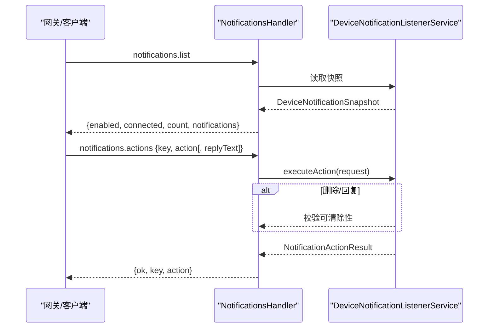
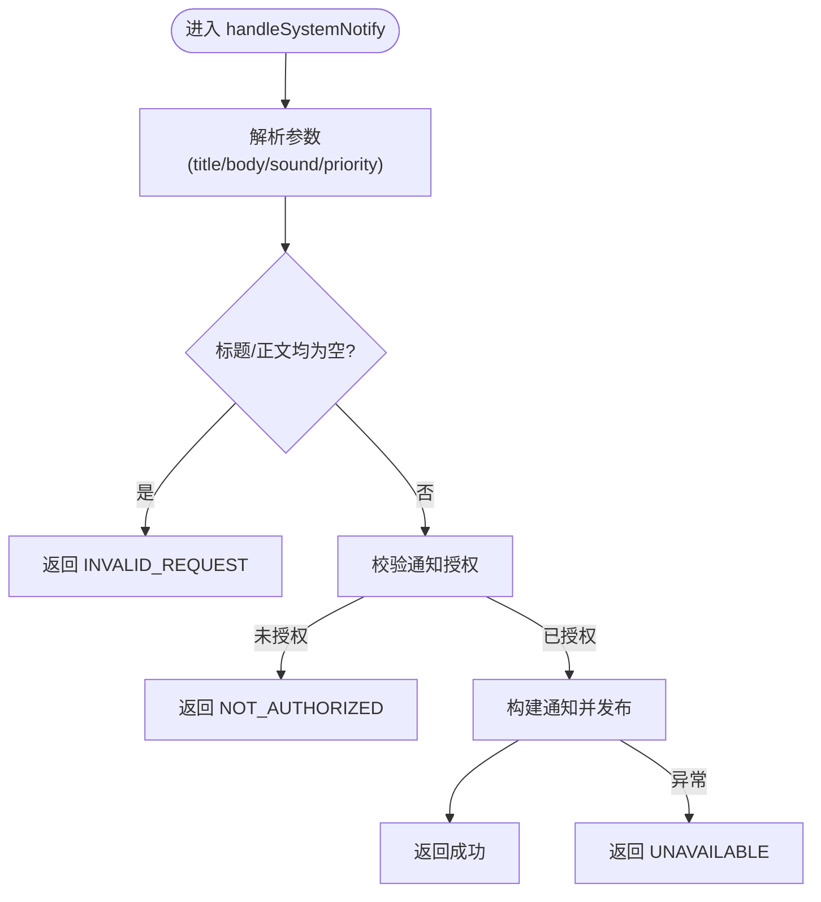
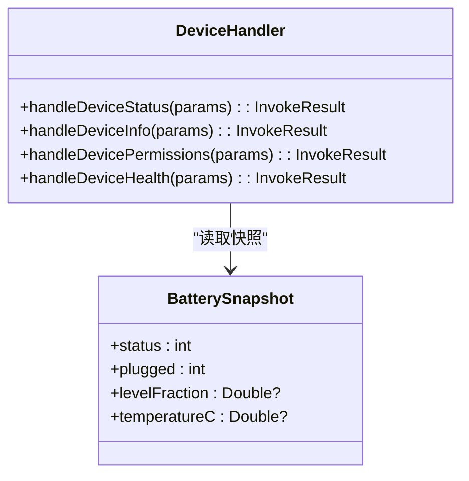
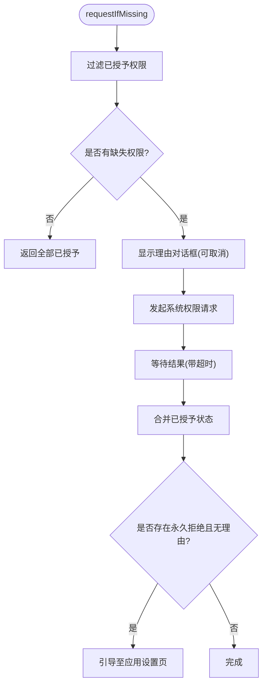
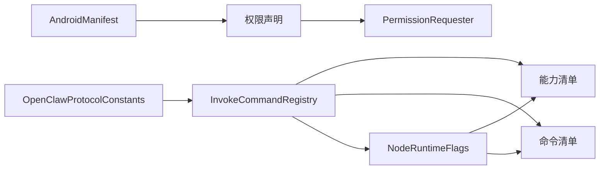

# 设备控制

<cite>
**本文引用的文件**
- [CameraHandler.kt](file://apps/android/app/src/main/java/ai/openclaw/app/node/CameraHandler.kt)
- [LocationHandler.kt](file://apps/android/app/src/main/java/ai/openclaw/app/node/LocationHandler.kt)
- [NotificationsHandler.kt](file://apps/android/app/src/main/java/ai/openclaw/app/node/NotificationsHandler.kt)
- [SystemHandler.kt](file://apps/android/app/src/main/java/ai/openclaw/app/node/SystemHandler.kt)
- [DeviceHandler.kt](file://apps/android/app/src/main/java/ai/openclaw/app/node/DeviceHandler.kt)
- [DeviceNotificationListenerService.kt](file://apps/android/app/src/main/java/ai/openclaw/app/node/DeviceNotificationListenerService.kt)
- [PermissionRequester.kt](file://apps/android/app/src/main/java/ai/openclaw/app/PermissionRequester.kt)
- [InvokeCommandRegistry.kt](file://apps/android/app/src/main/java/ai/openclaw/app/node/InvokeCommandRegistry.kt)
- [OpenClawProtocolConstants.kt](file://apps/android/app/src/main/java/ai/openclaw/app/protocol/OpenClawProtocolConstants.kt)
- [AndroidManifest.xml](file://apps/android/app/src/main/AndroidManifest.xml)
- [DeviceHandlerTest.kt](file://apps/android/app/src/test/java/ai/openclaw/app/node/DeviceHandlerTest.kt)
- [index.md](file://docs/nodes/index.md)
</cite>

## 目录
1. [简介](#简介)
2. [项目结构](#项目结构)
3. [核心组件](#核心组件)
4. [架构总览](#架构总览)
5. [详细组件分析](#详细组件分析)
6. [依赖关系分析](#依赖关系分析)
7. [性能与可靠性](#性能与可靠性)
8. [故障排查指南](#故障排查指南)
9. [结论](#结论)
10. [附录：API与命令规范](#附录api与命令规范)

## 简介
本文件面向OpenClaw Android节点的“设备控制”能力，系统化阐述其如何通过节点侧命令实现对设备级功能的控制与管理，包括：
- 相机控制（设备端拍照、录制视频）
- 位置获取（基于GPS/网络定位）
- 通知管理（读取系统通知、执行打开/删除/回复等动作）
- 系统设置与通知发布（在授权前提下向系统发送通知）
- 设备状态监控（电池、存储、网络、热状态、内存健康等）
- 权限申请流程与安全限制
- 命令执行机制、错误码与响应处理
- 硬件检测与系统兼容性处理
- 安全策略、权限管理与隐私保护

## 项目结构
Android节点位于apps/android/app/src/main/java/ai/openclaw/app/node目录，围绕“处理器（Handler）+ 服务（Service）+ 注册表（Registry）+ 协议常量（Protocol）”组织，职责清晰、边界明确。

图表来源
- [CameraHandler.kt:22-176](file://apps/android/app/src/main/java/ai/openclaw/app/node/CameraHandler.kt#L22-L176)
- [LocationHandler.kt:14-101](file://apps/android/app/src/main/java/ai/openclaw/app/node/LocationHandler.kt#L14-L101)
- [NotificationsHandler.kt:43-162](file://apps/android/app/src/main/java/ai/openclaw/app/node/NotificationsHandler.kt#L43-L162)
- [SystemHandler.kt:100-173](file://apps/android/app/src/main/java/ai/openclaw/app/node/SystemHandler.kt#L100-L173)
- [DeviceHandler.kt:26-399](file://apps/android/app/src/main/java/ai/openclaw/app/node/DeviceHandler.kt#L26-L399)
- [DeviceNotificationListenerService.kt:128-378](file://apps/android/app/src/main/java/ai/openclaw/app/node/DeviceNotificationListenerService.kt#L128-L378)
- [PermissionRequester.kt:22-134](file://apps/android/app/src/main/java/ai/openclaw/app/PermissionRequester.kt#L22-L134)
- [InvokeCommandRegistry.kt:57-235](file://apps/android/app/src/main/java/ai/openclaw/app/node/InvokeCommandRegistry.kt#L57-L235)
- [OpenClawProtocolConstants.kt:3-140](file://apps/android/app/src/main/java/ai/openclaw/app/protocol/OpenClawProtocolConstants.kt#L3-L140)

章节来源
- [InvokeCommandRegistry.kt:57-235](file://apps/android/app/src/main/java/ai/openclaw/app/node/InvokeCommandRegistry.kt#L57-L235)
- [OpenClawProtocolConstants.kt:3-140](file://apps/android/app/src/main/java/ai/openclaw/app/protocol/OpenClawProtocolConstants.kt#L3-L140)

## 核心组件
- 摄像头控制（CameraHandler）
  - 列出设备摄像头、拍照（返回图片）、录制视频（返回mp4 base64，含时长与音频标志）
  - 内置payload大小限制与错误提示
- 位置获取（LocationHandler）
  - 支持精确/粗略定位、超时与最大年龄参数；后台调用受限
- 通知管理（NotificationsHandler + DeviceNotificationListenerService）
  - 列出通知快照、执行打开/删除/回复操作；支持自动重连与状态校验
- 系统通知（SystemHandler）
  - 在授权前提下发布系统通知，按优先级映射渠道
- 设备信息/状态/权限/健康（DeviceHandler）
  - 返回电池/热/存储/网络/运行时长、设备信息、权限状态、内存健康与电源状态
- 权限申请（PermissionRequester）
  - 多权限批量申请、理由说明、引导至系统设置
- 命令注册与协议（InvokeCommandRegistry + OpenClawProtocolConstants）
  - 统一声明可用能力与命令，按运行时条件动态暴露

章节来源
- [CameraHandler.kt:22-176](file://apps/android/app/src/main/java/ai/openclaw/app/node/CameraHandler.kt#L22-L176)
- [LocationHandler.kt:14-101](file://apps/android/app/src/main/java/ai/openclaw/app/node/LocationHandler.kt#L14-L101)
- [NotificationsHandler.kt:43-162](file://apps/android/app/src/main/java/ai/openclaw/app/node/NotificationsHandler.kt#L43-L162)
- [SystemHandler.kt:100-173](file://apps/android/app/src/main/java/ai/openclaw/app/node/SystemHandler.kt#L100-L173)
- [DeviceHandler.kt:26-399](file://apps/android/app/src/main/java/ai/openclaw/app/node/DeviceHandler.kt#L26-L399)
- [PermissionRequester.kt:22-134](file://apps/android/app/src/main/java/ai/openclaw/app/PermissionRequester.kt#L22-L134)
- [InvokeCommandRegistry.kt:57-235](file://apps/android/app/src/main/java/ai/openclaw/app/node/InvokeCommandRegistry.kt#L57-L235)
- [OpenClawProtocolConstants.kt:3-140](file://apps/android/app/src/main/java/ai/openclaw/app/protocol/OpenClawProtocolConstants.kt#L3-L140)

## 架构总览
Android节点通过“命令注册表”对外暴露能力与命令，各处理器负责具体业务逻辑，并在必要时调用系统服务或权限申请器。通知监听服务独立运行，维护通知快照并响应外部动作请求。

图表来源
- [InvokeCommandRegistry.kt:57-235](file://apps/android/app/src/main/java/ai/openclaw/app/node/InvokeCommandRegistry.kt#L57-L235)
- [NotificationsHandler.kt:43-162](file://apps/android/app/src/main/java/ai/openclaw/app/node/NotificationsHandler.kt#L43-L162)
- [DeviceNotificationListenerService.kt:128-378](file://apps/android/app/src/main/java/ai/openclaw/app/node/DeviceNotificationListenerService.kt#L128-L378)
- [PermissionRequester.kt:22-134](file://apps/android/app/src/main/java/ai/openclaw/app/PermissionRequester.kt#L22-L134)

## 详细组件分析

### 相机控制（CameraHandler）
- 功能要点
  - 列出摄像头设备（id/name/朝向/类型）
  - 拍照：触发闪光、HUD提示、返回图片payload
  - 录制：可选包含音频，返回mp4 base64、时长与音频标志；内置payload上限检查
- 错误处理
  - 捕获内部异常并转换为统一错误码与消息
  - payload过大时清理临时文件并返回“负载过大”错误
- 参数解析
  - 解析includeAudio布尔值，支持空/缺失/非布尔时的容错
- HUD与体验
  - 成功/失败/录制中状态的HUD提示

图表来源
- [CameraHandler.kt:96-154](file://apps/android/app/src/main/java/ai/openclaw/app/node/CameraHandler.kt#L96-L154)

章节来源
- [CameraHandler.kt:22-176](file://apps/android/app/src/main/java/ai/openclaw/app/node/CameraHandler.kt#L22-L176)

### 位置获取（LocationHandler）
- 功能要点
  - 后台调用需前台状态；无定位权限直接拒绝
  - 支持精确/粗略/平衡策略，依据系统权限与开关决定实际提供者
  - 可配置maxAgeMs、timeoutMs、desiredAccuracy
- 错误处理
  - 超时返回LOCATION_TIMEOUT
  - 无权限返回LOCATION_PERMISSION_REQUIRED
  - 后台调用返回LOCATION_BACKGROUND_UNAVAILABLE
  - 其他异常返回LOCATION_UNAVAILABLE

图表来源
- [LocationHandler.kt:35-80](file://apps/android/app/src/main/java/ai/openclaw/app/node/LocationHandler.kt#L35-L80)

章节来源
- [LocationHandler.kt:14-101](file://apps/android/app/src/main/java/ai/openclaw/app/node/LocationHandler.kt#L14-L101)

### 通知管理（NotificationsHandler + DeviceNotificationListenerService）
- 功能要点
  - 列出通知快照（启用/连接/数量/列表）
  - 执行动作：打开、删除、回复（需回复文本）
  - 自动重连：当已启用但未连接时触发rebind
- 安全与限制
  - 必须开启系统通知访问；否则返回NOTIFICATIONS_DISABLED
  - 删除/回复受可清除性约束；不可清除的通知禁止删除
- 数据模型
  - DeviceNotificationEntry：键、包名、标题/正文/子文本、分类、渠道、时间戳、是否持续/可清除
  - DeviceNotificationSnapshot：聚合状态与条目列表

图表来源
- [NotificationsHandler.kt:49-116](file://apps/android/app/src/main/java/ai/openclaw/app/node/NotificationsHandler.kt#L49-L116)
- [DeviceNotificationListenerService.kt:257-272](file://apps/android/app/src/main/java/ai/openclaw/app/node/DeviceNotificationListenerService.kt#L257-L272)

章节来源
- [NotificationsHandler.kt:43-162](file://apps/android/app/src/main/java/ai/openclaw/app/node/NotificationsHandler.kt#L43-L162)
- [DeviceNotificationListenerService.kt:128-378](file://apps/android/app/src/main/java/ai/openclaw/app/node/DeviceNotificationListenerService.kt#L128-L378)

### 系统通知发布（SystemHandler）
- 功能要点
  - 解析title/body/sound/priority
  - 创建/复用通知渠道，按优先级映射重要性
  - 发布通知前校验POST_NOTIFICATIONS权限与系统开关
- 错误处理
  - 缺少授权返回NOT_AUTHORIZED
  - 发布失败返回UNAVAILABLE

图表来源
- [SystemHandler.kt:105-138](file://apps/android/app/src/main/java/ai/openclaw/app/node/SystemHandler.kt#L105-L138)

章节来源
- [SystemHandler.kt:100-173](file://apps/android/app/src/main/java/ai/openclaw/app/node/SystemHandler.kt#L100-L173)

### 设备状态/信息/权限/健康（DeviceHandler）
- 功能要点
  - 设备状态：电池状态/电量/省电模式、热状态、存储容量/剩余/使用、网络状态/计费/受限/接口列表、运行时长
  - 设备信息：设备名/型号标识/系统名/版本/应用版本/构建号/语言环境
  - 权限状态：相机/麦克风/位置/短信/通知监听/通知/相册/联系人/日历/运动
  - 健康指标：内存压力/总量/可用/使用/阈值/低内存标记；电池状态/充电类型/温度/电流；Doze/省电；安全补丁级别
- 权限与兼容性
  - 不同Android版本对媒体读取/通知权限的差异处理
  - 网络接口识别（WiFi/蜂窝/以太网/其他）

图表来源
- [DeviceHandler.kt:26-399](file://apps/android/app/src/main/java/ai/openclaw/app/node/DeviceHandler.kt#L26-L399)

章节来源
- [DeviceHandler.kt:26-399](file://apps/android/app/src/main/java/ai/openclaw/app/node/DeviceHandler.kt#L26-L399)
- [DeviceHandlerTest.kt:19-148](file://apps/android/app/src/test/java/ai/openclaw/app/node/DeviceHandlerTest.kt#L19-L148)

### 权限申请（PermissionRequester）
- 功能要点
  - 批量申请多权限，支持理由说明对话框
  - 超时等待与合并结果（已授予视为授予）
  - 对永久拒绝且无理由的情况，引导用户前往系统设置
- 交互流程
  - 若需要理由，先弹窗说明；再发起系统权限请求；最后根据结果引导设置

图表来源
- [PermissionRequester.kt:33-85](file://apps/android/app/src/main/java/ai/openclaw/app/PermissionRequester.kt#L33-L85)

章节来源
- [PermissionRequester.kt:22-134](file://apps/android/app/src/main/java/ai/openclaw/app/PermissionRequester.kt#L22-L134)

## 依赖关系分析
- 命令注册与协议
  - 通过OpenClawProtocolConstants定义命令命名空间与能力枚举
  - InvokeCommandRegistry集中声明所有命令、前台要求与可用性条件（如相机/位置/SMS/语音唤醒/运动）
- 运行时暴露
  - NodeRuntimeFlags驱动能力/命令的动态暴露，确保仅在满足硬件/功能条件下展示
- 清单与权限
  - AndroidManifest声明核心权限（网络、定位、相机、录音、通知、短信、联系人、日历、活动识别等），并绑定通知监听服务

图表来源
- [OpenClawProtocolConstants.kt:3-140](file://apps/android/app/src/main/java/ai/openclaw/app/protocol/OpenClawProtocolConstants.kt#L3-L140)
- [InvokeCommandRegistry.kt:57-235](file://apps/android/app/src/main/java/ai/openclaw/app/node/InvokeCommandRegistry.kt#L57-L235)
- [AndroidManifest.xml:1-77](file://apps/android/app/src/main/AndroidManifest.xml#L1-L77)

章节来源
- [InvokeCommandRegistry.kt:57-235](file://apps/android/app/src/main/java/ai/openclaw/app/node/InvokeCommandRegistry.kt#L57-L235)
- [OpenClawProtocolConstants.kt:3-140](file://apps/android/app/src/main/java/ai/openclaw/app/protocol/OpenClawProtocolConstants.kt#L3-L140)
- [AndroidManifest.xml:1-77](file://apps/android/app/src/main/AndroidManifest.xml#L1-L77)

## 性能与可靠性
- 相机录制
  - 采用IO线程读取文件并Base64编码，避免主线程阻塞
  - payload上限保护，防止超大视频导致网关传输失败
- 位置获取
  - 超时控制与最大年龄过滤，降低无效请求成本
  - 精确度与提供者选择兼顾耗电与成功率
- 通知监听
  - 使用LinkedHashMap维护有序快照，减少遍历成本
  - 连接状态与重连策略保证事件一致性
- 权限申请
  - 超时与理由对话框提升用户体验，避免长时间挂起

[本节为通用性能讨论，不直接分析具体文件]

## 故障排查指南
- 相机/录音
  - 现象：返回“权限不足”或“相机不可用”
  - 排查：确认相机/录音权限已授予；必要时通过PermissionRequester重新申请
- 位置
  - 现象：后台调用失败或无定位结果
  - 排查：确保前台运行；授予定位权限；检查系统定位开关与精确度设置
- 通知
  - 现象：无法列出通知或执行动作失败
  - 排查：确认系统通知访问已开启；若服务未连接，尝试触发rebind；删除/回复受可清除性限制
- 系统通知
  - 现象：发布失败
  - 排查：检查POST_NOTIFICATIONS权限与系统通知总开关
- 设备状态
  - 现象：某些字段缺失或异常
  - 排查：不同Android版本/厂商定制可能影响可用性；参考测试用例验证字段形状

章节来源
- [DeviceHandlerTest.kt:19-148](file://apps/android/app/src/test/java/ai/openclaw/app/node/DeviceHandlerTest.kt#L19-L148)

## 结论
OpenClaw Android节点通过模块化的处理器与统一的命令注册机制，将设备级能力以标准化命令暴露给网关。配合严格的权限申请流程、安全的错误码体系与系统兼容性处理，实现了在隐私与安全前提下的可靠设备控制。建议在生产环境中：
- 明确各命令的前台要求与可用性条件
- 对相机/位置等高敏感能力进行最小化授权
- 建立完善的错误码与日志上报机制
- 在网关侧对命令进行白名单与审批控制

[本节为总结性内容，不直接分析具体文件]

## 附录：API与命令规范

### 命令与能力清单（Android节点）
- 能力
  - canvas、device、notifications、system、camera、sms、voiceWake、location、photos、contacts、calendar、motion
- 命令
  - canvas.present/hide/navigate/eval/snapshot
  - canvas.a2ui.push/pushJSONL/reset
  - system.notify
  - camera.list/snap/clip
  - location.get
  - device.status/info/permissions/health
  - notifications.list/actions
  - photos.latest
  - contacts.search/add
  - calendar.events/add
  - motion.activity/pedometer
  - sms.send（受设备与权限限制）

章节来源
- [OpenClawProtocolConstants.kt:3-140](file://apps/android/app/src/main/java/ai/openclaw/app/protocol/OpenClawProtocolConstants.kt#L3-L140)
- [InvokeCommandRegistry.kt:57-235](file://apps/android/app/src/main/java/ai/openclaw/app/node/InvokeCommandRegistry.kt#L57-L235)
- [index.md:277-301](file://docs/nodes/index.md#L277-L301)

### 命令执行与响应
- 调用方式
  - 通过网关的node.invoke接口下发命令，携带JSON参数
- 成功响应
  - 返回ok=true与对应payload（如设备信息、通知列表、相机拍摄结果等）
- 错误响应
  - 返回ok=false与错误码及消息（如LOCATION_PERMISSION_REQUIRED、LOCATION_TIMEOUT、NOT_AUTHORIZED、PAYLOAD_TOO_LARGE等）

章节来源
- [LocationHandler.kt:35-80](file://apps/android/app/src/main/java/ai/openclaw/app/node/LocationHandler.kt#L35-L80)
- [SystemHandler.kt:105-138](file://apps/android/app/src/main/java/ai/openclaw/app/node/SystemHandler.kt#L105-L138)
- [CameraHandler.kt:96-154](file://apps/android/app/src/main/java/ai/openclaw/app/node/CameraHandler.kt#L96-L154)
- [NotificationsHandler.kt:49-116](file://apps/android/app/src/main/java/ai/openclaw/app/node/NotificationsHandler.kt#L49-L116)

### 权限与清单
- 关键权限
  - INTERNET、ACCESS_NETWORK_STATE、FOREGROUND_SERVICE、POST_NOTIFICATIONS、NEARBY_WIFI_DEVICES、ACCESS_FINE_LOCATION、ACCESS_COARSE_LOCATION、CAMERA、RECORD_AUDIO、SEND_SMS、READ_MEDIA_IMAGES、READ_MEDIA_VISUAL_USER_SELECTED、READ_EXTERNAL_STORAGE（<=32）、READ_CONTACTS、WRITE_CONTACTS、READ_CALENDAR、WRITE_CALENDAR、ACTIVITY_RECOGNITION
- 服务与特性
  - 绑定通知监听服务、FileProvider、前台服务类型等

章节来源
- [AndroidManifest.xml:1-77](file://apps/android/app/src/main/AndroidManifest.xml#L1-L77)