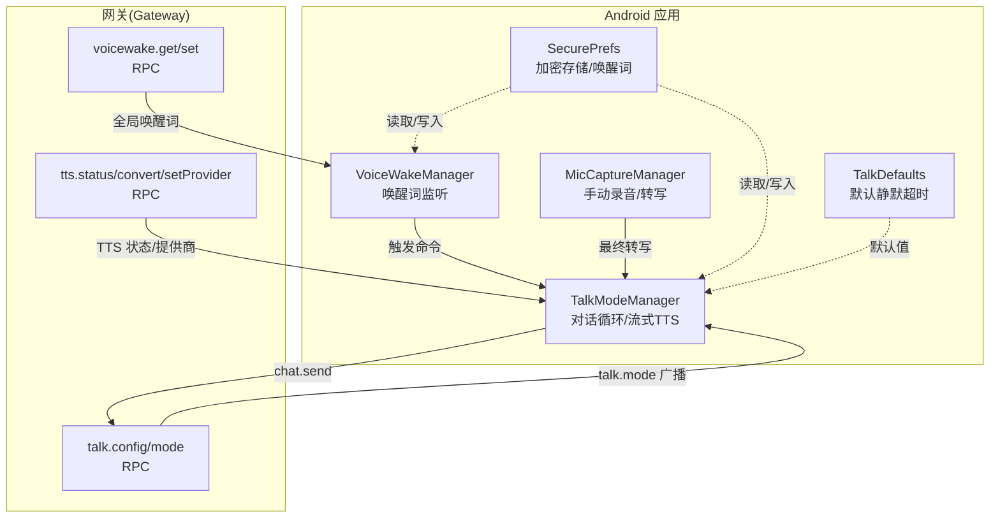
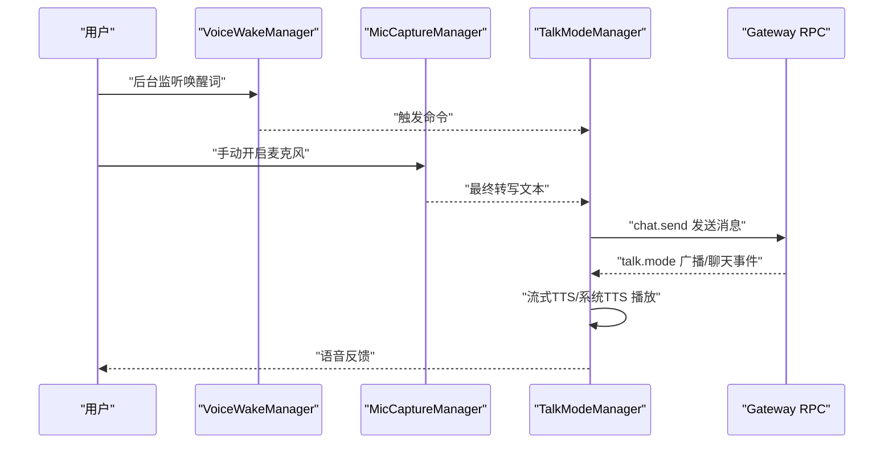
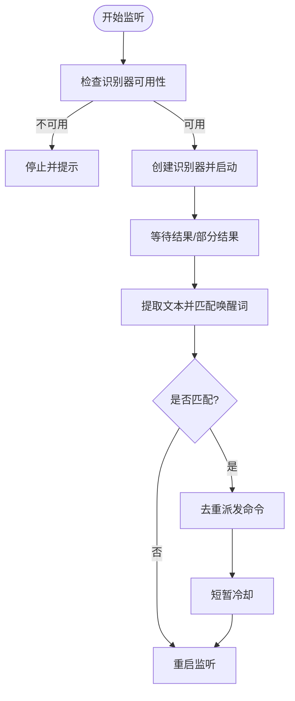
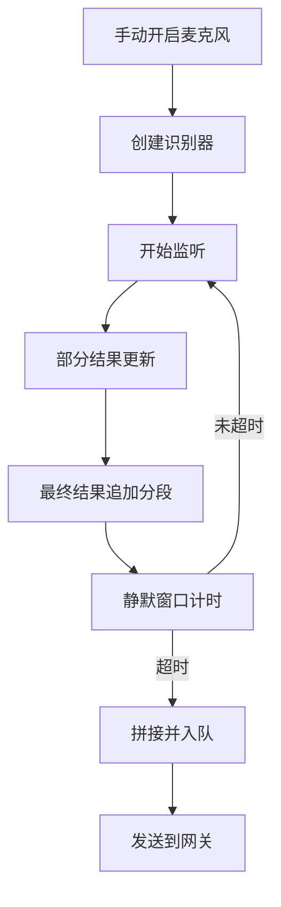
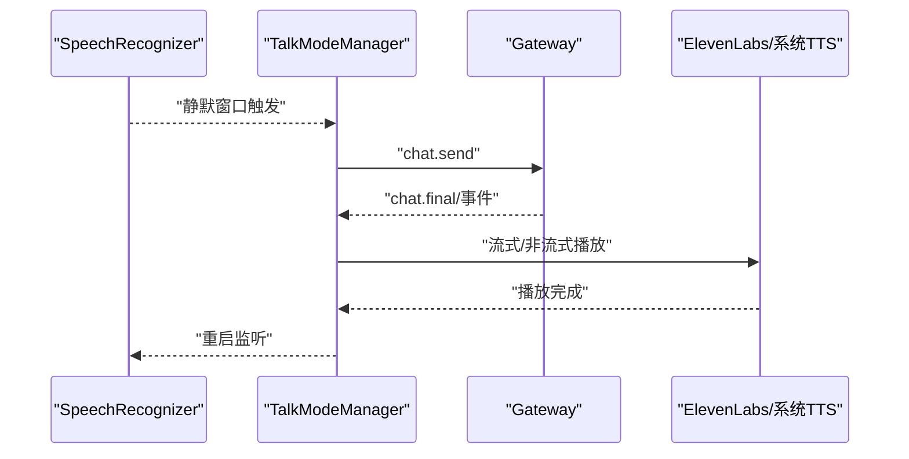
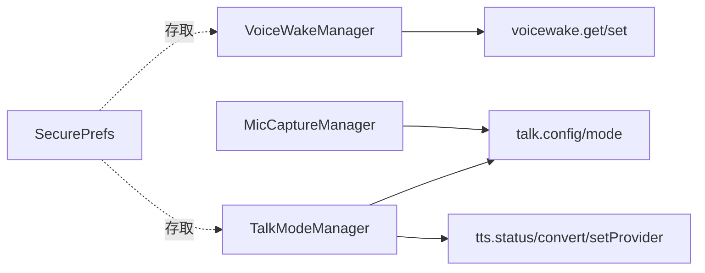

# 语音功能

<cite>
**本文引用的文件**
- [apps/android/app/src/main/java/ai/openclaw/app/voice/VoiceWakeManager.kt](file://apps/android/app/src/main/java/ai/openclaw/app/voice/VoiceWakeManager.kt)
- [apps/android/app/src/main/java/ai/openclaw/app/voice/MicCaptureManager.kt](file://apps/android/app/src/main/java/ai/openclaw/app/voice/MicCaptureManager.kt)
- [apps/android/app/src/main/java/ai/openclaw/app/voice/TalkModeManager.kt](file://apps/android/app/src/main/java/ai/openclaw/app/voice/TalkModeManager.kt)
- [apps/android/app/src/main/java/ai/openclaw/app/voice/TalkDefaults.kt](file://apps/android/app/src/main/java/ai/openclaw/app/voice/TalkDefaults.kt)
- [apps/android/app/src/main/java/ai/openclaw/app/SecurePrefs.kt](file://apps/android/app/src/main/java/ai/openclaw/app/SecurePrefs.kt)
- [src/gateway/server-methods/voicewake.ts](file://src/gateway/server-methods/voicewake.ts)
- [src/gateway/server-methods/talk.ts](file://src/gateway/server-methods/talk.ts)
- [src/gateway/server-methods/tts.ts](file://src/gateway/server-methods/tts.ts)
- [docs/nodes/voicewake.md](file://docs/nodes/voicewake.md)
- [docs/nodes/talk.md](file://docs/nodes/talk.md)
- [docs/tts.md](file://docs/tts.md)
</cite>

## 目录
1. [简介](#简介)
2. [项目结构](#项目结构)
3. [核心组件](#核心组件)
4. [架构总览](#架构总览)
5. [详细组件分析](#详细组件分析)
6. [依赖关系分析](#依赖关系分析)
7. [性能考虑](#性能考虑)
8. [故障排除指南](#故障排除指南)
9. [结论](#结论)
10. [附录](#附录)

## 简介
本文件面向 OpenClaw Android 节点的语音功能，系统性阐述以下能力与实现：
- 语音唤醒：全局唤醒词列表、触发检测与事件广播
- 语音转文本（STT）：手动麦克风采集与分段拼接、静默窗口与发送策略
- 语音合成（TTS）：ElevenLabs 流式播放与系统 TTS 回退、中断与音频焦点管理
- 配置项与参数：唤醒灵敏度、输出格式、静默超时、提供商选择等
- 安全与隐私：加密存储、最小化权限、本地优先与云端回退
- 故障排除与性能优化：常见错误、设备差异与耗电控制

## 项目结构
Android 侧语音功能主要由以下模块组成：
- 唤醒词管理：VoiceWakeManager 负责基于 Android SpeechRecognizer 的持续监听与触发提取
- 语音对话：MicCaptureManager 负责手动录音、分段转写、静默窗口与消息队列；TalkModeManager 负责与网关交互、流式 TTS 播放与中断
- 配置与偏好：SecurePrefs 提供加密存储唤醒词、模式与开关；TalkDefaults 提供默认静默超时
- 网关协议：Gateway 通过 RPC 方法提供唤醒词查询/设置、Talk 模式广播、TTS 状态与转换

图示来源
- [apps/android/app/src/main/java/ai/openclaw/app/voice/VoiceWakeManager.kt:1-174](file://apps/android/app/src/main/java/ai/openclaw/app/voice/VoiceWakeManager.kt#L1-L174)
- [apps/android/app/src/main/java/ai/openclaw/app/voice/MicCaptureManager.kt:1-574](file://apps/android/app/src/main/java/ai/openclaw/app/voice/MicCaptureManager.kt#L1-L574)
- [apps/android/app/src/main/java/ai/openclaw/app/voice/TalkModeManager.kt:1-800](file://apps/android/app/src/main/java/ai/openclaw/app/voice/TalkModeManager.kt#L1-L800)
- [apps/android/app/src/main/java/ai/openclaw/app/SecurePrefs.kt:1-322](file://apps/android/app/src/main/java/ai/openclaw/app/SecurePrefs.kt#L1-L322)
- [src/gateway/server-methods/voicewake.ts:1-35](file://src/gateway/server-methods/voicewake.ts#L1-L35)
- [src/gateway/server-methods/talk.ts:1-97](file://src/gateway/server-methods/talk.ts#L1-L97)
- [src/gateway/server-methods/tts.ts:1-158](file://src/gateway/server-methods/tts.ts#L1-L158)

章节来源
- [apps/android/app/src/main/java/ai/openclaw/app/voice/VoiceWakeManager.kt:1-174](file://apps/android/app/src/main/java/ai/openclaw/app/voice/VoiceWakeManager.kt#L1-L174)
- [apps/android/app/src/main/java/ai/openclaw/app/voice/MicCaptureManager.kt:1-574](file://apps/android/app/src/main/java/ai/openclaw/app/voice/MicCaptureManager.kt#L1-L574)
- [apps/android/app/src/main/java/ai/openclaw/app/voice/TalkModeManager.kt:1-800](file://apps/android/app/src/main/java/ai/openclaw/app/voice/TalkModeManager.kt#L1-L800)
- [apps/android/app/src/main/java/ai/openclaw/app/SecurePrefs.kt:1-322](file://apps/android/app/src/main/java/ai/openclaw/app/SecurePrefs.kt#L1-L322)
- [src/gateway/server-methods/voicewake.ts:1-35](file://src/gateway/server-methods/voicewake.ts#L1-L35)
- [src/gateway/server-methods/talk.ts:1-97](file://src/gateway/server-methods/talk.ts#L1-L97)
- [src/gateway/server-methods/tts.ts:1-158](file://src/gateway/server-methods/tts.ts#L1-L158)

## 核心组件
- 唤醒词管理（VoiceWakeManager）
  - 使用 Android SpeechRecognizer 在后台持续监听，启用部分结果与最大结果数，周期性重启以提升鲁棒性
  - 将识别到的文本交由命令提取器与唤醒词列表匹配，去重后派发命令
  - 错误处理覆盖权限不足、语言不支持、网络异常等场景，并自动重试
- 手动录音与转写（MicCaptureManager）
  - 手动开启/关闭麦克风，使用静默窗口策略在用户停顿后将分段拼接为完整句子
  - 维护会话分段与队列，连接网关后按序发送；对网关事件进行解析并更新会话
  - 对部分结果与最终结果分别处理，避免过早发送
- 对话模式与流式 TTS（TalkModeManager）
  - 启动后创建 SpeechRecognizer，进入“监听→思考→说话”的循环
  - 支持静默窗口触发发送、打断说话（可选）、订阅聊天事件、缓存运行完成状态与文本
  - 流式 TTS：ElevenLabs 按模型能力选择流式或回退模型；系统 TTS 作为兜底
  - 音频焦点管理：播放前申请焦点，丢失时停止 TTS；播放完成后释放
- 配置与偏好（SecurePrefs、TalkDefaults）
  - 加密存储唤醒词、语音唤醒模式、Talk 开关、扬声器开关等
  - 默认静默超时 700ms，可在 Talk 配置中覆盖

章节来源
- [apps/android/app/src/main/java/ai/openclaw/app/voice/VoiceWakeManager.kt:1-174](file://apps/android/app/src/main/java/ai/openclaw/app/voice/VoiceWakeManager.kt#L1-L174)
- [apps/android/app/src/main/java/ai/openclaw/app/voice/MicCaptureManager.kt:1-574](file://apps/android/app/src/main/java/ai/openclaw/app/voice/MicCaptureManager.kt#L1-L574)
- [apps/android/app/src/main/java/ai/openclaw/app/voice/TalkModeManager.kt:1-800](file://apps/android/app/src/main/java/ai/openclaw/app/voice/TalkModeManager.kt#L1-L800)
- [apps/android/app/src/main/java/ai/openclaw/app/voice/TalkDefaults.kt:1-6](file://apps/android/app/src/main/java/ai/openclaw/app/voice/TalkDefaults.kt#L1-L6)
- [apps/android/app/src/main/java/ai/openclaw/app/SecurePrefs.kt:1-322](file://apps/android/app/src/main/java/ai/openclaw/app/SecurePrefs.kt#L1-L322)

## 架构总览
Android 语音功能围绕“手动录音/唤醒词触发 + 网关对话 + 流式 TTS”展开，关键流程如下：

图示来源
- [apps/android/app/src/main/java/ai/openclaw/app/voice/VoiceWakeManager.kt:1-174](file://apps/android/app/src/main/java/ai/openclaw/app/voice/VoiceWakeManager.kt#L1-L174)
- [apps/android/app/src/main/java/ai/openclaw/app/voice/MicCaptureManager.kt:1-574](file://apps/android/app/src/main/java/ai/openclaw/app/voice/MicCaptureManager.kt#L1-L574)
- [apps/android/app/src/main/java/ai/openclaw/app/voice/TalkModeManager.kt:1-800](file://apps/android/app/src/main/java/ai/openclaw/app/voice/TalkModeManager.kt#L1-L800)
- [src/gateway/server-methods/talk.ts:1-97](file://src/gateway/server-methods/talk.ts#L1-L97)

## 详细组件分析

### 唤醒词检测（VoiceWakeManager）
- 实现要点
  - 使用 SpeechRecognizer 创建识别器，设置语言模型为自由形式，启用部分结果与最大结果数
  - 监听 onResults/onPartialResults，取首个候选文本，交由命令提取器与当前唤醒词列表匹配
  - 去重派发后延时重启，避免重复触发与资源占用
  - 错误分支覆盖权限、语言、网络与服务端异常，必要时延迟重试
- 关键行为
  - 触发后状态更新为“已触发”，随后短暂冷却并重启监听
  - 仅在识别可用且未请求停止时工作

图示来源
- [apps/android/app/src/main/java/ai/openclaw/app/voice/VoiceWakeManager.kt:1-174](file://apps/android/app/src/main/java/ai/openclaw/app/voice/VoiceWakeManager.kt#L1-L174)

章节来源
- [apps/android/app/src/main/java/ai/openclaw/app/voice/VoiceWakeManager.kt:1-174](file://apps/android/app/src/main/java/ai/openclaw/app/voice/VoiceWakeManager.kt#L1-L174)
- [docs/nodes/voicewake.md:1-67](file://docs/nodes/voicewake.md#L1-L67)

### 语音转文本（手动录音与静默窗口）
- 实现要点
  - 手动开启麦克风时创建识别器，设置静默窗口参数，积累分段文本并在停顿时拼接
  - onResults 处理最终文本，onPartialResults 更新实时转写；停顿时 scheduleRestart 重启监听
  - 连接网关后按序发送消息，解析 chat 事件更新会话；维护会话条目上限
- 关键行为
  - 静默窗口与最小会话时长参数用于区分自然停顿与结束
  - 权限不足或语言不支持时禁用麦克风并提示

图示来源
- [apps/android/app/src/main/java/ai/openclaw/app/voice/MicCaptureManager.kt:1-574](file://apps/android/app/src/main/java/ai/openclaw/app/voice/MicCaptureManager.kt#L1-L574)

章节来源
- [apps/android/app/src/main/java/ai/openclaw/app/voice/MicCaptureManager.kt:1-574](file://apps/android/app/src/main/java/ai/openclaw/app/voice/MicCaptureManager.kt#L1-L574)
- [docs/nodes/talk.md:1-93](file://docs/nodes/talk.md#L1-L93)

### 语音合成与反馈（TalkModeManager）
- 实现要点
  - 启动后监听用户语音，静默窗口触发后发送 chat.send，等待 chat.final 或历史回退
  - 流式 TTS：根据模型能力选择 ElevenLabs 流式模型，否则回退到 flash 模型；支持文本漂移时重启流式会话
  - 系统 TTS 回退：当缺少 API Key 或语音 ID 时，使用系统 TextToSpeech 播放
  - 中断逻辑：可选“说话时打断”，在 TTS 播放期间监听用户语音，满足条件则停止播放
  - 音频焦点：播放前申请焦点，丢失时停止；播放完成后释放
- 关键行为
  - 缓存运行完成状态与文本，减少轮询 chat.history 的次数
  - 订阅 chat 事件以支持“所有响应 TTS”模式

图示来源
- [apps/android/app/src/main/java/ai/openclaw/app/voice/TalkModeManager.kt:1-800](file://apps/android/app/src/main/java/ai/openclaw/app/voice/TalkModeManager.kt#L1-L800)
- [src/gateway/server-methods/talk.ts:1-97](file://src/gateway/server-methods/talk.ts#L1-L97)
- [src/gateway/server-methods/tts.ts:1-158](file://src/gateway/server-methods/tts.ts#L1-L158)

章节来源
- [apps/android/app/src/main/java/ai/openclaw/app/voice/TalkModeManager.kt:1-800](file://apps/android/app/src/main/java/ai/openclaw/app/voice/TalkModeManager.kt#L1-L800)
- [src/gateway/server-methods/tts.ts:1-158](file://src/gateway/server-methods/tts.ts#L1-L158)
- [docs/tts.md:1-404](file://docs/tts.md#L1-L404)

### 配置与参数
- 唤醒词与模式
  - 全局唤醒词列表由网关持有并广播，Android 侧通过 SecurePrefs 存储与读取
  - 语音唤醒模式枚举：off/foreground/always，默认 foreground
- Talk 模式
  - 静默超时：默认 700ms，可通过配置覆盖
  - 输出格式：Android 支持多种 PCM 采样率；ElevenLabs 可选 mp3_* 强制流式
  - 中断策略：可选“说话时打断”
- TTS 配置
  - 提供商顺序：OpenAI → ElevenLabs → Edge（无 API Key 时默认 Edge）
  - 自动模式：off/always/inbound/tagged；支持摘要阈值与超时
  - 指令覆盖：模型可发出单次 TTS 指令，含 voice/model/speed/stability 等参数

章节来源
- [apps/android/app/src/main/java/ai/openclaw/app/SecurePrefs.kt:1-322](file://apps/android/app/src/main/java/ai/openclaw/app/SecurePrefs.kt#L1-L322)
- [apps/android/app/src/main/java/ai/openclaw/app/voice/TalkDefaults.kt:1-6](file://apps/android/app/src/main/java/ai/openclaw/app/voice/TalkDefaults.kt#L1-L6)
- [docs/nodes/voicewake.md:1-67](file://docs/nodes/voicewake.md#L1-L67)
- [docs/nodes/talk.md:1-93](file://docs/nodes/talk.md#L1-L93)
- [docs/tts.md:1-404](file://docs/tts.md#L1-L404)

## 依赖关系分析
- Android 侧依赖
  - Android SpeechRecognizer：唤醒词与手动录音的核心
  - 网关 RPC：获取/设置唤醒词、Talk 模式广播、TTS 状态与转换
  - 加密存储：SecurePrefs 提供唤醒词与敏感信息的加密保存
- 网关侧依赖
  - 语音唤醒：持久化触发词、广播变更事件
  - Talk 模式：校验参数、广播 talk.mode、限制移动端无节点时禁用
  - TTS：解析配置、选择提供商、执行转换

图示来源
- [src/gateway/server-methods/voicewake.ts:1-35](file://src/gateway/server-methods/voicewake.ts#L1-L35)
- [src/gateway/server-methods/talk.ts:1-97](file://src/gateway/server-methods/talk.ts#L1-L97)
- [src/gateway/server-methods/tts.ts:1-158](file://src/gateway/server-methods/tts.ts#L1-L158)

章节来源
- [src/gateway/server-methods/voicewake.ts:1-35](file://src/gateway/server-methods/voicewake.ts#L1-L35)
- [src/gateway/server-methods/talk.ts:1-97](file://src/gateway/server-methods/talk.ts#L1-L97)
- [src/gateway/server-methods/tts.ts:1-158](file://src/gateway/server-methods/tts.ts#L1-L158)

## 性能考虑
- 识别器生命周期
  - 在 TTS 播放前销毁识别器，避免音频会话冲突与设备特定问题（如 OxygenOS/OnePlus 上 AudioTrack 写入失败）
  - 重启采用延迟调度，降低频繁创建/销毁开销
- 流式 TTS
  - 根据模型能力选择流式，减少首包延迟；文本漂移时重建会话，保证一致性
  - 播放完成后清理资源，避免残留句柄
- 静默窗口与发送策略
  - 合理设置静默窗口与最小会话时长，平衡自然停顿与发送时机
- 音频焦点
  - 播放前后正确申请/释放焦点，避免被系统中断或无声

[本节为通用指导，无需列出具体文件来源]

## 故障排除指南
- 唤醒词无法触发
  - 检查麦克风权限与语言设置；确认唤醒词列表有效且匹配
  - 查看错误码映射：权限不足、语言不支持、网络异常、服务端断开等
- 手动录音无结果
  - 确认已授予 RECORD_AUDIO 权限；检查语言模型与设备支持
  - 关注 ERROR_NO_MATCH/ERROR_SPEECH_TIMEOUT 等错误，适当延长静默窗口
- TTS 不播放或卡住
  - 缺少 ElevenLabs API Key 时自动回退系统 TTS；若系统 TTS 不可用，检查 TextToSpeech 初始化与回调
  - 音频焦点丢失会导致停止播放，需重新申请
- 设备差异问题
  - 某些设备在 TTS 播放期间启动识别器会产生冲突，应避免同时进行
- 网关不可用
  - 当网关未连接时，Talk 模式会提示并自动重启监听；确保节点已连接移动设备

章节来源
- [apps/android/app/src/main/java/ai/openclaw/app/voice/VoiceWakeManager.kt:1-174](file://apps/android/app/src/main/java/ai/openclaw/app/voice/VoiceWakeManager.kt#L1-L174)
- [apps/android/app/src/main/java/ai/openclaw/app/voice/MicCaptureManager.kt:1-574](file://apps/android/app/src/main/java/ai/openclaw/app/voice/MicCaptureManager.kt#L1-L574)
- [apps/android/app/src/main/java/ai/openclaw/app/voice/TalkModeManager.kt:1-800](file://apps/android/app/src/main/java/ai/openclaw/app/voice/TalkModeManager.kt#L1-L800)

## 结论
OpenClaw Android 节点的语音功能以“手动录音 + 网关对话 + 流式 TTS”为核心路径，辅以全局唤醒词与加密存储，兼顾易用性与隐私安全。通过合理的静默窗口、音频焦点与流式播放策略，可在不同设备上获得稳定体验。建议在生产环境中结合设备特性调优静默窗口与提供商策略，并严格管理 API Key 与权限。

[本节为总结性内容，无需列出具体文件来源]

## 附录

### 配置参考（Android）
- 唤醒词与模式
  - 唤醒词列表：加密存储，支持增删改
  - 模式：off/foreground/always，默认 foreground
- Talk 模式
  - 静默超时：默认 700ms，可在配置中覆盖
  - 输出格式：Android 支持多种 PCM；ElevenLabs 可强制 mp3_* 流式
  - 中断策略：可选“说话时打断”
- TTS
  - 提供商顺序：OpenAI → ElevenLabs → Edge
  - 自动模式：off/always/inbound/tagged
  - 指令覆盖：模型可发出单次 TTS 指令，含 voice/model/speed/stability 等

章节来源
- [apps/android/app/src/main/java/ai/openclaw/app/SecurePrefs.kt:1-322](file://apps/android/app/src/main/java/ai/openclaw/app/SecurePrefs.kt#L1-L322)
- [apps/android/app/src/main/java/ai/openclaw/app/voice/TalkDefaults.kt:1-6](file://apps/android/app/src/main/java/ai/openclaw/app/voice/TalkDefaults.kt#L1-L6)
- [docs/nodes/talk.md:1-93](file://docs/nodes/talk.md#L1-L93)
- [docs/tts.md:1-404](file://docs/tts.md#L1-L404)