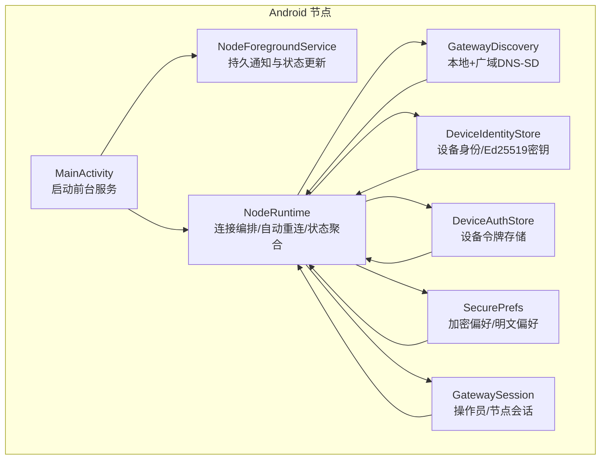
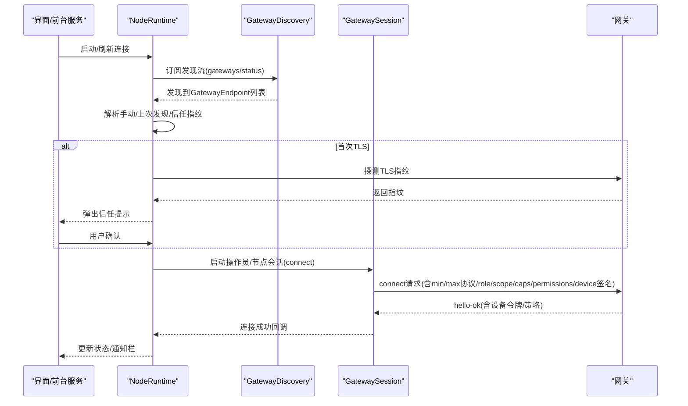
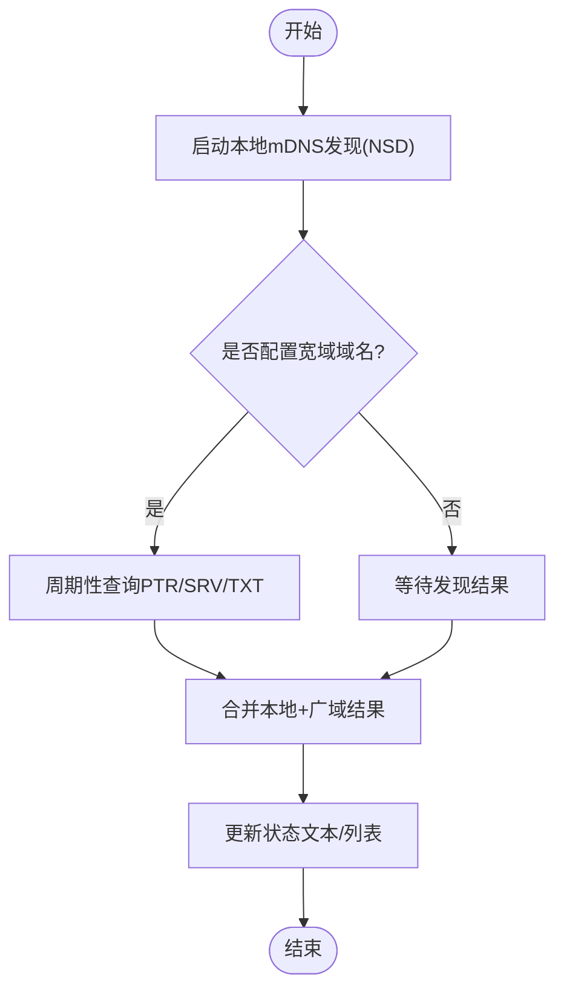
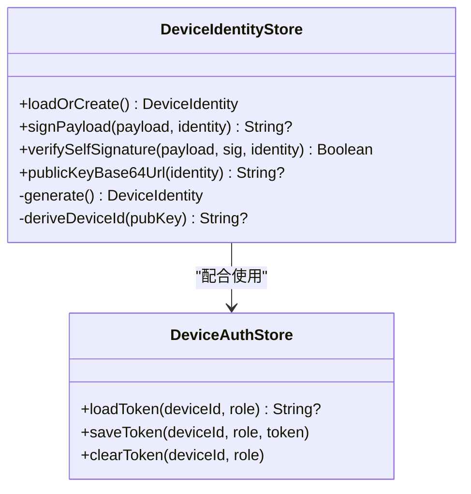
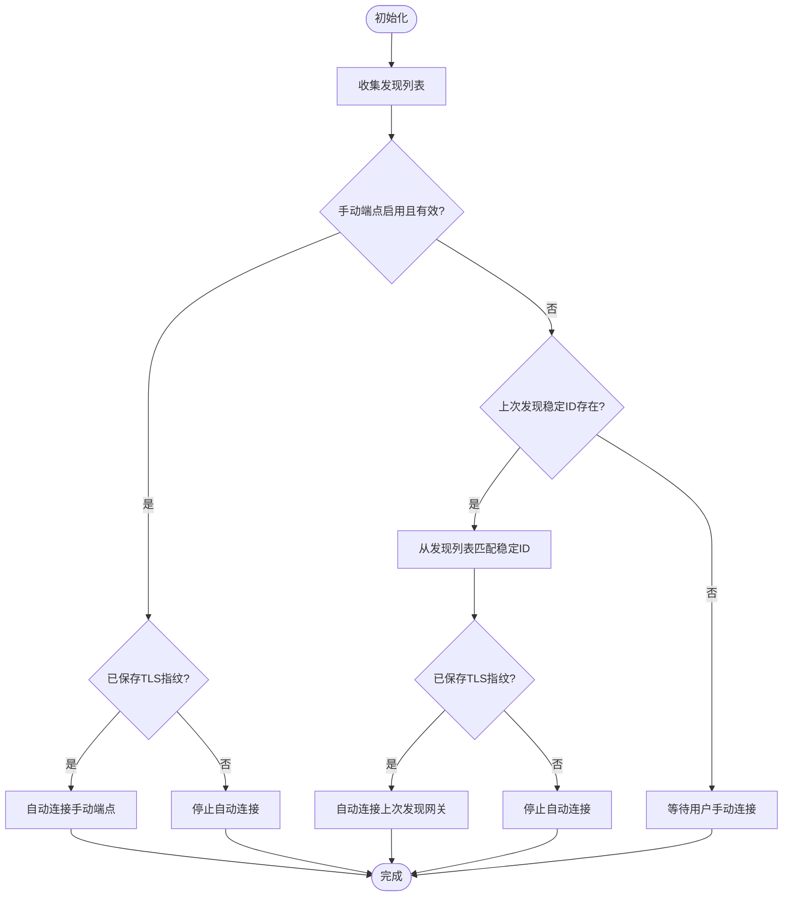
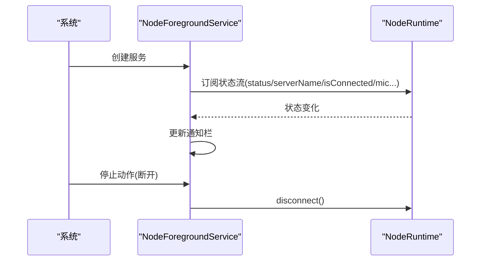
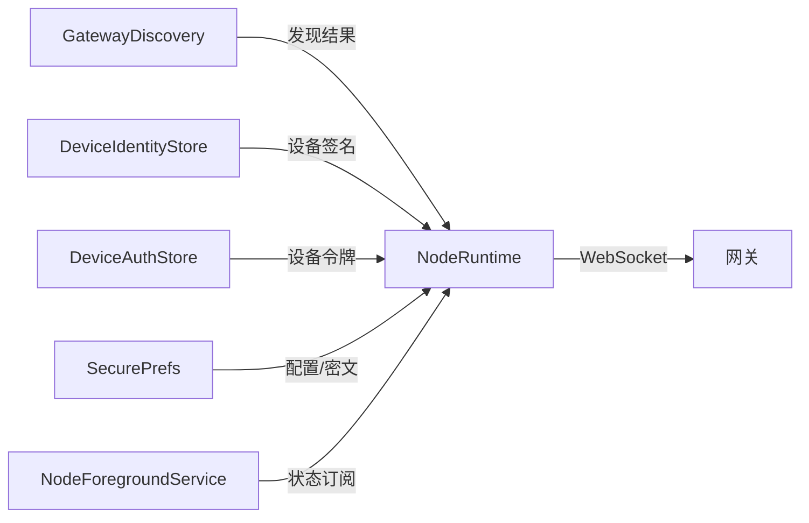

# 连接设置

<cite>
**本文引用的文件**
- [android.md](file://docs/platforms/android.md)
- [protocol.md](file://docs/gateway/protocol.md)
- [bonjour.md](file://docs/gateway/bonjour.md)
- [GatewayDiscovery.kt](file://apps/android/app/src/main/java/ai/openclaw/app/gateway/GatewayDiscovery.kt)
- [BonjourEscapes.kt](file://apps/android/app/src/main/java/ai/openclaw/app/gateway/BonjourEscapes.kt)
- [DeviceAuthStore.kt](file://apps/android/app/src/main/java/ai/openclaw/app/gateway/DeviceAuthStore.kt)
- [DeviceIdentityStore.kt](file://apps/android/app/src/main/java/ai/openclaw/app/gateway/DeviceIdentityStore.kt)
- [NodeRuntime.kt](file://apps/android/app/src/main/java/ai/openclaw/app/NodeRuntime.kt)
- [NodeForegroundService.kt](file://apps/android/app/src/main/java/ai/openclaw/app/NodeForegroundService.kt)
- [SecurePrefs.kt](file://apps/android/app/src/main/java/ai/openclaw/app/SecurePrefs.kt)
- [MainActivity.kt](file://apps/android/app/src/main/java/ai/openclaw/app/MainActivity.kt)
</cite>

## 目录
1. [简介](#简介)
2. [项目结构](#项目结构)
3. [核心组件](#核心组件)
4. [架构总览](#架构总览)
5. [详细组件分析](#详细组件分析)
6. [依赖关系分析](#依赖关系分析)
7. [性能考虑](#性能考虑)
8. [故障排除指南](#故障排除指南)
9. [结论](#结论)
10. [附录](#附录)

## 简介
本文件面向Android节点（Node）的“连接设置”能力，系统性阐述其如何通过Bonjour（mDNS/DNS-SD）发现网关、建立WebSocket连接、完成设备身份与令牌认证，并在不同网络环境下（局域网、Tailscale跨网段、手动直连）实现稳定连接与自动重连。文档同时覆盖连接配置参数、网络与安全策略、重连机制、连接状态监控、网络适配与防火墙穿透、代理配置建议、性能优化与延迟测试方法，以及常见问题排查路径。

## 项目结构
Android节点的连接相关代码主要集中在apps/android/app模块中，围绕以下职责划分：
- 发现层：Bonjour本地与广域（Tailscale）DNS-SD解析
- 认证层：设备身份生成/签名、设备令牌存储与加载
- 会话层：操作员与节点双角色的WebSocket会话管理
- 配置层：加密偏好存储（含TLS指纹、手动端点、令牌等）
- 前台服务：持久通知与连接生命周期管理

图表来源
- [MainActivity.kt:18-64](file://apps/android/app/src/main/java/ai/openclaw/app/MainActivity.kt#L18-L64)
- [NodeForegroundService.kt:20-78](file://apps/android/app/src/main/java/ai/openclaw/app/NodeForegroundService.kt#L20-L78)
- [NodeRuntime.kt:44-136](file://apps/android/app/src/main/java/ai/openclaw/app/NodeRuntime.kt#L44-L136)
- [GatewayDiscovery.kt:47-97](file://apps/android/app/src/main/java/ai/openclaw/app/gateway/GatewayDiscovery.kt#L47-L97)
- [DeviceIdentityStore.kt:18-42](file://apps/android/app/src/main/java/ai/openclaw/app/gateway/DeviceIdentityStore.kt#L18-L42)
- [DeviceAuthStore.kt:10-24](file://apps/android/app/src/main/java/ai/openclaw/app/gateway/DeviceAuthStore.kt#L10-L24)
- [SecurePrefs.kt:18-110](file://apps/android/app/src/main/java/ai/openclaw/app/SecurePrefs.kt#L18-L110)

章节来源
- [android.md:10-165](file://docs/platforms/android.md#L10-L165)
- [NodeRuntime.kt:44-136](file://apps/android/app/src/main/java/ai/openclaw/app/NodeRuntime.kt#L44-L136)

## 核心组件
- Bonjour发现器（GatewayDiscovery）：负责本地mDNS与广域DNS-SD（Wide-Area Bonjour）两类发现，解析TXT记录并构建GatewayEndpoint列表；支持VPN优先网络选择以穿越Tailscale。
- 设备身份与签名（DeviceIdentityStore）：生成Ed25519密钥对，派生设备ID，提供签名/验签能力，用于握手时的身份证明。
- 设备令牌存储（DeviceAuthStore）：按设备ID+角色维度持久化设备令牌，供后续连接复用。
- 连接运行时（NodeRuntime）：编排发现、自动重连、信任提示、双角色会话（operator/node）、状态聚合与UI展示。
- 前台服务（NodeForegroundService）：保持连接常驻，实时更新通知栏状态。
- 加密偏好（SecurePrefs）：管理明文/加密偏好项，如手动主机端口、TLS开关、TLS指纹、网关令牌/密码等。

章节来源
- [GatewayDiscovery.kt:47-97](file://apps/android/app/src/main/java/ai/openclaw/app/gateway/GatewayDiscovery.kt#L47-L97)
- [DeviceIdentityStore.kt:18-42](file://apps/android/app/src/main/java/ai/openclaw/app/gateway/DeviceIdentityStore.kt#L18-L42)
- [DeviceAuthStore.kt:10-24](file://apps/android/app/src/main/java/ai/openclaw/app/gateway/DeviceAuthStore.kt#L10-L24)
- [NodeRuntime.kt:44-136](file://apps/android/app/src/main/java/ai/openclaw/app/NodeRuntime.kt#L44-L136)
- [NodeForegroundService.kt:20-78](file://apps/android/app/src/main/java/ai/openclaw/app/NodeForegroundService.kt#L20-L78)
- [SecurePrefs.kt:18-110](file://apps/android/app/src/main/java/ai/openclaw/app/SecurePrefs.kt#L18-L110)

## 架构总览
Android节点与网关之间的连接链路如下：
- 发现阶段：Bonjour本地（NSD）+ 广域DNS-SD（unicast DNS-SD over Tailscale），解析TXT记录获取网关主机、端口、TLS状态与可选提示信息。
- 连接阶段：NodeRuntime根据发现结果与用户配置，构造TLS参数与连接选项，分别建立操作员与节点两个角色的WebSocket会话。
- 认证阶段：握手前先收到网关挑战（connect.challenge），客户端使用设备身份对挑战进行签名，随connect请求发送，网关验证后发放设备令牌或允许连接。
- 会话阶段：双方基于统一的WebSocket帧模型（req/res/event）进行命令调用与事件推送；节点侧支持A2UI与Canvas交互。

图表来源
- [NodeRuntime.kt:692-732](file://apps/android/app/src/main/java/ai/openclaw/app/NodeRuntime.kt#L692-L732)
- [protocol.md:22-91](file://docs/gateway/protocol.md#L22-L91)
- [GatewayDiscovery.kt:221-293](file://apps/android/app/src/main/java/ai/openclaw/app/gateway/GatewayDiscovery.kt#L221-L293)

章节来源
- [protocol.md:10-126](file://docs/gateway/protocol.md#L10-L126)
- [NodeRuntime.kt:692-732](file://apps/android/app/src/main/java/ai/openclaw/app/NodeRuntime.kt#L692-L732)

## 详细组件分析

### 组件一：Bonjour发现与广域DNS-SD
- 本地发现：使用NSD监听_mDNS服务类型，解析SRV/A/AAAA记录，提取主机、端口、TLS状态与TXT键值（显示名、lanHost、tailnetDns、gatewayPort、gatewayTls、gatewayTlsSha256等）。
- 广域发现：当环境变量指定宽域域名时，周期性查询PTR/SRV/TXT记录，合并结果并更新状态文本。
- 网络选择：优先VPN（Tailscale）网络，否则回退至活动网络；DNS查询通过系统解析器或直接解析器组合执行。
- 实例名解码：对Bonjour实例名中的转义序列进行UTF-8解码，确保显示名正确。

图表来源
- [GatewayDiscovery.kt:99-127](file://apps/android/app/src/main/java/ai/openclaw/app/gateway/GatewayDiscovery.kt#L99-L127)
- [GatewayDiscovery.kt:221-293](file://apps/android/app/src/main/java/ai/openclaw/app/gateway/GatewayDiscovery.kt#L221-L293)

章节来源
- [GatewayDiscovery.kt:47-97](file://apps/android/app/src/main/java/ai/openclaw/app/gateway/GatewayDiscovery.kt#L47-L97)
- [GatewayDiscovery.kt:388-398](file://apps/android/app/src/main/java/ai/openclaw/app/gateway/GatewayDiscovery.kt#L388-L398)
- [GatewayDiscovery.kt:442-463](file://apps/android/app/src/main/java/ai/openclaw/app/gateway/GatewayDiscovery.kt#L442-L463)
- [BonjourEscapes.kt:3-35](file://apps/android/app/src/main/java/ai/openclaw/app/gateway/BonjourEscapes.kt#L3-L35)

### 组件二：设备身份与认证
- 设备身份：生成Ed25519密钥对，公钥派生设备ID，私钥以PKCS#8格式安全存储；提供自签名与验签工具。
- 握手签名：等待网关connect.challenge，使用设备私钥对挑战进行签名，随connect请求发送；同时携带设备ID、时间戳与随机数nonce，确保抗重放。
- 令牌管理：首次配对后网关下发设备令牌，按设备ID+角色维度持久化；后续连接可自动复用。

图表来源
- [DeviceIdentityStore.kt:18-175](file://apps/android/app/src/main/java/ai/openclaw/app/gateway/DeviceIdentityStore.kt#L18-L175)
- [DeviceAuthStore.kt:10-31](file://apps/android/app/src/main/java/ai/openclaw/app/gateway/DeviceAuthStore.kt#L10-L31)

章节来源
- [DeviceIdentityStore.kt:44-77](file://apps/android/app/src/main/java/ai/openclaw/app/gateway/DeviceIdentityStore.kt#L44-L77)
- [DeviceIdentityStore.kt:126-144](file://apps/android/app/src/main/java/ai/openclaw/app/gateway/DeviceIdentityStore.kt#L126-L144)
- [DeviceAuthStore.kt:10-31](file://apps/android/app/src/main/java/ai/openclaw/app/gateway/DeviceAuthStore.kt#L10-L31)
- [protocol.md:200-230](file://docs/gateway/protocol.md#L200-L230)

### 组件三：连接运行时与自动重连
- 自动重连策略：
  - 手动端点启用且TLS指纹已存时，优先自动连接。
  - 否则使用上次发现的稳定ID，仅在已信任（有TLS指纹）的前提下自动连接。
- 双角色会话：同时维护operator与node两套会话，分别上报连接状态、事件与调用分发。
- 状态聚合：综合operator/node状态与服务器名/远端地址，输出统一状态文本与通知栏内容。
- 首次TLS信任：若目标网关要求TLS但无指纹，探测指纹后弹出信任提示，用户确认后保存指纹并重连。

图表来源
- [NodeRuntime.kt:529-587](file://apps/android/app/src/main/java/ai/openclaw/app/NodeRuntime.kt#L529-L587)
- [NodeRuntime.kt:709-732](file://apps/android/app/src/main/java/ai/openclaw/app/NodeRuntime.kt#L709-L732)

章节来源
- [NodeRuntime.kt:529-587](file://apps/android/app/src/main/java/ai/openclaw/app/NodeRuntime.kt#L529-L587)
- [NodeRuntime.kt:709-732](file://apps/android/app/src/main/java/ai/openclaw/app/NodeRuntime.kt#L709-L732)

### 组件四：前台服务与连接状态监控
- 前台服务：启动后持续订阅NodeRuntime的状态流，动态更新通知栏标题与内容，包含连接状态、服务器名、是否正在录音等。
- 生命周期：服务常驻，由NodeRuntime负责实际连接管理；用户可在通知栏一键断开。

图表来源
- [NodeForegroundService.kt:32-56](file://apps/android/app/src/main/java/ai/openclaw/app/NodeForegroundService.kt#L32-L56)
- [NodeForegroundService.kt:59-69](file://apps/android/app/src/main/java/ai/openclaw/app/NodeForegroundService.kt#L59-L69)

章节来源
- [NodeForegroundService.kt:20-78](file://apps/android/app/src/main/java/ai/openclaw/app/NodeForegroundService.kt#L20-L78)
- [MainActivity.kt:50-51](file://apps/android/app/src/main/java/ai/openclaw/app/MainActivity.kt#L50-L51)

### 组件五：配置参数与安全策略
- 明文偏好（Plain）：手动端点开关、主机、端口、TLS开关、上次发现稳定ID、调试开关等。
- 加密偏好（Encrypted）：网关令牌、网关密码、按稳定ID存储的TLS指纹等。
- 安全策略：
  - 自动连接仅在已信任（有TLS指纹）前提下进行，避免被未认证的发现结果引导。
  - 首次TLS连接需用户确认指纹，确认后才保存并继续连接。
  - 设备身份签名必须包含服务器挑战nonce，防止重放攻击。

章节来源
- [SecurePrefs.kt:60-110](file://apps/android/app/src/main/java/ai/openclaw/app/SecurePrefs.kt#L60-L110)
- [SecurePrefs.kt:178-215](file://apps/android/app/src/main/java/ai/openclaw/app/SecurePrefs.kt#L178-L215)
- [NodeRuntime.kt:560-582](file://apps/android/app/src/main/java/ai/openclaw/app/NodeRuntime.kt#L560-L582)
- [NodeRuntime.kt:711-722](file://apps/android/app/src/main/java/ai/openclaw/app/NodeRuntime.kt#L711-L722)

## 依赖关系分析
- 模块内依赖：
  - NodeRuntime依赖GatewayDiscovery、DeviceIdentityStore、DeviceAuthStore、SecurePrefs、NodeForegroundService。
  - GatewayDiscovery依赖系统NSD与DNS解析API，内部封装Bonjour/TXT解析与网络选择逻辑。
  - NodeForegroundService依赖NodeRuntime提供的状态流。
- 外部依赖：
  - 网关协议（WebSocket + JSON帧）与设备认证（connect.challenge + 设备签名）。
  - Bonjour服务类型与TXT键值约定（来自网关侧发布）。

图表来源
- [NodeRuntime.kt:58-60](file://apps/android/app/src/main/java/ai/openclaw/app/NodeRuntime.kt#L58-L60)
- [GatewayDiscovery.kt:58-64](file://apps/android/app/src/main/java/ai/openclaw/app/gateway/GatewayDiscovery.kt#L58-L64)
- [DeviceIdentityStore.kt:18-42](file://apps/android/app/src/main/java/ai/openclaw/app/gateway/DeviceIdentityStore.kt#L18-L42)
- [DeviceAuthStore.kt:10-24](file://apps/android/app/src/main/java/ai/openclaw/app/gateway/DeviceAuthStore.kt#L10-L24)
- [SecurePrefs.kt:18-110](file://apps/android/app/src/main/java/ai/openclaw/app/SecurePrefs.kt#L18-L110)
- [NodeForegroundService.kt:32-56](file://apps/android/app/src/main/java/ai/openclaw/app/NodeForegroundService.kt#L32-L56)

章节来源
- [NodeRuntime.kt:44-136](file://apps/android/app/src/main/java/ai/openclaw/app/NodeRuntime.kt#L44-L136)
- [GatewayDiscovery.kt:47-97](file://apps/android/app/src/main/java/ai/openclaw/app/gateway/GatewayDiscovery.kt#L47-L97)

## 性能考虑
- 发现轮询与解析：
  - 广域DNS-SD采用固定周期轮询（毫秒级延迟），建议在弱网或移动网络下适当降低轮询频率以减少DNS负载。
  - 优先使用VPN网络进行DNS查询，可显著提升跨网段发现成功率。
- 连接建立：
  - 首次TLS指纹探测应限制超时，避免阻塞UI线程；成功后立即弹出信任提示。
  - 自动重连应引入指数退避与抖动，避免风暴式重试。
- 传输与帧处理：
  - WebSocket消息采用JSON文本帧，注意序列化/反序列化开销；批量事件合并与去抖有助于降低CPU占用。
- UI与通知：
  - 通知栏更新应节流，避免频繁刷新导致系统抖动。

## 故障排除指南
- 发现失败
  - 本地mDNS：检查设备是否处于同一局域网，Wi-Fi是否禁用多播；尝试重启网关或设备网络。
  - 广域DNS-SD：确认已配置宽域域名，Tailscale Split DNS已将该域名指向网关DNS；验证PTR/SRV/TXT解析可用。
- 连接失败
  - 协议不匹配：确保客户端min/max协议版本与网关一致；升级客户端或网关。
  - 认证失败：检查connect.challenge是否正确签名；确认设备ID与公钥匹配；核对设备令牌是否过期或被撤销。
  - TLS指纹不匹配：首次连接时务必人工确认指纹；后续连接若指纹变更，需重新确认并更新存储。
- 自动重连无效
  - 检查是否已保存TLS指纹；确认手动端点配置有效；确认上次发现稳定ID是否存在。
- 状态异常
  - 查看前台服务通知栏状态；结合NodeRuntime状态文本定位问题（operator/node离线、连接中、错误原因）。

章节来源
- [bonjour.md:149-177](file://docs/gateway/bonjour.md#L149-L177)
- [protocol.md:191-262](file://docs/gateway/protocol.md#L191-L262)
- [NodeRuntime.kt:560-582](file://apps/android/app/src/main/java/ai/openclaw/app/NodeRuntime.kt#L560-L582)

## 结论
Android节点的连接设置以Bonjour发现为基础，结合设备身份与令牌认证，实现了在局域网、跨网段（Tailscale）与手动直连场景下的稳健连接。通过前台服务与自动重连策略，保证了用户体验的连续性。遵循本文的安全与性能建议，可进一步提升连接稳定性与安全性。

## 附录

### 连接配置参数清单
- 明文偏好（Plain）
  - 手动端点开关、主机、端口、TLS开关
  - 上次发现稳定ID、Canvas调试开关
- 加密偏好（Encrypted）
  - 网关令牌、网关密码
  - 按稳定ID存储的TLS指纹
- 环境变量
  - 宽域域名（用于广域DNS-SD）

章节来源
- [SecurePrefs.kt:60-110](file://apps/android/app/src/main/java/ai/openclaw/app/SecurePrefs.kt#L60-L110)
- [SecurePrefs.kt:207-215](file://apps/android/app/src/main/java/ai/openclaw/app/SecurePrefs.kt#L207-L215)
- [GatewayDiscovery.kt:55-56](file://apps/android/app/src/main/java/ai/openclaw/app/gateway/GatewayDiscovery.kt#L55-L56)

### 网络与安全策略要点
- 发现策略：优先VPN网络；本地与广域发现并行，最终合并展示。
- 自动连接：仅在已信任（有TLS指纹）前提下自动连接，避免被未认证发现引导。
- 首次TLS：探测指纹并弹窗确认，确认后保存指纹并重连。
- 认证：严格遵循connect.challenge签名流程，绑定nonce与设备ID。

章节来源
- [GatewayDiscovery.kt:388-398](file://apps/android/app/src/main/java/ai/openclaw/app/gateway/GatewayDiscovery.kt#L388-L398)
- [NodeRuntime.kt:560-582](file://apps/android/app/src/main/java/ai/openclaw/app/NodeRuntime.kt#L560-L582)
- [NodeRuntime.kt:711-722](file://apps/android/app/src/main/java/ai/openclaw/app/NodeRuntime.kt#L711-L722)
- [protocol.md:200-230](file://docs/gateway/protocol.md#L200-L230)

### 重连机制与状态监控
- 自动重连：手动端点优先；其次上次发现稳定ID；均需满足信任条件。
- 状态聚合：operator/node双状态合并，输出统一文本；通知栏同步展示。
- 断开控制：前台服务提供一键断开入口。

章节来源
- [NodeRuntime.kt:529-587](file://apps/android/app/src/main/java/ai/openclaw/app/NodeRuntime.kt#L529-L587)
- [NodeForegroundService.kt:32-56](file://apps/android/app/src/main/java/ai/openclaw/app/NodeForegroundService.kt#L32-L56)
- [NodeForegroundService.kt:59-69](file://apps/android/app/src/main/java/ai/openclaw/app/NodeForegroundService.kt#L59-L69)

### 网络适配、防火墙穿透与代理
- 局域网：使用本地mDNS；确保多播与DNS解析可用。
- 跨网段：启用Tailscale并配置Split DNS；使用广域DNS-SD；优先VPN网络进行DNS查询。
- 代理：默认不强制代理；若需通过代理访问，应在系统网络层面配置，确保WS/TLS端口可达。

章节来源
- [android.md:64-71](file://docs/platforms/android.md#L64-L71)
- [GatewayDiscovery.kt:388-398](file://apps/android/app/src/main/java/ai/openclaw/app/gateway/GatewayDiscovery.kt#L388-L398)

### 连接性能优化与延迟测试
- 优化建议
  - 降低广域DNS-SD轮询频率；合并事件流；对UI更新进行节流。
  - 首次TLS探测设置合理超时；自动重连引入退避策略。
- 延迟测试
  - 使用网关侧心跳/健康检查接口评估往返时延；对比不同网络（WiFi/蜂窝/Tailscale）下的表现。
  - 在移动设备上模拟弱网与切换场景，观察自动重连与恢复时间。

章节来源
- [protocol.md:166-171](file://docs/gateway/protocol.md#L166-L171)
- [NodeRuntime.kt:529-587](file://apps/android/app/src/main/java/ai/openclaw/app/NodeRuntime.kt#L529-L587)