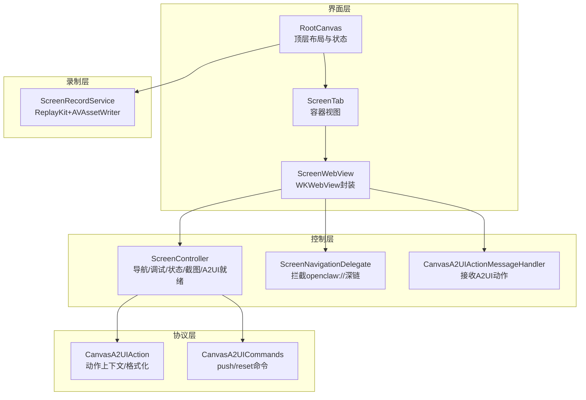
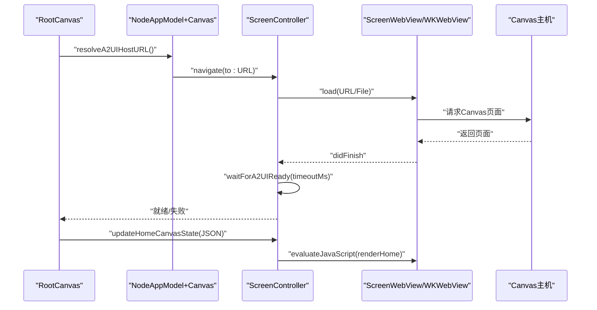
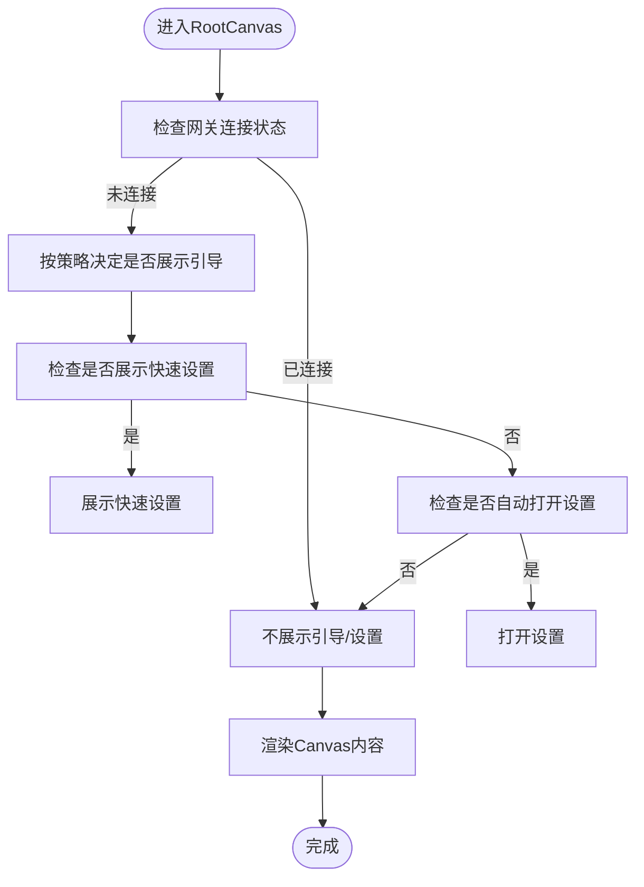
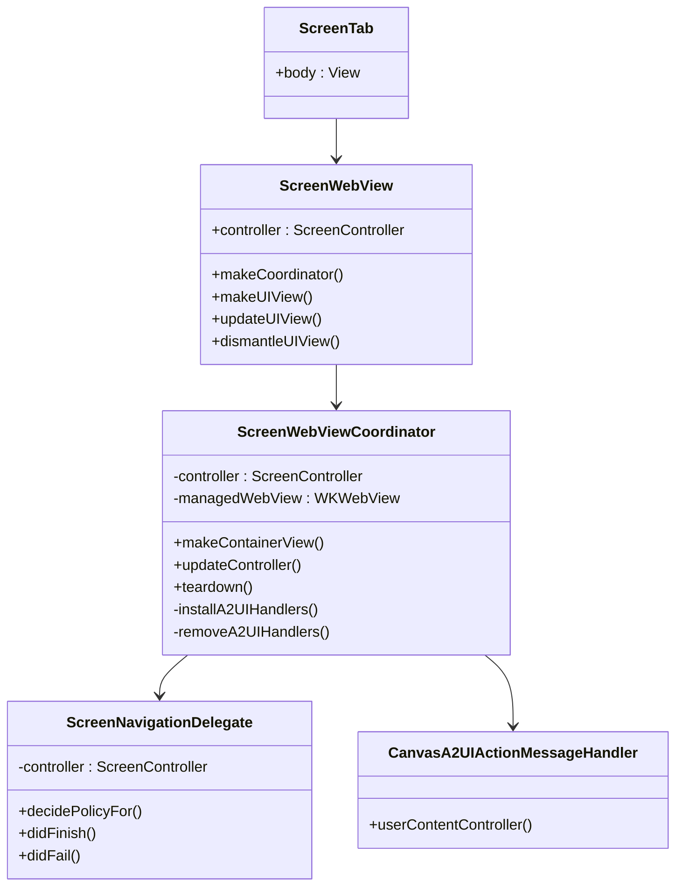
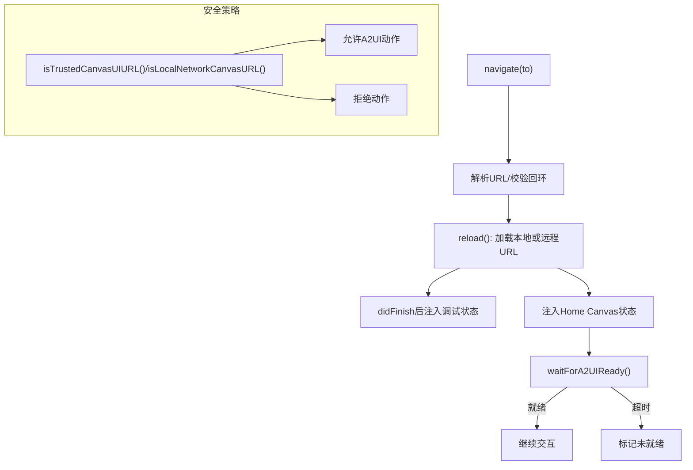
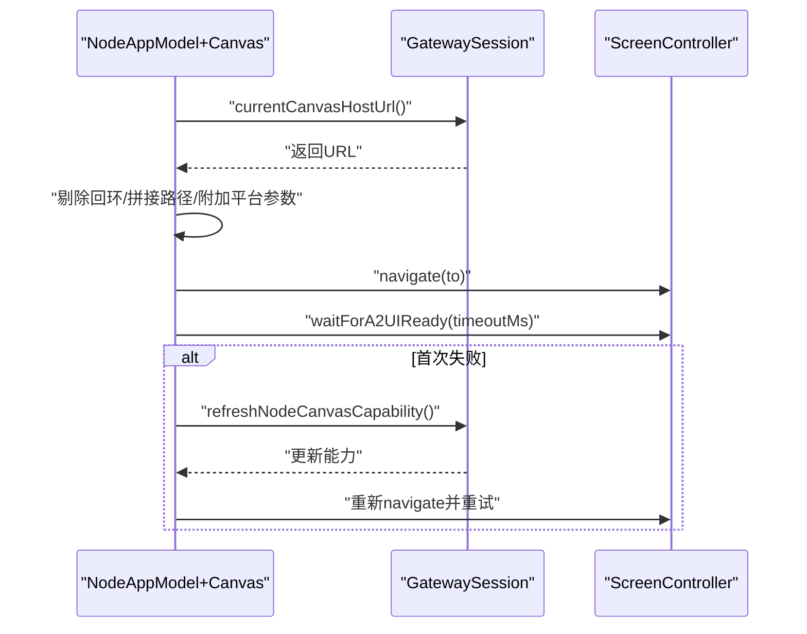
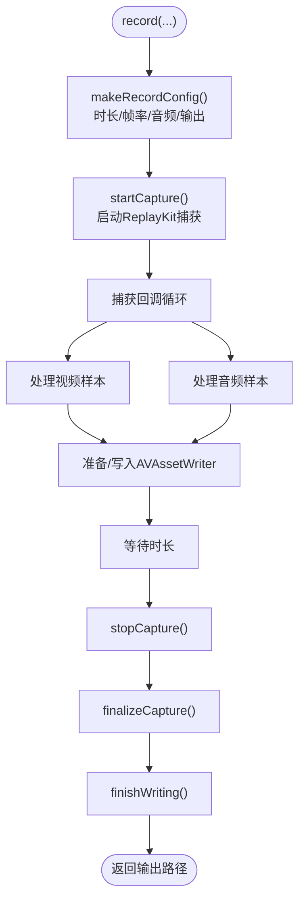
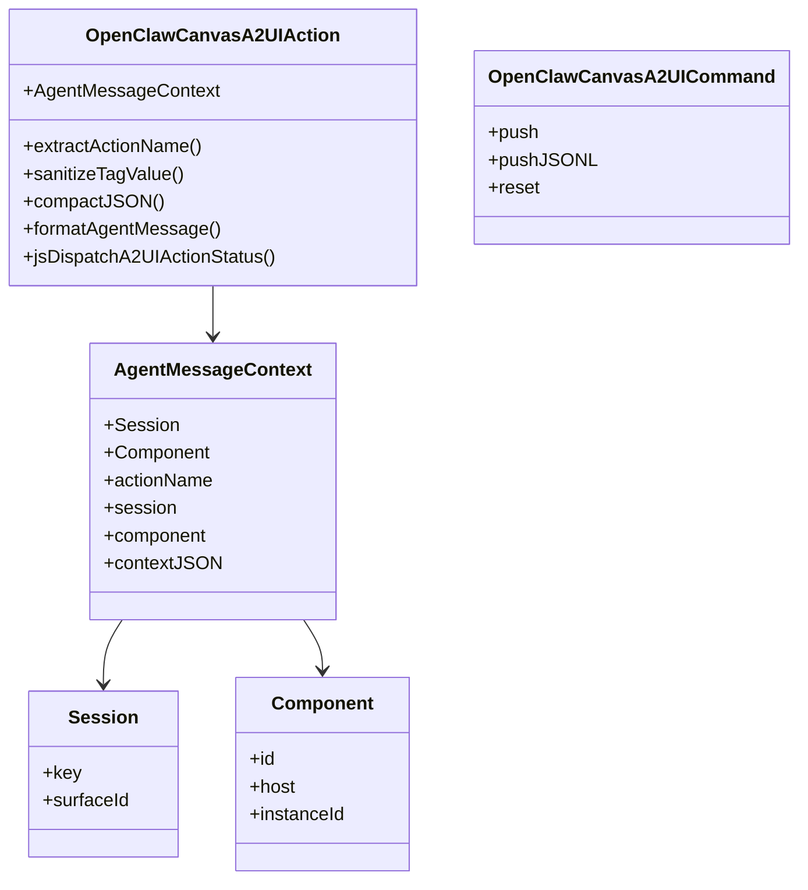
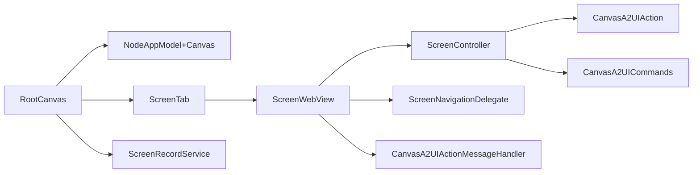

# Canvas控制

<cite>
**本文引用的文件**
- [RootCanvas.swift](file://apps/ios/Sources/RootCanvas.swift)
- [NodeAppModel+Canvas.swift](file://apps/ios/Sources/Model/NodeAppModel+Canvas.swift)
- [ScreenController.swift](file://apps/ios/Sources/Screen/ScreenController.swift)
- [ScreenWebView.swift](file://apps/ios/Sources/Screen/ScreenWebView.swift)
- [ScreenTab.swift](file://apps/ios/Sources/Screen/ScreenTab.swift)
- [ScreenRecordService.swift](file://apps/ios/Sources/Screen/ScreenRecordService.swift)
- [CanvasA2UIAction.swift](file://apps/shared/OpenClawKit/Sources/OpenClawKit/CanvasA2UIAction.swift)
- [CanvasA2UICommands.swift](file://apps/shared/OpenClawKit/Sources/OpenClawKit/CanvasA2UICommands.swift)
</cite>

## 目录
1. [简介](#简介)
2. [项目结构](#项目结构)
3. [核心组件](#核心组件)
4. [架构总览](#架构总览)
5. [详细组件分析](#详细组件分析)
6. [依赖关系分析](#依赖关系分析)
7. [性能考虑](#性能考虑)
8. [故障排除指南](#故障排除指南)
9. [结论](#结论)
10. [附录](#附录)

## 简介
本文件面向OpenClaw iOS节点的Canvas控制能力，系统性阐述Canvas界面的渲染机制、屏幕录制能力与远程控制通道（A2UI）的工作原理。文档覆盖以下主题：
- Canvas界面如何与用户交互：触摸事件、屏幕共享、实时预览
- Canvas数据传输协议、压缩与安全策略
- 配置项、性能调优与显示效果优化
- 使用场景、限制条件与常见问题排查

## 项目结构
iOS端Canvas控制由“界面容器 + 渲染控制器 + Web视图 + 屏幕录制服务 + A2UI协议”构成，核心文件分布如下：
- 界面层：RootCanvas负责顶层布局、状态展示与入口；ScreenTab承载Web视图；ScreenWebView封装WKWebView并注入导航与消息处理逻辑。
- 控制层：ScreenController负责URL导航、调试状态注入、Home Canvas状态同步、截图与A2UI就绪检测等。
- 协议层：CanvasA2UIAction与CanvasA2UICommands定义A2UI动作与命令格式，用于从Canvas向网关发送指令。
- 录制层：ScreenRecordService基于ReplayKit与AVFoundation实现屏幕录制，支持视频帧率与音频采集控制。

**图表来源**
- [RootCanvas.swift:87-218](file://apps/ios/Sources/RootCanvas.swift#L87-L218)
- [ScreenTab.swift:4-27](file://apps/ios/Sources/Screen/ScreenTab.swift#L4-L27)
- [ScreenWebView.swift:25-124](file://apps/ios/Sources/Screen/ScreenWebView.swift#L25-L124)
- [ScreenController.swift:8-281](file://apps/ios/Sources/Screen/ScreenController.swift#L8-L281)
- [CanvasA2UIAction.swift:3-104](file://apps/shared/OpenClawKit/Sources/OpenClawKit/CanvasA2UIAction.swift#L3-L104)
- [CanvasA2UICommands.swift:3-26](file://apps/shared/OpenClawKit/Sources/OpenClawKit/CanvasA2UICommands.swift#L3-L26)
- [ScreenRecordService.swift:5-352](file://apps/ios/Sources/Screen/ScreenRecordService.swift#L5-L352)

**章节来源**
- [RootCanvas.swift:87-218](file://apps/ios/Sources/RootCanvas.swift#L87-L218)
- [ScreenTab.swift:4-27](file://apps/ios/Sources/Screen/ScreenTab.swift#L4-L27)
- [ScreenWebView.swift:25-124](file://apps/ios/Sources/Screen/ScreenWebView.swift#L25-L124)
- [ScreenController.swift:8-281](file://apps/ios/Sources/Screen/ScreenController.swift#L8-L281)
- [CanvasA2UIAction.swift:3-104](file://apps/shared/OpenClawKit/Sources/OpenClawKit/CanvasA2UIAction.swift#L3-L104)
- [CanvasA2UICommands.swift:3-26](file://apps/shared/OpenClawKit/Sources/OpenClawKit/CanvasA2UICommands.swift#L3-L26)
- [ScreenRecordService.swift:5-352](file://apps/ios/Sources/Screen/ScreenRecordService.swift#L5-L352)

## 核心组件
- RootCanvas：顶层Canvas容器，负责根据网关状态与应用模型动态渲染Home Canvas内容，并在连接/断开时切换默认Canvas或远程Canvas。
- ScreenTab：承载ScreenWebView的容器视图，顶部显示加载错误提示。
- ScreenWebView：封装WKWebView，安装导航委托与A2UI消息处理器，确保仅来自可信源的动作被分发。
- ScreenController：核心控制类，负责URL导航、调试状态注入、Home Canvas状态同步、截图与A2UI就绪检测。
- ScreenRecordService：屏幕录制服务，基于ReplayKit捕获视频与音频，使用AVAssetWriter写入MP4。
- CanvasA2UIAction/CanvasA2UICommands：定义A2UI动作上下文与推送命令，用于从Canvas触发网关侧操作。

**章节来源**
- [RootCanvas.swift:87-218](file://apps/ios/Sources/RootCanvas.swift#L87-L218)
- [ScreenTab.swift:4-27](file://apps/ios/Sources/Screen/ScreenTab.swift#L4-L27)
- [ScreenWebView.swift:25-124](file://apps/ios/Sources/Screen/ScreenWebView.swift#L25-L124)
- [ScreenController.swift:8-281](file://apps/ios/Sources/Screen/ScreenController.swift#L8-L281)
- [ScreenRecordService.swift:5-352](file://apps/ios/Sources/Screen/ScreenRecordService.swift#L5-L352)
- [CanvasA2UIAction.swift:3-104](file://apps/shared/OpenClawKit/Sources/OpenClawKit/CanvasA2UIAction.swift#L3-L104)
- [CanvasA2UICommands.swift:3-26](file://apps/shared/OpenClawKit/Sources/OpenClawKit/CanvasA2UICommands.swift#L3-L26)

## 架构总览
Canvas控制的运行时流程如下：
- 应用启动后，RootCanvas根据网关连接状态决定是否展示Home Canvas或引导到设置/引导流程。
- 连接成功时，NodeAppModel解析Canvas主机URL并导航至远程Canvas；断开时回退到本地默认Canvas。
- ScreenController负责页面加载、调试信息注入、Home Canvas状态同步以及A2UI就绪检测。
- 用户在Canvas中触发的操作通过WKWebView的消息通道传递给CanvasA2UIActionMessageHandler，再由ScreenController回调上层处理。
- 屏幕录制由ScreenRecordService完成，支持可选音频与帧率控制。

**图表来源**
- [RootCanvas.swift:228-245](file://apps/ios/Sources/RootCanvas.swift#L228-L245)
- [NodeAppModel+Canvas.swift:36-62](file://apps/ios/Sources/Model/NodeAppModel+Canvas.swift#L36-L62)
- [ScreenController.swift:29-71](file://apps/ios/Sources/Screen/ScreenController.swift#L29-L71)
- [ScreenController.swift:118-139](file://apps/ios/Sources/Screen/ScreenController.swift#L118-L139)
- [ScreenWebView.swift:128-170](file://apps/ios/Sources/Screen/ScreenWebView.swift#L128-L170)

## 详细组件分析

### 组件A：RootCanvas（Canvas入口与状态）
- 职责
  - 基于网关状态与引导流程决策是否展示Home Canvas或设置/引导页。
  - 将系统颜色方案、网关状态、语音唤醒状态、相机HUD等注入Canvas内容。
  - 在连接/断开时自动切换默认Canvas与远程Canvas。
- 关键行为
  - 启动路由与快速设置弹窗的呈现逻辑。
  - 更新空闲计时器与Canvas调试状态。
  - 生成Home Canvas负载并通过JSON同步到Canvas端。

**图表来源**
- [RootCanvas.swift:49-85](file://apps/ios/Sources/RootCanvas.swift#L49-L85)
- [RootCanvas.swift:364-389](file://apps/ios/Sources/RootCanvas.swift#L364-L389)
- [RootCanvas.swift:402-414](file://apps/ios/Sources/RootCanvas.swift#L402-L414)

**章节来源**
- [RootCanvas.swift:87-218](file://apps/ios/Sources/RootCanvas.swift#L87-L218)
- [RootCanvas.swift:228-245](file://apps/ios/Sources/RootCanvas.swift#L228-L245)

### 组件B：ScreenTab与ScreenWebView（Web容器与导航）
- ScreenTab
  - 作为ScreenWebView的容器，顶部显示网关未连接时的错误提示。
- ScreenWebView
  - 创建并配置WKWebView，禁用透明背景以避免系统半透明叠加影响。
  - 安装ScreenNavigationDelegate拦截openclaw://深链；安装CanvasA2UIActionMessageHandler接收Canvas动作消息。
  - 支持控制器切换时的生命周期管理与资源释放。

**图表来源**
- [ScreenTab.swift:4-27](file://apps/ios/Sources/Screen/ScreenTab.swift#L4-L27)
- [ScreenWebView.swift:25-124](file://apps/ios/Sources/Screen/ScreenWebView.swift#L25-L124)
- [ScreenWebView.swift:128-170](file://apps/ios/Sources/Screen/ScreenWebView.swift#L128-L170)
- [ScreenWebView.swift:172-194](file://apps/ios/Sources/Screen/ScreenWebView.swift#L172-L194)

**章节来源**
- [ScreenTab.swift:4-27](file://apps/ios/Sources/Screen/ScreenTab.swift#L4-L27)
- [ScreenWebView.swift:25-124](file://apps/ios/Sources/Screen/ScreenWebView.swift#L25-L124)
- [ScreenWebView.swift:128-170](file://apps/ios/Sources/Screen/ScreenWebView.swift#L128-L170)
- [ScreenWebView.swift:172-194](file://apps/ios/Sources/Screen/ScreenWebView.swift#L172-L194)

### 组件C：ScreenController（导航/调试/状态/截图/A2UI就绪）
- 导航与安全
  - 解析并加载URL，禁止直接加载本地回环地址；支持本地HTML脚手架与远程URL。
  - 仅对受信任的Canvas UI（本地资源）或本地网络URL允许A2UI动作。
- 调试与状态
  - 可启用调试状态并在Canvas端注入标题/副标题。
  - 将Home Canvas状态JSON通过JS桥注入Canvas端的renderHome。
- A2UI就绪检测
  - 通过轮询检测window.openclawA2UI.applyMessages是否存在，超时则判定未就绪。
- 截图
  - 支持PNG/JPEG格式，可指定最大宽度与质量参数。

**图表来源**
- [ScreenController.swift:29-71](file://apps/ios/Sources/Screen/ScreenController.swift#L29-L71)
- [ScreenController.swift:83-116](file://apps/ios/Sources/Screen/ScreenController.swift#L83-L116)
- [ScreenController.swift:118-139](file://apps/ios/Sources/Screen/ScreenController.swift#L118-L139)
- [ScreenWebView.swift:172-194](file://apps/ios/Sources/Screen/ScreenWebView.swift#L172-L194)

**章节来源**
- [ScreenController.swift:8-281](file://apps/ios/Sources/Screen/ScreenController.swift#L8-L281)
- [ScreenWebView.swift:172-194](file://apps/ios/Sources/Screen/ScreenWebView.swift#L172-L194)

### 组件D：NodeAppModel+Canvas（Canvas主机解析与A2UI就绪）
- 主机解析
  - 从网关会话获取当前Canvas主机URL，剔除回环地址，拼接“__openclaw__/canvas/”或“__openclaw__/a2ui/”路径。
  - 平台参数附加“platform=ios”，便于后端识别。
- 就绪流程
  - 导航到初始URL并等待A2UI就绪；若首次失败，刷新节点Canvas能力后重试。
  - 断开时回退到本地默认Canvas。

**图表来源**
- [NodeAppModel+Canvas.swift:12-34](file://apps/ios/Sources/Model/NodeAppModel+Canvas.swift#L12-L34)
- [NodeAppModel+Canvas.swift:45-62](file://apps/ios/Sources/Model/NodeAppModel+Canvas.swift#L45-L62)
- [NodeAppModel+Canvas.swift:64-67](file://apps/ios/Sources/Model/NodeAppModel+Canvas.swift#L64-L67)

**章节来源**
- [NodeAppModel+Canvas.swift:12-34](file://apps/ios/Sources/Model/NodeAppModel+Canvas.swift#L12-L34)
- [NodeAppModel+Canvas.swift:45-62](file://apps/ios/Sources/Model/NodeAppModel+Canvas.swift#L45-L62)
- [NodeAppModel+Canvas.swift:64-67](file://apps/ios/Sources/Model/NodeAppModel+Canvas.swift#L64-L67)

### 组件E：ScreenRecordService（屏幕录制）
- 功能特性
  - 基于ReplayKit捕获屏幕视频与音频，使用AVAssetWriter写入MP4。
  - 支持帧率限制、时长限制、音频开关与输出路径自定义。
  - 写入过程串行化，避免并发冲突。
- 错误处理
  - 捕获与写入阶段的错误统一包装为可诊断的枚举类型。

**图表来源**
- [ScreenRecordService.swift:44-68](file://apps/ios/Sources/Screen/ScreenRecordService.swift#L44-L68)
- [ScreenRecordService.swift:77-102](file://apps/ios/Sources/Screen/ScreenRecordService.swift#L77-L102)
- [ScreenRecordService.swift:112-133](file://apps/ios/Sources/Screen/ScreenRecordService.swift#L112-L133)
- [ScreenRecordService.swift:166-205](file://apps/ios/Sources/Screen/ScreenRecordService.swift#L166-L205)
- [ScreenRecordService.swift:278-321](file://apps/ios/Sources/Screen/ScreenRecordService.swift#L278-L321)

**章节来源**
- [ScreenRecordService.swift:5-352](file://apps/ios/Sources/Screen/ScreenRecordService.swift#L5-L352)

### 组件F：CanvasA2UI协议（动作与命令）
- 动作上下文
  - 包含动作名、会话键与表面ID、组件标识与实例ID、可选上下文JSON。
  - 提供动作名提取、标签值规范化与JSON紧凑化工具。
- 命令定义
  - push：在设备Canvas上渲染A2UI内容。
  - pushJSONL：兼容旧版JSONL推送。
  - reset：重置A2UI渲染器状态。
- JS状态回传
  - 通过自定义事件向Canvas端回传动作执行结果。

**图表来源**
- [CanvasA2UIAction.swift:3-104](file://apps/shared/OpenClawKit/Sources/OpenClawKit/CanvasA2UIAction.swift#L3-L104)
- [CanvasA2UICommands.swift:3-26](file://apps/shared/OpenClawKit/Sources/OpenClawKit/CanvasA2UICommands.swift#L3-L26)

**章节来源**
- [CanvasA2UIAction.swift:3-104](file://apps/shared/OpenClawKit/Sources/OpenClawKit/CanvasA2UIAction.swift#L3-L104)
- [CanvasA2UICommands.swift:3-26](file://apps/shared/OpenClawKit/Sources/OpenClawKit/CanvasA2UICommands.swift#L3-L26)

## 依赖关系分析
- 组件耦合
  - RootCanvas依赖NodeAppModel与GatewayConnectionController，协调Canvas呈现与状态。
  - ScreenWebView依赖ScreenController与导航/消息处理器，承担UI与业务的桥接。
  - ScreenController依赖WKWebView与JS桥，负责页面生命周期与数据注入。
  - NodeAppModel+Canvas依赖GatewaySession与ScreenController，负责URL解析与就绪检测。
  - ScreenRecordService独立性强，依赖系统框架ReplayKit与AVFoundation。
- 外部依赖
  - WebKit/WKWebView：Canvas渲染与JS交互。
  - AVFoundation/ReplayKit：屏幕录制。
  - OpenClawKit：跨平台协议与资源访问。

**图表来源**
- [RootCanvas.swift:87-218](file://apps/ios/Sources/RootCanvas.swift#L87-L218)
- [ScreenWebView.swift:25-124](file://apps/ios/Sources/Screen/ScreenWebView.swift#L25-L124)
- [ScreenController.swift:8-281](file://apps/ios/Sources/Screen/ScreenController.swift#L8-L281)
- [NodeAppModel+Canvas.swift:12-34](file://apps/ios/Sources/Model/NodeAppModel+Canvas.swift#L12-L34)
- [ScreenRecordService.swift:5-352](file://apps/ios/Sources/Screen/ScreenRecordService.swift#L5-L352)

**章节来源**
- [RootCanvas.swift:87-218](file://apps/ios/Sources/RootCanvas.swift#L87-L218)
- [ScreenWebView.swift:25-124](file://apps/ios/Sources/Screen/ScreenWebView.swift#L25-L124)
- [ScreenController.swift:8-281](file://apps/ios/Sources/Screen/ScreenController.swift#L8-L281)
- [NodeAppModel+Canvas.swift:12-34](file://apps/ios/Sources/Model/NodeAppModel+Canvas.swift#L12-L34)
- [ScreenRecordService.swift:5-352](file://apps/ios/Sources/Screen/ScreenRecordService.swift#L5-L352)

## 性能考虑
- 页面加载与滚动
  - 默认Canvas需要原始触摸事件，因此禁用滚动；外部Canvas允许滚动以提升浏览体验。
- 截图与编码
  - JPEG质量参数可调，默认约0.82；可限制最大宽度以降低内存占用。
- A2UI就绪检测
  - 采用固定周期轮询检测，超时阈值可配置；首次失败后刷新能力并重试，避免因能力轮换导致的首帧失败。
- 录制帧率与时长
  - 帧率上限30fps；时长与帧率均有限幅，避免过度消耗CPU/GPU与存储空间。

**章节来源**
- [ScreenController.swift:250-258](file://apps/ios/Sources/Screen/ScreenController.swift#L250-L258)
- [ScreenController.swift:160-181](file://apps/ios/Sources/Screen/ScreenController.swift#L160-L181)
- [NodeAppModel+Canvas.swift:45-62](file://apps/ios/Sources/Model/NodeAppModel+Canvas.swift#L45-L62)
- [ScreenRecordService.swift:88-92](file://apps/ios/Sources/Screen/ScreenRecordService.swift#L88-L92)

## 故障排除指南
- Canvas无法加载或显示空白
  - 检查URL是否为空或为本地回环地址；确认网关已正确暴露Canvas主机。
  - 查看导航失败回调中的错误文本，定位网络或权限问题。
- A2UI动作未生效
  - 确认Canvas动作来源为受信任的本地资源或本地网络URL。
  - 检查A2UI就绪检测是否通过；必要时刷新节点Canvas能力后重试。
- Home Canvas状态不同步
  - 确认JSON负载有效且ScreenController已注入；检查didFinish回调是否触发。
- 录制无画面或失败
  - 检查ReplayKit权限与麦克风权限；确认帧率与时长未超出限制；查看writer状态与错误信息。
- 调试状态不显示
  - 确认已启用调试状态并提供标题/副标题；检查JS注入逻辑是否执行。

**章节来源**
- [ScreenWebView.swift:128-170](file://apps/ios/Sources/Screen/ScreenWebView.swift#L128-L170)
- [ScreenController.swift:83-116](file://apps/ios/Sources/Screen/ScreenController.swift#L83-L116)
- [ScreenRecordService.swift:278-321](file://apps/ios/Sources/Screen/ScreenRecordService.swift#L278-L321)

## 结论
OpenClaw iOS节点的Canvas控制以WebKit为核心载体，结合本地脚手架与远程Canvas主机，实现了灵活的界面渲染与远程控制通道。通过严格的URL与来源校验、A2UI就绪检测与状态注入机制，系统在保证安全的前提下提供了良好的用户体验。配合屏幕录制与截图能力，开发者可以进一步扩展Canvas的可视化与诊断能力。

## 附录
- 配置项建议
  - canvas.debugStatusEnabled：开发调试时开启，便于在Canvas端显示网关状态。
  - screen.preventSleep：保持设备活跃，避免后台休眠影响Canvas交互。
  - JPEG质量与截图宽度：根据带宽与清晰度需求调整。
- 使用场景
  - 远程桌面/控制台：通过Canvas展示远程界面并回传A2UI动作。
  - 实时预览与诊断：结合截图与录制能力进行问题复现与分析。
- 限制条件
  - 回环地址的Canvas将被拒绝加载，需确保网关暴露公网或内网可达地址。
  - A2UI动作仅接受来自受信任来源的消息，防止跨站风险。
- 安全性保障
  - URL白名单与来源校验：本地资源与本地网络URL才允许A2UI动作。
  - 非持久化数据存储：Web内容使用非持久化数据存储，降低持久化风险。
  - 权限与隐私：录制前需获得ReplayKit与麦克风权限。