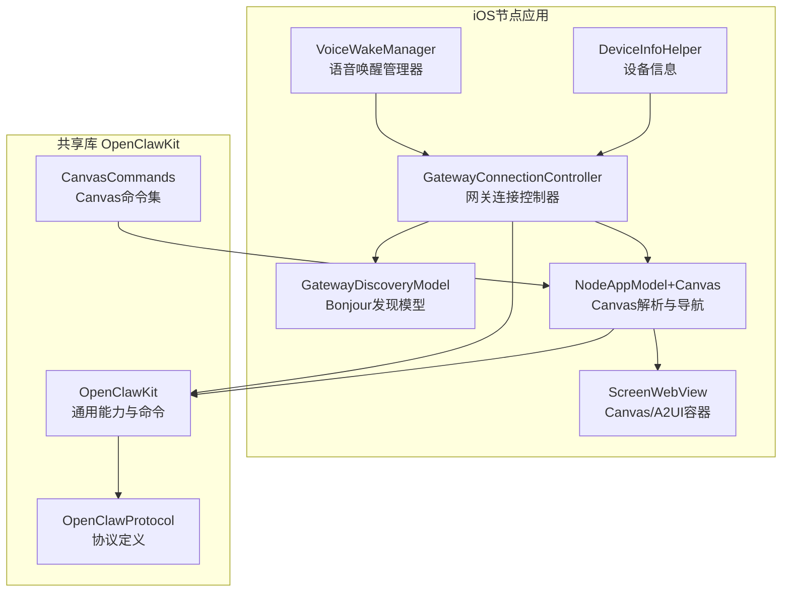
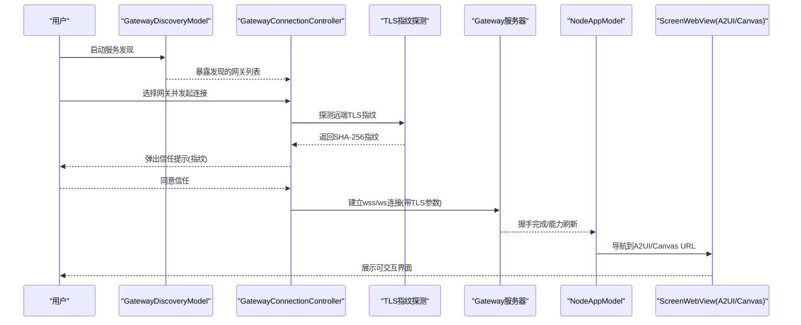
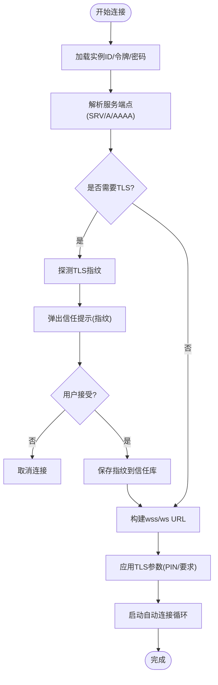
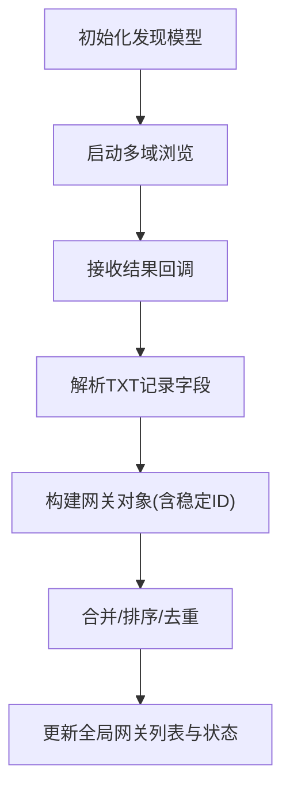
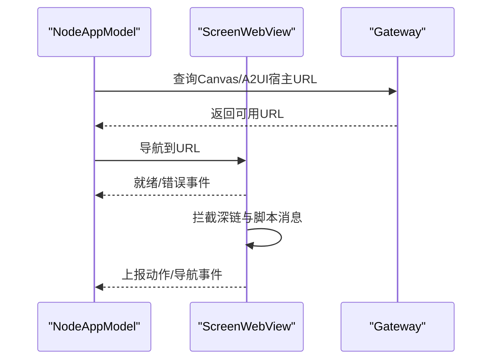
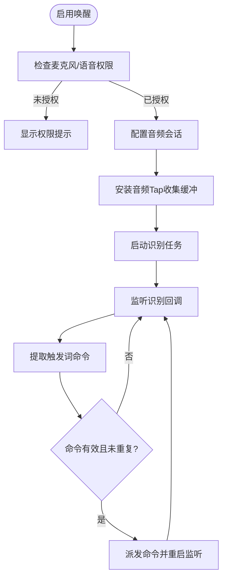
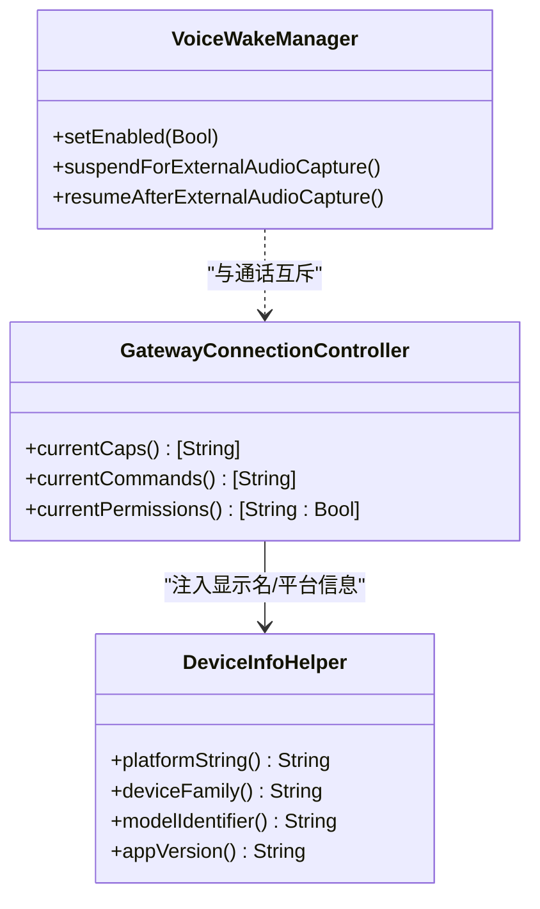
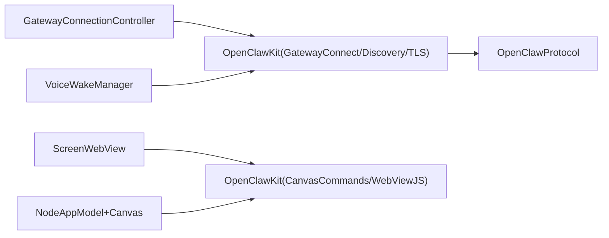

# iOS节点

<cite>
**本文引用的文件**
- [apps/ios/Sources/Gateway/GatewayConnectionController.swift](file://apps/ios/Sources/Gateway/GatewayConnectionController.swift)
- [apps/ios/Sources/Gateway/GatewayDiscoveryModel.swift](file://apps/ios/Sources/Gateway/GatewayDiscoveryModel.swift)
- [apps/ios/Sources/Screen/ScreenWebView.swift](file://apps/ios/Sources/Screen/ScreenWebView.swift)
- [apps/ios/Sources/Voice/VoiceWakeManager.swift](file://apps/ios/Sources/Voice/VoiceWakeManager.swift)
- [apps/ios/Sources/Model/NodeAppModel+Canvas.swift](file://apps/ios/Sources/Model/NodeAppModel+Canvas.swift)
- [apps/ios/Sources/Device/DeviceInfoHelper.swift](file://apps/ios/Sources/Device/DeviceInfoHelper.swift)
- [apps/ios/README.md](file://apps/ios/README.md)
- [apps/shared/OpenClawKit/Package.swift](file://apps/shared/OpenClawKit/Package.swift)
- [apps/shared/OpenClawKit/Sources/OpenClawKit/CanvasCommands.swift](file://apps/shared/OpenClawKit/Sources/OpenClawKit/CanvasCommands.swift)
</cite>

## 目录
1. [简介](#简介)
2. [项目结构](#项目结构)
3. [核心组件](#核心组件)
4. [架构总览](#架构总览)
5. [详细组件分析](#详细组件分析)
6. [依赖关系分析](#依赖关系分析)
7. [性能考量](#性能考量)
8. [故障排除指南](#故障排除指南)
9. [结论](#结论)
10. [附录](#附录)

## 简介
本文件面向OpenClaw iOS节点应用，系统化阐述其核心能力与技术实现，包括：
- 设备配对机制与网关连接流程
- 语音触发（Voice Wake）与通话（Talk）的协同与冲突处理
- Canvas界面控制与A2UI交互
- 设备权限管理与能力声明
- 与网关服务器的WebSocket通信协议要点、Bonjour服务发现、TLS指纹校验与信任流程
- 安装配置、功能演示、权限配置与故障排除
- 后台运行机制、电池优化策略与网络连接管理等移动端特性
- 安全配置、隐私保护与性能优化建议

## 项目结构
iOS节点应用位于apps/ios目录，采用SwiftUI与Swift并发模型构建，核心模块围绕“网关连接”“服务发现”“Canvas/A2UI”“语音唤醒”“设备信息与权限”展开，并通过共享库OpenClawKit提供协议与通用能力。

图示来源
- [apps/ios/Sources/Gateway/GatewayConnectionController.swift:20-928](file://apps/ios/Sources/Gateway/GatewayConnectionController.swift#L20-L928)
- [apps/ios/Sources/Gateway/GatewayDiscoveryModel.swift:6-181](file://apps/ios/Sources/Gateway/GatewayDiscoveryModel.swift#L6-L181)
- [apps/ios/Sources/Screen/ScreenWebView.swift:5-194](file://apps/ios/Sources/Screen/ScreenWebView.swift#L5-L194)
- [apps/ios/Sources/Voice/VoiceWakeManager.swift:82-476](file://apps/ios/Sources/Voice/VoiceWakeManager.swift#L82-L476)
- [apps/ios/Sources/Model/NodeAppModel+Canvas.swift:11-94](file://apps/ios/Sources/Model/NodeAppModel+Canvas.swift#L11-L94)
- [apps/ios/Sources/Device/DeviceInfoHelper.swift:7-73](file://apps/ios/Sources/Device/DeviceInfoHelper.swift#L7-L73)
- [apps/shared/OpenClawKit/Package.swift:5-61](file://apps/shared/OpenClawKit/Package.swift#L5-L61)
- [apps/shared/OpenClawKit/Sources/OpenClawKit/CanvasCommands.swift:3-9](file://apps/shared/OpenClawKit/Sources/OpenClawKit/CanvasCommands.swift#L3-L9)

章节来源
- [apps/ios/Sources/Gateway/GatewayConnectionController.swift:20-928](file://apps/ios/Sources/Gateway/GatewayConnectionController.swift#L20-L928)
- [apps/ios/Sources/Gateway/GatewayDiscoveryModel.swift:6-181](file://apps/ios/Sources/Gateway/GatewayDiscoveryModel.swift#L6-L181)
- [apps/ios/Sources/Screen/ScreenWebView.swift:5-194](file://apps/ios/Sources/Screen/ScreenWebView.swift#L5-L194)
- [apps/ios/Sources/Voice/VoiceWakeManager.swift:82-476](file://apps/ios/Sources/Voice/VoiceWakeManager.swift#L82-L476)
- [apps/ios/Sources/Model/NodeAppModel+Canvas.swift:11-94](file://apps/ios/Sources/Model/NodeAppModel+Canvas.swift#L11-L94)
- [apps/ios/Sources/Device/DeviceInfoHelper.swift:7-73](file://apps/ios/Sources/Device/DeviceInfoHelper.swift#L7-L73)
- [apps/ios/README.md:1-178](file://apps/ios/README.md#L1-L178)
- [apps/shared/OpenClawKit/Package.swift:5-61](file://apps/shared/OpenClawKit/Package.swift#L5-L61)
- [apps/shared/OpenClawKit/Sources/OpenClawKit/CanvasCommands.swift:3-9](file://apps/shared/OpenClawKit/Sources/OpenClawKit/CanvasCommands.swift#L3-L9)

## 核心组件
- 网关连接控制器：负责自动/手动连接、TLS指纹探测与信任、能力/命令/权限集合生成、自动重连与场景生命周期适配。
- 服务发现模型：基于NWBrowser与Bonjour TXT记录解析，聚合多域网关实例并维护状态文本与调试日志。
- Canvas/A2UI容器：以WKWebView承载Canvas或A2UI页面，拦截深链与本地消息通道，支持导航与就绪检测。
- 语音唤醒管理器：在前台长时监听麦克风音频流，识别触发词并派发命令；与通话录音互斥，避免资源抢占。
- 设备信息与权限：统一输出平台版本、设备型号、应用版本等信息，并在连接选项中注入当前授权状态。
- NodeAppModel扩展：解析Canvas/A2UI宿主URL、确保能力刷新后导航到可用页面、断开时回退默认Canvas。

章节来源
- [apps/ios/Sources/Gateway/GatewayConnectionController.swift:20-928](file://apps/ios/Sources/Gateway/GatewayConnectionController.swift#L20-L928)
- [apps/ios/Sources/Gateway/GatewayDiscoveryModel.swift:6-181](file://apps/ios/Sources/Gateway/GatewayDiscoveryModel.swift#L6-L181)
- [apps/ios/Sources/Screen/ScreenWebView.swift:5-194](file://apps/ios/Sources/Screen/ScreenWebView.swift#L5-L194)
- [apps/ios/Sources/Voice/VoiceWakeManager.swift:82-476](file://apps/ios/Sources/Voice/VoiceWakeManager.swift#L82-L476)
- [apps/ios/Sources/Model/NodeAppModel+Canvas.swift:11-94](file://apps/ios/Sources/Model/NodeAppModel+Canvas.swift#L11-L94)
- [apps/ios/Sources/Device/DeviceInfoHelper.swift:7-73](file://apps/ios/Sources/Device/DeviceInfoHelper.swift#L7-L73)

## 架构总览
下图展示iOS节点与网关之间的典型交互路径：Bonjour发现网关、建立TLS握手、进行信任确认、注册能力与命令、建立WebSocket会话、并通过Canvas/A2UI进行界面控制。

图示来源
- [apps/ios/Sources/Gateway/GatewayConnectionController.swift:91-278](file://apps/ios/Sources/Gateway/GatewayConnectionController.swift#L91-L278)
- [apps/ios/Sources/Gateway/GatewayDiscoveryModel.swift:51-100](file://apps/ios/Sources/Gateway/GatewayDiscoveryModel.swift#L51-L100)
- [apps/ios/Sources/Screen/ScreenWebView.swift:12-194](file://apps/ios/Sources/Screen/ScreenWebView.swift#L12-L194)
- [apps/ios/Sources/Model/NodeAppModel+Canvas.swift:12-94](file://apps/ios/Sources/Model/NodeAppModel+Canvas.swift#L12-L94)

## 详细组件分析

### 组件A：网关连接与TLS信任流程
- 自动连接策略：优先使用上次已信任的网关；若无则按偏好与最近发现排序选择；仅对已有TLS指纹的网关自动连接，确保安全。
- 手动连接与端口解析：根据主机名自动推断端口（默认18789，TLS场景可强制443或特定域名强制），并支持本地回环判定。
- TLS指纹探测：通过专用URLSession WebSocket任务获取远端证书链首证SHA-256指纹，用于首次信任确认。
- 信任存储与复用：将指纹持久化至TLS存储，后续自动连接直接使用PIN参数，避免重复交互。
- 能力/命令/权限注入：根据当前设备授权状态与用户设置动态生成capabilities、commands与permissions，随连接请求一并上报。

图示来源
- [apps/ios/Sources/Gateway/GatewayConnectionController.swift:91-278](file://apps/ios/Sources/Gateway/GatewayConnectionController.swift#L91-L278)
- [apps/ios/Sources/Gateway/GatewayConnectionController.swift:516-523](file://apps/ios/Sources/Gateway/GatewayConnectionController.swift#L516-L523)
- [apps/ios/Sources/Gateway/GatewayConnectionController.swift:660-667](file://apps/ios/Sources/Gateway/GatewayConnectionController.swift#L660-L667)
- [apps/ios/Sources/Gateway/GatewayConnectionController.swift:728-730](file://apps/ios/Sources/Gateway/GatewayConnectionController.swift#L728-L730)

章节来源
- [apps/ios/Sources/Gateway/GatewayConnectionController.swift:91-278](file://apps/ios/Sources/Gateway/GatewayConnectionController.swift#L91-L278)
- [apps/ios/Sources/Gateway/GatewayConnectionController.swift:516-523](file://apps/ios/Sources/Gateway/GatewayConnectionController.swift#L516-L523)
- [apps/ios/Sources/Gateway/GatewayConnectionController.swift:660-667](file://apps/ios/Sources/Gateway/GatewayConnectionController.swift#L660-L667)
- [apps/ios/Sources/Gateway/GatewayConnectionController.swift:728-730](file://apps/ios/Sources/Gateway/GatewayConnectionController.swift#L728-L730)

### 组件B：Bonjour服务发现与网关枚举
- 多域浏览：针对多个DNS域名启动NWBrowser，聚合来自不同域的网关实例。
- TXT记录解析：从TXT字段提取显示名、端口、TLS开关与指纹、CLI路径等元数据，构造稳定ID与调试描述。
- 状态与日志：维护各域浏览器状态，汇总为全局状态文本；可选开启调试日志，限制历史长度。

图示来源
- [apps/ios/Sources/Gateway/GatewayDiscoveryModel.swift:51-100](file://apps/ios/Sources/Gateway/GatewayDiscoveryModel.swift#L51-L100)
- [apps/ios/Sources/Gateway/GatewayDiscoveryModel.swift:68-96](file://apps/ios/Sources/Gateway/GatewayDiscoveryModel.swift#L68-L96)
- [apps/ios/Sources/Gateway/GatewayDiscoveryModel.swift:114-127](file://apps/ios/Sources/Gateway/GatewayDiscoveryModel.swift#L114-L127)

章节来源
- [apps/ios/Sources/Gateway/GatewayDiscoveryModel.swift:51-100](file://apps/ios/Sources/Gateway/GatewayDiscoveryModel.swift#L51-L100)
- [apps/ios/Sources/Gateway/GatewayDiscoveryModel.swift:68-96](file://apps/ios/Sources/Gateway/GatewayDiscoveryModel.swift#L68-L96)
- [apps/ios/Sources/Gateway/GatewayDiscoveryModel.swift:114-127](file://apps/ios/Sources/Gateway/GatewayDiscoveryModel.swift#L114-L127)

### 组件C：Canvas与A2UI界面控制
- URL解析：从网关会话查询Canvas/A2UI宿主地址，过滤本地回环，拼接路径并附加平台参数。
- 就绪检测：导航后等待A2UI就绪信号，必要时刷新节点Canvas能力后重试。
- 深链与动作：拦截openclaw://深链；通过WKScriptMessageHandler接收Canvas侧动作消息，执行本地操作或转发到网关。

图示来源
- [apps/ios/Sources/Model/NodeAppModel+Canvas.swift:12-94](file://apps/ios/Sources/Model/NodeAppModel+Canvas.swift#L12-L94)
- [apps/ios/Sources/Screen/ScreenWebView.swift:12-194](file://apps/ios/Sources/Screen/ScreenWebView.swift#L12-L194)

章节来源
- [apps/ios/Sources/Model/NodeAppModel+Canvas.swift:12-94](file://apps/ios/Sources/Model/NodeAppModel+Canvas.swift#L12-L94)
- [apps/ios/Sources/Screen/ScreenWebView.swift:12-194](file://apps/ios/Sources/Screen/ScreenWebView.swift#L12-L194)

### 组件D：语音唤醒与通话协同
- 音频管道：在实时音频回调中复制缓冲区，避免阻塞主线程；通过SFSpeechRecognitionTask持续识别转写。
- 触发词匹配：基于配置的触发词集合与分段信息，提取有效命令；去重与最小间隔控制降低误触。
- 权限与会话：请求麦克风与语音识别权限；在Simulator上禁用以规避音频栈问题；与通话录音互斥，通话期间暂停唤醒监听。
- 错误恢复：识别异常时延迟重启，维持稳定性。

图示来源
- [apps/ios/Sources/Voice/VoiceWakeManager.swift:160-350](file://apps/ios/Sources/Voice/VoiceWakeManager.swift#L160-L350)
- [apps/ios/Sources/Voice/VoiceWakeManager.swift:352-364](file://apps/ios/Sources/Voice/VoiceWakeManager.swift#L352-L364)

章节来源
- [apps/ios/Sources/Voice/VoiceWakeManager.swift:160-350](file://apps/ios/Sources/Voice/VoiceWakeManager.swift#L160-L350)
- [apps/ios/Sources/Voice/VoiceWakeManager.swift:352-364](file://apps/ios/Sources/Voice/VoiceWakeManager.swift#L352-L364)

### 组件E：设备权限与能力声明
- 能力集合：根据用户设置与授权状态动态注入canvas、screen、camera、voiceWake、location、device、watch、photos、contacts、calendar、reminders、motion等能力。
- 命令集合：依据能力集合生成对应命令清单，如相机、位置、设备信息、手表通知等。
- 权限映射：将摄像头、麦克风、语音识别、定位、屏幕录制、相册/通讯录/日历/提醒、运动计步等权限状态映射为布尔值，供网关侧使用。

图示来源
- [apps/ios/Sources/Gateway/GatewayConnectionController.swift:787-910](file://apps/ios/Sources/Gateway/GatewayConnectionController.swift#L787-L910)
- [apps/ios/Sources/Voice/VoiceWakeManager.swift:137-158](file://apps/ios/Sources/Voice/VoiceWakeManager.swift#L137-L158)
- [apps/ios/Sources/Device/DeviceInfoHelper.swift:7-73](file://apps/ios/Sources/Device/DeviceInfoHelper.swift#L7-L73)

章节来源
- [apps/ios/Sources/Gateway/GatewayConnectionController.swift:787-910](file://apps/ios/Sources/Gateway/GatewayConnectionController.swift#L787-L910)
- [apps/ios/Sources/Voice/VoiceWakeManager.swift:137-158](file://apps/ios/Sources/Voice/VoiceWakeManager.swift#L137-L158)
- [apps/ios/Sources/Device/DeviceInfoHelper.swift:7-73](file://apps/ios/Sources/Device/DeviceInfoHelper.swift#L7-L73)

## 依赖关系分析
- 应用层依赖OpenClawKit提供的协议与通用能力，包括Canvas命令、Bonjour解析支持、网关会话与TLS固定等。
- Canvas/A2UI通过WKWebView与用户内容交互，同时通过消息通道与控制器通信。
- 语音唤醒与通话共享音频输入资源，存在互斥与优先级策略。

图示来源
- [apps/shared/OpenClawKit/Package.swift:20-61](file://apps/shared/OpenClawKit/Package.swift#L20-L61)
- [apps/shared/OpenClawKit/Sources/OpenClawKit/CanvasCommands.swift:3-9](file://apps/shared/OpenClawKit/Sources/OpenClawKit/CanvasCommands.swift#L3-L9)
- [apps/ios/Sources/Gateway/GatewayConnectionController.swift:9-18](file://apps/ios/Sources/Gateway/GatewayConnectionController.swift#L9-L18)
- [apps/ios/Sources/Screen/ScreenWebView.swift:1-3](file://apps/ios/Sources/Screen/ScreenWebView.swift#L1-L3)

章节来源
- [apps/shared/OpenClawKit/Package.swift:20-61](file://apps/shared/OpenClawKit/Package.swift#L20-L61)
- [apps/shared/OpenClawKit/Sources/OpenClawKit/CanvasCommands.swift:3-9](file://apps/shared/OpenClawKit/Sources/OpenClawKit/CanvasCommands.swift#L3-L9)
- [apps/ios/Sources/Gateway/GatewayConnectionController.swift:9-18](file://apps/ios/Sources/Gateway/GatewayConnectionController.swift#L9-L18)
- [apps/ios/Sources/Screen/ScreenWebView.swift:1-3](file://apps/ios/Sources/Screen/ScreenWebView.swift#L1-L3)

## 性能考量
- 音频采集与识别：采用轻量回调复制缓冲，避免主线程阻塞；识别任务与音频Tap分离，减少抖动。
- 网络与连接：Bonjour发现按需启动/停止，后台场景停止扫描以节省电量；自动重连受控，避免频繁重建连接。
- UI渲染：Canvas/A2UI使用非持久化数据存储，避免磁盘IO；导航约束与滚动视图优化减少重绘。
- 电池与热管理：定位事件驱动而非常驻轮询；语音唤醒在Simulator禁用；通话期间暂停唤醒监听。

## 故障排除指南
- 构建与签名基线
  - 重新生成Xcode工程，确认团队与Bundle ID正确。
  - 参考安装说明中的本地部署步骤与Fastlane流程。
- 网关连接问题
  - 若出现配对/认证阻塞，先在Telegram执行配对批准，再尝试重连。
  - 发现不稳定时，启用“Discovery Debug Logs”，查看“Settings -> Gateway -> Discovery Logs”。
  - 网络路径不明确时，切换到“手动主机/端口 + TLS”模式。
- 语音唤醒问题
  - 确认麦克风与语音识别权限已授予；Simulator不支持唤醒。
  - 通话录音会抑制唤醒监听，结束通话后自动恢复。
- Canvas/A2UI问题
  - 首次渲染失败时，系统会自动刷新节点Canvas能力并重试；若仍失败，检查网关Canvas服务可达性。
- 调试日志
  - 在Xcode控制台按子系统过滤：ai.openclaw.ios、GatewayDiag、APNs registration failed。

章节来源
- [apps/ios/README.md:156-178](file://apps/ios/README.md#L156-L178)

## 结论
iOS节点通过严谨的服务发现、TLS信任与能力/命令/权限注入，实现了与网关的可靠连接；Canvas/A2UI提供直观的界面控制；语音唤醒与通话的协同设计兼顾了用户体验与资源管理。配合完善的调试与故障排除流程，可在移动设备上稳定运行并满足自动化与人机交互需求。

## 附录

### 安装与配置指南
- 开发环境准备：Xcode 16+、pnpm、xcodegen、Apple开发签名。
- 本地部署：生成项目、打开工程、选择目标设备、运行。
- 签名配置：个人团队签名失败时，使用LocalSigning.xcconfig示例生成唯一Bundle ID。
- Beta发布：通过Fastlane与ASC Keychain集成，生成归档或上传TestFlight。

章节来源
- [apps/ios/README.md:18-87](file://apps/ios/README.md#L18-L87)

### 功能演示要点
- 配对与连接：通过设置代码配对后，自动/手动连接网关，验证TLS信任流程。
- Canvas/A2UI：连接成功后导航到A2UI页面，支持深链与动作消息。
- 语音唤醒：前台启用后，识别触发词并派发命令；通话期间暂停。
- 设备权限：在设置中查看并调整各项权限，观察能力/命令变化。

章节来源
- [apps/ios/README.md:98-146](file://apps/ios/README.md#L98-L146)

### 权限配置说明
- 摄像头/麦克风/语音识别：影响camera、voiceWake、talk等能力。
- 定位：影响location能力；后台需要“始终”权限。
- 屏幕录制：影响screen.record能力。
- 相册/通讯录/日历/提醒：影响对应命令。
- 运动手环：影响motion能力。

章节来源
- [apps/ios/Sources/Gateway/GatewayConnectionController.swift:878-910](file://apps/ios/Sources/Gateway/GatewayConnectionController.swift#L878-L910)

### 移动端特性与策略
- 后台行为：前台优先，后台严格限制canvas/screen/talk等命令；自动重连需人工干预认证阻塞。
- 电池优化：定位事件驱动、Simulator禁用唤醒、通话抑制唤醒、发现按场景启停。
- 网络管理：Bonjour按需扫描，TLS指纹PIN复用，避免重复握手。

章节来源
- [apps/ios/README.md:137-146](file://apps/ios/README.md#L137-L146)

### 安全与隐私
- TLS固定：首次连接探测远端证书指纹，后续使用PIN参数强制校验。
- 本地网络限制：Canvas动作消息仅接受来自本地网络页面的调用，提升安全性。
- 权限最小化：仅在授权后注入对应能力与命令，避免越权操作。

章节来源
- [apps/ios/Sources/Gateway/GatewayConnectionController.swift:120-136](file://apps/ios/Sources/Gateway/GatewayConnectionController.swift#L120-L136)
- [apps/ios/Sources/Screen/ScreenWebView.swift:172-194](file://apps/ios/Sources/Screen/ScreenWebView.swift#L172-L194)