# iOS节点概览

<cite>
**本文档引用的文件**
- [apps/ios/README.md](file://apps/ios/README.md)
- [docs/platforms/ios.md](file://docs/platforms/ios.md)
- [apps/ios/Sources/OpenClawApp.swift](file://apps/ios/Sources/OpenClawApp.swift)
- [apps/ios/Sources/Gateway/GatewayConnectionController.swift](file://apps/ios/Sources/Gateway/GatewayConnectionController.swift)
- [apps/ios/Sources/Capabilities/NodeCapabilityRouter.swift](file://apps/ios/Sources/Capabilities/NodeCapabilityRouter.swift)
- [apps/ios/Sources/Voice/VoiceWakeManager.swift](file://apps/ios/Sources/Voice/VoiceWakeManager.swift)
- [apps/ios/Sources/Screen/ScreenController.swift](file://apps/ios/Sources/Screen/ScreenController.swift)
- [apps/ios/Sources/Location/LocationService.swift](file://apps/ios/Sources/Location/LocationService.swift)
- [apps/ios/Sources/Camera/CameraController.swift](file://apps/ios/Sources/Camera/CameraController.swift)
- [apps/ios/Sources/Services/NodeServiceProtocols.swift](file://apps/ios/Sources/Services/NodeServiceProtocols.swift)
- [apps/ios/Sources/Model/NodeAppModel.swift](file://apps/ios/Sources/Model/NodeAppModel.swift)
- [apps/ios/Sources/RootCanvas.swift](file://apps/ios/Sources/RootCanvas.swift)
- [apps/shared/OpenClawKit/Package.swift](file://apps/shared/OpenClawKit/Package.swift)
</cite>

## 目录
1. [简介](#简介)
2. [项目结构](#项目结构)
3. [核心组件](#核心组件)
4. [架构总览](#架构总览)
5. [详细组件分析](#详细组件分析)
6. [依赖关系分析](#依赖关系分析)
7. [性能考虑](#性能考虑)
8. [故障排除指南](#故障排除指南)
9. [结论](#结论)
10. [附录](#附录)

## 简介
OpenClaw iOS节点是iPhone端的“节点”应用，作为OpenClaw生态的一部分，以“role: node”的身份连接到网关服务器（Gateway）。它负责承载设备能力（如相机、屏幕录制、位置、通话/语音唤醒等），并通过WebSocket与网关建立安全连接，接收并执行node.invoke命令，同时上报状态事件。

该应用当前处于内部预发布阶段，强调前台使用可靠性，并对后台行为进行限制与优化。其主要目标是：
- 通过多种发现路径（Bonjour/LAN、Tailnet、手动主机端口）连接网关
- 提供Canvas渲染与A2UI交互能力
- 支持相机拍照/视频录制、屏幕录制、位置服务、通话模式与语音唤醒
- 通过APNs实现静默推送唤醒与后台恢复

## 项目结构
iOS节点应用位于apps/ios目录，采用SwiftUI + 观察者模式构建，核心模块围绕“应用模型（NodeAppModel）+ 网关控制器（GatewayConnectionController）+ 能力路由（NodeCapabilityRouter）”组织，辅以各子系统服务（相机、屏幕、位置、语音等）。

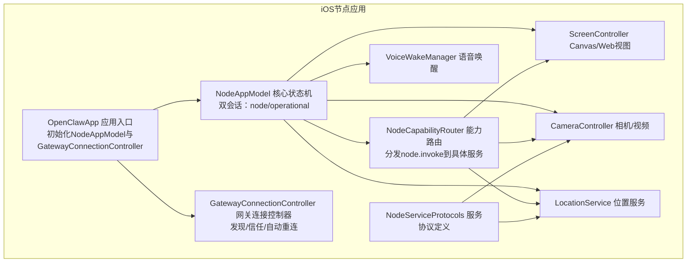

图表来源
- [apps/ios/Sources/OpenClawApp.swift:492-526](file://apps/ios/Sources/OpenClawApp.swift#L492-L526)
- [apps/ios/Sources/Model/NodeAppModel.swift:152-221](file://apps/ios/Sources/Model/NodeAppModel.swift#L152-L221)
- [apps/ios/Sources/Gateway/GatewayConnectionController.swift:20-80](file://apps/ios/Sources/Gateway/GatewayConnectionController.swift#L20-L80)
- [apps/ios/Sources/Capabilities/NodeCapabilityRouter.swift:4-25](file://apps/ios/Sources/Capabilities/NodeCapabilityRouter.swift#L4-L25)
- [apps/ios/Sources/Screen/ScreenController.swift:6-27](file://apps/ios/Sources/Screen/ScreenController.swift#L6-L27)
- [apps/ios/Sources/Camera/CameraController.swift:6-12](file://apps/ios/Sources/Camera/CameraController.swift#L6-L12)
- [apps/ios/Sources/Location/LocationService.swift:5-12](file://apps/ios/Sources/Location/LocationService.swift#L5-L12)
- [apps/ios/Sources/Voice/VoiceWakeManager.swift:82-120](file://apps/ios/Sources/Voice/VoiceWakeManager.swift#L82-L120)
- [apps/ios/Sources/Services/NodeServiceProtocols.swift:9-107](file://apps/ios/Sources/Services/NodeServiceProtocols.swift#L9-L107)

章节来源
- [apps/ios/README.md:18-87](file://apps/ios/README.md#L18-L87)
- [apps/ios/Sources/OpenClawApp.swift:492-542](file://apps/ios/Sources/OpenClawApp.swift#L492-L542)

## 核心组件
- 应用入口与生命周期
  - OpenClawApp负责安装未捕获异常日志器、引导持久化、初始化NodeAppModel与GatewayConnectionController，并在Scene变化时同步状态。
- NodeAppModel
  - 双会话设计：nodeGateway用于设备能力与node.invoke；operatorGateway用于聊天、配置、语音唤醒等操作。
  - 状态监控：健康检查、后台连接宽限期、APNs设备令牌、深链处理、Canvas A2UI动作桥接。
  - 能力路由：根据命令前缀分派到具体服务（相机/屏幕/位置/通话/语音唤醒等）。
- GatewayConnectionController
  - 发现与信任：Bonjour/LAN、Tailnet、手动主机端口；TLS指纹信任提示；自动重连策略。
  - 连接选项：角色、作用域、能力、命令、权限、客户端标识与显示名。
- NodeCapabilityRouter
  - 将BridgeInvokeRequest按命令路由至对应处理器，统一错误处理。
- 子系统服务
  - ScreenController：WKWebView驱动的Canvas渲染、导航、快照、JS评估。
  - CameraController：拍照/视频录制、设备列表、质量/时长裁剪。
  - LocationService：授权、一次性定位、显著位置变化、更新流。
  - VoiceWakeManager：麦克风权限、语音识别、触发词匹配、暂停/恢复。
  - NodeServiceProtocols：定义各服务协议接口，便于注入与测试。

章节来源
- [apps/ios/Sources/OpenClawApp.swift:16-263](file://apps/ios/Sources/OpenClawApp.swift#L16-L263)
- [apps/ios/Sources/Model/NodeAppModel.swift:48-221](file://apps/ios/Sources/Model/NodeAppModel.swift#L48-L221)
- [apps/ios/Sources/Gateway/GatewayConnectionController.swift:20-80](file://apps/ios/Sources/Gateway/GatewayConnectionController.swift#L20-L80)
- [apps/ios/Sources/Capabilities/NodeCapabilityRouter.swift:4-25](file://apps/ios/Sources/Capabilities/NodeCapabilityRouter.swift#L4-L25)
- [apps/ios/Sources/Screen/ScreenController.swift:6-27](file://apps/ios/Sources/Screen/ScreenController.swift#L6-L27)
- [apps/ios/Sources/Camera/CameraController.swift:6-12](file://apps/ios/Sources/Camera/CameraController.swift#L6-L12)
- [apps/ios/Sources/Location/LocationService.swift:5-12](file://apps/ios/Sources/Location/LocationService.swift#L5-L12)
- [apps/ios/Sources/Voice/VoiceWakeManager.swift:82-120](file://apps/ios/Sources/Voice/VoiceWakeManager.swift#L82-L120)
- [apps/ios/Sources/Services/NodeServiceProtocols.swift:9-107](file://apps/ios/Sources/Services/NodeServiceProtocols.swift#L9-L107)

## 架构总览
iOS节点在OpenClaw生态中扮演“设备能力承载者”的角色，通过以下方式与网关协作：
- 连接方式：Bonjour/LAN、Tailnet（DNS-SD）、手动主机端口；TLS指纹信任机制确保安全性。
- 协作关系：节点向网关注册自身能力与命令，网关下发node.invoke指令，节点执行后返回结果或状态。
- 通信通道：双会话设计，node会话专注能力调用，operator会话专注聊天与配置。

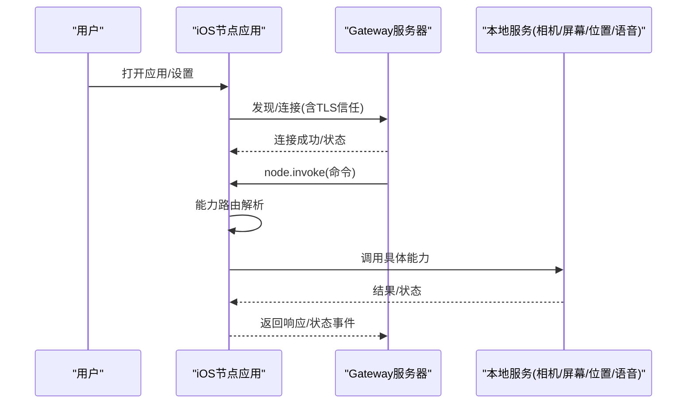

图表来源
- [apps/ios/Sources/Gateway/GatewayConnectionController.swift:90-156](file://apps/ios/Sources/Gateway/GatewayConnectionController.swift#L90-L156)
- [apps/ios/Sources/Model/NodeAppModel.swift:732-778](file://apps/ios/Sources/Model/NodeAppModel.swift#L732-L778)
- [apps/ios/Sources/Capabilities/NodeCapabilityRouter.swift:19-24](file://apps/ios/Sources/Capabilities/NodeCapabilityRouter.swift#L19-L24)

## 详细组件分析

### 应用入口与生命周期（OpenClawApp）
- 安装未捕获异常处理器，记录崩溃日志。
- 初始化NodeAppModel与GatewayConnectionController，注入环境变量。
- 处理Scene变化（前台/后台）与深链打开。
- 注册APNs并处理静默推送唤醒。

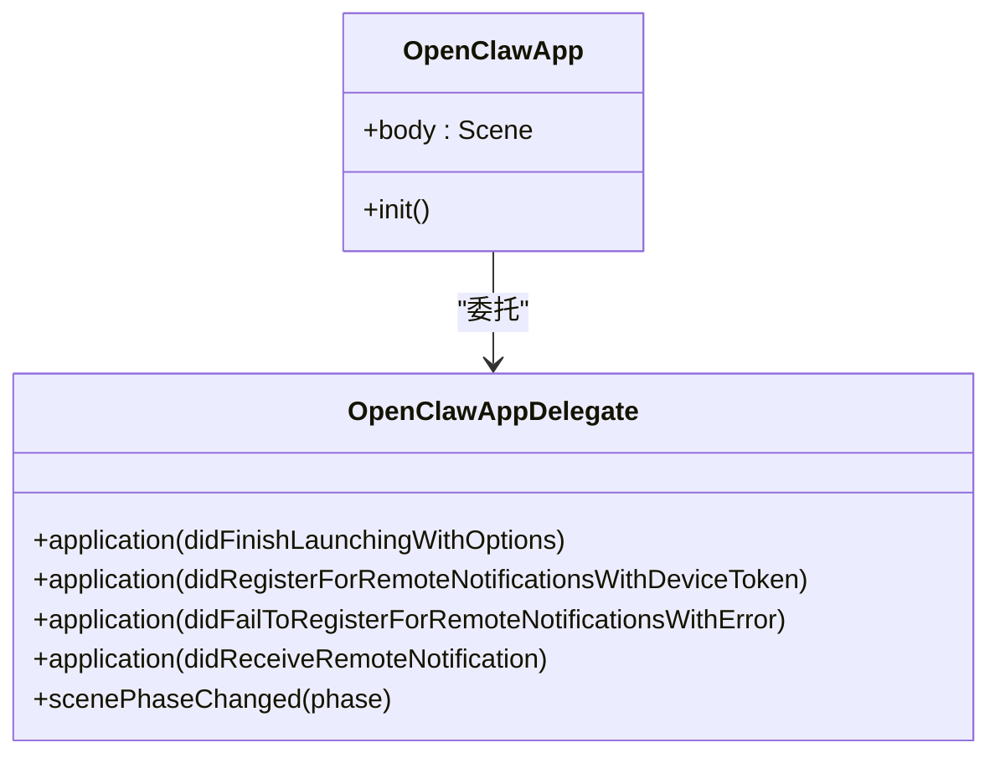

图表来源
- [apps/ios/Sources/OpenClawApp.swift:492-542](file://apps/ios/Sources/OpenClawApp.swift#L492-L542)
- [apps/ios/Sources/OpenClawApp.swift:16-96](file://apps/ios/Sources/OpenClawApp.swift#L16-L96)

章节来源
- [apps/ios/Sources/OpenClawApp.swift:16-96](file://apps/ios/Sources/OpenClawApp.swift#L16-L96)
- [apps/ios/Sources/OpenClawApp.swift:492-542](file://apps/ios/Sources/OpenClawApp.swift#L492-L542)

### 网关连接控制器（GatewayConnectionController）
- 发现与信任：支持Bonjour/LAN、Tailnet、手动主机端口；首次连接需TLS指纹确认，后续基于存储指纹自动连接。
- 自动重连：根据场景（前台/后台）与用户偏好决定是否自动连接与重连。
- 连接参数：角色为node，动态生成clientId/displayName，包含能力/命令/权限集合。

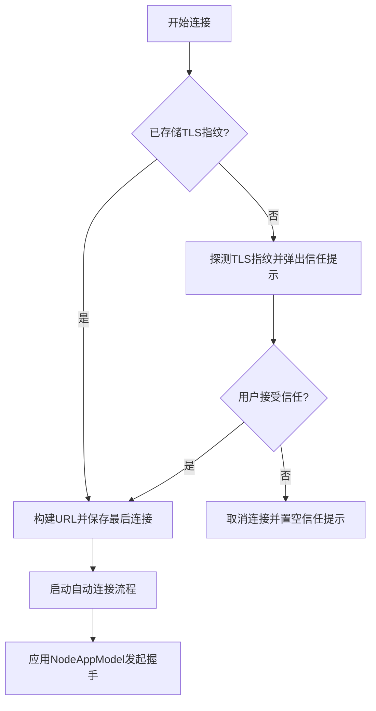

图表来源
- [apps/ios/Sources/Gateway/GatewayConnectionController.swift:90-156](file://apps/ios/Sources/Gateway/GatewayConnectionController.swift#L90-L156)
- [apps/ios/Sources/Gateway/GatewayConnectionController.swift:242-278](file://apps/ios/Sources/Gateway/GatewayConnectionController.swift#L242-L278)

章节来源
- [apps/ios/Sources/Gateway/GatewayConnectionController.swift:20-80](file://apps/ios/Sources/Gateway/GatewayConnectionController.swift#L20-L80)
- [apps/ios/Sources/Gateway/GatewayConnectionController.swift:90-156](file://apps/ios/Sources/Gateway/GatewayConnectionController.swift#L90-L156)
- [apps/ios/Sources/Gateway/GatewayConnectionController.swift:242-278](file://apps/ios/Sources/Gateway/GatewayConnectionController.swift#L242-L278)

### 能力路由（NodeCapabilityRouter）
- 将node.invoke请求按命令前缀分发到具体处理器。
- 统一错误类型：未知命令、处理器不可用。
- 与NodeAppModel配合，执行背景限制与权限校验。

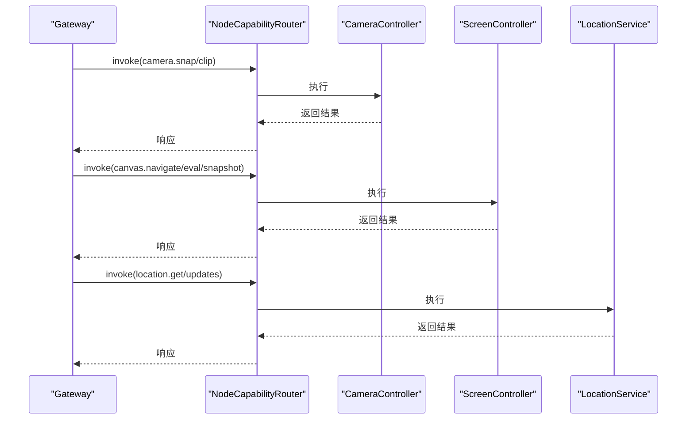

图表来源
- [apps/ios/Sources/Capabilities/NodeCapabilityRouter.swift:19-24](file://apps/ios/Sources/Capabilities/NodeCapabilityRouter.swift#L19-L24)
- [apps/ios/Sources/Model/NodeAppModel.swift:732-778](file://apps/ios/Sources/Model/NodeAppModel.swift#L732-L778)
- [apps/ios/Sources/Camera/CameraController.swift:40-88](file://apps/ios/Sources/Camera/CameraController.swift#L40-L88)
- [apps/ios/Sources/Screen/ScreenController.swift:29-71](file://apps/ios/Sources/Screen/ScreenController.swift#L29-L71)
- [apps/ios/Sources/Location/LocationService.swift:56-72](file://apps/ios/Sources/Location/LocationService.swift#L56-L72)

章节来源
- [apps/ios/Sources/Capabilities/NodeCapabilityRouter.swift:4-25](file://apps/ios/Sources/Capabilities/NodeCapabilityRouter.swift#L4-L25)
- [apps/ios/Sources/Model/NodeAppModel.swift:732-778](file://apps/ios/Sources/Model/NodeAppModel.swift#L732-L778)

### Canvas与A2UI（ScreenController）
- 使用WKWebView渲染Canvas，支持navigate/eval/snapshot等命令。
- 内置画布脚手架URL，支持调试状态注入与A2UI动作回调。
- 对loopback地址访问进行安全限制，避免远程加载本地资源。

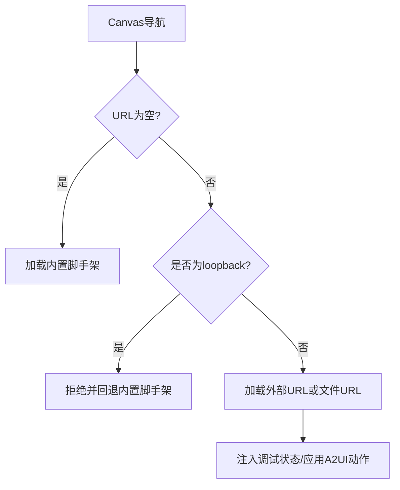

图表来源
- [apps/ios/Sources/Screen/ScreenController.swift:29-71](file://apps/ios/Sources/Screen/ScreenController.swift#L29-L71)
- [apps/ios/Sources/Screen/ScreenController.swift:118-139](file://apps/ios/Sources/Screen/ScreenController.swift#L118-L139)
- [apps/ios/Sources/Screen/ScreenController.swift:141-148](file://apps/ios/Sources/Screen/ScreenController.swift#L141-L148)

章节来源
- [apps/ios/Sources/Screen/ScreenController.swift:6-27](file://apps/ios/Sources/Screen/ScreenController.swift#L6-L27)
- [apps/ios/Sources/Screen/ScreenController.swift:29-71](file://apps/ios/Sources/Screen/ScreenController.swift#L29-L71)
- [apps/ios/Sources/Screen/ScreenController.swift:118-139](file://apps/ios/Sources/Screen/ScreenController.swift#L118-L139)

### 相机与视频（CameraController）
- 支持拍照与视频录制，可指定前置/后置、设备ID、最大宽度、质量与时长。
- 录制完成后转码为MP4以便下游处理。
- 权限校验失败时抛出明确错误类型。

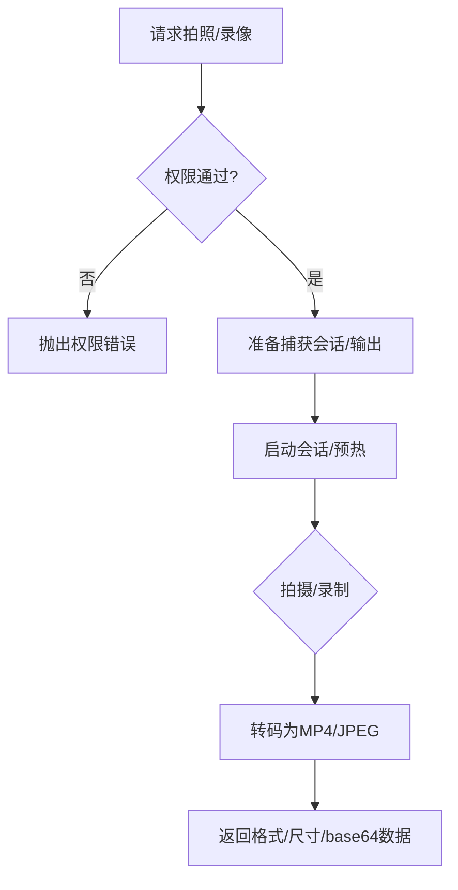

图表来源
- [apps/ios/Sources/Camera/CameraController.swift:40-88](file://apps/ios/Sources/Camera/CameraController.swift#L40-L88)
- [apps/ios/Sources/Camera/CameraController.swift:115-142](file://apps/ios/Sources/Camera/CameraController.swift#L115-L142)
- [apps/ios/Sources/Camera/CameraController.swift:217-252](file://apps/ios/Sources/Camera/CameraController.swift#L217-L252)

章节来源
- [apps/ios/Sources/Camera/CameraController.swift:6-12](file://apps/ios/Sources/Camera/CameraController.swift#L6-L12)
- [apps/ios/Sources/Camera/CameraController.swift:40-88](file://apps/ios/Sources/Camera/CameraController.swift#L40-L88)
- [apps/ios/Sources/Camera/CameraController.swift:115-142](file://apps/ios/Sources/Camera/CameraController.swift#L115-L142)

### 位置服务（LocationService）
- 支持WhenInUse/Always授权，显著位置变化与实时更新流。
- 提供一次性定位与超时控制，适配后台限制。

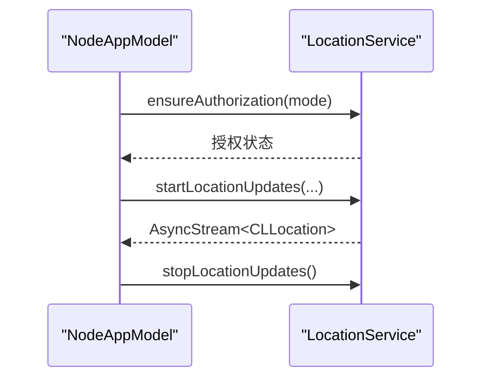

图表来源
- [apps/ios/Sources/Location/LocationService.swift:34-54](file://apps/ios/Sources/Location/LocationService.swift#L34-L54)
- [apps/ios/Sources/Location/LocationService.swift:87-112](file://apps/ios/Sources/Location/LocationService.swift#L87-L112)
- [apps/ios/Sources/Location/LocationService.swift:147-168](file://apps/ios/Sources/Location/LocationService.swift#L147-L168)

章节来源
- [apps/ios/Sources/Location/LocationService.swift:5-12](file://apps/ios/Sources/Location/LocationService.swift#L5-L12)
- [apps/ios/Sources/Location/LocationService.swift:34-54](file://apps/ios/Sources/Location/LocationService.swift#L34-L54)
- [apps/ios/Sources/Location/LocationService.swift:87-112](file://apps/ios/Sources/Location/LocationService.swift#L87-L112)

### 语音唤醒（VoiceWakeManager）
- 麦克风与语音识别权限申请，配置音频会话。
- 触发词匹配与识别结果处理，支持暂停/恢复。
- 与Talk模式互斥，避免麦克风抢占。

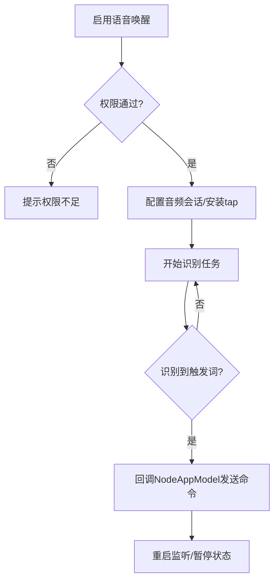

图表来源
- [apps/ios/Sources/Voice/VoiceWakeManager.swift:160-213](file://apps/ios/Sources/Voice/VoiceWakeManager.swift#L160-L213)
- [apps/ios/Sources/Voice/VoiceWakeManager.swift:301-350](file://apps/ios/Sources/Voice/VoiceWakeManager.swift#L301-L350)
- [apps/ios/Sources/Voice/VoiceWakeManager.swift:470-477](file://apps/ios/Sources/Voice/VoiceWakeManager.swift#L470-L477)

章节来源
- [apps/ios/Sources/Voice/VoiceWakeManager.swift:82-120](file://apps/ios/Sources/Voice/VoiceWakeManager.swift#L82-L120)
- [apps/ios/Sources/Voice/VoiceWakeManager.swift:160-213](file://apps/ios/Sources/Voice/VoiceWakeManager.swift#L160-L213)
- [apps/ios/Sources/Voice/VoiceWakeManager.swift:301-350](file://apps/ios/Sources/Voice/VoiceWakeManager.swift#L301-L350)

### 应用模型与Canvas界面（NodeAppModel + RootCanvas）
- NodeAppModel维护双会话、健康监测、后台宽限期、APNs令牌、深链与A2UI动作处理。
- RootCanvas根据网关状态渲染首页画布、工具栏、语音唤醒提示与相机闪光效果。

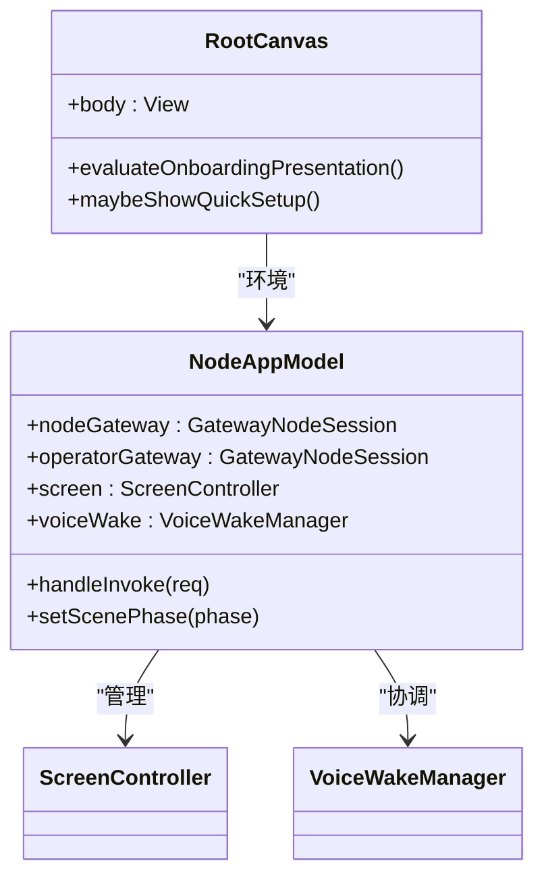

图表来源
- [apps/ios/Sources/Model/NodeAppModel.swift:48-221](file://apps/ios/Sources/Model/NodeAppModel.swift#L48-L221)
- [apps/ios/Sources/RootCanvas.swift:5-427](file://apps/ios/Sources/RootCanvas.swift#L5-L427)

章节来源
- [apps/ios/Sources/Model/NodeAppModel.swift:48-221](file://apps/ios/Sources/Model/NodeAppModel.swift#L48-L221)
- [apps/ios/Sources/RootCanvas.swift:5-427](file://apps/ios/Sources/RootCanvas.swift#L5-L427)

## 依赖关系分析
- 平台与工具链
  - iOS 18+，Swift 6.2，严格并发（StrictConcurrency）启用。
  - 依赖OpenClawKit（协议/核心库/聊天UI）与第三方库（ElevenLabsKit、Textual）。
- 模块耦合
  - NodeAppModel聚合多个服务（相机、屏幕、位置、语音等），通过NodeServiceProtocols解耦。
  - GatewayConnectionController与NodeAppModel双向协作，前者负责连接，后者负责会话与能力调度。
  - RootCanvas作为UI入口，依赖NodeAppModel与GatewayConnectionController的状态。

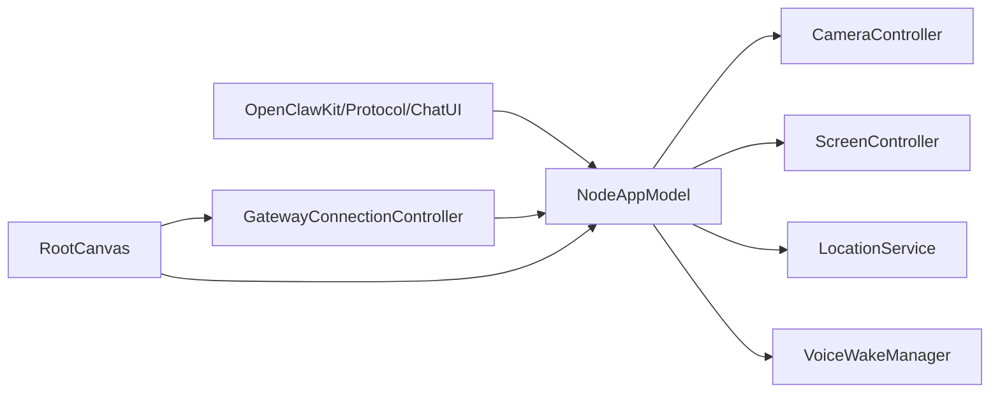

图表来源
- [apps/shared/OpenClawKit/Package.swift:16-61](file://apps/shared/OpenClawKit/Package.swift#L16-L61)
- [apps/ios/Sources/Model/NodeAppModel.swift:152-221](file://apps/ios/Sources/Model/NodeAppModel.swift#L152-L221)
- [apps/ios/Sources/Gateway/GatewayConnectionController.swift:446-470](file://apps/ios/Sources/Gateway/GatewayConnectionController.swift#L446-L470)
- [apps/ios/Sources/RootCanvas.swift:5-427](file://apps/ios/Sources/RootCanvas.swift#L5-L427)

章节来源
- [apps/shared/OpenClawKit/Package.swift:16-61](file://apps/shared/OpenClawKit/Package.swift#L16-L61)
- [apps/ios/Sources/Model/NodeAppModel.swift:152-221](file://apps/ios/Sources/Model/NodeAppModel.swift#L152-L221)
- [apps/ios/Sources/Gateway/GatewayConnectionController.swift:446-470](file://apps/ios/Sources/Gateway/GatewayConnectionController.swift#L446-L470)
- [apps/ios/Sources/RootCanvas.swift:5-427](file://apps/ios/Sources/RootCanvas.swift#L5-L427)

## 性能考虑
- 前台优先：iOS节点当前仅保证前台使用稳定，后台行为受限，避免长时间占用资源。
- 背景连接宽限期：在后台时授予短暂宽限期，前台回到前台后主动重建会话，避免“已连接但死锁”的状态。
- 资源控制：相机/视频默认限制最大宽度与时长，减少payload体积；屏幕快照支持压缩与最大宽度控制。
- 语音唤醒与通话互斥：避免麦克风竞争导致的性能抖动与资源争用。

## 故障排除指南
- 连接问题
  - 检查构建/签名基线，重新生成Xcode工程；确认选择团队与Bundle ID。
  - 在设置中查看网关状态、服务器与远端地址；若需要配对/认证，先在网关侧批准。
  - 若发现不稳定，开启“发现调试日志”，查看设置中的发现日志。
- 网络路径
  - 切换到手动主机端口+TLS，或使用Tailnet DNS-SD。
- 背景期望
  - 先在前台复现，再验证后台切换与恢复后的重连。
- 常见错误
  - NODE_BACKGROUND_UNAVAILABLE：前台执行canvas/camera/screen命令。
  - A2UI_HOST_NOT_CONFIGURED：网关未广播Canvas主机URL，请检查Gateway配置。
  - 重装后重连失败：钥匙串配对令牌被清除，需重新配对节点。

章节来源
- [apps/ios/README.md:156-178](file://apps/ios/README.md#L156-L178)
- [docs/platforms/ios.md:97-103](file://docs/platforms/ios.md#L97-L103)

## 结论
iOS节点应用以“前台可靠、后台谨慎”的设计理念，结合严格的连接与信任机制，为OpenClaw生态提供了稳定的设备能力承载层。通过双会话设计与能力路由，节点能够高效地响应网关指令，同时在资源与权限约束下保持良好的用户体验。随着后续版本迭代，后台行为与稳定性将持续优化，进一步提升自动化场景下的可用性。

## 附录

### 系统要求与兼容性
- 平台：iOS 18+
- 工具链：Swift 6.2，启用StrictConcurrency
- 第三方依赖：ElevenLabsKit、Textual

章节来源
- [apps/shared/OpenClawKit/Package.swift:7-10](file://apps/shared/OpenClawKit/Package.swift#L7-L10)
- [apps/shared/OpenClawKit/Package.swift:24-52](file://apps/shared/OpenClawKit/Package.swift#L24-L52)

### 部署方式
- 本地开发：Xcode 16+，pnpm，xcodegen，Apple开发签名；支持本地归档与TestFlight上传。
- Beta发布：通过Fastlane自动签名/打包/上传；根版本号决定iOS版本号与构建号。

章节来源
- [apps/ios/README.md:18-87](file://apps/ios/README.md#L18-L87)

### 功能特性对比（iOS节点 vs 其他平台）
- Canvas与A2UI：iOS节点原生WKWebView渲染，支持navigate/eval/snapshot，适合复杂交互与可视化。
- 设备能力：相机拍照/视频、屏幕录制、位置服务、通话模式、语音唤醒，覆盖移动端典型场景。
- 连接与安全：Bonjour/LAN、Tailnet、手动主机端口；TLS指纹信任，前台优先策略。
- 与其他平台协作：通过网关统一编排，节点以role: node参与多平台协同。

章节来源
- [docs/platforms/ios.md:14-27](file://docs/platforms/ios.md#L14-L27)
- [apps/ios/Sources/Screen/ScreenController.swift:29-71](file://apps/ios/Sources/Screen/ScreenController.swift#L29-L71)
- [apps/ios/Sources/Camera/CameraController.swift:40-88](file://apps/ios/Sources/Camera/CameraController.swift#L40-L88)
- [apps/ios/Sources/Location/LocationService.swift:87-112](file://apps/ios/Sources/Location/LocationService.swift#L87-L112)
- [apps/ios/Sources/Voice/VoiceWakeManager.swift:160-213](file://apps/ios/Sources/Voice/VoiceWakeManager.swift#L160-L213)