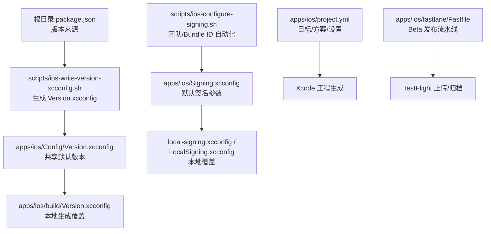
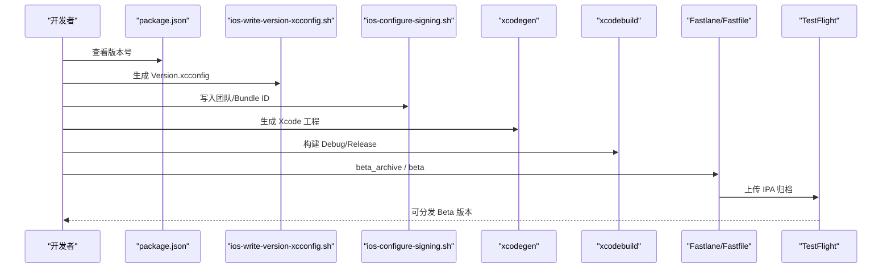
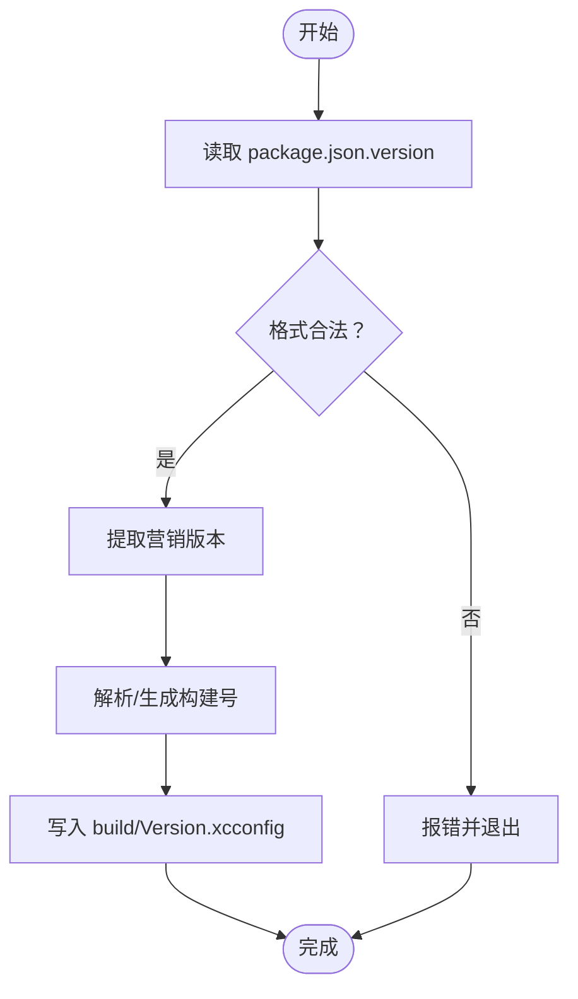
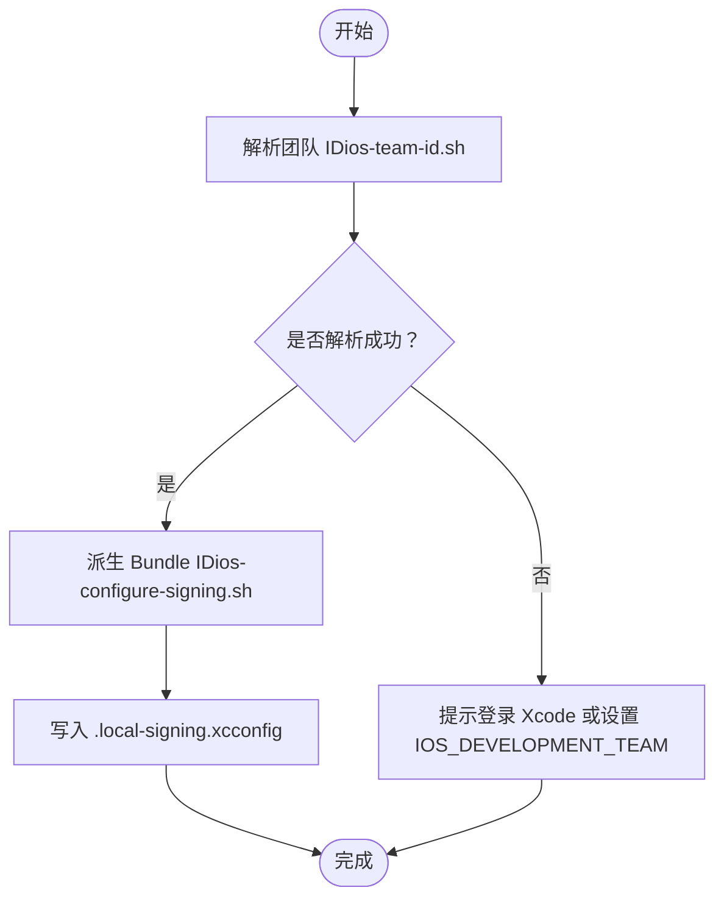
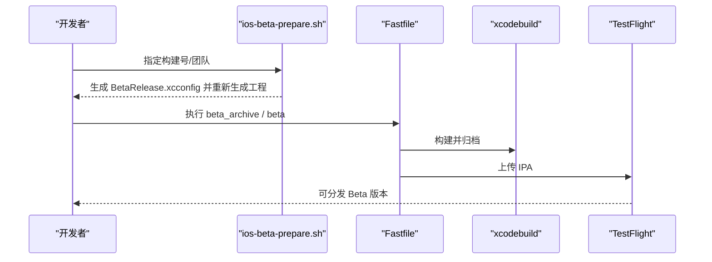
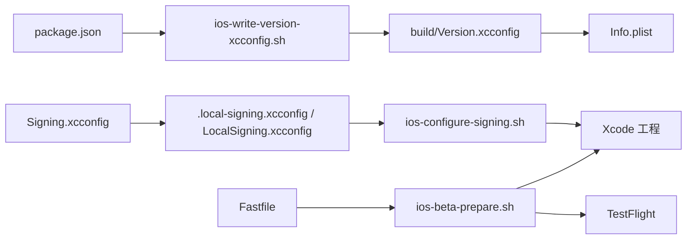

# 安装与配置

<cite>
**本文引用的文件**
- [apps/ios/README.md](file://apps/ios/README.md)
- [apps/ios/Signing.xcconfig](file://apps/ios/Signing.xcconfig)
- [apps/ios/LocalSigning.xcconfig.example](file://apps/ios/LocalSigning.xcconfig.example)
- [apps/ios/project.yml](file://apps/ios/project.yml)
- [apps/ios/Sources/OpenClaw.entitlements](file://apps/ios/Sources/OpenClaw.entitlements)
- [apps/ios/Sources/Info.plist](file://apps/ios/Sources/Info.plist)
- [apps/ios/Config/Version.xcconfig](file://apps/ios/Config/Version.xcconfig)
- [scripts/ios-configure-signing.sh](file://scripts/ios-configure-signing.sh)
- [scripts/ios-team-id.sh](file://scripts/ios-team-id.sh)
- [scripts/ios-write-version-xcconfig.sh](file://scripts/ios-write-version-xcconfig.sh)
- [scripts/ios-beta-prepare.sh](file://scripts/ios-beta-prepare.sh)
- [scripts/ios-asc-keychain-setup.sh](file://scripts/ios-asc-keychain-setup.sh)
- [scripts/ios-beta-release.sh](file://scripts/ios-beta-release.sh)
- [scripts/ios-beta-archive.sh](file://scripts/ios-beta-archive.sh)
- [apps/ios/fastlane/Fastfile](file://apps/ios/fastlane/Fastfile)
- [package.json](file://package.json)
</cite>

## 目录
1. [简介](#简介)
2. [项目结构](#项目结构)
3. [核心组件](#核心组件)
4. [架构总览](#架构总览)
5. [详细组件分析](#详细组件分析)
6. [依赖关系分析](#依赖关系分析)
7. [性能考虑](#性能考虑)
8. [故障排查指南](#故障排查指南)
9. [结论](#结论)
10. [附录](#附录)

## 简介
本文件面向在 iOS 平台上部署 OpenClaw 节点（role: node）的工程师与测试人员，提供从开发机到测试与生产的完整安装与配置指南。内容覆盖系统要求、前置条件检查、开发环境配置、签名与证书管理、首次启动流程、基础配置与网络设置、常见问题排查以及多场景部署策略。

## 项目结构
iOS 节点应用位于 apps/ios 目录，采用 Swift 6、Xcode 16、xcodegen 生成工程的方式组织。关键配置通过 xcconfig 文件与 Fastlane 脚本协同完成，版本号由根目录 package.json 提供并写入 iOS 构建配置。

图表来源
- [package.json:1-465](file://package.json#L1-L465)
- [scripts/ios-write-version-xcconfig.sh:1-100](file://scripts/ios-write-version-xcconfig.sh#L1-L100)
- [apps/ios/Config/Version.xcconfig:1-9](file://apps/ios/Config/Version.xcconfig#L1-L9)
- [apps/ios/Signing.xcconfig:1-23](file://apps/ios/Signing.xcconfig#L1-L23)
- [scripts/ios-configure-signing.sh:1-104](file://scripts/ios-configure-signing.sh#L1-L104)
- [apps/ios/project.yml:1-325](file://apps/ios/project.yml#L1-L325)
- [apps/ios/fastlane/Fastfile:1-319](file://apps/ios/fastlane/Fastfile#L1-L319)

章节来源
- [apps/ios/README.md:1-178](file://apps/ios/README.md#L1-L178)
- [apps/ios/project.yml:1-325](file://apps/ios/project.yml#L1-L325)

## 核心组件
- 版本与构建配置
  - 根版本号来源于 package.json，通过脚本写入 iOS 构建配置，确保营销版本与构建号一致。
- 签名与 Bundle ID
  - 默认签名参数由 Signing.xcconfig 提供；本地可使用 .local-signing.xcconfig 或 LocalSigning.xcconfig 进行覆盖。
  - 团队 ID 与 Bundle ID 可通过 ios-configure-signing.sh 自动推导或手动指定。
- 快递发布（Fastlane）
  - Fastfile 提供 Beta 归档与上传至 TestFlight 的自动化流程，支持从 Keychain 加载 ASC Key。
- 应用清单与权限
  - Info.plist 定义应用权限、后台模式、Bonjour 服务、URL Scheme 等。
  - entitlements 指定 APNs 环境（开发/生产）。

章节来源
- [package.json:1-465](file://package.json#L1-L465)
- [scripts/ios-write-version-xcconfig.sh:1-100](file://scripts/ios-write-version-xcconfig.sh#L1-L100)
- [apps/ios/Signing.xcconfig:1-23](file://apps/ios/Signing.xcconfig#L1-L23)
- [apps/ios/LocalSigning.xcconfig.example:1-16](file://apps/ios/LocalSigning.xcconfig.example#L1-L16)
- [scripts/ios-configure-signing.sh:1-104](file://scripts/ios-configure-signing.sh#L1-L104)
- [apps/ios/fastlane/Fastfile:1-319](file://apps/ios/fastlane/Fastfile#L1-L319)
- [apps/ios/Sources/Info.plist:1-97](file://apps/ios/Sources/Info.plist#L1-L97)
- [apps/ios/Sources/OpenClaw.entitlements:1-10](file://apps/ios/Sources/OpenClaw.entitlements#L1-L10)

## 架构总览
下图展示 iOS 节点从本地开发到 Beta 上架的关键路径：版本写入、签名配置、工程生成、构建与归档、TestFlight 上传。

图表来源
- [package.json:1-465](file://package.json#L1-L465)
- [scripts/ios-write-version-xcconfig.sh:1-100](file://scripts/ios-write-version-xcconfig.sh#L1-L100)
- [scripts/ios-configure-signing.sh:1-104](file://scripts/ios-configure-signing.sh#L1-L104)
- [apps/ios/project.yml:1-325](file://apps/ios/project.yml#L1-L325)
- [apps/ios/fastlane/Fastfile:1-319](file://apps/ios/fastlane/Fastfile#L1-L319)

## 详细组件分析

### 开发环境与系统要求
- Xcode 版本：16+
- 包管理：pnpm
- 工程生成工具：xcodegen
- 语言与并发：Swift 6 + 完全并发严格性
- 部署目标：iOS 18.0+

章节来源
- [apps/ios/project.yml:1-325](file://apps/ios/project.yml#L1-L325)

### 前置条件检查清单
- Xcode 已登录 Apple 账户并具备有效 Provisioning Profile
- 已安装并可执行的 Python（用于解析 Xcode 团队信息）
- 已安装 SwiftFormat、SwiftLint（工程内预构建脚本会校验）
- Keychain 中存在 App Store Connect API Key（Beta 流水线需要）

章节来源
- [scripts/ios-team-id.sh:1-208](file://scripts/ios-team-id.sh#L1-L208)
- [apps/ios/project.yml:61-86](file://apps/ios/project.yml#L61-L86)
- [apps/ios/fastlane/Fastfile:195-319](file://apps/ios/fastlane/Fastfile#L195-L319)

### 版本与构建配置
- 版本来源：根 package.json 的 version 字段
- 版本写入：ios-write-version-xcconfig.sh 将 gateway、marketing、build 三者写入 build/Version.xcconfig
- 版本规则：支持形如 2026.3.10 或 2026.3.10-beta.1 的格式
- 构建号回退：若未显式提供，回退为 git 提交计数

图表来源
- [scripts/ios-write-version-xcconfig.sh:1-100](file://scripts/ios-write-version-xcconfig.sh#L1-L100)
- [apps/ios/Config/Version.xcconfig:1-9](file://apps/ios/Config/Version.xcconfig#L1-L9)

章节来源
- [scripts/ios-write-version-xcconfig.sh:1-100](file://scripts/ios-write-version-xcconfig.sh#L1-L100)
- [apps/ios/Config/Version.xcconfig:1-9](file://apps/ios/Config/Version.xcconfig#L1-L9)

### 签名与证书管理
- 默认签名参数：Signing.xcconfig 提供团队 ID、Bundle ID、Provisioning Profile 规范
- 本地覆盖：.local-signing.xcconfig 与 LocalSigning.xcconfig 支持按个人开发者定制
- 团队 ID 解析：ios-team-id.sh 从 Xcode 偏好、旧键值、Keychain 等多源解析团队 ID
- Bundle ID 规则：支持自定义基座或基于用户名/团队的派生 ID
- 手动签名与自动签名：可通过环境变量控制代码签名样式与 Profile

图表来源
- [scripts/ios-team-id.sh:1-208](file://scripts/ios-team-id.sh#L1-L208)
- [scripts/ios-configure-signing.sh:1-104](file://scripts/ios-configure-signing.sh#L1-L104)
- [apps/ios/Signing.xcconfig:1-23](file://apps/ios/Signing.xcconfig#L1-L23)
- [apps/ios/LocalSigning.xcconfig.example:1-16](file://apps/ios/LocalSigning.xcconfig.example#L1-L16)

章节来源
- [scripts/ios-configure-signing.sh:1-104](file://scripts/ios-configure-signing.sh#L1-L104)
- [scripts/ios-team-id.sh:1-208](file://scripts/ios-team-id.sh#L1-L208)
- [apps/ios/Signing.xcconfig:1-23](file://apps/ios/Signing.xcconfig#L1-L23)
- [apps/ios/LocalSigning.xcconfig.example:1-16](file://apps/ios/LocalSigning.xcconfig.example#L1-L16)

### 工程生成与构建
- 使用 xcodegen 依据 project.yml 生成 Xcode 工程
- 目标包含主应用、分享扩展、活动挂件、Watch 应用与测试套件
- 设置项涵盖 Entitlements、Bundle ID、后台模式、权限描述等
- Info.plist 定义 URL Scheme、Bonjour 服务、权限文案、Live Activities 支持等

章节来源
- [apps/ios/project.yml:1-325](file://apps/ios/project.yml#L1-L325)
- [apps/ios/Sources/Info.plist:1-97](file://apps/ios/Sources/Info.plist#L1-L97)

### Beta 发布与 TestFlight 上传
- Fastfile 提供 beta_archive 与 beta 两条流水线
- 自动解析版本、生成 BetaRelease.xcconfig、调用 xcodebuild 归档
- 支持从 Keychain 读取 ASC Key，或通过文件/环境变量注入
- 可强制指定构建号，或自动递增

图表来源
- [scripts/ios-beta-prepare.sh:1-118](file://scripts/ios-beta-prepare.sh#L1-L118)
- [apps/ios/fastlane/Fastfile:195-319](file://apps/ios/fastlane/Fastfile#L195-L319)

章节来源
- [apps/ios/fastlane/Fastfile:1-319](file://apps/ios/fastlane/Fastfile#L1-L319)
- [scripts/ios-beta-prepare.sh:1-118](file://scripts/ios-beta-prepare.sh#L1-L118)

### 首次启动流程与基本配置
- 启动行为
  - 注册远程通知并在连接网关后上报 APNs Token
  - 通过 Bonjour 发现本地网关或手动输入主机端口
  - TLS 指纹信任提示仅在手动模式出现
- 基础配置
  - 在应用“设置 -> 网关”中查看状态、服务器地址与发现日志
  - 如需配对，先在 Telegram 执行配对批准命令，再重连
- 网络设置
  - 推荐使用本地网络发现；若不稳定，切换到手动主机/端口 + TLS 指纹确认

章节来源
- [apps/ios/README.md:89-178](file://apps/ios/README.md#L89-L178)
- [apps/ios/Sources/OpenClaw.entitlements:1-10](file://apps/ios/Sources/OpenClaw.entitlements#L1-L10)
- [apps/ios/Sources/Info.plist:47-50](file://apps/ios/Sources/Info.plist#L47-L50)

### 不同部署场景配置指南
- 开发调试
  - 使用 pnpm ios:open 或 ios:run 快速打开工程并运行到模拟器/真机
  - 保持自动签名与本地 Bundle ID，便于多人协作
- 测试验证（本地 Beta）
  - 使用 pnpm ios:beta:archive 生成本地归档
  - 使用 pnpm ios:beta 一键上传至 TestFlight
  - 可通过环境变量指定构建号或从 Keychain 自动解析 ASC Key
- 生产部署
  - 使用 Canonical Bundle ID 与自动签名策略
  - 通过 BetaRelease.xcconfig 统一签名参数，避免本地覆盖污染
  - 严格遵循版本号规范与构建号递增策略

章节来源
- [apps/ios/README.md:50-88](file://apps/ios/README.md#L50-L88)
- [apps/ios/fastlane/Fastfile:260-285](file://apps/ios/fastlane/Fastfile#L260-L285)
- [scripts/ios-beta-prepare.sh:96-109](file://scripts/ios-beta-prepare.sh#L96-L109)

## 依赖关系分析
- 版本依赖：package.json.version → ios-write-version-xcconfig.sh → build/Version.xcconfig → Info.plist
- 签名依赖：Signing.xcconfig → .local-signing.xcconfig/LocalSigning.xcconfig → ios-configure-signing.sh → Xcode 工程
- 发布依赖：Fastfile → ios-beta-prepare.sh → xcodegen/xcodebuild → TestFlight

图表来源
- [package.json:1-465](file://package.json#L1-L465)
- [scripts/ios-write-version-xcconfig.sh:1-100](file://scripts/ios-write-version-xcconfig.sh#L1-L100)
- [apps/ios/Config/Version.xcconfig:1-9](file://apps/ios/Config/Version.xcconfig#L1-L9)
- [apps/ios/Sources/Info.plist:1-97](file://apps/ios/Sources/Info.plist#L1-L97)
- [apps/ios/Signing.xcconfig:1-23](file://apps/ios/Signing.xcconfig#L1-L23)
- [apps/ios/LocalSigning.xcconfig.example:1-16](file://apps/ios/LocalSigning.xcconfig.example#L1-L16)
- [scripts/ios-configure-signing.sh:1-104](file://scripts/ios-configure-signing.sh#L1-L104)
- [apps/ios/fastlane/Fastfile:195-319](file://apps/ios/fastlane/Fastfile#L195-L319)
- [scripts/ios-beta-prepare.sh:1-118](file://scripts/ios-beta-prepare.sh#L1-L118)

章节来源
- [apps/ios/project.yml:1-325](file://apps/ios/project.yml#L1-L325)

## 性能考虑
- 前台优先：iOS 节点当前以前台使用为可靠模式，后台命令受限
- 位置事件：仅触发显著移动或地理围栏变更，避免持续高功耗轮询
- 资源影响：关注后台电池消耗与热状态，短期观察即可

章节来源
- [apps/ios/README.md:106-136](file://apps/ios/README.md#L106-L136)

## 故障排查指南
- 构建/签名基线
  - 重新生成工程（xcodegen generate），核对所选团队与 Bundle ID
- 网关连接
  - 在“设置 -> 网关”确认状态、服务器与远端地址
  - 若显示配对/认证阻塞，先在 Telegram 执行配对批准，再重连
- 发现日志
  - 启用“Discovery Debug Logs”，查看“设置 -> 网关 -> Discovery Logs”
- 手动连接
  - 切换到“手动主机/端口 + TLS 指纹”进行验证
- 日志过滤
  - 在 Xcode 控制台按子系统/类别过滤：ai.openclaw.ios、GatewayDiag、APNs registration failed
- 行为验证
  - 先在前台复现，再验证后台切回后的重连与恢复

章节来源
- [apps/ios/README.md:156-178](file://apps/ios/README.md#L156-L178)

## 结论
通过统一的版本写入、签名配置与 Fastlane 发布流水线，OpenClaw iOS 节点可在开发、测试与生产各阶段实现稳定交付。建议严格遵循团队 ID 与 Bundle ID 管理、版本号规范与构建号递增策略，并在前台优先的前提下进行功能验证与性能观察。

## 附录

### 安装与配置步骤（摘要）
- 开发机准备
  - 安装 Xcode 16+、pnpm、xcodegen
  - 登录 Xcode Apple 账户并确保有可用 Provisioning Profile
- 本地开发
  - 在仓库根执行安装与工程生成
  - 使用 pnpm ios:open 打开工程，选择设备与 Debug 配置运行
- 签名与 Bundle ID
  - 如需个性化，复制 LocalSigning.xcconfig.example 至 LocalSigning.xcconfig 并按需修改
  - 团队 ID 可通过 ios-team-id.sh 自动解析或直接设置环境变量
- 版本与构建
  - 通过 ios-write-version-xcconfig.sh 写入版本配置
  - 使用 xcodegen 生成工程，再执行 xcodebuild 构建
- Beta 发布
  - 使用 pnpm ios:beta:archive 生成本地归档
  - 使用 pnpm ios:beta 上传至 TestFlight，必要时配置 ASC Keychain

章节来源
- [apps/ios/README.md:18-48](file://apps/ios/README.md#L18-L48)
- [scripts/ios-configure-signing.sh:1-104](file://scripts/ios-configure-signing.sh#L1-L104)
- [scripts/ios-write-version-xcconfig.sh:1-100](file://scripts/ios-write-version-xcconfig.sh#L1-L100)
- [apps/ios/fastlane/Fastfile:260-285](file://apps/ios/fastlane/Fastfile#L260-L285)