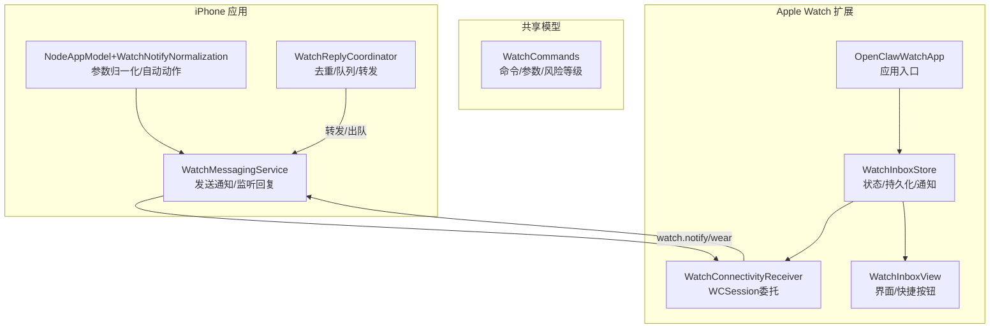
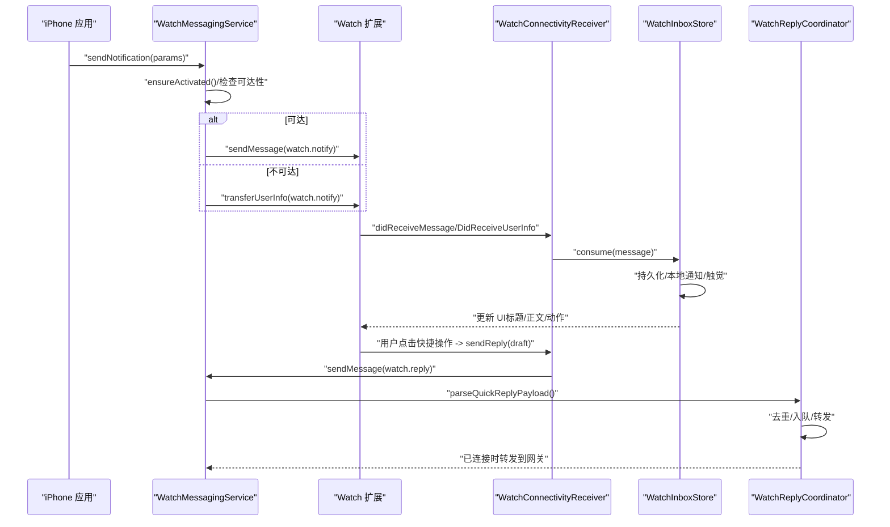
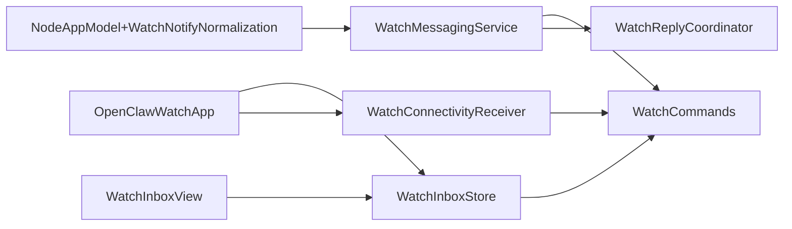

# 手表集成

<cite>
**本文引用的文件**
- [apps/ios/WatchExtension/Sources/OpenClawWatchApp.swift](file://apps/ios/WatchExtension/Sources/OpenClawWatchApp.swift)
- [apps/ios/WatchExtension/Sources/WatchConnectivityReceiver.swift](file://apps/ios/WatchExtension/Sources/WatchConnectivityReceiver.swift)
- [apps/ios/WatchExtension/Sources/WatchInboxStore.swift](file://apps/ios/WatchExtension/Sources/WatchInboxStore.swift)
- [apps/ios/WatchExtension/Sources/WatchInboxView.swift](file://apps/ios/WatchExtension/Sources/WatchInboxView.swift)
- [apps/ios/Sources/Services/WatchMessagingService.swift](file://apps/ios/Sources/Services/WatchMessagingService.swift)
- [apps/ios/Sources/Model/NodeAppModel+WatchNotifyNormalization.swift](file://apps/ios/Sources/Model/NodeAppModel+WatchNotifyNormalization.swift)
- [apps/ios/Sources/Model/WatchReplyCoordinator.swift](file://apps/ios/Sources/Model/WatchReplyCoordinator.swift)
- [apps/shared/OpenClawKit/Sources/OpenClawKit/WatchCommands.swift](file://apps/shared/OpenClawKit/Sources/OpenClawKit/WatchCommands.swift)
- [apps/ios/WatchExtension/Info.plist](file://apps/ios/WatchExtension/Info.plist)
- [apps/ios/WatchApp/Info.plist](file://apps/ios/WatchApp/Info.plist)
</cite>

## 目录
1. [简介](#简介)
2. [项目结构](#项目结构)
3. [核心组件](#核心组件)
4. [架构总览](#架构总览)
5. [组件详解](#组件详解)
6. [依赖关系分析](#依赖关系分析)
7. [性能与续航考量](#性能与续航考量)
8. [使用场景与限制](#使用场景与限制)
9. [故障排除指南](#故障排除指南)
10. [结论](#结论)

## 简介
本文件系统性阐述 OpenClaw 在 iOS 平台上的手表集成功能，覆盖 iPhone 与 Apple Watch 之间的消息传递机制、通知下发与快捷操作、手表端界面与交互、状态同步与持久化、以及配置项、性能优化与电池续航建议。目标是帮助开发者与用户全面理解手表功能的工作原理与最佳实践。

## 项目结构
手表集成由两部分组成：
- iPhone 端服务：负责向手表发送通知、解析手表回传的快速回复事件，并进行去重与队列管理。
- Apple Watch 端扩展：负责接收 iPhone 发来的通知、展示提示内容与快捷按钮、构造并发送快速回复。

图表来源
- [apps/ios/Sources/Services/WatchMessagingService.swift:24-293](file://apps/ios/Sources/Services/WatchMessagingService.swift#L24-L293)
- [apps/ios/Sources/Model/NodeAppModel+WatchNotifyNormalization.swift:4-104](file://apps/ios/Sources/Model/NodeAppModel+WatchNotifyNormalization.swift#L4-L104)
- [apps/ios/Sources/Model/WatchReplyCoordinator.swift:4-47](file://apps/ios/Sources/Model/WatchReplyCoordinator.swift#L4-L47)
- [apps/shared/OpenClawKit/Sources/OpenClawKit/WatchCommands.swift:3-96](file://apps/shared/OpenClawKit/Sources/OpenClawKit/WatchCommands.swift#L3-L96)
- [apps/ios/WatchExtension/Sources/OpenClawWatchApp.swift:4-29](file://apps/ios/WatchExtension/Sources/OpenClawWatchApp.swift#L4-L29)
- [apps/ios/WatchExtension/Sources/WatchConnectivityReceiver.swift:21-237](file://apps/ios/WatchExtension/Sources/WatchConnectivityReceiver.swift#L21-L237)
- [apps/ios/WatchExtension/Sources/WatchInboxStore.swift:26-231](file://apps/ios/WatchExtension/Sources/WatchInboxStore.swift#L26-L231)
- [apps/ios/WatchExtension/Sources/WatchInboxView.swift:3-65](file://apps/ios/WatchExtension/Sources/WatchInboxView.swift#L3-L65)

章节来源
- [apps/ios/WatchExtension/Sources/OpenClawWatchApp.swift:1-29](file://apps/ios/WatchExtension/Sources/OpenClawWatchApp.swift#L1-L29)
- [apps/ios/WatchExtension/Sources/WatchConnectivityReceiver.swift:1-237](file://apps/ios/WatchExtension/Sources/WatchConnectivityReceiver.swift#L1-L237)
- [apps/ios/WatchExtension/Sources/WatchInboxStore.swift:1-231](file://apps/ios/WatchExtension/Sources/WatchInboxStore.swift#L1-L231)
- [apps/ios/WatchExtension/Sources/WatchInboxView.swift:1-65](file://apps/ios/WatchExtension/Sources/WatchInboxView.swift#L1-L65)
- [apps/ios/Sources/Services/WatchMessagingService.swift:1-293](file://apps/ios/Sources/Services/WatchMessagingService.swift#L1-L293)
- [apps/ios/Sources/Model/NodeAppModel+WatchNotifyNormalization.swift:1-104](file://apps/ios/Sources/Model/NodeAppModel+WatchNotifyNormalization.swift#L1-L104)
- [apps/ios/Sources/Model/WatchReplyCoordinator.swift:1-47](file://apps/ios/Sources/Model/WatchReplyCoordinator.swift#L1-L47)
- [apps/shared/OpenClawKit/Sources/OpenClawKit/WatchCommands.swift:1-96](file://apps/shared/OpenClawKit/Sources/OpenClawKit/WatchCommands.swift#L1-L96)
- [apps/ios/WatchExtension/Info.plist:1-33](file://apps/ios/WatchExtension/Info.plist#L1-L33)
- [apps/ios/WatchApp/Info.plist:1-29](file://apps/ios/WatchApp/Info.plist#L1-L29)

## 核心组件
- iPhone 端服务（WatchMessagingService）
  - 负责 WCSession 激活、状态查询、通知发送、快速回复事件接收与派发。
  - 支持“立即发送”与“用户信息传输”两种路径，具备错误兜底与日志记录。
- 参数归一化（NodeAppModel+WatchNotifyNormalization）
  - 对标题/正文/字段做裁剪与空值处理；根据优先级或风险自动推导另一者；自动注入快捷动作。
- 快速回复协调器（WatchReplyCoordinator）
  - 去重、缺失字段丢弃、网关断连时入队、连接恢复后出队转发。
- Watch 端扩展（OpenClawWatchApp + WatchConnectivityReceiver + WatchInboxStore + WatchInboxView）
  - 接收通知、本地持久化、触发本地通知与触觉反馈、构造回复草稿并通过 WCSession 发送。
- 共享模型（OpenClawKit/WatchCommands）
  - 定义 watch 命令类型、通知参数结构、风险等级、状态快照等。

章节来源
- [apps/ios/Sources/Services/WatchMessagingService.swift:24-293](file://apps/ios/Sources/Services/WatchMessagingService.swift#L24-L293)
- [apps/ios/Sources/Model/NodeAppModel+WatchNotifyNormalization.swift:4-104](file://apps/ios/Sources/Model/NodeAppModel+WatchNotifyNormalization.swift#L4-L104)
- [apps/ios/Sources/Model/WatchReplyCoordinator.swift:4-47](file://apps/ios/Sources/Model/WatchReplyCoordinator.swift#L4-L47)
- [apps/ios/WatchExtension/Sources/OpenClawWatchApp.swift:4-29](file://apps/ios/WatchExtension/Sources/OpenClawWatchApp.swift#L4-L29)
- [apps/ios/WatchExtension/Sources/WatchConnectivityReceiver.swift:21-237](file://apps/ios/WatchExtension/Sources/WatchConnectivityReceiver.swift#L21-L237)
- [apps/ios/WatchExtension/Sources/WatchInboxStore.swift:26-231](file://apps/ios/WatchExtension/Sources/WatchInboxStore.swift#L26-L231)
- [apps/ios/WatchExtension/Sources/WatchInboxView.swift:3-65](file://apps/ios/WatchExtension/Sources/WatchInboxView.swift#L3-L65)
- [apps/shared/OpenClawKit/Sources/OpenClawKit/WatchCommands.swift:3-96](file://apps/shared/OpenClawKit/Sources/OpenClawKit/WatchCommands.swift#L3-L96)

## 架构总览
下图展示了 iPhone 与 Apple Watch 的消息流：iPhone 侧发送 watch.notify，Watch 侧接收并展示；用户在手表上点击快捷操作后，手表构造 watch.reply 并通过 WCSession 回传 iPhone，iPhone 侧进行去重与队列管理后再转发到网关。

图表来源
- [apps/ios/Sources/Services/WatchMessagingService.swift:77-146](file://apps/ios/Sources/Services/WatchMessagingService.swift#L77-L146)
- [apps/ios/WatchExtension/Sources/WatchConnectivityReceiver.swift:201-235](file://apps/ios/WatchExtension/Sources/WatchConnectivityReceiver.swift#L201-L235)
- [apps/ios/WatchExtension/Sources/WatchInboxStore.swift:71-106](file://apps/ios/WatchExtension/Sources/WatchInboxStore.swift#L71-L106)
- [apps/ios/Sources/Model/WatchReplyCoordinator.swift:15-30](file://apps/ios/Sources/Model/WatchReplyCoordinator.swift#L15-L30)

## 组件详解

### iPhone 端服务：WatchMessagingService
- 功能要点
  - WCSession 生命周期管理：支持检测、激活、状态快照、可达性变化回调。
  - 发送通知：构建 watch.notify 载荷，优先使用 sendMessage，失败则回退 transferUserInfo。
  - 接收快速回复：统一解析 watch.reply，按 transport 分类，派发给上层处理器。
  - 错误与日志：对不可用、未配对、手表应用未安装等场景返回明确错误码。
- 关键行为
  - 状态查询：currentStatusSnapshot/status 返回 supported/paired/appInstalled/reachable/activationState。
  - 激活等待：内部维护 continuation 队列，确保调用不会永久阻塞。
  - 日志：记录激活状态与错误，便于诊断。

章节来源
- [apps/ios/Sources/Services/WatchMessagingService.swift:24-293](file://apps/ios/Sources/Services/WatchMessagingService.swift#L24-L293)

### 参数归一化：NodeAppModel+WatchNotifyNormalization
- 功能要点
  - 字段裁剪与空值处理：title/body/promptId/sessionKey/kind/details 去除空白并转为空。
  - 优先级与风险互推：若仅提供其一，则按规则推导另一者，保证策略一致性。
  - 自动动作注入：当存在 promptId 且无显式动作时，按 kind 关键词自动插入一组动作（如审批类/一般提醒），最多 4 个。
- 设计动机
  - 降低调用方负担，提升跨平台一致性与可用性。

章节来源
- [apps/ios/Sources/Model/NodeAppModel+WatchNotifyNormalization.swift:4-104](file://apps/ios/Sources/Model/NodeAppModel+WatchNotifyNormalization.swift#L4-L104)

### 快速回复协调器：WatchReplyCoordinator
- 功能要点
  - 去重：基于 replyId 去重，避免重复处理。
  - 缺失字段丢弃：replyId 或 actionId 为空直接丢弃。
  - 断连入队：网关未连接时暂存，连接恢复后顺序出队。
  - 记录统计：暴露 queuedCount 供 UI 或监控使用。
- 使用建议
  - 结合 WatchMessagingService 的状态快照，动态调整 UI 提示与重试策略。

章节来源
- [apps/ios/Sources/Model/WatchReplyCoordinator.swift:4-47](file://apps/ios/Sources/Model/WatchReplyCoordinator.swift#L4-L47)

### Watch 端扩展：OpenClawWatchApp
- 功能要点
  - 应用入口：初始化 WatchInboxStore 与 WatchConnectivityReceiver，启动会话。
  - 任务驱动：首次进入时激活会话；将快捷操作回调封装为发送回复草稿并调用 receiver 发送。
  - 主线程更新：通过 @MainActor 更新 UI 与状态。
- 交互流程
  - 初始化 -> 激活会话 -> 接收通知 -> 展示快捷按钮 -> 用户点击 -> 发送回复 -> 更新状态。

章节来源
- [apps/ios/WatchExtension/Sources/OpenClawWatchApp.swift:4-29](file://apps/ios/WatchExtension/Sources/OpenClawWatchApp.swift#L4-L29)

### Watch 端扩展：WatchConnectivityReceiver
- 功能要点
  - WCSession 委托：实现 didReceiveMessage/didReceiveUserInfo/didReceiveApplicationContext，统一解析 watch.notify。
  - 发送回复：构造 watch.reply 草稿，优先 sendMessage，否则 transferUserInfo，并返回结果（立即送达/排队）。
  - 会话保障：ensureActivated 确保激活，超时保护。
- 数据结构
  - WatchReplyDraft/WatchReplySendResult：承载回复草稿与发送结果。
  - 解析工具：parseNotificationPayload/parseActions，保证健壮性与兼容性。

章节来源
- [apps/ios/WatchExtension/Sources/WatchConnectivityReceiver.swift:21-237](file://apps/ios/WatchExtension/Sources/WatchConnectivityReceiver.swift#L21-L237)

### Watch 端扩展：WatchInboxStore
- 功能要点
  - 观察态存储：@Observable 管理 UI 状态（标题/正文/动作/回复状态）。
  - 持久化：UserDefaults 存储最近一次通知与回复状态，重启后可恢复。
  - 通知与触觉：收到新通知后触发本地通知与触觉反馈（低/中/高风险映射不同触觉）。
  - 回复状态：标记发送中/发送结果，支持 UI 即时反馈。
- 关键算法
  - deliveryKey：基于消息 ID 或内容摘要生成去重键，避免重复展示。
  - 权限请求：首次自动申请通知权限。

章节来源
- [apps/ios/WatchExtension/Sources/WatchInboxStore.swift:26-231](file://apps/ios/WatchExtension/Sources/WatchInboxStore.swift#L26-L231)

### Watch 端扩展：WatchInboxView
- 功能要点
  - 展示：标题/正文/详情；支持多行自适应；显示更新时间。
  - 快捷按钮：根据 action.style 映射为 destructive/cancel；禁用发送中状态。
  - 回复状态：显示发送中/成功/失败文案。
- 交互约束
  - 发送中禁用按钮，防止并发提交。

章节来源
- [apps/ios/WatchExtension/Sources/WatchInboxView.swift:3-65](file://apps/ios/WatchExtension/Sources/WatchInboxView.swift#L3-L65)

### 共享模型：OpenClawKit/WatchCommands
- 功能要点
  - 命令枚举：watch.status/watch.notify。
  - 参数结构：OpenClawWatchNotifyParams（标题/正文/优先级/会话键/风险/动作等）。
  - 风险等级：low/medium/high。
  - 状态快照：WatchMessagingStatus（supported/paired/appInstalled/reachable/activationState）。
- 作用
  - 统一 iPhone 与 Watch 两端的数据契约，确保序列化/反序列化一致。

章节来源
- [apps/shared/OpenClawKit/Sources/OpenClawKit/WatchCommands.swift:3-96](file://apps/shared/OpenClawKit/Sources/OpenClawKit/WatchCommands.swift#L3-L96)

## 依赖关系分析
- 组件耦合
  - iPhone 端服务与 Watch 端扩展通过 WCSession 强耦合，消息格式由共享模型统一约束。
  - Watch 端扩展内部模块（Store/View/Receiver）低耦合，职责清晰。
- 外部依赖
  - WatchConnectivity：会话建立、消息与用户信息传输、应用上下文。
  - UserNotifications：本地通知触发。
  - Observation：状态变更驱动 UI。
- 循环依赖
  - 未发现循环导入；各模块单向依赖共享模型。

图表来源
- [apps/ios/Sources/Services/WatchMessagingService.swift:24-293](file://apps/ios/Sources/Services/WatchMessagingService.swift#L24-L293)
- [apps/ios/WatchExtension/Sources/WatchConnectivityReceiver.swift:21-237](file://apps/ios/WatchExtension/Sources/WatchConnectivityReceiver.swift#L21-L237)
- [apps/ios/WatchExtension/Sources/WatchInboxStore.swift:26-231](file://apps/ios/WatchExtension/Sources/WatchInboxStore.swift#L26-L231)
- [apps/ios/WatchExtension/Sources/WatchInboxView.swift:3-65](file://apps/ios/WatchExtension/Sources/WatchInboxView.swift#L3-L65)
- [apps/ios/WatchExtension/Sources/OpenClawWatchApp.swift:4-29](file://apps/ios/WatchExtension/Sources/OpenClawWatchApp.swift#L4-L29)
- [apps/ios/Sources/Model/WatchReplyCoordinator.swift:4-47](file://apps/ios/Sources/Model/WatchReplyCoordinator.swift#L4-L47)
- [apps/ios/Sources/Model/NodeAppModel+WatchNotifyNormalization.swift:4-104](file://apps/ios/Sources/Model/NodeAppModel+WatchNotifyNormalization.swift#L4-L104)
- [apps/shared/OpenClawKit/Sources/OpenClawKit/WatchCommands.swift:3-96](file://apps/shared/OpenClawKit/Sources/OpenClawKit/WatchCommands.swift#L3-L96)

## 性能与续航考量
- 会话激活与等待
  - 确保会话处于 activated 状态再发送消息，避免不必要的失败与重试。
  - 使用内部 continuation 队列避免调用方阻塞。
- 传输路径选择
  - 优先 sendMessage，失败再 transferUserInfo；前者即时、后者适合离线/后台场景。
- 通知与触觉
  - 本地通知触发间隔较短（秒级），避免频繁触发；触觉按风险映射，避免高频高冲击。
- 持久化与去重
  - deliveryKey 基于消息 ID 或内容摘要，减少重复展示与重复处理。
- UI 响应
  - 发送中禁用按钮，避免无效网络开销；及时更新状态文本，降低用户等待焦虑。

[本节为通用指导，无需列出章节来源]

## 使用场景与限制
- 典型场景
  - 网关告警/提醒：带风险等级与快捷操作，手表端快速批准/延后/打开手机。
  - 会话提示：带 promptId 的决策流，自动注入 Approve/Decline 等动作。
  - 一般提醒：默认注入 Done/Snooze/Escalate 等动作。
- 限制条件
  - 设备能力：需支持 WatchConnectivity；需配对且手表端应用已安装。
  - 可达性：若手表不可达，通知将排队等待后续可达时传输。
  - 动作数量：最多 4 个，超出将截断。
  - 字段长度：标题/正文/字段均会裁剪空白，空值将被忽略。
- 交互约束
  - 发送中禁用按钮；失败时显示错误信息；成功后短暂提示。

[本节为概念性说明，无需列出章节来源]

## 故障排除指南
- 常见错误与定位
  - WATCH_UNAVAILABLE：设备不支持 WatchConnectivity、未配对、手表应用未安装。
  - 无法发送：检查 session.reachable 与 activationState；确认 iPhone 已激活会话。
  - 无响应：确认 Watch 端已激活会话并正确设置 delegate。
- 诊断步骤
  - 获取状态快照：调用 currentStatusSnapshot/status，检查 supported/paired/appInstalled/reachable。
  - 查看日志：关注激活状态与错误日志输出。
  - 本地通知：确认通知权限已授权；检查 threadIdentifier 是否一致。
- 修复建议
  - 重新配对与安装手表应用；确保手表与 iPhone 连接稳定。
  - 在 UI 中显示 queuedCount，提示用户稍后重试或打开 iPhone。
  - 对于重复问题，检查 deliveryKey 与去重逻辑是否生效。

章节来源
- [apps/ios/Sources/Services/WatchMessagingService.swift:6-21](file://apps/ios/Sources/Services/WatchMessagingService.swift#L6-L21)
- [apps/ios/Sources/Services/WatchMessagingService.swift:47-71](file://apps/ios/Sources/Services/WatchMessagingService.swift#L47-L71)
- [apps/ios/WatchExtension/Sources/WatchInboxStore.swift:159-168](file://apps/ios/WatchExtension/Sources/WatchInboxStore.swift#L159-L168)

## 结论
OpenClaw 的手表集成功能以 WatchConnectivity 为核心，结合共享模型与 Watch 扩展，实现了从 iPhone 到 Apple Watch 的可靠通知分发与快速回复回传。通过参数归一化、自动动作注入、去重与队列管理，系统在易用性与稳定性之间取得平衡。遵循本文的配置、性能与故障排除建议，可在真实环境中获得更佳的用户体验与更低的能耗。