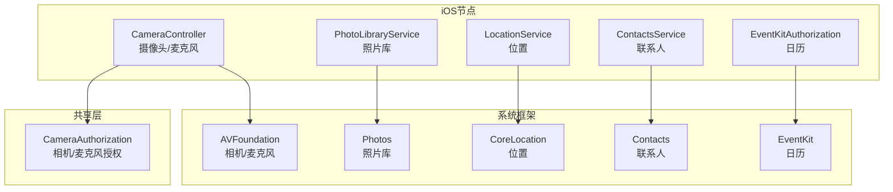
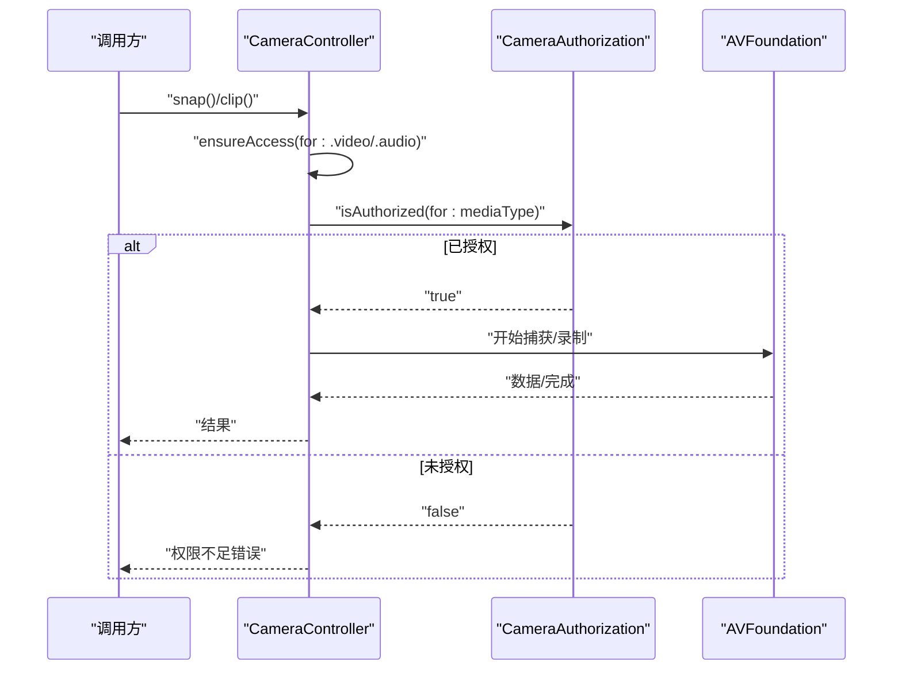
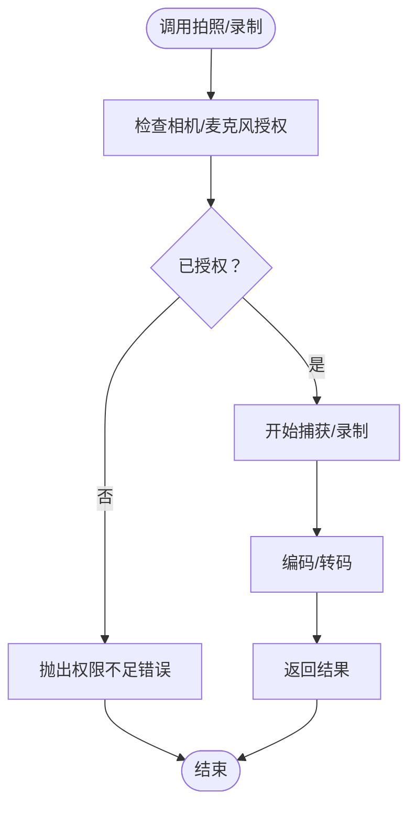
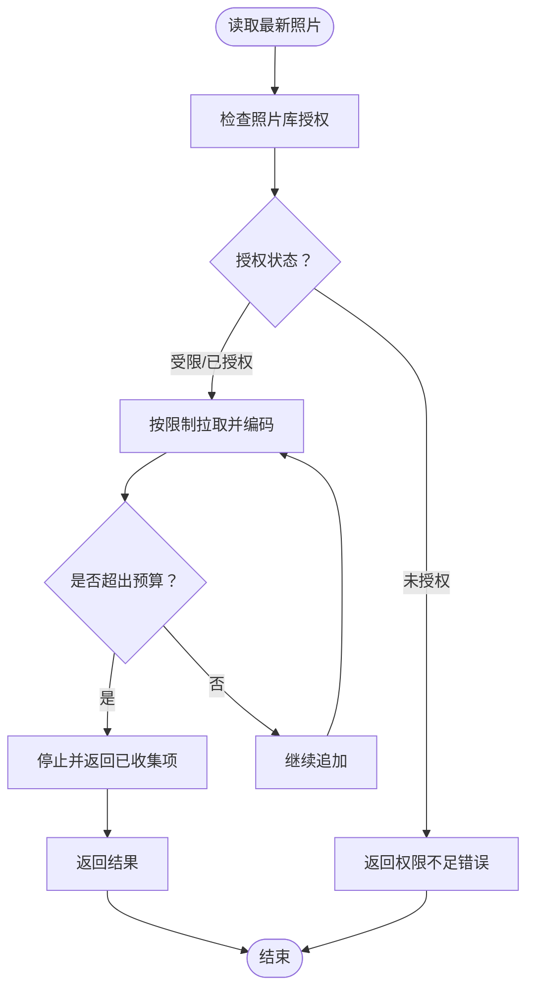
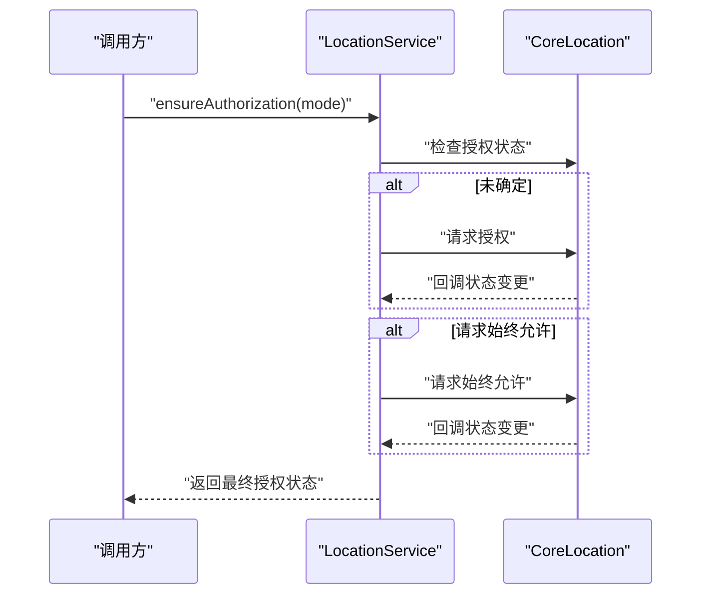
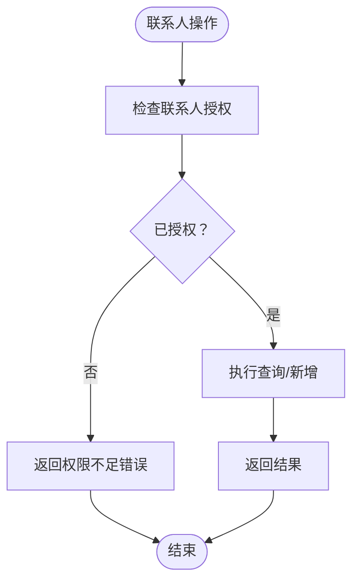
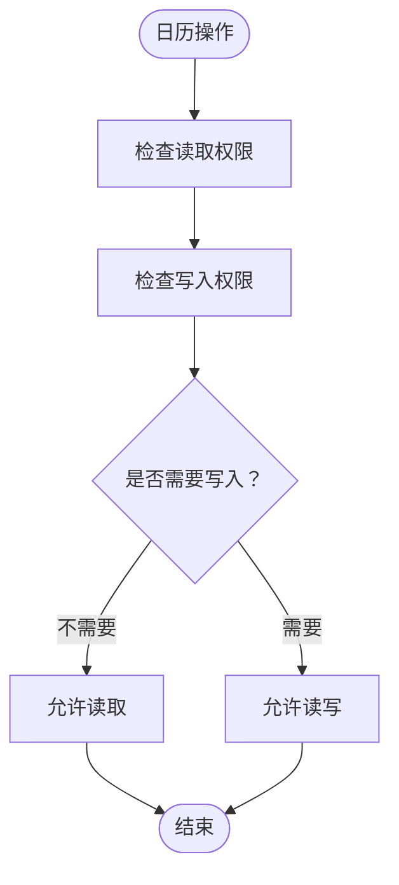
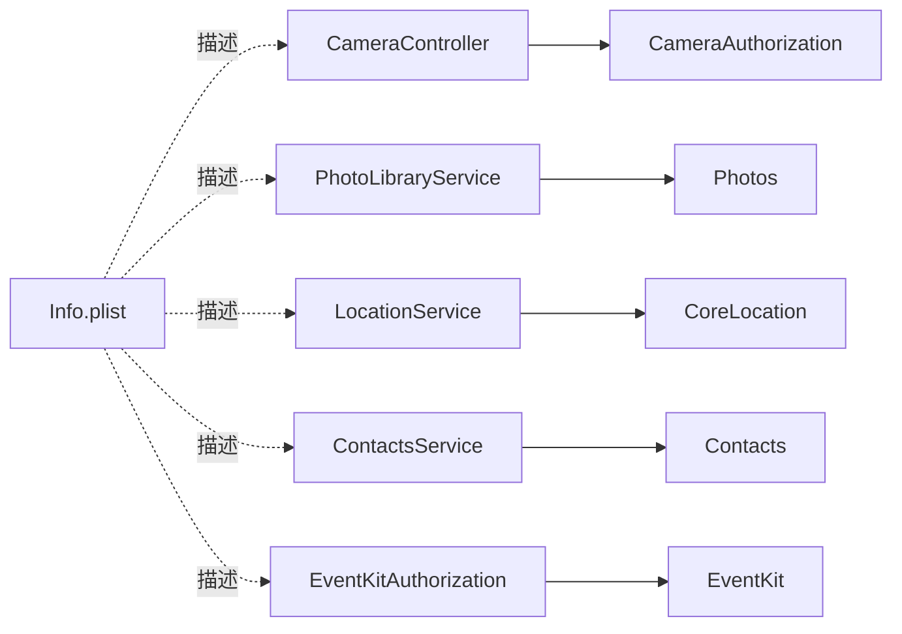

# 权限管理

<cite>
**本文引用的文件**
- [CameraController.swift](file://apps/ios/Sources/Camera/CameraController.swift)
- [PhotoLibraryService.swift](file://apps/ios/Sources/Media/PhotoLibraryService.swift)
- [LocationService.swift](file://apps/ios/Sources/Location/LocationService.swift)
- [ContactsService.swift](file://apps/ios/Sources/Contacts/ContactsService.swift)
- [EventKitAuthorization.swift](file://apps/ios/Sources/EventKit/EventKitAuthorization.swift)
- [CameraAuthorization.swift](file://apps/shared/OpenClawKit/Sources/OpenClawKit/CameraAuthorization.swift)
- [Info.plist](file://apps/ios/Sources/Info.plist)
</cite>

## 目录
1. [简介](#简介)
2. [项目结构](#项目结构)
3. [核心组件](#核心组件)
4. [架构总览](#架构总览)
5. [详细组件分析](#详细组件分析)
6. [依赖关系分析](#依赖关系分析)
7. [性能考量](#性能考量)
8. [故障排查指南](#故障排查指南)
9. [结论](#结论)
10. [附录](#附录)

## 简介
本文件面向OpenClaw iOS节点的权限管理体系，系统化梳理相机、麦克风、相册（照片库）、位置、联系人、日历等权限的申请、授权状态检查、使用时机与变更处理机制。文档同时给出权限缺失对功能的影响、降级策略、用户体验优化建议以及常见问题的诊断与修复路径，帮助开发者在保证隐私合规的前提下实现稳定可靠的权限交互。

## 项目结构
围绕权限管理的关键代码分布在以下模块：
- 摄像头与麦克风：通过统一的授权入口进行检查与请求，并在调用前确保具备相应权限。
- 照片库：在读取媒体时进行授权状态校验，避免在无权限情况下触发阻塞式弹窗。
- 位置服务：根据模式（使用时或始终允许）发起授权请求，并支持一次性定位与持续位置流。
- 联系人：在查询与新增联系人前进行授权校验，避免在无权限时阻塞RPC调用。
- 日历：基于授权状态判断读写能力，避免在RPC调用中触发弹窗。
- 应用清单与描述：在Info.plist中声明各权限用途说明，满足App Store审核与透明度要求。

**图表来源**
- [CameraController.swift:1-354](file://apps/ios/Sources/Camera/CameraController.swift#L1-L354)
- [PhotoLibraryService.swift:1-165](file://apps/ios/Sources/Media/PhotoLibraryService.swift#L1-L165)
- [LocationService.swift:1-179](file://apps/ios/Sources/Location/LocationService.swift#L1-L179)
- [ContactsService.swift:1-211](file://apps/ios/Sources/Contacts/ContactsService.swift#L1-L211)
- [EventKitAuthorization.swift:1-35](file://apps/ios/Sources/EventKit/EventKitAuthorization.swift#L1-L35)
- [CameraAuthorization.swift:1-22](file://apps/shared/OpenClawKit/Sources/OpenClawKit/CameraAuthorization.swift#L1-L22)

**章节来源**
- [CameraController.swift:1-354](file://apps/ios/Sources/Camera/CameraController.swift#L1-L354)
- [PhotoLibraryService.swift:1-165](file://apps/ios/Sources/Media/PhotoLibraryService.swift#L1-L165)
- [LocationService.swift:1-179](file://apps/ios/Sources/Location/LocationService.swift#L1-L179)
- [ContactsService.swift:1-211](file://apps/ios/Sources/Contacts/ContactsService.swift#L1-L211)
- [EventKitAuthorization.swift:1-35](file://apps/ios/Sources/EventKit/EventKitAuthorization.swift#L1-L35)
- [CameraAuthorization.swift:1-22](file://apps/shared/OpenClawKit/Sources/OpenClawKit/CameraAuthorization.swift#L1-L22)
- [Info.plist:1-97](file://apps/ios/Sources/Info.plist#L1-L97)

## 核心组件
- 相机/麦克风授权入口：统一检查并按需请求授权，避免在RPC调用过程中弹窗导致超时。
- 照片库访问：在读取最新照片前检查授权状态，限制单次与总量的传输大小，保障网关通信稳定性。
- 位置服务：根据使用模式决定是否请求“始终允许”，支持一次性定位与持续位置流。
- 联系人服务：在查询与新增联系人前进行授权校验，避免阻塞RPC调用。
- 日历授权：区分读取与写入权限，避免在RPC调用中触发弹窗。
- 应用清单描述：为各项权限提供清晰的用途说明，满足审核与隐私透明要求。

**章节来源**
- [CameraAuthorization.swift:1-22](file://apps/shared/OpenClawKit/Sources/OpenClawKit/CameraAuthorization.swift#L1-L22)
- [PhotoLibraryService.swift:1-165](file://apps/ios/Sources/Media/PhotoLibraryService.swift#L1-L165)
- [LocationService.swift:1-179](file://apps/ios/Sources/Location/LocationService.swift#L1-L179)
- [ContactsService.swift:1-211](file://apps/ios/Sources/Contacts/ContactsService.swift#L1-L211)
- [EventKitAuthorization.swift:1-35](file://apps/ios/Sources/EventKit/EventKitAuthorization.swift#L1-L35)
- [Info.plist:51-66](file://apps/ios/Sources/Info.plist#L51-L66)

## 架构总览
权限管理遵循“前置校验、按需请求、降级处理、可观测更新”的设计原则。调用方在执行敏感操作前先检查授权状态；若未授权且可请求，则发起一次性的授权请求；若不可请求（如在RPC调用中），则返回明确错误并引导用户前往设置页手动授权。位置服务支持一次性定位与持续位置流，日历授权区分读写能力，照片库访问受传输预算约束以避免网关断连。

**图表来源**
- [CameraController.swift:154-158](file://apps/ios/Sources/Camera/CameraController.swift#L154-L158)
- [CameraAuthorization.swift:4-20](file://apps/shared/OpenClawKit/Sources/OpenClawKit/CameraAuthorization.swift#L4-L20)

**章节来源**
- [CameraController.swift:154-158](file://apps/ios/Sources/Camera/CameraController.swift#L154-L158)
- [CameraAuthorization.swift:4-20](file://apps/shared/OpenClawKit/Sources/OpenClawKit/CameraAuthorization.swift#L4-L20)

## 详细组件分析

### 相机与麦克风权限
- 授权入口：通过统一的授权检查函数判断当前授权状态，必要时发起一次性授权请求。
- 使用时机：在拍照或录制视频前调用，确保具备相应媒体类型权限；若缺少麦克风权限但需要音频，会显式抛出权限不足错误。
- 错误处理：将权限拒绝映射为可识别的错误类型，便于上层提示与降级。
- 性能与体验：避免在RPC调用中弹窗，防止超时；默认参数（如最大宽度、质量）兼顾画质与传输效率。

**图表来源**
- [CameraController.swift:154-158](file://apps/ios/Sources/Camera/CameraController.swift#L154-L158)
- [CameraAuthorization.swift:4-20](file://apps/shared/OpenClawKit/Sources/OpenClawKit/CameraAuthorization.swift#L4-L20)

**章节来源**
- [CameraController.swift:1-354](file://apps/ios/Sources/Camera/CameraController.swift#L1-L354)
- [CameraAuthorization.swift:1-22](file://apps/shared/OpenClawKit/Sources/OpenClawKit/CameraAuthorization.swift#L1-L22)

### 照片库权限
- 授权检查：在读取最新照片前检查授权状态，支持“完全访问”和“有限访问”两种可用状态。
- 数据裁剪：严格控制单张与总字节数预算，避免大尺寸base64导致网关连接断开。
- 失败处理：当授权不足或加载失败时返回明确错误，便于前端提示与重试策略。

**图表来源**
- [PhotoLibraryService.swift:16-55](file://apps/ios/Sources/Media/PhotoLibraryService.swift#L16-L55)

**章节来源**
- [PhotoLibraryService.swift:1-165](file://apps/ios/Sources/Media/PhotoLibraryService.swift#L1-L165)

### 位置权限
- 授权模式：支持“使用时”和“始终允许”两种模式；若请求“始终允许”而当前为“使用时”，将触发升级授权流程。
- 一次性定位：封装超时与年龄过滤逻辑，提升定位稳定性。
- 持续位置流：支持显著位置变化与常规更新，自动管理生命周期并在终止时清理资源。
- 授权变更：通过委托回调通知授权状态变化，确保后续操作及时响应。

**图表来源**
- [LocationService.swift:34-54](file://apps/ios/Sources/Location/LocationService.swift#L34-L54)

**章节来源**
- [LocationService.swift:1-179](file://apps/ios/Sources/Location/LocationService.swift#L1-L179)

### 联系人权限
- 授权校验：在查询与新增联系人前进行授权检查，避免在RPC调用中触发弹窗。
- 查询与新增：支持名称、组织、电话与邮箱的组合查询与去重匹配，新增时优先复用现有联系人。
- 错误处理：当输入不合法或无权限时返回明确错误，便于前端引导用户授权。

**图表来源**
- [ContactsService.swift:116-126](file://apps/ios/Sources/Contacts/ContactsService.swift#L116-L126)

**章节来源**
- [ContactsService.swift:1-211](file://apps/ios/Sources/Contacts/ContactsService.swift#L1-L211)

### 日历权限
- 读写分离：区分仅读取与完整访问/写入权限，避免在RPC调用中触发弹窗。
- 授权策略：在未确定状态下不主动弹窗，交由上层引导用户前往设置页授权。

**图表来源**
- [EventKitAuthorization.swift:4-32](file://apps/ios/Sources/EventKit/EventKitAuthorization.swift#L4-L32)

**章节来源**
- [EventKitAuthorization.swift:1-35](file://apps/ios/Sources/EventKit/EventKitAuthorization.swift#L1-L35)

## 依赖关系分析
- 组件内聚：各权限模块职责单一，均通过统一的授权入口或状态检查函数进行前置校验。
- 组件耦合：相机/麦克风授权依赖共享层；照片库、联系人、日历分别依赖对应系统框架；位置服务依赖CoreLocation。
- 外部依赖：Info.plist中的权限用途描述用于App Store审核与隐私透明度要求。
- 循环依赖：未发现循环依赖迹象，模块间通过协议与接口进行解耦。

**图表来源**
- [CameraController.swift:1-354](file://apps/ios/Sources/Camera/CameraController.swift#L1-L354)
- [PhotoLibraryService.swift:1-165](file://apps/ios/Sources/Media/PhotoLibraryService.swift#L1-L165)
- [LocationService.swift:1-179](file://apps/ios/Sources/Location/LocationService.swift#L1-L179)
- [ContactsService.swift:1-211](file://apps/ios/Sources/Contacts/ContactsService.swift#L1-L211)
- [EventKitAuthorization.swift:1-35](file://apps/ios/Sources/EventKit/EventKitAuthorization.swift#L1-L35)
- [Info.plist:51-66](file://apps/ios/Sources/Info.plist#L51-L66)

**章节来源**
- [Info.plist:51-66](file://apps/ios/Sources/Info.plist#L51-L66)

## 性能考量
- 传输预算：照片库读取严格控制单张与总字节数预算，避免大尺寸base64导致网关断连。
- 默认参数：相机/录制默认最大宽度与质量兼顾画质与传输效率，减少RPC负载。
- 异步与超时：位置服务支持超时控制与一次性定位，避免长时间占用资源。
- 资源释放：录制完成后及时清理临时文件，避免磁盘与内存压力。

[本节为通用性能建议，无需特定文件引用]

## 故障排查指南
- 相机/麦克风权限不足
  - 现象：拍照/录制报错，提示权限不足。
  - 排查：确认授权状态；避免在RPC调用中触发弹窗；引导用户前往设置页授权。
  - 参考路径：[CameraController.swift:154-158](file://apps/ios/Sources/Camera/CameraController.swift#L154-L158)、[CameraAuthorization.swift:4-20](file://apps/shared/OpenClawKit/Sources/OpenClawKit/CameraAuthorization.swift#L4-L20)

- 照片库权限不足或额度超限
  - 现象：读取最新照片失败或提前终止。
  - 排查：检查授权状态；降低最大宽度或质量；减少返回数量。
  - 参考路径：[PhotoLibraryService.swift:16-55](file://apps/ios/Sources/Media/PhotoLibraryService.swift#L16-L55)

- 位置服务不可用或超时
  - 现象：定位失败或超时。
  - 排查：确认位置服务开关与授权模式；调整精度与超时参数；检查后台定位权限。
  - 参考路径：[LocationService.swift:34-54](file://apps/ios/Sources/Location/LocationService.swift#L34-L54)

- 联系人权限不足
  - 现象：查询/新增联系人失败。
  - 排查：确认授权状态；检查输入合法性；避免在RPC调用中触发弹窗。
  - 参考路径：[ContactsService.swift:116-126](file://apps/ios/Sources/Contacts/ContactsService.swift#L116-L126)

- 日历权限不足
  - 现象：日历读写受限。
  - 排查：区分读取与写入权限；避免在RPC调用中触发弹窗。
  - 参考路径：[EventKitAuthorization.swift:4-32](file://apps/ios/Sources/EventKit/EventKitAuthorization.swift#L4-L32)

- 隐私与合规
  - 建议：在Info.plist中提供清晰的权限用途说明；遵循最小权限原则；在用户明确同意后才请求敏感权限。
  - 参考路径：[Info.plist:51-66](file://apps/ios/Sources/Info.plist#L51-L66)

**章节来源**
- [CameraController.swift:154-158](file://apps/ios/Sources/Camera/CameraController.swift#L154-L158)
- [CameraAuthorization.swift:4-20](file://apps/shared/OpenClawKit/Sources/OpenClawKit/CameraAuthorization.swift#L4-L20)
- [PhotoLibraryService.swift:16-55](file://apps/ios/Sources/Media/PhotoLibraryService.swift#L16-L55)
- [LocationService.swift:34-54](file://apps/ios/Sources/Location/LocationService.swift#L34-L54)
- [ContactsService.swift:116-126](file://apps/ios/Sources/Contacts/ContactsService.swift#L116-L126)
- [EventKitAuthorization.swift:4-32](file://apps/ios/Sources/EventKit/EventKitAuthorization.swift#L4-L32)
- [Info.plist:51-66](file://apps/ios/Sources/Info.plist#L51-L66)

## 结论
OpenClaw iOS节点的权限管理以“前置校验、按需请求、降级处理”为核心策略，结合严格的传输预算与超时控制，在保障隐私合规的同时实现了稳定的用户体验。通过统一的授权入口与清晰的错误反馈，开发者可以快速定位问题并实施针对性优化。

[本节为总结性内容，无需特定文件引用]

## 附录
- 最佳实践
  - 在RPC调用前进行授权检查，避免在无权限时触发弹窗。
  - 提供明确的权限用途说明与引导文案，提升用户信任度。
  - 对照片库与媒体输出设置合理的默认参数与预算上限。
  - 为位置服务提供多种精度与超时选项，平衡能耗与准确性。
- 合规与隐私
  - 在Info.plist中提供清晰的权限用途说明，满足App Store审核要求。
  - 遵循最小权限原则，仅在必要时请求敏感权限。
  - 支持用户随时撤销授权，并提供便捷的设置入口。

[本节为通用建议，无需特定文件引用]