# 测试与调试

<cite>
**本文引用的文件**
- [apps/ios/Tests/GatewayConnectionControllerTests.swift](file://apps/ios/Tests/GatewayConnectionControllerTests.swift)
- [apps/ios/Tests/IOSGatewayChatTransportTests.swift](file://apps/ios/Tests/IOSGatewayChatTransportTests.swift)
- [apps/ios/Tests/NodeAppModelInvokeTests.swift](file://apps/ios/Tests/NodeAppModelInvokeTests.swift)
- [apps/ios/Tests/VoiceWakeManagerStateTests.swift](file://apps/ios/Tests/VoiceWakeManagerStateTests.swift)
- [apps/ios/Tests/RootCanvasPresentationTests.swift](file://apps/ios/Tests/RootCanvasPresentationTests.swift)
- [apps/ios/Tests/CameraControllerClampTests.swift](file://apps/ios/Tests/CameraControllerClampTests.swift)
- [apps/ios/Tests/ScreenRecordServiceTests.swift](file://apps/ios/Tests/ScreenRecordServiceTests.swift)
- [apps/ios/Tests/OnboardingStateStoreTests.swift](file://apps/ios/Tests/OnboardingStateStoreTests.swift)
- [apps/ios/Tests/KeychainStoreTests.swift](file://apps/ios/Tests/KeychainStoreTests.swift)
- [apps/ios/Tests/DeepLinkParserTests.swift](file://apps/ios/Tests/DeepLinkParserTests.swift)
- [apps/ios/Tests/TestDefaultsSupport.swift](file://apps/ios/Tests/TestDefaultsSupport.swift)
- [apps/ios/Tests/SwiftUIRenderSmokeTests.swift](file://apps/ios/Tests/SwiftUIRenderSmokeTests.swift)
- [apps/ios/Tests/VoiceWakeGatewaySyncTests.swift](file://apps/ios/Tests/VoiceWakeGatewaySyncTests.swift)
- [apps/ios/Tests/Logic/TalkConfigParsingTests.swift](file://apps/ios/Tests/Logic/TalkConfigParsingTests.swift)
</cite>

## 目录
1. [简介](#简介)
2. [项目结构](#项目结构)
3. [核心组件](#核心组件)
4. [架构总览](#架构总览)
5. [详细组件分析](#详细组件分析)
6. [依赖关系分析](#依赖关系分析)
7. [性能考量](#性能考量)
8. [故障排查指南](#故障排查指南)
9. [结论](#结论)
10. [附录](#附录)

## 简介
本指南面向OpenClaw iOS节点的测试与调试，覆盖单元测试框架、测试用例编写与自动化测试流程；重点解释网关通信、语音控制、Canvas操作等核心功能的测试策略；并提供调试工具使用、日志分析与性能监控方法，以及常见问题的诊断流程、错误追踪与修复建议。同时说明测试环境搭建、模拟器配置与真机调试的最佳实践。

## 项目结构
iOS节点的测试位于apps/ios/Tests目录，采用Swift标准Testing框架进行单元测试，并辅以逻辑层测试（Logic目录）与渲染烟雾测试（SwiftUIRenderSmokeTests），用于验证界面构建与交互路径的稳定性。

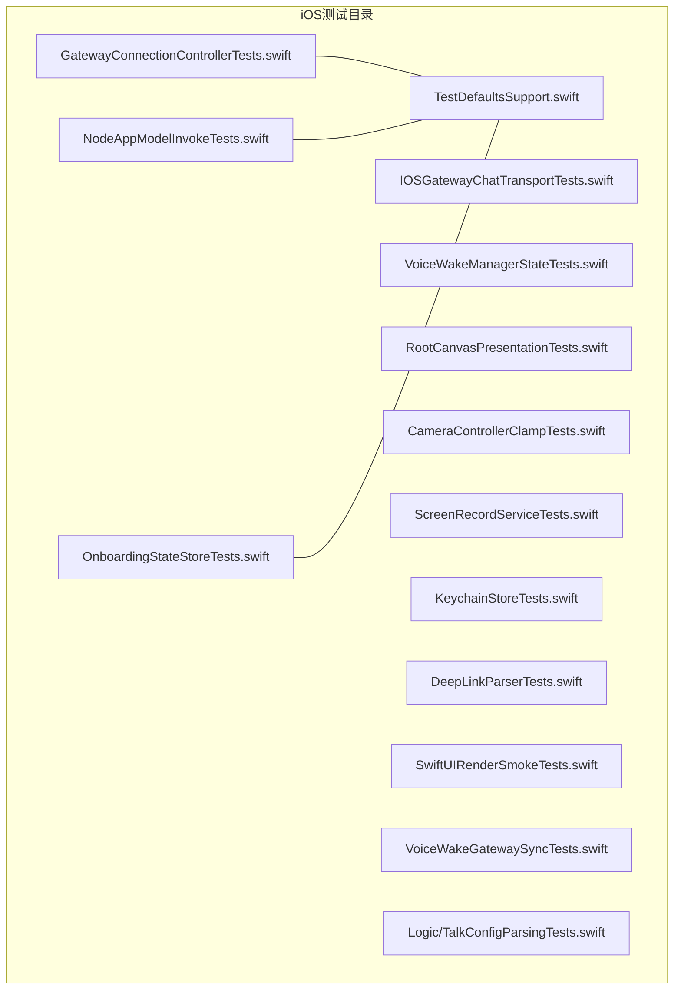

图表来源
- [apps/ios/Tests/GatewayConnectionControllerTests.swift:1-117](file://apps/ios/Tests/GatewayConnectionControllerTests.swift#L1-L117)
- [apps/ios/Tests/NodeAppModelInvokeTests.swift:1-528](file://apps/ios/Tests/NodeAppModelInvokeTests.swift#L1-L528)
- [apps/ios/Tests/OnboardingStateStoreTests.swift:1-58](file://apps/ios/Tests/OnboardingStateStoreTests.swift#L1-L58)
- [apps/ios/Tests/TestDefaultsSupport.swift:1-27](file://apps/ios/Tests/TestDefaultsSupport.swift#L1-L27)

章节来源
- [apps/ios/Tests/GatewayConnectionControllerTests.swift:1-117](file://apps/ios/Tests/GatewayConnectionControllerTests.swift#L1-L117)
- [apps/ios/Tests/NodeAppModelInvokeTests.swift:1-528](file://apps/ios/Tests/NodeAppModelInvokeTests.swift#L1-L528)
- [apps/ios/Tests/OnboardingStateStoreTests.swift:1-58](file://apps/ios/Tests/OnboardingStateStoreTests.swift#L1-L58)
- [apps/ios/Tests/TestDefaultsSupport.swift:1-27](file://apps/ios/Tests/TestDefaultsSupport.swift#L1-L27)

## 核心组件
- 网关连接控制器：负责解析显示名、能力集与命令集、加载上次连接信息等。
- 聊天传输层：封装与网关的聊天请求，确保在未连接时快速失败。
- 应用模型与调用处理：解析参数、编码载荷、会话键管理、Canvas与A2UI命令处理、深链路由与安全校验、Apple Watch通知转发。
- 语音唤醒管理：状态暂停/恢复、识别回调错误处理、触发词匹配与命令分发。
- Canvas与屏幕录制：Canvas导航/执行JS、屏幕录制参数边界检查、相机质量/时长边界约束。
- 引导与存储：首次引导呈现策略、钥匙串存取、深链解析与安全校验。
- 渲染烟雾测试：验证SwiftUI视图层次构建与布局更新。
- 语音配置解析：Talk静音超时与提供方配置选择。

章节来源
- [apps/ios/Tests/GatewayConnectionControllerTests.swift:1-117](file://apps/ios/Tests/GatewayConnectionControllerTests.swift#L1-L117)
- [apps/ios/Tests/IOSGatewayChatTransportTests.swift:1-31](file://apps/ios/Tests/IOSGatewayChatTransportTests.swift#L1-L31)
- [apps/ios/Tests/NodeAppModelInvokeTests.swift:1-528](file://apps/ios/Tests/NodeAppModelInvokeTests.swift#L1-L528)
- [apps/ios/Tests/VoiceWakeManagerStateTests.swift:1-66](file://apps/ios/Tests/VoiceWakeManagerStateTests.swift#L1-L66)
- [apps/ios/Tests/CameraControllerClampTests.swift:1-25](file://apps/ios/Tests/CameraControllerClampTests.swift#L1-L25)
- [apps/ios/Tests/ScreenRecordServiceTests.swift:1-33](file://apps/ios/Tests/ScreenRecordServiceTests.swift#L1-L33)
- [apps/ios/Tests/OnboardingStateStoreTests.swift:1-58](file://apps/ios/Tests/OnboardingStateStoreTests.swift#L1-L58)
- [apps/ios/Tests/KeychainStoreTests.swift:1-23](file://apps/ios/Tests/KeychainStoreTests.swift#L1-L23)
- [apps/ios/Tests/DeepLinkParserTests.swift:1-156](file://apps/ios/Tests/DeepLinkParserTests.swift#L1-L156)
- [apps/ios/Tests/SwiftUIRenderSmokeTests.swift:1-82](file://apps/ios/Tests/SwiftUIRenderSmokeTests.swift#L1-L82)
- [apps/ios/Tests/VoiceWakeGatewaySyncTests.swift:1-23](file://apps/ios/Tests/VoiceWakeGatewaySyncTests.swift#L1-L23)
- [apps/ios/Tests/Logic/TalkConfigParsingTests.swift:1-76](file://apps/ios/Tests/Logic/TalkConfigParsingTests.swift#L1-L76)

## 架构总览
下图展示iOS节点测试中涉及的关键模块与交互关系，突出测试对核心业务逻辑的覆盖点。

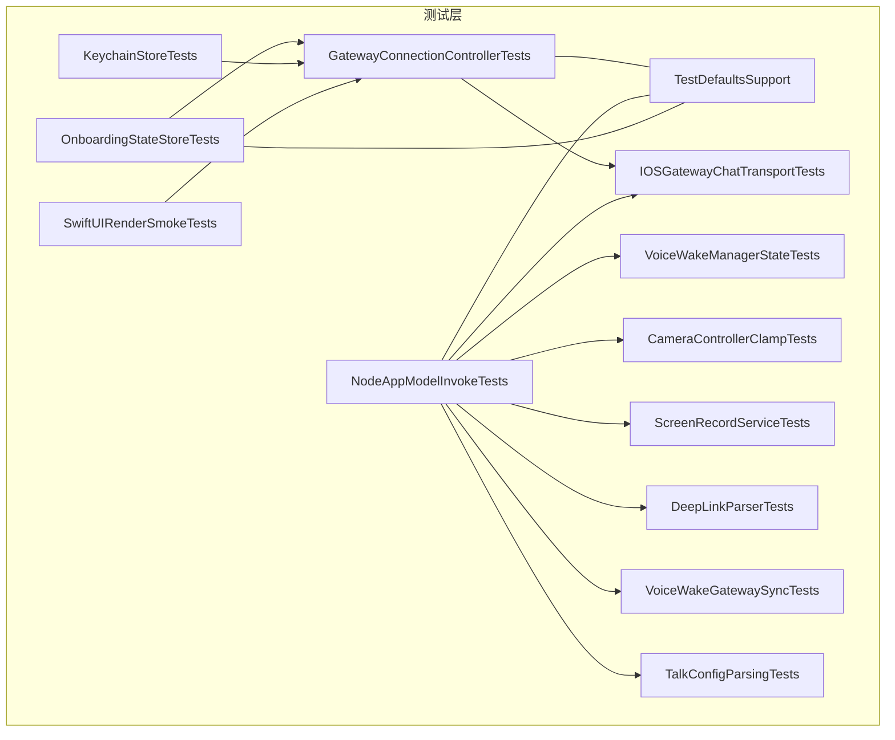

图表来源
- [apps/ios/Tests/GatewayConnectionControllerTests.swift:1-117](file://apps/ios/Tests/GatewayConnectionControllerTests.swift#L1-L117)
- [apps/ios/Tests/IOSGatewayChatTransportTests.swift:1-31](file://apps/ios/Tests/IOSGatewayChatTransportTests.swift#L1-L31)
- [apps/ios/Tests/NodeAppModelInvokeTests.swift:1-528](file://apps/ios/Tests/NodeAppModelInvokeTests.swift#L1-L528)
- [apps/ios/Tests/VoiceWakeManagerStateTests.swift:1-66](file://apps/ios/Tests/VoiceWakeManagerStateTests.swift#L1-L66)
- [apps/ios/Tests/CameraControllerClampTests.swift:1-25](file://apps/ios/Tests/CameraControllerClampTests.swift#L1-L25)
- [apps/ios/Tests/ScreenRecordServiceTests.swift:1-33](file://apps/ios/Tests/ScreenRecordServiceTests.swift#L1-L33)
- [apps/ios/Tests/OnboardingStateStoreTests.swift:1-58](file://apps/ios/Tests/OnboardingStateStoreTests.swift#L1-L58)
- [apps/ios/Tests/KeychainStoreTests.swift:1-23](file://apps/ios/Tests/KeychainStoreTests.swift#L1-L23)
- [apps/ios/Tests/DeepLinkParserTests.swift:1-156](file://apps/ios/Tests/DeepLinkParserTests.swift#L1-L156)
- [apps/ios/Tests/SwiftUIRenderSmokeTests.swift:1-82](file://apps/ios/Tests/SwiftUIRenderSmokeTests.swift#L1-L82)
- [apps/ios/Tests/VoiceWakeGatewaySyncTests.swift:1-23](file://apps/ios/Tests/VoiceWakeGatewaySyncTests.swift#L1-L23)
- [apps/ios/Tests/Logic/TalkConfigParsingTests.swift:1-76](file://apps/ios/Tests/Logic/TalkConfigParsingTests.swift#L1-L76)
- [apps/ios/Tests/TestDefaultsSupport.swift:1-27](file://apps/ios/Tests/TestDefaultsSupport.swift#L1-L27)

## 详细组件分析

### 网关连接控制器测试
- 关注点：显示名解析默认值、能力集与命令集随偏好变化、最后连接信息的保存与加载、无效数据迁移与校验。
- 测试策略：通过withUserDefaults注入偏好，断言控制器内部计算结果；使用Keychain存取模拟持久化。

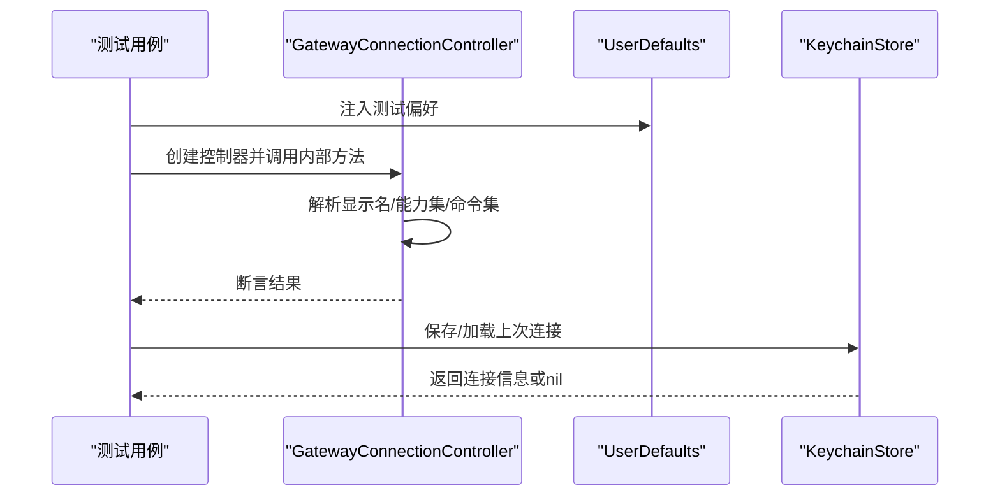

图表来源
- [apps/ios/Tests/GatewayConnectionControllerTests.swift:1-117](file://apps/ios/Tests/GatewayConnectionControllerTests.swift#L1-L117)
- [apps/ios/Tests/KeychainStoreTests.swift:1-23](file://apps/ios/Tests/KeychainStoreTests.swift#L1-L23)

章节来源
- [apps/ios/Tests/GatewayConnectionControllerTests.swift:1-117](file://apps/ios/Tests/GatewayConnectionControllerTests.swift#L1-L117)
- [apps/ios/Tests/KeychainStoreTests.swift:1-23](file://apps/ios/Tests/KeychainStoreTests.swift#L1-L23)

### 聊天传输层测试
- 关注点：未连接状态下所有请求应快速失败，避免阻塞或误判。
- 测试策略：构造未连接的网关会话，逐一调用历史、发送消息、健康检查接口并断言抛错。

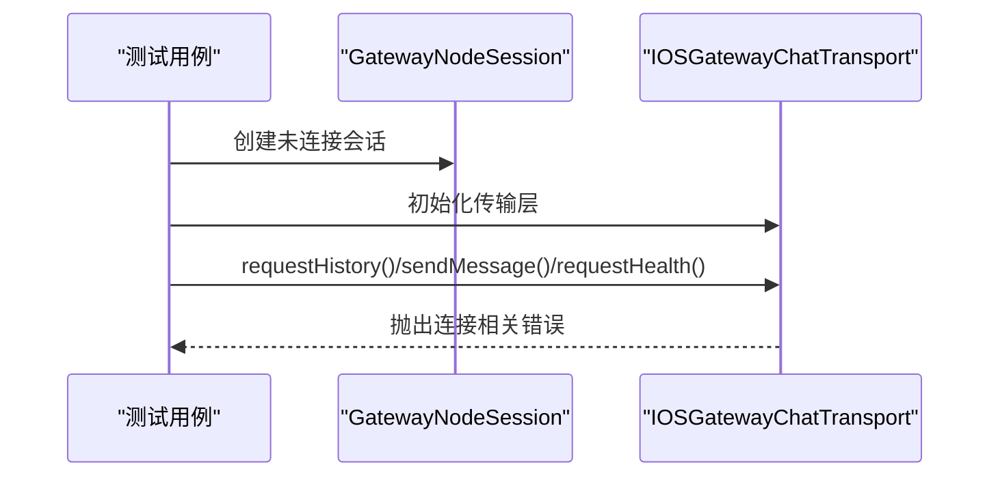

图表来源
- [apps/ios/Tests/IOSGatewayChatTransportTests.swift:1-31](file://apps/ios/Tests/IOSGatewayChatTransportTests.swift#L1-L31)

章节来源
- [apps/ios/Tests/IOSGatewayChatTransportTests.swift:1-31](file://apps/ios/Tests/IOSGatewayChatTransportTests.swift#L1-L31)

### 应用模型与调用处理测试
- 关注点：参数解码/载荷编码、会话键策略、后台命令拒绝、相机/屏幕格式限制、Canvas/A2UI命令、深链解析与安全、Apple Watch通知与回复队列。
- 测试策略：Mock Watch服务、设置场景阶段、注入用户偏好、构造BridgeInvokeRequest并断言响应与副作用。

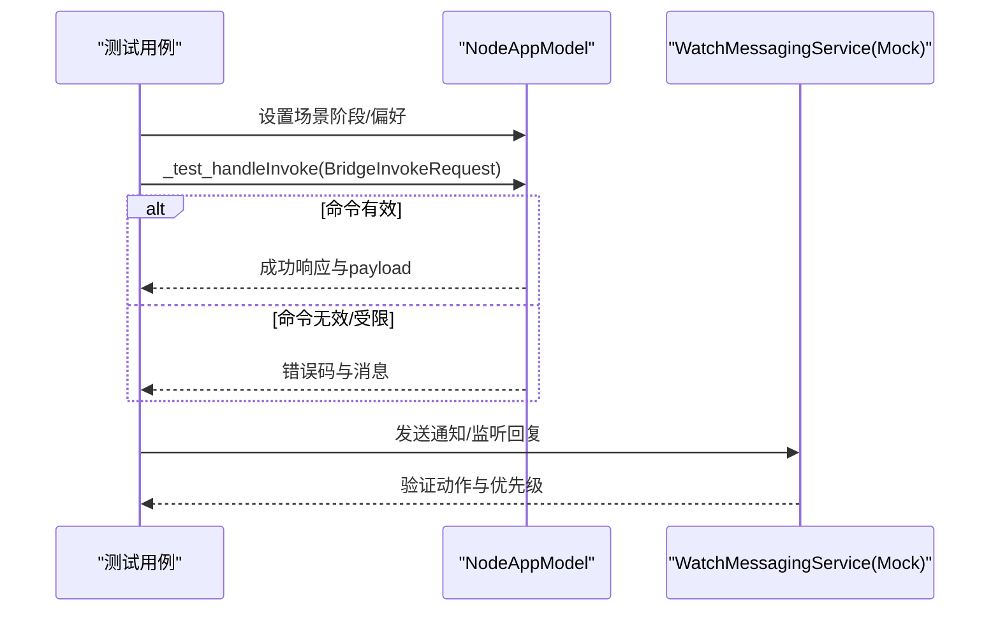

图表来源
- [apps/ios/Tests/NodeAppModelInvokeTests.swift:1-528](file://apps/ios/Tests/NodeAppModelInvokeTests.swift#L1-L528)

章节来源
- [apps/ios/Tests/NodeAppModelInvokeTests.swift:1-528](file://apps/ios/Tests/NodeAppModelInvokeTests.swift#L1-L528)

### 语音唤醒管理测试
- 关注点：外部音频捕获暂停/恢复、识别回调错误重试、触发词识别后命令分发。
- 测试策略：直接调用内部回调与状态切换方法，断言状态文本与是否继续监听。

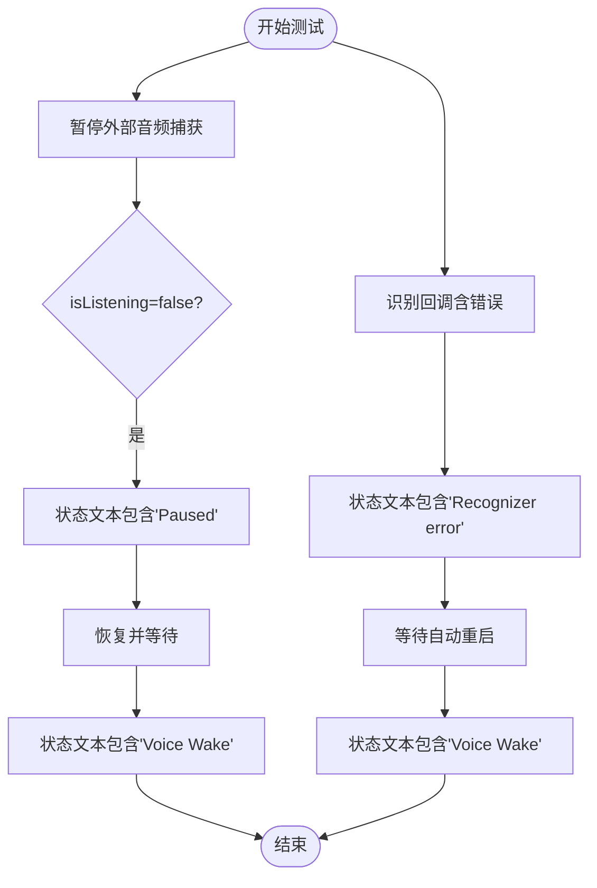

图表来源
- [apps/ios/Tests/VoiceWakeManagerStateTests.swift:1-66](file://apps/ios/Tests/VoiceWakeManagerStateTests.swift#L1-L66)

章节来源
- [apps/ios/Tests/VoiceWakeManagerStateTests.swift:1-66](file://apps/ios/Tests/VoiceWakeManagerStateTests.swift#L1-L66)

### Canvas与屏幕录制测试
- 关注点：Canvas导航/执行JS、A2UI命令在主机缺失时的错误提示；屏幕录制参数边界与非法索引校验；相机质量/时长边界。
- 测试策略：构造参数并调用内部处理函数，断言行为与错误类型。

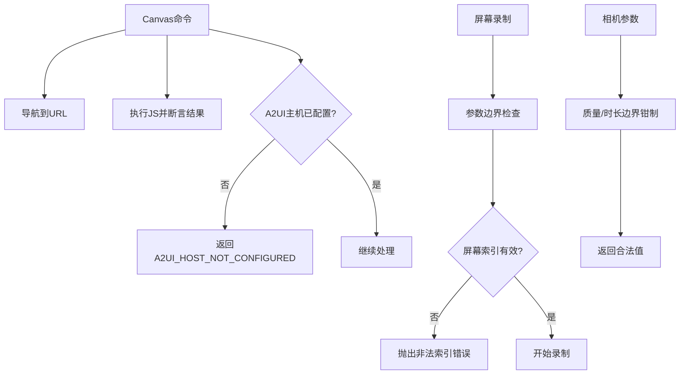

图表来源
- [apps/ios/Tests/NodeAppModelInvokeTests.swift:1-528](file://apps/ios/Tests/NodeAppModelInvokeTests.swift#L1-L528)
- [apps/ios/Tests/ScreenRecordServiceTests.swift:1-33](file://apps/ios/Tests/ScreenRecordServiceTests.swift#L1-L33)
- [apps/ios/Tests/CameraControllerClampTests.swift:1-25](file://apps/ios/Tests/CameraControllerClampTests.swift#L1-L25)

章节来源
- [apps/ios/Tests/NodeAppModelInvokeTests.swift:1-528](file://apps/ios/Tests/NodeAppModelInvokeTests.swift#L1-L528)
- [apps/ios/Tests/ScreenRecordServiceTests.swift:1-33](file://apps/ios/Tests/ScreenRecordServiceTests.swift#L1-L33)
- [apps/ios/Tests/CameraControllerClampTests.swift:1-25](file://apps/ios/Tests/CameraControllerClampTests.swift#L1-L25)

### 引导与存储测试
- 关注点：首次安装且未连接时呈现引导；连接后不再呈现；完成引导后状态持久化；钥匙串读写删除。
- 测试策略：构造NodeAppModel与UserDefaults，断言引导呈现判断与持久化结果。

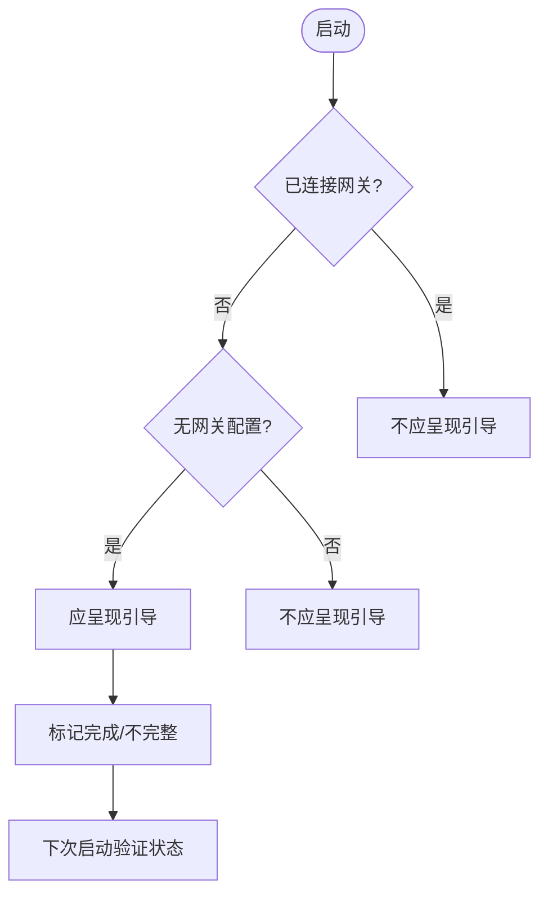

图表来源
- [apps/ios/Tests/OnboardingStateStoreTests.swift:1-58](file://apps/ios/Tests/OnboardingStateStoreTests.swift#L1-L58)
- [apps/ios/Tests/KeychainStoreTests.swift:1-23](file://apps/ios/Tests/KeychainStoreTests.swift#L1-L23)

章节来源
- [apps/ios/Tests/OnboardingStateStoreTests.swift:1-58](file://apps/ios/Tests/OnboardingStateStoreTests.swift#L1-L58)
- [apps/ios/Tests/KeychainStoreTests.swift:1-23](file://apps/ios/Tests/KeychainStoreTests.swift#L1-L23)

### 深链解析测试
- 关注点：协议/主机大小写、空消息、目标路由字段、安全连接要求（loopback允许WS）、setup code解析与默认端口。
- 测试策略：构造不同URL与payload，断言解析结果与安全校验。

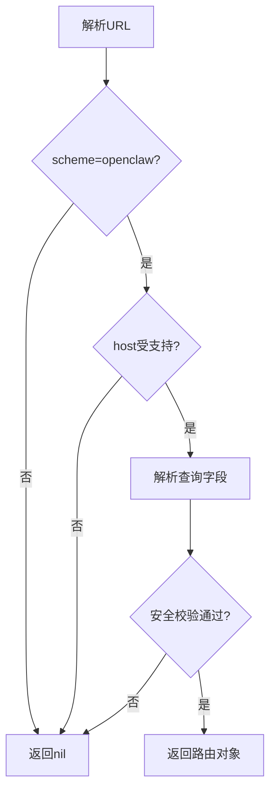

图表来源
- [apps/ios/Tests/DeepLinkParserTests.swift:1-156](file://apps/ios/Tests/DeepLinkParserTests.swift#L1-L156)

章节来源
- [apps/ios/Tests/DeepLinkParserTests.swift:1-156](file://apps/ios/Tests/DeepLinkParserTests.swift#L1-L156)

### SwiftUI渲染烟雾测试
- 关注点：关键视图（状态胶囊、设置页、根标签页、语音页、聊天面板、语音唤醒提示）在宿主窗口中可正常布局与刷新。
- 测试策略：创建UIWindow与UIHostingController，触发layoutIfNeeded，验证视图层次构建成功。

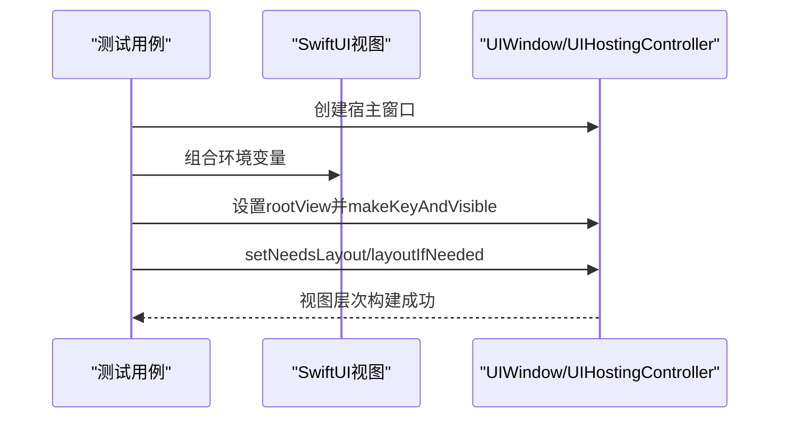

图表来源
- [apps/ios/Tests/SwiftUIRenderSmokeTests.swift:1-82](file://apps/ios/Tests/SwiftUIRenderSmokeTests.swift#L1-L82)

章节来源
- [apps/ios/Tests/SwiftUIRenderSmokeTests.swift:1-82](file://apps/ios/Tests/SwiftUIRenderSmokeTests.swift#L1-L82)

### 语音配置解析测试
- 关注点：Talk配置的提供方选择、静音超时毫秒数解析与默认回退。
- 测试策略：构造不同输入，断言选择结果与超时解析。

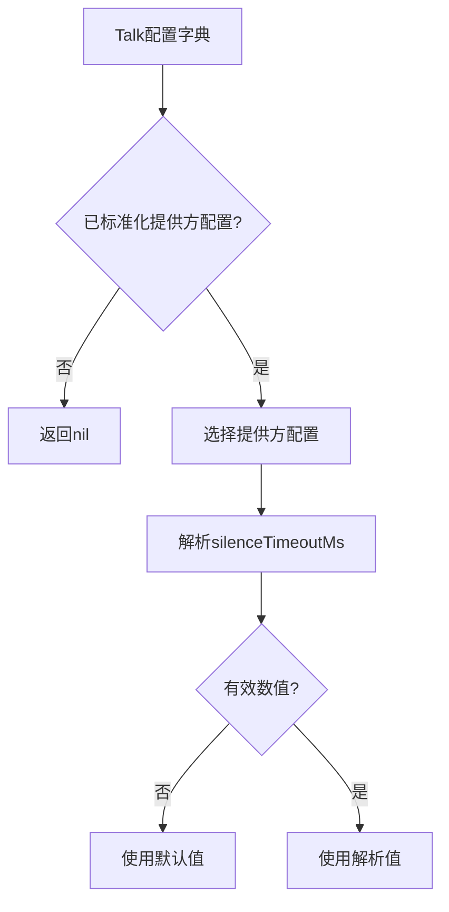

图表来源
- [apps/ios/Tests/Logic/TalkConfigParsingTests.swift:1-76](file://apps/ios/Tests/Logic/TalkConfigParsingTests.swift#L1-L76)

章节来源
- [apps/ios/Tests/Logic/TalkConfigParsingTests.swift:1-76](file://apps/ios/Tests/Logic/TalkConfigParsingTests.swift#L1-L76)

### 语音唤醒网关同步测试
- 关注点：从JSON解析触发词列表，空/非法输入的回退策略。
- 测试策略：构造payload与异常输入，断言解析结果。

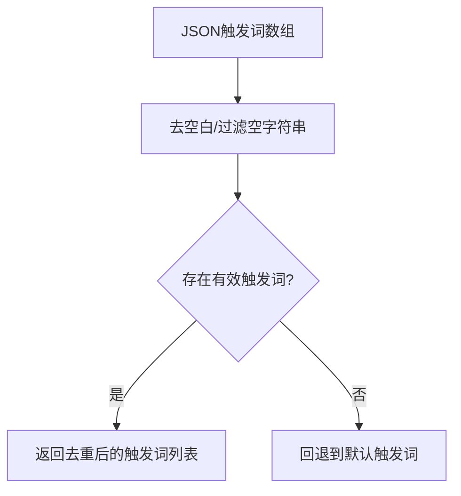

图表来源
- [apps/ios/Tests/VoiceWakeGatewaySyncTests.swift:1-23](file://apps/ios/Tests/VoiceWakeGatewaySyncTests.swift#L1-L23)

章节来源
- [apps/ios/Tests/VoiceWakeGatewaySyncTests.swift:1-23](file://apps/ios/Tests/VoiceWakeGatewaySyncTests.swift#L1-L23)

## 依赖关系分析
- 测试对UserDefaults与Keychain的依赖：通过withUserDefaults与KeychainStoreTests实现隔离与可重复性。
- 测试对NodeAppModel与GatewayConnectionController的依赖：通过构造实例与调用内部方法（以下划线前缀标识的私有接口）进行断言。
- 测试对SwiftUI渲染的依赖：通过UIWindow/UIHostingController进行视图构建验证。
- 测试对第三方库（如SwabbleKit）的依赖：在语音唤醒相关测试中使用。

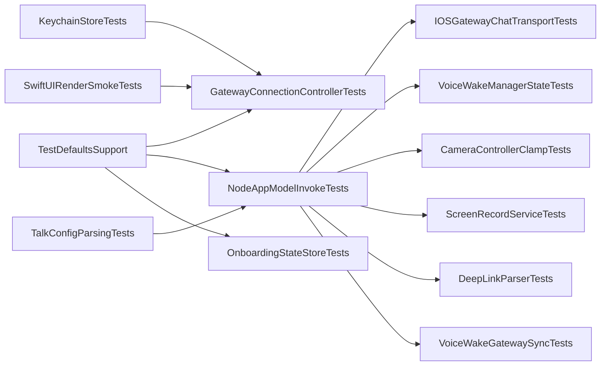

图表来源
- [apps/ios/Tests/TestDefaultsSupport.swift:1-27](file://apps/ios/Tests/TestDefaultsSupport.swift#L1-L27)
- [apps/ios/Tests/GatewayConnectionControllerTests.swift:1-117](file://apps/ios/Tests/GatewayConnectionControllerTests.swift#L1-L117)
- [apps/ios/Tests/NodeAppModelInvokeTests.swift:1-528](file://apps/ios/Tests/NodeAppModelInvokeTests.swift#L1-L528)
- [apps/ios/Tests/OnboardingStateStoreTests.swift:1-58](file://apps/ios/Tests/OnboardingStateStoreTests.swift#L1-L58)
- [apps/ios/Tests/KeychainStoreTests.swift:1-23](file://apps/ios/Tests/KeychainStoreTests.swift#L1-L23)
- [apps/ios/Tests/IOSGatewayChatTransportTests.swift:1-31](file://apps/ios/Tests/IOSGatewayChatTransportTests.swift#L1-L31)
- [apps/ios/Tests/VoiceWakeManagerStateTests.swift:1-66](file://apps/ios/Tests/VoiceWakeManagerStateTests.swift#L1-L66)
- [apps/ios/Tests/CameraControllerClampTests.swift:1-25](file://apps/ios/Tests/CameraControllerClampTests.swift#L1-L25)
- [apps/ios/Tests/ScreenRecordServiceTests.swift:1-33](file://apps/ios/Tests/ScreenRecordServiceTests.swift#L1-L33)
- [apps/ios/Tests/DeepLinkParserTests.swift:1-156](file://apps/ios/Tests/DeepLinkParserTests.swift#L1-L156)
- [apps/ios/Tests/VoiceWakeGatewaySyncTests.swift:1-23](file://apps/ios/Tests/VoiceWakeGatewaySyncTests.swift#L1-L23)
- [apps/ios/Tests/Logic/TalkConfigParsingTests.swift:1-76](file://apps/ios/Tests/Logic/TalkConfigParsingTests.swift#L1-L76)
- [apps/ios/Tests/SwiftUIRenderSmokeTests.swift:1-82](file://apps/ios/Tests/SwiftUIRenderSmokeTests.swift#L1-L82)

章节来源
- [apps/ios/Tests/TestDefaultsSupport.swift:1-27](file://apps/ios/Tests/TestDefaultsSupport.swift#L1-L27)
- [apps/ios/Tests/GatewayConnectionControllerTests.swift:1-117](file://apps/ios/Tests/GatewayConnectionControllerTests.swift#L1-L117)
- [apps/ios/Tests/NodeAppModelInvokeTests.swift:1-528](file://apps/ios/Tests/NodeAppModelInvokeTests.swift#L1-L528)
- [apps/ios/Tests/OnboardingStateStoreTests.swift:1-58](file://apps/ios/Tests/OnboardingStateStoreTests.swift#L1-L58)
- [apps/ios/Tests/KeychainStoreTests.swift:1-23](file://apps/ios/Tests/KeychainStoreTests.swift#L1-L23)
- [apps/ios/Tests/IOSGatewayChatTransportTests.swift:1-31](file://apps/ios/Tests/IOSGatewayChatTransportTests.swift#L1-L31)
- [apps/ios/Tests/VoiceWakeManagerStateTests.swift:1-66](file://apps/ios/Tests/VoiceWakeManagerStateTests.swift#L1-L66)
- [apps/ios/Tests/CameraControllerClampTests.swift:1-25](file://apps/ios/Tests/CameraControllerClampTests.swift#L1-L25)
- [apps/ios/Tests/ScreenRecordServiceTests.swift:1-33](file://apps/ios/Tests/ScreenRecordServiceTests.swift#L1-L33)
- [apps/ios/Tests/DeepLinkParserTests.swift:1-156](file://apps/ios/Tests/DeepLinkParserTests.swift#L1-L156)
- [apps/ios/Tests/VoiceWakeGatewaySyncTests.swift:1-23](file://apps/ios/Tests/VoiceWakeGatewaySyncTests.swift#L1-L23)
- [apps/ios/Tests/Logic/TalkConfigParsingTests.swift:1-76](file://apps/ios/Tests/Logic/TalkConfigParsingTests.swift#L1-L76)
- [apps/ios/Tests/SwiftUIRenderSmokeTests.swift:1-82](file://apps/ios/Tests/SwiftUIRenderSmokeTests.swift#L1-L82)

## 性能考量
- 测试并发与串行：部分Suite标注为串行（如GatewayConnectionControllerTests），以避免共享状态竞争，保证断言稳定性。
- 主线程Actor：大量测试使用@MainActor，确保UI与系统服务（如UserDefaults、Keychain）访问的一致性。
- 边界参数测试：屏幕录制与相机参数的边界测试有助于发现潜在的资源占用与崩溃风险。
- 渲染烟雾测试：通过layoutIfNeeded验证视图层次构建，避免复杂布局导致的主线程卡顿。

章节来源
- [apps/ios/Tests/GatewayConnectionControllerTests.swift:1-117](file://apps/ios/Tests/GatewayConnectionControllerTests.swift#L1-L117)
- [apps/ios/Tests/NodeAppModelInvokeTests.swift:1-528](file://apps/ios/Tests/NodeAppModelInvokeTests.swift#L1-L528)
- [apps/ios/Tests/ScreenRecordServiceTests.swift:1-33](file://apps/ios/Tests/ScreenRecordServiceTests.swift#L1-L33)
- [apps/ios/Tests/CameraControllerClampTests.swift:1-25](file://apps/ios/Tests/CameraControllerClampTests.swift#L1-L25)
- [apps/ios/Tests/SwiftUIRenderSmokeTests.swift:1-82](file://apps/ios/Tests/SwiftUIRenderSmokeTests.swift#L1-L82)

## 故障排查指南
- 网关未连接导致的请求失败：确认传输层在未连接时抛错，避免误判。参考聊天传输层测试。
- 深链过大或未授权：检查NodeAppModel对深链的尺寸限制与密钥校验，必要时生成并使用有效密钥。
- Canvas/A2UI命令失败：确认A2UI主机已配置，否则将收到“主机未配置”错误。
- 屏幕录制/相机参数越界：依据边界测试修正参数范围，避免非法索引或超限FPS/时长。
- 语音唤醒错误：关注识别回调中的错误文本与自动重启逻辑，检查麦克风权限与系统音频焦点。
- 引导状态异常：核对UserDefaults中的引导完成标志，必要时重置测试域。
- 钥匙串读写：确保服务名与账户一致，清理残留条目后再重试。

章节来源
- [apps/ios/Tests/IOSGatewayChatTransportTests.swift:1-31](file://apps/ios/Tests/IOSGatewayChatTransportTests.swift#L1-L31)
- [apps/ios/Tests/NodeAppModelInvokeTests.swift:1-528](file://apps/ios/Tests/NodeAppModelInvokeTests.swift#L1-L528)
- [apps/ios/Tests/ScreenRecordServiceTests.swift:1-33](file://apps/ios/Tests/ScreenRecordServiceTests.swift#L1-L33)
- [apps/ios/Tests/CameraControllerClampTests.swift:1-25](file://apps/ios/Tests/CameraControllerClampTests.swift#L1-L25)
- [apps/ios/Tests/VoiceWakeManagerStateTests.swift:1-66](file://apps/ios/Tests/VoiceWakeManagerStateTests.swift#L1-L66)
- [apps/ios/Tests/OnboardingStateStoreTests.swift:1-58](file://apps/ios/Tests/OnboardingStateStoreTests.swift#L1-L58)
- [apps/ios/Tests/KeychainStoreTests.swift:1-23](file://apps/ios/Tests/KeychainStoreTests.swift#L1-L23)

## 结论
本指南总结了OpenClaw iOS节点的测试与调试要点：以Testing框架为核心，围绕网关通信、语音控制、Canvas/A2UI、深链与渲染等关键路径设计测试用例；通过UserDefaults与Keychain的隔离策略保障可重复性；结合边界测试与烟雾测试提升稳定性与性能表现。建议在持续集成中运行全量单元测试，并针对回归场景补充端到端测试。

## 附录
- 测试环境搭建与运行
  - 使用Xcode内置测试运行器或命令行工具运行Swift Testing测试套件。
  - 在模拟器上验证渲染与网络行为，在真机上验证权限与硬件特性（相机、麦克风、Apple Watch）。
- 模拟器配置与真机调试最佳实践
  - 使用TestDefaultsSupport注入偏好，避免污染系统UserDefaults。
  - 对于需要系统权限的测试（相机/麦克风/Apple Watch），在真机上开启对应权限并使用真实设备进行验证。
  - 使用SwiftUIRenderSmokeTests作为渲染回归检查，确保界面层次构建稳定。
- 日志与性能监控
  - 利用测试输出定位失败用例与断言点；对耗时操作（如屏幕录制）在测试中加入时间上限，防止CI挂起。
  - 结合系统日志与Xcode控制台，复现深链与网关连接问题。