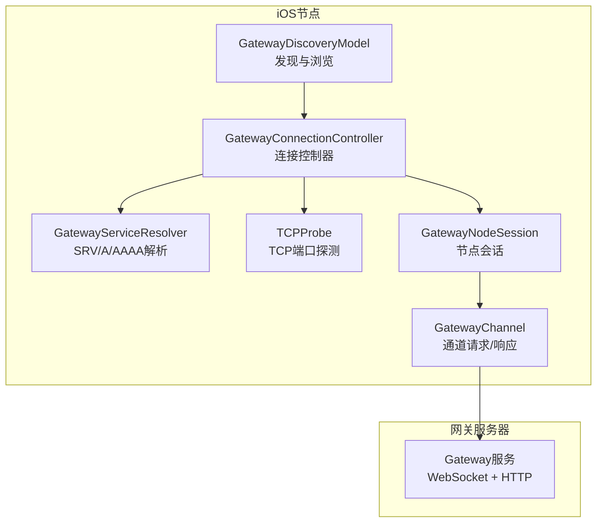
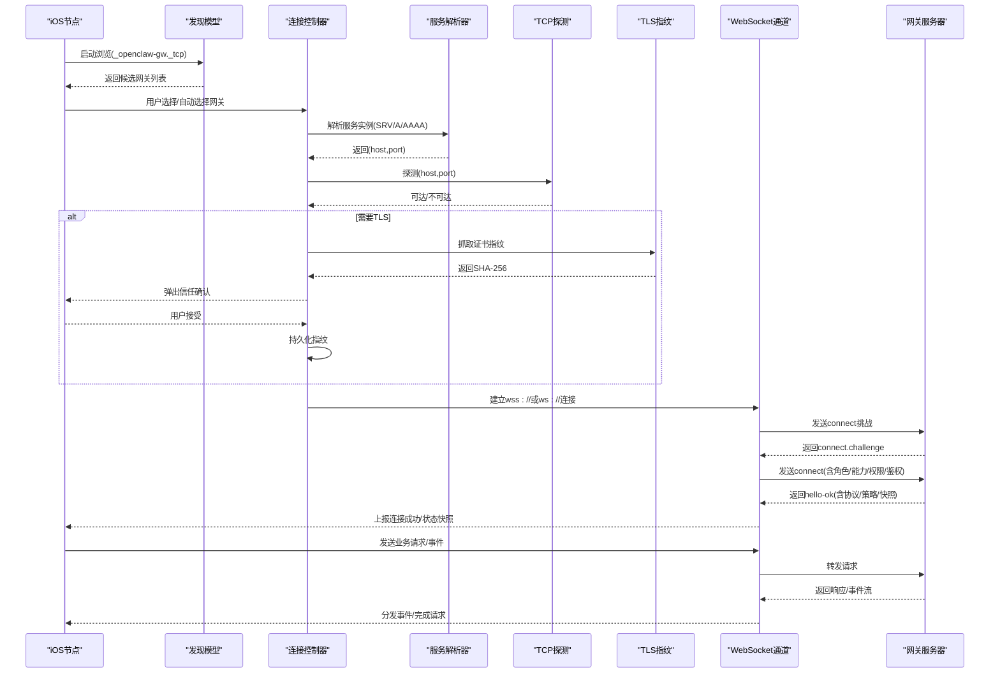
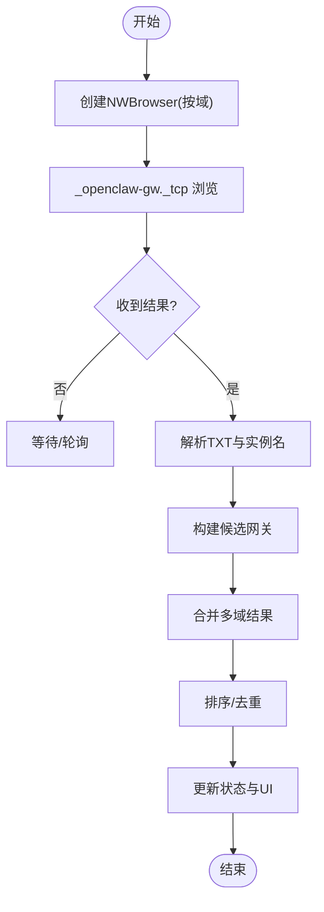
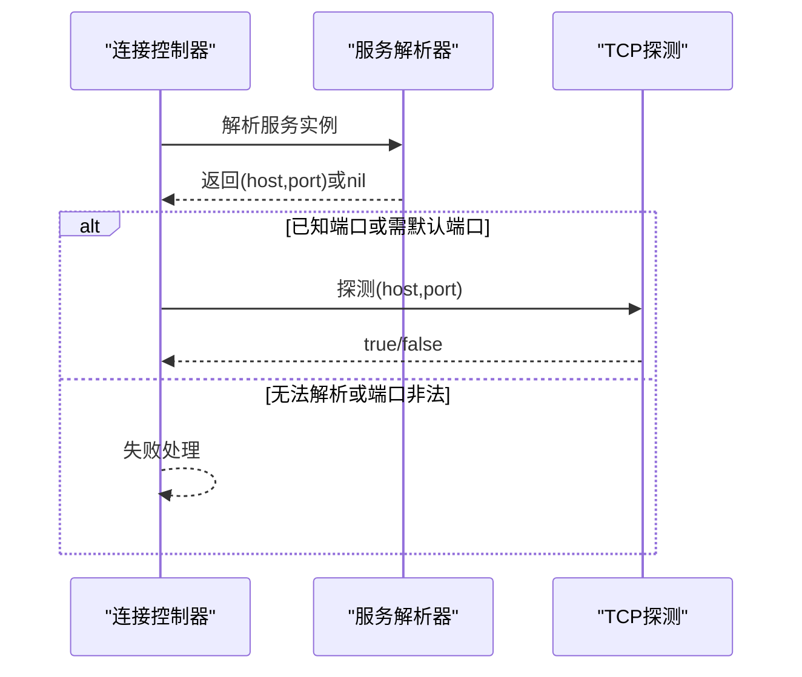
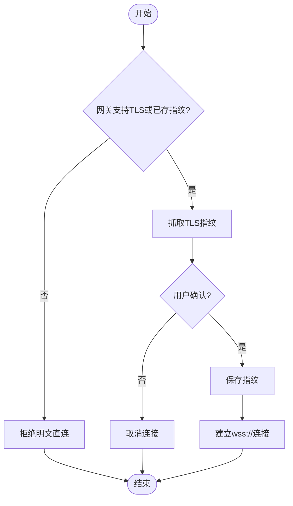
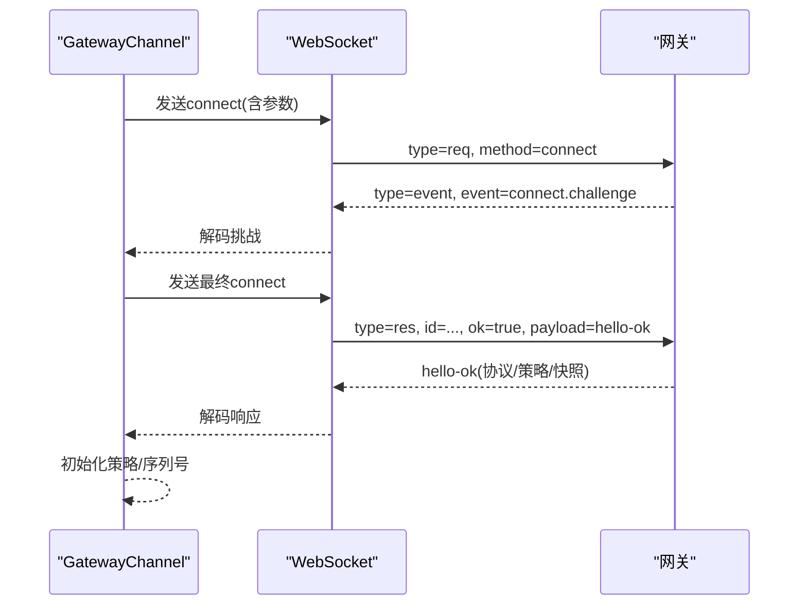
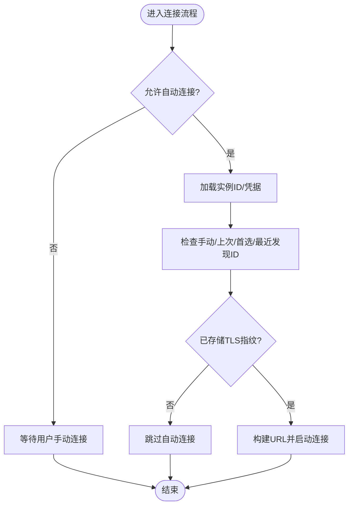
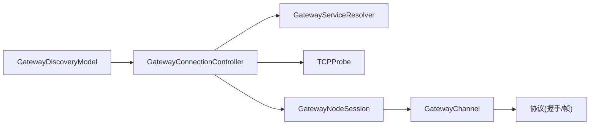

# 网关通信

<cite>
**本文引用的文件**
- [apps/ios/Sources/Gateway/GatewayConnectionController.swift](file://apps/ios/Sources/Gateway/GatewayConnectionController.swift)
- [apps/ios/Sources/Gateway/GatewayDiscoveryModel.swift](file://apps/ios/Sources/Gateway/GatewayDiscoveryModel.swift)
- [apps/ios/Sources/Gateway/GatewayServiceResolver.swift](file://apps/ios/Sources/Gateway/GatewayServiceResolver.swift)
- [apps/ios/Sources/Gateway/TCPProbe.swift](file://apps/ios/Sources/Gateway/TCPProbe.swift)
- [apps/shared/OpenClawKit/Sources/OpenClawKit/GatewayNodeSession.swift](file://apps/shared/OpenClawKit/Sources/OpenClawKit/GatewayNodeSession.swift)
- [apps/shared/OpenClawKit/Sources/OpenClawKit/GatewayChannel.swift](file://apps/shared/OpenClawKit/Sources/OpenClawKit/GatewayChannel.swift)
- [docs/gateway/discovery.md](file://docs/gateway/discovery.md)
- [docs/gateway/bonjour.md](file://docs/gateway/bonjour.md)
- [docs/gateway/protocol.md](file://docs/gateway/protocol.md)
- [src/gateway/client.ts](file://src/gateway/client.ts)
</cite>

## 目录
1. [简介](#简介)
2. [项目结构](#项目结构)
3. [核心组件](#核心组件)
4. [架构总览](#架构总览)
5. [详细组件分析](#详细组件分析)
6. [依赖关系分析](#依赖关系分析)
7. [性能考量](#性能考量)
8. [故障排查指南](#故障排查指南)
9. [结论](#结论)
10. [附录](#附录)

## 简介
本文件面向OpenClaw iOS节点的“网关通信”能力，系统化阐述以下内容：
- iOS节点与网关服务器之间的WebSocket通信协议、消息格式与数据传输机制
- Bonjour服务发现、TCP探测与网络连接建立流程
- 网关连接的配置项、连接状态监控与自动重连机制
- 消息路由、负载均衡与故障转移策略
- 网络异常处理、连接优化与性能监控实现要点

目标读者包括iOS客户端开发者、平台集成工程师与运维人员。

## 项目结构
围绕iOS节点的网关通信，涉及以下关键模块：
- iOS侧发现与连接控制：GatewayDiscoveryModel、GatewayConnectionController、GatewayServiceResolver、TCPProbe
- iOS侧会话与通道：GatewayNodeSession、GatewayChannel
- 文档与协议参考：discovery.md、bonjour.md、protocol.md
- 网关侧客户端抽象：client.ts（用于理解协议与错误语义）

图示来源
- [apps/ios/Sources/Gateway/GatewayDiscoveryModel.swift:1-182](file://apps/ios/Sources/Gateway/GatewayDiscoveryModel.swift#L1-L182)
- [apps/ios/Sources/Gateway/GatewayConnectionController.swift:1-800](file://apps/ios/Sources/Gateway/GatewayConnectionController.swift#L1-L800)
- [apps/ios/Sources/Gateway/GatewayServiceResolver.swift:1-53](file://apps/ios/Sources/Gateway/GatewayServiceResolver.swift#L1-L53)
- [apps/ios/Sources/Gateway/TCPProbe.swift:1-44](file://apps/ios/Sources/Gateway/TCPProbe.swift#L1-L44)
- [apps/shared/OpenClawKit/Sources/OpenClawKit/GatewayNodeSession.swift:310-345](file://apps/shared/OpenClawKit/Sources/OpenClawKit/GatewayNodeSession.swift#L310-L345)
- [apps/shared/OpenClawKit/Sources/OpenClawKit/GatewayChannel.swift:626-655](file://apps/shared/OpenClawKit/Sources/OpenClawKit/GatewayChannel.swift#L626-L655)

章节来源
- [apps/ios/Sources/Gateway/GatewayDiscoveryModel.swift:1-182](file://apps/ios/Sources/Gateway/GatewayDiscoveryModel.swift#L1-L182)
- [apps/ios/Sources/Gateway/GatewayConnectionController.swift:1-800](file://apps/ios/Sources/Gateway/GatewayConnectionController.swift#L1-L800)
- [apps/ios/Sources/Gateway/GatewayServiceResolver.swift:1-53](file://apps/ios/Sources/Gateway/GatewayServiceResolver.swift#L1-L53)
- [apps/ios/Sources/Gateway/TCPProbe.swift:1-44](file://apps/ios/Sources/Gateway/TCPProbe.swift#L1-L44)
- [apps/shared/OpenClawKit/Sources/OpenClawKit/GatewayNodeSession.swift:310-345](file://apps/shared/OpenClawKit/Sources/OpenClawKit/GatewayNodeSession.swift#L310-L345)
- [apps/shared/OpenClawKit/Sources/OpenClawKit/GatewayChannel.swift:626-655](file://apps/shared/OpenClawKit/Sources/OpenClawKit/GatewayChannel.swift#L626-L655)

## 核心组件
- 发现与浏览（Bonjour）
  - 使用NWBrowser按域浏览_openclaw-gw._tcp服务，解析TXT记录并构建可显示名称
  - 支持本地.local与跨网络的Wide-area Bonjour（Tailscale Split DNS）
- 服务解析（SRV/A/AAAA）
  - 通过NetService解析服务实例到具体主机与端口，避免信任TXT中的路由信息
- TCP探测
  - 在手动连接或首次连接时对目标端口进行TCP三步握手探测，判断可达性
- TLS指纹验证与存储
  - 首次连接时抓取远端证书SHA-256指纹，提示用户确认后持久化；后续连接严格校验
- 自动重连与偏好
  - 根据用户设置与历史连接记录，按优先级尝试自动连接
- 通道与会话
  - GatewayNodeSession封装WebSocket通道，GatewayChannel负责请求/响应编解码与超时管理

章节来源
- [apps/ios/Sources/Gateway/GatewayDiscoveryModel.swift:51-100](file://apps/ios/Sources/Gateway/GatewayDiscoveryModel.swift#L51-L100)
- [apps/ios/Sources/Gateway/GatewayServiceResolver.swift:23-47](file://apps/ios/Sources/Gateway/GatewayServiceResolver.swift#L23-L47)
- [apps/ios/Sources/Gateway/TCPProbe.swift:6-41](file://apps/ios/Sources/Gateway/TCPProbe.swift#L6-L41)
- [apps/ios/Sources/Gateway/GatewayConnectionController.swift:110-156](file://apps/ios/Sources/Gateway/GatewayConnectionController.swift#L110-L156)
- [apps/shared/OpenClawKit/Sources/OpenClawKit/GatewayNodeSession.swift:310-345](file://apps/shared/OpenClawKit/Sources/OpenClawKit/GatewayNodeSession.swift#L310-L345)
- [apps/shared/OpenClawKit/Sources/OpenClawKit/GatewayChannel.swift:626-655](file://apps/shared/OpenClawKit/Sources/OpenClawKit/GatewayChannel.swift#L626-L655)

## 架构总览
下图展示从发现到连接、握手、事件与请求响应的端到端流程。

图示来源
- [apps/ios/Sources/Gateway/GatewayDiscoveryModel.swift:51-96](file://apps/ios/Sources/Gateway/GatewayDiscoveryModel.swift#L51-L96)
- [apps/ios/Sources/Gateway/GatewayConnectionController.swift:95-156](file://apps/ios/Sources/Gateway/GatewayConnectionController.swift#L95-L156)
- [apps/ios/Sources/Gateway/GatewayServiceResolver.swift:23-47](file://apps/ios/Sources/Gateway/GatewayServiceResolver.swift#L23-L47)
- [apps/ios/Sources/Gateway/TCPProbe.swift:6-41](file://apps/ios/Sources/Gateway/TCPProbe.swift#L6-L41)
- [apps/shared/OpenClawKit/Sources/OpenClawKit/GatewayChannel.swift:626-655](file://apps/shared/OpenClawKit/Sources/OpenClawKit/GatewayChannel.swift#L626-L655)
- [docs/gateway/protocol.md:26-95](file://docs/gateway/protocol.md#L26-L95)

## 详细组件分析

### 组件A：Bonjour服务发现与浏览
- 功能要点
  - 按域遍历服务类型_openclaw-gw._tcp，解析TXT记录中的非权威路由提示
  - 将服务实例名进行解码与美化，形成用户可读名称
  - 维护各域浏览器状态与调试日志
- 关键行为
  - 初始启动时为每个域名创建NWBrowser
  - 结果回调中提取lanHost、gatewayPort、gatewayTls、gatewayTlsSha256等字段
  - 合并多域结果并排序，去重稳定ID

图示来源
- [apps/ios/Sources/Gateway/GatewayDiscoveryModel.swift:51-100](file://apps/ios/Sources/Gateway/GatewayDiscoveryModel.swift#L51-L100)
- [apps/ios/Sources/Gateway/GatewayDiscoveryModel.swift:114-127](file://apps/ios/Sources/Gateway/GatewayDiscoveryModel.swift#L114-L127)

章节来源
- [apps/ios/Sources/Gateway/GatewayDiscoveryModel.swift:1-182](file://apps/ios/Sources/Gateway/GatewayDiscoveryModel.swift#L1-L182)
- [docs/gateway/discovery.md:45-84](file://docs/gateway/discovery.md#L45-L84)
- [docs/gateway/bonjour.md:87-109](file://docs/gateway/bonjour.md#L87-L109)

### 组件B：服务解析与TCP探测
- 服务解析
  - 使用NetService解析服务实例到具体主机与端口，避免直接信任TXT中的路由
  - 提供超时保护与一次性完成回调，确保UI不会卡死
- TCP探测
  - 以NWConnection发起TCP连接，监听ready/failed状态，超时即判定不可达
  - 仅在端口合法范围内执行，避免无效探测

图示来源
- [apps/ios/Sources/Gateway/GatewayServiceResolver.swift:23-47](file://apps/ios/Sources/Gateway/GatewayServiceResolver.swift#L23-L47)
- [apps/ios/Sources/Gateway/TCPProbe.swift:6-41](file://apps/ios/Sources/Gateway/TCPProbe.swift#L6-L41)
- [apps/ios/Sources/Gateway/GatewayConnectionController.swift:525-538](file://apps/ios/Sources/Gateway/GatewayConnectionController.swift#L525-L538)

章节来源
- [apps/ios/Sources/Gateway/GatewayServiceResolver.swift:1-53](file://apps/ios/Sources/Gateway/GatewayServiceResolver.swift#L1-L53)
- [apps/ios/Sources/Gateway/TCPProbe.swift:1-44](file://apps/ios/Sources/Gateway/TCPProbe.swift#L1-L44)
- [apps/ios/Sources/Gateway/GatewayConnectionController.swift:516-538](file://apps/ios/Sources/Gateway/GatewayConnectionController.swift#L516-L538)

### 组件C：TLS指纹抓取与信任流程
- 首次连接（发现来源）
  - 若网关未启用TLS且未存储指纹，则拒绝明文直连
  - 通过HTTPS/TLS握手抓取远端证书SHA-256，弹出信任确认
  - 用户接受后持久化指纹，后续连接严格校验
- 手动连接
  - 若未存储指纹且要求TLS，则同样进行指纹抓取与确认
- 自动连接
  - 仅允许连接到已存储指纹的网关，避免未知风险

图示来源
- [apps/ios/Sources/Gateway/GatewayConnectionController.swift:110-156](file://apps/ios/Sources/Gateway/GatewayConnectionController.swift#L110-L156)
- [apps/ios/Sources/Gateway/GatewayConnectionController.swift:242-278](file://apps/ios/Sources/Gateway/GatewayConnectionController.swift#L242-L278)

章节来源
- [apps/ios/Sources/Gateway/GatewayConnectionController.swift:110-156](file://apps/ios/Sources/Gateway/GatewayConnectionController.swift#L110-L156)
- [apps/ios/Sources/Gateway/GatewayConnectionController.swift:242-278](file://apps/ios/Sources/Gateway/GatewayConnectionController.swift#L242-L278)

### 组件D：WebSocket握手与消息协议
- 握手阶段
  - 首帧必须是connect请求，包含最小/最大协议版本、客户端元信息、角色、作用域、能力、命令、权限、鉴权、设备签名等
  - 网关返回connect.challenge，随后客户端发送connect完成握手
  - 网关返回hello-ok，包含协议版本、策略（如心跳间隔）、特性与状态快照
- 帧格式
  - Request: {type:"req", id, method, params}
  - Response: {type:"res", id, ok, payload|error}
  - Event: {type:"event", event, payload, seq?, stateVersion?}
- iOS侧通道
  - GatewayChannel负责WebSocket消息编解码、等待特定响应、错误转换
  - GatewayNodeSession封装事件上报与方法调用

图示来源
- [docs/gateway/protocol.md:26-95](file://docs/gateway/protocol.md#L26-L95)
- [apps/shared/OpenClawKit/Sources/OpenClawKit/GatewayChannel.swift:626-655](file://apps/shared/OpenClawKit/Sources/OpenClawKit/GatewayChannel.swift#L626-L655)
- [apps/shared/OpenClawKit/Sources/OpenClawKit/GatewayNodeSession.swift:320-345](file://apps/shared/OpenClawKit/Sources/OpenClawKit/GatewayNodeSession.swift#L320-L345)

章节来源
- [docs/gateway/protocol.md:26-95](file://docs/gateway/protocol.md#L26-L95)
- [apps/shared/OpenClawKit/Sources/OpenClawKit/GatewayChannel.swift:626-655](file://apps/shared/OpenClawKit/Sources/OpenClawKit/GatewayChannel.swift#L626-L655)
- [apps/shared/OpenClawKit/Sources/OpenClawKit/GatewayNodeSession.swift:320-345](file://apps/shared/OpenClawKit/Sources/OpenClawKit/GatewayNodeSession.swift#L320-L345)

### 组件E：自动重连与偏好策略
- 自动连接触发条件
  - 用户开启“自动连接”，存在有效节点实例ID与凭据
  - 优先顺序：手动连接配置 > 最近一次连接记录 > 首选/最近发现的稳定ID > 单一候选
- 安全约束
  - 仅对已存储TLS指纹的网关执行自动连接
  - 首次连接若未存储指纹则要求用户确认
- 运行期恢复
  - 应用回到前台或场景变为活跃时尝试恢复连接

图示来源
- [apps/ios/Sources/Gateway/GatewayConnectionController.swift:308-419](file://apps/ios/Sources/Gateway/GatewayConnectionController.swift#L308-L419)
- [apps/ios/Sources/Gateway/GatewayConnectionController.swift:421-429](file://apps/ios/Sources/Gateway/GatewayConnectionController.swift#L421-L429)

章节来源
- [apps/ios/Sources/Gateway/GatewayConnectionController.swift:308-419](file://apps/ios/Sources/Gateway/GatewayConnectionController.swift#L308-L419)
- [apps/ios/Sources/Gateway/GatewayConnectionController.swift:421-429](file://apps/ios/Sources/Gateway/GatewayConnectionController.swift#L421-L429)

### 组件F：消息路由、负载均衡与故障转移
- 路由与策略
  - hello-ok中包含策略字段（如心跳间隔），客户端据此维持健康状态
  - 事件帧包含seq与stateVersion，用于序列对齐与状态回放
- 故障转移
  - 当前实现以单连接为主，故障转移主要通过自动重连与切换目标网关
  - 通过发现模型切换到其他可用网关，或使用SSH隧道作为后备路径
- 负载均衡
  - 无内置多路复用或轮询逻辑；建议通过多网关部署与客户端选择实现横向扩展

章节来源
- [docs/gateway/protocol.md:80-95](file://docs/gateway/protocol.md#L80-L95)
- [apps/shared/OpenClawKit/Sources/OpenClawKit/GatewayChannel.swift:626-655](file://apps/shared/OpenClawKit/Sources/OpenClawKit/GatewayChannel.swift#L626-L655)
- [docs/gateway/discovery.md:100-108](file://docs/gateway/discovery.md#L100-L108)

## 依赖关系分析
- 组件耦合
  - GatewayDiscoveryModel与GatewayConnectionController强耦合，前者提供候选，后者决定连接策略
  - GatewayConnectionController依赖GatewayServiceResolver与TCPProbe进行网络可达性判断
  - GatewayNodeSession与GatewayChannel共同构成通道层，向上提供易用接口
- 外部依赖
  - Network框架（NWBrowser/NWConnection）、Foundation（NetService）、OpenClawKit（通道与会话）
- 安全边界
  - Bonjour TXT为非权威信息，解析后仍需通过SRV/A/AAAA与TLS指纹二次确认
  - 自动连接仅限已信任网关，防止未知中间人攻击

图示来源
- [apps/ios/Sources/Gateway/GatewayDiscoveryModel.swift:1-182](file://apps/ios/Sources/Gateway/GatewayDiscoveryModel.swift#L1-L182)
- [apps/ios/Sources/Gateway/GatewayConnectionController.swift:1-800](file://apps/ios/Sources/Gateway/GatewayConnectionController.swift#L1-L800)
- [apps/ios/Sources/Gateway/GatewayServiceResolver.swift:1-53](file://apps/ios/Sources/Gateway/GatewayServiceResolver.swift#L1-L53)
- [apps/ios/Sources/Gateway/TCPProbe.swift:1-44](file://apps/ios/Sources/Gateway/TCPProbe.swift#L1-L44)
- [apps/shared/OpenClawKit/Sources/OpenClawKit/GatewayNodeSession.swift:310-345](file://apps/shared/OpenClawKit/Sources/OpenClawKit/GatewayNodeSession.swift#L310-L345)
- [apps/shared/OpenClawKit/Sources/OpenClawKit/GatewayChannel.swift:626-655](file://apps/shared/OpenClawKit/Sources/OpenClawKit/GatewayChannel.swift#L626-L655)
- [docs/gateway/protocol.md:26-95](file://docs/gateway/protocol.md#L26-L95)

章节来源
- [apps/ios/Sources/Gateway/GatewayDiscoveryModel.swift:1-182](file://apps/ios/Sources/Gateway/GatewayDiscoveryModel.swift#L1-L182)
- [apps/ios/Sources/Gateway/GatewayConnectionController.swift:1-800](file://apps/ios/Sources/Gateway/GatewayConnectionController.swift#L1-L800)
- [apps/ios/Sources/Gateway/GatewayServiceResolver.swift:1-53](file://apps/ios/Sources/Gateway/GatewayServiceResolver.swift#L1-L53)
- [apps/ios/Sources/Gateway/TCPProbe.swift:1-44](file://apps/ios/Sources/Gateway/TCPProbe.swift#L1-L44)
- [apps/shared/OpenClawKit/Sources/OpenClawKit/GatewayNodeSession.swift:310-345](file://apps/shared/OpenClawKit/Sources/OpenClawKit/GatewayNodeSession.swift#L310-L345)
- [apps/shared/OpenClawKit/Sources/OpenClawKit/GatewayChannel.swift:626-655](file://apps/shared/OpenClawKit/Sources/OpenClawKit/GatewayChannel.swift#L626-L655)
- [docs/gateway/protocol.md:26-95](file://docs/gateway/protocol.md#L26-L95)

## 性能考量
- 发现与解析
  - 限制发现域数量，避免过多并发浏览器导致资源争用
  - 解析器采用主线程运行循环，确保回调及时释放，避免泄漏
- 探测与握手
  - TCP探测设置合理超时，避免长时间阻塞UI线程
  - 首次TLS指纹抓取采用短超时，失败快速回退
- 通道与序列
  - 依据hello-ok中的策略调整心跳周期，降低不必要的带宽占用
  - 对长耗时请求设置合理超时，避免堆积

## 故障排查指南
- Bonjour不可用
  - 现象：无法发现网关或解析失败
  - 排查：确认局域网mDNS是否被防火墙阻断；尝试Wide-area Bonjour（Split DNS）；检查TXT键值合法性
- TLS指纹不匹配
  - 现象：连接建立但被终止
  - 排查：确认存储的指纹与远端一致；若更换网关，请重新确认并保存新指纹
- 连接无响应
  - 现象：connect后无hello-ok
  - 排查：检查网关端口可达性；确认网关已启动并监听；查看通道层解码与等待响应逻辑
- 自动连接失败
  - 现象：应用回到前台后未自动连接
  - 排查：确认已存储TLS指纹；检查自动连接开关与实例ID/凭据；查看偏好ID是否正确

章节来源
- [docs/gateway/bonjour.md:149-173](file://docs/gateway/bonjour.md#L149-L173)
- [apps/ios/Sources/Gateway/GatewayConnectionController.swift:110-156](file://apps/ios/Sources/Gateway/GatewayConnectionController.swift#L110-L156)
- [apps/shared/OpenClawKit/Sources/OpenClawKit/GatewayChannel.swift:626-655](file://apps/shared/OpenClawKit/Sources/OpenClawKit/GatewayChannel.swift#L626-L655)
- [apps/ios/Sources/Gateway/GatewayConnectionController.swift:308-419](file://apps/ios/Sources/Gateway/GatewayConnectionController.swift#L308-L419)

## 结论
OpenClaw iOS节点的网关通信以“安全优先”的设计为核心：通过Bonjour发现与SRV/A/AAAA解析获取真实路由，结合TCP探测与TLS指纹确认保障连接安全；握手采用严格的协议版本与角色/能力声明，通道层提供清晰的请求/响应与事件分发。自动重连与偏好策略在保证安全的前提下提升用户体验。整体方案具备良好的可维护性与扩展性，适合在多网关与跨网络环境下部署。

## 附录
- 配置与环境
  - Bonjour禁用/覆盖：可通过环境变量与网关绑定模式控制
  - 传输选择：优先直连（Bonjour/Tailscale），否则回退至SSH隧道
- 协议参考
  - 握手与帧格式、角色与作用域、事件与策略字段详见协议文档

章节来源
- [docs/gateway/discovery.md:78-108](file://docs/gateway/discovery.md#L78-L108)
- [docs/gateway/bonjour.md:166-173](file://docs/gateway/bonjour.md#L166-L173)
- [docs/gateway/protocol.md:26-95](file://docs/gateway/protocol.md#L26-L95)