# 设备配对

<cite>
**本文引用的文件**
- [apps/ios/Sources/Onboarding/QRScannerView.swift](file://apps/ios/Sources/Onboarding/QRScannerView.swift)
- [apps/shared/OpenClawKit/Sources/OpenClawKit/DeepLinks.swift](file://apps/shared/OpenClawKit/Sources/OpenClawKit/DeepLinks.swift)
- [extensions/device-pair/index.ts](file://extensions/device-pair/index.ts)
- [src/pairing/pairing-store.ts](file://src/pairing/pairing-store.ts)
- [src/infra/pairing-token.ts](file://src/infra/pairing-token.ts)
- [src/gateway/client.ts](file://src/gateway/client.ts)
- [src/gateway/server/ws-connection/message-handler.ts](file://src/gateway/server/ws-connection/message-handler.ts)
- [docs/gateway/pairing.md](file://docs/gateway/pairing.md)
- [docs/cli/qr.md](file://docs/cli/qr.md)
- [apps/macos/Sources/OpenClaw/NodePairingApprovalPrompter.swift](file://apps/macos/Sources/OpenClaw/NodePairingApprovalPrompter.swift)
- [ui/src/ui/views/overview-hints.ts](file://ui/src/ui/views/overview-hints.ts)
</cite>

## 目录
1. [简介](#简介)
2. [项目结构](#项目结构)
3. [核心组件](#核心组件)
4. [架构总览](#架构总览)
5. [详细组件分析](#详细组件分析)
6. [依赖关系分析](#依赖关系分析)
7. [性能考量](#性能考量)
8. [故障排查指南](#故障排查指南)
9. [结论](#结论)
10. [附录](#附录)

## 简介
本文件面向OpenClaw iOS节点的“设备配对”能力，系统性阐述iOS节点与网关服务器之间的配对机制、QR码扫描流程与安全验证过程；详解配对码生成算法、有效期管理与安全传输机制；并提供配对失败的常见原因与解决方法、配对状态监控与重连机制、故障恢复策略，以及用户体验与错误处理的设计要点。

## 项目结构
围绕iOS节点配对的关键代码分布在以下模块：
- iOS端：Onboarding页面中的QR扫描器与深度链接解析
- 共享库：深度链接模型与URL解析
- 网关侧：配对存储、令牌生成与校验、WebSocket握手与鉴权
- 插件：生成配对二维码与设置码、在不同渠道分发
- 文档：配对概念、API与CLI使用说明
- 客户端：连接客户端的重连策略与错误恢复
- UI：配对提示与状态展示

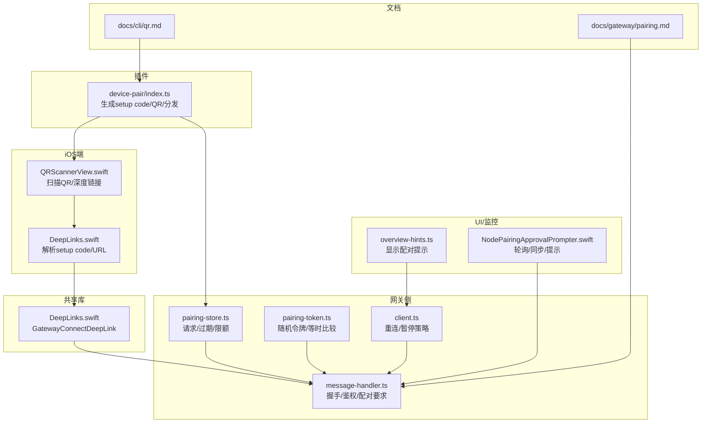

图表来源
- [apps/ios/Sources/Onboarding/QRScannerView.swift:1-97](file://apps/ios/Sources/Onboarding/QRScannerView.swift#L1-L97)
- [apps/shared/OpenClawKit/Sources/OpenClawKit/DeepLinks.swift:1-35](file://apps/shared/OpenClawKit/Sources/OpenClawKit/DeepLinks.swift#L1-L35)
- [extensions/device-pair/index.ts:293-314](file://extensions/device-pair/index.ts#L293-L314)
- [src/pairing/pairing-store.ts:13-26](file://src/pairing/pairing-store.ts#L13-L26)
- [src/infra/pairing-token.ts:1-12](file://src/infra/pairing-token.ts#L1-L12)
- [src/gateway/server/ws-connection/message-handler.ts:870-895](file://src/gateway/server/ws-connection/message-handler.ts#L870-L895)
- [src/gateway/client.ts:417-444](file://src/gateway/client.ts#L417-L444)
- [docs/gateway/pairing.md:1-100](file://docs/gateway/pairing.md#L1-L100)
- [docs/cli/qr.md:1-32](file://docs/cli/qr.md#L1-L32)
- [apps/macos/Sources/OpenClaw/NodePairingApprovalPrompter.swift:138-171](file://apps/macos/Sources/OpenClaw/NodePairingApprovalPrompter.swift#L138-L171)
- [ui/src/ui/views/overview-hints.ts:1-16](file://ui/src/ui/views/overview-hints.ts#L1-L16)

章节来源
- [apps/ios/Sources/Onboarding/QRScannerView.swift:1-97](file://apps/ios/Sources/Onboarding/QRScannerView.swift#L1-L97)
- [apps/shared/OpenClawKit/Sources/OpenClawKit/DeepLinks.swift:1-35](file://apps/shared/OpenClawKit/Sources/OpenClawKit/DeepLinks.swift#L1-L35)
- [extensions/device-pair/index.ts:293-314](file://extensions/device-pair/index.ts#L293-L314)
- [src/pairing/pairing-store.ts:13-26](file://src/pairing/pairing-store.ts#L13-L26)
- [src/infra/pairing-token.ts:1-12](file://src/infra/pairing-token.ts#L1-L12)
- [src/gateway/server/ws-connection/message-handler.ts:870-895](file://src/gateway/server/ws-connection/message-handler.ts#L870-L895)
- [src/gateway/client.ts:417-444](file://src/gateway/client.ts#L417-L444)
- [docs/gateway/pairing.md:1-100](file://docs/gateway/pairing.md#L1-L100)
- [docs/cli/qr.md:1-32](file://docs/cli/qr.md#L1-L32)
- [apps/macos/Sources/OpenClaw/NodePairingApprovalPrompter.swift:138-171](file://apps/macos/Sources/OpenClaw/NodePairingApprovalPrompter.swift#L138-L171)
- [ui/src/ui/views/overview-hints.ts:1-16](file://ui/src/ui/views/overview-hints.ts#L1-L16)

## 核心组件
- iOS QR扫描与深度链接解析：负责从QR或文本输入中提取网关连接信息（URL、TLS、可选token或password），并触发后续连接流程。
- 配对存储与限额：维护待审批的配对请求、去重、过期清理、最大请求数限制。
- 随机令牌与安全比较：生成一次性配对令牌，使用常量时间比较防止时序攻击。
- 网关握手与鉴权：在握手阶段检查是否需要配对，必要时返回“配对所需”的错误码并关闭连接；允许静默配对场景。
- 插件生成与分发：根据当前网关配置生成setup code/QR，并在各渠道（如Telegram）发送。
- 连接客户端重连策略：针对认证失败（含配对所需）进行暂停与指数退避，避免风暴。
- UI与监控：在控制台/UI中提示“需要配对”，并轮询等待审批结果。

章节来源
- [apps/ios/Sources/Onboarding/QRScannerView.swift:61-84](file://apps/ios/Sources/Onboarding/QRScannerView.swift#L61-L84)
- [apps/shared/OpenClawKit/Sources/OpenClawKit/DeepLinks.swift:28-35](file://apps/shared/OpenClawKit/Sources/OpenClawKit/DeepLinks.swift#L28-L35)
- [src/pairing/pairing-store.ts:171-190](file://src/pairing/pairing-store.ts#L171-L190)
- [src/infra/pairing-token.ts:1-12](file://src/infra/pairing-token.ts#L1-L12)
- [src/gateway/server/ws-connection/message-handler.ts:870-895](file://src/gateway/server/ws-connection/message-handler.ts#L870-L895)
- [extensions/device-pair/index.ts:293-314](file://extensions/device-pair/index.ts#L293-L314)
- [src/gateway/client.ts:417-444](file://src/gateway/client.ts#L417-L444)
- [ui/src/ui/views/overview-hints.ts:1-16](file://ui/src/ui/views/overview-hints.ts#L1-L16)

## 架构总览
下图展示了从iOS端扫描到网关侧鉴权的整体流程，包括QR/深度链接解析、配对请求创建、审批与令牌发放、以及客户端重连与错误恢复。

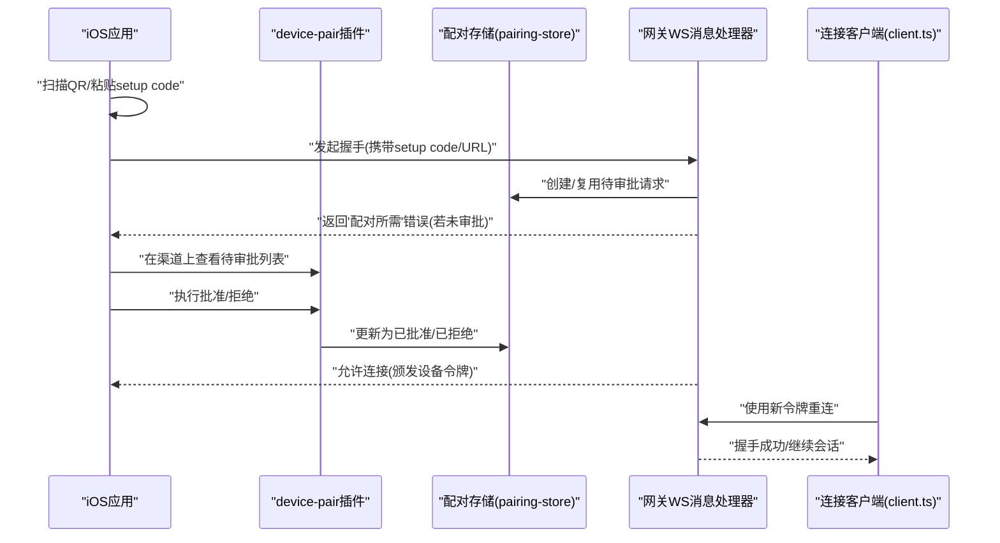

图表来源
- [apps/ios/Sources/Onboarding/QRScannerView.swift:61-84](file://apps/ios/Sources/Onboarding/QRScannerView.swift#L61-L84)
- [extensions/device-pair/index.ts:343-394](file://extensions/device-pair/index.ts#L343-L394)
- [src/pairing/pairing-store.ts:697-797](file://src/pairing/pairing-store.ts#L697-L797)
- [src/gateway/server/ws-connection/message-handler.ts:870-895](file://src/gateway/server/ws-connection/message-handler.ts#L870-L895)
- [src/gateway/client.ts:417-444](file://src/gateway/client.ts#L417-L444)

## 详细组件分析

### iOS端QR扫描与深度链接解析
- 能力概述
  - 使用VisionKit扫描QR码，优先识别“setup code”（base64url编码的JSON，包含网关URL与可选认证参数），其次解析深度链接URL。
  - 一旦识别到有效载荷，回调上层以启动连接流程。
- 错误处理
  - 对相机不可用、扫描器不支持等场景进行一次性错误上报，避免重复弹窗。
- 用户体验
  - 扫描成功后立即停止扫描，避免重复触发。

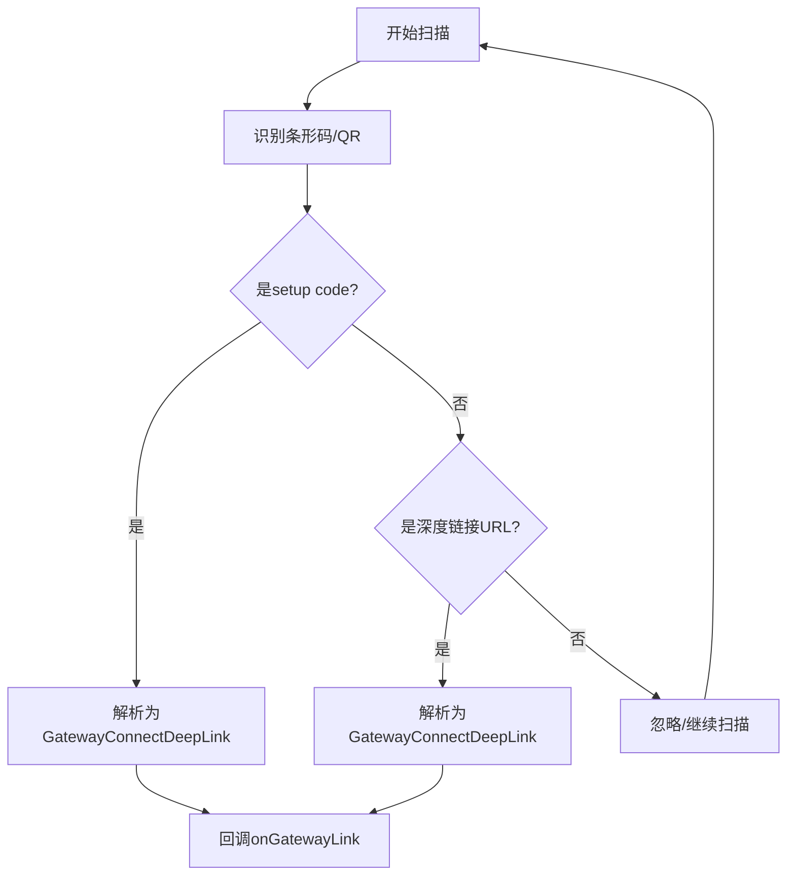

图表来源
- [apps/ios/Sources/Onboarding/QRScannerView.swift:61-84](file://apps/ios/Sources/Onboarding/QRScannerView.swift#L61-L84)
- [apps/shared/OpenClawKit/Sources/OpenClawKit/DeepLinks.swift:28-35](file://apps/shared/OpenClawKit/Sources/OpenClawKit/DeepLinks.swift#L28-L35)

章节来源
- [apps/ios/Sources/Onboarding/QRScannerView.swift:1-97](file://apps/ios/Sources/Onboarding/QRScannerView.swift#L1-L97)
- [apps/shared/OpenClawKit/Sources/OpenClawKit/DeepLinks.swift:1-35](file://apps/shared/OpenClawKit/Sources/OpenClawKit/DeepLinks.swift#L1-L35)

### 配对码生成与安全传输
- setup code生成
  - 将网关URL与认证参数（token或password）打包为JSON，base64url编码，去除填充字符，便于复制粘贴与QR渲染。
- QR渲染与分发
  - 在CLI/插件中生成ASCII QR，或通过Telegram等渠道发送；同时输出“下一步操作”指引。
- 深度链接解析
  - iOS端解析setup code为GatewayConnectDeepLink，提取host/port/tls/token/password等字段，构造WebSocket URL。

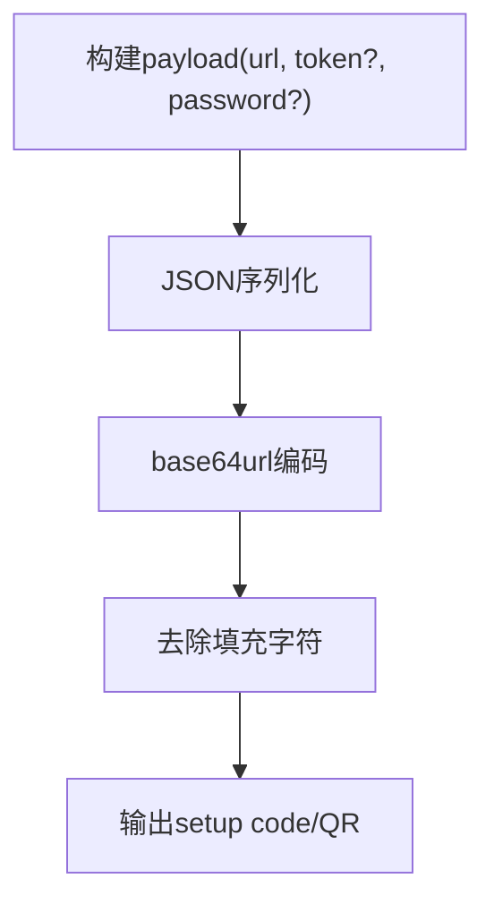

图表来源
- [extensions/device-pair/index.ts:293-297](file://extensions/device-pair/index.ts#L293-L297)
- [apps/shared/OpenClawKit/Sources/OpenClawKit/DeepLinks.swift:28-35](file://apps/shared/OpenClawKit/Sources/OpenClawKit/DeepLinks.swift#L28-L35)

章节来源
- [extensions/device-pair/index.ts:293-314](file://extensions/device-pair/index.ts#L293-L314)
- [apps/shared/OpenClawKit/Sources/OpenClawKit/DeepLinks.swift:1-35](file://apps/shared/OpenClawKit/Sources/OpenClawKit/DeepLinks.swift#L1-L35)

### 配对存储与有效期管理
- 存储结构
  - 每个通道维护一个JSON文件，保存请求列表（含id、code、创建时间、最后出现时间、元数据）。
- 去重与唯一性
  - 生成8字符字母数字组合（剔除易混淆字符），循环尝试直到唯一。
- 过期与限额
  - 默认请求有效期为固定时长；超过最大请求数时按“最后出现时间”淘汰旧请求，保留最近的若干条。
- 账户隔离
  - 支持按账户ID过滤请求，确保多账户隔离。

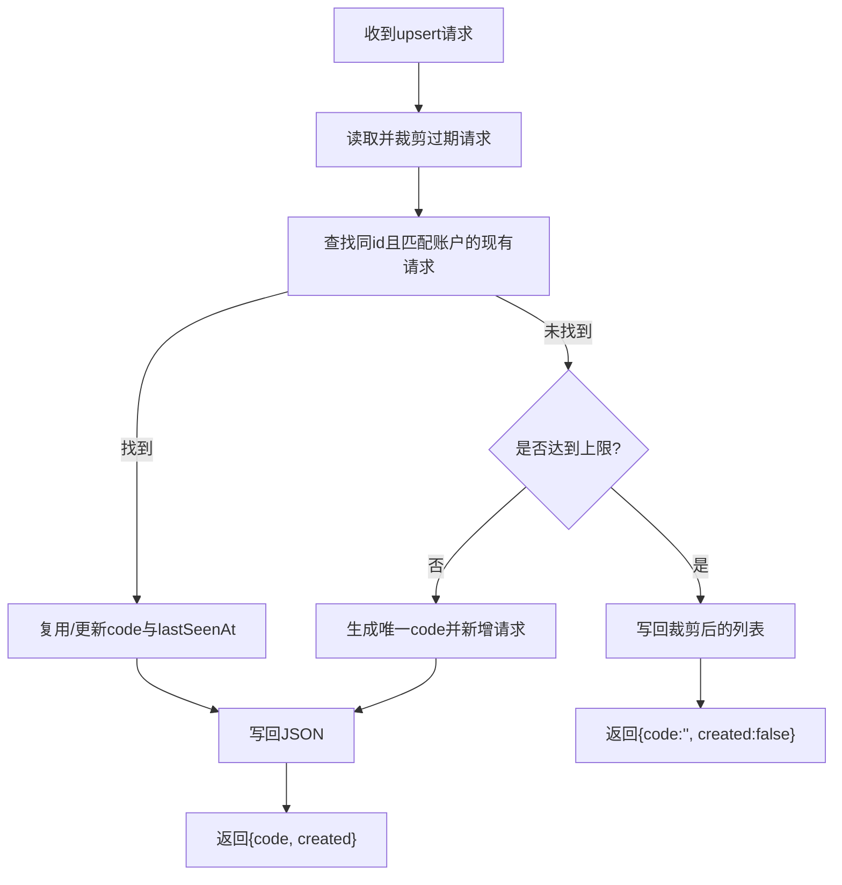

图表来源
- [src/pairing/pairing-store.ts:171-190](file://src/pairing/pairing-store.ts#L171-L190)
- [src/pairing/pairing-store.ts:196-202](file://src/pairing/pairing-store.ts#L196-L202)
- [src/pairing/pairing-store.ts:214-222](file://src/pairing/pairing-store.ts#L214-L222)
- [src/pairing/pairing-store.ts:697-797](file://src/pairing/pairing-store.ts#L697-L797)

章节来源
- [src/pairing/pairing-store.ts:13-26](file://src/pairing/pairing-store.ts#L13-L26)
- [src/pairing/pairing-store.ts:171-190](file://src/pairing/pairing-store.ts#L171-L190)
- [src/pairing/pairing-store.ts:196-202](file://src/pairing/pairing-store.ts#L196-L202)
- [src/pairing/pairing-store.ts:214-222](file://src/pairing/pairing-store.ts#L214-L222)
- [src/pairing/pairing-store.ts:697-797](file://src/pairing/pairing-store.ts#L697-L797)

### 网关握手与安全验证
- 握手阶段
  - 若节点未配对或元数据升级，网关返回“配对所需”错误并关闭连接；允许静默配对场景。
- 访问控制
  - 已配对节点的平台/设备族/角色/作用域变更需重新配对确认。
- 令牌颁发
  - 审批后颁发一次性设备令牌，用于后续连接。

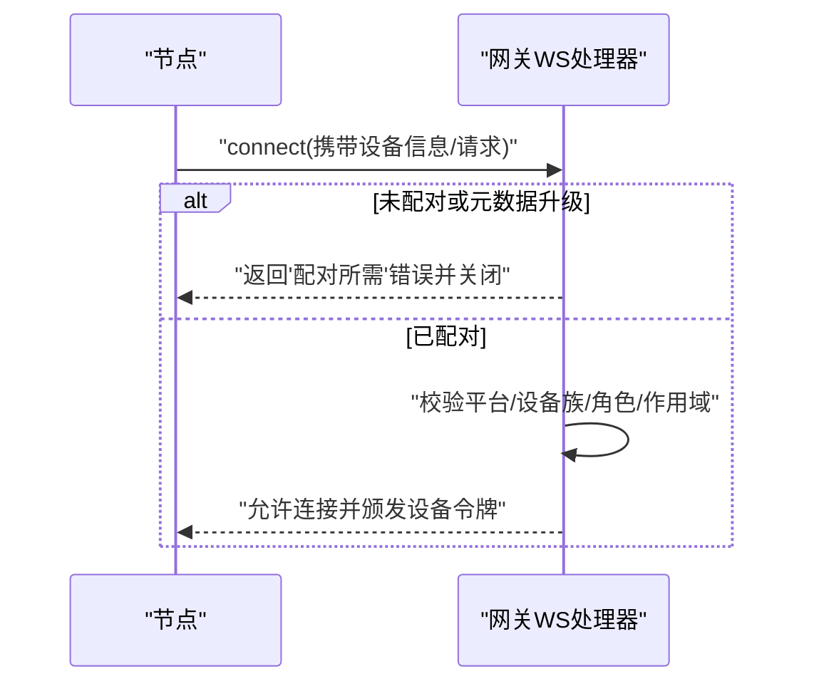

图表来源
- [src/gateway/server/ws-connection/message-handler.ts:870-895](file://src/gateway/server/ws-connection/message-handler.ts#L870-L895)
- [src/gateway/server/ws-connection/message-handler.ts:897-983](file://src/gateway/server/ws-connection/message-handler.ts#L897-L983)

章节来源
- [src/gateway/server/ws-connection/message-handler.ts:870-895](file://src/gateway/server/ws-connection/message-handler.ts#L870-L895)
- [src/gateway/server/ws-connection/message-handler.ts:897-983](file://src/gateway/server/ws-connection/message-handler.ts#L897-L983)

### 随机令牌与安全比较
- 令牌生成
  - 使用安全随机源生成指定长度字节，再进行base64url编码，适合作为一次性凭据。
- 安全比较
  - 使用常量时间比较函数，避免时序侧信道泄露。

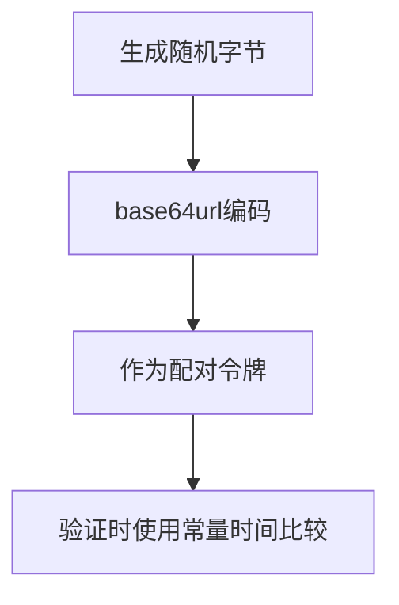

图表来源
- [src/infra/pairing-token.ts:1-12](file://src/infra/pairing-token.ts#L1-L12)

章节来源
- [src/infra/pairing-token.ts:1-12](file://src/infra/pairing-token.ts#L1-L12)

### 插件：生成QR与设置码
- 功能
  - 解析网关URL与认证方式（token或password），生成setup code与ASCII QR，按渠道发送。
  - 提供CLI命令/status/approve/notify等子命令，便于无人值守环境。
- 输出格式
  - 支持仅输出设置码、JSON格式输出等选项。

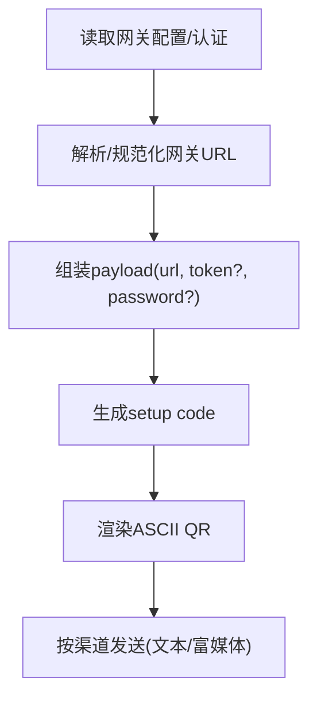

图表来源
- [extensions/device-pair/index.ts:190-242](file://extensions/device-pair/index.ts#L190-L242)
- [extensions/device-pair/index.ts:244-291](file://extensions/device-pair/index.ts#L244-L291)
- [extensions/device-pair/index.ts:293-314](file://extensions/device-pair/index.ts#L293-L314)
- [extensions/device-pair/index.ts:326-548](file://extensions/device-pair/index.ts#L326-L548)

章节来源
- [extensions/device-pair/index.ts:190-242](file://extensions/device-pair/index.ts#L190-L242)
- [extensions/device-pair/index.ts:244-291](file://extensions/device-pair/index.ts#L244-L291)
- [extensions/device-pair/index.ts:293-314](file://extensions/device-pair/index.ts#L293-L314)
- [extensions/device-pair/index.ts:326-548](file://extensions/device-pair/index.ts#L326-L548)
- [docs/cli/qr.md:1-32](file://docs/cli/qr.md#L1-L32)

### 连接客户端重连与故障恢复
- 暂停策略
  - 遇到“缺少令牌/密码/配对所需/速率限制/设备身份缺失”等情况，暂停重连，避免风暴。
- 退避与恢复
  - 指数退避至上限；当检测到可信端点且具备设备令牌预算时，允许重试。
- UI提示
  - 控制台/UI根据错误细节显示“需要配对”的引导提示。

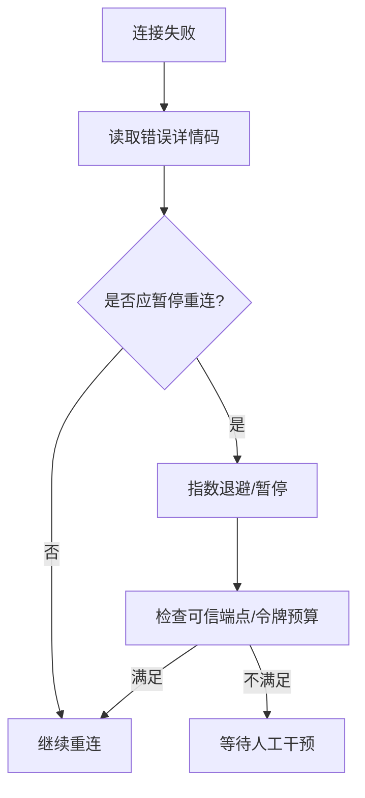

图表来源
- [src/gateway/client.ts:417-444](file://src/gateway/client.ts#L417-L444)
- [src/gateway/client.ts:576-587](file://src/gateway/client.ts#L576-L587)
- [ui/src/ui/views/overview-hints.ts:1-16](file://ui/src/ui/views/overview-hints.ts#L1-L16)

章节来源
- [src/gateway/client.ts:417-444](file://src/gateway/client.ts#L417-L444)
- [src/gateway/client.ts:576-587](file://src/gateway/client.ts#L576-L587)
- [ui/src/ui/views/overview-hints.ts:1-16](file://ui/src/ui/views/overview-hints.ts#L1-L16)

### 配对状态监控与自动通知
- 轮询与同步
  - macOS端定期拉取配对列表，入队缺失的请求，保持多实例间一致。
- 自动通知
  - 在某些渠道（如Telegram）可一次性开启“配对到达即提醒”，减少等待。

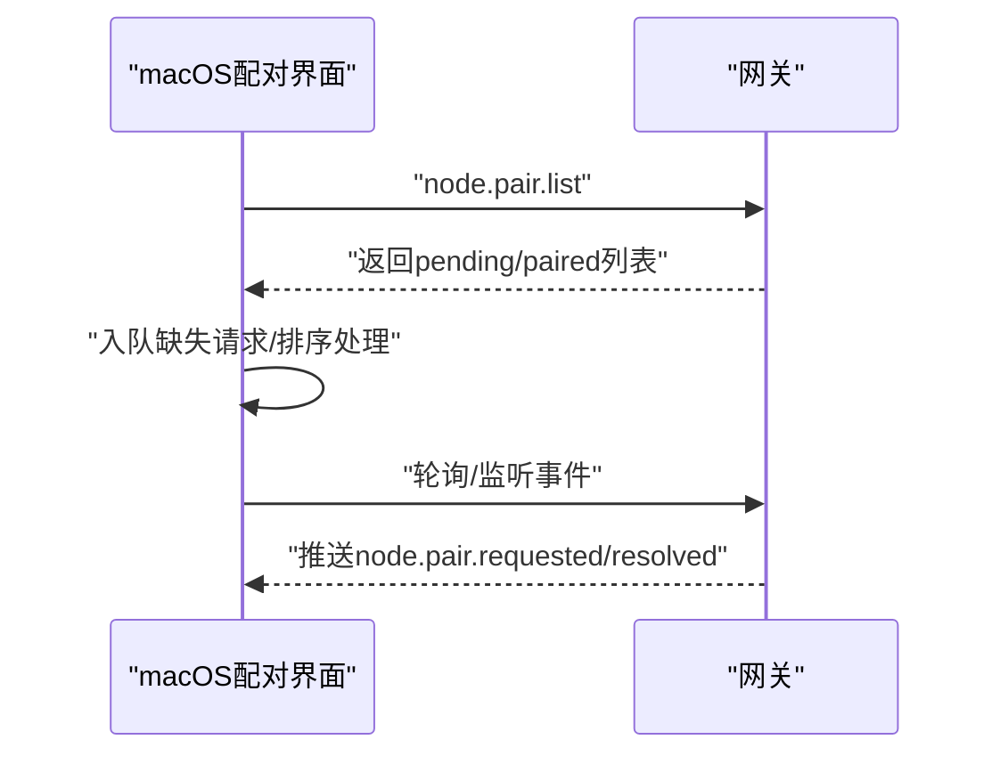

图表来源
- [apps/macos/Sources/OpenClaw/NodePairingApprovalPrompter.swift:138-171](file://apps/macos/Sources/OpenClaw/NodePairingApprovalPrompter.swift#L138-L171)
- [apps/macos/Sources/OpenClaw/NodePairingApprovalPrompter.swift:549-574](file://apps/macos/Sources/OpenClaw/NodePairingApprovalPrompter.swift#L549-L574)

章节来源
- [apps/macos/Sources/OpenClaw/NodePairingApprovalPrompter.swift:138-171](file://apps/macos/Sources/OpenClaw/NodePairingApprovalPrompter.swift#L138-L171)
- [apps/macos/Sources/OpenClaw/NodePairingApprovalPrompter.swift:549-574](file://apps/macos/Sources/OpenClaw/NodePairingApprovalPrompter.swift#L549-L574)

## 依赖关系分析
- iOS端依赖共享库解析深度链接，再与网关握手。
- 插件依赖网关配置与认证信息，生成setup code并分发。
- 网关侧握手逻辑依赖配对存储与令牌模块。
- 客户端重连策略依赖错误细节码与可信端点判断。
- UI与监控依赖错误细节码显示配对提示。

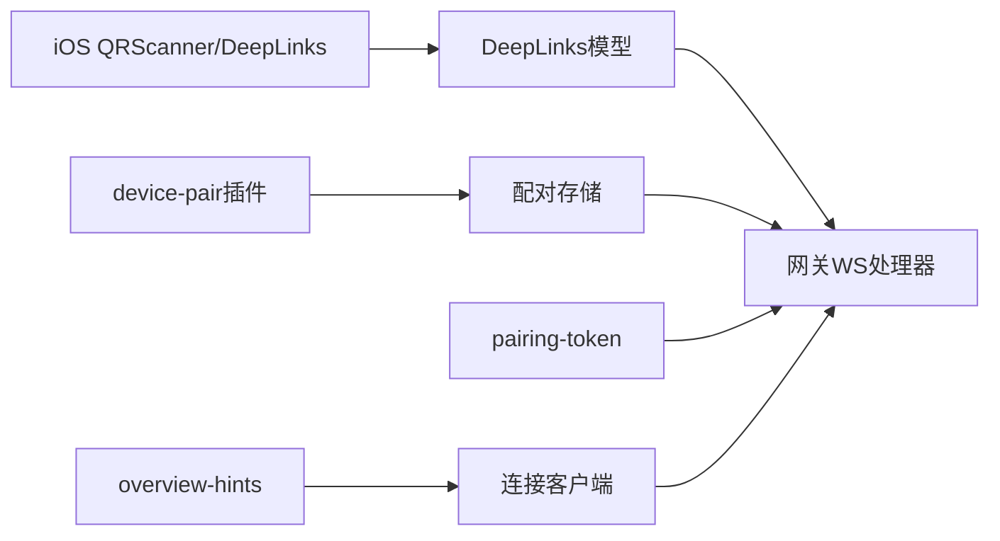

图表来源
- [apps/ios/Sources/Onboarding/QRScannerView.swift:61-84](file://apps/ios/Sources/Onboarding/QRScannerView.swift#L61-L84)
- [apps/shared/OpenClawKit/Sources/OpenClawKit/DeepLinks.swift:28-35](file://apps/shared/OpenClawKit/Sources/OpenClawKit/DeepLinks.swift#L28-L35)
- [extensions/device-pair/index.ts:293-314](file://extensions/device-pair/index.ts#L293-L314)
- [src/pairing/pairing-store.ts:697-797](file://src/pairing/pairing-store.ts#L697-L797)
- [src/infra/pairing-token.ts:1-12](file://src/infra/pairing-token.ts#L1-L12)
- [src/gateway/server/ws-connection/message-handler.ts:870-895](file://src/gateway/server/ws-connection/message-handler.ts#L870-L895)
- [src/gateway/client.ts:417-444](file://src/gateway/client.ts#L417-L444)
- [ui/src/ui/views/overview-hints.ts:1-16](file://ui/src/ui/views/overview-hints.ts#L1-L16)

章节来源
- [apps/ios/Sources/Onboarding/QRScannerView.swift:1-97](file://apps/ios/Sources/Onboarding/QRScannerView.swift#L1-L97)
- [apps/shared/OpenClawKit/Sources/OpenClawKit/DeepLinks.swift:1-35](file://apps/shared/OpenClawKit/Sources/OpenClawKit/DeepLinks.swift#L1-L35)
- [extensions/device-pair/index.ts:293-314](file://extensions/device-pair/index.ts#L293-L314)
- [src/pairing/pairing-store.ts:697-797](file://src/pairing/pairing-store.ts#L697-L797)
- [src/infra/pairing-token.ts:1-12](file://src/infra/pairing-token.ts#L1-L12)
- [src/gateway/server/ws-connection/message-handler.ts:870-895](file://src/gateway/server/ws-connection/message-handler.ts#L870-L895)
- [src/gateway/client.ts:417-444](file://src/gateway/client.ts#L417-L444)
- [ui/src/ui/views/overview-hints.ts:1-16](file://ui/src/ui/views/overview-hints.ts#L1-L16)

## 性能考量
- 配对存储采用文件锁与原子写入，避免并发冲突；裁剪过期与限额操作在内存中完成，写回时批量落盘。
- iOS扫描器仅在首次识别到有效载荷后回调，避免重复处理。
- 插件渲染ASCII QR为同步阻塞任务，建议在后台线程执行，避免阻塞主线程。
- 客户端指数退避避免风暴，结合可信端点判断减少无效重试。

## 故障排查指南
- 常见原因
  - 网关未启用配对或处于远程模式但未正确配置URL/认证。
  - setup code/QR内容不完整或被修改。
  - 节点与网关之间网络不可达或端口受限。
  - 审批超时或未及时批准导致请求过期。
  - 客户端使用了旧令牌或非可信端点。
- 排查步骤
  - 在网关侧确认配对请求是否出现在待审批列表。
  - 检查网关URL与认证参数是否正确（token/password）。
  - 确认iOS端是否成功解析setup code并发起握手。
  - 查看客户端错误详情码，判断是否为“配对所需”或“认证缺失”。
  - 如启用自动通知，确认渠道通知是否送达。
- 解决方法
  - 重新生成setup code/QR并再次扫描。
  - 在网关侧批准请求或清理过期请求。
  - 检查网络连通性与防火墙规则。
  - 清理本地缓存并使用新令牌重连。

章节来源
- [docs/gateway/pairing.md:1-100](file://docs/gateway/pairing.md#L1-L100)
- [src/gateway/server/ws-connection/message-handler.ts:870-895](file://src/gateway/server/ws-connection/message-handler.ts#L870-L895)
- [src/gateway/client.ts:417-444](file://src/gateway/client.ts#L417-L444)
- [extensions/device-pair/index.ts:343-394](file://extensions/device-pair/index.ts#L343-L394)

## 结论
OpenClaw的iOS节点配对流程以“setup code/QR + 深度链接解析 + 网关侧配对存储 + 握手鉴权”为核心，辅以安全令牌、限额与过期管理、自动通知与UI提示、以及客户端的暂停与退避策略，形成一套安全、可控、可运维的设备配对方案。遵循本文所述流程与最佳实践，可显著降低配对失败率并提升用户体验。

## 附录
- 相关文档
  - 网关配对概念与API参考：[docs/gateway/pairing.md:1-100](file://docs/gateway/pairing.md#L1-L100)
  - CLI生成QR与设置码参考：[docs/cli/qr.md:1-32](file://docs/cli/qr.md#L1-L32)