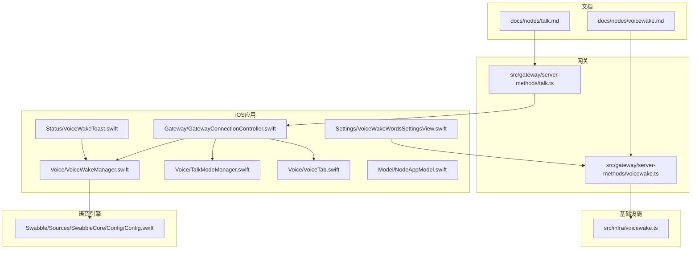
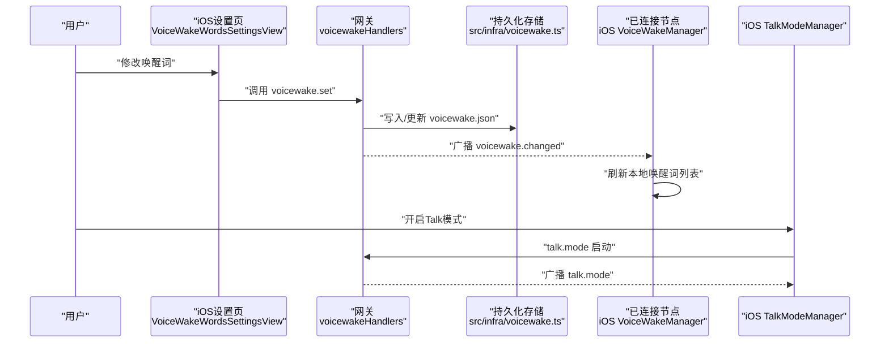
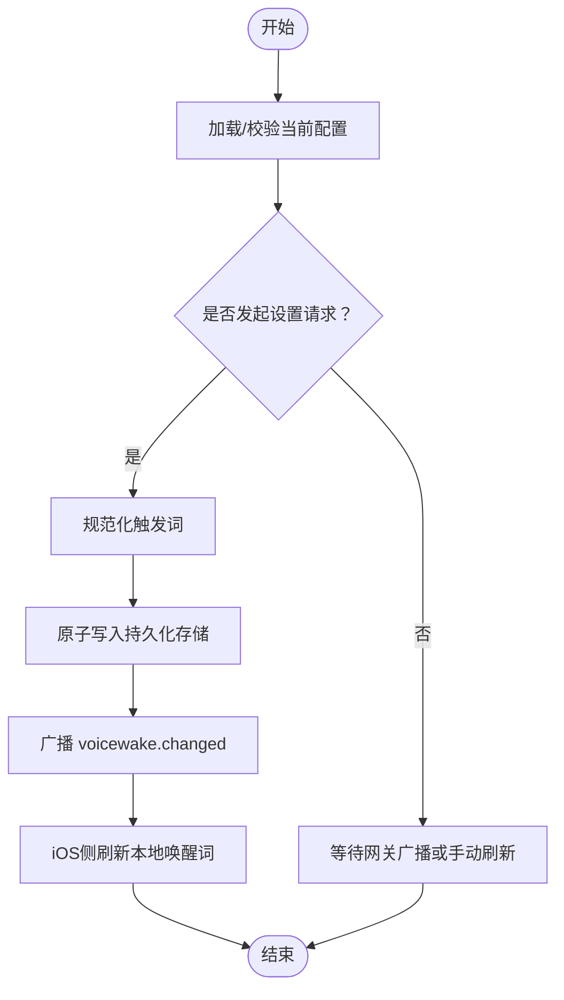
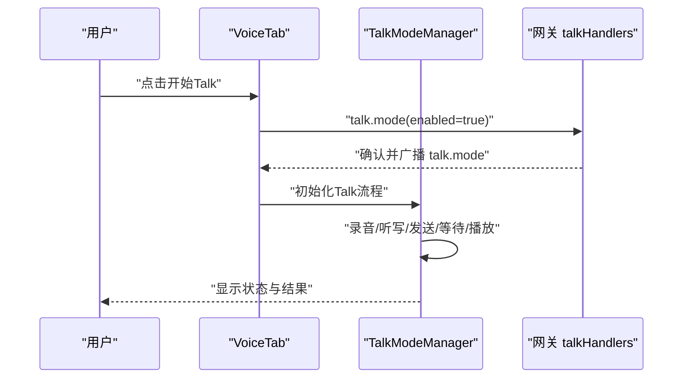
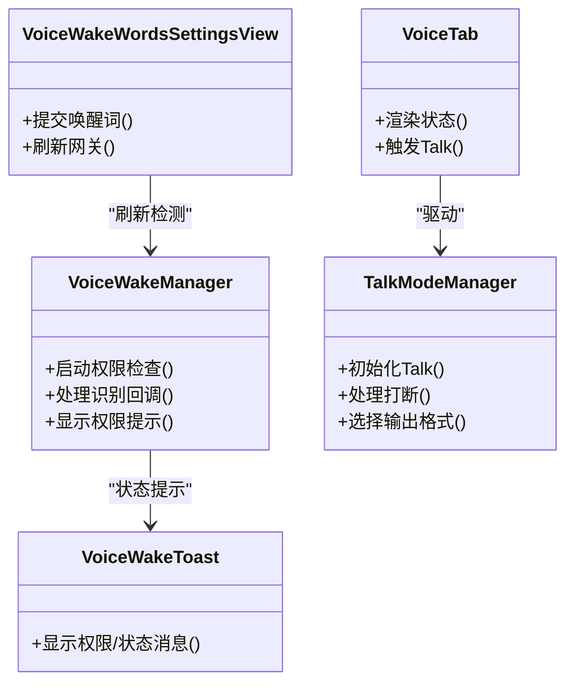
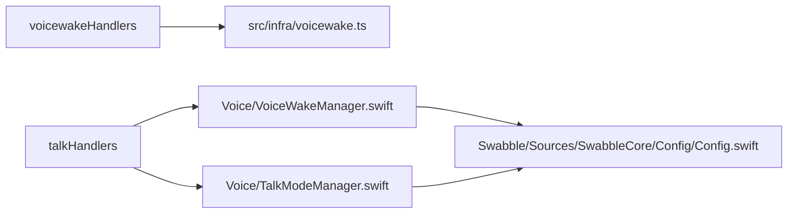

# 语音控制

<cite>
**本文引用的文件**
- [docs/nodes/voicewake.md](file://docs/nodes/voicewake.md)
- [src/gateway/server-methods/voicewake.ts](file://src/gateway/server-methods/voicewake.ts)
- [src/infra/voicewake.ts](file://src/infra/voicewake.ts)
- [docs/nodes/talk.md](file://docs/nodes/talk.md)
- [src/gateway/server-methods/talk.ts](file://src/gateway/server-methods/talk.ts)
- [apps/ios/Sources/Voice/VoiceWakeManager.swift](file://apps/ios/Sources/Voice/VoiceWakeManager.swift)
- [apps/ios/Sources/Voice/TalkModeManager.swift](file://apps/ios/Sources/Voice/TalkModeManager.swift)
- [apps/ios/Sources/Voice/VoiceTab.swift](file://apps/ios/Sources/Voice/VoiceTab.swift)
- [apps/ios/Sources/Settings/VoiceWakeWordsSettingsView.swift](file://apps/ios/Sources/Settings/VoiceWakeWordsSettingsView.swift)
- [apps/ios/Sources/Status/VoiceWakeToast.swift](file://apps/ios/Sources/Status/VoiceWakeToast.swift)
- [apps/ios/Sources/Gateway/GatewayConnectionController.swift](file://apps/ios/Sources/Gateway/GatewayConnectionController.swift)
- [apps/ios/Sources/Model/NodeAppModel.swift](file://apps/ios/Sources/Model/NodeAppModel.swift)
- [Swabble/Sources/SwabbleCore/Config/Config.swift](file://Swabble/Sources/SwabbleCore/Config/Config.swift)
</cite>

## 目录
1. [简介](#简介)
2. [项目结构](#项目结构)
3. [核心组件](#核心组件)
4. [架构总览](#架构总览)
5. [详细组件分析](#详细组件分析)
6. [依赖关系分析](#依赖关系分析)
7. [性能考虑](#性能考虑)
8. [故障排除指南](#故障排除指南)
9. [结论](#结论)
10. [附录](#附录)

## 简介
本文件面向OpenClaw iOS节点的语音控制能力，系统性阐述以下内容：
- 语音唤醒机制：全局唤醒词列表、网关同步、iOS侧检测与权限管理
- 语音转文本与命令识别：基于网关协议的Talk模式、参数配置与行为规范
- iOS节点配置：唤醒词设置入口、权限提示、状态反馈
- 使用示例与最佳实践：如何在iOS上启用并正确使用语音控制
- 性能优化：延迟、中断策略、输出格式选择
- 隐私与离线：本地处理边界、敏感信息脱敏、权限最小化
- 故障排除：常见问题定位与解决步骤

## 项目结构
围绕语音控制的关键位置如下：
- 文档层：节点级唤醒词与Talk模式说明
- 网关层：voicewake与talk的请求处理器与广播机制
- 基础设施层：voicewake配置持久化与规范化
- iOS应用层：VoiceWakeManager、TalkModeManager、VoiceTab、设置页与状态提示
- 语音引擎支持：Swabble语音配置（音频/语音）

图表来源
- [docs/nodes/voicewake.md:1-67](file://docs/nodes/voicewake.md#L1-L67)
- [docs/nodes/talk.md:1-93](file://docs/nodes/talk.md#L1-L93)
- [src/gateway/server-methods/voicewake.ts:1-35](file://src/gateway/server-methods/voicewake.ts#L1-L35)
- [src/gateway/server-methods/talk.ts:1-97](file://src/gateway/server-methods/talk.ts#L1-L97)
- [src/infra/voicewake.ts:1-60](file://src/infra/voicewake.ts#L1-L60)
- [apps/ios/Sources/Voice/VoiceWakeManager.swift](file://apps/ios/Sources/Voice/VoiceWakeManager.swift)
- [apps/ios/Sources/Voice/TalkModeManager.swift](file://apps/ios/Sources/Voice/TalkModeManager.swift)
- [apps/ios/Sources/Voice/VoiceTab.swift](file://apps/ios/Sources/Voice/VoiceTab.swift)
- [apps/ios/Sources/Settings/VoiceWakeWordsSettingsView.swift](file://apps/ios/Sources/Settings/VoiceWakeWordsSettingsView.swift)
- [apps/ios/Sources/Status/VoiceWakeToast.swift](file://apps/ios/Sources/Status/VoiceWakeToast.swift)
- [apps/ios/Sources/Gateway/GatewayConnectionController.swift](file://apps/ios/Sources/Gateway/GatewayConnectionController.swift)
- [apps/ios/Sources/Model/NodeAppModel.swift](file://apps/ios/Sources/Model/NodeAppModel.swift)
- [Swabble/Sources/SwabbleCore/Config/Config.swift:41](file://Swabble/Sources/SwabbleCore/Config/Config.swift#L41)

章节来源
- [docs/nodes/voicewake.md:1-67](file://docs/nodes/voicewake.md#L1-L67)
- [docs/nodes/talk.md:1-93](file://docs/nodes/talk.md#L1-L93)
- [src/gateway/server-methods/voicewake.ts:1-35](file://src/gateway/server-methods/voicewake.ts#L1-L35)
- [src/gateway/server-methods/talk.ts:1-97](file://src/gateway/server-methods/talk.ts#L1-L97)
- [src/infra/voicewake.ts:1-60](file://src/infra/voicewake.ts#L1-L60)

## 核心组件
- 全局唤醒词服务
  - 网关持有全局唤醒词列表，提供查询与设置方法，并在变更时广播给所有客户端与已连接节点。
  - iOS侧通过VoiceWakeManager消费该列表进行触发检测；设置页调用网关接口更新列表。
- Talk模式
  - 网关提供talk.config与talk.mode两类方法，分别用于读取/下发Talk配置与控制Talk模式启停。
  - iOS侧TalkModeManager负责根据配置执行连续语音对话流程（听写→推理→播放）。
- iOS语音模块
  - VoiceWakeManager：负责麦克风与语音识别权限检查、唤醒词检测回调、错误提示。
  - TalkModeManager：封装Talk模式生命周期、中断策略、输出格式等。
  - VoiceTab与设置页：用户交互入口，展示状态与进行参数调整。
  - 状态提示：VoiceWakeToast用于向用户反馈权限或检测状态。

章节来源
- [docs/nodes/voicewake.md:30-67](file://docs/nodes/voicewake.md#L30-L67)
- [src/gateway/server-methods/voicewake.ts:7-34](file://src/gateway/server-methods/voicewake.ts#L7-L34)
- [src/gateway/server-methods/talk.ts:21-96](file://src/gateway/server-methods/talk.ts#L21-L96)
- [apps/ios/Sources/Voice/VoiceWakeManager.swift](file://apps/ios/Sources/Voice/VoiceWakeManager.swift)
- [apps/ios/Sources/Voice/TalkModeManager.swift](file://apps/ios/Sources/Voice/TalkModeManager.swift)
- [apps/ios/Sources/Voice/VoiceTab.swift](file://apps/ios/Sources/Voice/VoiceTab.swift)
- [apps/ios/Sources/Settings/VoiceWakeWordsSettingsView.swift](file://apps/ios/Sources/Settings/VoiceWakeWordsSettingsView.swift)
- [apps/ios/Sources/Status/VoiceWakeToast.swift](file://apps/ios/Sources/Status/VoiceWakeToast.swift)

## 架构总览
下图展示了从用户设置到网关同步再到iOS运行时检测与Talk模式执行的整体流程。

图表来源
- [src/gateway/server-methods/voicewake.ts:16-33](file://src/gateway/server-methods/voicewake.ts#L16-L33)
- [src/infra/voicewake.ts:30-59](file://src/infra/voicewake.ts#L30-L59)
- [apps/ios/Sources/Voice/VoiceWakeManager.swift](file://apps/ios/Sources/Voice/VoiceWakeManager.swift)
- [src/gateway/server-methods/talk.ts:68-95](file://src/gateway/server-methods/talk.ts#L68-L95)

## 详细组件分析

### 语音唤醒（全局唤醒词）
- 设计要点
  - 全局列表由网关持有，所有节点共享同一份触发词集合。
  - 支持查询、设置与事件广播；设置后立即持久化并通知其他客户端。
  - iOS侧本地保留“启用/禁用”开关与权限状态，但不保存自定义触发词。
- 数据模型与持久化
  - 结构包含触发词数组与更新时间戳；默认触发词集可在缺失时回退。
  - 写入采用原子写，保证并发安全。
- iOS集成
  - 设置页调用网关接口更新触发词；VoiceWakeManager监听网关广播并刷新本地检测。
  - 权限检查与提示：当麦克风或语音识别权限未授权时，给出明确提示。

图表来源
- [src/gateway/server-methods/voicewake.ts:16-33](file://src/gateway/server-methods/voicewake.ts#L16-L33)
- [src/infra/voicewake.ts:30-59](file://src/infra/voicewake.ts#L30-L59)
- [apps/ios/Sources/Voice/VoiceWakeManager.swift](file://apps/ios/Sources/Voice/VoiceWakeManager.swift)

章节来源
- [docs/nodes/voicewake.md:9-67](file://docs/nodes/voicewake.md#L9-L67)
- [src/gateway/server-methods/voicewake.ts:7-34](file://src/gateway/server-methods/voicewake.ts#L7-L34)
- [src/infra/voicewake.ts:5-59](file://src/infra/voicewake.ts#L5-L59)
- [apps/ios/Sources/Settings/VoiceWakeWordsSettingsView.swift](file://apps/ios/Sources/Settings/VoiceWakeWordsSettingsView.swift)
- [apps/ios/Sources/Voice/VoiceWakeManager.swift](file://apps/ios/Sources/Voice/VoiceWakeManager.swift)

### Talk模式（语音转文本与命令识别）
- 流程概述
  - 连续语音对话循环：听写→发送到会话→等待响应→播放TTS。
  - 支持短暂停顿自动提交、语音打断、回复中可携带一次性语音指令等。
- 配置与参数
  - 支持语音ID、模型ID、输出格式、静默超时、是否打断等。
  - 平台差异：iOS默认静默窗口与其他平台不同；可强制MP3以降低延迟。
- 网关接口
  - talk.config：读取Talk配置，按权限决定是否包含密钥。
  - talk.mode：控制Talk模式启停，向所有客户端广播状态。

图表来源
- [docs/nodes/talk.md:11-93](file://docs/nodes/talk.md#L11-L93)
- [src/gateway/server-methods/talk.ts:21-96](file://src/gateway/server-methods/talk.ts#L21-L96)
- [apps/ios/Sources/Voice/VoiceTab.swift](file://apps/ios/Sources/Voice/VoiceTab.swift)
- [apps/ios/Sources/Voice/TalkModeManager.swift](file://apps/ios/Sources/Voice/TalkModeManager.swift)

章节来源
- [docs/nodes/talk.md:11-93](file://docs/nodes/talk.md#L11-L93)
- [src/gateway/server-methods/talk.ts:21-96](file://src/gateway/server-methods/talk.ts#L21-L96)
- [apps/ios/Sources/Voice/TalkModeManager.swift](file://apps/ios/Sources/Voice/TalkModeManager.swift)
- [apps/ios/Sources/Voice/VoiceTab.swift](file://apps/ios/Sources/Voice/VoiceTab.swift)

### iOS语音模块类关系
- VoiceWakeManager：负责权限检查、唤醒词检测、错误处理与状态提示。
- TalkModeManager：封装Talk模式生命周期、中断策略、输出格式与平台差异。
- VoiceTab与设置页：用户交互界面，驱动上述管理器工作。
- 状态提示：VoiceWakeToast统一呈现权限与检测状态。

图表来源
- [apps/ios/Sources/Voice/VoiceWakeManager.swift](file://apps/ios/Sources/Voice/VoiceWakeManager.swift)
- [apps/ios/Sources/Voice/TalkModeManager.swift](file://apps/ios/Sources/Voice/TalkModeManager.swift)
- [apps/ios/Sources/Voice/VoiceTab.swift](file://apps/ios/Sources/Voice/VoiceTab.swift)
- [apps/ios/Sources/Settings/VoiceWakeWordsSettingsView.swift](file://apps/ios/Sources/Settings/VoiceWakeWordsSettingsView.swift)
- [apps/ios/Sources/Status/VoiceWakeToast.swift](file://apps/ios/Sources/Status/VoiceWakeToast.swift)

章节来源
- [apps/ios/Sources/Voice/VoiceWakeManager.swift](file://apps/ios/Sources/Voice/VoiceWakeManager.swift)
- [apps/ios/Sources/Voice/TalkModeManager.swift](file://apps/ios/Sources/Voice/TalkModeManager.swift)
- [apps/ios/Sources/Voice/VoiceTab.swift](file://apps/ios/Sources/Voice/VoiceTab.swift)
- [apps/ios/Sources/Settings/VoiceWakeWordsSettingsView.swift](file://apps/ios/Sources/Settings/VoiceWakeWordsSettingsView.swift)
- [apps/ios/Sources/Status/VoiceWakeToast.swift](file://apps/ios/Sources/Status/VoiceWakeToast.swift)

### iOS语音触发配置与权限
- 触发配置
  - 在设置页修改唤醒词后，调用网关接口更新；随后接收广播并刷新本地检测。
- 权限管理
  - 需要麦克风与语音识别权限；未授权时显示提示并阻断功能。
- 状态反馈
  - 通过VoiceWakeToast向用户展示当前权限与检测状态，便于快速诊断。

章节来源
- [apps/ios/Sources/Settings/VoiceWakeWordsSettingsView.swift](file://apps/ios/Sources/Settings/VoiceWakeWordsSettingsView.swift)
- [apps/ios/Sources/Voice/VoiceWakeManager.swift](file://apps/ios/Sources/Voice/VoiceWakeManager.swift)
- [apps/ios/Sources/Status/VoiceWakeToast.swift](file://apps/ios/Sources/Status/VoiceWakeToast.swift)

### 语音参数与平台差异
- 输出格式与延迟
  - iOS默认PCM采样率较高以降低延迟；可切换MP3以获得更低的网络开销。
- 中断策略
  - 默认允许用户在助手说话时打断；可按需调整。
- 静默超时
  - 平台默认静默窗口不同，iOS与macOS/Android略有差异，可根据场景调整。

章节来源
- [docs/nodes/talk.md:50-93](file://docs/nodes/talk.md#L50-L93)

## 依赖关系分析
- 网关层对基础设施层的依赖
  - voicewakeHandlers依赖src/infra/voicewake.ts进行配置读写与规范化。
- iOS层对网关层的依赖
  - VoiceWakeManager与TalkModeManager通过WebSocket与网关通信，依赖talk.config与talk.mode等方法。
- 语音引擎支持
  - Swabble的Config提供音频/语音配置项，为底层录音与转写提供基础能力。

图表来源
- [src/gateway/server-methods/voicewake.ts:1-35](file://src/gateway/server-methods/voicewake.ts#L1-L35)
- [src/infra/voicewake.ts:1-60](file://src/infra/voicewake.ts#L1-L60)
- [src/gateway/server-methods/talk.ts:1-97](file://src/gateway/server-methods/talk.ts#L1-L97)
- [apps/ios/Sources/Voice/VoiceWakeManager.swift](file://apps/ios/Sources/Voice/VoiceWakeManager.swift)
- [apps/ios/Sources/Voice/TalkModeManager.swift](file://apps/ios/Sources/Voice/TalkModeManager.swift)
- [Swabble/Sources/SwabbleCore/Config/Config.swift:41](file://Swabble/Sources/SwabbleCore/Config/Config.swift#L41)

章节来源
- [src/gateway/server-methods/voicewake.ts:1-35](file://src/gateway/server-methods/voicewake.ts#L1-L35)
- [src/infra/voicewake.ts:1-60](file://src/infra/voicewake.ts#L1-L60)
- [src/gateway/server-methods/talk.ts:1-97](file://src/gateway/server-methods/talk.ts#L1-L97)
- [Swabble/Sources/SwabbleCore/Config/Config.swift:41](file://Swabble/Sources/SwabbleCore/Config/Config.swift#L41)

## 性能考虑
- 延迟优化
  - 优先选择适合平台的输出格式（如iOS默认PCM），必要时切换MP3以平衡带宽与延迟。
  - 调整静默超时以适配用户习惯，减少误触发与延迟。
- 中断策略
  - 默认允许打断，提升交互流畅度；若需要更严格的连续播放，可关闭打断。
- 平台差异
  - iOS与macOS/Android的静默窗口不同，应按平台特性微调参数。
- 本地处理边界
  - 唤醒词检测与权限检查在本地完成，避免不必要的网络往返；Talk模式的听写与推理在网关侧进行，确保一致性与稳定性。

章节来源
- [docs/nodes/talk.md:50-93](file://docs/nodes/talk.md#L50-L93)

## 故障排除指南
- 唤醒词不生效
  - 检查设置页是否成功提交并收到网关广播；确认本地是否已刷新唤醒词列表。
  - 若无广播，尝试重新连接网关或手动刷新。
- 权限问题
  - 未授予麦克风或语音识别权限会导致无法检测唤醒词或开始Talk模式。
  - 查看VoiceWakeToast提示，按指引前往系统设置授权。
- Talk模式不可用
  - 确认已连接iOS/Android节点；网关在无移动节点时会拒绝talk.mode请求。
  - 检查Talk配置是否正确，包括API密钥与输出格式。
- 语音播放异常
  - 尝试切换输出格式（PCM/MP3）以观察延迟变化。
  - 关闭打断测试是否为打断导致的提前停止。

章节来源
- [src/gateway/server-methods/talk.ts:68-95](file://src/gateway/server-methods/talk.ts#L68-L95)
- [apps/ios/Sources/Status/VoiceWakeToast.swift](file://apps/ios/Sources/Status/VoiceWakeToast.swift)
- [apps/ios/Sources/Voice/VoiceWakeManager.swift](file://apps/ios/Sources/Voice/VoiceWakeManager.swift)

## 结论
OpenClaw在iOS节点上的语音控制以“全局唤醒词+网关协议”的方式实现了跨平台一致体验。通过清晰的权限管理、可配置的Talk模式以及本地化的状态提示，用户可以在保证隐私与性能的前提下，便捷地使用语音唤醒与连续对话功能。建议在实际部署中结合设备性能与网络状况，合理选择输出格式与静默超时，并持续关注权限状态以确保功能稳定可用。

## 附录
- 使用示例（步骤化）
  1) 在设置页修改唤醒词并提交，等待网关广播生效。
  2) 打开VoiceTab，确认权限已授权且VoiceWakeToast显示正常。
  3) 开始Talk模式，观察状态变化与播放效果。
  4) 如需调整，返回设置页修改参数并重试。
- 最佳实践
  - 保持唤醒词简洁明确，避免与环境噪音混淆。
  - 在安静环境下测试静默超时，逐步调优至合适值。
  - 对于低带宽场景，优先考虑MP3输出格式以降低延迟。
  - 定期检查权限状态，避免因权限变更导致功能失效。